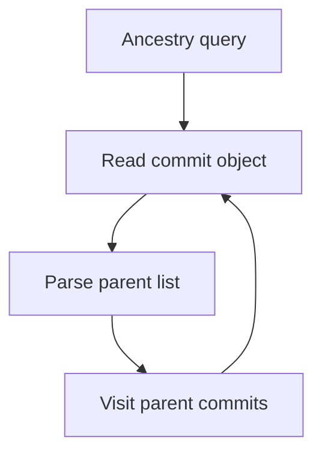
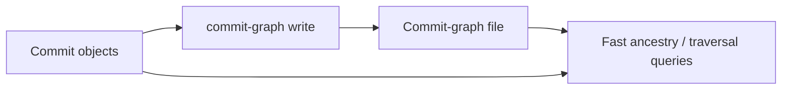
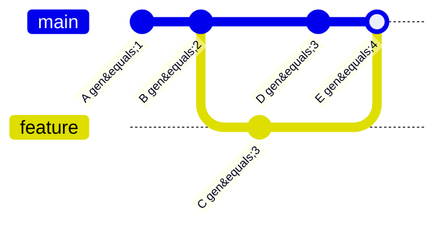
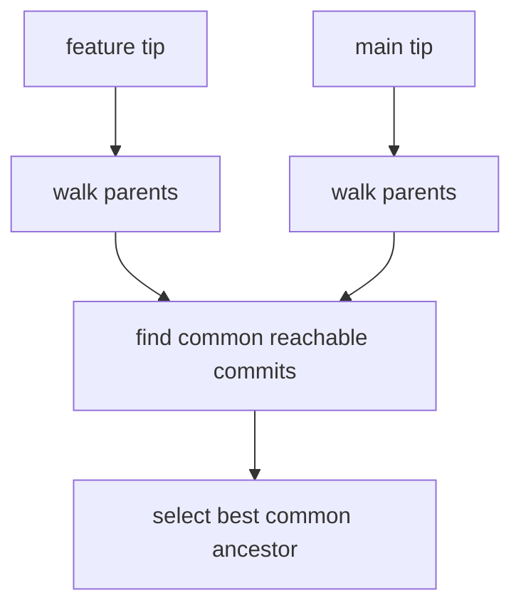
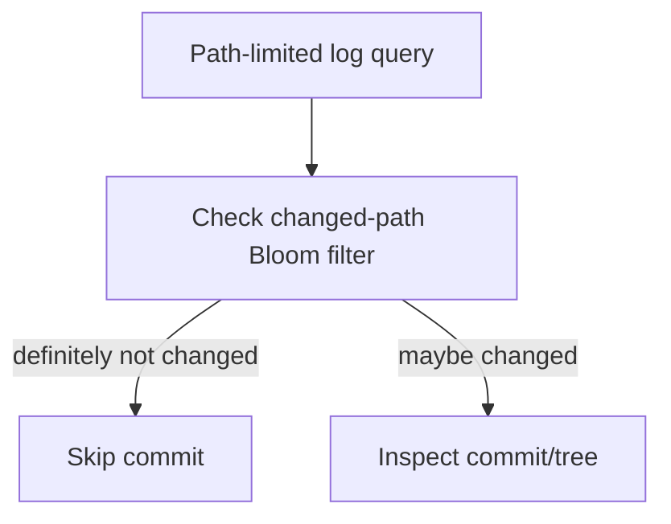
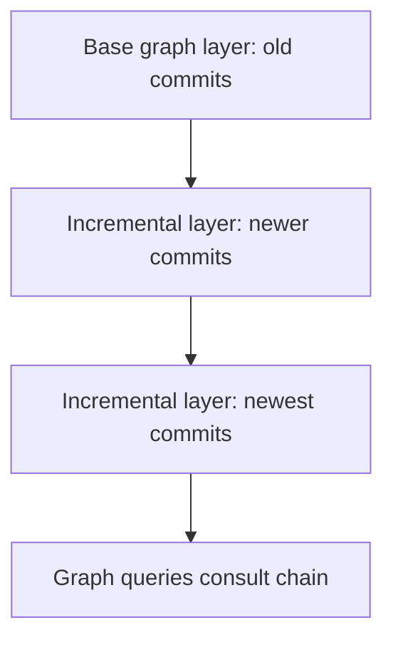

# Part 062 — Commit-Graph File and Generation Numbers

Git history is a graph. Most expensive Git operations eventually ask graph questions.

Examples:

```bash
git merge-base main feature/authz
git branch --contains <commit>
git log --topo-order --graph
git log -- path/to/file
git tag --contains <commit>
git describe
git fetch
git push
git rebase main
git bisect
```

Each of these needs to reason about commits, parents, ancestry, reachability, or paths through history. In small repositories, walking commit objects directly is fine. In large repositories, repeatedly parsing commit objects and traversing parent links can become expensive.

The **commit-graph file** is Git's answer to part of that cost.

It is a supplemental data structure that stores commit metadata in a form optimized for graph walking. It does not replace commit objects. It does not change history. It is a cache/index over existing commits.

The core mental model:

> The commit-graph file is to commit traversal what a database index is to table scanning.

If the index is missing, Git can still answer correctly by reading commit objects. If the index exists and is valid, Git can answer many graph questions faster.

---

## 1. Why Commit Graph Walks Are Expensive

A commit object stores:

- root tree ID,
- zero or more parent commit IDs,
- author metadata,
- committer metadata,
- message.

To answer ancestry questions, Git may need to parse many commit objects.

Example question:

```text
Is A an ancestor of B?
```

Naive approach:

```text
start at B
walk parents
walk parents of parents
continue until A is found or graph is exhausted
```

In a repository with millions of commits, many merges, many branches, and path-limited history queries, this can become expensive.



The commit-graph file reduces repeated parsing and provides ordering metadata that lets Git prune graph walks earlier.

---

## 2. What the Commit-Graph Stores

The commit-graph stores a list of commit object IDs and associated metadata. The official format documentation describes metadata such as:

- commit OID,
- root tree OID,
- parent relationships,
- commit date,
- generation data.

It may also store optional changed-path Bloom filters, which help path-limited history queries.

Conceptual view:

```text
commit object database:
  source of truth

commit-graph file:
  accelerated index over commit metadata
```



If the commit-graph is removed, Git still has the commit objects.

---

## 3. Commit-Graph Is Not the Source of Truth

This matters operationally.

The source of truth is still the object database:

```text
.git/objects/
```

The commit-graph is derived metadata, commonly stored around:

```text
.git/objects/info/commit-graph
```

or in a split commit-graph chain under:

```text
.git/objects/info/commit-graphs/
```

If commit-graph metadata is corrupt or stale, the normal remediation is to verify and rewrite it, not to rewrite history.

Typical commands:

```bash
git commit-graph verify
git commit-graph write --reachable
```

For modern repositories, maintenance tasks may write or update commit-graphs automatically depending on configuration.

---

## 4. Generation Numbers: The Key Pruning Idea

A generation number is metadata that helps Git answer ancestry questions faster.

Classic topological generation number idea:

```text
root commit generation = 1
commit generation = 1 + max(parent generation)
```

So a child always has a higher generation number than its parents.



This gives Git a cheap rule:

```text
If generation(X) < generation(Y), X may be an ancestor of Y.
If generation(X) >= generation(Y), X cannot be a strict ancestor of Y.
```

More carefully:

- Ancestors have lower generation numbers than descendants.
- Descendants have higher generation numbers than ancestors.
- Equal or higher generation can prune impossible ancestor paths.

This does not answer every query by itself, but it reduces how much of the graph Git needs to walk.

---

## 5. Why Commit Date Alone Is Not Enough

A tempting shortcut is to use commit timestamps.

Problem: commit dates are not reliable topology.

Reasons:

- Developer clocks can be wrong.
- Rebases can preserve author dates but change committer dates.
- Imported history can contain strange timestamps.
- Distributed teams commit across timezones and machines.
- Malicious or accidental date manipulation is possible.

Topology is determined by parent pointers, not timestamps.

Generation numbers are derived from graph topology, so they are better suited for reachability pruning.

Modern Git also has corrected commit date generation data to improve ordering while respecting ancestry constraints. The exact format detail is implementation-level; the operational idea is that Git stores graph-aware metadata to avoid unnecessary commit walks.

---

## 6. Query Example: `merge-base`

`git merge-base A B` finds a best common ancestor. Without acceleration, Git may walk backward from both commits.



With commit-graph metadata, Git can avoid parsing many commits and can stop exploring paths that cannot produce a better answer.

That matters because `merge-base` is used indirectly by many workflows:

- PR diff base,
- rebase target reasoning,
- CI affected-file detection,
- stacked branch restacking,
- release branch comparison,
- conflict prediction.

---

## 7. Query Example: `branch --contains`

Question:

```bash
git branch --contains <commit>
```

Meaning:

```text
Which branch tips can reach this commit?
```

Naive implementation has to test reachability from multiple branch tips. In a large repository with many branches and tags, this can be expensive.

The commit-graph makes reachability checks cheaper.

Operational usage:

```bash
git branch --contains <fix-commit>
git tag --contains <fix-commit>
```

These are common in incident and release work:

- Is the security fix in `release/2.4`?
- Which RC tags contain this regression?
- Has a hotfix been forward-ported to `main`?

---

## 8. Changed-Path Bloom Filters

Some history queries are path-limited:

```bash
git log -- path/to/file
git blame path/to/file
git log --follow -- service/authz/PolicyEngine.java
```

A path-limited query needs to know whether each commit may have changed a path. Without acceleration, Git may need to inspect trees/diffs across many commits.

Commit-graph files can optionally store changed-path Bloom filters. A Bloom filter is a probabilistic data structure that can say:

```text
This commit definitely did not touch this path.
```

or:

```text
This commit might have touched this path.
```

It can have false positives, but not false negatives when constructed correctly.

So Git can skip many commits for path-limited history.



This is especially useful in monorepos where engineers often inspect history for a subdirectory.

Example write command:

```bash
git commit-graph write --reachable --changed-paths
```

Use changed-path Bloom filters deliberately: they are extra metadata and not always worth the same cost profile for every repository.

---

## 9. Split Commit-Graph Chains

Large repositories change constantly. Rewriting one massive commit-graph file every time is not ideal.

Git supports split commit-graph chains: newer graph layers can be written incrementally, then later merged/compacted.

Conceptual structure:

```text
commit-graphs/
  commit-graph-chain
  graph-aaaa.graph
  graph-bbbb.graph
  graph-cccc.graph
```

Mental model:



This is similar in spirit to log-structured indexing: write small new layers, compact later.

Operationally, this matters for large repositories and background maintenance because it reduces the cost of keeping commit-graph metadata fresh.

---

## 10. Writing and Verifying Commit-Graphs

Basic write:

```bash
git commit-graph write --reachable
```

Write with changed-path Bloom filters:

```bash
git commit-graph write --reachable --changed-paths
```

Verify:

```bash
git commit-graph verify
```

Use maintenance:

```bash
git maintenance run
```

Inspect config:

```bash
git config --get core.commitGraph
git config --get fetch.writeCommitGraph
```

Not every repository needs manual intervention. For most engineers, the commit-graph is something to understand and verify when performance or corruption issues appear, not something to micromanage every day.

---

## 11. What Commit-Graph Accelerates

| Operation family | Why commit-graph helps |
|---|---|
| Ancestry tests | Generation numbers prune impossible paths. |
| Merge-base | Faster common ancestor discovery. |
| Branch/tag contains | Faster reachability checks from many refs. |
| Log traversal | Less commit object parsing. |
| Path-limited log | Changed-path Bloom filters can skip irrelevant commits. |
| Fetch negotiation | Server/client graph reasoning can benefit from faster reachability. |
| Maintenance/repack planning | Graph metadata helps large-repo operations reason about reachability. |

But commit-graph does **not** solve every Git performance problem.

| Problem | Commit-graph helps? | Better tool/approach |
|---|---:|---|
| Huge binary blobs | No | LFS, artifact store, history rewrite. |
| Slow checkout due to many files | Not directly | Sparse checkout, sparse index, filesystem monitoring. |
| Huge working tree status | Not much | FSMonitor, sparse checkout, untracked cache. |
| Many packfiles | Not directly | MIDX, repack, maintenance. |
| Slow path-limited log | Yes, with changed-path filters | Commit-graph with changed paths. |
| Slow merge-base/contains | Yes | Commit-graph generation data. |

---

## 12. Limitations and Edge Cases

### Shallow Clones

Shallow clones intentionally truncate history. That can make generation metadata invalid or less useful because parent relationships are incomplete. Git documentation notes limitations around commit-graph use with shallow commits.

Operational consequence:

> If CI uses shallow clones, some graph optimizations and history queries may not behave like a full clone.

Do not assume a shallow CI checkout can answer release-note, changelog, tag ancestry, or affected-test questions correctly.

---

### Replace Objects and Grafts

Git has mechanisms that can alter how history appears locally, such as replace refs or grafts. These are advanced features and can complicate graph metadata.

Operational rule:

> Do not use replace/graft tricks in normal team workflows unless you fully control tooling and documentation.

They are useful for migration and archaeology, but dangerous as invisible everyday state.

---

### Stale or Corrupt Commit-Graph

Symptoms may include warnings or unexpected performance issues.

Safe remediation:

```bash
git commit-graph verify
rm -f .git/objects/info/commit-graph
git commit-graph write --reachable
```

For split graphs:

```bash
rm -rf .git/objects/info/commit-graphs
git commit-graph write --reachable
```

Do this in a disposable clone first if you are unsure. Removing derived metadata should not delete commits, but operational caution is still appropriate.

---

## 13. Commit-Graph vs Commit Object

A common confusion:

```text
Commit object = permanent Git object in history.
Commit-graph file = derived acceleration structure.
```

Comparison:

| Dimension | Commit object | Commit-graph file |
|---|---|---|
| Source of truth | Yes | No |
| Content-addressed | Yes | Not as project history object |
| Stores message | Yes | No, not for user history display source |
| Stores parents | Yes | Encoded/indexed for traversal |
| Can be deleted safely? | No, if reachable | Usually yes; can be regenerated |
| Affects commit hash? | Yes | No |
| Used for acceleration | Indirectly | Yes |

This is the same broader pattern as many Git internals:

```text
objects = truth
indexes = acceleration
refs = names/pointers
reflogs = local movement history
```

---

## 14. Performance Debugging Playbook

Use this when history operations are slow.

### Step 1 — Identify the Slow Operation

Do not say “Git is slow.” Say:

```text
git log -- service/foo is slow
git merge-base main HEAD is slow
git branch --contains <commit> is slow
git status is slow
git checkout is slow
```

Different operations have different bottlenecks.

### Step 2 — Check Repository Shape

```bash
git count-objects -vH
git branch -a | wc -l
git tag | wc -l
git rev-list --count --all
```

These numbers are not perfect, but they orient the investigation.

### Step 3 — Verify Commit-Graph

```bash
git commit-graph verify
```

If missing or stale, write it:

```bash
git commit-graph write --reachable --changed-paths
```

### Step 4 — Compare Path-Limited Query

```bash
time git log -- path/to/hot/file >/dev/null
```

After writing changed paths:

```bash
git commit-graph write --reachable --changed-paths
time git log -- path/to/hot/file >/dev/null
```

Do not expect every path query to improve equally. The benefit depends on repository shape and query pattern.

### Step 5 — Separate Graph Problems from Working Tree Problems

If `git status` is slow, commit-graph may not be the primary fix. Investigate:

- untracked files,
- huge working tree,
- filesystem latency,
- FSMonitor,
- sparse checkout,
- sparse index,
- generated files,
- submodules.

If `git log`, `merge-base`, or `branch --contains` is slow, commit-graph is more relevant.

---

## 15. CI and Commit-Graph

CI frequently disables Git's normal performance advantages by doing fresh clones.

Patterns:

| CI pattern | Consequence |
|---|---|
| Fresh full clone every job | No warmed object/graph metadata. |
| Shallow clone | Fast initial transfer, incomplete history. |
| Partial clone | Lazy object fetch may surprise path/build operations. |
| Cache `.git` directory | Faster but can accumulate stale/corrupt metadata if cache policy is bad. |
| Fetch PR merge ref only | May not have enough graph for changelog/affected tests. |

Good CI checkout design starts with correctness:

```text
What history questions must this job answer?
```

Then choose fetch depth, tags, commit-graph, partial clone, and cache policy.

Examples:

| Job | History needed |
|---|---|
| Compile current commit | Minimal history may be enough. |
| Run affected tests since merge-base | Need target branch and merge-base. |
| Generate release notes | Need tags and release boundary history. |
| Verify signed release tag | Need tag object and commit. |
| Bisect automation | Need enough history to traverse. |

Commit-graph can make history queries faster, but it cannot restore history that CI never fetched.

---

## 16. Large Monorepo Implications

In monorepos, path-limited history queries are common:

```bash
git log -- services/payment
git log -- libs/authz
git blame platform/workflow/state-machine.go
```

The commit-graph with changed-path Bloom filters can help because many commits do not touch the path being queried.

But monorepo performance is multi-dimensional:

| Layer | Git feature |
|---|---|
| Object transfer | Partial clone, packfiles, negotiation. |
| Working tree size | Sparse checkout. |
| Index size | Sparse index, split index in some workflows. |
| History traversal | Commit-graph, changed-path Bloom filters. |
| Pack lookup | Multi-pack-index, bitmaps. |
| Developer UX | Scalar/maintenance, FSMonitor. |

Commit-graph is one part of the performance stack, not the whole stack.

---

## 17. Mini Lab: Write and Verify Commit-Graph

Create a repository:

```bash
mkdir /tmp/git-commit-graph-lab
cd /tmp/git-commit-graph-lab
git init
```

Create history:

```bash
for i in $(seq 1 200); do
  mkdir -p src
  echo "line $i" >> src/app.txt
  git add src/app.txt
  git commit -m "change app $i" >/dev/null
done
```

Write commit-graph:

```bash
git commit-graph write --reachable
```

Verify:

```bash
git commit-graph verify
```

Find the file:

```bash
find .git/objects/info -maxdepth 2 -type f -print
```

Now write changed-path data:

```bash
git commit-graph write --reachable --changed-paths
```

Run path-limited query:

```bash
git log -- src/app.txt --oneline | head
```

The lab is small, so performance difference may be invisible. The point is to observe the artifact and commands.

---

## 18. Mini Lab: Corrupt Metadata vs Corrupt Objects

In a disposable repo only:

```bash
mkdir /tmp/git-commit-graph-delete-lab
cd /tmp/git-commit-graph-delete-lab
git init

echo a > a.txt
git add a.txt
git commit -m "a"

git commit-graph write --reachable
```

Delete the commit-graph:

```bash
rm -f .git/objects/info/commit-graph
```

Check history still works:

```bash
git log --oneline
git fsck --full
```

Lesson:

> Removing commit-graph metadata does not remove commits.

Do not generalize this to object files. Removing `.git/objects/...` can destroy repository data.

---

## 19. Operational Checklists

### When `git log` Is Slow

- Is the repository huge?
- Is the query path-limited?
- Does commit-graph exist?
- Was it written with changed paths?
- Is this a shallow clone?
- Are there many replace/graft assumptions?
- Are tags/branches unusually large in number?

### When `merge-base` Is Slow

- Does commit-graph verify?
- Is graph history extremely merge-heavy?
- Are refs packed/clean?
- Is this a full clone?
- Is the object database healthy?

### When CI History Query Is Wrong

- Is fetch depth too small?
- Were tags fetched?
- Is target branch fetched?
- Is PR using merge ref or head ref?
- Is merge-base present locally?
- Is the job assuming full history?

---

## 20. Engineering Invariants

1. **Commit objects are truth; commit-graph is acceleration.**
2. **Generation numbers encode ancestry-friendly ordering.** They are not merely timestamps.
3. **Commit dates are not topology.** Parent pointers define ancestry.
4. **Changed-path Bloom filters accelerate path-limited queries but do not replace correctness checks.**
5. **Shallow clones weaken history reasoning.** Fast clone is not the same as correct history semantics.
6. **Removing commit-graph metadata is usually safe; removing object data is not.**
7. **Graph performance is separate from working tree performance.** Diagnose the slow operation first.
8. **Large-repo performance is layered.** Commit-graph, MIDX, bitmaps, sparse checkout, partial clone, FSMonitor, and maintenance solve different problems.

---

## 21. Common Misconceptions

### “Commit-graph changes Git history.”

No. It is derived metadata over commits.

### “If commit-graph is missing, repository is broken.”

No. Git can read commit objects directly. It may just be slower.

### “Commit date is enough for ancestry.”

No. Clocks lie. Topology comes from parent pointers.

### “Changed-path Bloom filters can prove a commit changed a file.”

No. Bloom filters can say “definitely not” or “maybe.” A “maybe” still requires verification.

### “Shallow clone plus commit-graph gives full-history behavior.”

No. Commit-graph cannot index commits that were never fetched.

---

## 22. Where This Fits in the Git Performance Stack

You now have two internal performance layers:

```text
Part 061: packfiles/indexes/delta compression
  => object storage and transfer efficiency

Part 062: commit-graph/generation numbers
  => commit traversal and history-query efficiency
```

Next layers include:

```text
Multi-pack-index and reachability bitmaps
  => lookup and reachability acceleration across many packs

Reftable / packed refs
  => reference storage scalability

Sparse checkout / sparse index
  => working tree and index scale

Partial clone
  => object transfer reduction
```

The pattern is consistent:

> Git remains a content-addressed object database with refs and a working tree, then adds derived indexes and maintenance structures to keep large repositories usable.

---

## References

- Git documentation: `commit-graph`
- Git documentation: `git-commit-graph`
- Git documentation: commit-graph format
- Git documentation: `git-log`
- Git documentation: `git-merge-base`
- Git documentation: `git-maintenance`
- Git documentation: `git-fetch`
