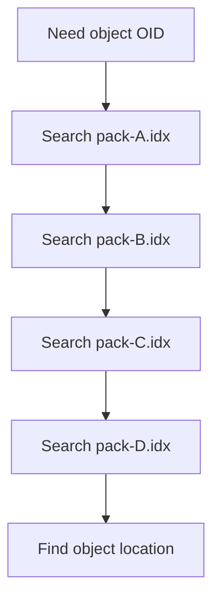
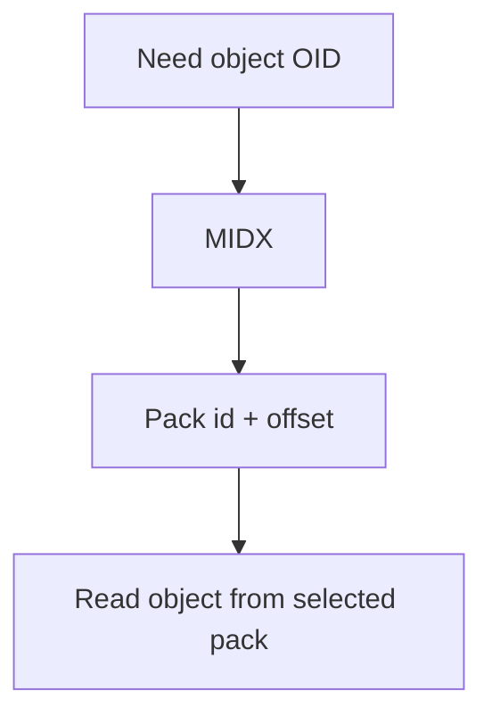
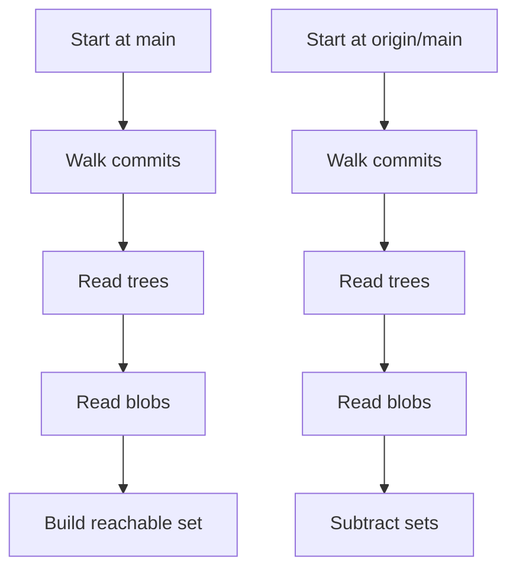
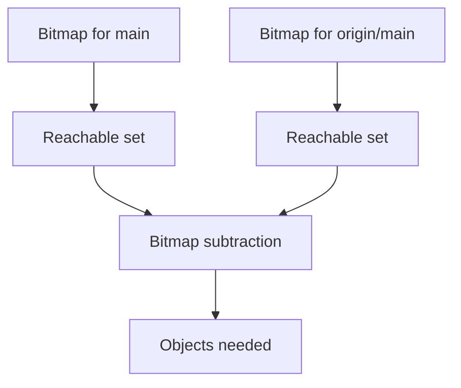
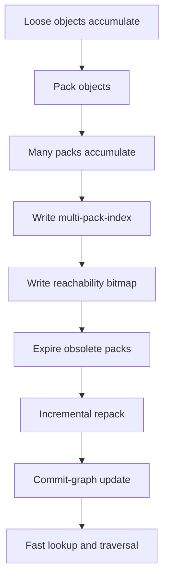
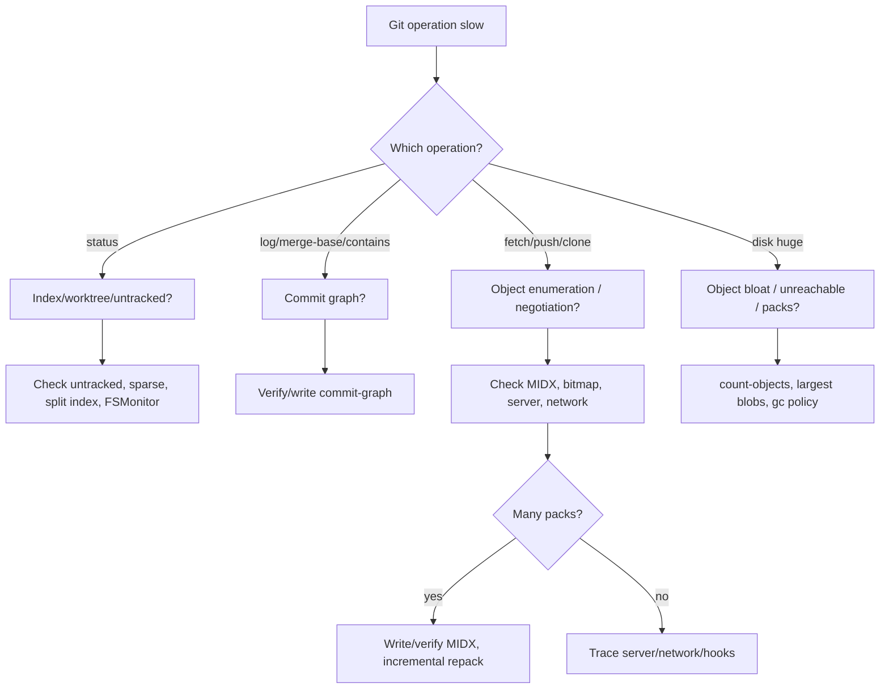

# Part 063 — Multi-Pack Index and Reachability Bitmaps

In Part 061, we learned that Git stores many objects in **packfiles** and uses `.idx` files to find objects inside those packs. In Part 062, we learned that Git can accelerate **commit graph traversal** using the commit-graph file.

This part connects the next layer:

> How does Git avoid scanning many pack indexes when a repository has many packfiles, many objects, and many refs?

The answer is a family of indexes and bitmap structures:

- **pack index**: lookup objects inside one pack;
- **multi-pack-index** / **MIDX**: lookup objects across many packs through one index;
- **reverse index**: map pack/MIDX position back to object order efficiently;
- **reachability bitmap**: answer “which objects are reachable from these commits?” without walking the full object graph every time;
- **cruft pack** metadata: store unreachable objects in a more manageable packed form.

Git remains correct without these acceleration structures. They are not the source of truth. The source of truth is still the object database and refs.

But at scale, these structures decide whether a Git operation feels instant, slow, or unusable.

---

## 1. The Problem: One Repository, Many Packfiles

A repository starts simple:

```text
.git/objects/
  12/abcd...
  89/ef01...
```

Then Git packs objects:

```text
.git/objects/pack/
  pack-A.pack
  pack-A.idx
```

Over time, the repository accumulates more packs:

```text
.git/objects/pack/
  pack-A.pack
  pack-A.idx
  pack-B.pack
  pack-B.idx
  pack-C.pack
  pack-C.idx
  pack-D.pack
  pack-D.idx
```

This happens after fetches, pushes, background maintenance, partial repacks, CI cache reuse, local object creation, and server-side maintenance.

Without a multi-pack index, object lookup roughly becomes:

```text
Need object X
  check pack-A.idx
  check pack-B.idx
  check pack-C.idx
  check pack-D.idx
  ...
```

That is not always disastrous, because each `.idx` is efficient. But when there are many packfiles and many lookups, the overhead compounds.

The scaling problem is not merely “one lookup is slow”. It is:

```text
many Git commands
  ask for many objects
    across many packs
      while also walking commits, trees, and deltas
```

Large repositories care about this because normal commands are object-heavy:

```bash
git status
git log -- path/to/file
git fetch
git push
git repack
git gc
git rev-list --objects --all
git pack-objects
git clone
git maintenance run
```

A repository with millions of objects should not have to repeatedly open and search many independent pack indexes just to answer object existence and location questions.

---

## 2. Mental Model: MIDX as an Index Over Pack Indexes

A **multi-pack-index** is an index that covers objects across multiple packfiles.

Instead of this:



Git can do this:



The MIDX does not merge the packfiles into one pack. It gives Git a single object lookup structure over several packs.

Think of it like a database index that spans multiple physical files:

```text
OID -> pack number -> byte offset / index position
```

This matters because repacking everything into one giant pack is expensive. A full repack can be costly in CPU, IO, disk space, and operational risk. A MIDX lets Git get many of the lookup benefits without immediately rewriting every pack.

---

## 3. What MIDX Does Not Do

Do not overestimate MIDX.

A MIDX does **not**:

- remove old objects by itself;
- rewrite history;
- deduplicate semantic history;
- make huge binary blobs safe;
- eliminate the need for periodic maintenance;
- replace packfiles;
- guarantee optimal delta chains;
- fix repository architecture problems;
- make shallow/partial clone semantics disappear.

It is a lookup and maintenance acceleration structure.

The invariant:

> MIDX improves how Git finds packed objects across many packs. It does not change which objects exist or which commits are reachable.

---

## 4. Anatomy of Object Lookup With MIDX

At a simplified level:

```text
repository has N packfiles
repository has one multi-pack-index file
MIDX contains object IDs from those packfiles
for each object, MIDX can identify which pack contains it
Git uses that location to read the object
```

A practical file layout may look like:

```text
.git/objects/pack/
  multi-pack-index
  multi-pack-index-<hash>.bitmap
  multi-pack-index-<hash>.rev
  pack-1111.pack
  pack-1111.idx
  pack-2222.pack
  pack-2222.idx
  pack-3333.pack
  pack-3333.idx
```

Exact filenames vary by Git version and maintenance state, but the concept is stable:

- `.pack` stores compressed objects;
- `.idx` indexes one pack;
- `multi-pack-index` indexes many packs;
- `.rev` reverse index helps map positions efficiently;
- `.bitmap` stores reachability bitmap data.

---

## 5. Write and Inspect MIDX

Create or rewrite a multi-pack-index:

```bash
git multi-pack-index write
```

Verify it:

```bash
git multi-pack-index verify
```

Expire packs no longer needed by the MIDX:

```bash
git multi-pack-index expire
```

Repack selected packs into a new pack based on MIDX information:

```bash
git multi-pack-index repack
```

Write with bitmap support when applicable:

```bash
git multi-pack-index write --bitmap
```

Many users will not call these directly. They may be triggered by:

```bash
git maintenance run
git maintenance start
git gc
git repack
```

But as an advanced engineer, you should know the structures exist because they explain performance behavior.

---

## 6. Reachability: The Expensive Question Behind Many Commands

Many Git operations ask reachability questions:

```text
Which objects are reachable from refs/heads/main?
Which objects does the remote not have?
Which objects should be packed for push?
Which objects are safe to prune?
Which objects are reachable from all refs?
Which objects belong in a clone/fetch response?
```

A naive answer requires graph traversal:

```text
start from commit tips
walk commits
for each commit, read tree
for each tree, read entries
for each subtree, read more trees
collect blobs
repeat for parents
```

For large repositories, this can touch a huge number of objects.

Reachability bitmaps exist to avoid repeating that full traversal every time.

---

## 7. Reachability Bitmap Mental Model

A reachability bitmap is a compressed bitset representing objects reachable from selected commits.

Imagine a repository with object table positions:

```text
position 0 -> commit A
position 1 -> commit B
position 2 -> tree T1
position 3 -> blob X
position 4 -> blob Y
position 5 -> tag R
```

A bitmap for commit `B` could look like:

```text
commit B reaches: B, A, T1, X, Y
bitmap:          1  1  1   1  1  0
```

That is simplified. Real bitmap encoding is compressed and more complex, but the mental model is right:

> A bitmap lets Git answer reachability by combining bitsets instead of walking the object graph from scratch.

This is especially valuable for clone, fetch, push, repack, and object enumeration.

---

## 8. Bitmap Example: Object Enumeration Without Full Walk

Suppose Git needs objects reachable from `main` but not reachable from `origin/main`.

Without bitmaps:



With bitmaps:



This is why bitmap availability can dramatically affect Git server behavior.

---

## 9. Pack-Based Bitmap vs MIDX Bitmap

Historically, reachability bitmaps were tied to a single packfile.

That works well when most objects are in one large pack:

```text
pack-main.pack
pack-main.idx
pack-main.bitmap
```

But large repositories often have multiple packs. If bitmap acceleration only works well for one pack, you face a maintenance trade-off:

```text
full repack into one pack
  good bitmap performance
  expensive maintenance
  large IO burst
  high operational cost

many packs
  cheaper incremental maintenance
  worse bitmap coverage if bitmap is single-pack only
```

MIDX bitmaps reduce that trade-off by allowing reachability bitmaps to pair with the multi-pack-index.

Conceptually:

```text
MIDX object order -> bitmap positions -> reachability sets across multiple packs
```

This lets Git keep multiple packs while still benefiting from bitmap reachability acceleration.

---

## 10. Reverse Index: Why `.rev` Exists

A bitmap needs a stable mapping between bit positions and objects.

Sometimes Git needs to convert between:

```text
object ID
pack order
MIDX order
bitmap position
pack offset
```

A reverse index helps answer “given this position/order, what object is it?” efficiently.

Without reverse indexes, Git may need more expensive mapping work.

In operational language:

> A `.rev` file is an acceleration structure that helps Git translate between object ordering schemes used by packs, MIDX, and bitmaps.

You do not usually edit it. You verify/regenerate it through maintenance.

---

## 11. Object Lookup vs Reachability Lookup

Separate these two questions:

```text
Question A: Where is object X stored?
Question B: Which objects are reachable from commit Y?
```

They are related but not the same.

| Structure | Accelerates | Example |
|---|---|---|
| Pack `.idx` | Object lookup within one pack | “Where is blob X in pack-A?” |
| MIDX | Object lookup across many packs | “Which pack contains blob X?” |
| Reverse index | Position/order mapping | “Which object is at bitmap position N?” |
| Reachability bitmap | Reachable object set computation | “What does main reach?” |
| Commit-graph | Commit traversal | “Is A ancestor of B?” |

A mature Git performance model needs all of them.

---

## 12. Large Repository Maintenance Pipeline

A large repository benefits from layered maintenance:



The key is incrementalism.

A naive maintenance strategy says:

```text
Always repack everything into one giant pack.
```

A scalable strategy says:

```text
Maintain indexes and bitmaps so common operations are fast,
then repack incrementally to control storage and lookup cost.
```

---

## 13. Commands for Diagnosis

Inspect object/pack health:

```bash
git count-objects -vH
```

Typical output includes:

```text
count: 1200
size: 8.50 MiB
in-pack: 4500000
packs: 37
size-pack: 2.10 GiB
prune-packable: 0
garbage: 0
size-garbage: 0 bytes
```

Pay attention to:

| Field | Meaning |
|---|---|
| `count` | loose object count |
| `size` | loose object size |
| `in-pack` | packed object count |
| `packs` | number of packs |
| `size-pack` | total packed size |
| `prune-packable` | loose objects already present in packs |
| `garbage` | invalid garbage files |

High `packs` can indicate maintenance opportunity.

Verify packs:

```bash
git verify-pack -v .git/objects/pack/pack-*.idx
```

Find largest objects:

```bash
git rev-list --objects --all |
  git cat-file --batch-check='%(objecttype) %(objectname) %(objectsize:disk) %(rest)' |
  sort -k3 -n |
  tail -50
```

Write MIDX:

```bash
git multi-pack-index write
```

Write MIDX with bitmap:

```bash
git multi-pack-index write --bitmap
```

Verify MIDX:

```bash
git multi-pack-index verify
```

Run background maintenance once:

```bash
git maintenance run
```

Run specific maintenance task:

```bash
git maintenance run --task=incremental-repack
```

---

## 14. Performance Symptom Matrix

| Symptom | Possible Git-internal cause | First inspection |
|---|---|---|
| `git fetch` slow | poor pack/bitmap state, huge negotiation, many refs | `GIT_TRACE2_PERF=1 git fetch` |
| `git push` slow | object enumeration expensive | server/client bitmap state, pack generation |
| `git log --all` slow | commit graph missing/stale | `git commit-graph verify` |
| `git status` slow | index/worktree issue, untracked explosion | `git status --untracked-files=no` |
| repo disk huge | large blobs, unreachable objects, many packs | `git count-objects -vH` |
| maintenance slow | full repack too frequent | maintenance config, pack count |
| clone/fetch server CPU high | reachability traversal expensive | bitmap availability |
| incremental repack ineffective | too many small packs, poor thresholds | `git count-objects -vH` |

Do not diagnose all Git slowness as “needs gc”. That is like diagnosing every database issue as “restart it”.

---

## 15. Bitmap Selection Is a Trade-Off

Git does not store a bitmap for every commit.

If a repository has millions of commits, storing a bitmap for each commit would be too expensive. Git chooses selected commits, often favoring ref tips and strategically useful points.

Trade-off:

```text
more bitmaps
  faster direct reachability from many starts
  more disk space
  more bitmap generation cost

fewer bitmaps
  less storage/maintenance cost
  more fallback traversal
```

This is why many refs can matter. If a repository has tens or hundreds of thousands of refs, bitmap selection and object enumeration can become more expensive.

In Git hosting environments, ref count is a real scaling dimension.

---

## 16. Many Refs Can Hurt Object Enumeration

A Git repository with many refs:

```text
refs/heads/*
refs/tags/*
refs/pull/*
refs/changes/*
refs/notes/*
refs/remotes/*
```

can create expensive reachability scenarios.

Examples:

```bash
git rev-list --objects --all
git pack-objects --revs
git clone --mirror
git fetch --tags
git repack -adb
```

Many refs also increase policy complexity:

- which refs are protected?
- which refs are advertised?
- which refs trigger CI?
- which refs should be packed?
- which refs should be kept forever?
- which refs are temporary PR refs?

Performance and governance meet at refs.

---

## 17. MIDX and Incremental Repack

A full repack rewrites many objects into a new pack.

```bash
git repack -ad
```

That can be effective but expensive.

An incremental repack can use the MIDX to select smaller packs and consolidate them.

Conceptually:

```text
many small packs
  choose subset
  repack selected packs into a new larger pack
  update MIDX
  expire redundant packs
```

This gives you a maintenance path that avoids constantly rewriting the entire repository.

That matters for:

- developer machines;
- CI caches;
- monorepo checkouts;
- Git servers;
- mirrored repositories;
- long-lived build agents.

---

## 18. Operational Invariant: Indexes Are Rebuildable

MIDX, reverse indexes, bitmaps, and commit-graph files are acceleration structures.

If corrupted or stale, the safe mental model is:

```text
verify
remove/regenerate if necessary
never hand-edit binary index files
never assume cache files define truth
```

Commands:

```bash
git multi-pack-index verify
git commit-graph verify
git fsck
```

If a cache/index is suspected:

```bash
rm -f .git/objects/pack/multi-pack-index
rm -f .git/objects/pack/multi-pack-index-*.bitmap
rm -f .git/objects/pack/multi-pack-index-*.rev

git multi-pack-index write --bitmap
git commit-graph write --reachable --changed-paths
```

Be careful on shared server repositories. Coordinate with hosting platform maintenance policy. On local clones, regeneration is usually low risk if the repository objects themselves are intact.

---

## 19. Cruft Packs: Unreachable Objects Without Loose Object Chaos

Unreachable objects are not immediately deleted. Git keeps them for a grace period so recovery is possible.

Historically, unreachable objects could accumulate as loose objects or be packed awkwardly.

Modern Git can use **cruft packs** to store unreachable objects together with metadata about mtimes/expiration.

Why it matters:

- large rewrites can create many unreachable objects;
- bad rebase/amend/reset can leave recoverable objects;
- CI/build agents can accumulate garbage;
- servers need retention windows without exploding loose object count.

Mental model:

```text
reachable objects -> normal packs
unreachable-but-retained objects -> cruft pack
expired unreachable objects -> prune/delete
```

Operationally, do not rush to prune after an incident.

Bad:

```bash
git reflog expire --expire=now --all
git gc --prune=now
```

Safe first:

```bash
git reflog --all
git fsck --lost-found
git branch rescue/<name> <lost-commit>
```

Only prune after recovery windows and team confirmation.

---

## 20. MIDX Does Not Solve Bad Repository Content

MIDX and bitmaps help object lookup and reachability enumeration. They do not fix bad content choices.

If your repository has:

- huge binary blobs committed repeatedly;
- generated artifacts committed every build;
- large dependency vendor trees updated wholesale;
- lockfiles with massive churn;
- many temporary refs never cleaned;
- public history rewrites creating unreachable object piles;
- tags created for every CI run;
- branches kept forever with no retention policy;

then storage acceleration only delays pain.

Architecture still matters.

Repository health is a product of:

```text
content policy
+ branch/ref lifecycle
+ pack maintenance
+ graph indexes
+ CI checkout behavior
+ release retention rules
```

---

## 21. CI and Build Agent Considerations

CI often performs Git operations under artificial constraints:

- shallow clone;
- partial clone;
- no tags;
- single branch;
- cached workspaces;
- repeated fetch into the same directory;
- detached HEAD;
- generated refs for PR merge commits;
- cleanup scripts that delete too much or too little.

CI repositories can accumulate unhealthy pack states:

```text
many fetches
many small packs
stale commit-graph
no maintenance
slow checkout/fetch over time
```

For persistent agents, run maintenance deliberately:

```bash
git maintenance run --auto
```

or schedule:

```bash
git maintenance start
```

But pair it with observability:

```bash
git count-objects -vH
GIT_TRACE2_PERF=1 git fetch --tags --prune
```

For ephemeral agents, the better answer may be:

- clone fresh with correct depth;
- avoid retaining huge workspaces;
- use repository cache maintained by the CI platform;
- fetch only required refs;
- ensure release jobs fetch tags and enough history.

---

## 22. Server-Side Hosting Considerations

Git servers care about MIDX and bitmaps more than individual developers do.

A hosting server repeatedly answers:

```text
What objects does this client need?
What objects does this client already have?
Can I pack a response cheaply?
Can I avoid walking the entire graph?
Can I serve clones/fetches without high CPU spikes?
```

For high-traffic repositories, reachability bitmaps can reduce CPU and latency.

But server operators must also manage:

- advertised refs;
- hidden refs;
- PR refs;
- tag explosion;
- fork network object sharing;
- alternates/object pools;
- quarantine directories for incoming pushes;
- hooks and policy checks;
- garbage collection windows;
- backup and replication.

Developer-level Git knowledge is not enough for Git hosting at scale. Hosting is database operations.

---

## 23. Safety Boundary: Never Treat Maintenance as Semantics

A common mistake is to treat maintenance artifacts as semantic truth.

Wrong:

```text
The bitmap says it is not reachable, therefore it is safe to delete.
```

Better:

```text
Reachability must be interpreted with refs, reflogs, retention policy, alternates, and hosting-specific hidden refs.
```

Questions before pruning or aggressive maintenance:

- Are there reflogs that still reference this object?
- Are there hidden refs?
- Are there pull request refs?
- Are there forks using object alternates?
- Are there release artifacts pinned to this commit?
- Are there external systems storing commit IDs?
- Is this repository mirrored elsewhere?
- Is this a server repo or local clone?

Git stores objects. Organizations assign meaning to them.

---

## 24. Practical Maintenance Profiles

### Small Personal Repository

Usually enough:

```bash
git maintenance run --auto
```

No special tuning unless object count grows.

### Large Developer Clone

Useful:

```bash
git maintenance start
git config maintenance.strategy incremental
```

Inspect occasionally:

```bash
git count-objects -vH
git commit-graph verify
git multi-pack-index verify
```

### Large Monorepo Clone

Consider:

```bash
git sparse-checkout set <paths>
git maintenance start
git multi-pack-index write --bitmap
git commit-graph write --reachable --changed-paths
```

Also evaluate partial clone and Scalar in later parts.

### Git Server / Mirror

Do not improvise manually. Define:

- maintenance schedule;
- repack strategy;
- bitmap policy;
- ref advertisement policy;
- hidden ref retention;
- backup consistency;
- mirror sync rules;
- monitoring metrics;
- emergency recovery procedure.

---

## 25. Trace2 for Git Performance

Git has trace facilities that can help diagnose slow operations.

Example:

```bash
GIT_TRACE2_PERF=1 git fetch origin main
```

For structured output:

```bash
GIT_TRACE2_EVENT=/tmp/git-trace.json git fetch origin main
```

Look for time spent in:

- index reading;
- object lookup;
- revision walking;
- pack generation;
- negotiation;
- hooks;
- child processes;
- network operations.

Do not assume slowness is local object storage. Network, auth, hooks, server-side pack generation, and CI wrappers can dominate.

---

## 26. Failure Modes

### Failure Mode 1: “Just Run `git gc --aggressive`”

`--aggressive` is often overused. It can be very expensive and is not a first-line fix.

Prefer:

```bash
git maintenance run
git count-objects -vH
git multi-pack-index verify
git commit-graph verify
```

Then decide.

### Failure Mode 2: Huge Pack Count on Persistent CI Agent

Symptom:

```text
git fetch gets slower over weeks
.git/objects/pack has many packs
```

Response:

```bash
git count-objects -vH
git maintenance run --task=incremental-repack
git multi-pack-index write --bitmap
```

Also fix CI cache lifecycle.

### Failure Mode 3: Full Repack During Business Hours

A full server repack can saturate disk and CPU.

Mitigation:

- schedule maintenance windows;
- use incremental maintenance;
- monitor latency;
- avoid running manual repacks during active incident response unless necessary.

### Failure Mode 4: Pruning After Accidental Reset

Do not prune before recovery.

Bad:

```bash
git gc --prune=now
```

Good:

```bash
git reflog
git fsck --lost-found
git branch rescue/<name> <commit>
```

### Failure Mode 5: Mistaking Bitmap Absence for Corruption

No bitmap does not mean repository corruption. It means Git may have to perform more traversal work.

---

## 27. A Repository Health Script

Save as `git-storage-health.sh`:

```bash
#!/usr/bin/env bash
set -euo pipefail

echo "== Repository =="
git rev-parse --show-toplevel

echo

echo "== Object counts =="
git count-objects -vH

echo

echo "== Pack files =="
pack_dir="$(git rev-parse --git-path objects/pack)"
find "$pack_dir" -maxdepth 1 -type f \
  \( -name '*.pack' -o -name '*.idx' -o -name '*multi-pack-index*' -o -name '*.bitmap' -o -name '*.rev' \) \
  -printf '%f %s bytes\n' | sort

echo

echo "== Commit graph verify =="
git commit-graph verify || true

echo

echo "== MIDX verify =="
git multi-pack-index verify || true

echo

echo "== Largest packed objects by disk size =="
git rev-list --objects --all |
  git cat-file --batch-check='%(objecttype) %(objectname) %(objectsize:disk) %(rest)' |
  sort -k3 -n |
  tail -20
```

Run:

```bash
chmod +x git-storage-health.sh
./git-storage-health.sh
```

This script does not mutate the repository.

---

## 28. Decision Framework

Use this when Git performance degrades.



---

## 29. Engineering Rule of Thumb

For repository performance, think in layers:

```text
working tree layer
  status, checkout, sparse checkout, untracked files

index layer
  index size, sparse index, split index, fsmonitor

commit graph layer
  ancestry, merge-base, contains, log traversal

object storage layer
  loose objects, packs, deltas, MIDX

reachability layer
  bitmaps, refs, hidden refs, object enumeration

workflow layer
  branch count, tag count, PR refs, release refs, retention policy
```

A slow Git command can be slow for any of these reasons.

Top engineers do not memorize random cleanup commands. They classify the layer first.

---

## 30. Lab: Observe MIDX and Bitmap Behavior

Create a test repository:

```bash
mkdir midx-lab
cd midx-lab
git init
```

Create many commits:

```bash
for i in $(seq 1 500); do
  echo "$i" > file-$i.txt
  git add file-$i.txt
  git commit -m "add file $i"
done
```

Create packs:

```bash
git gc
```

Inspect:

```bash
git count-objects -vH
ls -lh .git/objects/pack
```

Force additional packs by creating more commits and fetching/pulling is harder in a local lab, but you can simulate some maintenance behavior:

```bash
git repack -d
git multi-pack-index write --bitmap
ls -lh .git/objects/pack
```

Verify:

```bash
git multi-pack-index verify
git commit-graph write --reachable --changed-paths
git commit-graph verify
```

Trace object enumeration:

```bash
GIT_TRACE2_PERF=1 git rev-list --objects --all >/tmp/objects.txt
```

The exact timing on a tiny lab will not be impressive. The point is to connect files, commands, and mental model.

---

## 31. What to Remember

A Git repository is a content-addressed database with multiple acceleration indexes.

For large object stores:

- packfiles reduce storage and transfer cost;
- pack indexes find objects inside one pack;
- multi-pack-index finds objects across many packs;
- reverse indexes map ordering positions efficiently;
- reachability bitmaps accelerate object set computation;
- commit-graph accelerates commit graph traversal;
- maintenance decides whether these structures stay healthy.

The most important engineering distinction:

```text
object lookup != reachability traversal != working tree scan != commit ancestry query
```

Different structures accelerate different questions.

When Git gets slow, classify the question before applying a fix.

---

## References

- Git documentation — `multi-pack-index`: https://git-scm.com/docs/multi-pack-index
- Git documentation — `git-multi-pack-index`: https://git-scm.com/docs/git-multi-pack-index
- Git documentation — `bitmap-format`: https://git-scm.com/docs/bitmap-format
- Git documentation — `gitformat-pack`: https://git-scm.com/docs/gitformat-pack
- Git documentation — `gitpacking`: https://git-scm.com/docs/gitpacking
- Git documentation — `git-maintenance`: https://git-scm.com/docs/git-maintenance
- Git documentation — `git-count-objects`: https://git-scm.com/docs/git-count-objects
- GitHub Engineering Blog — Scaling monorepo maintenance: https://github.blog/open-source/git/scaling-monorepo-maintenance/
