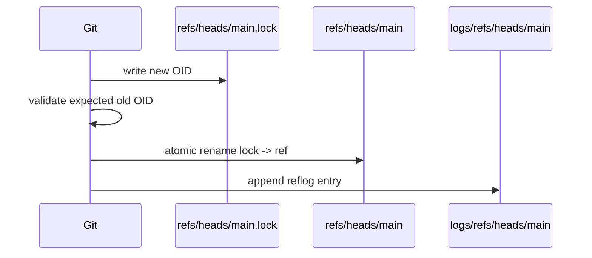
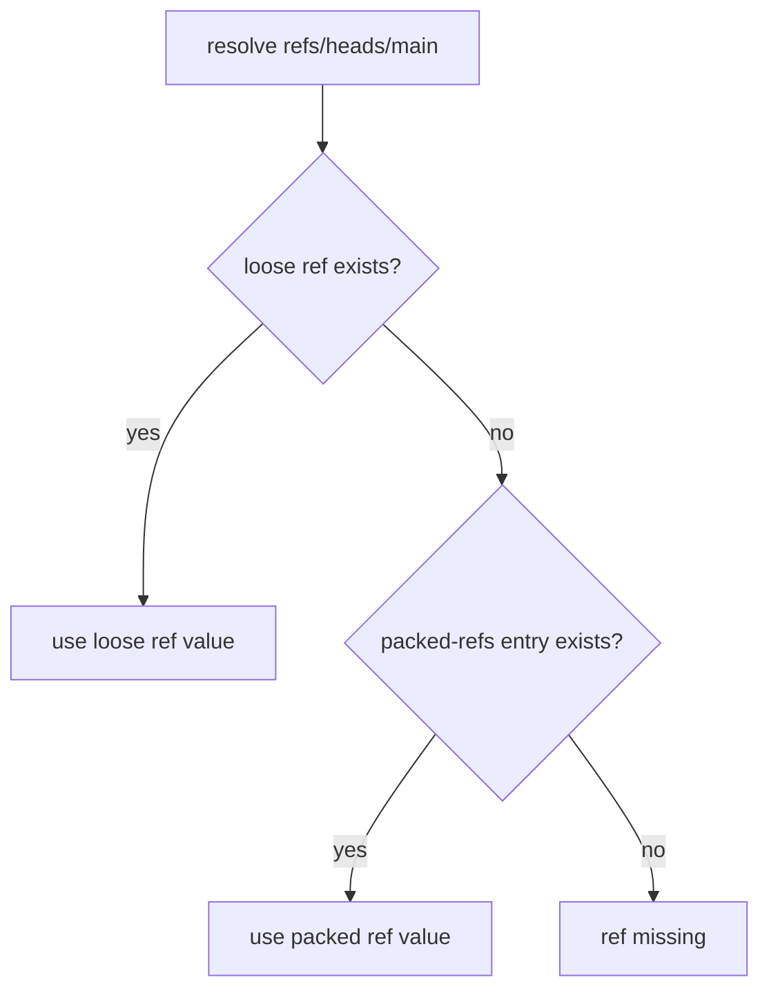
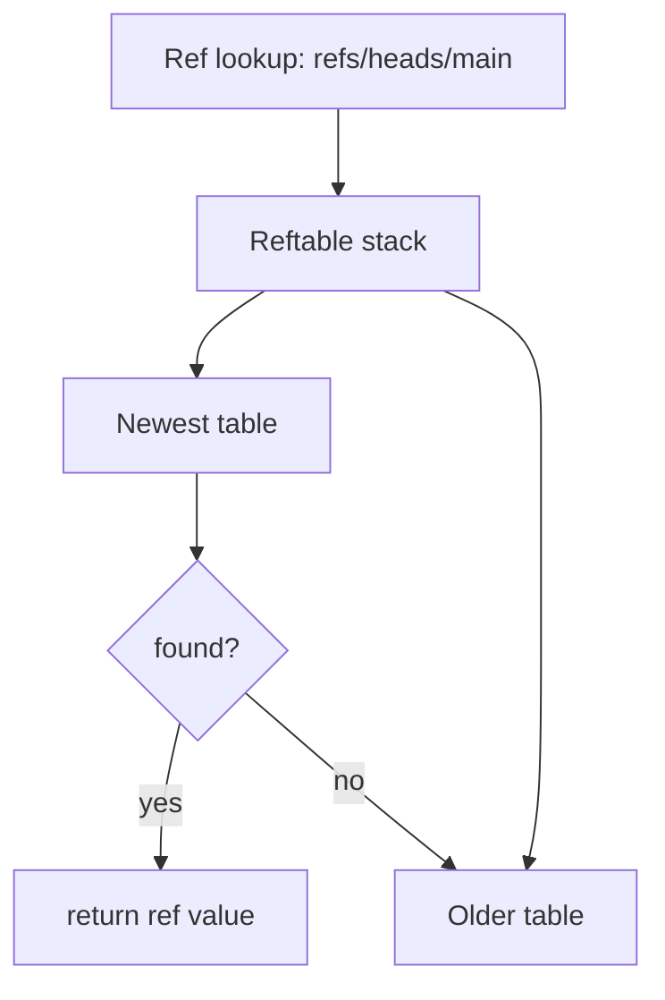

# Part 064 — Reftable, Packed Refs, and Ref Storage

In earlier parts, we treated refs as simple pointers:

```text
refs/heads/main -> <commit-id>
refs/tags/v1.2.0 -> <tag-or-commit-id>
HEAD -> refs/heads/main
```

That mental model is correct at the semantic level.

But implementation matters.

At scale, refs create their own storage and performance problems:

- thousands of branches;
- hundreds of thousands of tags;
- pull-request refs;
- hidden refs;
- notes refs;
- remote-tracking refs;
- deleted branch remnants;
- stale packed refs;
- reflog retention;
- atomic updates;
- lockfiles;
- concurrent writers;
- branch protection and server policy.

This part explains how Git stores refs using the traditional **files backend** and the newer **reftable** backend.

The core idea:

> A ref is a name-to-object mapping with update semantics. Ref storage is the database table that makes those mappings durable, searchable, and safe under mutation.

---

## 1. Why Ref Storage Matters

Refs are the entry points into history.

Without refs, commits may still exist, but they become hard to find and eventually may become unreachable.

Important refs:

```text
HEAD
refs/heads/main
refs/heads/feature/authz
refs/tags/v1.4.2
refs/remotes/origin/main
refs/notes/commits
refs/stash
```

Ref operations happen constantly:

```bash
git branch feature/x
git switch main
git commit
git merge
git rebase
git fetch
git push
git tag -a v1.0.0
git update-ref refs/heads/main <oid>
git for-each-ref
git show-ref
```

A slow or inconsistent ref store can hurt:

- branch listing;
- fetch/push negotiation;
- CI ref discovery;
- tag lookup;
- release automation;
- protected branch enforcement;
- Git server scalability.

---

## 2. Traditional Files Backend

By default, Git historically stores refs as files under `.git/refs`.

Example:

```text
.git/
  HEAD
  refs/
    heads/
      main
      feature/authz
    tags/
      v1.0.0
      v1.1.0
    remotes/
      origin/
        main
```

A loose branch ref file may contain:

```text
7f83b1657ff1fc53b92dc18148a1d65dfa135e2a
```

A symbolic `HEAD` file may contain:

```text
ref: refs/heads/main
```

This design is beautifully simple.

You can inspect it with:

```bash
cat .git/HEAD
cat .git/refs/heads/main
```

But simple file-per-ref storage does not scale perfectly when there are many refs.

---

## 3. Loose Refs

A **loose ref** is a ref stored as an individual file.

Example:

```text
.git/refs/heads/main
.git/refs/tags/v1.0.0
```

Loose refs are easy to update:

1. write lock file;
2. validate expected old value;
3. write new value;
4. rename lock file into place;
5. append reflog entry if applicable.

Simplified:



This gives safe local updates without directly editing the ref file in place.

Do not hand-edit refs in normal workflows. Use:

```bash
git update-ref
```

---

## 4. Packed Refs

When a repository has many refs, many tiny files become inefficient.

`git pack-refs` stores refs in a single file:

```text
.git/packed-refs
```

Example:

```text
# pack-refs with: peeled fully-peeled sorted
7f83b1657ff1fc53b92dc18148a1d65dfa135e2a refs/heads/main
9daeafb9864cf43055ae93beb0afd6c7d144bfa4 refs/tags/v1.0.0
^3b18e512dba79e4c8300dd08aeb37f8e728b8dad
```

The `^...` peeled line appears for annotated tags and points to the underlying object after peeling.

Mental model:

```text
loose refs: mutable active refs
packed-refs: compact snapshot of many refs
```

Git resolves refs by checking loose refs and packed refs according to backend rules.

A branch can be packed and later updated as loose again.

---

## 5. Loose Ref Shadows Packed Ref

Suppose `refs/heads/main` exists in `packed-refs`:

```text
A refs/heads/main
```

Then the branch advances. Git may create a loose ref:

```text
.git/refs/heads/main = B
```

Now the effective value is `B`, even though `packed-refs` still contains old value `A`.

Conceptually:



This is one reason hand-reading only `packed-refs` can mislead you.

Use Git commands:

```bash
git show-ref refs/heads/main
git rev-parse refs/heads/main
git for-each-ref refs/heads/main
```

---

## 6. Commands for Ref Inspection

List refs:

```bash
git show-ref
```

List with custom format:

```bash
git for-each-ref --format='%(refname) %(objectname) %(committerdate:iso8601)' refs/heads
```

Resolve a ref:

```bash
git rev-parse --verify refs/heads/main^{commit}
```

Check symbolic ref:

```bash
git symbolic-ref HEAD
```

Read raw ref value safely:

```bash
git rev-parse HEAD
git rev-parse main
git rev-parse refs/tags/v1.0.0
```

Update ref atomically:

```bash
git update-ref refs/heads/rescue <new-oid> <old-oid>
```

Delete ref with expected old value:

```bash
git update-ref -d refs/heads/old-feature <old-oid>
```

Pack refs:

```bash
git pack-refs --all
```

---

## 7. Why `update-ref` Matters

`git update-ref` is the plumbing command for safe ref mutation.

Bad:

```bash
echo <oid> > .git/refs/heads/main
```

Better:

```bash
git update-ref refs/heads/main <new-oid> <old-oid>
```

Why?

Because ref updates need safety semantics:

- validate old value;
- prevent accidental overwrite;
- write reflog;
- use lockfiles;
- respect ref backend behavior;
- avoid partial writes;
- work whether refs are loose, packed, or reftable-backed.

A ref update is not just file writing. It is a transactional pointer mutation.

---

## 8. Ref Names Are a Namespace

Ref names form a hierarchical namespace:

```text
refs/heads/main
refs/heads/release/2026.07
refs/tags/v1.0.0
refs/remotes/origin/main
refs/notes/commits
```

But this namespace has file-system implications in the files backend.

You cannot have both:

```text
refs/heads/feature
refs/heads/feature/authz
```

as loose files, because `feature` cannot be both a file and a directory.

This creates branch naming conflicts:

```bash
git branch feature
git branch feature/authz
```

One of these will fail depending on existing refs.

Team convention should avoid ambiguous branch prefixes.

Good:

```text
feature/authz-engine
bugfix/payment-timeout
release/2026.07
hotfix/CVE-2026-1234
```

Bad if mixed inconsistently:

```text
feature
feature/authz
feature/authz/api
```

---

## 9. Reflogs Are Related but Separate

Refs point to object IDs.

Reflogs record ref movement history.

Files backend layout:

```text
.git/logs/HEAD
.git/logs/refs/heads/main
.git/logs/refs/remotes/origin/main
```

A reflog entry records roughly:

```text
old-oid new-oid actor timestamp timezone action
```

Example actions:

```text
commit: add authz policy loader
rebase finished: refs/heads/feature onto ...
reset: moving to HEAD~1
checkout: moving from main to feature/authz
```

Reflog is local by default. It is not a universal audit trail.

Important distinction:

```text
ref value = current pointer
reflog = local history of pointer movement
```

Do not use reflog as compliance evidence unless your environment explicitly captures and preserves it centrally.

---

## 10. Tags, Peeled Refs, and Release Lookup

Annotated tags are tag objects pointing to another object, usually a commit.

```text
refs/tags/v1.0.0 -> tag object T
T -> commit C
```

A peeled tag is the resolved target after peeling tag objects.

In `packed-refs`, Git may store peeled values:

```text
<tag-object-oid> refs/tags/v1.0.0
^<peeled-commit-oid>
```

This accelerates operations that need the commit behind an annotated tag.

Release implication:

- annotated tag identity matters;
- peeled commit identity also matters;
- signed tag verification applies to tag object;
- build provenance often needs both tag and commit.

Good release record:

```text
version: 1.4.2
tag: refs/tags/v1.4.2
tag_oid: <tag-object>
peeled_commit: <commit>
artifact_digest: sha256:<digest>
```

---

## 11. Ref Advertisement and Server Scale

During fetch/clone, servers advertise refs to clients.

Too many refs can hurt:

- network payload size;
- negotiation cost;
- client memory/time;
- server CPU;
- UI branch/tag listing;
- branch protection evaluation.

Common high-volume refs:

```text
refs/pull/*
refs/merge-requests/*
refs/changes/*
refs/tags/build-*
refs/heads/user/*
refs/remotes/*
```

Ref lifecycle policy matters.

Questions every platform team should answer:

- How long do PR refs remain?
- Are CI refs hidden from normal fetch?
- Are build tags allowed?
- Who can create release tags?
- Are deleted branches pruned from mirrors?
- Are refs packed or reftable-backed?
- Are protected refs enforced server-side?

Git refs are small individually but large as a system.

---

## 12. Packed Refs Failure Modes

### Failure Mode 1: Reading `packed-refs` Directly and Missing Loose Override

You inspect:

```bash
grep 'refs/heads/main' .git/packed-refs
```

Then assume that is current.

But `.git/refs/heads/main` may override it.

Use:

```bash
git rev-parse refs/heads/main
```

### Failure Mode 2: Manually Editing `packed-refs`

Do not do this in normal operation.

Use:

```bash
git update-ref
git branch -d
git tag -d
git pack-refs
```

### Failure Mode 3: Packing Refs During Incident Investigation

Packing refs can remove useful file layout clues and complicate manual inspection.

During incident response, prefer read-only inspection first:

```bash
git show-ref
git for-each-ref
git reflog --all
```

### Failure Mode 4: Assuming Packed Refs Are Immutable

A packed ref can become stale if a loose ref shadows it.

The effective ref value is determined by ref backend resolution, not your intuition.

---

## 13. Reftable: Why a New Backend Exists

The files backend is simple and reliable, but it has scaling drawbacks:

- many ref files;
- costly packed-refs rewrites;
- file/directory name conflicts;
- expensive ref scans at high counts;
- reflogs stored separately;
- maintenance trade-offs between loose refs and packed refs.

**Reftable** is a portable binary format designed for reference storage.

It stores refs in sorted tables with block structure and compression. It also has a compaction model.

Mental model:

```text
files backend:
  loose ref files + packed-refs + separate reflogs

reftable backend:
  table files storing refs/reflogs with sorted lookup and compaction
```

Reftable is not “a different Git history format”. It is a different ref storage backend.

Objects remain objects. Commits remain commits. Packfiles remain packfiles.

---

## 14. Reftable Layout Mental Model

Instead of many loose files plus one packed-refs file, reftable stores ref records in table files.

Conceptually:



A reftable stack can contain multiple tables. Newer tables override older records. Compaction merges tables over time.

This is similar in spirit to log-structured storage systems:

```text
write new small table
read newest-to-oldest
compact tables later
```

The goal is to make writes and reads scalable while avoiding giant all-at-once `packed-refs` rewrites.

---

## 15. Reftable and Geometric Compaction

Reftable uses a compaction strategy where tables are compacted so they form a geometric sequence.

Why that matters:

- avoids too many tiny tables;
- avoids rewriting everything on every update;
- amortizes maintenance cost;
- keeps lookup efficient;
- makes ref storage more continuously maintained.

Compare:

```text
files backend:
  many loose refs accumulate
  eventually pack many refs into packed-refs
  full pack-refs can be expensive

reftable backend:
  write table updates
  compact incrementally/geometrically
  avoid loose-vs-packed split
```

This is especially relevant for repositories or servers with high ref churn.

---

## 16. Reftable Status and Compatibility

Reftable support exists in modern Git, but operational adoption depends on Git version, hosting platform, tooling, and compatibility requirements.

Important:

- not every tool assumes reftable correctly;
- scripts that read `.git/refs` directly may break;
- scripts that parse `.git/packed-refs` directly may break;
- proper Git commands should continue to work through the ref backend;
- repository initialization may support choosing ref format depending on Git version/config.

Engineering rule:

> If your tooling uses Git commands, reftable is mostly an implementation detail. If your tooling reads `.git/refs` or `packed-refs` directly, your tooling is fragile.

Write tools against Git plumbing:

```bash
git for-each-ref
git show-ref
git update-ref
git symbolic-ref
git rev-parse
```

not raw file assumptions.

---

## 17. Migrating Ref Storage

Modern Git has low-level support for ref storage operations via `git refs`, including migration between ref formats in versions that support it.

A safe migration mindset:

1. verify repository health;
2. ensure Git version compatibility;
3. ensure hosting/platform compatibility;
4. ensure backup exists;
5. dry-run if supported;
6. migrate;
7. verify refs and reflogs;
8. run critical workflows;
9. monitor performance and tooling failures.

Do not migrate production server repositories casually.

Scripts most likely to break:

```bash
cat .git/refs/heads/main
grep refs/tags/v .git/packed-refs
find .git/refs -type f
sed -i ... .git/packed-refs
```

These scripts encode files-backend assumptions.

Replace with:

```bash
git rev-parse refs/heads/main
git for-each-ref refs/tags
git show-ref
git update-ref
```

---

## 18. Symbolic Refs

A symbolic ref stores a reference to another ref.

Most important:

```text
HEAD -> refs/heads/main
```

Inspect:

```bash
git symbolic-ref HEAD
```

Set symbolic ref:

```bash
git symbolic-ref HEAD refs/heads/main
```

Detached HEAD is not a symbolic ref to a branch. It directly names a commit.

```bash
cat .git/HEAD
```

Possible outputs:

```text
ref: refs/heads/main
```

or:

```text
7f83b1657ff1fc53b92dc18148a1d65dfa135e2a
```

This distinction matters because commits made on detached HEAD move `HEAD` but do not move a branch ref unless you create/update one.

---

## 19. Ref Transactions and Compare-and-Swap

A safe ref update should usually specify the expected old value.

Example:

```bash
old=$(git rev-parse refs/heads/main)
new=$(git rev-parse feature/authz)

git update-ref refs/heads/main "$new" "$old"
```

This is a compare-and-swap pattern:

```text
update main to new
only if main is still old
```

It protects against races.

This is the same conceptual safety behind non-fast-forward rejection and `--force-with-lease` in remote push workflows.

At ref level:

```text
expected old oid prevents accidental overwrite
```

At remote push level:

```text
lease prevents overwriting remote movement you did not observe
```

---

## 20. Ref Locking

In the files backend, updating a ref uses lockfiles.

You may see:

```text
.git/refs/heads/main.lock
```

A stale lock can happen after interrupted Git process, crash, filesystem issue, or killed command.

Do not automatically delete locks without checking.

Safe procedure:

```bash
ps aux | grep '[g]it'
find .git -name '*.lock' -print
```

If no Git process is active and the lock is stale, deletion may be safe:

```bash
rm .git/refs/heads/main.lock
```

But on shared repositories or CI agents, coordinate. A lockfile may indicate a real concurrent writer.

---

## 21. Atomicity and Multi-Ref Updates

Some operations need multiple refs to update consistently.

Examples:

- transactionally updating branch and reflog;
- pushing multiple refs atomically;
- server-side receive-pack updating refs after hooks;
- notes or metadata refs paired with branch refs;
- release process creating tag and updating release branch.

Git supports transactional ref update mechanisms internally and through plumbing patterns.

For remote pushes, `git push --atomic` asks the remote to update all refs or none, if supported.

Release implication:

```text
If publishing version tag and release branch must be consistent,
prefer atomic update semantics where available.
```

Non-atomic release publication can create states like:

```text
tag exists but branch did not update
branch updated but tag push failed
one maintenance branch updated but another did not
```

These are operationally painful.

---

## 22. Ref Storage and Branch Protection

Branch protection is not just UI policy. It eventually constrains ref mutation.

Protected branch rule says, in effect:

```text
updates to refs/heads/main require conditions
```

Conditions may include:

- fast-forward only;
- required reviews;
- status checks;
- signed commits;
- linear history;
- allowed actors;
- no force push;
- no deletion;
- merge queue.

The protected object is a ref.

Understanding that helps clarify policy:

```text
branch protection protects pointer movement,
not every semantic risk inside the codebase.
```

A bad but approved commit can still move a protected ref if all checks pass. Policy must be paired with test quality, review quality, ownership, and release gates.

---

## 23. Hidden Refs and Hosting Platforms

Git hosting platforms often maintain refs users do not normally interact with.

Examples:

```text
refs/pull/123/head
refs/pull/123/merge
refs/merge-requests/456/head
refs/changes/34/1234/5
refs/keep-around/<sha>
refs/notes/*
```

These refs can keep objects reachable.

This matters for:

- garbage collection;
- object retention;
- secret removal;
- history rewrite;
- backup size;
- clone/fetch advertisement;
- compliance investigation.

If you rewrite history to remove a secret but a hidden ref still points to the old commit, the object may remain reachable on the server.

Secret response invariant:

```text
rotate secret first,
then remove exposure from all reachable refs,
then coordinate server-side garbage collection according to platform policy.
```

---

## 24. Ref Namespace Design for Teams

A team should design ref namespaces intentionally.

Suggested branch namespaces:

```text
refs/heads/main
refs/heads/feature/<ticket>-<slug>
refs/heads/bugfix/<ticket>-<slug>
refs/heads/hotfix/<version>-<slug>
refs/heads/release/<yyyy.mm>
refs/heads/support/<major.minor>
```

Suggested tag namespaces:

```text
refs/tags/v1.2.3
refs/tags/v1.2.3-rc.1
```

Avoid uncontrolled tag namespaces:

```text
refs/tags/build-123456
refs/tags/ci-temp-abc
refs/tags/test
refs/tags/latest
```

If CI needs build identity, store it in artifacts or metadata, not permanent Git tags unless there is a retention policy.

---

## 25. Remote-Tracking Refs Are Local State

`refs/remotes/origin/main` is not the remote branch itself.

It is your local record of what `origin/main` looked like after your last fetch.

```text
remote branch on origin: refs/heads/main
local tracking ref:       refs/remotes/origin/main
```

This distinction explains:

```bash
git fetch origin
```

updates remote-tracking refs.

```bash
git push origin main
```

requests remote `refs/heads/main` update.

Your local `origin/main` can be stale.

That is why `--force-with-lease` protects based on expected remote-tracking state unless an explicit lease is provided.

---

## 26. `packed-refs` and Pruning Remote-Tracking Branches

Remote branches deleted on server may remain as local remote-tracking refs until pruned.

Inspect:

```bash
git branch -r
```

Prune:

```bash
git fetch --prune origin
```

Configure:

```bash
git config fetch.prune true
```

Tags have separate pruning behavior and should be handled carefully in release workflows.

Do not blindly prune tags in repositories where tags are release evidence unless you know your mirror policy.

---

## 27. Ref Auditing Commands

List recently updated local branches:

```bash
git for-each-ref refs/heads \
  --sort=-committerdate \
  --format='%(committerdate:iso8601) %(refname:short) %(objectname:short) %(subject)'
```

List tags with peeled target:

```bash
git for-each-ref refs/tags \
  --format='%(refname:short) object=%(objectname) peeled=%(*objectname) tagger=%(taggerdate:iso8601)'
```

Find branches merged into main:

```bash
git branch --merged main
```

Find branches not merged into main:

```bash
git branch --no-merged main
```

Find refs pointing at a commit:

```bash
git for-each-ref --points-at <oid>
```

Find containing branches:

```bash
git branch --contains <oid>
```

Show all refs matching prefix:

```bash
git for-each-ref refs/heads/release
```

---

## 28. Ref Health Script

Save as `git-ref-health.sh`:

```bash
#!/usr/bin/env bash
set -euo pipefail

echo "== Repository =="
git rev-parse --show-toplevel

echo

echo "== HEAD =="
git symbolic-ref -q HEAD || git rev-parse HEAD

echo

echo "== Ref counts =="
printf "heads: "
git for-each-ref refs/heads --format='%(refname)' | wc -l
printf "tags: "
git for-each-ref refs/tags --format='%(refname)' | wc -l
printf "remote-tracking: "
git for-each-ref refs/remotes --format='%(refname)' | wc -l

echo

echo "== Top 20 newest local branches =="
git for-each-ref refs/heads \
  --sort=-committerdate \
  --format='%(committerdate:short) %(refname:short) %(objectname:short) %(subject)' |
  head -20

echo

echo "== Tags newest first =="
git for-each-ref refs/tags \
  --sort=-taggerdate \
  --format='%(taggerdate:short) %(refname:short) %(objectname:short)' |
  head -20

echo

echo "== Potential file/directory branch prefix conflicts =="
git for-each-ref refs/heads --format='%(refname:short)' |
  awk '
  {
    n=split($0, parts, "/")
    prefix=""
    for (i=1;i<n;i++) {
      prefix = prefix (i==1 ? "" : "/") parts[i]
      seen_prefix[prefix]=1
    }
    seen_full[$0]=1
  }
  END {
    for (p in seen_prefix) if (p in seen_full) print p
  }'
```

Run:

```bash
chmod +x git-ref-health.sh
./git-ref-health.sh
```

This script is read-only.

---

## 29. Decision Framework: Files Backend vs Reftable

For most application developers, this choice is made by Git defaults and hosting platform support.

But for platform engineers, repository maintainers, and tooling authors:

| Question | Files backend | Reftable |
|---|---|---|
| Simplicity | Very easy to inspect manually | Requires Git-aware tooling |
| Many refs | Can degrade without packing | Designed for scalable lookup |
| Ref updates | Loose files + locks | Table updates + compaction |
| Ref packing | `packed-refs` maintenance | Geometric compaction |
| Legacy compatibility | Excellent | Depends on Git/tooling support |
| Script compatibility | Raw-file scripts often assume it | Breaks raw-file assumptions |
| Future scalability | More limited | Better direction for high-ref repos |

Rule:

> Use Git APIs/commands so your tooling survives both backends.

---

## 30. Migration Risk Checklist

Before changing ref storage format in any important repository:

- Is the repository backed up?
- Does every developer/agent use compatible Git?
- Does CI read `.git/refs` directly?
- Do release scripts parse `.git/packed-refs`?
- Does deployment tooling use `cat .git/HEAD`?
- Does security scanning inspect refs via Git commands or raw files?
- Does the hosting platform support the target backend?
- Is rollback documented?
- Are reflogs preserved as expected?
- Are protected branch and tag rules still enforced?

If any answer is unknown, do not migrate yet.

---

## 31. Ref Storage in Regulated Systems

In regulated systems, ref movement is part of evidence.

Important events:

- `main` advanced;
- release branch created;
- release tag created;
- release tag signed;
- hotfix branch created;
- maintenance branch updated;
- bad tag deleted/replaced;
- branch force-pushed;
- protected branch bypassed.

Git ref storage alone is not enough evidence.

You need external audit capture:

```text
actor
operation
old ref value
new ref value
timestamp
approval record
CI evidence
artifact digest
release ticket
```

A reflog may help local recovery, but it is not sufficient as organization-level audit evidence.

---

## 32. Common Anti-Patterns

### Anti-Pattern 1: Parsing `.git/refs` in Automation

Bad:

```bash
cat .git/refs/heads/main
```

Good:

```bash
git rev-parse refs/heads/main
```

### Anti-Pattern 2: Treating `origin/main` as Live Remote State

Bad:

```text
origin/main says main is X, so remote must still be X
```

Good:

```bash
git fetch origin main
git rev-parse origin/main
```

### Anti-Pattern 3: Permanent Tags for Every CI Build

Bad:

```text
refs/tags/build-1
refs/tags/build-2
...
refs/tags/build-500000
```

Better:

```text
artifact metadata database
build provenance file
container/image label
SBOM/provenance attestation
```

Use Git tags for meaningful release identities.

### Anti-Pattern 4: Force Updating Shared Refs Without Expected Old Value

Bad:

```bash
git push --force origin main
```

Better:

```bash
git push --force-with-lease origin main
```

Best for protected refs:

```text
no direct force push;
use branch protection and incident procedure
```

### Anti-Pattern 5: Deleting Hidden Refs Without Understanding Object Retention

Hidden refs may exist for platform reasons. Coordinate with hosting/server policy.

---

## 33. Lab: Inspect Ref Storage

Create a repository:

```bash
mkdir ref-storage-lab
cd ref-storage-lab
git init
```

Create commits and refs:

```bash
echo a > a.txt
git add a.txt
git commit -m "initial"

git branch feature/authz
git tag -a v1.0.0 -m "release v1.0.0"
```

Inspect refs:

```bash
cat .git/HEAD
find .git/refs -type f -print -exec cat {} \;
```

Use Git commands:

```bash
git show-ref
git for-each-ref --format='%(refname) %(objectname)'
```

Pack refs:

```bash
git pack-refs --all
```

Inspect:

```bash
cat .git/packed-refs
find .git/refs -type f -print
```

Now update a branch:

```bash
git switch feature/authz
echo b > b.txt
git add b.txt
git commit -m "feature work"
```

Inspect again:

```bash
find .git/refs -type f -print -exec cat {} \;
git show-ref refs/heads/feature/authz
grep 'feature/authz' .git/packed-refs || true
```

Observe how a loose ref can exist after refs were packed.

---

## 34. Lab: Safe Ref Update

Create a rescue branch using plumbing:

```bash
old=$(git rev-parse HEAD)
git update-ref refs/heads/rescue/manual "$old"
git branch --list
```

Move it safely:

```bash
echo c > c.txt
git add c.txt
git commit -m "another commit"

new=$(git rev-parse HEAD)
expected=$(git rev-parse refs/heads/rescue/manual)

git update-ref refs/heads/rescue/manual "$new" "$expected"
```

Try with wrong expected value:

```bash
git update-ref refs/heads/rescue/manual "$old" "$expected"
```

This should fail because the ref no longer has the expected old value.

That is ref-level race protection.

---

## 35. What to Remember

Refs are small but powerful.

They are the named roots that make history reachable, discoverable, auditable, and operationally meaningful.

Key invariants:

```text
A branch is a ref that usually points to a commit.
A tag is a ref that points to a tag object or object directly.
HEAD is often a symbolic ref.
Remote-tracking refs are local observations, not live remote state.
Packed refs are compact storage, not necessarily the latest value if loose refs shadow them.
Reflogs record local ref movement, not universal audit truth.
Reftable changes ref storage, not Git object semantics.
```

The most important practical rule:

> Build Git tooling on Git commands and plumbing, not on raw `.git/refs` file assumptions.

That one rule prevents an entire class of future compatibility and correctness bugs.

---

## References

- Git documentation — `git-pack-refs`: https://git-scm.com/docs/git-pack-refs
- Git documentation — `gitrepository-layout`: https://git-scm.com/docs/gitrepository-layout
- Git documentation — `git-update-ref`: https://git-scm.com/docs/git-update-ref
- Git documentation — `git-symbolic-ref`: https://git-scm.com/docs/git-symbolic-ref
- Git documentation — `git-for-each-ref`: https://git-scm.com/docs/git-for-each-ref
- Git documentation — `git-show-ref`: https://git-scm.com/docs/git-show-ref
- Git documentation — `git-refs`: https://git-scm.com/docs/git-refs
- Git documentation — `reftable`: https://git-scm.com/docs/reftable
- Git documentation — Breaking Changes / reftable backend notes: https://git-scm.com/docs/BreakingChanges
