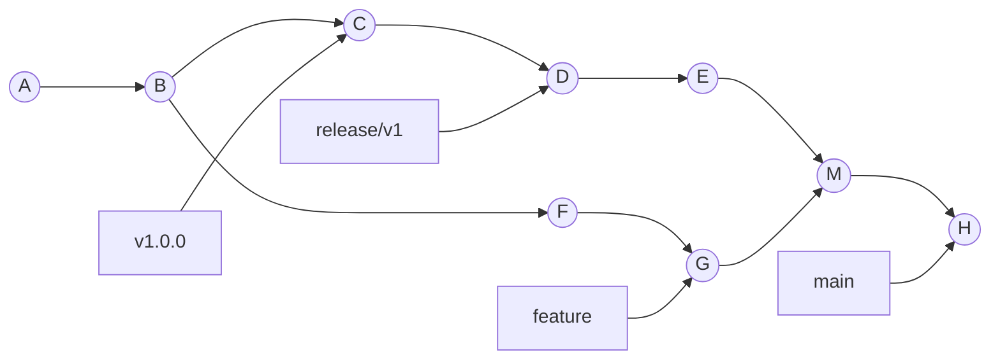
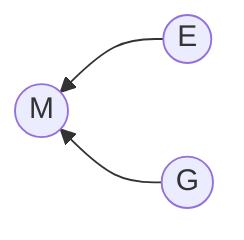
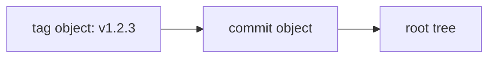

# Part 065 — Revisions and Revset Language

> Git command yang kuat hampir selalu punya dua pertanyaan tersembunyi: **object mana?** dan **set commit mana?**.
>
> Revision syntax adalah bahasa untuk menjawab pertanyaan pertama. Revset/range semantics adalah bahasa untuk menjawab pertanyaan kedua.

Banyak engineer memakai Git seperti daftar command. Engineer yang benar-benar mahir memakai Git seperti query engine terhadap repository graph.

```bash
# Bukan sekadar "lihat log".
git log origin/main..HEAD

# Artinya:
# tampilkan commit yang reachable dari HEAD
# tetapi tidak reachable dari origin/main.
```

Begitu kamu paham syntax revisi, banyak command Git berubah dari ritual menjadi query yang dapat diprediksi:

```bash
git show v2.4.0^{commit}
git log --first-parent v2.3.0..v2.4.0
git diff main...feature
git rev-list --ancestry-path bad..fix
git branch --contains 9fceb02
git merge-base --is-ancestor origin/main HEAD
git show HEAD~3:src/main/java/App.java
git log -- path/to/file
```

Dokumentasi resmi Git mendeskripsikan revision parameter sebagai extended SHA-1 syntax yang biasanya, tapi tidak selalu, menunjuk commit object. Syntax yang sama juga dapat memilih tag, tree, atau blob dalam commit.

Referensi utama:

- Git documentation: `gitrevisions`
- Git documentation: `git rev-parse`
- Git documentation: `git rev-list`
- Git documentation: `git log`
- Git documentation: `git diff`

---

## 1. Mental Model: Revision Selector vs Commit Set

Ada dua konsep yang sering tercampur:

| Konsep | Pertanyaan | Contoh |
|---|---|---|
| revision selector | object mana? | `HEAD`, `main~2`, `v1.2.0^{commit}` |
| commit set / range | commit mana saja? | `main..feature`, `A...B`, `^release HEAD` |
| path selector | path mana saja? | `-- src/**/*.java`, `:(top)README.md` |

Jangan samakan ketiganya.

```bash
# revision selector
git show HEAD~1

# commit set/range
git log origin/main..HEAD

# path selector
git log -- src/main/java
```

Satu command bisa memakai semuanya sekaligus:

```bash
git log --oneline origin/main..HEAD -- src/main/java
```

Artinya:

1. pilih commit yang reachable dari `HEAD`;
2. exclude commit yang reachable dari `origin/main`;
3. tampilkan hanya commit yang menyentuh path `src/main/java`.

Ini bukan sekadar filtering kosmetik. Ini query terhadap DAG dan tree snapshots.

---

## 2. Repository Graph Kita untuk Contoh

Kita akan pakai graph mental berikut.



Interpretasi:

- `main` menunjuk ke `H`.
- `feature` menunjuk ke `G`.
- `release/v1` menunjuk ke `D`.
- `v1.0.0` menunjuk ke `C`.
- `M` adalah merge commit dengan dua parent: `E` dan `G`.
- `H` adalah commit setelah merge.

Jika command-mu tidak bisa dijelaskan di graph seperti ini, kemungkinan besar kamu belum benar-benar memahami command itu.

---

## 3. Nama Object: Full Hash, Short Hash, Ref, Symbolic Ref

Git object dapat dipilih dengan beberapa cara.

### 3.1 Full Object ID

```bash
git show 9fceb02a8f5d...
```

Full object id adalah identitas content-addressed object.

Dalam repository SHA-1, panjangnya 40 hex. Dalam repository SHA-256, panjangnya berbeda. Jangan hardcode asumsi 40 karakter pada tooling internal modern.

### 3.2 Abbreviated Object ID

```bash
git show 9fceb02
```

Git boleh menerima prefix hash selama unik dalam object database.

Masalahnya: prefix yang unik hari ini bisa tidak unik nanti setelah object baru masuk.

**Policy untuk tooling:**

- untuk manusia: short hash boleh untuk display;
- untuk automation/audit/release evidence: simpan full object id;
- untuk artifact metadata: simpan full commit SHA plus repository identity.

```bash
# Display-friendly
git log --oneline

# Audit-friendly
git rev-parse HEAD
```

### 3.3 Ref Name

```bash
git show main
git show origin/main
git show refs/heads/main
git show refs/tags/v1.2.3
```

`main` adalah shorthand. Git akan resolve melalui aturan ref name lookup.

Lebih eksplisit:

```bash
git rev-parse refs/heads/main
git rev-parse refs/remotes/origin/main
git rev-parse refs/tags/v1.2.3
```

### 3.4 Symbolic Ref

```bash
git show HEAD
```

Biasanya `HEAD` menunjuk symbolic ref ke current branch:

```bash
git symbolic-ref HEAD
# refs/heads/main
```

Dalam detached HEAD:

```bash
git symbolic-ref HEAD
# fatal: ref HEAD is not a symbolic ref
```

Tapi `HEAD` tetap resolve ke commit:

```bash
git rev-parse HEAD
```

---

## 4. Ambiguity: Ref vs Path vs Object

Git punya banyak shorthand. Shorthand nyaman untuk manusia, tapi berbahaya untuk script.

Contoh ambigu:

```bash
git show release
```

`release` bisa saja:

- branch name;
- tag name;
- path name;
- abbreviated object id;
- ref di namespace lain.

Gunakan `--` untuk memisahkan revision dari pathspec:

```bash
git log main -- release
```

Artinya: log commit dari `main` yang menyentuh path `release`.

Bandingkan dengan:

```bash
git log release
```

Artinya: log dari revision/ref `release`.

Untuk script, lebih aman:

```bash
git rev-parse --verify refs/heads/release^{commit}
git rev-parse --verify refs/tags/release^{tag}
```

**Invariant:** ketika maksudmu ref, pakai ref namespace. Ketika maksudmu path, pakai `--`.

---

## 5. Parent Operators: `^` dan `~`

Dua operator ini terlihat mirip tapi maknanya berbeda.

### 5.1 `rev^`: Parent Selection

```bash
HEAD^
HEAD^1
HEAD^2
```

- `HEAD^` sama dengan `HEAD^1`.
- `HEAD^1` adalah first parent.
- `HEAD^2` adalah second parent, hanya valid jika commit punya parent kedua, misalnya merge commit.

Untuk merge commit `M`:



```bash
git show M^1  # parent dari jalur main/integration
git show M^2  # parent dari branch yang digabung
```

First parent biasanya jalur branch tempat merge dilakukan.

Jika `M` dibuat dengan:

```bash
git switch main
git merge feature
```

Maka biasanya:

- `M^1` = tip `main` sebelum merge;
- `M^2` = tip `feature`.

### 5.2 `rev~n`: First-Parent Chain

```bash
HEAD~1
HEAD~2
HEAD~3
```

`HEAD~3` berarti jalan mundur tiga kali melalui first parent.

```bash
HEAD~3 == HEAD^1^1^1
```

Dalam history linear, `^` dan `~` terasa mirip.

Dalam history merge, keduanya berbeda penting.

```bash
# Parent kedua dari HEAD, jika HEAD adalah merge commit
git show HEAD^2

# Tiga langkah mundur melalui first-parent chain
git show HEAD~3
```

---

## 6. Why First Parent Matters

First-parent traversal menjawab pertanyaan:

> Apa urutan perubahan yang masuk ke integration branch?

```bash
git log --first-parent main
```

Ini penting untuk repository dengan merge commit policy.

Tanpa `--first-parent`, `git log main` masuk ke semua commit dari semua branch yang pernah di-merge. Itu bagus untuk archaeology detail, tapi buruk untuk release summary.

Contoh:

```bash
# Release-level story
git log --first-parent v1.2.0..v1.3.0

# Full detailed history
git log v1.2.0..v1.3.0
```

Untuk release engineering, first-parent sering menjadi backbone audit.

---

## 7. Object Peeling: `^{type}`

Tag bisa menunjuk tag object, yang menunjuk commit object.



Jika kamu ingin commit di balik tag:

```bash
git rev-parse v1.2.3^{commit}
```

Jika kamu ingin memastikan object adalah tag object:

```bash
git rev-parse v1.2.3^{tag}
```

Jika kamu ingin peel tag sampai object non-tag:

```bash
git rev-parse v1.2.3^{}
```

Common usage:

```bash
# Pastikan release tag menunjuk commit, bukan blob/tree random.
git rev-parse --verify v1.2.3^{commit}

# Pastikan release tag adalah annotated tag object.
git rev-parse --verify v1.2.3^{tag}
```

**Policy:** untuk release, validasi keduanya:

1. tag name resolve ke tag object;
2. tag object peel ke commit object;
3. commit object adalah source yang dibangun;
4. artifact metadata menyimpan commit OID dan tag name.

---

## 8. Tree and Blob Selection: `rev:path`

Git revision syntax tidak hanya memilih commit.

```bash
git show HEAD:README.md
git show v1.2.3:src/main/java/App.java
git cat-file -p main:package.json
```

`HEAD:README.md` berarti blob/tree pada path `README.md` di tree snapshot milik `HEAD`.

Ini sangat berguna untuk:

- melihat file versi lama tanpa checkout;
- membandingkan config antar release;
- mengambil manifest dari tag;
- debugging generated release evidence.

Contoh:

```bash
# Lihat dependency manifest pada release tertentu
git show v2.0.0:package-lock.json

# Simpan file versi lama tanpa mengubah working tree
git show v2.0.0:src/config.yml > /tmp/config-v2.0.0.yml
```

Jika path mengandung karakter shell-sensitive, quote:

```bash
git show 'HEAD:docs/release notes.md'
```

---

## 9. Reflog Selectors: `@{...}`

Reflog selectors memilih posisi ref pada masa lalu.

```bash
HEAD@{1}
main@{yesterday}
main@{2026-07-01 10:00}
feature@{2}
```

Contoh real:

```bash
# Lihat posisi HEAD sebelum operasi terakhir
git show HEAD@{1}

# Pulihkan branch setelah reset salah
git branch rescue HEAD@{1}
```

`@{u}` atau `@{upstream}` memilih upstream branch dari current branch:

```bash
git rev-parse --abbrev-ref @{u}
git log @{u}..HEAD
```

`@{-1}` memilih branch yang sebelumnya di-checkout:

```bash
git switch @{-1}
```

Gunakan ini dengan hati-hati di script. Reflog bersifat lokal, bisa expire, dan tidak sama di tiap developer machine.

---

## 10. Range Syntax: `A..B`

Syntax paling penting:

```bash
A..B
```

Untuk command berbasis commit set seperti `git log`, ini berarti:

```text
reachable(B) - reachable(A)
```

Contoh:

```bash
git log origin/main..HEAD
```

Artinya:

> commit yang ada di local branch, tapi belum ada di `origin/main`.

Setara dengan:

```bash
git log ^origin/main HEAD
```

Range kosong kiri atau kanan punya default.

```bash
git log ..origin/main
# sama dengan: git log HEAD..origin/main

 git log origin/main..
# sama dengan: git log origin/main..HEAD
```

Gunakan eksplisit di dokumentasi tim. Shorthand bagus di terminal pribadi, buruk di runbook incident.

---

## 11. Symmetric Difference: `A...B`

Untuk `git log`, `A...B` berarti commit yang reachable dari salah satu side, tapi bukan dari keduanya.

Secara set:

```text
(reachable(A) ∪ reachable(B)) - (reachable(A) ∩ reachable(B))
```

Dalam praktik, Git mengexclude merge base.

```bash
git log --left-right --graph --oneline main...feature
```

Output kiri/kanan membantu melihat divergence:

```text
< commit only on main
> commit only on feature
```

Gunakan untuk menjawab:

- apa perbedaan dua branch sejak mereka diverge?
- commit mana hanya ada di main?
- commit mana hanya ada di feature?
- apakah branch sudah sync?

---

## 12. Warning: `A...B` Berbeda di `git diff`

Ini jebakan besar.

Untuk `git log`:

```bash
git log A...B
```

Artinya symmetric difference commit set.

Untuk `git diff`:

```bash
git diff A...B
```

Artinya kira-kira:

```bash
git diff $(git merge-base A B) B
```

Dengan kata lain, `git diff main...feature` menunjukkan perubahan branch `feature` sejak merge base dengan `main`.

Ini juga sebab PR UI sering menampilkan diff tiga titik: perubahan topic branch dari merge base target.

Bandingkan:

```bash
# Tree diff antara dua tip branch
git diff main..feature
# atau
git diff main feature

# Diff dari merge-base(main, feature) ke feature
git diff main...feature
```

**Rule:**

- `git log A..B`: commit in B not in A.
- `git log A...B`: commits unique to either side.
- `git diff A B`: tree difference between A and B.
- `git diff A...B`: tree difference from merge-base(A,B) to B.

Jangan menghafal simbol. Hafalkan pertanyaannya.

---

## 13. Exclusion: `^rev` dan `--not`

Commit set di Git dibangun dari positive tips dan negative tips.

```bash
git log feature ^main
```

Artinya:

- include reachable from `feature`;
- exclude reachable from `main`.

Setara dengan:

```bash
git log main..feature
```

Untuk banyak branch:

```bash
git log feature ^main ^release/v1
```

Dengan `--not`:

```bash
git log feature --not main release/v1
```

Pattern ini berguna untuk audit:

```bash
# Commit di candidate yang belum pernah masuk ke release lama atau main
git log candidate ^main ^release/v1 ^release/v2
```

---

## 14. Special Commit Set Shorthands

### 14.1 `rev^@`: All Parents

```bash
git show --no-patch --pretty=%P HEAD

git log HEAD^@
```

`rev^@` berarti semua parent dari `rev`.

Pada merge commit `M`, `M^@` expand menjadi `M^1 M^2 ...`.

### 14.2 `rev^!`: Commit Itself, Excluding Parents

```bash
git log M^!
```

Artinya: include `M`, exclude semua parent `M`.

Ini sering dipakai untuk inspect satu merge commit sebagai commit set.

```bash
git show M
git log M^!
```

### 14.3 `rev^-n`: Commit and Side Branch Merged by Parent n

`rev^-` adalah shorthand untuk `rev^1..rev`.

Pada merge commit:

```bash
git log M^-
```

Artinya commit yang dibawa oleh merge `M` relatif terhadap first parent.

Ini berguna untuk membaca apa yang masuk lewat merge commit.

```bash
# Commit yang diperkenalkan oleh merge commit M dari sisi feature
git log --oneline M^-
```

---

## 15. `rev-list`: Engine di Balik Banyak Query

`git rev-list` adalah command plumbing-ish untuk enumerasi commit.

```bash
git rev-list origin/main..HEAD
```

Ini mengembalikan commit OID, satu per baris.

Useful untuk automation:

```bash
# Hitung commit lokal yang belum dipush
git rev-list --count @{u}..HEAD

# Hitung commit remote yang belum masuk lokal
git rev-list --count HEAD..@{u}
```

Contoh branch divergence script:

```bash
upstream=${1:-@{u}}
left=$(git rev-list --count "$upstream"..HEAD)
right=$(git rev-list --count HEAD.."$upstream")

printf 'ahead=%s behind=%s\n' "$left" "$right"
```

---

## 16. Ancestry Query Patterns

### 16.1 Is A Ancestor of B?

```bash
git merge-base --is-ancestor A B
```

Exit code:

- `0`: A is ancestor of B;
- `1`: not ancestor;
- other: error.

Use case:

```bash
if git merge-base --is-ancestor origin/main HEAD; then
  echo "branch includes latest origin/main"
else
  echo "branch is missing origin/main"
fi
```

### 16.2 Which Branch Contains Commit?

```bash
git branch --contains <commit>
git branch -r --contains <commit>
git tag --contains <commit>
```

Use case:

- apakah hotfix sudah masuk maintenance branch?
- release tag mana sudah mengandung fix?
- branch mana masih vulnerable?

### 16.3 Which Branches Are Merged?

```bash
git branch --merged main
git branch --no-merged main
```

Useful untuk cleanup branch, tapi jangan otomatis delete tanpa memahami squash merge.

Squash merge tidak membuat commit original reachable dari target branch. Branch bisa tampak `--no-merged` padahal perubahan sudah ada sebagai squash commit.

---

## 17. `--ancestry-path`: Jalur Kausal dalam DAG

Misal kamu punya bad commit dan fix commit.

```bash
git log --ancestry-path bad..fix
```

Ini menampilkan commit yang berada pada ancestry path dari `bad` ke `fix`.

Use case:

- audit jalur dari vulnerable commit ke patched release;
- memahami apa yang terjadi antara introduced bug dan fixed bug;
- membatasi noise di graph bercabang.

Contoh:

```bash
git log --oneline --ancestry-path CVE_INTRODUCED..PATCH_RELEASE
```

---

## 18. `--first-parent`: Integration Story

```bash
git log --first-parent v1.2.0..v1.3.0
```

Ini tidak berarti "hanya merge commit". Ini berarti traversal mengikuti first-parent edge.

Use case:

- release notes berbasis integration branch;
- audit kapan PR masuk main;
- revert merge commit di jalur utama;
- membaca mainline story tanpa masuk ke semua commit internal feature branch.

Pattern:

```bash
git log --first-parent --merges --oneline v1.2.0..v1.3.0
```

Untuk repo dengan merge commit policy, ini bisa menjadi daftar PR yang masuk release.

---

## 19. `--cherry`, `--cherry-pick`, Patch Equivalence

Dalam backport/cherry-pick workflow, commit hash berubah. Jadi reachability saja tidak cukup.

Git punya opsi untuk membandingkan patch equivalence.

```bash
git log --cherry-pick --right-only main...maintenance/v1
```

Use case:

- cari patch yang ada di maintenance tapi belum ada equivalent patch di main;
- cari backport yang belum masuk release branch;
- audit duplicate cherry-pick.

`git cherry` juga berguna:

```bash
git cherry -v origin/main HEAD
```

Output `+` berarti patch belum equivalent di upstream. Output `-` berarti patch equivalent sudah ada.

---

## 20. Revision Selection in CI

CI sering salah karena checkout shallow, ref PR khusus, atau tag tidak diambil.

Common bug:

```bash
git describe --tags --always
# gagal atau menghasilkan versi aneh karena tags tidak difetch
```

Common bug:

```bash
git diff origin/main...HEAD
# gagal karena merge-base tidak ada di shallow clone
```

Checklist CI:

```bash
# Pastikan refs yang dibutuhkan tersedia
git fetch --tags origin

# Untuk PR diff berbasis merge-base, pastikan base history cukup
git fetch origin main --depth=1000

# Validasi merge-base ada
git merge-base --is-ancestor $(git merge-base origin/main HEAD) HEAD
```

Lebih sederhana: jangan gunakan shallow clone untuk job yang butuh history correctness seperti changelog, semantic versioning, blame, bisect, affected-test detection, atau release notes.

---

## 21. Detached HEAD and Revision Safety

Dalam detached HEAD:

```bash
git status
# HEAD detached at <sha>
```

`HEAD` masih valid, tapi tidak ada branch pointer yang otomatis bergerak jika kamu membuat commit.

```bash
git commit -m "experiment"
```

Commit baru reachable dari `HEAD`, tapi mudah hilang dari pandangan ketika kamu checkout branch lain.

Recovery:

```bash
git branch rescue-detached HEAD
git switch rescue-detached
```

Policy:

- detached HEAD bagus untuk inspect tag/release;
- buruk untuk work yang perlu disimpan kecuali segera buat branch;
- CI biasanya detached HEAD, jadi script harus jangan asumsi current branch tersedia.

```bash
# Boleh di CI
git rev-parse HEAD

# Bisa gagal/menyesatkan di CI detached HEAD
git branch --show-current
```

---

## 22. Shell Quoting Pitfalls

Revision syntax memakai karakter yang juga punya makna di shell.

Contoh:

```bash
HEAD^{}
main@{u}
HEAD~3
feature^{commit}
```

Di shell Unix biasanya aman, tapi beberapa karakter tetap perlu quote tergantung context. Di PowerShell/cmd, `^` punya aturan escape sendiri.

Rule aman untuk runbook lintas OS:

```bash
git rev-parse 'HEAD^{commit}'
git rev-parse 'main@{u}'
git show 'v1.2.3:docs/release notes.md'
```

Untuk script, hindari revision string yang terlalu clever jika bisa dipecah:

```bash
base=$(git merge-base origin/main HEAD)
git diff "$base" HEAD
```

Ini lebih readable dan lebih mudah debug daripada:

```bash
git diff origin/main...HEAD
```

---

## 23. Practical Query Cookbook

### 23.1 Apa commit lokal yang belum dipush?

```bash
git log --oneline @{u}..HEAD
```

### 23.2 Apa commit remote yang belum masuk lokal?

```bash
git log --oneline HEAD..@{u}
```

### 23.3 Apakah branch saya sudah up-to-date dengan main?

```bash
git merge-base --is-ancestor origin/main HEAD
```

### 23.4 Apa perubahan branch saya sejak diverge dari main?

```bash
git diff origin/main...HEAD
```

### 23.5 Apa commit di branch saya sejak diverge dari main?

```bash
git log --oneline origin/main..HEAD
```

### 23.6 Apa divergence dua branch?

```bash
git log --left-right --cherry-pick --oneline main...feature
```

### 23.7 Apa commit yang masuk release berdasarkan first-parent?

```bash
git log --first-parent --oneline v1.2.0..v1.3.0
```

### 23.8 Commit mana yang memperkenalkan file tertentu?

```bash
git log --diff-filter=A -- path/to/file
```

### 23.9 Isi file pada tag lama?

```bash
git show v1.2.0:path/to/file
```

### 23.10 Apakah release tag menunjuk commit valid?

```bash
git rev-parse --verify 'v1.2.0^{commit}'
```

### 23.11 Apakah tag adalah annotated tag object?

```bash
git rev-parse --verify 'v1.2.0^{tag}'
```

### 23.12 Apa yang dibawa merge commit?

```bash
git log --oneline MERGE_COMMIT^-
```

### 23.13 Lihat file dari parent kedua merge commit

```bash
git show 'MERGE_COMMIT^2:path/to/file'
```

### 23.14 Cari commit yang reachable dari semua refs tertentu

```bash
git merge-base main release/v1 release/v2
```

### 23.15 Enumerasi semua commit reachable dari semua branches

```bash
git rev-list --all
```

---

## 24. Dangerous Misreadings

### 24.1 “`main..feature` adalah diff antara main dan feature”

Untuk `git log`, benar sebagai commit set.

Untuk `git diff`, beda lagi karena diff membandingkan tree snapshot.

```bash
git log main..feature
# commit reachable dari feature tapi bukan main

git diff main..feature
# tree diff main vs feature, practically same as git diff main feature
```

### 24.2 “`main...feature` selalu symmetric diff”

Tidak untuk `git diff`.

```bash
git log main...feature
# symmetric difference commit set

git diff main...feature
# diff merge-base(main, feature) -> feature
```

### 24.3 “`HEAD~2` sama dengan `HEAD^2`”

Tidak.

- `HEAD~2`: first parent dua langkah mundur.
- `HEAD^2`: parent kedua dari `HEAD`.

### 24.4 “Short SHA cukup untuk audit”

Tidak. Short SHA adalah display artifact, bukan durable evidence.

### 24.5 “Branch contains fix jika patch-nya sama”

Reachability dan patch equivalence berbeda.

Cherry-pick menghasilkan commit baru. Gunakan `git cherry`, `--cherry-pick`, atau metadata `-x` untuk audit backport.

---

## 25. Decision Framework: Which Revision Query?

```mermaid
flowchart TD
  A[What are you asking?] --> B[Object identity]
  A --> C[Commit set]
  A --> D[Tree/file content]
  A --> E[Ancestry relation]
  A --> F[Patch equivalence]

  B --> B1[git rev-parse --verify REV^{type}]
  C --> C1[git log A..B / A...B / ^A B]
  D --> D1[git show REV:path]
  E --> E1[git merge-base --is-ancestor A B]
  F --> F1[git cherry / --cherry-pick]
```

Use this table:

| Need | Use |
|---|---|
| verify ref resolves to commit | `git rev-parse --verify 'ref^{commit}'` |
| local commits not pushed | `git log @{u}..HEAD` |
| branch diff for PR | `git diff target...HEAD` |
| exact tree difference | `git diff A B` |
| divergence view | `git log --left-right A...B` |
| release integration story | `git log --first-parent old..new` |
| whether A is included in B | `git merge-base --is-ancestor A B` |
| whether patch equivalent exists | `git cherry -v upstream head` |
| file at old revision | `git show rev:path` |
| recover previous state | `git show HEAD@{1}` |

---

## 26. Implementation Lab: Build a Branch Divergence Report

Goal: make branch state explicit.

Create `git-divergence.sh`:

```bash
#!/usr/bin/env bash
set -euo pipefail

upstream=${1:-@{u}}

head_oid=$(git rev-parse --verify HEAD^{commit})
upstream_oid=$(git rev-parse --verify "$upstream^{commit}")
base_oid=$(git merge-base HEAD "$upstream")

ahead=$(git rev-list --count "$upstream"..HEAD)
behind=$(git rev-list --count HEAD.."$upstream")

echo "HEAD      : $head_oid"
echo "upstream  : $upstream_oid"
echo "mergeBase : $base_oid"
echo "ahead     : $ahead"
echo "behind    : $behind"

echo
echo "local-only commits:"
git log --oneline "$upstream"..HEAD || true

echo
echo "upstream-only commits:"
git log --oneline HEAD.."$upstream" || true
```

Run:

```bash
chmod +x git-divergence.sh
./git-divergence.sh
./git-divergence.sh origin/main
```

What this teaches:

- `rev-parse` verifies object selection;
- `merge-base` gives graph boundary;
- `rev-list --count` computes set size;
- `A..B` encodes directional difference.

---

## 27. Implementation Lab: Release Tag Verifier

Create `verify-release-tag.sh`:

```bash
#!/usr/bin/env bash
set -euo pipefail

tag=${1:?usage: verify-release-tag.sh <tag>}

# Must be an annotated tag object.
tag_oid=$(git rev-parse --verify "$tag^{tag}")

# Must peel to a commit object.
commit_oid=$(git rev-parse --verify "$tag^{commit}")

echo "tag object : $tag_oid"
echo "commit     : $commit_oid"

echo
echo "tag metadata:"
git for-each-ref "refs/tags/$tag" \
  --format='%(refname:short)%09%(objecttype)%09%(objectname)%09%(*objecttype)%09%(*objectname)'
```

This catches:

- missing tag;
- lightweight tag when policy expects annotated tag;
- tag that does not peel to commit;
- tooling that accidentally builds from mutable branch instead of release commit.

---

## 28. Engineering Invariants

Memorize these:

1. `A..B` in commit-walking commands means **reachable from B excluding reachable from A**.
2. `A...B` in `git log` means **symmetric difference**.
3. `A...B` in `git diff` means **merge-base(A,B) to B**.
4. `rev^n` selects parent `n`.
5. `rev~n` walks first-parent chain `n` times.
6. `rev:path` selects blob/tree content from a commit tree.
7. `^{commit}` validates the selected object can peel to commit.
8. `@{u}` depends on upstream configuration.
9. Reflog selectors are local and expire.
10. Short SHA is acceptable for humans, not for release evidence.
11. Reachability and patch equivalence are different.
12. Always use `--` when mixing revisions and paths.

---

## 29. Practice Drills

Run these in a test repository with at least one merge commit.

### Drill 1 — Parent Identity

```bash
git show --no-patch --pretty=raw HEAD
git show HEAD^1
git show HEAD^2
```

Explain which parent is mainline and why.

### Drill 2 — Range Direction

```bash
git log --oneline main..feature
git log --oneline feature..main
```

Explain why results differ.

### Drill 3 — Diff Semantics

```bash
git diff main feature
git diff main...feature
git log main...feature
```

Explain why the three outputs answer different questions.

### Drill 4 — Tag Peeling

```bash
git tag lightweight-test HEAD
git tag -a annotated-test -m "annotated" HEAD

git rev-parse lightweight-test^{commit}
git rev-parse annotated-test^{tag}
git rev-parse annotated-test^{}
```

Explain each object identity.

### Drill 5 — Reflog Recovery

```bash
git reset --hard HEAD~1
git reflog --date=iso
git branch rescue HEAD@{1}
```

Explain why recovery works.

---

## 30. Summary

Revision syntax is Git's addressing language.

It lets you select:

- refs;
- commits;
- parents;
- tag targets;
- tree snapshots;
- file blobs;
- previous reflog positions.

Range syntax is Git's commit-set language.

It lets you ask:

- what is only on my branch?
- what is only on remote?
- what diverged since merge base?
- what entered a release?
- which commits are on a causal path?
- which patch already exists under a different hash?

Top-tier Git usage is not memorizing more commands. It is being able to express the exact graph query you intend.

Next, we move from **which revision/commit set** to **which path set**: pathspecs, ignore rules, tracked/untracked semantics, and why `.gitignore` does not do what many people think it does.
