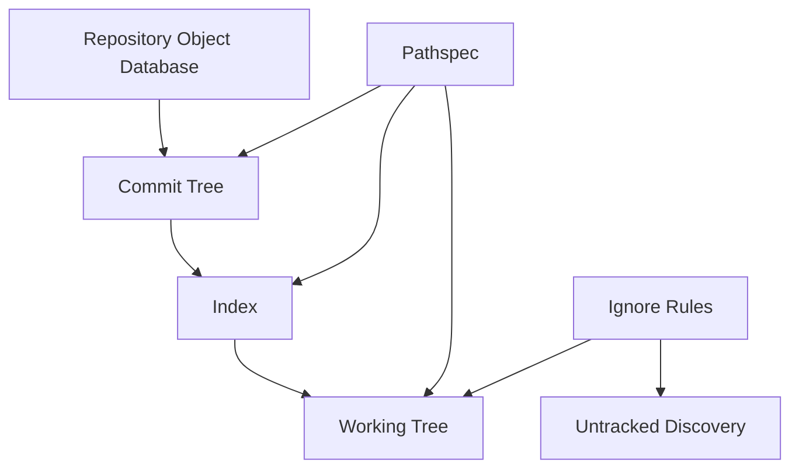
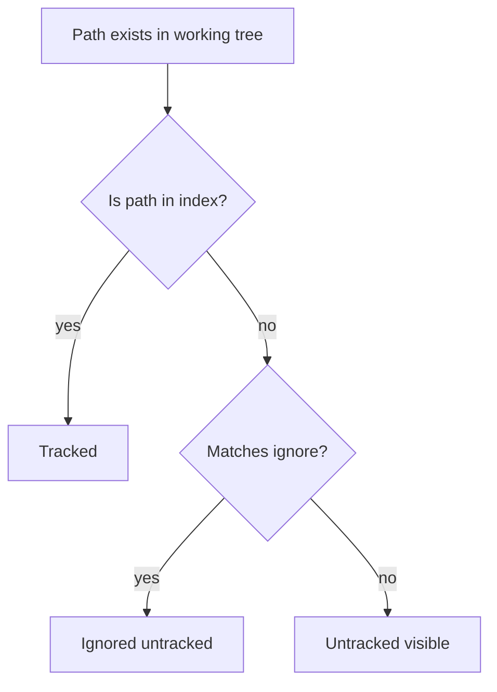

# Part 066 — Pathspecs and Ignore Matching

> Revision syntax menjawab: **commit/object mana?**
>
> Pathspec menjawab: **path mana?**
>
> Ignore rules menjawab: **untracked path mana yang sebaiknya tidak diperhatikan Git?**

Banyak engineer mengira path di Git cuma string biasa:

```bash
git add src
```

Padahal Git punya bahasa path sendiri: **pathspec**.

Pathspec dipakai oleh banyak command:

```bash
git add <pathspec>
git restore <pathspec>
git checkout <tree-ish> -- <pathspec>
git diff -- <pathspec>
git log -- <pathspec>
git grep <pattern> -- <pathspec>
git ls-files <pathspec>
```

Ignore matching adalah topik berbeda, tapi berinteraksi erat dengan pathspec karena keduanya menentukan apa yang masuk operasi Git.

Dokumentasi resmi Git mendeskripsikan pathspec sebagai pola yang digunakan banyak command untuk membatasi scope operasi ke subset tree atau working tree. Dokumentasi `gitignore` menjelaskan bahwa `.gitignore` hanya mengatur file yang intentionally untracked; file yang sudah tracked tidak otomatis diabaikan.

---

## 1. Mental Model: Tree, Working Tree, Pathspec, Ignore

Git melihat path dari beberapa layer.



Bedakan:

| Konsep | Menjawab | Berlaku pada |
|---|---|---|
| tree path | path di snapshot commit/tree | object database |
| working-tree path | file/directory di filesystem | working directory |
| pathspec | path mana yang command targetkan | command scope |
| ignore rule | untracked path mana yang disembunyikan/diabaikan | untracked file discovery |
| tracked file | file sudah ada di index/history | tidak dipengaruhi `.gitignore` secara otomatis |

`.gitignore` bukan firewall. `.gitignore` bukan security boundary. `.gitignore` bukan cara menghapus file dari history.

---

## 2. The `--` Separator Is Not Optional Discipline

Ketika command menerima revision dan path, gunakan `--`.

```bash
git log main -- src/app
```

Artinya:

- revision: `main`;
- pathspec: `src/app`.

Tanpa `--`:

```bash
git log main src/app
```

Git harus menebak apakah `src/app` revision atau path.

Dalam repo kecil mungkin aman. Dalam repo besar dengan branch/tag/path bernama sama, ini bisa salah.

**Policy:** di runbook, script, dan dokumentasi tim, selalu pakai `--` ketika command mencampur revision dan path.

```bash
git diff origin/main...HEAD -- src/main/java
git checkout v1.2.0 -- config/default.yml
git log --follow -- src/domain/Case.java
```

---

## 3. Basic Pathspec Matching

Pathspec paling sederhana adalah path literal atau prefix directory.

```bash
git status -- src
git diff -- README.md
git add src/main/java
git log -- docs
```

Dalam banyak command, directory path berarti semua path di bawah directory itu.

```bash
git diff -- src
```

Artinya diff untuk path di bawah `src/`.

Tapi jangan mengasumsikan semua command memperlakukan path sama persis. Dokumentasi tiap command menentukan apakah path relatif terhadap current directory atau repository root.

---

## 4. Pathspec Is Evaluated by Git, Not Just the Shell

Shell glob dan Git pathspec glob bukan hal yang sama.

```bash
git add *.java
```

Jika shell expand `*.java`, Git menerima daftar file hasil ekspansi shell.

```bash
git add '*.java'
```

Jika quote dipakai, Git menerima pattern dan melakukan pathspec matching sendiri.

Ini berbeda.

Contoh:

```bash
# Shell expands only files in current directory, unless shell globstar enabled.
git add *.js

# Git receives pattern and can match according to pathspec rules.
git add '*.js'
```

Rule praktis:

- quote pattern dengan `*`, `?`, `[`, `!`, `:`;
- gunakan `:(glob)` jika butuh glob semantics eksplisit;
- untuk script, prefer path list dari `git ls-files -z` + `xargs -0` jika scope rumit.

---

## 5. Pathspec Magic

Pathspec yang diawali `:` dapat memakai **magic signature** atau **magic word**.

Contoh:

```bash
git grep TODO -- ':(top)src'
git ls-files ':(icase)readme.md'
git add ':(literal)*.md'
git diff -- ':(exclude)vendor/**'
```

Long form:

```bash
:(top,literal)README.md
:(glob)src/**/*.java
:(icase)readme.md
:(exclude)generated/**
```

Short form juga ada untuk magic tertentu, tapi long form lebih readable untuk handbook dan script.

---

## 6. `:(top)` — Anchor to Repository Root

`:(top)` membuat pathspec dievaluasi dari root repository, bukan current directory.

```bash
git status -- ':(top)README.md'
git grep 'CaseState' -- ':(top)src/main/java'
```

Ini penting untuk script yang bisa dipanggil dari subdirectory.

Bad script:

```bash
git diff -- src/main/java
```

Jika script dijalankan dari `services/billing`, path tersebut mungkin tidak ada.

Better:

```bash
git diff -- ':(top)src/main/java'
```

Atau set root eksplisit:

```bash
root=$(git rev-parse --show-toplevel)
cd "$root"
git diff -- src/main/java
```

---

## 7. `:(literal)` — Treat Special Characters Literally

Path dengan karakter khusus bisa disalahartikan sebagai glob/pathspec magic.

```bash
git add ':(literal)docs/[draft]*.md'
```

Artinya: file literal bernama `docs/[draft]*.md`, bukan pattern.

Use case:

- generated file dengan bracket;
- test fixture dengan `*` pada nama file;
- migration file dengan karakter aneh;
- repository lint yang harus aman terhadap semua path.

Dalam automation, jangan membangun command string mentah dari path user. Gunakan NUL-separated path list dan `--pathspec-from-file` jika perlu.

---

## 8. `:(icase)` — Case-Insensitive Matching

```bash
git ls-files ':(icase)readme.md'
```

Use case:

- repository lint untuk cross-platform path collision;
- mencari `README`, `Readme`, `readme`;
- audit file name normalization.

Hati-hati dengan filesystem case-insensitive seperti default macOS/Windows. Git index bisa membedakan path yang filesystem lokal sulit bedakan.

Audit:

```bash
git ls-files | awk '{print tolower($0)}' | sort | uniq -d
```

Jika ada duplicate lowercase path, tim lint harus menolak karena clone di OS lain bisa rusak/ambigu.

---

## 9. `:(glob)` — Glob Semantics

```bash
git ls-files ':(glob)src/**/*.java'
git grep '@Transactional' -- ':(glob)**/*.java'
```

Gunakan `:(glob)` saat kamu ingin pattern eksplisit.

Namun untuk banyak workflow, pathspec directory sederhana lebih cepat dan lebih jelas:

```bash
git diff -- src/main/java
```

lebih mudah dibaca daripada:

```bash
git diff -- ':(glob)src/main/java/**'
```

Gunakan glob saat perlu pola lintas directory atau extension filter.

---

## 10. `:(attr:...)` — Match by Git Attributes

Pathspec bisa memilih path berdasarkan attribute.

Misal `.gitattributes`:

```gitattributes
*.pb.go generated
*.snap snapshot
*.md text
```

Query:

```bash
git ls-files ':(attr:generated)'
git diff -- ':(attr:snapshot)'
```

Use case advanced:

- exclude generated files dari custom review report;
- audit file yang punya custom merge driver;
- pilih snapshot/golden files;
- enforce generated-file policy.

Contoh:

```bash
# File generated yang berubah dalam branch ini
git diff --name-only origin/main...HEAD -- ':(attr:generated)'
```

Ini lebih robust daripada hardcode `generated/` jika generated files tersebar.

---

## 11. Exclude Pathspec: `:(exclude)` / `:!`

Exclude pathspec menghapus path dari match set.

```bash
git diff -- . ':(exclude)vendor/**'
```

Short form sering ditemui:

```bash
git diff -- . ':!vendor/**'
```

Contoh review:

```bash
# Diff branch tanpa generated files
git diff origin/main...HEAD -- . ':(exclude)generated/**' ':(exclude)*.lock'
```

Hati-hati: exclude pathspec bekerja sebagai bagian dari command pathspec matching, bukan `.gitignore`.

Jika hanya ada exclude tanpa include, Git punya aturan khusus; lebih jelas sertakan include `.` atau `:(top)`.

```bash
# More explicit
git grep TODO -- . ':(exclude)vendor/**'
```

---

## 12. `--pathspec-from-file` and NUL Safety

Untuk path banyak atau path dengan karakter aneh, jangan inject path ke command line.

Gunakan:

```bash
git add --pathspec-from-file=paths.txt
```

Untuk NUL-separated:

```bash
git add --pathspec-from-file=paths.txt --pathspec-file-nul
```

Generate dari command Git:

```bash
git diff --name-only -z origin/main...HEAD > /tmp/changed-paths.z

git add --pathspec-from-file=/tmp/changed-paths.z --pathspec-file-nul
```

Ini penting untuk repo enterprise karena path bisa mengandung spasi, newline, quote, bracket, unicode, dan karakter shell-sensitive.

**Policy automation:** gunakan NUL-separated pipeline untuk path list yang berasal dari repository content.

---

## 13. Pathspec vs `.gitignore`

Pathspec membatasi command.

`.gitignore` memengaruhi untracked file discovery.

Contoh:

```gitignore
build/
.env
```

```bash
git status
```

Git tidak menampilkan `build/` dan `.env` sebagai untracked.

Tapi jika file sudah tracked:

```bash
git add .env
git commit -m "accidentally track env"
```

Lalu kamu menambah `.env` ke `.gitignore`, file itu tetap tracked.

```bash
git status
# perubahan .env tetap muncul jika file berubah
```

Untuk berhenti track file tapi tetap simpan lokal:

```bash
git rm --cached .env
git commit -m "Stop tracking local env file"
```

Untuk secret: jangan berhenti di sini. Secret yang pernah commit harus dirotasi dan history exposure harus ditangani.

---

## 14. Ignore Rule Sources and Precedence

Git membaca ignore pattern dari beberapa sumber.

Umumnya:

1. command-line exclude pattern pada command tertentu;
2. `.gitignore` di directory terkait;
3. `$GIT_DIR/info/exclude` untuk local repo exclude;
4. global excludes file dari config `core.excludesFile`.

Dalam satu level precedence, pattern terakhir yang cocok biasanya menang.

Practical usage:

| Source | Commit ke repo? | Use case |
|---|---:|---|
| `.gitignore` | yes | build artifacts, generated outputs common to project |
| `.git/info/exclude` | no | local-only ignore untuk satu clone |
| global excludes | no | OS/editor personal noise seperti `.DS_Store` |

Jangan masukkan preference pribadi semua orang ke `.gitignore` repository.

Better:

```bash
git config --global core.excludesFile ~/.config/git/ignore
```

Isi global ignore:

```gitignore
.DS_Store
.idea/
.vscode/
*.swp
```

Kecuali project memang menetapkan IDE config sebagai bagian repository policy.

---

## 15. Gitignore Pattern Semantics

Contoh `.gitignore`:

```gitignore
# Ignore all log files
*.log

# Ignore build directory at any level
build/

# Ignore only root-level dist
/dist/

# Do not ignore this specific file
!important.log
```

Rules penting:

| Pattern | Meaning |
|---|---|
| `*.log` | match file dengan extension `.log` di berbagai directory |
| `build/` | match directory bernama `build` |
| `/dist/` | match `dist` di root `.gitignore` tersebut |
| `docs/*.html` | match file langsung di `docs`, bukan recursive deep kecuali pattern pakai `**` |
| `!file` | negation: unignore jika parent directory tidak sudah excluded secara blocking |

---

## 16. Negation Trap: You Cannot Re-include Inside Ignored Directory Easily

Misal:

```gitignore
build/
!build/keep.txt
```

Sering tidak bekerja seperti yang diharapkan, karena directory `build/` sudah di-ignore sehingga Git tidak descend untuk melihat `keep.txt`.

Better:

```gitignore
build/*
!build/keep.txt
```

Jika perlu re-include nested path:

```gitignore
build/*
!build/keep/
!build/keep/**
```

Mental model:

> Jika parent directory sendiri di-ignore penuh, Git mungkin tidak mengevaluasi child negation seperti yang kamu bayangkan.

---

## 17. Debugging Ignore: `git check-ignore`

Command utama:

```bash
git check-ignore -v path/to/file
```

Output menunjukkan file ignore mana dan line mana yang match.

Contoh:

```bash
git check-ignore -v .env
# .gitignore:12:.env .env
```

Untuk banyak file:

```bash
git check-ignore -v --stdin < paths.txt
```

Jika file tracked, ignore tidak berlaku untuk status tracking biasa. Pakai:

```bash
git ls-files --error-unmatch .env
```

Jika command exit 0, file tracked.

---

## 18. Tracked vs Untracked vs Ignored



Commands:

```bash
# tracked files
git ls-files

# untracked visible files
git ls-files --others --exclude-standard

# ignored files
git ls-files --others --ignored --exclude-standard

# tracked ignored-looking files
git ls-files -ci --exclude-standard
```

`git ls-files -ci --exclude-standard` berguna untuk menemukan file tracked yang sekarang match ignore rules.

---

## 19. `assume-unchanged` vs `skip-worktree`

Dua flag ini sering disalahgunakan untuk “ignore tracked file”.

### 19.1 `assume-unchanged`

```bash
git update-index --assume-unchanged path
```

Tujuannya performance hint: Git boleh mengasumsikan file tidak berubah.

Bukan mekanisme config lokal.

Unset:

```bash
git update-index --no-assume-unchanged path
```

List:

```bash
git ls-files -v | grep '^h'
```

### 19.2 `skip-worktree`

```bash
git update-index --skip-worktree path
```

Dipakai dalam sparse checkout dan kasus advanced agar Git menghindari update working tree path tertentu.

Unset:

```bash
git update-index --no-skip-worktree path
```

List:

```bash
git ls-files -v | grep '^S'
```

**Policy:** jangan jadikan dua flag ini sebagai workflow umum untuk file config lokal. Lebih baik:

- commit template file: `.env.example`;
- ignore real local file: `.env`;
- gunakan config injection/env vars;
- gunakan secret manager;
- dokumentasikan bootstrap.

---

## 20. Pathspec in Partial Commit Workflow

Pathspec bisa membatasi staging.

```bash
git add -- src/domain src/application
```

Tapi pathspec-level staging masih kasar jika perubahan dalam file bercampur. Untuk hunk-level, gunakan:

```bash
git add -p -- src/domain/CaseService.java
```

Combine:

```bash
git diff -- src/domain
git add -p -- src/domain
git commit -m "Enforce case escalation invariant"
```

Failure mode:

```bash
git add src
```

Tanpa sadar ikut men-stage generated file, lockfile, atau local config di bawah `src`.

Safer:

```bash
git diff --name-only
 git diff --cached --name-only
```

Before commit:

```bash
git diff --cached --stat
git diff --cached --check
git diff --cached
```

---

## 21. Pathspec in Restore and Checkout

Restore selected paths from index or commit.

```bash
# Discard working tree change for path
git restore -- src/domain/Case.java

# Unstage path
git restore --staged -- src/domain/Case.java

# Restore path from old commit
git restore --source=v1.2.0 -- src/config.yml
```

Older syntax:

```bash
git checkout v1.2.0 -- src/config.yml
```

The `--` matters.

Without it, Git may interpret argument as branch/ref.

---

## 22. Pathspec in Log: History Simplification

```bash
git log -- src/domain/Case.java
```

This does not simply filter already-listed commits. Git performs path-limited history traversal and may simplify history.

For rename:

```bash
git log --follow -- src/domain/Case.java
```

Limitations:

- `--follow` works for one path at a time;
- rename detection is heuristic;
- large refactor can confuse archaeology;
- path-limited log may hide merge context.

For forensic work:

```bash
git log --full-history --simplify-merges -- src/domain/Case.java
```

And compare with:

```bash
git log --graph --oneline --all -- src/domain/Case.java
```

---

## 23. Pathspec in Diff: Review Scoping

Examples:

```bash
# Diff only API contracts
git diff origin/main...HEAD -- ':(top)api'

# Diff Java code, exclude generated
git diff origin/main...HEAD -- ':(glob)**/*.java' ':(exclude)**/generated/**'

# Diff everything except lockfiles
git diff origin/main...HEAD -- . ':(exclude)*.lock'
```

But be careful: excluding paths in review can hide important coupling.

Example:

```bash
git diff origin/main...HEAD -- . ':(exclude)package-lock.json'
```

This may hide dependency drift.

Use exclude pathspec for focused inspection, not as replacement for full review.

---

## 24. Pathspec in Grep

```bash
git grep 'TODO' -- src
git grep 'password' -- ':(top)src' ':(exclude)src/test/fixtures/**'
git grep -n 'CaseStatus' -- ':(glob)**/*.java'
```

Search at old revision:

```bash
git grep 'legacyFlag' v1.2.0 -- src
```

This searches tree snapshot at `v1.2.0`, not working tree.

Useful for:

- checking if config existed in old release;
- auditing dangerous API usage;
- finding migration boundary;
- comparing codebase state across release tags.

---

## 25. Pathspec in `ls-files`: The Truth About Index

`git ls-files` is one of the best debugging tools for path state.

```bash
# tracked files matching pathspec
git ls-files -- src

# untracked files respecting ignore rules
git ls-files --others --exclude-standard -- src

# ignored files
git ls-files --others --ignored --exclude-standard -- src

# staged conflict entries
git ls-files -u -- src

# stage and flags
git ls-files -s -- src
```

If `git status` feels confusing, inspect with `git ls-files`.

---

## 26. Generated Files and Path Boundaries

Generated files create review noise and merge conflict risk.

Options:

| Type | Recommended treatment |
|---|---|
| build output | ignore, never commit |
| generated source needed for build | commit only if build toolchain requires it |
| generated API client | either commit with clear ownership or publish artifact/package |
| snapshots/golden files | commit, but tag via `.gitattributes` if possible |
| lockfiles | commit for apps; policy depends for libraries |

Use `.gitattributes` for classification:

```gitattributes
*.snap snapshot
src/generated/** generated
```

Then query:

```bash
git diff --name-only origin/main...HEAD -- ':(attr:generated)'
```

Review policy:

- generated-only PR can be auto-routed differently;
- generated + manual change in same PR needs stronger scrutiny;
- generated file should include source-of-truth pointer.

---

## 27. Secret Files and Ignore Rules

`.gitignore` helps prevent accidental add of untracked local secret files.

It does not protect against:

- `git add -f secret.env`;
- secret already tracked;
- secret committed before ignore rule;
- secret in reflog, stash, packfile, remote clone;
- secret in CI logs or artifacts.

Recommended pattern:

```gitignore
.env
.env.*
!.env.example
```

But also use:

- pre-commit secret scanning;
- server-side/pre-receive checks;
- CI secret scanning;
- secret manager;
- rotation playbook.

If secret leaked, rotate first. History rewrite is secondary containment, not primary remediation.

---

## 28. Sparse Checkout Interaction

Sparse checkout uses path patterns and index flags to restrict working tree materialization.

This interacts with pathspec because a path may exist in repository tree but not in working tree.

Example:

```bash
git sparse-checkout set services/billing
```

A file outside sparse cone may be absent locally, but still tracked in repository.

Commands that operate on object database can still inspect it:

```bash
git show HEAD:services/case/src/Case.java
```

Commands that operate on working tree may not see it normally.

Policy for large repo tooling:

- distinguish tree queries from working tree queries;
- use `git ls-tree`/`git cat-file` for repository-wide analysis;
- use sparse-aware commands where possible;
- do not assume missing working tree path means missing repository path.

---

## 29. Case Sensitivity and Unicode Path Risk

Git stores path bytes. Filesystems may impose case folding or Unicode normalization.

Risk examples:

```text
src/User.java
src/user.java
```

Works on case-sensitive filesystem, problematic on case-insensitive filesystem.

Audit:

```bash
git ls-files | awk '{print tolower($0)}' | sort | uniq -d
```

Unicode normalization issue is harder. Enforce path naming policy:

- ASCII for source file paths where possible;
- lowercase/kebab/snake convention for directories;
- no trailing spaces;
- no control characters;
- no newline in filenames;
- no paths differing only by case.

For platform teams, add a repository lint.

---

## 30. Line Endings, Attributes, and Path Matching

`.gitattributes` is separate from `.gitignore`.

It controls attributes like:

```gitattributes
*.sh text eol=lf
*.bat text eol=crlf
*.png binary
*.lock -diff
```

This affects normalization, diff drivers, merge drivers, and path attribute queries.

Pathspec can use attributes:

```bash
git ls-files ':(attr:binary)'
```

But attributes only work if attributes are set appropriately.

Do not encode everything in path names if attributes better capture semantics.

---

## 31. Operational Playbook: “Why Is This File Not Showing Up?”

Symptoms:

```bash
git status
# file not shown
```

Checklist:

### Step 1 — Does file exist?

```bash
ls -la path/to/file
```

### Step 2 — Is it tracked?

```bash
git ls-files --error-unmatch path/to/file
```

If tracked, `.gitignore` is not hiding it.

### Step 3 — Is it ignored?

```bash
git check-ignore -v path/to/file
```

### Step 4 — Is it outside sparse checkout?

```bash
git sparse-checkout list
```

### Step 5 — Does pathspec exclude it?

Check command scope:

```bash
git status -- path/to/parent
git status -- . ':(exclude)path/to/file'
```

### Step 6 — Is file mode/case issue involved?

```bash
git config core.ignorecase
git ls-files | grep -i 'file-name'
```

---

## 32. Operational Playbook: “Why Is This Ignored File Still Tracked?”

Because ignore rules do not apply to tracked files.

Diagnose:

```bash
git ls-files --error-unmatch path/to/file
git check-ignore -v path/to/file
```

If both are true, file is tracked and matches ignore rule.

To stop tracking:

```bash
git rm --cached path/to/file
git commit -m "Stop tracking local-only file"
```

If file contains secret:

1. rotate secret;
2. identify exposure;
3. decide history rewrite necessity;
4. notify consumers;
5. add prevention controls.

---

## 33. Operational Playbook: “Pathspec Did Not Match Any Files”

Error:

```text
error: pathspec 'foo' did not match any file(s) known to git
```

Possible causes:

- file is untracked but command expects tracked path;
- typo/case mismatch;
- path relative to wrong directory;
- sparse checkout hides path in working tree;
- shell expanded glob unexpectedly;
- branch/tag/path ambiguity;
- path exists in another revision but not current index.

Debug:

```bash
pwd
git rev-parse --show-toplevel
git ls-files -- ':(top)foo'
git ls-tree -r --name-only HEAD | grep -F 'foo'
git status --ignored -- ':(top)foo'
```

If path exists in old revision:

```bash
git ls-tree -r --name-only v1.2.0 | grep -F 'foo'
```

---

## 34. Automation Patterns

### 34.1 Changed Java Files in PR

```bash
base=$(git merge-base origin/main HEAD)
git diff --name-only -z "$base" HEAD -- ':(glob)**/*.java' \
  | xargs -0 -r ./lint-java.sh
```

### 34.2 Changed Non-Generated Source Files

```bash
git diff --name-only origin/main...HEAD -- \
  ':(top).' \
  ':(exclude)generated/**' \
  ':(exclude)**/*.snap'
```

### 34.3 Files That Are Tracked But Should Be Ignored

```bash
git ls-files -ci --exclude-standard
```

### 34.4 Ignored Files Taking Disk Space

```bash
git ls-files --others --ignored --exclude-standard -z \
  | xargs -0 du -sh 2>/dev/null \
  | sort -h
```

### 34.5 Audit Dangerous Filenames

```bash
# newline in filename
git ls-files -z | tr '\0' '\n' | grep -n $'\n'

# case collision approximation
git ls-files | awk '{print tolower($0)}' | sort | uniq -d
```

The newline check above is intentionally simplistic; robust tooling should process `-z` data directly without converting to newline.

---

## 35. Repository Policy Template

Use something like this in an engineering handbook:

```md
## Path and Ignore Policy

1. All commands in scripts that mix revisions and paths must use `--`.
2. Repository scripts must be runnable from any subdirectory or anchor to repo root.
3. Shell globs in Git commands must be quoted unless shell expansion is intended.
4. Automation processing file paths must use NUL-separated output/input where available.
5. `.gitignore` is for shared project artifacts, not personal preferences.
6. Personal OS/editor noise belongs in global excludes.
7. Local-only repository excludes belong in `.git/info/exclude`.
8. Tracked files are not made untracked by adding `.gitignore` rules.
9. Secrets must never rely on `.gitignore` as the only control.
10. Repository must reject paths differing only by case.
11. Generated files must be classified either by path or `.gitattributes`.
12. Large generated/build artifacts must not be committed unless explicitly approved.
```

---

## 36. Common Anti-Patterns

### 36.1 `git add .` Without Inspection

Bad:

```bash
git add .
git commit -m "update"
```

Better:

```bash
git status --short
git diff
git add -p
git diff --cached
git commit
```

### 36.2 Putting Personal IDE Rules in Project `.gitignore`

Bad if every engineer adds their editor noise.

Better:

- project `.gitignore`: project artifacts;
- global ignore: personal OS/editor artifacts.

### 36.3 Using Ignore Rules for Environment Strategy

Bad:

```gitignore
config/application.yml
```

Because the real issue is configuration design.

Better:

```text
config/application.example.yml
config/application.local.yml ignored
runtime config injected from env/secret manager
```

### 36.4 Excluding Lockfiles From Review Always

Bad:

```bash
git diff origin/main...HEAD -- . ':(exclude)package-lock.json'
```

Lockfiles often are supply-chain evidence. Exclude only for focused temporary inspection.

### 36.5 Assuming `.gitignore` Removes Secrets From History

It does not.

---

## 37. Mini Lab: Pathspec Sandbox

Create repository:

```bash
mkdir pathspec-lab
cd pathspec-lab
git init
mkdir -p src/main src/generated docs build
printf 'hello\n' > README.md
printf 'class App {}\n' > src/main/App.java
printf 'generated\n' > src/generated/Client.java
printf 'draft\n' > 'docs/[draft]*.md'
printf 'tmp\n' > build/output.txt
cat > .gitignore <<'EOF'
build/
*.log
EOF
cat > .gitattributes <<'EOF'
src/generated/** generated
*.md text
EOF
git add README.md src docs .gitignore .gitattributes
git commit -m "Initial pathspec lab"
```

Try:

```bash
git ls-files ':(top)src'
git ls-files ':(glob)**/*.java'
git ls-files ':(attr:generated)'
git ls-files ':(literal)docs/[draft]*.md'
git status --ignored
git check-ignore -v build/output.txt
```

Modify:

```bash
printf 'change\n' >> src/main/App.java
printf 'change\n' >> src/generated/Client.java
printf 'secret\n' > .env
```

Try:

```bash
git diff -- ':(glob)**/*.java'
git diff -- . ':(exclude)src/generated/**'
git diff -- ':(attr:generated)'
git status --ignored
```

---

## 38. Mini Lab: Tracked Ignored File

```bash
printf 'SECRET=bad\n' > .env
git add .env
git commit -m "Accidentally track env"

echo '.env' >> .gitignore
git add .gitignore
git commit -m "Ignore env"

printf 'SECRET=changed\n' > .env
git status --short
```

You will still see `.env` modified because it is tracked.

Stop tracking:

```bash
git rm --cached .env
git commit -m "Stop tracking env"
```

Then:

```bash
git status --ignored --short
```

Lesson:

> Ignore rules affect untracked discovery. They do not erase tracking state.

---

## 39. Mini Lab: Safe Path Automation

Create weird filenames:

```bash
mkdir weird
printf 'x\n' > 'weird/name with space.txt'
printf 'x\n' > 'weird/[bracket].txt'
printf 'x\n' > 'weird/star*.txt'
git add weird
git commit -m "Add weird filenames"
```

Now compare unsafe and safe:

```bash
# May be surprising depending on shell
git ls-files weird/*.txt

# Git receives pattern
git ls-files 'weird/*.txt'

# Literal
git ls-files ':(literal)weird/star*.txt'

# NUL-safe
git ls-files -z weird | xargs -0 -n1 printf '[%s]\n'
```

Lesson:

> The shell is not Git. Quote intentionally.

---

## 40. Summary

Pathspec is Git's path selection language.

It lets you scope commands precisely:

- from repo root with `:(top)`;
- literally with `:(literal)`;
- case-insensitively with `:(icase)`;
- by glob with `:(glob)`;
- by attributes with `:(attr:...)`;
- by exclusion with `:(exclude)` or `:!`;
- safely from files with `--pathspec-from-file`.

Ignore matching is not the same thing.

`.gitignore` controls intentionally untracked files. It does not untrack files, erase history, secure secrets, or replace configuration architecture.

The high-level invariant:

> Revision syntax selects **where in history**. Pathspec selects **where in the tree**. Ignore rules affect **what untracked working-tree noise Git notices**.

In the next part, we move from path selection to path behavior: `.gitattributes`, filters, text normalization, diff drivers, merge drivers, and how repository policy can change how Git interprets file content.
