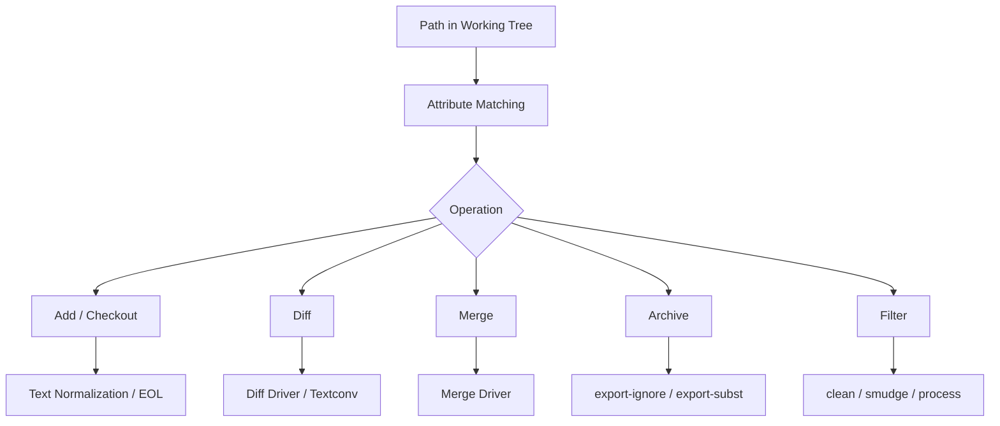
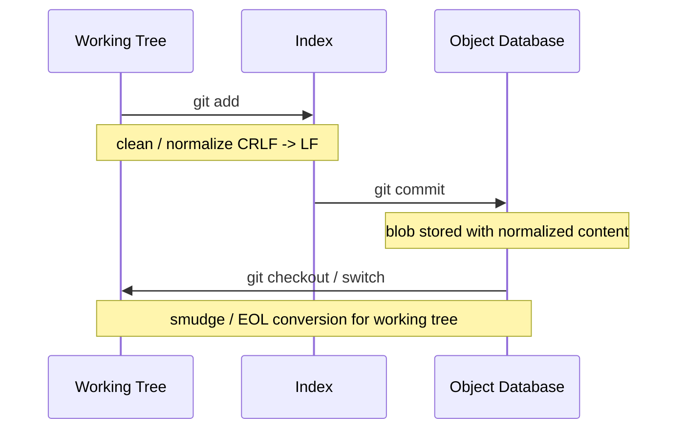
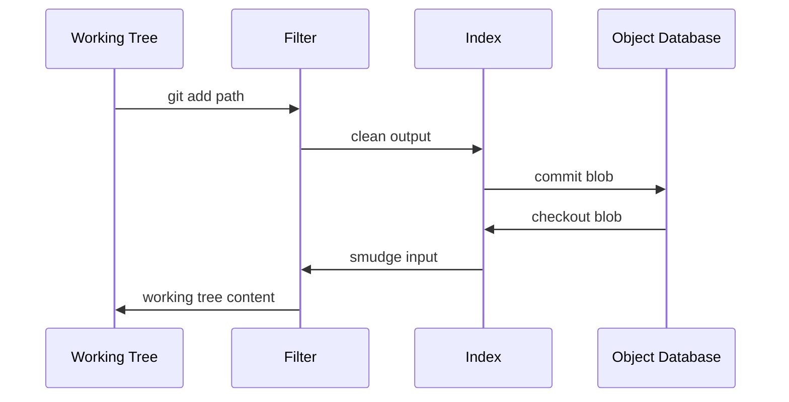
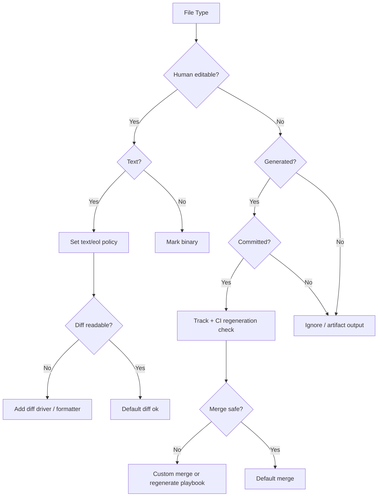

# Part 067 — Attributes, Filters, and Normalization

`.gitignore` menjawab:

> file untracked mana yang tidak perlu diperhatikan?

`.gitattributes` menjawab:

> path ini harus diperlakukan sebagai apa oleh Git?

Ini perbedaan besar.

`.gitignore` mengatur discovery file baru. `.gitattributes` mengatur **semantik operasi Git** terhadap file yang sudah atau akan masuk snapshot: normalisasi line ending, diff display, merge behavior, filter clean/smudge, export archive, dan beberapa behavior lain.

Kalau repository kamu lintas OS, punya binary assets, generated files, file besar, custom format, lockfile, protokol, schema, atau artifact release, `.gitattributes` bukan kosmetik. Itu bagian dari **repository contract**.

---

## 1. Mental Model: Attributes Are Path Metadata for Git Operations

Git tidak menyimpan nama file di blob. Blob hanya menyimpan content. Nama file dan mode disimpan di tree object.

`.gitattributes` menambah satu layer lagi:



Attributes tidak mengubah object model Git. Attributes mengubah **cara Git membaca, menulis, membandingkan, menggabungkan, atau mengekspor path tertentu**.

Contoh paling umum:

```gitattributes
* text=auto
*.sh text eol=lf
*.bat text eol=crlf
*.png binary
*.jpg binary
```

Maknanya:

- semua file yang terdeteksi text boleh dinormalisasi;
- shell script harus checkout dengan LF;
- batch script harus checkout dengan CRLF;
- gambar harus diperlakukan sebagai binary, bukan text;
- Git tidak perlu mencoba diff/merge text terhadap file binary.

---

## 2. Why This Matters in Real Engineering

Tanpa attributes, repository besar pelan-pelan mengumpulkan masalah yang terlihat random:

| Gejala | Root Cause Umum |
|---|---|
| Semua line berubah saat review | EOL berubah dari LF ke CRLF atau sebaliknya |
| File binary rusak setelah merge | Binary tidak ditandai binary atau filter salah |
| Conflict lockfile/generator terus berulang | Tidak ada merge policy untuk file generated |
| Diff file `.pb`, `.snap`, `.sql`, `.json` sulit dibaca | Tidak ada diff driver atau normalization strategy |
| Release archive berisi test fixture/internal script | Tidak ada `export-ignore` |
| Clone berhasil tapi checkout gagal | Filter driver wajib tidak tersedia |
| Developer Windows dan Linux menghasilkan diff palsu | EOL policy tidak eksplisit |
| CI berbeda dari local | `core.autocrlf`, filter, atau attributes berbeda |

Git tidak bisa menebak domain file kamu secara sempurna. `.gitattributes` adalah cara kamu memberi tahu Git:

> untuk path ini, perlakukan content seperti ini.

---

## 3. Attribute File Locations and Precedence

Attributes bisa didefinisikan di beberapa tempat.

| Lokasi | Scope | Biasanya Untuk |
|---|---|---|
| `.gitattributes` | versioned repository policy | policy tim yang harus ikut repo |
| nested `.gitattributes` | subtree-specific policy | monorepo, generated subtree, vendor subtree |
| `.git/info/attributes` | local-only override | eksperimen lokal, policy personal non-shared |
| global attributes file | user-level default | preferensi lintas repo |
| system attributes | machine/system default | managed environment |

Prinsip penting:

1. Policy yang harus sama untuk semua contributor harus masuk `.gitattributes` di repository.
2. Local override tidak boleh menjadi syarat agar build/review benar.
3. Nested `.gitattributes` berguna untuk monorepo, tetapi bisa membuat behavior sulit ditebak kalau dipakai terlalu banyak.
4. Saat beberapa rule match, Git menentukan nilai attribute per attribute, bukan per line secara utuh.

Contoh:

```gitattributes
* text=auto
*.png binary
assets/generated/*.json -diff merge=ours
```

Untuk `assets/generated/foo.json`, rule terakhir bisa mengubah diff/merge, tetapi text behavior masih bisa berasal dari rule sebelumnya jika tidak dioverride.

---

## 4. Attribute Syntax: Set, Unset, Value, Unspecified

Format dasar:

```gitattributes
pattern attr1 attr2=value -attr3 !attr4
```

State attribute:

| Syntax | Meaning |
|---|---|
| `text` | attribute `text` diset true |
| `-text` | attribute `text` diset false/unset |
| `eol=lf` | attribute diberi value `lf` |
| `!text` | mengembalikan ke unspecified pada level precedence tersebut |

Contoh:

```gitattributes
*.md text eol=lf
*.png -text
*.lock text eol=lf merge=ours
```

Makna praktis:

- `*.md` adalah text dan checkout dengan LF;
- `*.png` bukan text untuk normalization;
- `*.lock` text, line ending LF, dan memakai merge driver bernama `ours`.

Perhatikan: `merge=ours` tidak otomatis ada sebagai policy benar. Kamu harus mendefinisikan merge driver di config kalau memakai custom driver.

---

## 5. Pattern Matching: Similar to Ignore, But Not Identical Enough to Be Casual

Pattern attributes terlihat mirip `.gitignore`, tetapi jangan menghafal dari `.gitignore` secara buta.

Contoh:

```gitattributes
*.java text eol=lf
/docs/** text eol=lf
*.png binary
```

Rules of thumb:

- pattern relatif terhadap lokasi file `.gitattributes`;
- nested `.gitattributes` berlaku ke subtree-nya;
- gunakan path yang eksplisit untuk area risk tinggi;
- jangan membuat satu rule global yang terlalu agresif tanpa audit binary/custom file.

Untuk debugging attribute:

```bash
git check-attr -a -- path/to/file

git check-attr text eol diff merge -- path/to/file
```

Contoh output:

```text
path/to/file: text: set
path/to/file: eol: lf
path/to/file: diff: unspecified
path/to/file: merge: unspecified
```

Ini command pertama yang harus dipakai saat ada behavior EOL/diff/merge yang membingungkan.

---

## 6. Text Normalization: Repository Content vs Working Tree Content

Line ending problem muncul karena ada dua dunia:

| Dunia | Isi |
|---|---|
| repository object database | content yang disimpan sebagai blob |
| working tree | file yang dilihat editor/compiler/tool lokal |

Git bisa menyimpan text dalam repository dengan LF, lalu checkout ke working tree sesuai policy.



Tujuan normalization:

- review tidak penuh noise line ending;
- binary tidak rusak;
- OS berbeda tetap menghasilkan blob yang sama;
- build script punya line ending yang benar;
- CI tidak bergantung pada `core.autocrlf` personal.

---

## 7. Core Text Attributes

### 7.1 `text`

```gitattributes
*.java text
*.md text
```

`text` berarti Git memperlakukan path sebagai text untuk normalization.

### 7.2 `text=auto`

```gitattributes
* text=auto
```

Git akan mendeteksi apakah file text dan menormalisasi text file.

Ini sering dipakai sebagai baseline, tapi jangan berhenti di sini. Tetap tandai binary dan file khusus secara eksplisit.

### 7.3 `-text`

```gitattributes
*.png -text
*.jpg -text
*.pdf -text
```

`-text` mematikan text normalization untuk path tersebut.

### 7.4 `eol=lf` and `eol=crlf`

```gitattributes
*.sh text eol=lf
*.ps1 text eol=crlf
*.bat text eol=crlf
```

`eol` mengatur line ending working tree untuk path tertentu.

Rule penting:

- source code dan config biasanya LF;
- Windows batch file kadang perlu CRLF;
- shell script sebaiknya LF agar executable di Unix-like environment;
- file binary jangan diberi EOL conversion.

---

## 8. `core.autocrlf` vs `.gitattributes`

`core.autocrlf` adalah config user/repo yang sering berbeda antar developer.

`.gitattributes` adalah policy versioned.

Dalam engineering team, jangan menggantungkan correctness pada `core.autocrlf` personal.

Gunakan `.gitattributes` sebagai source of truth:

```gitattributes
* text=auto
*.java text eol=lf
*.kt text eol=lf
*.go text eol=lf
*.js text eol=lf
*.ts text eol=lf
*.vue text eol=lf
*.sh text eol=lf
*.bat text eol=crlf
*.cmd text eol=crlf
*.png binary
*.jpg binary
*.jpeg binary
*.gif binary
*.pdf binary
*.zip binary
*.jar binary
```

Lalu dokumentasikan local config yang direkomendasikan:

```bash
git config --global core.autocrlf false
```

Untuk Windows team yang membutuhkan behavior tertentu, bisa berbeda, tetapi repository policy tetap harus eksplisit.

---

## 9. Renormalization: When You Add Attributes After Files Already Exist

Menambahkan `.gitattributes` tidak otomatis mengubah blob lama.

Kalau file sudah tracked dan kamu baru menambahkan normalization policy, lakukan renormalization secara sadar.

```bash
git add --renormalize .
git status
git diff --cached --stat
git diff --cached --check
git commit -m "Normalize repository line endings"
```

Jangan campur renormalization dengan feature change.

Bad:

```text
commit A: add payment workflow + normalize all line endings
```

Good:

```text
commit A: normalize repository line endings
commit B: add payment workflow
```

Kenapa? Karena renormalization bisa menyentuh ribuan file. Kalau dicampur dengan behavior change, review dan bisect menjadi buruk.

---

## 10. Binary Attribute

Git punya macro `binary`.

```gitattributes
*.png binary
*.jpg binary
*.pdf binary
*.zip binary
*.jar binary
```

Secara praktis, ini berarti:

- jangan text-normalize file;
- jangan tampilkan diff text normal;
- hindari merge text yang merusak content.

Binary file dalam Git tetap bisa disimpan sebagai blob. Masalahnya bukan "Git tidak bisa". Masalahnya:

- binary sering besar;
- delta compression tidak selalu efektif;
- review sulit;
- merge sulit;
- repository bloat sulit dibersihkan;
- history rewrite mahal.

Gunakan artifact repository atau Git LFS untuk file besar yang memang perlu versioning di dekat source code.

---

## 11. Diff Drivers: Make Review Match the File Format

Default diff Git berbasis text line. Untuk beberapa file, itu buruk.

Contoh:

- generated JSON satu baris;
- `.lock` file besar;
- protobuf/schema;
- SQL migration;
- document format yang bisa dikonversi ke text;
- binary metadata.

`.gitattributes` bisa mengikat path ke diff driver.

```gitattributes
*.md diff=markdown
*.sql diff=sql
*.proto diff=proto
*.lock diff=lockfile
```

Lalu config:

```ini
[diff "sql"]
  xfuncname = "^(CREATE|ALTER|DROP|INSERT|UPDATE|DELETE|WITH|SELECT).*$"

[diff "proto"]
  xfuncname = "^(message|service|rpc|enum) .*$"
```

Tujuannya bukan membuat diff cantik. Tujuannya membuat reviewer melihat boundary yang meaningful.

---

## 12. Textconv: Diff Binary or Structured Files as Text

Beberapa file bukan text biasa, tetapi bisa dikonversi ke text untuk review.

```gitattributes
*.docx diff=docx
```

Config contoh:

```ini
[diff "docx"]
  textconv = pandoc --to=plain
```

Atau untuk image metadata:

```gitattributes
*.png diff=exif
```

```ini
[diff "exif"]
  textconv = exiftool
```

Important boundary:

> `textconv` hanya untuk diff display. Itu bukan format canonical repository dan bukan merge transform.

Jangan mengira karena diff terlihat text, Git bisa merge file tersebut dengan aman.

---

## 13. Word Diff and Tokenization

Untuk format tertentu, line diff terlalu kasar.

Config diff driver bisa mengatur tokenization.

```ini
[diff "markdown"]
  wordRegex = "[^[:space:]]+"
```

Lalu:

```bash
git diff --word-diff -- README.md
```

Ini berguna untuk:

- dokumentasi;
- legal text;
- policy text;
- SQL;
- config declarative.

Tapi jangan gunakan word diff sebagai satu-satunya review untuk code. Code punya struktur semantic yang tidak selalu terlihat dari token-level diff.

---

## 14. Merge Drivers: When Text Merge Is Not the Right Operation

Default merge Git melakukan three-way merge berbasis text untuk file text.

Ada file yang tidak cocok:

| File | Problem |
|---|---|
| generated file | source of truth ada di file lain |
| lockfile | perlu tool-specific regeneration/validation |
| binary asset | tidak bisa digabung line-based |
| snapshot test | sering harus regenerate |
| machine-generated config | conflict marker bisa membuat parser gagal |

`.gitattributes` bisa memilih merge driver:

```gitattributes
*.lock merge=lockfile
schema/generated/** merge=ours
```

Config custom merge driver:

```ini
[merge "ours"]
  name = keep our version
  driver = true
```

Contoh custom driver:

```ini
[merge "json-normalize"]
  name = normalize JSON after merge
  driver = scripts/git-merge-json-normalize %O %A %B %L %P
```

Parameter umum:

| Placeholder | Meaning |
|---|---|
| `%O` | ancestor/base temporary file |
| `%A` | current file to update; result should be written here |
| `%B` | other branch temporary file |
| `%L` | conflict marker size |
| `%P` | pathname |

Rule keras:

> Custom merge driver boleh mengurangi conflict noise, tapi tidak boleh menyembunyikan domain conflict.

Kalau dua branch mengubah business rule yang sama, merge driver yang selalu "ours" bisa membuat production bug terlihat seperti merge sukses.

---

## 15. `merge=ours`: Useful, Dangerous, Often Misused

Contoh yang sering muncul:

```gitattributes
package-lock.json merge=ours
```

Ini biasanya salah.

Kenapa? Lockfile adalah bagian dari dependency resolution. Mengambil satu sisi secara buta bisa membuang dependency update dari branch lain.

Lebih aman:

1. merge text/default;
2. kalau conflict, regenerate lockfile dengan package manager;
3. run install/verify;
4. commit hasil generated yang konsisten.

Untuk generated artifact yang benar-benar derived dari source lain, `merge=ours` bisa masuk akal, tapi hanya jika ada invariant:

- file itu tidak diedit manual;
- source of truth lain selalu tersedia;
- CI memverifikasi file generated up-to-date;
- developer tahu cara regenerate;
- review tidak bergantung pada file generated tersebut.

Contoh lebih aman:

```gitattributes
src/generated/** merge=ours
```

CI:

```bash
./gradlew generateSources
git diff --exit-code src/generated
```

---

## 16. Conflict Marker Size

Attributes bisa mengatur ukuran conflict marker.

```gitattributes
*.md conflict-marker-size=32
```

Default marker:

```text
<<<<<<< HEAD
ours
=======
theirs
>>>>>>> branch
```

Marker lebih panjang kadang membantu file yang memang punya banyak marker-like syntax, tapi ini bukan solusi semantic conflict.

---

## 17. Filters: Clean, Smudge, Process

Filter adalah transformasi content saat masuk/keluar repository.



Istilah:

| Filter | Direction | Meaning |
|---|---|---|
| clean | working tree -> index/object database | canonicalize before storing |
| smudge | object database -> working tree | expand/materialize after checkout |
| process | long-running protocol | optimized bidirectional filter |

Git LFS memakai model filter: repository menyimpan pointer file kecil, working tree mendapatkan content besar lewat LFS storage.

---

## 18. Filter Driver Example

`.gitattributes`:

```gitattributes
*.secret-template filter=redact
```

Config:

```ini
[filter "redact"]
  clean = scripts/redact-clean
  smudge = scripts/redact-smudge
  required = true
```

Namun ini contoh yang harus diperlakukan hati-hati.

Untuk secret, filter bukan kontrol utama. Secret yang pernah masuk Git tetap ada di history. Filter bisa mencegah format tertentu tersimpan, tetapi bukan pengganti secret manager, pre-receive scanning, dan rotation.

---

## 19. Filter Design Rules

Filter yang buruk bisa menghancurkan repository experience.

Checklist:

| Rule | Alasan |
|---|---|
| deterministic | content sama menghasilkan output sama |
| idempotent bila relevan | repeated clean/smudge tidak merusak file |
| reversible bila dibutuhkan | checkout/add roundtrip tidak kehilangan data |
| fast | commit/checkout tidak terasa rusak |
| explicit dependency | tool tersedia di CI dan local |
| fail closed untuk required data | jangan diam-diam commit pointer rusak |
| documented | developer tahu cara recovery |

Anti-pattern:

```text
clean filter calls remote service and modifies content differently depending on time
```

Itu membuat commit tidak reproducible.

---

## 20. Required Filters

Config:

```ini
[filter "media"]
  clean = media-clean
  smudge = media-smudge
  required = true
```

Jika `required = true`, checkout/add dapat gagal jika filter tidak tersedia atau gagal.

Gunakan untuk content yang tidak boleh silently degrade.

Tapi pahami trade-off:

- developer baru bisa gagal checkout;
- CI image harus punya tool;
- emergency patch bisa terhambat;
- air-gapped environment butuh mirror tool/filter.

Filter required cocok untuk repository yang punya bootstrap jelas.

---

## 21. Working Tree Encoding

Git secara historis memperlakukan path content sebagai bytes dan tidak peduli encoding, kecuali area tertentu seperti text normalization.

Attribute `working-tree-encoding` memungkinkan working tree memakai encoding tertentu dan repository menyimpan UTF-8 canonical representation.

Contoh:

```gitattributes
*.ps1 text working-tree-encoding=UTF-16LE eol=crlf
```

Gunakan dengan hati-hati.

Risiko:

- semua tooling Git/CI/client belum tentu punya versi dan behavior yang sama;
- roundtrip encoding bisa gagal;
- file binary bisa salah diklasifikasi;
- reviewer bisa melihat diff tidak sesuai ekspektasi.

Untuk sistem modern, lebih baik standardisasi source text ke UTF-8 kecuali ada constraint kuat.

---

## 22. Ident Expansion

Attribute `ident` bisa membuat Git mengganti marker tertentu dengan blob object id saat checkout.

Contoh:

```gitattributes
*.txt ident
```

File:

```text
$Id$
```

Bisa diekspansi di working tree.

Praktisnya, fitur ini jarang dipakai di engineering modern karena build metadata lebih baik disuntikkan dari CI:

```bash
git rev-parse HEAD
```

Jangan gunakan ident sebagai release provenance utama.

---

## 23. Archive Attributes: `export-ignore` and `export-subst`

`git archive` bisa memakai attributes.

Contoh:

```gitattributes
/tests export-ignore
/docs/internal export-ignore
.github export-ignore
*.md export-subst
```

`export-ignore` mengecualikan path dari archive.

Ini berguna untuk:

- source distribution;
- vendor bundle;
- release tarball;
- package yang tidak perlu membawa CI/internal docs.

Boundary:

> `export-ignore` tidak menghapus file dari repository atau history. Itu hanya memengaruhi archive output.

---

## 24. Attribute Strategy for Common File Types

Baseline untuk banyak repository software:

```gitattributes
# Default text normalization
* text=auto

# Source code
*.java text eol=lf
*.kt text eol=lf
*.go text eol=lf
*.js text eol=lf
*.ts text eol=lf
*.tsx text eol=lf
*.vue text eol=lf
*.py text eol=lf
*.rb text eol=lf
*.rs text eol=lf
*.c text eol=lf
*.h text eol=lf
*.cpp text eol=lf
*.cs text eol=lf

# Scripts
*.sh text eol=lf
*.bash text eol=lf
*.zsh text eol=lf
*.ps1 text eol=crlf
*.bat text eol=crlf
*.cmd text eol=crlf

# Config and docs
*.yml text eol=lf
*.yaml text eol=lf
*.json text eol=lf
*.xml text eol=lf
*.md text eol=lf
*.txt text eol=lf

# Binary assets
*.png binary
*.jpg binary
*.jpeg binary
*.gif binary
*.webp binary
*.ico binary
*.pdf binary
*.zip binary
*.gz binary
*.jar binary
*.war binary
*.class binary
*.so binary
*.dll binary
*.exe binary
```

Ini bukan template universal. Ini starting point untuk audit.

---

## 25. Strategy for Generated Files

Generated files punya tiga kategori.

| Category | Source of Truth | Git Policy |
|---|---|---|
| generated but committed for consumers | generator + output | track, verify in CI |
| generated local build artifact | generator only | ignore, do not track |
| generated release artifact | build system | artifact repository, not Git |

Untuk generated committed files:

```gitattributes
src/generated/** linguist-generated=true
src/generated/** text eol=lf
```

`linguist-generated` adalah GitHub-specific, bukan core Git behavior. Core Git tidak peduli kecuali attribute dipakai oleh command/tool.

Untuk merge, jangan langsung `merge=ours` kecuali CI benar-benar memverifikasi regeneration.

---

## 26. Strategy for Lockfiles

Lockfiles seperti `package-lock.json`, `pnpm-lock.yaml`, `yarn.lock`, `Cargo.lock`, `go.sum`, `Gemfile.lock` adalah bagian dari reproducibility.

Policy umum:

```gitattributes
package-lock.json text eol=lf
pnpm-lock.yaml text eol=lf
yarn.lock text eol=lf
Cargo.lock text eol=lf
Gemfile.lock text eol=lf
```

Jangan default `merge=ours`.

Safe conflict playbook:

```bash
# after conflict
npm install       # or pnpm install / yarn install
git status
git add package-lock.json
git diff --cached -- package-lock.json
npm test
```

Untuk ecosystem yang punya dedicated merge driver, evaluasi tool resmi/umum dengan hati-hati dan enforce CI verification.

---

## 27. Strategy for Protocol and Schema Files

Schema/protocol file sering menjadi compatibility boundary.

```gitattributes
*.proto text eol=lf diff=proto
*.avsc text eol=lf diff=json
*.graphql text eol=lf
*.sql text eol=lf diff=sql
```

Review invariant:

- backward compatibility;
- consumer compatibility;
- migration ordering;
- generated output consistency;
- release note impact.

Attributes membantu diff. Attributes tidak bisa memastikan compatibility. Itu tugas test/tooling/domain review.

---

## 28. Strategy for Markdown, Policy, and Regulatory Docs

Text policy docs sering butuh diff yang lebih readable.

```gitattributes
*.md text eol=lf diff=markdown
*.adoc text eol=lf diff=asciidoc
```

Untuk regulated systems, dokumen policy/release/evidence harus menjaga:

- stable line endings;
- readable diff;
- traceable change reason;
- signed tag/release reference jika masuk release artifact.

Jangan biarkan formatting tool mengubah seluruh dokumen bersamaan dengan perubahan substansi compliance.

---

## 29. Debugging Playbook: Why Did Git Change My Line Endings?

Langkah:

```bash
git status --short

git diff -- path/to/file

git check-attr -a -- path/to/file

git config --show-origin --get core.autocrlf
git config --show-origin --get core.eol
```

Kalau ingin melihat blob di repository:

```bash
git show HEAD:path/to/file | od -c | sed -n '1,20p'
```

Kalau ingin melihat working tree:

```bash
od -c path/to/file | sed -n '1,20p'
```

Kalau attributes baru ditambahkan:

```bash
git add --renormalize path/to/file
git diff --cached -- path/to/file
```

Diagnosis umum:

| Finding | Meaning |
|---|---|
| `text: auto`, `eol: lf` | Git may normalize text and checkout LF |
| `text: unset` | probably binary/no text normalization |
| `core.autocrlf=true` | local checkout/add behavior may differ |
| huge diff with no semantic change | likely EOL or formatter |

---

## 30. Debugging Playbook: Why Is Diff Bad?

```bash
git check-attr diff -- path/to/file

git diff -- path/to/file

git diff --word-diff -- path/to/file

git diff --histogram -- path/to/file
```

If custom driver exists:

```bash
git config --show-origin --get-regexp '^diff\.'
```

Questions:

1. Is the file actually text?
2. Is it generated?
3. Is it minified/one-line formatted?
4. Is there a stable formatter?
5. Should humans review this file at all?
6. Should source of truth be elsewhere?

Attributes can improve review signal, but sometimes the correct answer is:

> do not review generated output manually; verify it automatically.

---

## 31. Debugging Playbook: Why Did Merge Ignore My Change?

```bash
git check-attr merge -- path/to/file

git config --show-origin --get-regexp '^merge\.'

git ls-files -u -- path/to/file
```

If a merge driver is configured, inspect:

```bash
git config --show-origin --get merge.<driver>.driver
```

Potential causes:

- `merge=ours` discarded the other side;
- custom driver exited success without writing correct result;
- generated file regenerated differently;
- binary file could not merge;
- semantic conflict passed text merge.

Recovery:

```bash
git checkout --conflict=merge -- path/to/file
# or inspect versions
git show :1:path/to/file > /tmp/base
git show :2:path/to/file > /tmp/ours
git show :3:path/to/file > /tmp/theirs
```

Then resolve intentionally.

---

## 32. Attributes and Sparse Checkout / Partial Clone

Attributes are path-based. In sparse checkout or partial clone, not all files may be materialized locally.

Implications:

- operations on present paths still use attributes;
- CI should run full verification if release correctness depends on all paths;
- generated/normalized files outside sparse cone may not be visible locally;
- hooks that inspect working tree can miss paths not present.

For monorepo:

- keep global baseline attributes near root;
- use nested attributes sparingly;
- document subtree-specific behavior;
- avoid requiring local sparse checkout to enforce repository-wide policy.

---

## 33. Attributes and Submodules

Submodule entry in parent repo is a gitlink, not normal file content.

`.gitattributes` in parent repository does not control files inside submodule working tree as if they were normal paths.

Each submodule is its own repository and needs its own attributes policy.

Operational rule:

> If submodule content has EOL/filter/diff/merge requirements, enforce them inside the submodule repository, not only in the parent.

---

## 34. Attributes and Security

Attributes can affect security indirectly:

| Attribute Area | Security Risk |
|---|---|
| filters | arbitrary commands may run during checkout/add depending config |
| diff textconv | external tools may parse untrusted files |
| merge drivers | custom scripts can execute during merge |
| normalization | secret scanning may miss transformed content if poorly designed |
| binary marking | reviewers may not inspect dangerous changes |

Important boundary:

- `.gitattributes` can name a filter/driver;
- actual command is configured in Git config;
- never blindly enable repo-provided tooling from untrusted repositories;
- review bootstrap scripts that set `core.hooksPath`, filters, or diff/merge drivers.

In secure environments, local Git config changes are part of threat modeling.

---

## 35. Attribute Policy as Repository Contract

A serious repository should treat `.gitattributes` like source code policy.

Example contract:

```gitattributes
# Repository-wide normalization
* text=auto

# Cross-platform source policy
*.sh text eol=lf
*.bat text eol=crlf
*.cmd text eol=crlf

# Binary files
*.png binary
*.jpg binary
*.pdf binary
*.zip binary

# Schema/protocol review
*.proto text eol=lf diff=proto
*.sql text eol=lf diff=sql

# Release archive boundary
/tests export-ignore
/.github export-ignore
```

Add comments. Future maintainers need to know why a rule exists.

Bad:

```gitattributes
* text=auto
*.json merge=ours
```

Good:

```gitattributes
# Generated API clients are regenerated from OpenAPI spec.
# CI verifies generated output is up-to-date.
src/generated/api/** text eol=lf merge=ours
```

---

## 36. Migration Playbook: Introducing `.gitattributes` to an Existing Repo

Do not casually drop a huge attributes file into a mature repo.

Step-by-step:

```bash
# 1. inventory risky files
git ls-files | sed 's/.*\.//' | sort | uniq -c | sort -nr | head -50

# 2. inspect line endings
find . -type f -not -path './.git/*' -print0 | xargs -0 file | head

# 3. create attributes baseline
$EDITOR .gitattributes

# 4. inspect attribute resolution
git check-attr -a -- README.md
git check-attr -a -- path/to/binary.png

# 5. renormalize separately
git add .gitattributes
git add --renormalize .

# 6. review exactly what changed
git diff --cached --stat
git diff --cached --check

# 7. commit separately
git commit -m "Define repository file attributes and normalize text"
```

Then require feature branches to rebase/merge after normalization to avoid review noise.

---

## 37. Failure Mode: Giant Renormalization PR

Symptoms:

- thousands of files changed;
- reviewers cannot see semantic changes;
- open PRs get conflict noise;
- blame becomes noisier;
- cherry-picks become painful.

Mitigation:

1. announce normalization window;
2. freeze large feature merges if necessary;
3. merge normalization alone;
4. ask active branches to rebase or merge main;
5. use `git blame -w` when appropriate;
6. avoid doing formatter migration at the same time.

Do not combine:

```text
line ending normalization + code formatter + package upgrade + feature refactor
```

That is review-hostile.

---

## 38. Failure Mode: Binary File Treated as Text

Symptoms:

- binary file appears with text diff noise;
- checkout corrupts file;
- merge inserts conflict marker into binary;
- file size changes unexpectedly.

Fix:

```gitattributes
*.png binary
*.xlsx binary
*.pdf binary
```

Then restore/replace from known-good source if corruption happened.

For already-corrupted history, evaluate whether you need normal revert, file replacement, or history rewrite. If file contains secret or legally sensitive content, rotate/remove according to incident procedure first.

---

## 39. Failure Mode: Custom Merge Driver Hides Bug

Symptoms:

- merge succeeds with no conflict;
- behavior from one branch disappears;
- tests fail later or production bug appears;
- history shows both branches merged but output lacks one change.

Root cause:

```gitattributes
important-config.yaml merge=ours
```

Fix strategy:

- remove broad `merge=ours`;
- use domain-specific merge/regeneration;
- add CI invariant;
- document why custom merge exists;
- audit previous merges if high-risk.

Merge automation must be less trusted than domain tests.

---

## 40. Failure Mode: Filter Missing in CI

Symptoms:

- local checkout works;
- CI checkout fails;
- file appears as LFS pointer or placeholder;
- build cannot find binary/resource.

Diagnosis:

```bash
git check-attr filter -- path/to/file

git config --show-origin --get-regexp '^filter\.'
```

Fix:

- install filter tool in CI image;
- ensure clone step fetches LFS/content if needed;
- set `required=true` if silent degradation is dangerous;
- document bootstrap.

---

## 41. Decision Framework

When deciding attributes for a file type, ask:



---

## 42. Practical `.gitattributes` for a Polyglot Service Repo

Example:

```gitattributes
# Default: normalize text files, leave detected binary alone.
* text=auto

# JVM / backend
*.java text eol=lf
*.kt text eol=lf
*.gradle text eol=lf
gradlew text eol=lf
gradlew.bat text eol=crlf

# Node / frontend
*.js text eol=lf
*.jsx text eol=lf
*.ts text eol=lf
*.tsx text eol=lf
*.vue text eol=lf
package.json text eol=lf
package-lock.json text eol=lf
pnpm-lock.yaml text eol=lf

# Go
*.go text eol=lf
go.mod text eol=lf
go.sum text eol=lf

# Config and docs
*.yaml text eol=lf
*.yml text eol=lf
*.json text eol=lf
*.xml text eol=lf
*.md text eol=lf
*.sql text eol=lf diff=sql
*.proto text eol=lf diff=proto

# Scripts
*.sh text eol=lf
*.ps1 text eol=crlf
*.bat text eol=crlf
*.cmd text eol=crlf

# Binary/artifact-like
*.png binary
*.jpg binary
*.jpeg binary
*.gif binary
*.webp binary
*.ico binary
*.pdf binary
*.zip binary
*.jar binary
*.war binary
*.class binary
*.so binary
*.dll binary
*.exe binary

# Release archive boundary
/.github export-ignore
/docs/internal export-ignore
/tests export-ignore
```

This is not perfect. It is auditable.

---

## 43. Lab: Observe Normalization

Create test repo:

```bash
mkdir git-attrs-lab
cd git-attrs-lab
git init
printf '* text=auto\n*.sh text eol=lf\n' > .gitattributes
printf 'echo hello\r\n' > run.sh

git add .gitattributes run.sh
git commit -m "Add script with normalization"
```

Inspect repository blob:

```bash
git show HEAD:run.sh | od -c
```

Inspect working tree:

```bash
od -c run.sh
```

Try:

```bash
git check-attr -a -- run.sh
```

Observe how attributes describe behavior.

---

## 44. Lab: Create a Simple Diff Driver

```bash
mkdir diff-driver-lab
cd diff-driver-lab
git init

cat > .gitattributes <<'ATTR'
*.sql text eol=lf diff=sql
ATTR

cat >> .git/config <<'CFG'
[diff "sql"]
  xfuncname = "^(CREATE|ALTER|DROP|INSERT|UPDATE|DELETE|WITH|SELECT).*$"
CFG

cat > schema.sql <<'SQL'
CREATE TABLE cases (
  id uuid primary key,
  status text not null
);
SQL

git add .
git commit -m "Add schema"

cat > schema.sql <<'SQL'
CREATE TABLE cases (
  id uuid primary key,
  status text not null,
  escalation_level int not null default 0
);
SQL

git diff
```

The goal: observe how diff headers become more domain-aware.

---

## 45. Lab: Check Attribute Resolution at Scale

For a real repo:

```bash
git ls-files -z | xargs -0 -n1 git check-attr text eol diff merge -- | sed -n '1,100p'
```

More targeted:

```bash
git ls-files '*.png' '*.jpg' '*.pdf' | while read p; do
  git check-attr text diff merge -- "$p"
done
```

Find likely missing binary attributes:

```bash
git ls-files | grep -E '\.(png|jpg|jpeg|gif|pdf|zip|jar|war|exe|dll|so)$' | while read p; do
  git check-attr -a -- "$p"
done
```

---

## 46. Engineering Checklist

Before merging `.gitattributes` change:

- [ ] Does it affect existing tracked files?
- [ ] Is renormalization separated from feature changes?
- [ ] Are binary files explicitly marked?
- [ ] Are OS-sensitive scripts assigned correct EOL?
- [ ] Are generated files documented?
- [ ] Are custom merge drivers backed by CI checks?
- [ ] Are required filters installed in CI/dev bootstrap?
- [ ] Is release archive boundary intentional?
- [ ] Did you run `git check-attr` on representative files?
- [ ] Did you inspect staged diff with `--stat` and `--check`?

---

## 47. Top 1% Mental Model

Average Git users think:

> `.gitattributes` fixes line endings.

Strong engineers think:

> `.gitattributes` is a repository-level file semantics contract.

It controls how Git treats file content across add, checkout, diff, merge, archive, and filters. Bad attributes create invisible repository-level bugs. Good attributes reduce review noise, preserve binary safety, stabilize cross-platform collaboration, and encode domain-aware file handling.

The invariant:

> Every tracked file type should have an intentional Git behavior.

If you cannot explain how a file type should be normalized, diffed, merged, and released, the repository is relying on accidental defaults.
