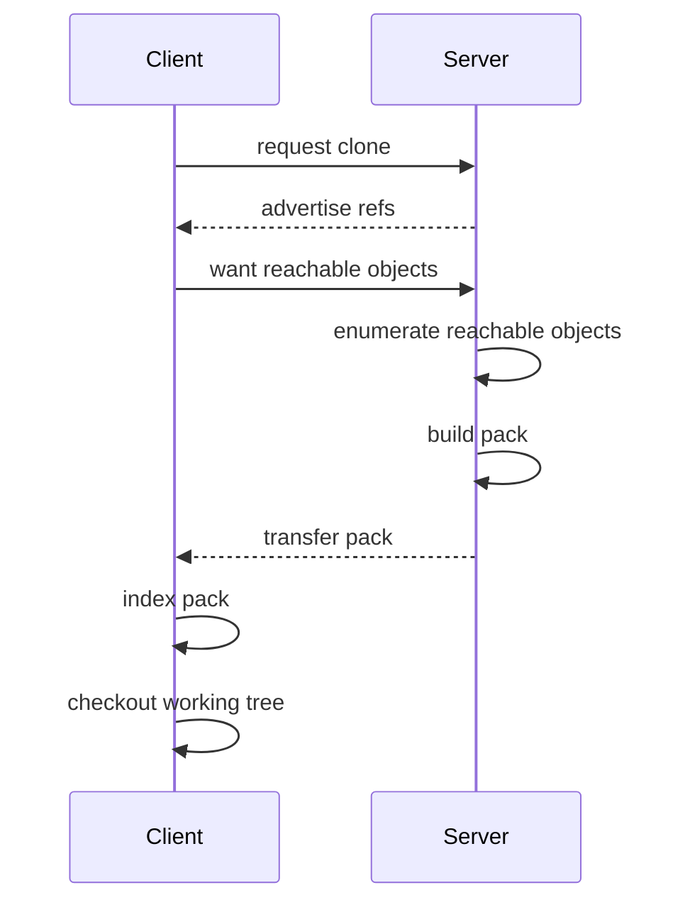

# Part 069 — Large Repository Failure Modes

Repository besar jarang gagal karena satu alasan.

Ia biasanya gagal karena beberapa dimensi tumbuh bersamaan:

1. **object database** membesar,
2. **working tree** terlalu luas,
3. **index** terlalu besar,
4. **history graph** terlalu panjang/bercabang,
5. **remote negotiation** terlalu mahal,
6. **binary artifact** masuk ke Git,
7. **CI checkout** tidak disesuaikan dengan kebutuhan job,
8. **developer workflow** tetap memakai asumsi repo kecil.

Git bisa menangani repository besar, tetapi Git tidak menghapus konsekuensi fisik dari data yang kamu masukkan ke dalamnya.

Kalau repository menyimpan jutaan path, ribuan branch, ratusan ribu commit, dan banyak binary blob besar, maka command yang menyentuh working tree, index, object graph, atau remote akan membayar biaya yang berbeda.

Target part ini bukan langsung mengoptimasi.

Targetnya: **mendiagnosis failure mode dengan benar**.

Optimasi tanpa diagnosis sering membuat repo lebih rapuh.

---

## 1. Mental Model: Git Repository Has Multiple Cost Centers

Repository Git besar bukan satu benda homogen.

Ia punya beberapa cost center.

```mermaid
flowchart TD
  Dev[Developer Command] --> WT[Working Tree]
  Dev --> IDX[Index]
  Dev --> OBJ[Object Database]
  Dev --> REF[Refs]
  Dev --> GRAPH[Commit Graph]
  Dev --> REMOTE[Remote Negotiation]
  Dev --> HOOKS[Hooks / Filters / LFS]

  WT --> A[Path count]
  WT --> B[Filesystem latency]
  WT --> C[Generated files]

  IDX --> D[Index size]
  IDX --> E[Stat refresh]
  IDX --> F[Unmerged entries]

  OBJ --> G[Loose objects]
  OBJ --> H[Packfiles]
  OBJ --> I[Large blobs]
  OBJ --> J[Delta chains]

  GRAPH --> K[History depth]
  GRAPH --> L[Merge topology]
  GRAPH --> M[Path-limited walks]

  REF --> N[Many branches/tags]
  REF --> O[Packed refs]

  REMOTE --> P[Fetch negotiation]
  REMOTE --> Q[Pack generation]
  REMOTE --> R[Shallow/partial constraints]
```



Command yang berbeda membayar cost center yang berbeda:

| Command | Cost center dominan |
|---|---|
| `git status` | working tree scan, index refresh, untracked scan, sparse/index config |
| `git add` | pathspec matching, file hashing, index update |
| `git commit` | index-to-tree write, hooks, signing, commit-graph later |
| `git log -- path` | commit graph walk, tree/path filtering, Bloom filter jika tersedia |
| `git blame` | path history traversal, rename detection jika diminta |
| `git fetch` | ref advertisement, negotiation, pack transfer, object connectivity |
| `git checkout` / `switch` | tree diff, index update, working tree materialization |
| `git merge` / `rebase` | merge base, tree merge, conflict index, rerere, working tree update |
| `git gc` / `maintenance` | object packing, pruning, commit-graph, MIDX, refs |

Jangan mendiagnosis “Git lambat” sebagai satu masalah.

Pertanyaan yang benar:

> Command mana yang lambat, pada repository state apa, di mesin apa, dengan config apa, dan cost center mana yang disentuh?

---

## 2. Failure Mode #1: Slow `git status`

`git status` terlihat sederhana, tetapi pada repo besar ia bisa menyentuh banyak hal:

- membandingkan `HEAD` dengan index,
- membandingkan index dengan working tree,
- mencari untracked files,
- memeriksa rename/copy informasi tertentu melalui status/diff config,
- membaca submodule state,
- menjalankan fsmonitor jika dikonfigurasi,
- menghormati sparse checkout jika aktif.

### 2.1 Gejala

```bash
$ time git status
# takes 8-30 seconds
```

Atau:

```bash
$ GIT_TRACE2_PERF=1 git status
```

Gejalanya biasanya terlihat sebagai:

- shell prompt lambat karena prompt menjalankan `git status`,
- IDE lambat membuka repo,
- `git add` terasa lambat karena index refresh,
- `git status --ignored` jauh lebih lambat,
- untracked files scan dominan.

### 2.2 Penyebab umum

| Penyebab | Mengapa lambat |
|---|---|
| Terlalu banyak path tracked | Index besar dan stat refresh mahal. |
| Banyak generated/untracked files | Git perlu memindai working tree untuk mendeteksi file belum tracked. |
| `.gitignore` buruk | Banyak direktori build tidak diabaikan dengan benar. |
| Filesystem lambat | Network filesystem, antivirus, container mount, Windows path overhead. |
| Submodule banyak | Status perlu memeriksa state submodule jika enabled. |
| Prompt/IDE terlalu agresif | Banyak proses menjalankan status berulang. |
| Sparse checkout tidak dipakai | Working tree menyajikan semua path meski developer hanya butuh subset. |

### 2.3 Diagnosis cepat

```bash
git status --short

git status --ignored --short

git count-objects -vH

git ls-files | wc -l

git ls-files -o --exclude-standard | wc -l
```

Untuk melihat untracked pressure:

```bash
git ls-files -o --exclude-standard | sed -n '1,100p'
```

Kalau output didominasi `dist/`, `target/`, `node_modules/`, `.gradle/`, `coverage/`, atau folder generated lain, masalahnya bukan Git. Masalahnya repository hygiene.

### 2.4 Mitigasi

Level aman:

```bash
# pastikan generated directories di-ignore
cat >> .gitignore <<'EOF'
node_modules/
dist/
build/
target/
.gradle/
coverage/
.tmp/
EOF
```

Aktifkan untracked cache jika cocok dengan environment:

```bash
git config core.untrackedCache true
```

Aktifkan filesystem monitor jika tersedia dan cocok:

```bash
git config core.fsmonitor true
```

Gunakan sparse checkout untuk repo besar:

```bash
git sparse-checkout init --cone
git sparse-checkout set services/payment libs/common
```

Gunakan prompt Git yang tidak menjalankan status berat setiap render.

### 2.5 Invariant

> Kalau `git status` lambat, jangan langsung menjalankan `git gc`. `status` sering lambat karena working tree/index/untracked scan, bukan karena packfile storage.

---

## 3. Failure Mode #2: Clone Takes Too Long

Clone besar bisa lambat karena:

- semua history diambil,
- semua object diambil,
- semua blob besar diambil,
- semua refs/tags diiklankan,
- checkout working tree penuh,
- network latency tinggi,
- server harus membuat pack besar.

### 3.1 Full clone cost



Di repo besar, bottleneck bisa berada di server, network, disk, atau checkout.

### 3.2 Diagnosis

```bash
GIT_TRACE=1 GIT_TRACE_PACKET=1 GIT_TRACE_PERFORMANCE=1 git clone <url>
```

Gunakan dengan hati-hati karena trace bisa verbose.

Pisahkan:

```bash
# clone tanpa checkout untuk membedakan transfer vs working tree materialization
git clone --no-checkout <url> repo
cd repo
time git checkout main
```

Hitung ukuran:

```bash
du -sh .git
du -sh .
git count-objects -vH
```

### 3.3 Mitigasi clone

| Mitigasi | Cocok untuk | Risiko |
|---|---|---|
| `--depth=1` | CI yang tidak butuh history | merge-base/tag/changelog/bisect bisa rusak. |
| `--single-branch` | CI satu branch | tidak bisa membandingkan branch lain. |
| `--filter=blob:none` | repo besar dengan banyak blob | membutuhkan lazy fetch ke promisor remote. |
| `--sparse` | working tree subset | command/path di luar sparse perlu pemahaman. |
| mirror/cache lokal | org besar | perlu invalidation dan security. |

Contoh:

```bash
git clone --filter=blob:none --sparse <url> repo
cd repo
git sparse-checkout set services/case-management libs/audit
```

### 3.4 Invariant

> Shallow clone mengurangi history. Partial clone mengurangi object yang langsung diambil. Sparse checkout mengurangi working tree. Ketiganya menyelesaikan masalah yang berbeda.

---

## 4. Failure Mode #3: Huge History and Expensive Graph Walks

History besar memengaruhi command seperti:

```bash
git log

git log -- path/to/file

git blame path/to/file

git merge-base A B

git branch --contains <commit>

git tag --contains <commit>

git rev-list --count A..B
```

### 4.1 Gejala

- `git log -- path` lambat.
- `git blame` lambat pada file tua/sering dipindah.
- `git branch --contains` lambat karena banyak refs.
- PR diff calculation lambat di server.
- CI changelog generation lambat.

### 4.2 Penyebab

| Penyebab | Dampak |
|---|---|
| Banyak commit | graph walk panjang. |
| Banyak merge commit | topology lebih kompleks. |
| Banyak refs | command `--contains`/reachability perlu banyak query. |
| Path sering rename | path history lebih mahal dan sering incomplete tanpa rename detection. |
| Commit-graph tidak ada/stale | ancestry query kurang optimal. |
| Changed-path Bloom filters tidak ada | path-limited history lebih mahal. |

### 4.3 Diagnosis

```bash
git rev-list --count --all

git for-each-ref --format='%(refname)' | wc -l

git for-each-ref refs/heads refs/remotes refs/tags --format='%(refname)' | wc -l

time git log --oneline -- path/to/hot/file | head

time git branch --contains <sha>
```

Cek commit-graph:

```bash
git commit-graph verify
```

Tulis/update commit-graph:

```bash
git commit-graph write --reachable --changed-paths
```

### 4.4 Mitigasi

- Enable Git maintenance yang menulis commit-graph.
- Prune stale remote-tracking branches.
- Kurangi tag/branch lama yang tidak perlu di developer clone.
- Gunakan `--first-parent` untuk release history bila governance mendukung.
- Jangan membuat automation yang scan `--all` setiap command prompt.
- Cache hasil analisis repository untuk dashboards.

### 4.5 Invariant

> History yang besar tidak selalu masalah. Masalah muncul saat workflow harian terus-menerus melakukan graph walk global tanpa indeks, tanpa boundary, dan tanpa cache.

---

## 5. Failure Mode #4: Binary Blobs in Git

Binary besar adalah salah satu penyebab repo bloat paling umum.

Git menyimpan content-addressed object. Kalau file binary besar berubah sedikit tetapi tidak delta-friendly, Git tetap harus menyimpan object besar atau delta mahal.

Contoh berbahaya:

- `.zip`, `.tar`, `.jar` artifact,
- video/image design source besar,
- database dump,
- model ML,
- generated PDF,
- dependency vendor archive,
- build output,
- encrypted binary,
- log dump.

### 5.1 Kenapa binary buruk untuk Git

| Problem | Dampak |
|---|---|
| Blob besar masuk history | Semua clone historis dapat terdampak. |
| Binary berubah sering | Packfile tumbuh cepat. |
| Diff tidak meaningful | Review kehilangan signal. |
| Merge sulit | Tidak ada semantic merge. |
| Secret dalam binary | Scanning/rewrite lebih sulit. |
| Artifact di Git | Source vs artifact boundary rusak. |

### 5.2 Diagnosis large blobs

Top object by packed size:

```bash
git rev-list --objects --all \
  | git cat-file --batch-check='%(objecttype) %(objectname) %(objectsize) %(rest)' \
  | awk '$1 == "blob" {print $3, $2, $4}' \
  | sort -nr \
  | head -50
```

Object path lookup:

```bash
git rev-list --objects --all | grep '<sha-or-path-fragment>'
```

Pack size inspection:

```bash
git verify-pack -v .git/objects/pack/*.idx \
  | sort -k3 -n \
  | tail -20
```

### 5.3 Mitigasi

- Jangan commit artifact build.
- Gunakan artifact repository untuk build output.
- Gunakan package manager untuk dependency artifact.
- Gunakan Git LFS untuk file besar yang memang harus versioned dekat source.
- Tambahkan pre-receive hook atau CI check untuk max blob size.
- Jika sudah terlanjur, lakukan incident-class history rewrite dengan komunikasi eksplisit.

### 5.4 Policy contoh

```bash
#!/usr/bin/env bash
set -euo pipefail

max_bytes=$((10 * 1024 * 1024))

while read -r old new ref; do
  git rev-list --objects "$old..$new" |
  git cat-file --batch-check='%(objecttype) %(objectname) %(objectsize) %(rest)' |
  awk -v max="$max_bytes" '$1 == "blob" && $3 > max { print; bad=1 } END { exit bad }'
done
```

Gunakan sebagai konsep. Untuk production hook, perlu handle initial branch push, deleted branch, dan zero SHA.

---

## 6. Failure Mode #5: Path Explosion

Path explosion terjadi saat jumlah file tracked terlalu besar.

Ini berbeda dari object bloat.

Repo bisa punya object database yang tidak terlalu besar, tetapi working tree punya ratusan ribu atau jutaan path.

### 6.1 Gejala

- `git status` lambat.
- checkout branch lambat.
- IDE indexing berat.
- file watcher limit habis.
- Docker bind mount lambat.
- antivirus scanning sangat mahal.
- `git add .` terlalu lambat.

### 6.2 Diagnosis

```bash
git ls-files | wc -l

git ls-files | cut -d/ -f1 | sort | uniq -c | sort -nr | head

git ls-files | awk -F/ '{print $1"/"$2}' | sort | uniq -c | sort -nr | head -50
```

Cari generated/tracked artifact:

```bash
git ls-files | grep -E '(^|/)(dist|build|target|coverage|node_modules|vendor)/' | head -100
```

### 6.3 Mitigasi

| Strategy | Ketika cocok |
|---|---|
| Remove generated tracked files | Artifact bisa dibuat ulang. |
| Sparse checkout | Developer hanya butuh subset. |
| Monorepo layout redesign | Ownership dan dependency boundary kacau. |
| Split repo | Release/lifecycle benar-benar terpisah. |
| Submodule/subtree/package | Shared dependency punya ownership independen. |

### 6.4 Invariant

> Sparse checkout mengurangi file yang muncul di working tree. Ia tidak otomatis mengurangi ukuran object database yang sudah diambil, kecuali digabung dengan partial clone.

---

## 7. Failure Mode #6: Too Many Refs

Refs meliputi branch, remote-tracking branch, tag, notes, stash refs, dan internal refs.

Di organisasi besar, refs bisa meledak karena:

- branch lama tidak dihapus,
- tag release/CI terlalu banyak,
- per-PR refs disimpan panjang,
- automation membuat refs temporary,
- mirror menyimpan semua refs dari semua remote,
- forks dan internal mirrors tidak dipruning.

### 7.1 Gejala

- `git fetch` lambat karena ref advertisement besar.
- `git branch -r` penuh noise.
- `git tag --contains` lambat.
- `git for-each-ref` lambat.
- UI hosting lambat membuka branches/tags page.
- Local clone punya banyak stale remote-tracking refs.

### 7.2 Diagnosis

```bash
git for-each-ref --format='%(refname)' | wc -l

git for-each-ref refs/remotes --format='%(refname)' | wc -l

git for-each-ref refs/tags --format='%(refname)' | wc -l

git remote prune origin --dry-run
```

### 7.3 Mitigasi

Local:

```bash
git fetch --prune

git remote prune origin
```

Config:

```bash
git config fetch.prune true
```

Organization:

- branch expiry policy,
- delete merged branches,
- protect only meaningful release refs,
- avoid per-build tags unless required,
- store build metadata outside Git refs if high cardinality,
- document immutable tag policy.

---

## 8. Failure Mode #7: CI Checkout Is Wrong for the Job

CI sering menjadi korban repo besar karena checkout default tidak sesuai kebutuhan.

Ada tiga jebakan umum:

1. terlalu banyak data diambil,
2. terlalu sedikit data diambil sehingga job salah,
3. checkout ref tidak merepresentasikan merge result yang akan masuk main.

### 8.1 Checkout terlalu banyak

Misalnya job unit test satu service mengambil seluruh monorepo.

Mitigasi:

```bash
git clone --filter=blob:none --sparse <url> repo
cd repo
git sparse-checkout set services/payment libs/common
```

Atau gunakan checkout action dengan partial/sparse support jika platform mendukung.

### 8.2 Checkout terlalu sedikit

Shallow clone bisa mematahkan:

- `git merge-base`,
- changelog generation,
- SemVer boundary detection,
- `git describe`,
- tag-based release detection,
- tests that compare against base branch.

Contoh antipattern:

```bash
git clone --depth=1 <url>
cd repo
git merge-base origin/main HEAD
# may fail or produce insufficient result if base not present
```

### 8.3 Checkout wrong ref

PR CI harus jelas menguji apa:

| Ref yang dites | Makna |
|---|---|
| PR head branch | Perubahan proposal tanpa integrasi terbaru. |
| Synthetic merge commit | Hasil jika PR diintegrasikan ke target branch saat itu. |
| Merge queue commit/group | Hasil PR + queue order. |

Untuk protected main, idealnya test gate memvalidasi commit yang akan benar-benar masuk main, bukan hanya branch head stale.

---

## 9. Failure Mode #8: Expensive Rename/Copy Detection

Rename detection bukan metadata eksplisit di Git object model.

Git menyimpulkan rename dari similarity saat diff/log/blame tertentu.

Di refactor besar, rename detection bisa mahal.

### 9.1 Gejala

```bash
# slow on huge refactor
git diff -M old..new

git log --follow -- path/to/file

git blame -M -C path/to/file
```

### 9.2 Mitigasi

- Pisahkan pure rename commit dari semantic change commit.
- Gunakan `--no-renames` untuk review tertentu.
- Batasi pathspec.
- Jangan gabungkan mass format + logic change.
- Untuk refactor besar, buat PR bertahap.

### 9.3 Invariant

> Git tidak menyimpan “file X diganti nama menjadi Y” sebagai fakta object. Itu hasil analisis diff. Maka refactor besar harus didesain agar inference tetap murah dan reviewable.

---

## 10. Failure Mode #9: Filters, LFS, and Hooks Make Git Feel Slow

Kadang command Git lambat bukan karena Git core, tetapi karena extension point:

- clean/smudge filters,
- Git LFS smudge,
- pre-commit hook,
- pre-push hook,
- commit-msg hook,
- credential helper,
- signing agent,
- antivirus/security scanner,
- IDE integration.

### 10.1 Diagnosis

Matikan hook untuk membedakan:

```bash
git -c core.hooksPath=/dev/null status
```

Untuk commit:

```bash
git commit --no-verify
```

Jangan jadikan `--no-verify` kebiasaan. Gunakan hanya sebagai diagnosis atau emergency dengan policy jelas.

Cek LFS/filter:

```bash
git lfs env

git config --show-origin --get-regexp 'filter\.|core\.hooksPath|commit\.gpgsign'
```

### 10.2 Mitigasi

- Hook harus cepat, deterministic, dan cacheable.
- Hook berat pindah ke CI.
- LFS fetch/smudge harus dikontrol di CI.
- Signing harus punya fallback/error message jelas.
- Credential helper timeout harus terlihat.

---

## 11. Failure Mode #10: Repo Contains Multiple Lifecycles That Should Not Share History

Tidak semua masalah repo besar selesai dengan sparse checkout.

Kadang root problem adalah lifecycle coupling.

Contoh:

- mobile app, backend, IaC, ML dataset, docs, compliance evidence, generated SDK, dan binary artifact semua berada dalam satu repo tanpa ownership jelas.
- tim A release harian, tim B release quarterly, tim C long-term support, tetapi semua wajib synchronize di main yang sama.
- ribuan generated client code dicommit untuk puluhan bahasa.

### 11.1 Diagnosis architectural

Tanyakan:

1. Apakah perubahan di area A secara semantik harus atomic dengan area B?
2. Apakah release cadence-nya sama?
3. Apakah ownership dan approval boundary sama?
4. Apakah CI dependency graph bisa dipahami?
5. Apakah developer butuh full checkout untuk tugas harian?
6. Apakah regulatory/audit evidence lebih jelas dalam satu repo atau terpisah?
7. Apakah coupling ini source-level atau artifact-level?

### 11.2 Decision matrix

| Kondisi | Kandidat solusi |
|---|---|
| Banyak area source saling berubah atomic | Monorepo dengan sparse/partial + ownership. |
| Shared library release independen | Package/artifact dependency. |
| Vendor source perlu audit dan patch lokal | Subtree atau vendoring policy. |
| Component lifecycle sangat berbeda | Split repo. |
| Binary artifact besar | Artifact registry / LFS jika harus versioned. |
| Compliance evidence immutable | Separate evidence store plus commit references. |

---

## 12. Repository Health Snapshot Script

Gunakan script ini untuk snapshot awal, bukan sebagai diagnosis final.

```bash
#!/usr/bin/env bash
set -euo pipefail

printf '\n== Git version ==\n'
git --version

printf '\n== Repo size ==\n'
du -sh .git 2>/dev/null || true
du -sh . 2>/dev/null || true

printf '\n== Object count ==\n'
git count-objects -vH

printf '\n== Commit count ==\n'
git rev-list --count --all

printf '\n== Ref count ==\n'
git for-each-ref --format='%(refname)' | wc -l

git for-each-ref refs/heads --format='local %(refname:short)' | wc -l
git for-each-ref refs/remotes --format='remote %(refname:short)' | wc -l
git for-each-ref refs/tags --format='tag %(refname:short)' | wc -l

printf '\n== Tracked path count ==\n'
git ls-files | wc -l

printf '\n== Untracked path count sample ==\n'
git ls-files -o --exclude-standard | wc -l
git ls-files -o --exclude-standard | sed -n '1,30p'

printf '\n== Largest blobs by raw size ==\n'
git rev-list --objects --all \
  | git cat-file --batch-check='%(objecttype) %(objectname) %(objectsize:disk) %(objectsize) %(rest)' \
  | awk '$1 == "blob" {print $3, $4, $2, $5}' \
  | sort -nr \
  | head -30

printf '\n== Maintenance files ==\n'
find .git/objects -maxdepth 2 -type f | wc -l || true
find .git/objects/pack -maxdepth 1 -type f -print 2>/dev/null | sed -n '1,50p'

printf '\n== Sparse / partial config ==\n'
git config --get core.sparseCheckout || true
git config --get extensions.partialClone || true
git config --get remote.origin.promisor || true
git config --get remote.origin.partialclonefilter || true
```

Interpretasi:

| Sinyal | Kemungkinan problem |
|---|---|
| `.git` sangat besar | object history/pack/blob bloat. |
| working tree jauh lebih besar dari `.git` | generated/untracked/build output. |
| tracked path count besar | index/status/checkout cost. |
| untracked count besar | ignore hygiene buruk. |
| refs sangat banyak | fetch/ref lookup/noise. |
| largest blobs besar | binary artifact atau dump. |
| no commit-graph/MIDX | graph/object lookup bisa kurang optimal. |

---

## 13. Case Study: Monorepo Lambat Setelah 3 Tahun

### Situasi

Repository platform internal:

- 1.2 juta tracked files,
- 180 ribu commits,
- 14 ribu remote-tracking branches,
- 9 ribu tags,
- `.git` 38GB,
- working tree 92GB setelah build,
- `git status` 22 detik,
- fresh clone 2 jam,
- PR CI checkout 18 menit.

Tim menyimpulkan: “Git tidak cocok untuk monorepo.”

Kesimpulan itu terlalu cepat.

### Diagnosis

Snapshot menemukan:

- 40GB working tree berasal dari generated SDK dan build output yang tidak di-ignore.
- 11GB `.git` berasal dari zip artifact historis.
- 12 ribu branch remote sudah stale.
- CI memakai full clone untuk semua job.
- Developer backend payment hanya butuh 4 direktori dari 220 direktori top-level.
- Commit-graph tidak pernah ditulis.
- Branch cleanup policy tidak ada.

### Perbaikan berurutan

1. Fix `.gitignore` dan hapus generated tracked files melalui commit normal bila belum perlu rewrite.
2. Branch prune policy dan remote prune.
3. Enable maintenance: commit-graph, prefetch, loose-objects, incremental-repack.
4. CI checkout pakai sparse + partial clone untuk job service-scoped.
5. Large blob policy untuk mencegah artifact baru.
6. History rewrite terencana untuk artifact sangat besar jika cost/benefit masuk.
7. Ownership map dan CODEOWNERS untuk area besar.
8. Repository health dashboard bulanan.

### Hasil yang diharapkan

Bukan “Git jadi instan”.

Target realistis:

- `status` turun ke sub-second atau beberapa detik tergantung OS/filesystem,
- CI checkout turun drastis untuk job scoped,
- clone baru memakai blobless + sparse,
- repo berhenti bertambah bloat secara tidak terkendali,
- history rewrite hanya dilakukan dengan playbook dan komunikasi.

---

## 14. Failure Mode to Mitigation Map

| Failure mode | Diagnosis first | Mitigation likely |
|---|---|---|
| Slow status | untracked count, path count, fsmonitor | ignore cleanup, sparse checkout, untracked cache, fsmonitor |
| Slow clone | trace clone, no-checkout test, object size | partial clone, sparse checkout, shallow only if safe, mirror/cache |
| Huge `.git` | count-objects, largest blobs, pack inspect | maintenance, repack, LFS/artifact boundary, history rewrite if justified |
| Large working tree | `du`, untracked scan | `.gitignore`, clean policy, build dir isolation |
| Slow log/blame | commit count, commit-graph | commit-graph, Bloom filters, path boundary, avoid global scans |
| Many refs | ref count, prune dry-run | branch expiry, fetch prune, protected tag policy |
| CI too slow | checkout time split | job-scoped sparse/partial, cache, correct depth |
| Review diff noisy | rename/mass format analysis | split refactor, diff options, generated file policy |
| Hooks slow | disable hooks diagnosis | move heavy checks to CI, cache hooks, core.hooksPath standardization |
| Binary bloat | largest blobs | prevent, LFS/artifact registry, rewrite if necessary |

---

## 15. Anti-Patterns

### Anti-pattern 1: Run `git gc --aggressive` whenever Git feels slow

`gc --aggressive` can be expensive and may not solve working tree/index/untracked problems.

Diagnose first.

### Anti-pattern 2: Use shallow clone everywhere

Shallow clone is useful, but it can break commands that need ancestry, tags, merge-base, or release history.

### Anti-pattern 3: Store artifacts in Git because “we need versioning”

Versioning artifact output is not the same as versioning source.

Use artifact repository and link artifact digest to commit SHA.

### Anti-pattern 4: Keep every branch forever

Branches are refs, not audit evidence by themselves.

If branch content matters, tag/release/evidence policy should capture it explicitly.

### Anti-pattern 5: Assume monorepo means everyone checks out everything

A monorepo can use sparse checkout, partial clone, ownership boundaries, and scoped CI.

### Anti-pattern 6: Rewrite history casually

History rewrite can remove bloat, but it changes commit identity and disrupts downstream clones.

Treat it as migration/incident work.

---

## 16. Operational Checklist

Before proposing optimization:

- [ ] Identify slow command exactly.
- [ ] Capture Git version, OS, filesystem, hosting provider.
- [ ] Capture `.git` size and working tree size.
- [ ] Count commits, refs, tracked paths, untracked paths.
- [ ] Find largest blobs.
- [ ] Check sparse/partial/shallow state.
- [ ] Check hooks/filter/LFS config.
- [ ] Check commit-graph/MIDX/maintenance state.
- [ ] Reproduce with trace/perf where safe.
- [ ] Separate local machine problem from repo design problem.
- [ ] Choose mitigation that targets the measured cost center.

---

## 17. Key Takeaways

- Large Git repositories fail across multiple dimensions: object storage, path count, index, refs, graph walks, remote transfer, and workflow design.
- `git status` problems often come from working tree/index/untracked scan, not packfile storage.
- Clone problems need separation between history transfer, blob transfer, and checkout materialization.
- Binary blobs in Git create long-term cost because history is durable.
- Sparse checkout, partial clone, and shallow clone solve different problems.
- CI checkout must be correct before it is fast.
- Repository optimization is an engineering diagnosis problem, not a command memorization problem.

---

## References

- Git documentation: `git count-objects` — https://git-scm.com/docs/git-count-objects
- Git documentation: `git verify-pack` — https://git-scm.com/docs/git-verify-pack
- Git documentation: partial clone — https://git-scm.com/docs/partial-clone
- Git documentation: `git sparse-checkout` — https://git-scm.com/docs/git-sparse-checkout
- Git documentation: `git clone` — https://git-scm.com/docs/git-clone
- Git documentation: `git maintenance` — https://git-scm.com/docs/git-maintenance
- Git documentation: `git gc` — https://git-scm.com/docs/git-gc
- Git documentation: `git repack` — https://git-scm.com/docs/git-repack
