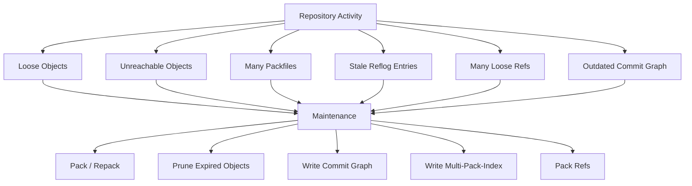
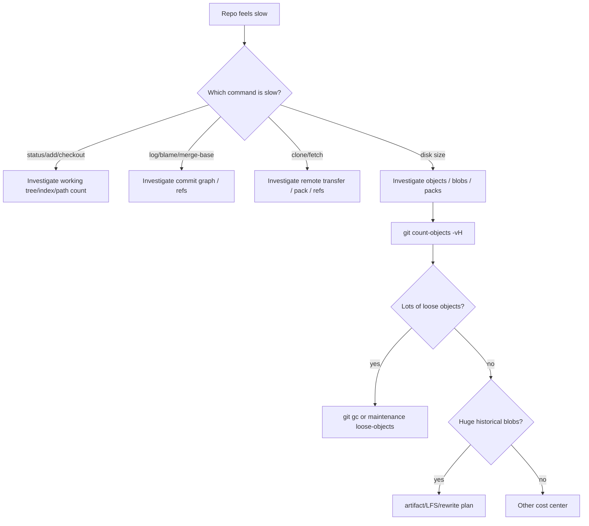
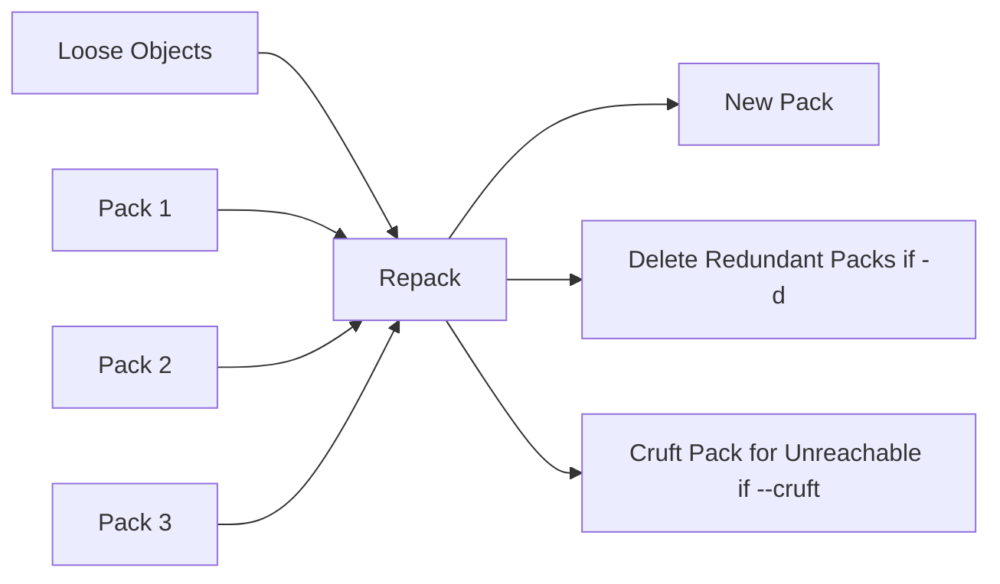
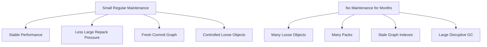
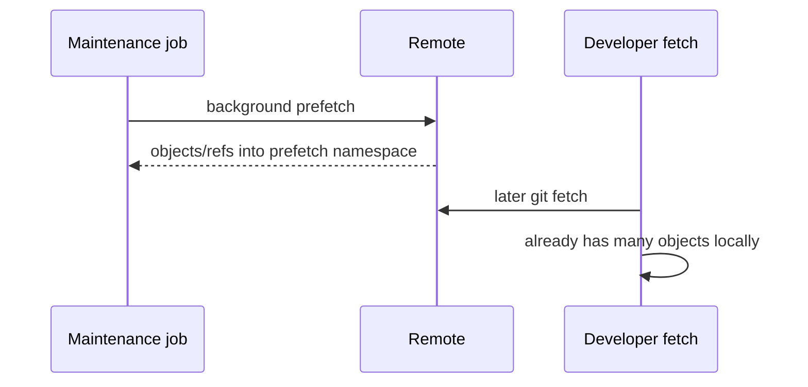
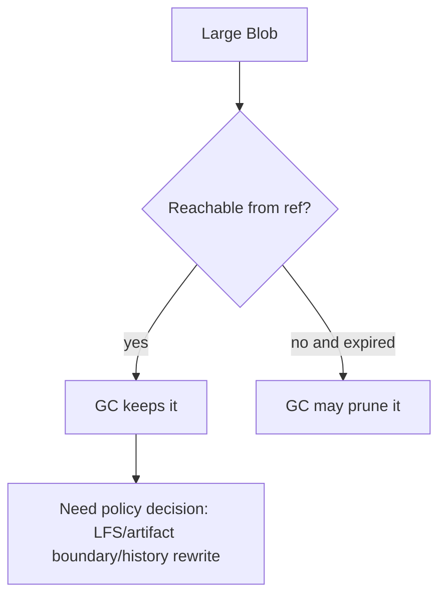

# Part 070 — Git Maintenance, GC, and Repack

Git repository adalah database yang terus berubah.

Setiap commit, fetch, rebase, merge, reset, stash, cherry-pick, dan branch deletion dapat meninggalkan struktur baru:

- loose objects,
- unreachable objects,
- packfiles baru,
- stale reflog entries,
- stale remote-tracking refs,
- commit-graph yang perlu diperbarui,
- multi-pack-index yang perlu dirapikan,
- packed refs yang perlu ditulis ulang,
- cruft objects yang menunggu expiry.

Karena itu, repository perlu **maintenance**.

Tetapi maintenance bukan ritual “jalankan `git gc --aggressive` kalau lambat”.

Maintenance adalah housekeeping database:

> reduce storage waste, preserve recoverability, update acceleration indexes, avoid unsafe pruning, and keep large repositories operational.

---

## 1. What Maintenance Actually Maintains



Git maintenance touches several layers:

| Layer | Maintenance concern |
|---|---|
| Loose objects | Pack them to reduce inode pressure and improve lookup/transfer. |
| Unreachable objects | Keep temporarily for recovery, prune after expiry. |
| Packfiles | Consolidate or incrementally repack to avoid many small packs. |
| Commit graph | Accelerate graph walks and ancestry queries. |
| Multi-pack-index | Accelerate object lookup across many packs. |
| Refs | Pack refs, prune stale remote refs when appropriate. |
| Reflog | Expire old entries according to policy. |

---

## 2. Core Terms

### 2.1 Loose object

A loose object is an object stored as an individual compressed file under `.git/objects/xx/...`.

Loose objects are common after local writes:

```bash
git add file.txt
git commit
```

### 2.2 Packed object

Packed objects are stored inside packfiles under `.git/objects/pack/`.

Packfiles are more efficient for storage and transfer.

### 2.3 Unreachable object

An object is unreachable when no ref reaches it through commit/tree/blob graph traversal.

Unreachable does not always mean useless.

It may be recoverable work from:

- bad reset,
- deleted branch,
- rebase rewrite,
- failed commit amend,
- stash drop,
- temporary object during operation.

### 2.4 Dangling object

A dangling object is an unreachable object that is not referenced by another unreachable object.

`git fsck` often reports dangling commits/blobs.

### 2.5 Prune

Pruning deletes unreachable objects that have expired.

Pruning is the dangerous part of maintenance because it can remove recovery options.

### 2.6 Repack

Repacking creates new packfiles from existing objects, often improving compression and lookup locality.

### 2.7 GC

`git gc` is high-level housekeeping. It can pack loose objects, prune unreachable objects, pack refs, update commit-graph, and run related cleanup depending on config/version/options.

### 2.8 Maintenance

`git maintenance` is a more granular mechanism that can run specific tasks like prefetch, commit-graph, loose-objects, incremental-repack, pack-refs, and gc.

---

## 3. Read Repository Maintenance State

Start with measurement.

```bash
git count-objects -vH
```

Typical output:

```text
count: 1500
size: 12.00 MiB
in-pack: 240000
packs: 18
size-pack: 1.72 GiB
prune-packable: 30
garbage: 0
size-garbage: 0 bytes
```

Interpretation:

| Field | Meaning |
|---|---|
| `count` | Number of loose objects. |
| `size` | Disk used by loose objects. |
| `in-pack` | Objects already packed. |
| `packs` | Number of packfiles. |
| `size-pack` | Disk used by packs. |
| `prune-packable` | Loose objects also present in packs. |
| `garbage` | Garbage files in object database. |
| `size-garbage` | Disk used by garbage files. |

Inspect packfiles:

```bash
ls -lh .git/objects/pack
```

Verify pack integrity:

```bash
git verify-pack -v .git/objects/pack/*.idx >/tmp/verify-pack.txt
```

Inspect largest packed objects:

```bash
git verify-pack -v .git/objects/pack/*.idx \
  | sort -k3 -n \
  | tail -50
```

Inspect refs:

```bash
git for-each-ref --format='%(refname)' | wc -l
```

Inspect commit-graph:

```bash
git commit-graph verify
```

Inspect multi-pack-index:

```bash
git multi-pack-index verify
```

Some repositories may not have a MIDX; failed verify in that case needs contextual interpretation.

---

## 4. `git gc`: High-Level Housekeeping

Basic command:

```bash
git gc
```

Auto mode:

```bash
git gc --auto
```

Aggressive mode:

```bash
git gc --aggressive
```

Prune control:

```bash
git gc --prune=now

git gc --prune=2.weeks.ago

git gc --no-prune
```

### 4.1 What `git gc` is good for

- Packing loose objects.
- Removing redundant loose objects.
- Expiring old reflog entries based on config.
- Pruning expired unreachable objects.
- Packing refs depending on config/options.
- Updating commit-graph if configured.

### 4.2 What `git gc` is not good for

- Fixing bad `.gitignore`.
- Fixing slow prompt that runs expensive status.
- Removing large blobs from history safely by itself.
- Solving path explosion in working tree.
- Fixing CI checkout semantics.
- Replacing artifact repository governance.

### 4.3 Safe default mental model



Do not use `git gc` as an all-purpose fix.

---

## 5. Pruning and Recoverability

Pruning is where data loss risk lives.

Consider this sequence:

```bash
git branch feature
# commits happen

git checkout main
git branch -D feature
```

The commits may become unreachable from refs, but they are usually still recoverable via reflog for some time.

If you aggressively prune immediately:

```bash
git gc --prune=now
```

You may remove objects that would otherwise be recoverable.

### 5.1 Safe recovery-first approach

Before destructive cleanup:

```bash
git reflog --date=iso

git fsck --lost-found

git branch recovery/<name> <sha>
```

Or at least create a backup ref:

```bash
git update-ref refs/backup/before-gc HEAD
```

### 5.2 Practical policy

| Environment | Pruning stance |
|---|---|
| Developer laptop | Avoid `--prune=now` unless you know what you are deleting. |
| CI ephemeral clone | Aggressive cleanup less risky because clone can be recreated. |
| Shared bare repository | Follow hosting/provider policy; never manually prune during concurrent writes without understanding locking. |
| Incident recovery | Do not run GC/prune until evidence and recovery refs are captured. |

### 5.3 Invariant

> Unreachable is not the same as disposable. Expiry policy is part of recovery design.

---

## 6. `git repack`: Direct Packfile Control

`git repack` is lower-level than `git gc`.

Common forms:

```bash
# pack unpacked objects
git repack

# pack all objects into a new pack and remove redundant packs/loose objects
git repack -ad

# include unreachable objects in cruft pack when supported
git repack --cruft -d
```

### 6.1 When to use repack directly

Use direct repack when:

- you are tuning large repository storage,
- you need specific pack topology,
- you understand object reachability implications,
- you are preparing a server-side repository,
- you are coordinating with MIDX/bitmap strategy,
- `git gc` abstraction is too coarse.

For everyday developer use, `git maintenance` or `git gc --auto` is usually safer.

### 6.2 Full repack trade-off

A full repack can improve compression, but it can be expensive:

- CPU heavy,
- memory heavy,
- disk heavy temporarily,
- disruptive if concurrent operations compete,
- potentially unnecessary if incremental repack is enough.

### 6.3 Pack topology mental model



---

## 7. Cruft Packs

Historically, unreachable objects were often left loose until expiry.

Cruft packs store unreachable objects in a pack along with metadata that helps expiry decisions.

Why it matters:

- fewer loose unreachable objects,
- lower inode pressure,
- better large repository hygiene,
- still supports expiry semantics.

Basic idea:

```bash
git repack --cruft -d
```

Or via GC config/version behavior where cruft packs are enabled.

### 7.1 When cruft packs help

- Repository has many unreachable objects from rewrites.
- CI/server does lots of fetch/push/rebase-like activity.
- Loose object count grows high.
- You want unreachable objects managed without immediately pruning them.

### 7.2 What cruft packs do not solve

- They do not remove large reachable blobs.
- They do not fix bad history design.
- They do not make unreachable objects semantically safe to ignore.
- They do not replace secret rotation after a leak.

---

## 8. `git maintenance`: Task-Oriented Maintenance

`git maintenance` provides task-oriented housekeeping.

Examples:

```bash
# Run default maintenance tasks once
git maintenance run

# Run a specific task
git maintenance run --task=commit-graph

git maintenance run --task=loose-objects

git maintenance run --task=incremental-repack

# Register repository for scheduled maintenance
git maintenance register

# Start scheduled maintenance for user repositories
git maintenance start
```

Tasks commonly include:

| Task | Purpose |
|---|---|
| `commit-graph` | Incrementally write/verify commit-graph files. |
| `prefetch` | Fetch objects from remotes into prefetch namespace to speed later fetch. |
| `loose-objects` | Clean up loose objects. |
| `incremental-repack` | Repack gradually instead of full expensive repack. |
| `pack-refs` | Pack loose refs. |
| `gc` | Run broader garbage collection. |

Exact schedule and available tasks can vary by Git version/config/platform.

### 8.1 Why maintenance exists

Large repos need small, regular housekeeping more than occasional huge cleanup.



### 8.2 Recommended local approach

For developers in large repos:

```bash
git maintenance start
```

Then inspect config:

```bash
git config --show-origin --get-regexp 'maintenance\.|gc\.|commitGraph\.|core\.multiPackIndex'
```

For one-off:

```bash
git maintenance run --auto
```

### 8.3 When not to blindly register maintenance

Be careful when:

- repository is on slow network filesystem,
- disk quota is tight,
- corporate endpoint security kills background jobs,
- multiple Git versions manage same repo,
- repo is used by automation that expects precise timing,
- bare/server repo is managed by hosting provider.

---

## 9. Commit-Graph Maintenance

Commit-graph accelerates graph traversal.

Useful commands:

```bash
git commit-graph verify

git commit-graph write --reachable

git commit-graph write --reachable --changed-paths
```

`--changed-paths` writes changed-path Bloom filters where supported, which can help path-limited history queries.

### 9.1 When it helps

- large history,
- expensive `merge-base`,
- expensive `log -- path`,
- many ancestry queries,
- CI computing affected changes,
- repository analysis tools.

### 9.2 When it does not help much

- slow untracked scan,
- binary blob bloat,
- checkout writing many files,
- LFS smudge latency,
- pre-commit hook latency.

### 9.3 Invariant

> Commit-graph accelerates graph questions. It does not reduce working tree size.

---

## 10. Multi-Pack-Index and Incremental Repack

A repository with many packfiles can suffer object lookup overhead.

MIDX creates one index over multiple packs.

Commands:

```bash
git multi-pack-index write

git multi-pack-index verify

git multi-pack-index expire

git multi-pack-index repack
```

Maintenance can run incremental repack so the repository does not need one giant expensive repack every time.

### 10.1 Why incremental repack matters

Full repack:

```text
expensive but simple: many packs -> one/few optimized packs
```

Incremental repack:

```text
less disruptive: many packs -> gradually merge selected packs
```

For large repositories, incremental maintenance is usually operationally safer.

### 10.2 Diagnosis

```bash
ls .git/objects/pack/*.pack | wc -l

git count-objects -vH

git multi-pack-index verify
```

Many packs are not automatically bad. They are bad when lookup, fetch, or maintenance becomes expensive.

---

## 11. Pack Refs

Loose refs are individual files under `.git/refs/...`.

Packed refs are stored in `.git/packed-refs`.

Command:

```bash
git pack-refs --all
```

Pack refs can help when there are many tags/branches.

But do not write scripts that assume all refs live under `.git/refs`.

Always use Git commands:

```bash
git for-each-ref

git show-ref

git rev-parse --verify refs/heads/main
```

### 11.1 When pack refs helps

- many tags,
- many stale branch refs,
- repository import/migration,
- hosting mirror,
- local repo with thousands of remote-tracking refs.

### 11.2 What to combine with pack refs

- prune stale remote refs,
- delete obsolete branches/tags according to policy,
- avoid high-cardinality build refs,
- protect meaningful release tags.

---

## 12. Remote Prefetch Maintenance

`git maintenance` can prefetch remote objects into a prefetch namespace.

Mental model:



This can make interactive fetch faster, but it has trade-offs:

- uses disk/network in background,
- may fetch data developer does not need,
- must respect corporate network policies,
- may confuse people inspecting refs manually.

Use it where it improves real developer experience.

---

## 13. Maintenance Config You Should Know

Inspect current config:

```bash
git config --show-origin --list | grep -E '^(gc|maintenance|commitGraph|core\.multiPackIndex|fetch\.prune)\.'
```

Commonly relevant settings:

```bash
# Fetch cleanup
git config fetch.prune true

# Commit graph
git config gc.writeCommitGraph true

# Maintenance strategy
git config maintenance.strategy incremental

# MIDX support if applicable
git config core.multiPackIndex true
```

Do not cargo-cult configs across Git versions.

A config that is useful in one environment may be harmful in another.

---

## 14. Safe Local Maintenance Playbook

Use this when a developer repository feels bloated but no data-loss incident is ongoing.

### Step 1: Snapshot

```bash
git status --short

git branch --show-current

git reflog -n 20

git count-objects -vH
```

### Step 2: Protect important recovery points

If you recently did risky work:

```bash
git update-ref refs/backup/before-maintenance HEAD
```

If you have uncommitted work:

```bash
git status
# commit it, stash it, or copy it out intentionally
```

### Step 3: Run non-destructive-ish maintenance

```bash
git maintenance run --auto
```

Or:

```bash
git gc
```

Avoid immediate prune unless you understand the risk.

### Step 4: Verify

```bash
git fsck --connectivity-only

git status --short

git count-objects -vH
```

### Step 5: If still slow, diagnose cost center

Do not repeat GC endlessly.

Move to:

- path count,
- untracked count,
- large blobs,
- hooks/filters,
- graph queries,
- remote refs,
- CI checkout config.

---

## 15. Safe CI Maintenance Model

CI clones are often disposable.

That changes the risk model.

### 15.1 Ephemeral CI clone

If every job clones fresh and deletes workspace:

- local GC rarely matters,
- checkout strategy matters more,
- shallow/partial/sparse correctness matters more,
- cache strategy matters more.

### 15.2 Persistent CI workspace

If CI reuses workspace:

- stale refs accumulate,
- loose objects accumulate,
- failed jobs leave dirty files,
- LFS cache grows,
- submodule state drifts.

Maintenance playbook:

```bash
git fetch --prune --tags

git reset --hard

git clean -ffdX

git maintenance run --auto
```

Be careful with `git clean -ffdX` vs `-ffdx`:

| Option | Meaning |
|---|---|
| `-X` | remove ignored files only. |
| `-x` | remove ignored and unignored untracked files. |

In CI, `-x` may be acceptable. On developer machines, it is dangerous without dry-run.

---

## 16. Server-Side / Bare Repository Maintenance

If you operate your own Git server, maintenance is a production operation.

Do not treat it like local cleanup.

Consider:

- concurrent pushes/fetches,
- locks,
- backup policy,
- mirror replication,
- pack bitmap generation,
- object quarantine from receive-pack,
- secret leak incident state,
- tag immutability,
- hosting provider behavior,
- disk headroom during repack.

Server maintenance checklist:

- [ ] Know if repository is bare.
- [ ] Know active writers/readers.
- [ ] Ensure disk headroom for repack.
- [ ] Backup refs before risky maintenance.
- [ ] Avoid prune during incident recovery.
- [ ] Coordinate with mirrors.
- [ ] Validate with `git fsck` / provider tools.
- [ ] Monitor pack size/count before/after.

For hosted Git platforms, prefer platform-native maintenance unless you explicitly administer the server storage.

---

## 17. History Rewrite vs Maintenance

Maintenance does not remove reachable bad history.

If a 900MB file was committed two years ago and is reachable from `main`, normal GC will keep it.



To remove reachable blobs, you need history rewrite tools/processes such as `git filter-repo` or equivalent migration tooling, plus coordination.

That changes commit hashes.

It is not maintenance. It is repository migration.

### 17.1 Rewrite checklist

- [ ] Rotate secrets first if leak-related.
- [ ] Freeze writes or define migration window.
- [ ] Backup original repo.
- [ ] Identify refs to rewrite.
- [ ] Communicate downstream impact.
- [ ] Rewrite in clone/mirror safely.
- [ ] Verify refs, tags, build, and release history.
- [ ] Force update protected refs only through approved process.
- [ ] Instruct developers to re-clone or realign.
- [ ] Prevent recurrence with hooks/CI policy.

---

## 18. Why `git gc --aggressive` Is Usually the Wrong First Move

`git gc --aggressive` spends extra effort finding better deltas.

It can be useful in rare cases, but it is expensive and often misapplied.

It does not fix:

- untracked file scan,
- huge working tree,
- too many generated files,
- slow hooks,
- LFS network latency,
- missing sparse checkout,
- wrong CI depth,
- large reachable blobs as a policy problem.

Better sequence:

```bash
# 1. measure
git count-objects -vH

# 2. regular maintenance
git maintenance run --auto

# 3. diagnose exact bottleneck
GIT_TRACE2_PERF=1 git status

# 4. optimize cost center
# sparse/partial/ignore/commit-graph/repack/etc.
```

### 18.1 Rule

> Use aggressive GC only after evidence shows pack compression/repacking is the bottleneck and the repository can tolerate the cost.

---

## 19. Maintenance Decision Matrix

| Symptom | First check | Likely action |
|---|---|---|
| Many loose objects | `git count-objects -vH` | `git maintenance run --task=loose-objects` or `git gc` |
| Many packfiles | `ls .git/objects/pack` | MIDX/incremental repack/full repack depending severity |
| Graph queries slow | `git commit-graph verify` | write commit-graph with changed paths |
| Path log slow | `git log -- path` timing | commit-graph changed-path Bloom filters, path boundary |
| Disk huge | largest blob analysis | artifact/LFS/history rewrite decision |
| Fetch slow | ref count, pack count, remote trace | prune refs, MIDX, server pack/bitmap, partial clone |
| Status slow | untracked/path count | ignore cleanup, sparse checkout, fsmonitor, untracked cache |
| CI workspace grows | `du`, stale refs | clean/reset/prune/maintenance cache policy |
| Deleted branch needs recovery | reflog/fsck | create recovery ref before GC/prune |
| Secret leak | incident response | rotate secret before rewrite; do not rely on GC |

---

## 20. Lab: Observe Maintenance on a Toy Repository

Create a repo:

```bash
mkdir /tmp/git-maintenance-lab
cd /tmp/git-maintenance-lab
git init

for i in $(seq 1 200); do
  echo "file $i $(date +%s%N)" > "file-$i.txt"
  git add "file-$i.txt"
  git commit -m "add file $i" >/dev/null
done
```

Inspect:

```bash
git count-objects -vH
find .git/objects -type f | wc -l
```

Run GC:

```bash
git gc
```

Inspect again:

```bash
git count-objects -vH
find .git/objects -type f | wc -l
ls -lh .git/objects/pack
```

Create unreachable commits:

```bash
git checkout -b temp
for i in $(seq 1 5); do
  echo "temp $i" >> temp.txt
  git add temp.txt
  git commit -m "temp $i" >/dev/null
done

git checkout main
git branch -D temp
```

Recover before pruning:

```bash
git reflog --all --oneline | head
# pick temp commit sha if needed
git branch recovery/temp <sha>
```

Now understand why pruning immediately can be destructive.

---

## 21. Engineering Handbook Policy Example

```mdx
## Repository Maintenance Policy

### Developer machines

- Enable scheduled Git maintenance for repositories larger than 1GB unless platform constraints prevent it.
- Do not run `git gc --prune=now` during incident recovery or after accidental branch deletion.
- Use `git count-objects -vH` before manual maintenance.
- Use sparse checkout and partial clone for monorepo workflows where applicable.

### CI

- Prefer job-scoped checkout over full repository checkout.
- Persistent workspaces must run `fetch --prune`, `reset --hard`, controlled `clean`, and `maintenance run --auto`.
- Shallow clone is allowed only when the job does not need merge-base, tags, changelog, or release boundary analysis.

### Server repositories

- Server-side maintenance must be coordinated with backup, disk headroom, and active writer policy.
- Do not manually prune shared repositories during leak/rollback/recovery investigation.
- Large blob prevention is enforced before receive or via required CI gate.

### History rewrite

- History rewrite is migration/incident work, not routine maintenance.
- Rewrite requires approval, communication, backup, verification, and recurrence prevention.
```

---

## 22. Operational Invariants

1. **GC keeps reachable objects.** If bad content is reachable, maintenance will not remove it.
2. **Prune removes recovery options.** Avoid aggressive prune before recovery analysis.
3. **Loose object count and pack count are different problems.** Diagnose both.
4. **Commit-graph helps graph queries, not working tree scans.**
5. **Sparse checkout helps working tree size, not necessarily object database size.**
6. **Partial clone helps object transfer/storage, but introduces lazy-fetch dependency.**
7. **Shallow clone helps history size, but may break ancestry-dependent workflows.**
8. **Aggressive GC is not a universal performance fix.**
9. **Server maintenance is production operations.** Coordinate it like infrastructure work.
10. **History rewrite is not maintenance.** It is identity-changing migration.

---

## 23. Key Takeaways

- `git gc`, `git repack`, and `git maintenance` operate on repository storage and metadata; they do not automatically fix workflow/design problems.
- Measure before maintenance: `count-objects`, pack count, ref count, commit-graph state, path count, and largest blobs.
- Pruning is dangerous because unreachable work may still be recoverable.
- Regular small maintenance is safer than rare huge cleanup.
- For large repositories, commit-graph, MIDX, incremental repack, partial clone, and sparse checkout are complementary—not interchangeable.
- Reachable large blobs require policy/migration, not ordinary GC.
- Production Git maintenance must be treated as a controlled operational process.

---

## References

- Git documentation: `git maintenance` — https://git-scm.com/docs/git-maintenance
- Git documentation: `git gc` — https://git-scm.com/docs/git-gc
- Git documentation: `git repack` — https://git-scm.com/docs/git-repack
- Git documentation: cruft packs — https://git-scm.com/docs/cruft-packs
- Git documentation: `git count-objects` — https://git-scm.com/docs/git-count-objects
- Git documentation: `git verify-pack` — https://git-scm.com/docs/git-verify-pack
- Git documentation: commit-graph format — https://git-scm.com/docs/commit-graph-format
- Git documentation: multi-pack-index — https://git-scm.com/docs/multi-pack-index
- Git documentation: `git pack-refs` — https://git-scm.com/docs/git-pack-refs
