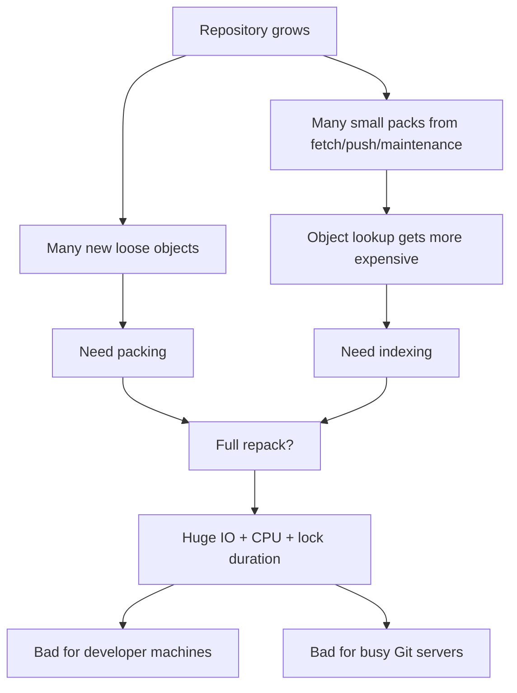
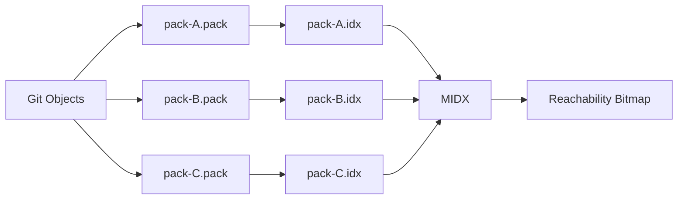
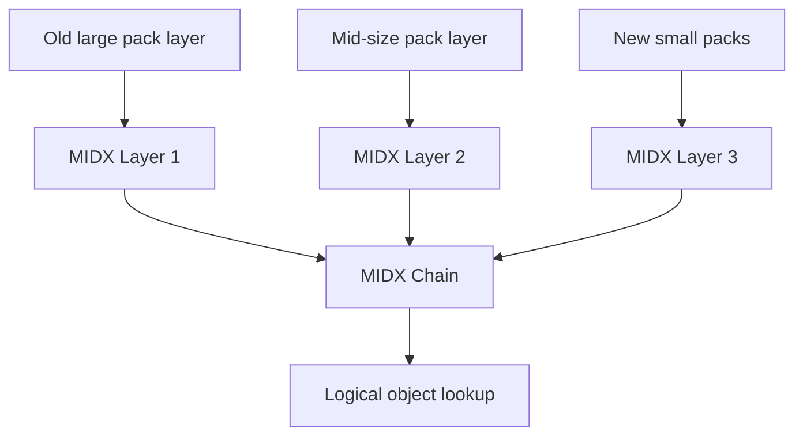
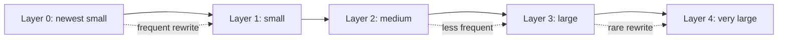
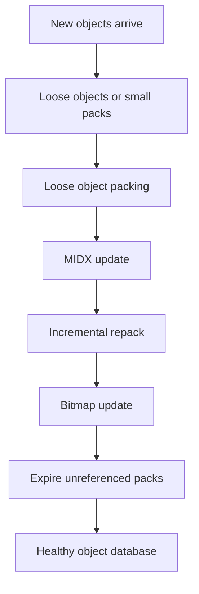
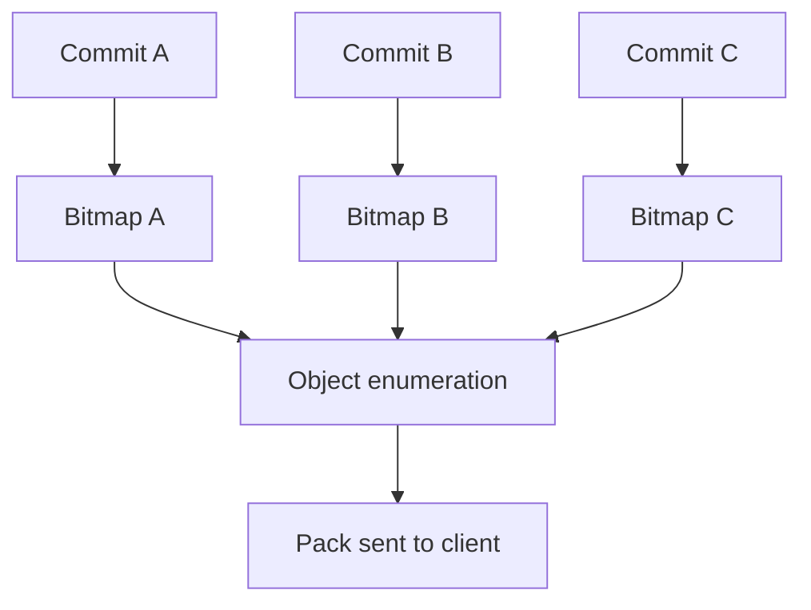
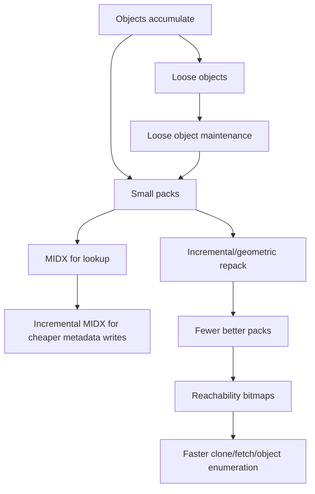

# Part 071 — Incremental MIDX and Modern Repacking

Repository besar jarang rusak karena satu commit buruk saja.

Seringnya repository melambat karena **object database-nya menua**:

- terlalu banyak pack kecil,
- full repack terlalu mahal,
- bitmap stale atau tidak tersedia,
- object lookup tersebar di banyak pack,
- fetch/clone harus menghitung reachability di graph besar,
- maintenance mengganggu operasi developer/CI,
- server harus melayani banyak request sambil menulis struktur indeks besar.

Part sebelumnya membahas `gc`, `maintenance`, dan `repack` secara umum. Sekarang kita masuk ke model yang lebih modern: **incremental multi-pack-index** dan **modern repacking strategy**.

Target mental model:

> large repository maintenance should be incremental, bounded, race-aware, and optimized for object lookup plus reachability enumeration — not just “compress everything into one huge pack”.

---

## 1. Problem: One Giant Repack Does Not Scale Forever

Pada repository kecil, strategy sederhana masih masuk akal:

```bash
git gc
```

atau:

```bash
git repack -Ad
```

Tetapi pada repository besar, full repack dapat menjadi mahal karena Git harus:

1. membaca object graph besar,
2. memilih object yang masuk pack,
3. menghitung delta compression,
4. menulis pack baru besar,
5. menulis index baru,
6. mengganti struktur lama,
7. menjaga agar operasi lain tidak melihat state tidak konsisten.



Full repack juga bukan free lunch:

| Benefit | Cost |
|---|---|
| Object storage lebih compact | CPU tinggi untuk delta selection |
| Pack count turun | IO besar untuk menulis pack baru |
| Lookup bisa lebih mudah | Maintenance window panjang |
| Transfer bisa lebih efisien | Risk lebih besar kalau concurrent workload tinggi |

Untuk repository yang sering berubah, one-shot full repack mirip vacuum database besar tanpa strategi incremental.

Bisa berhasil, tapi tidak selalu cocok sebagai default operasional.

---

## 2. Core Structures: Pack, IDX, MIDX, Bitmap

Sebelum incremental MIDX masuk akal, pisahkan empat struktur ini.



| Structure | Job |
|---|---|
| `.pack` | Menyimpan object terkompresi dan delta-compressed. |
| `.idx` | Index untuk lookup object di satu pack. |
| MIDX | Index lintas banyak pack. |
| bitmap | Acceleration structure untuk mengetahui object reachable dari commit tertentu. |

Tanpa MIDX, Git harus mencari object di banyak `.idx`.

Dengan MIDX, Git bisa memiliki satu indeks logis lintas pack.

Dengan bitmap, Git bisa mempercepat pertanyaan seperti:

- object apa yang reachable dari commit ini?
- object mana yang perlu dikirim saat fetch/clone?
- object mana yang sudah dimiliki client?
- object mana yang unreachable dan bisa diperlakukan sebagai cruft?

---

## 3. MIDX Recap: Index Across Many Packs

MIDX adalah jawaban untuk masalah “banyak pack”.

Tanpa MIDX:

```text
lookup object X:
  check pack-001.idx
  check pack-002.idx
  check pack-003.idx
  ...
  check pack-N.idx
```

Dengan MIDX:

```text
lookup object X:
  check multi-pack-index
  find pack id + offset
  read object from selected pack
```

Command dasar:

```bash
git multi-pack-index write
```

Inspect pack directory:

```bash
ls .git/objects/pack
```

Verify MIDX:

```bash
git multi-pack-index verify
```

Expire pack yang tidak lagi direferensikan MIDX:

```bash
git multi-pack-index expire
```

Repack small packs referenced by MIDX:

```bash
git multi-pack-index repack --batch-size=<bytes>
```

Dalam MDX, command di atas adalah konsep. Saat praktik, ganti `<bytes>` dengan angka nyata seperti `1g`, `4g`, atau nilai byte sesuai versi Git/environment.

---

## 4. Why Incremental MIDX Exists

MIDX awal menyederhanakan lookup lintas pack, tetapi menulis ulang satu MIDX besar juga bisa menjadi mahal.

Pada repository sangat besar:

- jumlah object sangat besar,
- jumlah pack bisa besar,
- MIDX monolitik bisa besar,
- maintenance sering terjadi,
- menulis ulang indeks global setiap kali ada pack baru tidak ideal.

Incremental MIDX memecah ide “satu indeks global” menjadi **chain/layer**.



Alih-alih menulis ulang semua metadata object setiap kali repository berubah, Git dapat menulis incremental MIDX layer untuk pack/object yang belum tercakup layer sebelumnya.

Mental model:

> incremental MIDX trades one large rewrite for a controlled chain of smaller metadata layers.

---

## 5. Geometric Repacking: Avoid Infinite Small Layers

Incremental saja punya risiko: chain bisa tumbuh terlalu panjang.

Kalau setiap maintenance hanya menambah layer kecil, lookup dapat memburuk karena Git harus mempertimbangkan terlalu banyak layer.

Karena itu perlu **geometric repacking**.

Ide sederhananya:

- layer baru kecil boleh sering ditulis,
- layer lama besar jarang ditulis,
- jumlah layer dijaga kira-kira logarithmic terhadap total object,
- small/new layers digabung lebih sering daripada large/old layers.



Analogi database:

| Git object maintenance | LSM-tree intuition |
|---|---|
| New packs | New small sorted runs |
| MIDX layer | Index layer |
| Geometric repack | Compaction |
| Large old layer | Cold data |
| Small new layer | Hot ingest data |

Jangan membawa analogi ini terlalu jauh. Git bukan LSM database. Tetapi untuk mental model maintenance, analogi ini berguna: **avoid rewriting cold huge data every time hot small data arrives**.

---

## 6. Modern Repacking Strategy: From “Big Cleanup” to “Continuous Compaction”

Repository besar perlu berpikir seperti ini:



Bukan:

```text
everything gets slow -> run aggressive gc -> hope it works
```

Tetapi:

```text
small maintenance tasks run regularly -> object database remains healthy
```

This matters because the worst time to discover repository maintenance debt is during:

- release freeze,
- production hotfix,
- CI outage,
- migration to new Git hosting,
- security secret removal,
- monorepo import,
- mass branch/tag cleanup.

---

## 7. `git maintenance` and Incremental Repack

`git maintenance` menyediakan task yang lebih granular daripada `git gc` tunggal.

Inspect available maintenance behavior:

```bash
git maintenance run --help
```

Run maintenance manually:

```bash
git maintenance run
```

Run specific task:

```bash
git maintenance run --task=incremental-repack
```

Run auto heuristics:

```bash
git maintenance run --auto
```

Enable scheduled maintenance:

```bash
git maintenance start
```

Stop scheduled maintenance:

```bash
git maintenance stop
```

Important distinction:

| Command | Intention |
|---|---|
| `git gc` | Traditional aggregate housekeeping. |
| `git maintenance run` | Run selected maintenance task set. |
| `git maintenance start` | Register scheduled/background maintenance. |
| `git multi-pack-index ...` | Directly operate MIDX structures. |
| `git repack ...` | Directly reorganize packfiles. |

For large repositories, prefer understanding task-level behavior before blindly invoking global cleanup.

---

## 8. Operational Invariant: Never Optimize Away Recoverability Accidentally

Modern repacking is about performance, but Git recovery depends on retention windows:

- reflog expiry,
- unreachable object pruning,
- cruft pack retention,
- backup refs,
- remote clone copies,
- CI clone behavior,
- server-side retention policies.

Dangerous mental model:

> “If object is unreachable, it is garbage.”

Better mental model:

> “If object is unreachable, it may be garbage, or it may be tomorrow’s recovery path.”

Before aggressive cleanup:

```bash
git reflog --date=iso --all | head -100
git fsck --unreachable --no-reflogs
git count-objects -vH
```

Create a safety ref before risky local experiments:

```bash
git branch backup/before-maintenance HEAD
```

Or for specific object:

```bash
git update-ref refs/backup/before-maintenance <commit-sha>
```

If you cannot name the object you may need later, you are not ready to prune aggressively.

---

## 9. Diagnosing Pack and MIDX Health

Start with lightweight metrics:

```bash
git count-objects -vH
```

Look for:

| Field | Interpretation |
|---|---|
| `count` | Loose object count. Very high means loose-object pressure. |
| `size` | Loose object size. |
| `in-pack` | Objects inside packfiles. |
| `packs` | Number of packfiles. Too high can hurt lookup/maintenance. |
| `size-pack` | Packed object storage size. |
| `prune-packable` | Loose objects that are already in packs. |
| `garbage` | Garbage files in object database. |
| `size-garbage` | Disk used by garbage files. |

Inspect pack files:

```bash
find .git/objects/pack -maxdepth 1 -type f | sort
```

Count packs:

```bash
find .git/objects/pack -name '*.pack' | wc -l
```

Verify pack integrity:

```bash
git verify-pack -v .git/objects/pack/pack-*.idx >/tmp/verify-pack.txt
```

List largest objects:

```bash
git rev-list --objects --all \
  | git cat-file --batch-check='%(objecttype) %(objectname) %(objectsize:disk) %(rest)' \
  | sort -k3 -n \
  | tail -50
```

MIDX verification:

```bash
git multi-pack-index verify
```

Commit-graph verification:

```bash
git commit-graph verify
```

Do not interpret one metric alone. A repository with many packs might still perform fine if MIDX/bitmap are healthy. A repository with few packs might still perform badly if it contains huge binary churn or path-limited history queries are pathological.

---

## 10. `git repack` Options You Should Actually Understand

Common operations:

```bash
git repack -d
```

Remove redundant packs after packing.

```bash
git repack -a -d
```

Pack all reachable objects into one pack and delete redundant packs.

```bash
git repack -A -d
```

Also include unreachable objects subject to behavior/version/options.

```bash
git repack --write-midx
```

Write MIDX after repacking when supported.

```bash
git repack --write-bitmap-index
```

Write bitmap index when appropriate.

```bash
git repack --cruft
```

Store unreachable objects in cruft pack rather than many loose objects.

Conceptual decision table:

| Need | Prefer |
|---|---|
| Developer repo slightly messy | `git maintenance run --auto` |
| Too many loose objects | maintenance loose-object task / `git gc --auto` |
| Too many small packs | incremental repack / MIDX repack |
| Server repository with large object DB | scheduled maintenance with MIDX + bitmap strategy |
| Need maximum compactness before archival | carefully planned full repack |
| Need preserve recovery objects | cruft pack + conservative expiry |
| Suspected corruption | verify before repack |

Do not run `git gc --aggressive` as a generic performance fix. It can be expensive, and the gain may not address the true bottleneck.

---

## 11. Reachability Bitmaps: Why Fetch and Clone Care

Many Git server operations need to answer:

```text
Which objects are reachable from refs the client wants,
minus objects the client already has?
```

Without acceleration, Git may need graph walks over many commits and trees.

With bitmaps, reachability can be represented more compactly and combined quickly.



Bitmaps matter most for:

- clone,
- fetch,
- push negotiation on server,
- object enumeration,
- `rev-list --objects --all`,
- repository maintenance,
- large monorepo hosting.

But bitmaps also have cost:

- they must be written,
- they can become stale,
- compatibility with incremental structures matters,
- they can consume memory/storage,
- they may be less useful for unusual path-limited operations.

---

## 12. Incremental MIDX vs Traditional MIDX

Traditional MIDX mental model:

```text
one MIDX indexes many packs
```

Incremental MIDX mental model:

```text
MIDX chain indexes packs across layers
```

Trade-off:

| Dimension | Traditional MIDX | Incremental MIDX |
|---|---|---|
| Write cost | Can grow with all indexed packs/object metadata | Smaller writes for new layers |
| Lookup simplicity | One structure | Chain/layer logic |
| Maintenance complexity | Simpler | More complex compaction strategy |
| Very large repo fit | Can become expensive | Better fit for continuous growth |
| Risk | Big rewrite | Layer management and compaction policy |

Operational takeaway:

> Incremental MIDX is useful when the cost of repeatedly rewriting a monolithic MIDX becomes material.

For most ordinary repositories, you do not need to manually tune this. For platform-scale repositories, hosting infrastructure and scheduled maintenance policy matter.

---

## 13. Repository Maintenance as an SLO

A mature team treats Git performance as part of developer productivity and release reliability.

Example SLO-like metrics:

| Metric | Why it matters |
|---|---|
| Fresh clone time | New developer/CI cold start. |
| Incremental fetch time | Daily developer sync. |
| `git status` time | Inner loop latency. |
| Checkout/switch time | Context switching cost. |
| Pack count | Object lookup/maintenance pressure. |
| Loose object count | Inode and object lookup pressure. |
| Largest blob size | Binary bloat and transfer risk. |
| Number of refs | Advertisement and ref storage pressure. |
| Commit-graph freshness | History query performance. |
| MIDX verification status | Object lookup integrity. |

Sample local health script:

```bash
#!/usr/bin/env bash
set -euo pipefail

echo '== repository =='
git rev-parse --show-toplevel

echo '== object counts =='
git count-objects -vH

echo '== pack files =='
find .git/objects/pack -name '*.pack' | wc -l

echo '== largest disk objects =='
git rev-list --objects --all \
  | git cat-file --batch-check='%(objecttype) %(objectname) %(objectsize:disk) %(rest)' \
  | sort -k3 -n \
  | tail -20

echo '== commit graph =='
git commit-graph verify || true

echo '== midx =='
git multi-pack-index verify || true
```

This is not a perfect performance benchmark. It is an early-warning tool.

---

## 14. CI and Repacking: Avoid Per-Job Maintenance Theater

Bad CI pattern:

```yaml
steps:
  - checkout
  - run: git gc --aggressive
  - build
```

This usually wastes time. CI clones are often disposable.

Better CI strategy:

| Scenario | Better approach |
|---|---|
| Disposable clone | Optimize clone/fetch depth/filter/cache, not local repack. |
| Persistent workspace | Scheduled maintenance outside critical path. |
| Shared Git cache | Maintain cache repository centrally. |
| Monorepo CI | Combine partial clone, sparse checkout, commit-graph/MIDX cache where supported. |
| Release build | Prefer correctness: tags, full needed history, pinned commit. |

Never optimize CI Git cost by accidentally removing data needed for correctness:

- missing tags can break version calculation,
- shallow history can break merge-base,
- partial clone can lazy-fetch during build,
- sparse checkout can hide path-dependent scripts,
- stale cache can build wrong commit.

---

## 15. Server-Side Considerations

On a Git server, maintenance has more constraints:

- concurrent fetch/clone/push,
- ref updates while objects are repacked,
- object quarantine during receive,
- alternates/shared object storage,
- replication/mirror lag,
- backup consistency,
- bitmap generation cost,
- IO contention with user traffic.

Do not directly map local workstation advice to hosting infrastructure.

Server maintenance should be:

1. scheduled or adaptive,
2. observed,
3. concurrency-safe,
4. rollback-aware,
5. tested on repository copies,
6. coordinated with backup/replication,
7. version-aware.

A server repository is not just “someone’s `.git` folder on a bigger disk”.

It is a shared service dependency.

---

## 16. Failure Modes

### Failure Mode 1: Too Many Small Packs

Symptoms:

- `git count-objects -vH` shows high `packs`,
- fetch/checkout/object lookup becomes slower,
- maintenance logs show repeated small repacks.

Response:

```bash
git multi-pack-index write
git multi-pack-index verify
git maintenance run --task=incremental-repack
```

For hosted repos, do this through supported hosting maintenance controls, not random shell access unless you own the server operations.

---

### Failure Mode 2: Huge Binary Churn Hidden by Delta Compression

Symptoms:

- pack size huge,
- clone/fetch slow,
- largest object report shows binaries,
- repack CPU high,
- delta compression gains limited.

Response:

- stop adding binaries to Git,
- move future binaries to artifact storage or Git LFS if appropriate,
- evaluate history rewrite only after blast-radius analysis,
- communicate clone invalidation risk,
- rotate secrets if binary contained credentials.

Repacking cannot make a bad artifact boundary disappear.

---

### Failure Mode 3: Aggressive Prune Removes Recovery Path

Symptoms:

- bad rebase/reset occurred,
- reflog expired/pruned,
- unreachable commit no longer recoverable,
- `fsck --lost-found` cannot find needed object.

Response:

- check other clones,
- check remote refs/backups,
- check CI clone artifacts,
- check code review system refs,
- review maintenance retention policy.

Prevention:

- conservative prune expiry,
- backup refs before risky rewrite,
- avoid aggressive cleanup immediately after incidents.

---

### Failure Mode 4: Maintenance During Active Rewrite

Symptoms:

- team is doing history rewrite/filter-repo,
- maintenance runs concurrently,
- confusion about object reachability,
- old and new histories coexist,
- storage unexpectedly grows.

Response:

- freeze repository mutation,
- snapshot refs,
- disable scheduled maintenance if needed,
- complete rewrite/migration,
- verify refs and object integrity,
- then run planned maintenance.

---

### Failure Mode 5: Pack Optimization Masks Workflow Problem

Symptoms:

- repeated performance incidents,
- repository grows rapidly,
- every fix is “repack again”,
- root cause is branch/ref explosion, binary artifacts, CI clone storm, or monorepo ownership issue.

Response:

- model repository growth sources,
- reduce artifact misuse,
- prune stale refs with policy,
- improve CI caching/fetch strategy,
- introduce sparse/partial workflows,
- split or reorganize repository only with migration plan.

Maintenance is not a substitute for repository architecture.

---

## 17. Practical Playbook: Modern Local Maintenance

Use this when a developer repository feels slow but not corrupted.

### Step 1 — Snapshot state

```bash
git status --short --branch
git branch backup/before-maintenance-$(date +%Y%m%d-%H%M%S) HEAD
```

### Step 2 — Inspect object database

```bash
git count-objects -vH
find .git/objects/pack -name '*.pack' | wc -l
```

### Step 3 — Verify before mutation

```bash
git fsck --connectivity-only
git commit-graph verify || true
git multi-pack-index verify || true
```

### Step 4 — Run normal maintenance

```bash
git maintenance run --auto
```

If still problematic:

```bash
git maintenance run
```

### Step 5 — Re-check metrics

```bash
git count-objects -vH
git status --short --branch
```

### Step 6 — Only then consider manual repack

```bash
git repack -d
```

Avoid aggressive/full options until you know why normal maintenance is insufficient.

---

## 18. Practical Playbook: Platform Repository Maintenance Review

For a central/server repository, review at a higher level.

Checklist:

- What Git version is used by clients and server?
- Is repository bare or non-bare?
- Are object alternates used?
- Are bitmaps enabled and current?
- Is MIDX used?
- Is incremental MIDX supported by deployed Git version?
- How many packs exist?
- How large is the largest pack?
- How long does fetch negotiation take?
- How long does fresh clone take?
- How many refs are advertised?
- Are there stale PR refs, CI refs, review refs, or backup refs?
- Are tags protected?
- Is maintenance scheduled during traffic peaks?
- Is backup consistent with maintenance windows?
- Is restore tested?

Do not tune repository storage blindly. Measure the symptom and identify whether it is:

- object lookup,
- reachability enumeration,
- ref advertisement,
- network transfer,
- working tree checkout,
- filesystem latency,
- hooks,
- LFS/filter process,
- CI orchestration,
- or repository topology.

---

## 19. Command Reference

```bash
# Basic object database metrics
git count-objects -vH

# Verify repository connectivity
git fsck --connectivity-only

# Verify commit graph
git commit-graph verify

# Write commit graph
git commit-graph write --reachable --changed-paths

# Verify multi-pack-index
git multi-pack-index verify

# Write multi-pack-index
git multi-pack-index write

# Write incremental MIDX when supported
git multi-pack-index write --incremental

# Expire unreferenced packs according to MIDX
git multi-pack-index expire

# Repack packs referenced by MIDX
git multi-pack-index repack --batch-size=1g

# Run maintenance
git maintenance run

# Run automatic maintenance
git maintenance run --auto

# Run incremental repack maintenance task
git maintenance run --task=incremental-repack

# Traditional repack
git repack -d

# More comprehensive repack, use carefully
git repack -a -d
```

Not every installed Git version supports every option above. Always check:

```bash
git --version
git multi-pack-index write -h
git repack -h
git maintenance run -h
```

---

## 20. Engineering Heuristics

Use these rules unless you have measured evidence to override them.

1. **Prefer continuous maintenance over emergency aggressive cleanup.**
2. **Measure pack count, object count, and clone/fetch latency before tuning.**
3. **Do not use full repack to solve binary artifact misuse.**
4. **Do not prune aggressively after risky rewrite or incident.**
5. **For large repos, MIDX and bitmaps are operational infrastructure, not trivia.**
6. **CI should not run expensive maintenance in every disposable job.**
7. **Server maintenance must be concurrency-aware and backup-aware.**
8. **If a repository needs constant manual repack, inspect workflow architecture.**

---

## 21. Mini Lab — Observe Pack Evolution

Create a temporary repo:

```bash
mkdir /tmp/git-pack-lab
cd /tmp/git-pack-lab
git init
```

Generate commits:

```bash
for i in $(seq 1 200); do
  echo "line $i $(date +%s%N)" >> data.txt
  git add data.txt
  git commit -m "commit $i" >/dev/null
done
```

Inspect object state:

```bash
git count-objects -vH
```

Pack objects:

```bash
git gc
```

Inspect again:

```bash
git count-objects -vH
ls .git/objects/pack
```

Write MIDX:

```bash
git multi-pack-index write
git multi-pack-index verify
```

Add more commits and observe loose object growth:

```bash
for i in $(seq 201 230); do
  echo "line $i $(date +%s%N)" >> data.txt
  git add data.txt
  git commit -m "commit $i" >/dev/null
done

git count-objects -vH
```

Run maintenance:

```bash
git maintenance run --auto
git count-objects -vH
```

Reflection questions:

1. Which metrics changed after `gc`?
2. Which metrics changed after new commits?
3. Did `maintenance --auto` do anything in your Git version/config?
4. How many pack files exist?
5. What would be different in a 10-year monorepo?

---

## 22. Mental Model Summary



Key insight:

> Git performance at scale is not only about compressing objects. It is about keeping object lookup, reachability enumeration, and maintenance writes bounded as the repository grows.

Incremental MIDX and modern repacking exist because large repositories need database-style compaction discipline.

---

## References

- Git documentation: `git multi-pack-index`
- Git documentation: `multi-pack-index` design notes
- Git documentation: `git maintenance`
- Git documentation: `git repack`
- Git documentation: `git gc`
- Git documentation: `git commit-graph`
- GitHub Blog: Highlights from Git 2.55
