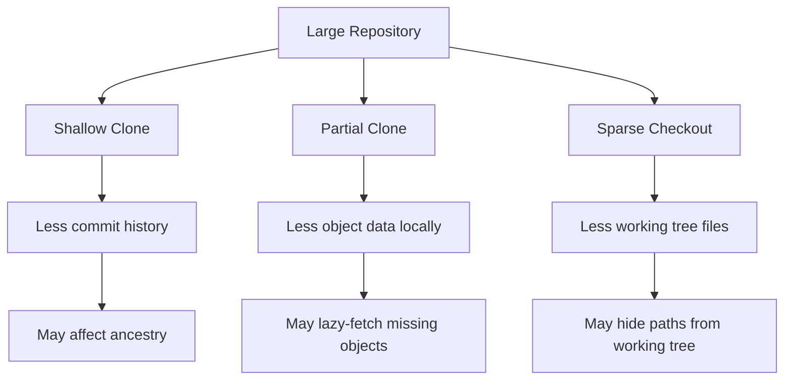
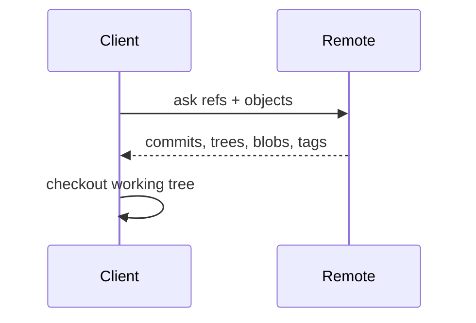
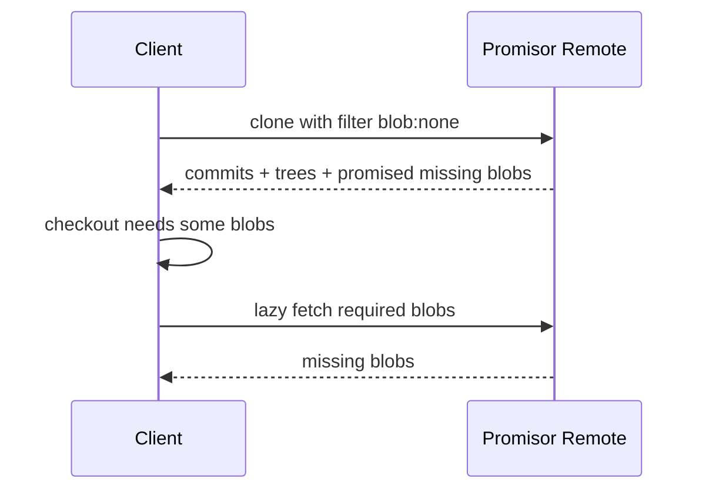
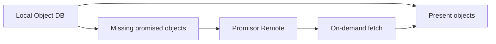
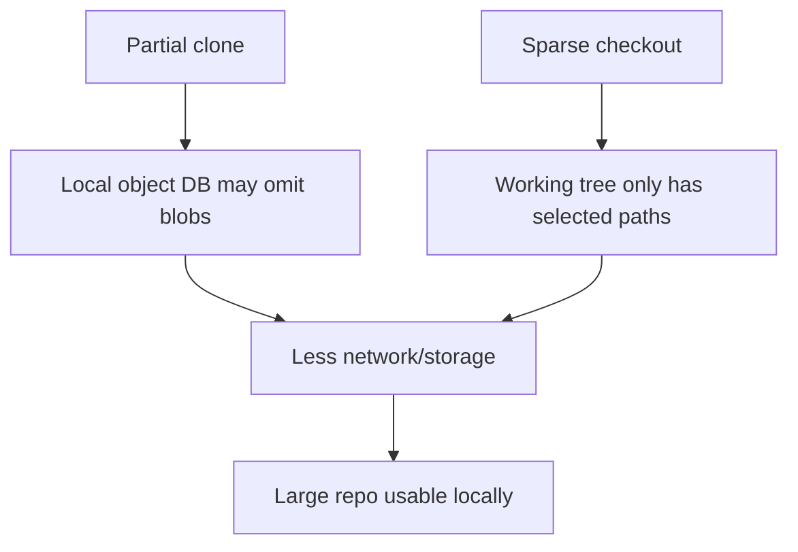
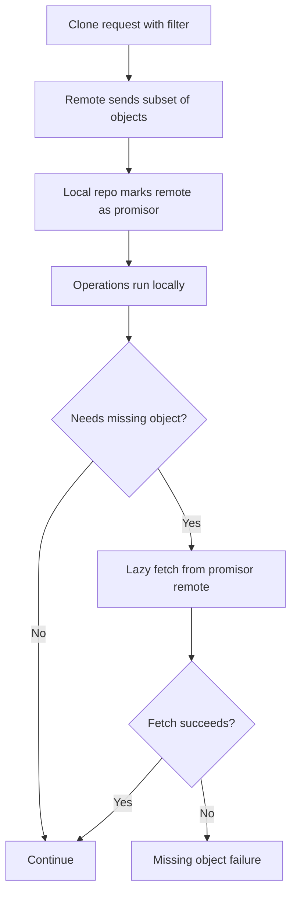

# Part 072 — Partial Clone and Promisor Remotes

Large repository performance punya dua sisi:

1. **How Git stores and maintains objects it already has.**
2. **How Git avoids downloading objects it does not need yet.**

Part 071 membahas sisi pertama: pack, MIDX, bitmap, repack.

Part ini membahas sisi kedua: **partial clone**.

Partial clone adalah teknik agar repository lokal tidak harus langsung memiliki semua object.

Target mental model:

> partial clone turns the local object database into a cache backed by a promisor remote. Git can operate with missing objects as long as the missing objects can be fetched on demand.

Ini powerful. Tapi ini juga mengubah failure mode.

Repository lokal tidak lagi selalu self-contained.

---

## 1. Full Clone vs Shallow Clone vs Partial Clone

Tiga istilah ini sering tercampur.

| Mode | Apa yang dikurangi | Apa risikonya |
|---|---|---|
| Full clone | Tidak ada; semua reachable history/object normal diambil | Besar dan lambat untuk repo besar |
| Shallow clone | Kedalaman commit history | Merge-base, tags, changelog, bisect, ancestry bisa rusak/terbatas |
| Partial clone | Object tertentu, biasanya blob/tree besar | Missing object akan lazy-fetch; offline behavior berubah |

Shallow clone mengurangi **history depth**.

Partial clone mengurangi **object completeness**.

Sparse checkout mengurangi **working tree materialization**.

Ketiganya berbeda.



A high-performing monorepo setup may combine partial clone and sparse checkout, but you must know which layer is responsible for which behavior.

---

## 2. Full Clone Mental Model

In ordinary full clone:

```bash
git clone https://example.com/org/repo.git
```

Git obtains enough object data to operate locally for the fetched refs.

Simplified:



After full clone, most ordinary operations do not need network:

```bash
git log
git show HEAD~10:path/to/file
git diff v1.0..v2.0
git checkout old-branch
```

That self-contained property is useful. It is also expensive for huge repositories.

---

## 3. Partial Clone Mental Model

With partial clone:

```bash
git clone --filter=blob:none https://example.com/org/repo.git
```

Git may download commits and trees, but omit blobs until needed.

Simplified:



The remote has made a promise:

> objects omitted by the filter can be obtained later when needed.

Hence: **promisor remote**.

---

## 4. Promisor Remote: The Promise Boundary

A partial clone repository records that some objects may be missing locally but are promised by a remote.

Inspect config:

```bash
git config --get remote.origin.promisor
git config --get remote.origin.partialclonefilter
```

Typical output:

```text
true
blob:none
```

Inspect promisor pack markers:

```bash
find .git/objects/pack -name '*.promisor' -print
```

Conceptual model:



The invariant changes:

| Full clone invariant | Partial clone invariant |
|---|---|
| If object is reachable, local repo likely has it. | If object is reachable, local repo may have it or may fetch it. |
| Offline work mostly works for fetched history. | Offline work may fail when missing object is needed. |
| Missing object often suggests corruption. | Missing promised object can be normal until lazy fetch fails. |

This is the most important shift.

---

## 5. Common Filters

Partial clone uses object filters.

Common examples:

```bash
# Omit blobs until needed
git clone --filter=blob:none https://example.com/org/repo.git
```

```bash
# Omit blobs larger than threshold
git clone --filter=blob:limit=1m https://example.com/org/repo.git
```

```bash
# Treeless clone: omit trees too, fetch them as needed
git clone --filter=tree:0 https://example.com/org/repo.git
```

Practical meaning:

| Filter | Meaning | Typical use |
|---|---|---|
| `blob:none` | Do not download file contents until needed | Developer monorepo, blob-heavy repo |
| `blob:limit=N` | Download small blobs, omit large blobs | Repo with occasional large files |
| `tree:0` | Omit trees until needed | Specialized CI/cache use; more aggressive |
| `sparse:oid=<blob>` | Server-defined sparse object filter | Advanced/server-specific workflows |

Filter support depends on server and Git version. Always test against your actual hosting provider and CI runner image.

---

## 6. Blobless Clone

Blobless clone is the most common partial clone mode:

```bash
git clone --filter=blob:none https://example.com/org/repo.git
```

What you usually get:

- commits,
- trees,
- tags/refs depending on clone options,
- not all blob contents.

When Git needs file contents, it fetches missing blobs.

Operations likely to trigger blob fetch:

```bash
# Checkout materializes file contents
git checkout main

# Show file content from old commit
git show HEAD~100:path/to/file

# Diff needs blob contents
git diff HEAD~1 HEAD -- path/to/file

# Grep may need blobs
git grep 'pattern'
```

Operations less likely to need blobs:

```bash
git log --oneline --graph
git merge-base main feature
git branch --contains <commit>
git rev-list --count main
```

But do not overgeneralize. Options like `--stat`, path-limited history, textconv, diff drivers, and rename detection can cause blob/tree access.

---

## 7. Treeless Clone

Treeless clone is more aggressive:

```bash
git clone --filter=tree:0 https://example.com/org/repo.git
```

It can reduce initial transfer further, but many operations need trees.

Trees are the directory snapshots that map names to object IDs. Without trees, Git can know commit ancestry but may not know file layout until it fetches tree objects.

Useful mostly when:

- the environment is short-lived,
- it only needs a narrow checkout,
- network is available,
- remote is fast,
- lazy fetch cost is acceptable,
- tooling is known to avoid broad tree walks.

Risky when:

- tooling runs broad `git diff --stat`,
- build scripts inspect many paths,
- offline work matters,
- CI does repeated path queries,
- server latency is high,
- remote rate limits apply.

---

## 8. Partial Clone and Checkout

A clone with `--filter=blob:none` can still need blobs during checkout.

Example:

```bash
git clone --filter=blob:none https://example.com/org/repo.git
```

If Git checks out the default branch, it must materialize files in the working tree. That requires blobs for checked-out paths.

To avoid immediate full working tree materialization, combine with sparse checkout or no checkout.

```bash
git clone --filter=blob:none --no-checkout https://example.com/org/repo.git
cd repo
git sparse-checkout init --cone
git sparse-checkout set services/billing libs/common
git checkout main
```

Or:

```bash
git clone --filter=blob:none --sparse https://example.com/org/repo.git
cd repo
git sparse-checkout set services/billing libs/common
```

Conceptual stack:



Partial clone reduces object transfer. Sparse checkout reduces working tree size.

Use both when repository size and path count are both problematic.

---

## 9. Partial Clone and Sparse Checkout Are Not Substitutes

A common mistake:

> “We enabled sparse checkout, so clone should be small.”

Not necessarily.

Sparse checkout alone can still download many or all objects depending on clone/fetch behavior.

Another mistake:

> “We enabled partial clone, so working tree should be small.”

Not necessarily.

If checkout materializes the whole branch, Git may fetch all blobs for the checked-out tree.

Decision table:

| Problem | Tool |
|---|---|
| Clone downloads too much blob content | Partial clone |
| Working tree has too many files | Sparse checkout |
| History depth too large for disposable CI | Shallow clone, carefully |
| Git status slow due path count | Sparse checkout / sparse index |
| Network fetch too heavy | Partial clone / fetch optimization |
| Build needs only subproject | Partial clone + sparse checkout |
| Release build needs full provenance | Avoid over-filtering unless tested |

---

## 10. Lazy Fetch Failure Modes

Partial clone introduces a new class of failures: operations can fail because missing objects cannot be fetched.

Causes:

- offline developer laptop,
- VPN unavailable,
- remote outage,
- permissions changed,
- remote garbage-collected promised object incorrectly,
- mirror missing object,
- CI network egress blocked,
- credential expired,
- object filter unsupported by secondary remote,
- submodule remote not configured,
- tool assumes object is local.

Example symptom:

```text
fatal: could not fetch <object-id> from promisor remote
```

or:

```text
fatal: missing blob object '<oid>'
```

First response:

```bash
git fsck --connectivity-only

git config --get-regexp 'remote\..*\.(promisor|partialclonefilter)'

git fetch --filter=blob:none origin
```

If a specific object is missing and should be promised, try fetching the relevant commit/ref again.

```bash
git fetch origin main
```

If the server truly no longer has the promised object, this is not a local cleanup issue. It is a repository hosting/integrity incident.

---

## 11. Partial Clone and Offline Work

Full clone is attractive because you can do a lot offline.

Partial clone weakens that guarantee.

Before going offline, prefetch what you need.

Examples:

```bash
# Ensure current sparse checkout files are materialized
git checkout main
```

```bash
# Fetch blobs needed by a diff range indirectly by running the operation while online
git diff main...feature -- services/billing >/tmp/preflight.diff
```

```bash
# Show file versions you expect to inspect while online
git show v1.2.0:services/billing/config.yml >/dev/null
```

This looks silly, but the principle matters:

> with partial clone, “having the commit” is not the same as “having every object reachable from the commit”.

For travel/offline work, either avoid partial clone, widen sparse checkout, or intentionally hydrate needed objects.

---

## 12. CI Patterns

Partial clone can reduce CI cold-start cost, but only if aligned with the build.

### Good Fit

- build/test only touches known subdirectories,
- sparse checkout is configured,
- network to remote is reliable,
- cache is warm,
- no broad diff/grep/history analysis,
- version calculation does not require full history/tags beyond fetched set.

Example:

```bash
git clone --filter=blob:none --sparse https://example.com/org/repo.git repo
cd repo
git sparse-checkout set services/billing libs/common
git checkout "$GIT_COMMIT"
./gradlew :services:billing:test
```

### Bad Fit

- release notes require full tag graph,
- license scanning reads all files,
- security scanning reads entire repository,
- build tool scans root recursively,
- test discovery walks all packages,
- codegen reads schemas from many directories,
- offline/restricted network runner,
- remote rate limit is tight.

Partial clone can make CI faster, or it can move cost from clone time into thousands of lazy fetches during build.

Measure both.

---

## 13. Avoid Lazy-Fetch Storms

A lazy-fetch storm happens when tooling requests many missing objects one by one or in inefficient batches.

Symptoms:

- clone is fast, build is slow,
- many small network requests,
- logs show repeated object fetch,
- remote Git server load spikes,
- CI variance increases.

Typical causes:

- broad `git grep`,
- broad `git diff --stat`,
- build tool scans all files,
- formatter/linter walks whole repository,
- license/security scanner reads all blobs,
- generated docs tool reads history.

Mitigations:

| Cause | Mitigation |
|---|---|
| Build scans all paths | Sparse checkout to actual build closure |
| Tool needs all blobs | Do not use blobless clone for that job |
| Many lazy fetches | Prefetch expected range or use larger filter |
| Large blobs rarely needed | `blob:limit=N` filter |
| CI repeated same clone | Use repository cache with maintenance |
| Release scan | Use full clone or dedicated hydrated cache |

The goal is not “always partial clone”.

The goal is “download less without creating worse latency later”.

---

## 14. Partial Clone and Git LFS

Git LFS and partial clone solve related but different problems.

| Tool | What it does |
|---|---|
| Git LFS | Replaces large file contents in Git with pointer files and stores content separately. |
| Partial clone | Omits selected Git objects locally and fetches from promisor remote on demand. |

They can be combined, but beware:

- Git blob may be only the LFS pointer, not large content,
- LFS content requires LFS server access,
- checkout may trigger LFS smudge/download,
- CI may need `GIT_LFS_SKIP_SMUDGE` or explicit `git lfs pull`,
- partial clone does not fix broken LFS retention,
- LFS does not remove old large blobs already committed to Git history.

If a repo has historic binary bloat, partial clone may reduce local pain, but the canonical repository still carries historical cost unless history is rewritten or objects age out according to hosting policy.

---

## 15. Security and Compliance Considerations

Partial clone does **not** mean omitted objects are inaccessible.

If a user can fetch missing objects from the promisor remote, access control must still be enforced at the repository/ref/object serving layer.

Important implications:

1. Do not assume omitted blob means hidden blob.
2. Do not use partial clone as data redaction.
3. Secret leaks must still be rotated.
4. History rewrite still has blast radius.
5. Auditors may require evidence that release source was fully reconstructable.
6. Build provenance should state clone filter and fetched commit.
7. Regulated release builds may need hydrated source snapshots or archived source bundles.

For regulated systems, record:

```text
repository URL
commit SHA
tag name and tag object SHA if applicable
clone filter
sparse checkout spec
Git version
CI runner image
artifact digest
build timestamp
```

Partial clone is an optimization, not an audit substitute.

---

## 16. Developer Workflow Recommendations

For large monorepo developer workstation:

```bash
git clone --filter=blob:none --sparse https://example.com/org/monorepo.git
cd monorepo
git sparse-checkout set services/cases libs/workflow libs/auth
```

Recommended config/checks:

```bash
git config --get remote.origin.promisor
git config --get remote.origin.partialclonefilter
git sparse-checkout list
git status --short --branch
```

Teach developers these concepts:

- why first access to a file may fetch,
- why offline work differs,
- why broad tools may be slow,
- how to expand sparse paths,
- how to hydrate needed area before travel,
- how to report missing promised object errors,
- when to use full clone for archaeology/release/debugging.

Avoid hiding all of this behind magic scripts without explanation. When Git fetches missing objects during an urgent hotfix, the engineer should know what is happening.

---

## 17. Command Reference

Clone blobless:

```bash
git clone --filter=blob:none https://example.com/org/repo.git
```

Clone blobless and sparse:

```bash
git clone --filter=blob:none --sparse https://example.com/org/repo.git
```

Clone without checkout, then configure sparse paths:

```bash
git clone --filter=blob:none --no-checkout https://example.com/org/repo.git
cd repo
git sparse-checkout init --cone
git sparse-checkout set path/one path/two
git checkout main
```

Limit large blobs:

```bash
git clone --filter=blob:limit=1m https://example.com/org/repo.git
```

Treeless clone:

```bash
git clone --filter=tree:0 https://example.com/org/repo.git
```

Inspect partial clone config:

```bash
git config --get-regexp 'remote\..*\.(promisor|partialclonefilter)'
```

Find promisor pack markers:

```bash
find .git/objects/pack -name '*.promisor' -print
```

Fetch with filter:

```bash
git fetch --filter=blob:none origin main
```

Check object presence:

```bash
git cat-file -t <object-id>
```

Connectivity check:

```bash
git fsck --connectivity-only
```

Full integrity check may behave differently in partial clone context because promised missing objects can be expected. Interpret results carefully.

---

## 18. Failure Mode Playbook

### Scenario A — Build Fails in CI with Missing Blob

Likely causes:

- lazy fetch blocked,
- credentials missing,
- remote unavailable,
- clone filter incompatible with build step,
- sparse checkout excludes needed file,
- tool expects full repository.

Response:

```bash
git config --get-regexp 'remote\..*\.(promisor|partialclonefilter)'
git sparse-checkout list || true
git status --short --branch
git fetch origin "$GIT_COMMIT"
```

Then decide:

- widen sparse checkout,
- use full clone for that job,
- prefetch needed paths/ranges,
- fix credentials/network,
- pin runner Git version.

---

### Scenario B — Developer Cannot Work Offline

Likely cause:

- partial clone omitted needed blobs/trees,
- files were never materialized,
- developer switched to old branch while offline.

Response while online:

```bash
git checkout target-branch
git diff main...target-branch >/tmp/hydrate.diff
```

For broad offline archaeology, use full clone instead.

---

### Scenario C — Lazy Fetch Storm

Symptoms:

- many network requests,
- build slower than full clone,
- server load spike.

Response:

- profile which command triggers fetch,
- restrict sparse checkout,
- use `blob:limit=N` instead of `blob:none`,
- hydrate workspace before expensive tool,
- use full clone for scan jobs,
- cache repository between jobs.

---

### Scenario D — Promisor Remote Missing Object

This is serious.

If the remote promised an object but cannot provide it, potential causes include:

- repository corruption,
- broken mirror,
- incorrect garbage collection,
- object storage backend issue,
- permission/ref visibility bug,
- migration error.

Response:

1. Stop treating it as local developer problem.
2. Capture object ID and operation.
3. Check another clone/server replica.
4. Verify canonical repository object existence.
5. Inspect recent maintenance/migration/GC logs.
6. Restore object from backup or replica if needed.
7. Run server-side integrity checks.

---

## 19. Decision Framework

Use partial clone when:

- repository is large mainly because of blobs,
- many users need only part of the tree,
- network to remote is reliable,
- tooling behavior is understood,
- lazy fetch cost is acceptable,
- you can combine with sparse checkout,
- CI jobs are scoped.

Avoid or be careful when:

- offline work is common,
- release/audit build needs complete source snapshot,
- scanner reads entire repo,
- remote access is unreliable,
- tooling assumes local object completeness,
- server does not fully support filters,
- clone is shallow and partial and sparse and nobody understands which issue comes from which layer.

Rule:

> The more you optimize clone input, the more explicit you must be about build/review/release data requirements.

---

## 20. Lab — Compare Full, Blobless, and Sparse Partial Clone

Use a disposable repository or a large test repo.

### Full clone

```bash
time git clone https://example.com/org/repo.git repo-full
cd repo-full
git count-objects -vH
cd ..
```

### Blobless clone

```bash
time git clone --filter=blob:none https://example.com/org/repo.git repo-blobless
cd repo-blobless
git count-objects -vH
git config --get-regexp 'remote\..*\.(promisor|partialclonefilter)'
cd ..
```

### Blobless sparse clone

```bash
time git clone --filter=blob:none --sparse https://example.com/org/repo.git repo-sparse
cd repo-sparse
git sparse-checkout set services/billing libs/common
git count-objects -vH
cd ..
```

### Observe lazy fetch

Inside blobless clone:

```bash
cd repo-blobless
git count-objects -vH
git show HEAD:path/to/some/file >/dev/null
git count-objects -vH
```

Questions:

1. Which clone transferred least data initially?
2. Which command triggered additional object download?
3. Did sparse checkout reduce object database size or only working tree size?
4. Which mode is best for release build?
5. Which mode is best for focused feature work?

---

## 21. Common Anti-Patterns

### Anti-Pattern 1 — Partial Clone as Security Boundary

Wrong:

```text
We filtered blobs, so users cannot access them.
```

Correct:

```text
Partial clone is a performance optimization. Access control remains a server responsibility.
```

---

### Anti-Pattern 2 — Combining Every Optimization Blindly

```bash
git clone --depth=1 --filter=blob:none --sparse ...
```

This may be fine for a narrow disposable job.

It may be terrible for:

- release notes,
- merge-base calculation,
- bisect,
- backport analysis,
- tag-based versioning,
- compliance evidence.

---

### Anti-Pattern 3 — Optimizing Clone but Ignoring Build Tool Behavior

If the build tool scans everything, partial clone may just move cost later.

Fix the build closure first.

---

### Anti-Pattern 4 — No Fallback Path

Teams adopt partial clone but do not document:

- how to hydrate needed data,
- when to use full clone,
- how to diagnose missing object,
- which CI jobs require full source,
- which Git versions are supported.

Optimization without operational playbook becomes fragility.

---

## 22. Mental Model Summary



Key insight:

> Partial clone makes Git object completeness lazy. That improves initial performance but introduces runtime dependency on promisor remote availability and tooling behavior.

Use partial clone deliberately:

- know what is omitted,
- know when it will be fetched,
- know which jobs require full data,
- know how to diagnose failure,
- know how it interacts with sparse checkout, shallow clone, LFS, and CI.

---

## References

- Git documentation: `partial-clone`
- Git documentation: `git clone --filter`
- Git documentation: `git fetch --filter`
- Git documentation: `rev-list` object filters
- Git documentation: `git sparse-checkout`
- Git documentation: `git fsck`
