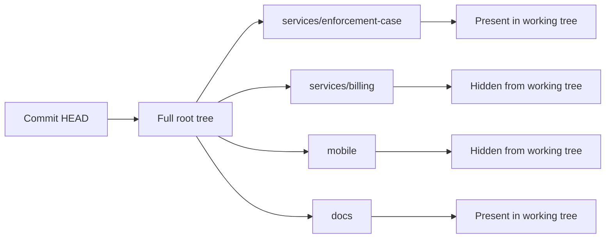
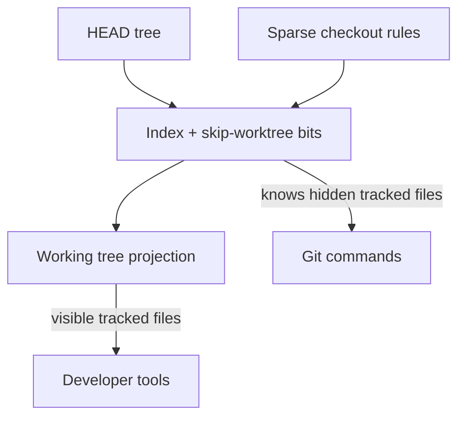
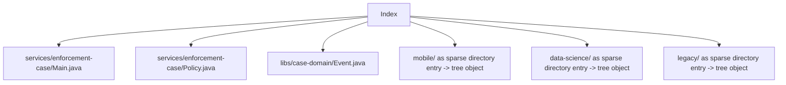
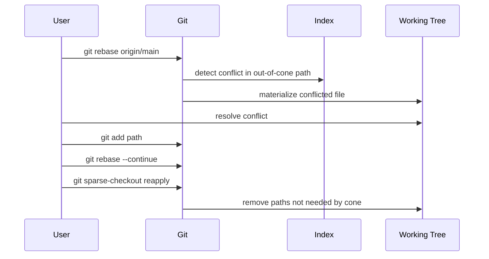

# Part 073 — Sparse Checkout and Sparse Index

Part 072 membahas **partial clone**: mengurangi object yang diunduh.

Part ini membahas **sparse checkout**: mengurangi file tracked yang hadir di working tree.

Keduanya sering dipakai bersama, tetapi jangan disamakan.

```text
partial clone    => object database boleh tidak lengkap
sparse checkout  => working tree hanya memunculkan subset path
sparse index     => index tidak perlu menyimpan seluruh path sebagai entry file individual
```

Target mental model:

> Sparse checkout is a projection of the repository tree into a smaller working tree. Sparse index is the performance optimization that stops the index from pretending the entire repository is expanded file-by-file.

Kalau partial clone menjawab:

> “Apakah laptop saya harus punya semua blob sekarang?”

Sparse checkout menjawab:

> “Apakah working directory saya harus berisi semua file sekarang?”

Sparse index menjawab:

> “Apakah index saya harus mencatat jutaan file satu per satu kalau saya hanya bekerja di 20 ribu file?”

---

## 1. Problem yang Diselesaikan

Dalam repository kecil, full checkout normal terasa natural.

```text
repo/
  service-a/
  service-b/
  service-c/
  docs/
  scripts/
```

Semua file hadir di disk. `git status` cepat. IDE tidak berat. Search tidak melebar. Build tools tidak scan terlalu banyak file.

Di monorepo besar, asumsi ini rusak.

```text
HEAD contains:      3,000,000 tracked paths
You need today:        35,000 tracked paths
You modified:             120 paths
```

Kalau semua file selalu hadir:

- checkout besar;
- filesystem traversal mahal;
- IDE indexing lambat;
- `git status` membaca index besar;
- build tool salah menganggap seluruh repo sebagai project aktif;
- developer bekerja di noise yang tidak relevan.

Sparse checkout membuat working tree sesuai **working set**.

```text
I work on enforcement-case-service.
I need:
  services/enforcement-case/
  libs/domain-events/
  proto/enforcement/
  build/

I do not need:
  mobile/
  data-science/
  customer-specific-legacy/
  archived-services/
```

Ini bukan security boundary. Ini ergonomics dan performance boundary.

---

## 2. The Core Invariant

Sparse checkout tidak mengubah commit.

Commit tetap menunjuk ke tree lengkap.



Sparse checkout hanya memengaruhi file tracked mana yang hadir di working directory.

Implikasinya:

- `git log` tetap melihat history repository;
- `git show HEAD:path` tetap bisa melihat object jika object tersedia;
- `git diff` tetap membandingkan tree/index/working tree sesuai scope;
- branch switch tetap operasi terhadap commit penuh, tetapi working tree diproyeksikan;
- missing file di luar cone **bukan deletion**;
- commit yang dibuat dari sparse checkout tetap commit normal.

Kalimat penting:

> Absence from a sparse working tree is not the same as deletion from the next commit.

Git memakai bit `skip-worktree` di index untuk mengerti bahwa path tertentu boleh tidak hadir di working tree.

---

## 3. Working Tree Projection Model

Bayangkan commit tree sebagai source of truth.

Sparse checkout adalah projection rule.



Ada empat layer:

| Layer | Fungsi |
|---|---|
| `HEAD` tree | Snapshot lengkap commit saat ini. |
| sparse-checkout definition | Path/directory apa yang diinginkan di working tree. |
| index | Menyimpan tracked entries dan skip-worktree state. |
| working tree | File nyata yang hadir di filesystem. |

Git bisa tahu bahwa path tertentu tracked walaupun file tidak hadir di disk.

---

## 4. Vocabulary yang Harus Presisi

| Istilah | Makna |
|---|---|
| sparse checkout | Mode working tree yang hanya memunculkan subset tracked files. |
| sparse-checkout file | File rule internal, umumnya di `.git/info/sparse-checkout` atau worktree-specific config. |
| cone mode | Mode sparse checkout berbasis directory, default modern, jauh lebih scalable. |
| non-cone mode | Mode pattern/gitignore-style yang lebih fleksibel tetapi lebih mahal dan lebih rawan. |
| sparse index | Index yang bisa meringkas directory out-of-cone sebagai sparse directory entry. |
| sparse directory entry | Entry index yang mewakili seluruh directory tree, bukan file individual. |
| skip-worktree bit | Bit index yang memberi tahu Git agar tidak memperlakukan absennya file sebagai perubahan. |
| in-cone path | Path yang masuk definisi sparse checkout. |
| out-of-cone path | Path tracked yang tidak dimunculkan di working tree. |
| materialized path | Path out-of-cone yang sementara hadir, misalnya karena conflict atau manual edit. |

---

## 5. Cone Mode: Default yang Harus Dipakai

Gunakan cone mode sebagai default.

```bash
# Clone dengan working tree sparse sejak awal
git clone --filter=blob:none --sparse git@example.com:org/monorepo.git
cd monorepo

# Pilih directory yang dibutuhkan
git sparse-checkout set services/enforcement-case libs/domain-events proto/enforcement build

# Lihat definisi aktif
git sparse-checkout list
```

Cone mode menerima daftar directory.

```bash
git sparse-checkout set services/enforcement-case
```

Git akan memasukkan:

- semua file di root/top-level;
- directory ancestors yang dibutuhkan;
- semua file di bawah `services/enforcement-case/`.

Ini menghindari pattern matching mahal atas jutaan path.

### Why cone mode exists

Non-cone mode memakai pattern seperti `.gitignore`.

Itu terlihat fleksibel:

```text
*.java
!legacy/**
/services/*/src/**
```

Tetapi di repository besar, fleksibilitas ini mahal:

- pattern matching lebih sulit dioptimalkan;
- behavior lebih sulit dipahami;
- directory projection tidak obvious;
- sparse index lebih sulit memanfaatkan ringkasan directory;
- developer sering salah mengira rule sebagai access control.

Untuk engineering organization, cone mode adalah baseline.

Gunakan non-cone hanya kalau punya alasan kuat dan tim memahami konsekuensinya.

---

## 6. Sparse Checkout Setup Patterns

### Pattern A — Fresh monorepo clone

```bash
git clone --filter=blob:none --sparse git@github.com:company/platform.git
cd platform

git sparse-checkout set \
  services/enforcement-case \
  services/regulatory-workflow \
  libs/case-domain \
  libs/audit-events \
  proto/regulatory \
  build
```

Keuntungan:

- object transfer awal lebih kecil karena `blob:none`;
- working tree kecil karena sparse checkout;
- lazy blob fetch terjadi ketika file dibutuhkan;
- developer tidak menunggu seluruh monorepo.

### Pattern B — Existing full clone menjadi sparse

```bash
cd platform

git sparse-checkout set services/enforcement-case libs/case-domain build
```

Pada Git modern, `set` akan mengaktifkan config sparse yang dibutuhkan jika belum aktif.

Cek:

```bash
git config --get core.sparseCheckout
git config --get core.sparseCheckoutCone
git config --get index.sparse
```

### Pattern C — Expand working set

```bash
git sparse-checkout add libs/authorization proto/identity
```

Gunakan `add` ketika ingin menambahkan directory tanpa mengganti semua rule.

### Pattern D — Replace working set

```bash
git sparse-checkout set services/billing libs/payment build
```

Gunakan `set` ketika pindah domain kerja.

### Pattern E — Return to full working tree

```bash
git sparse-checkout disable
```

Ini mengembalikan working tree penuh.

Jika repository partial clone, disable sparse checkout tidak otomatis berarti semua blob langsung sudah ada; blob bisa tetap lazy-fetched saat checkout membutuhkan content.

---

## 7. Sparse Checkout File

Untuk memahami debugging, lihat rule internal.

```bash
cat .git/info/sparse-checkout
```

Dalam cone mode, Git menulis pattern turunan dari directory yang dipilih.

Contoh intent:

```bash
git sparse-checkout set services/enforcement-case
```

Representasi rule bisa terlihat seperti:

```text
/*
!/*/
/services/
!/services/*/
/services/enforcement-case/
```

Jangan edit file ini secara manual untuk workflow normal.

Gunakan command:

```bash
git sparse-checkout list
git sparse-checkout set ...
git sparse-checkout add ...
git sparse-checkout reapply
git sparse-checkout disable
```

Manual edit boleh untuk diagnosis, bukan operational baseline.

---

## 8. Skip-Worktree Bit

Sparse checkout bergantung pada `skip-worktree`.

Lihat index flags:

```bash
git ls-files -v | head
```

Pada output `git ls-files -v`, file dengan flag tertentu menunjukkan state index seperti assume-unchanged atau skip-worktree. Detail output bisa bervariasi, tetapi untuk debugging sparse checkout, command ini membantu melihat apakah path dianggap sparse/hidden.

Mental model:

```text
tracked file in HEAD
tracked entry in index
file absent from working tree
skip-worktree=true

=> Git does not treat absence as deletion.
```

Tanpa skip-worktree, file tracked yang hilang akan terlihat sebagai deletion.

Dengan skip-worktree, absennya file adalah expected projection.

### Jangan campur dengan assume-unchanged

`assume-unchanged` adalah hint performa lokal agar Git tidak mengecek perubahan pada file tertentu.

`skip-worktree` adalah mekanisme sparse checkout.

| Bit | Tujuan |
|---|---|
| assume-unchanged | “Saya tidak expect file ini berubah; jangan stat terus.” |
| skip-worktree | “File ini boleh tidak ada di working tree karena sparse projection.” |

Kesalahan umum:

```bash
git update-index --assume-unchanged config/local.yml
```

Lalu developer lupa, perubahan tidak terlihat, debugging jadi kacau.

Untuk sparse checkout, jangan desain workflow berbasis manual `update-index` kecuali sedang eksperimen internals.

---

## 9. Sparse Index: Why It Matters

Sparse checkout tanpa sparse index masih bisa memiliki index besar.

```text
HEAD paths:       3,000,000
working tree:        35,000
index entries:    3,000,000  # without sparse index
```

Kenapa?

Karena index tradisional mencatat path file tracked di `HEAD`, termasuk yang out-of-cone, walaupun diberi skip-worktree.

Sparse index mengubah itu.

```text
HEAD paths:       3,000,000
working tree:        35,000
index entries:       40,000-ish + sparse directory summaries
```

Sparse index bisa meringkas directory out-of-cone sebagai entry yang menunjuk ke tree object.



Ini mengurangi biaya parsing dan rewrite index.

### Performance dimension

Sparse-index documentation membedakan tiga dimensi:

```text
HEAD       = jumlah path tracked di commit
Populated  = jumlah path yang masuk sparse checkout
Modified   = jumlah path yang berubah lokal
```

Goal sparse index:

```text
many common commands move from O(HEAD) toward O(Populated)
```

Artinya `git status` dan `git add` tidak perlu terus membayar biaya jutaan path ketika working set jauh lebih kecil.

---

## 10. Enable Sparse Index

Git modern bisa mengaktifkan sparse index via sparse-checkout command.

```bash
git sparse-checkout set --sparse-index services/enforcement-case libs/case-domain
```

Atau config:

```bash
git config index.sparse true
git sparse-checkout reapply
```

Cek:

```bash
git config --get index.sparse
```

Untuk disable:

```bash
git sparse-checkout set --no-sparse-index services/enforcement-case libs/case-domain
# atau
git config index.sparse false
git sparse-checkout reapply
```

Dalam tim besar, jangan aktifkan sparse index diam-diam tanpa testing toolchain.

Beberapa tool yang membaca index secara langsung mungkin belum sparse-index aware.

---

## 11. Sparse Checkout vs Partial Clone

Ini perbandingan wajib.

| Pertanyaan | Sparse checkout | Partial clone |
|---|---:|---:|
| Mengurangi file yang hadir di working tree? | Ya | Tidak langsung |
| Mengurangi object yang diunduh? | Tidak selalu | Ya |
| Bisa dipakai tanpa server support khusus? | Umumnya ya | Butuh remote/protocol support untuk filter/promisor efektif |
| Memengaruhi index? | Ya | Tidak langsung |
| Bisa menyebabkan lazy object fetch? | Tidak sendiri | Ya |
| Cocok untuk monorepo? | Ya | Ya |
| Security boundary? | Tidak | Tidak |

Gabungan umum:

```bash
git clone --filter=blob:none --sparse git@github.com:company/platform.git
cd platform
git sparse-checkout set services/enforcement-case libs/case-domain
```

Mental model gabungan:


Dengan setup ini:

- working tree kecil;
- index kecil;
- blob yang tidak dibutuhkan tidak langsung diunduh;
- Git masih melihat repository sebagai satu history.

---

## 12. What Sparse Checkout Is Not

### Not access control

Developer tetap bisa melakukan:

```bash
git show HEAD:secret-looking/path.txt
```

Jika object tersedia atau dapat di-fetch, path bisa dibaca.

Jangan gunakan sparse checkout untuk membatasi akses sensitive code.

Gunakan repository boundary, access control hosting, encryption, atau service decomposition.

### Not dependency management

Sparse checkout tidak menyelesaikan dependency coupling.

Kalau `services/a` compile membutuhkan `libs/x`, `libs/y`, dan generated proto, sparse checkout hanya membuat kamu memilih path tersebut.

Dependency graph tetap perlu dimodelkan.

### Not build isolation

Build tool bisa tetap scan parent directory, detect workspace root, atau memerlukan file di luar cone.

Sparse checkout harus diselaraskan dengan build system.

### Not history trimming

History tetap history repository.

Kalau repository punya blob besar 5 GB di masa lalu, sparse checkout saja tidak menghapus cost history. Untuk object transfer, pakai partial clone. Untuk menghapus bloat, butuh history rewrite/migration.

---

## 13. Daily Workflow

### Start work in one domain

```bash
git switch main
git pull --ff-only

git sparse-checkout set \
  services/enforcement-case \
  libs/case-domain \
  proto/regulatory \
  build

git switch -c feature/case-escalation-sla
```

### Add another dependency

```bash
git sparse-checkout add libs/authorization
```

### Make changes normally

```bash
git status
git add services/enforcement-case libs/authorization
git commit -m "Add SLA-aware escalation policy"
```

### If merge/rebase materializes extra paths

```bash
git rebase origin/main
# resolve conflicts

git add conflicted/path

git sparse-checkout reapply
```

`reapply` tells Git to restore the projection after special operations materialized files.

---

## 14. `git add` and Out-of-Cone Paths

Sparse checkout changes expectations around `git add`.

Normally, Git refuses to update paths outside the sparse-checkout cone because that can create confusing states.

Example:

```bash
# You are sparse to services/enforcement-case only
vim services/billing/BillingPolicy.java

git add services/billing/BillingPolicy.java
```

This can fail or warn because the path is out-of-cone.

Correct options:

### Option A — Expand cone intentionally

```bash
git sparse-checkout add services/billing
git add services/billing/BillingPolicy.java
```

### Option B — Use explicit sparse override only when intentional

```bash
git add --sparse services/billing/BillingPolicy.java
```

Use `--sparse` sparingly. It is a sharp tool.

If a path matters enough to edit, it usually belongs in your cone for that task.

---

## 15. Branch Switching in Sparse Checkout

When switching branches, Git updates the working tree according to sparse rules.

```bash
git switch feature/a
```

Potential outcomes:

| Condition | Result |
|---|---|
| File in-cone changed between branches | Working tree updates normally. |
| File out-of-cone changed between branches | Usually not materialized. |
| Conflict touches out-of-cone path | Git may materialize file to let you resolve conflict. |
| Local modification out-of-cone exists | Git may refuse to remove/reapply sparse rules. |

After merges/rebases/conflicts:

```bash
git sparse-checkout reapply
```

If files still remain, inspect:

```bash
git status --short
git sparse-checkout check-rules --stdin < path-list.txt
```

If your Git version supports `check-rules`, it can help verify whether paths match the sparse definition.

---

## 16. Conflict Behavior

Sparse checkout does not make conflicts disappear.

If two branches modify a file outside your cone but Git needs you to resolve it, Git can materialize the path.



Do not blindly delete materialized conflict files.

Resolve them as real conflicts.

Then reapply sparsity.

---

## 17. Sparse Checkout and Generated Files

Generated files can break sparse workflows.

Example:

```text
proto/regulatory/*.proto      in cone
services/enforcement-case     in cone
generated/java/regulatory     out of cone
```

Build expects generated output under `generated/java/regulatory`, but sparse checkout hides it.

Possible designs:

| Design | Trade-off |
|---|---|
| Include generated output path in cone | Simple, but increases working tree size. |
| Generate into build output outside repository | Cleaner if generated files should not be tracked. |
| Generate on demand in local build | Good if deterministic and fast. |
| Stop tracking generated files | Often correct, but requires build pipeline maturity. |

Sparse checkout exposes bad generated-file boundaries. It does not solve them.

---

## 18. Sparse Checkout and CI

CI sparse checkout is tempting.

Use it when job scope is truly path-bounded.

Good candidates:

- lint only `docs/`;
- test only one service with explicit dependency closure;
- generate API docs for one package;
- run frontend build for one app.

Bad candidates:

- release build needing full changelog;
- security scan expected to inspect whole repo;
- license scan across all dependencies;
- monorepo graph calculation that needs full tree;
- ownership validation across all `CODEOWNERS` paths.

Example CI checkout:

```bash
git clone --filter=blob:none --sparse "$REPO_URL" repo
cd repo
git fetch origin "$GITHUB_SHA"
git checkout "$GITHUB_SHA"

git sparse-checkout set \
  services/enforcement-case \
  libs/case-domain \
  proto/regulatory \
  build

./gradlew :services:enforcement-case:test
```

Critical invariant:

> CI sparse cone must be derived from build dependency graph, not from developer intuition.

If a dependency is missing, the job may fail noisily. Worse, it may pass incorrectly because a tool silently skipped missing inputs.

---

## 19. Monorepo Working Set Design

A scalable monorepo should publish canonical sparse profiles.

Example:

```text
.sparse-profiles/
  enforcement-case.txt
  billing.txt
  platform-core.txt
  frontend-admin.txt
  regulatory-reporting.txt
```

Profile file:

```text
services/enforcement-case
libs/case-domain
libs/audit-events
proto/regulatory
build
```

Apply:

```bash
git sparse-checkout set --stdin < .sparse-profiles/enforcement-case.txt
```

This prevents every engineer from reinventing working sets.

### Profile governance

Each profile should define:

- owning team;
- service/package it supports;
- required build/test commands;
- expected max working tree path count;
- known exclusions;
- update rule when dependency changes.

Example metadata:

```yaml
name: enforcement-case
owner: team-regulatory-platform
purpose: Local development for enforcement case lifecycle service
paths:
  - services/enforcement-case
  - libs/case-domain
  - libs/audit-events
  - proto/regulatory
  - build
commands:
  test: ./gradlew :services:enforcement-case:test
  lint: ./gradlew :services:enforcement-case:check
maxTrackedPathsApprox: 75000
```

---

## 20. IDE Behavior

Sparse checkout often improves IDE performance, but introduces assumptions.

Potential issues:

- IDE indexes only visible files;
- language server cannot resolve hidden source roots;
- generated sources missing;
- project root detection fails;
- refactor tools cannot update hidden references;
- search results become partial.

Make IDE scope explicit.

Example for Java/Kotlin monorepo:

```text
Visible:
  services/enforcement-case
  libs/case-domain
  libs/audit-events
  proto/regulatory
  build.gradle.kts
  settings.gradle.kts

Hidden:
  unrelated services
  mobile apps
  data pipelines
```

If cross-repo refactoring requires global awareness, disable sparse checkout or use a dedicated full checkout machine.

---

## 21. Sparse Checkout and Refactoring

Sparse checkout is excellent for localized work.

It is dangerous for global refactoring.

Example risky task:

> Rename `CaseStatus.ESCALATED` to `CaseStatus.PENDING_ESCALATION` across the entire monorepo.

If your sparse cone excludes some consumers, local grep and IDE refactor will miss them.

Options:

1. Use full checkout.
2. Use repository-wide search service.
3. Use server-side code search plus CI full validation.
4. Expand sparse cone to all affected domains.
5. Use build graph to enumerate reverse dependencies.

Rule:

> Sparse checkout is a working set optimization, not a global-impact analysis tool.

---

## 22. Diagnosing Sparse Checkout State

Use this script-style checklist.

```bash
printf "== branch ==\n"
git branch --show-current

printf "\n== sparse config ==\n"
git config --get core.sparseCheckout || true
git config --get core.sparseCheckoutCone || true
git config --get index.sparse || true

printf "\n== sparse list ==\n"
git sparse-checkout list || true

printf "\n== status ==\n"
git status --short --branch

printf "\n== sparse file ==\n"
if test -f .git/info/sparse-checkout; then
  sed -n '1,120p' .git/info/sparse-checkout
fi

printf "\n== out-of-cone materialized files suspicion ==\n"
git ls-files -t | sed -n '1,80p'
```

For large repos, avoid dumping all `git ls-files` unless needed.

---

## 23. Common Failure Modes

### Failure 1 — “I deleted thousands of files”

Symptom:

```bash
git status --short
 D mobile/app/...
 D services/billing/...
```

Likely cause:

- manual deletion in full checkout;
- sparse checkout not enabled correctly;
- skip-worktree bits not applied;
- tooling removed files but index did not mark them sparse.

Diagnosis:

```bash
git config --get core.sparseCheckout
git sparse-checkout list
git ls-files -v mobile/app | head
```

Recovery:

```bash
git restore mobile/app services/billing
# or if sparse definition is intended:
git sparse-checkout reapply
```

Do not commit until you understand whether these are real deletions or projection absence.

### Failure 2 — Build fails because dependency hidden

Symptom:

```text
error: module libs/audit-events not found
```

Fix:

```bash
git sparse-checkout add libs/audit-events
```

Long-term fix:

- update sparse profile;
- update build graph metadata;
- document dependency closure.

### Failure 3 — Tool expands sparse index

Symptom:

- `git status` becomes slow again;
- `.git/index` grows unexpectedly;
- Git emits advice about sparse index expansion.

Possible causes:

- old Git version;
- third-party tooling touches index in non-sparse-aware ways;
- command requires full index;
- files outside cone are present.

Mitigation:

```bash
git version
git config --get index.sparse
git sparse-checkout reapply
```

If a tool is incompatible:

```bash
git sparse-checkout set --no-sparse-index <paths...>
```

Sparse checkout can still be valuable even without sparse index.

### Failure 4 — Out-of-cone edits

Symptom:

A developer somehow modified files outside the sparse cone.

Possible causes:

- editor opened path through symlink or generated reference;
- build tool wrote into tracked directory;
- manual command used `git checkout HEAD -- path`;
- conflict materialized files.

Resolve by deciding whether the path should be part of the task.

```bash
# If yes
git sparse-checkout add path/to/domain

# If no
git restore path/to/file
git sparse-checkout reapply
```

### Failure 5 — Sparse checkout hides ownership impact

A PR changes a shared interface but sparse checkout hides downstream consumers.

Mitigation:

- CODEOWNERS on shared interface;
- CI reverse-dependency tests;
- code search;
- monorepo dependency graph;
- review template asking for cross-domain impact.

Sparse checkout should never be the only lens for impact analysis.

---

## 24. Sparse Checkout and Security/Compliance

For regulated systems, sparse checkout helps reduce day-to-day noise but creates evidence caveats.

Do not claim:

> “Reviewer only saw relevant files, therefore unrelated files cannot be impacted.”

Sparse checkout limits local working tree visibility.

It does not prove non-impact.

Better evidence:

- commit diff from server;
- CI full or dependency-closed validation;
- CODEOWNERS review for touched paths;
- generated release artifact tied to commit SHA;
- dependency impact report;
- policy check proving no forbidden paths changed.

Sparse checkout is developer ergonomics. Compliance evidence must come from repository-level and pipeline-level checks.

---

## 25. Decision Framework

Use sparse checkout when:

- repository has many tracked paths;
- developer work is domain-local;
- working set can be described as directories;
- build graph can identify dependency closure;
- IDE benefits from smaller project;
- CI jobs are path-bounded.

Avoid or disable sparse checkout when:

- doing global refactor;
- doing security/license scan;
- investigating repository-wide incident;
- editing build system root logic;
- toolchain is not sparse-aware;
- non-cone patterns are required but poorly understood.

Use sparse index when:

- HEAD path count is much larger than populated path count;
- common commands remain slow after sparse checkout;
- Git/tooling versions are modern enough;
- you have tested IDE/build hooks.

Disable sparse index when:

- third-party tooling breaks;
- index-level tooling assumes every entry is a file;
- debugging index corruption or odd state;
- team is on mixed old Git versions.

---

## 26. Operational Playbook: Monorepo Sparse Rollout

### Step 1 — Measure before changing

```bash
git ls-files | wc -l
git count-objects -vH
time git status
du -sh .git .
```

Capture baseline.

### Step 2 — Identify working profiles

Examples:

```text
enforcement-case
billing
frontend-admin
identity-platform
reporting
```

Each profile must map to build/test commands.

### Step 3 — Validate profile correctness

For each profile:

```bash
git sparse-checkout set --stdin < .sparse-profiles/enforcement-case.txt
./gradlew :services:enforcement-case:test
./gradlew :services:enforcement-case:check
```

### Step 4 — Test merge/rebase behavior

```bash
git fetch origin
git rebase origin/main
git sparse-checkout reapply
```

### Step 5 — Enable sparse index for pilot

```bash
git sparse-checkout set --sparse-index --stdin < .sparse-profiles/enforcement-case.txt
```

Measure:

```bash
time git status
time git add -A
du -h .git/index
```

### Step 6 — Document escape hatches

```bash
# Expand one dependency
git sparse-checkout add libs/new-dependency

# Return to full tree
git sparse-checkout disable

# Disable sparse index but keep sparse checkout
git sparse-checkout set --no-sparse-index --stdin < .sparse-profiles/enforcement-case.txt
```

### Step 7 — Integrate with onboarding

Onboarding script:

```bash
#!/usr/bin/env bash
set -euo pipefail

profile="${1:?usage: ./bootstrap-sparse.sh <profile>}"

git sparse-checkout set --sparse-index --stdin < ".sparse-profiles/${profile}.txt"
git sparse-checkout list
```

---

## 27. Advanced Lab: Observe Sparse Index Expansion

Create a sample repo with many files.

```bash
mkdir sparse-lab
cd sparse-lab
git init

mkdir -p services/a services/b services/c libs/x
for d in services/a services/b services/c libs/x; do
  for i in $(seq 1 200); do
    echo "$d file $i" > "$d/file-$i.txt"
  done
done

git add .
git commit -m "Create large-ish tree"
```

Enable sparse checkout.

```bash
git sparse-checkout set --sparse-index services/a
```

Inspect working tree.

```bash
find . -maxdepth 3 -type f | sed 's#^./##' | sort | head -50
```

Compare file visibility:

```bash
ls services
```

Inspect index size:

```bash
du -h .git/index
```

Try out-of-cone path:

```bash
git show HEAD:services/b/file-1.txt
```

The file can be read from object database even if not present in working tree.

Add cone:

```bash
git sparse-checkout add services/b
ls services/b | head
```

Reapply:

```bash
git sparse-checkout reapply
```

Disable:

```bash
git sparse-checkout disable
```

This lab should make the distinction visible:

```text
object exists
index knows path
working tree may hide path
```

---

## 28. Engineering Standards Template

Use this as a team standard.

```md
# Sparse Checkout Standard

## Goals
- Reduce local working tree size for monorepo development.
- Keep local Git operations responsive.
- Avoid accidental partial impact analysis.

## Defaults
- Use cone mode.
- Prefer sparse index for modern Git versions.
- Combine with blobless partial clone for large repositories.

## Approved Profiles
- enforcement-case
- billing
- identity-platform
- frontend-admin

## Rules
1. Sparse checkout is not access control.
2. Global refactors require full checkout or repository-wide search validation.
3. CI sparse jobs must use dependency-closed path profiles.
4. Out-of-cone edits require either expanding the cone or discarding the edit.
5. If merge/rebase materializes paths, resolve first, then run `git sparse-checkout reapply`.

## Escape Hatches
- `git sparse-checkout add <dir>`
- `git sparse-checkout disable`
- `git sparse-checkout set --no-sparse-index <dirs>`
```

---

## 29. Summary

Sparse checkout is a projection.

Sparse index is an index compression strategy aligned with that projection.

The most important invariant:

```text
hidden from working tree != deleted from repository
```

The second invariant:

```text
sparse checkout reduces visible paths; partial clone reduces downloaded objects
```

The third invariant:

```text
sparse checkout improves local ergonomics, but it is not proof of global non-impact
```

Used well, sparse checkout makes huge repositories feel local and focused.

Used carelessly, it hides impact, breaks builds, and gives false confidence.

Treat sparse profiles as engineering contracts, not personal convenience snippets.

---

## References

- Git documentation: `git sparse-checkout` — https://git-scm.com/docs/git-sparse-checkout
- Git documentation: `sparse-index` — https://git-scm.com/docs/sparse-index
- Git documentation: `index-format` sparse directory entries — https://git-scm.com/docs/index-format
- Git documentation: `partial-clone` — https://git-scm.com/docs/partial-clone
- Git documentation: `git add` sparse behavior — https://git-scm.com/docs/git-add
