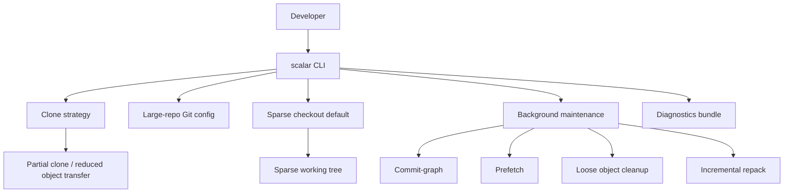
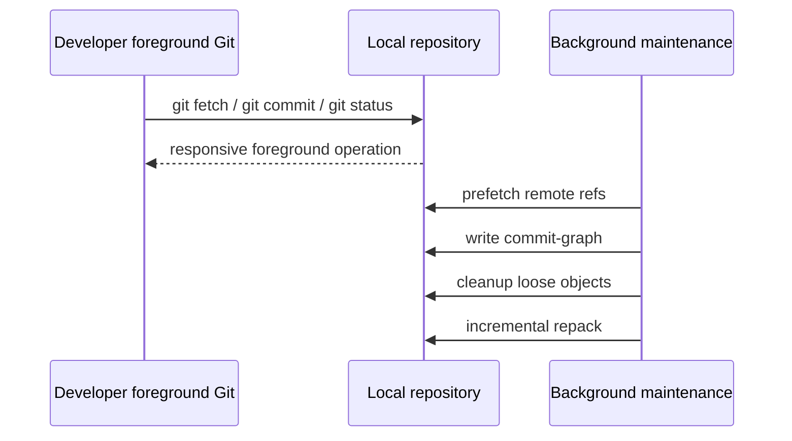

# Part 074 — Scalar for Large Repositories

Part 069–073 membahas komponen individual large-repo performance:

- large repository failure modes;
- maintenance, GC, repack;
- MIDX, bitmap, incremental repack;
- partial clone;
- sparse checkout dan sparse index.

Part ini membahas **Scalar**.

Scalar bukan Git baru.

Scalar bukan storage engine pengganti Git.

Scalar bukan monorepo platform lengkap.

Scalar adalah repository management tool yang mengorkestrasi beberapa optimasi Git untuk large repositories.

Target mental model:

> Scalar is an operational wrapper around Git’s large-repository features: clone shape, sparse checkout, partial object transfer, background maintenance, and recommended configuration.

Kalau kamu sudah paham part sebelumnya, Scalar akan terasa seperti packaging dan guardrail.

Itulah nilainya.

---

## 1. Why Scalar Exists

Large repository performance bukan satu toggle.

Kamu perlu banyak keputusan sekaligus:

```text
Should clone download all blobs?
Should working tree start full or sparse?
Should maintenance run in foreground or background?
Should commit-graph be refreshed?
Should loose objects be packed?
Should MIDX/incremental repack be used?
Should tags be fetched?
Should status calculate ahead/behind every time?
Should build outputs live inside tracked tree?
```

Engineer bisa menjalankan command manual:

```bash
git clone --filter=blob:none --sparse <url>
cd repo
git sparse-checkout set <paths>
git maintenance start
git config status.aheadBehind false
git config fetch.writeCommitGraph false
# ...more config
```

Tapi ini rapuh untuk organisasi besar.

Scalar memberi entrypoint yang lebih opinionated:

```bash
scalar clone <url> <enlistment>
```

Lalu Scalar mengatur bentuk clone, sparse checkout awal, maintenance, dan konfigurasi performa.

---

## 2. Scalar in One Diagram



Scalar coordinates existing Git mechanisms.

The repository remains a Git repository.

You still use:

```bash
git status
git switch
git fetch
git rebase
git sparse-checkout set ...
git commit
```

Scalar mostly handles setup and ongoing repository health.

---

## 3. The Enlistment Model

Scalar introduces the term **enlistment**.

An enlistment is the top-level directory for the project. In default Scalar clone layout, the Git worktree is placed inside `src/`.

Example:

```text
platform-enlistment/
  src/                  # Git worktree
  build-output/          # optional untracked build outputs
  logs/                  # optional local logs
  tools-cache/           # optional local cache
```

This layout encourages separation:

```text
tracked source code      -> inside src/
untracked build output   -> outside src/
large generated cache    -> outside src/
IDE temp files           -> outside src/ when possible
```

Why it matters:

- untracked files inside a huge working tree slow down status;
- build output in tracked directories creates noise;
- cleanups become dangerous;
- CI/local behavior diverges when generated artifacts pollute repo root.

Scalar’s `src/` convention is not magic. It is an operational boundary.

---

## 4. Basic Scalar Commands

### Clone

```bash
scalar clone git@github.com:company/platform.git platform
```

Default layout:

```text
platform/
  src/
    .git/
    ...working tree...
```

Enter the worktree:

```bash
cd platform/src
```

Scalar clone defaults are optimized for large repositories. In current Git documentation, `scalar clone` clones only commit and tree objects by default and initializes sparse checkout unless `--full-clone` is used.

### Clone into current directory shape

```bash
scalar clone --no-src git@github.com:company/platform.git platform
```

This avoids the `src/` subdirectory.

Use this when your tooling cannot tolerate the `enlistment/src` structure.

### Full clone

```bash
scalar clone --full-clone git@github.com:company/platform.git platform
```

Use when:

- repository is not actually large;
- offline work requires full object database;
- tooling requires full checkout;
- debugging partial clone issues;
- compliance process requires self-contained clone.

### Avoid tags initially

```bash
scalar clone --no-tags git@github.com:company/platform.git platform
```

Useful when tag namespace is huge and local task does not need tags.

Dangerous when CI/release tooling expects tags.

### Register existing repository

```bash
cd existing-repo
scalar register
```

This registers the repository for Scalar config/maintenance.

### Reconfigure after Git/Scalar upgrade

```bash
scalar reconfigure
# or for all registered enlistments
scalar reconfigure --all
```

Use this after upgrading Git if you want Scalar’s latest recommended config.

### Run maintenance task manually

```bash
scalar run all
scalar run commit-graph
scalar run fetch
scalar run loose-objects
scalar run pack-files
```

Usually background maintenance handles this.

Manual run is useful for diagnosis or controlled remediation.

### Diagnose

```bash
scalar diagnose
```

This writes a diagnostics zip near the worktree/enlistment.

Use it before escalating performance bugs.

---

## 5. Scalar Clone Shape

Default Scalar clone roughly gives you this combination:

```text
reduced object transfer
+ sparse checkout initialized
+ background maintenance configured
+ large-repo config defaults
```

Start:

```bash
scalar clone git@github.com:company/platform.git platform
cd platform/src
```

Initial working tree may contain only top-level files.

Explore tree without expanding checkout:

```bash
git ls-tree HEAD
git ls-tree HEAD:services
git ls-tree HEAD:libs
```

Expand working set:

```bash
git sparse-checkout set \
  services/enforcement-case \
  libs/case-domain \
  proto/regulatory \
  build
```

At this point, daily development returns to normal Git usage:

```bash
git switch -c feature/escalation-sla
git status
git add services/enforcement-case libs/case-domain
git commit -m "Add SLA-aware escalation transition"
git fetch origin
git rebase origin/main
```

---

## 6. Scalar Is Opinionated, Not Omniscient

Scalar can choose better defaults.

It cannot know your domain boundary.

It does not know that `services/enforcement-case` also needs:

```text
libs/audit-events
libs/authorization
proto/regulatory
schema/enforcement
```

You still need sparse profiles, build graph, or team onboarding scripts.

Example onboarding wrapper:

```bash
#!/usr/bin/env bash
set -euo pipefail

repo="git@github.com:company/platform.git"
enlistment="platform"
profile="${1:?usage: ./clone-platform.sh <profile>}"

scalar clone "$repo" "$enlistment"
cd "$enlistment/src"

git sparse-checkout set --stdin < ".sparse-profiles/${profile}.txt"

./tools/doctor/git-large-repo-check.sh
```

Scalar handles Git mechanics. Your platform tooling handles domain-specific working sets.

---

## 7. What Scalar Configures

Scalar sets recommended Git config values for large repositories.

The exact set can change across Git versions. That is why `scalar reconfigure` exists.

Important categories:

| Category | Intent |
|---|---|
| maintenance | Move expensive work out of foreground commands. |
| commit-graph | Speed up graph walks and path history. |
| prefetch | Keep remote data fresher in background. |
| loose object cleanup | Prevent many loose objects from slowing repository. |
| incremental repack | Keep pack layout healthy without huge foreground repack. |
| status tuning | Avoid expensive status calculations that users often ignore. |
| index tuning | Improve large index read/write behavior. |
| cross-platform defaults | Avoid line-ending and credential pitfalls. |

Scalar’s value is not one config. It is the curated combination.

---

## 8. Background Maintenance Model

Git maintenance tasks can be run manually or scheduled.

Scalar registers repositories for background maintenance by default.

Conceptually:



Goal:

> Do expensive repository hygiene before the developer is waiting on it.

This is especially important for:

- huge packfiles;
- many small fetches;
- frequent branch updates;
- many loose objects from local rebases/cherry-picks;
- path-limited history over large commit graph.

---

## 9. Scalar vs `git maintenance`

`git maintenance` is the underlying Git maintenance framework.

Scalar uses and configures it.

| Tool | Role |
|---|---|
| `git maintenance` | Runs specific maintenance tasks for a repository. |
| `scalar` | Manages large-repo enlistments, applies config, registers maintenance, provides clone/diagnose UX. |

If your organization wants maximum explicit control, you can use Git commands directly.

If you want developer-friendly large repo onboarding, Scalar is often simpler.

---

## 10. Scalar and Sparse Checkout

Scalar clone initializes sparse checkout by default unless full clone is requested.

That means initial checkout is intentionally small.

After clone:

```bash
cd platform/src
git sparse-checkout list
```

Expand:

```bash
git sparse-checkout set services/enforcement-case libs/case-domain
```

Disable if needed:

```bash
git sparse-checkout disable
```

Important distinction:

```text
scalar clone gives you a sparse starting point
team sparse profiles define productive working sets
```

Scalar does not replace repository-specific sparse profiles.

---

## 11. Scalar and Partial Clone

Scalar clone is designed to reduce network transfer.

Modern Scalar defaults can avoid downloading all blob content upfront.

This matters for monorepos where most developers need a small part of the tree.

Failure mode:

```text
Developer goes offline after Scalar clone.
Later opens file whose blob was not downloaded.
Git cannot lazy-fetch from remote.
Command fails.
```

Operational options:

| Scenario | Recommended shape |
|---|---|
| Always online developer | Scalar default clone is good. |
| Airplane/offline travel | Pre-fetch needed paths/blobs or full clone. |
| CI deterministic release | Consider full clone or explicit fetch of required objects/tags. |
| Security audit archive | Full clone or server-side archived evidence. |

Scalar reduces transfer. It does not make missing objects magically available offline.

---

## 12. Scalar and Tags

Scalar supports `--tags` / `--no-tags` behavior.

For developer workflows, skipping tags can reduce noise and transfer.

For release workflows, missing tags can break:

- version calculation;
- changelog generation;
- SemVer boundary detection;
- `git describe`;
- release candidate comparison;
- backport range calculation.

Decision:

```text
local feature development => --no-tags can be okay
release engineering       => fetch tags explicitly
```

Commands:

```bash
git fetch --tags

git describe --tags --always
```

Team policy should state whether Scalar onboarding skips tags.

---

## 13. Scalar and CI

Scalar is mostly designed for developer local enlistments, but some concepts apply to CI.

CI usually wants explicit, reproducible checkout shape.

A CI job should not rely on hidden local background maintenance.

For CI, prefer explicit commands:

```bash
git clone --filter=blob:none --sparse "$REPO_URL" repo
cd repo
git fetch origin "$COMMIT_SHA"
git checkout "$COMMIT_SHA"
git sparse-checkout set services/enforcement-case libs/case-domain build
```

Use Scalar in CI only if:

- runner lifecycle benefits from persistent enlistment;
- maintenance across jobs is meaningful;
- checkout shape is still explicitly controlled;
- diagnostics and cache behavior are understood.

For ephemeral CI runners, Scalar’s background maintenance may have little time to pay off.

For persistent self-hosted runners handling huge monorepos, Scalar-style management can be valuable.

---

## 14. Scalar in Enterprise Workstations

A strong enterprise setup is:

```text
company bootstrap script
  -> verifies Git version
  -> installs/enables Scalar
  -> scalar clone
  -> applies sparse profile
  -> verifies toolchain
  -> registers repo doctor
  -> prints recovery commands
```

Example:

```bash
#!/usr/bin/env bash
set -euo pipefail

min_git="2.55.0"
profile="${1:?usage: ./setup-platform.sh <profile>}"

printf "Git version: "
git --version

scalar clone git@github.com:company/platform.git platform
cd platform/src

git sparse-checkout set --stdin < ".sparse-profiles/${profile}.txt"

scalar reconfigure
scalar run all

./tools/doctor/check-sparse-profile.sh "$profile"
./tools/doctor/check-large-repo-config.sh
```

Do not ask every developer to memorize all large-repo options.

Encode them.

---

## 15. Version and Compatibility Policy

Large-repo features evolve.

Your team should define minimum Git version.

Example policy:

```text
Minimum supported Git version: 2.55.x
Required features:
  - sparse-checkout set/add/reapply
  - sparse index support
  - partial clone filter support
  - scalar command
  - background maintenance
```

Why strict version policy matters:

- sparse index compatibility;
- partial clone bug fixes;
- maintenance improvements;
- Scalar config changes;
- cross-platform behavior;
- index extensions older Git may not understand.

If team members use very old Git versions, sparse index can become a support burden.

---

## 16. Diagnosing Scalar State

Start with Scalar:

```bash
scalar list
scalar diagnose
```

Inside worktree:

```bash
cd platform/src

git status --short --branch

git config --show-origin --list | grep -E 'scalar|maintenance|sparse|commitGraph|prefetch|gc.auto|status.aheadBehind|fetch.writeCommitGraph|index.'

git sparse-checkout list || true

git maintenance run --task=commit-graph
```

Check repository shape:

```bash
git count-objects -vH
du -sh .git .
git remote -v
git rev-parse --is-shallow-repository
git config --get remote.origin.promisor || true
git config --get remote.origin.partialclonefilter || true
```

For partial clone + sparse checkout:

```bash
git config --get core.sparseCheckout || true
git config --get index.sparse || true
git config --get remote.origin.partialclonefilter || true
```

For maintenance:

```bash
git maintenance run --task=loose-objects
git maintenance run --task=incremental-repack
git maintenance run --task=commit-graph
```

Scalar diagnose creates a bundle useful for support, but do not share it externally without checking for sensitive path/config information.

---

## 17. Common Failure Modes

### Failure 1 — Developer expects full checkout after Scalar clone

Symptom:

```bash
ls services/enforcement-case
# No such file or directory
```

Cause:

Scalar clone starts sparse.

Fix:

```bash
git sparse-checkout set services/enforcement-case libs/case-domain
```

Long-term fix:

- onboarding docs must explain initial sparse checkout;
- bootstrap script should apply profile automatically.

### Failure 2 — Build output inside `src/` slows status

Symptom:

```bash
git status
# very slow due to many untracked generated files
```

Cause:

Build writes massive artifacts inside worktree.

Fix:

- configure build output outside `src/`;
- update `.gitignore` for necessary local artifacts;
- avoid generating millions of files under tracked roots.

### Failure 3 — Missing tags break version command

Symptom:

```bash
git describe --tags
fatal: No names found, cannot describe anything.
```

Cause:

Scalar clone used `--no-tags` or repo config avoids fetching tags.

Fix:

```bash
git fetch --tags
```

Policy:

- developer setup may skip tags;
- release setup must fetch tags.

### Failure 4 — Offline lazy object fetch fails

Symptom:

```text
fatal: could not fetch <object-id> from promisor remote
```

Cause:

Partial clone missing object and network unavailable.

Fix before offline work:

```bash
# Expand sparse paths you need
git sparse-checkout set services/enforcement-case libs/case-domain

# Force reading blobs for needed paths
find services/enforcement-case libs/case-domain -type f -print0 | xargs -0 cat >/dev/null
```

Better:

- full clone for offline-heavy work;
- prefetch known working set;
- documented offline preparation command.

### Failure 5 — Background maintenance conflicts with local expectations

Symptom:

- disk activity while developer is idle;
- repository files changing in `.git`;
- confusion about `gc.auto=0` but maintenance still happening.

Cause:

Scalar disables some foreground automatic GC assumptions and uses background maintenance.

Fix:

```bash
scalar unregister
# or
scalar reconfigure --maintenance=disable
```

Use only if you understand performance trade-off.

### Failure 6 — Tooling assumes repository root is current directory

Scalar default puts repo in `enlistment/src`.

Some scripts assume:

```bash
repo-root/platform-specific-file
```

But with Scalar:

```bash
platform/src/platform-specific-file
```

Fix options:

- use `scalar clone --no-src`;
- update scripts to use `git rev-parse --show-toplevel`;
- define workspace root vs repo root explicitly.

Correct script style:

```bash
repo_root="$(git rev-parse --show-toplevel)"
cd "$repo_root"
```

---

## 18. Scalar and Repository Doctor

Large-repo teams should build a `git doctor` command.

Example checks:

```bash
#!/usr/bin/env bash
set -euo pipefail

echo "== Git =="
git --version

echo "== Scalar =="
scalar list || true

echo "== Sparse =="
git config --get core.sparseCheckout || true
git config --get core.sparseCheckoutCone || true
git config --get index.sparse || true
git sparse-checkout list || true

echo "== Partial clone =="
git config --get remote.origin.promisor || true
git config --get remote.origin.partialclonefilter || true

echo "== Maintenance-sensitive config =="
for key in \
  gc.auto \
  fetch.writeCommitGraph \
  commitGraph.changedPaths \
  status.aheadBehind \
  index.version \
  core.untrackedCache; do
  printf '%s=' "$key"
  git config --get "$key" || true
done

echo "== Object shape =="
git count-objects -vH
```

This turns support from anecdote into structured data.

---

## 19. Security and Compliance Considerations

Scalar optimizes developer workflow. It is not a control boundary.

### Not access control

Sparse checkout and partial clone do not replace repository permissions.

### Diagnostics may contain sensitive data

`scalar diagnose` can include logs, config, path names, statistics, and environment-adjacent information.

Before sharing:

- inspect generated zip;
- remove secrets in remote URLs;
- remove local path names if sensitive;
- follow internal support policy.

### Background maintenance and audit

Background maintenance changes repository storage files, not commit history.

It should not alter source identity.

But in regulated environments, be clear:

```text
Commit/tag identity = audit source of truth
Local pack layout   = local storage optimization
```

Do not build audit evidence from local packfile layout.

Use commit SHA, signed tag, CI provenance, artifact digest.

---

## 20. Scalar Rollout Strategy

### Phase 1 — Baseline measurement

Measure current pain:

```bash
time git clone <url> baseline-repo
time git status
find baseline-repo -type f | wc -l
du -sh baseline-repo baseline-repo/.git
```

Collect:

- clone time;
- checkout time;
- `git status` time;
- disk usage;
- IDE indexing time;
- common failure complaints.

### Phase 2 — Pilot Scalar clone

```bash
scalar clone <url> platform-scalar
cd platform-scalar/src
git sparse-checkout set --stdin < .sparse-profiles/enforcement-case.txt
```

Measure again.

### Phase 3 — Toolchain compatibility

Validate:

- IDE project import;
- build/test commands;
- code generation;
- pre-commit hooks;
- language server;
- dependency graph tooling;
- release scripts;
- local containers/docker compose.

### Phase 4 — Publish supported profiles

Do not ship Scalar alone.

Ship:

```text
clone script
sparse profiles
git doctor
troubleshooting guide
escape hatches
minimum Git version
```

### Phase 5 — Enterprise default

Once stable:

- make Scalar clone the recommended path;
- keep full clone documented for edge cases;
- provide support path for diagnosing performance;
- monitor feedback.

---

## 21. Decision Framework

Use Scalar when:

- repository is large enough that defaults hurt;
- developers need partial/sparse onboarding;
- background maintenance improves local experience;
- team can standardize Git versions;
- platform team can provide sparse profiles and support tooling.

Avoid Scalar or use manual Git when:

- repository is small;
- CI is fully ephemeral and simple clone is enough;
- toolchain cannot handle `src/` layout and `--no-src` is not acceptable;
- team cannot support partial clone/sparse checkout semantics;
- security/compliance process demands explicit full offline clone.

Use `scalar clone --full-clone` when:

- object completeness matters more than network cost;
- troubleshooting partial clone;
- doing repository-wide audit;
- preparing offline development;
- building release evidence locally.

Use `scalar register` when:

- you already have a clone;
- you want Scalar config/maintenance;
- you do not want to reclone.

Use `scalar diagnose` when:

- Git performance degrades unexpectedly;
- background maintenance seems broken;
- support team needs repository shape data;
- config drift is suspected.

---

## 22. Scalar vs Alternatives

| Approach | Strength | Weakness |
|---|---|---|
| Plain Git full clone | Simple, complete, predictable | Expensive for large repos. |
| Manual partial clone + sparse checkout | Explicit, scriptable | Requires expertise and consistency. |
| Scalar | Good defaults, maintenance, onboarding UX | Opinionated; still requires sparse profiles and support. |
| Submodules | Strong dependency pinning | Operational complexity, detached HEAD, recursive workflows. |
| Repo split | Smaller repos | Cross-repo changes and release coordination harder. |
| Artifact/package deps | Clear release boundary | Less convenient for atomic source changes. |

Scalar is best when the organization intentionally keeps a large repo and wants Git-native performance ergonomics.

---

## 23. Advanced Lab: Compare Plain Clone vs Scalar Shape

Run this on a safe large repository or internal test monorepo.

### Plain clone baseline

```bash
time git clone git@github.com:company/platform.git platform-plain
cd platform-plain

time git status
du -sh . .git
git count-objects -vH
```

### Scalar clone

```bash
cd ..
time scalar clone git@github.com:company/platform.git platform-scalar
cd platform-scalar/src

time git status
du -sh . .git
git count-objects -vH

git sparse-checkout list
```

### Expand profile

```bash
git sparse-checkout set --stdin < .sparse-profiles/enforcement-case.txt

time git status
du -sh . .git
git count-objects -vH
```

### Force key operations

```bash
time git fetch origin
time git log --oneline -- services/enforcement-case | head
time git grep "CaseStatus" -- services/enforcement-case libs/case-domain
```

Record:

| Metric | Plain clone | Scalar initial | Scalar profile |
|---|---:|---:|---:|
| Clone time | | | |
| Disk usage `.git` | | | |
| Disk usage working tree | | | |
| `git status` | | | |
| IDE import | | | |
| Test command | | | |

Do not rely on theoretical performance claims. Measure on your repository.

---

## 24. Engineering Handbook Template

```md
# Scalar and Large Repository Standard

## Supported Setup
- Minimum Git version: <version>
- Recommended clone: `scalar clone <url> <enlistment>`
- Worktree location: `<enlistment>/src`
- Sparse profiles: `.sparse-profiles/*.txt`

## Rules
1. Use Scalar for local developer clones of the monorepo unless full clone is required.
2. Apply an approved sparse profile after clone.
3. Do not treat sparse checkout or partial clone as access control.
4. Fetch tags explicitly for release work.
5. Run `scalar diagnose` before escalating performance issues.
6. Build outputs should not create large untracked trees inside `src/`.
7. Global refactors require full checkout or repository-wide impact tooling.

## Escape Hatches
- Full clone: `scalar clone --full-clone <url> <enlistment>`
- No `src/` layout: `scalar clone --no-src <url> <enlistment>`
- Disable sparse checkout: `git sparse-checkout disable`
- Disable maintenance: `scalar reconfigure --maintenance=disable`
- Diagnose: `scalar diagnose`
```

---

## 25. Final Mental Model

Scalar is not the abstraction that lets you avoid understanding Git.

Scalar is useful because you already understand Git’s large-repo mechanics and want them applied consistently.

The stack is:

```text
Git object model
  -> packfiles / MIDX / commit-graph
  -> partial clone / promisor remote
  -> sparse checkout / sparse index
  -> maintenance tasks
  -> Scalar orchestration
  -> team sparse profiles + doctor tooling
```

Do not sell Scalar internally as:

> “This makes Git fast.”

Sell it as:

> “This standardizes the clone shape and maintenance model for large repositories, so developers do not have to hand-configure Git internals.”

That framing is operationally honest.

---

## 26. Summary

Scalar is a large-repository management tool for Git.

It helps with:

- large-repo clone defaults;
- sparse checkout initialization;
- reduced object transfer;
- background maintenance;
- curated Git config;
- diagnostics;
- consistent onboarding.

Its limits:

- it does not replace Git understanding;
- it does not define your dependency graph;
- it does not prove global impact;
- it does not replace access control;
- it does not remove the need for release-specific full/tag-aware checkout.

Use Scalar as part of a broader large-repo operating model:

```text
Scalar + sparse profiles + build graph + CI correctness + repo doctor + documented escape hatches
```

That combination is what makes large Git repositories sustainable.

---

## References

- Git documentation: `scalar` — https://git-scm.com/docs/scalar
- Git documentation: `git maintenance` — https://git-scm.com/docs/git-maintenance
- Git documentation: `git sparse-checkout` — https://git-scm.com/docs/git-sparse-checkout
- Git documentation: `partial-clone` — https://git-scm.com/docs/partial-clone
- GitHub Blog: The Story of Scalar — https://github.blog/open-source/git/the-story-of-scalar/
