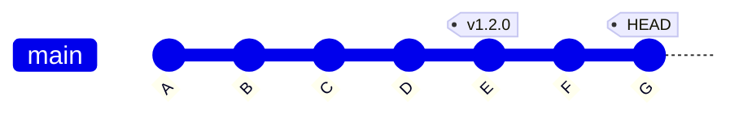
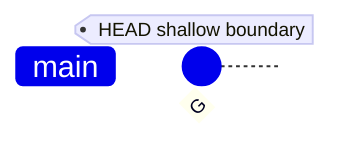
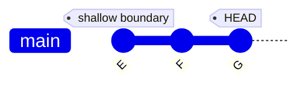
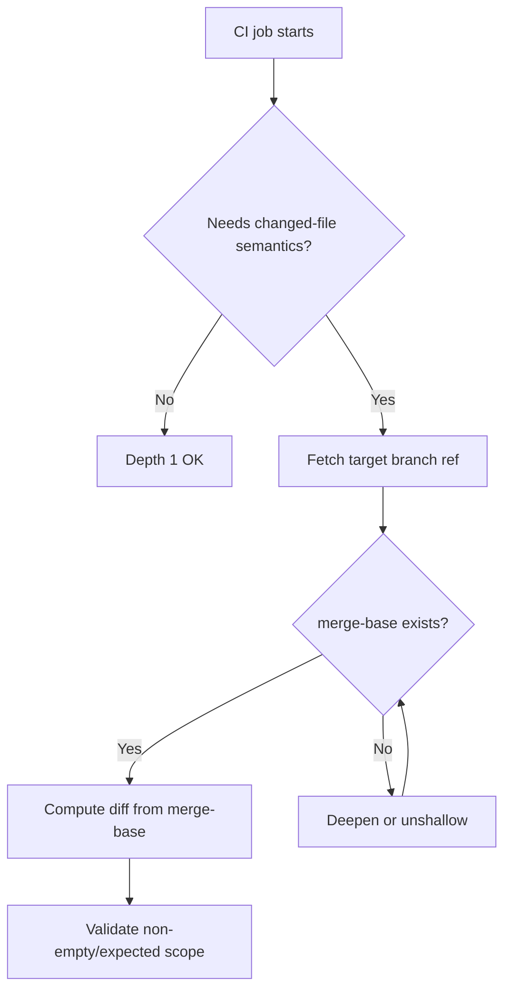
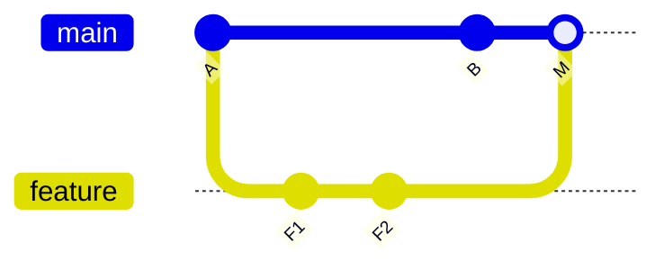

# Part 075 — Shallow Clone, Single Branch, and CI Trade-offs

Part 072 membahas **partial clone**.

Part 073 membahas **sparse checkout**.

Part ini membahas teknik lain yang sering dipakai di CI:

```bash
git clone --depth 1
git clone --single-branch
git fetch --depth 1
```

Tujuannya sederhana: checkout lebih cepat.

Masalahnya: checkout cepat sering dibayar dengan hilangnya informasi history yang dibutuhkan pipeline.

Target mental model:

> Shallow clone is a history reduction strategy. It reduces commit graph depth, not working tree width and not object payload by itself.

Artinya:

- sparse checkout mengurangi file yang hadir di working tree;
- partial clone mengurangi object yang diunduh sampai dibutuhkan;
- shallow clone memotong kedalaman commit history;
- single-branch membatasi ref/history branch yang diambil.

Di CI, shallow clone bisa benar.

Tapi shallow clone juga bisa membuat pipeline salah tanpa terlihat salah.

---

## 1. The Core Problem

CI biasanya ingin cepat:

```text
checkout -> restore cache -> build -> test -> package -> publish
```

Maka konfigurasi default sering dibuat minimal:

```yaml
fetch-depth: 1
```

Ini cocok untuk pipeline yang hanya butuh snapshot source saat ini.

Tapi banyak pipeline tidak hanya butuh snapshot.

Mereka butuh **history semantics**:

```text
Which files changed since last release?
What is the merge base with main?
What tags are reachable from this commit?
Which modules should run tests?
What commits are included in this release?
Did this branch diverge from target?
Can we compute version from nearest tag?
Can we produce changelog?
Can we bisect a failure inside CI?
```

Kalau history dipotong, command masih bisa berjalan, tetapi jawabannya bisa salah, kosong, atau misleading.

---

## 2. Shallow Clone in One Diagram

Normal clone mengambil reachable history dari refs yang di-fetch:



Shallow clone depth 1 hanya memiliki tip commit dan boundary:



Depth 3:



Di shallow repository, Git tahu ada parent yang tidak tersedia.

Commit graph lokal tidak lengkap.

Itu bukan corruption.

Itu bentuk repository yang sengaja incomplete.

---

## 3. What `--depth` Actually Changes

Command:

```bash
git clone --depth 1 https://example.com/org/repo.git
```

Efek praktis:

- history dipotong ke jumlah commit tertentu dari tip ref yang di-clone;
- repository menjadi shallow;
- `.git/shallow` berisi daftar commit boundary;
- parent di balik boundary tidak tersedia lokal;
- operasi graph yang butuh ancestor lama bisa gagal atau memberi hasil terbatas.

Cek shallow state:

```bash
git rev-parse --is-shallow-repository
cat .git/shallow 2>/dev/null || true
```

Lihat commit yang tersedia:

```bash
git log --oneline --decorate --graph --all
```

Deepen history:

```bash
git fetch --deepen=50 origin main
```

Convert menjadi full history:

```bash
git fetch --unshallow origin
```

Kalau remote tidak shallow-capable atau repository sudah tidak shallow, command perlu ditangani dengan fallback.

```bash
if git rev-parse --is-shallow-repository | grep -qx true; then
  git fetch --unshallow --tags origin
else
  git fetch --tags origin
fi
```

---

## 4. `--single-branch` Is a Ref/History Scope Decision

Command:

```bash
git clone --single-branch --branch main https://example.com/org/repo.git
```

Efeknya berbeda dari `--depth`.

`--single-branch` membatasi branch history yang diambil.

Cek remote-tracking refs:

```bash
git branch -r
```

Pada clone single-branch, kamu mungkin hanya melihat:

```text
origin/HEAD -> origin/main
origin/main
```

Bukan:

```text
origin/main
origin/release/1.2
origin/feature/a
origin/hotfix/b
```

Ini bisa bagus untuk CI yang hanya build satu branch.

Tapi bisa berbahaya untuk pipeline yang membandingkan branch.

Contoh gagal:

```bash
git merge-base origin/main HEAD
```

Kalau `origin/main` tidak ada, pipeline bukan cuma lambat—ia kehilangan referensi integrasi utama.

Fetch branch target eksplisit:

```bash
git fetch origin main:refs/remotes/origin/main
```

Fetch release branch eksplisit:

```bash
git fetch origin release/1.2:refs/remotes/origin/release/1.2
```

---

## 5. Shallow Clone vs Partial Clone vs Sparse Checkout

Jangan campur ketiganya.

| Technique | Mengurangi apa? | Cocok untuk | Risiko utama |
|---|---|---|---|
| Shallow clone | Kedalaman commit history | CI snapshot build | Merge-base/tag/changelog hilang |
| Single branch | Jumlah branch/ref yang di-fetch | Build branch tertentu | Target branch tidak tersedia |
| Partial clone | Object payload, terutama blob | Repo besar, monorepo | Lazy fetch saat object dibutuhkan |
| Sparse checkout | File di working tree | Monorepo subset | Tooling butuh file out-of-cone |

Kombinasi umum untuk CI monorepo:

```bash
git clone --filter=blob:none --sparse --no-tags <url> repo
cd repo
git sparse-checkout set services/payments libs/shared
```

Kombinasi cepat tapi rawan:

```bash
git clone --depth 1 --single-branch --no-tags <url> repo
```

Pertanyaan engineering-nya bukan “mana paling cepat”.

Pertanyaannya:

> Informasi Git apa yang dibutuhkan pipeline agar jawabannya benar?

---

## 6. CI Checkout Correctness Matrix

| Pipeline job | Butuh full history? | Butuh tags? | Butuh target branch? | Aman dengan depth 1? |
|---|---:|---:|---:|---:|
| Compile current commit | Tidak | Tidak | Tidak | Biasanya ya |
| Unit test full repo | Tidak | Tidak | Tidak | Biasanya ya |
| Test changed files only | Sering ya | Tidak | Ya | Sering tidak |
| Lint changed files only | Sering ya | Tidak | Ya | Sering tidak |
| Compute modules affected since main | Ya/partial cukup | Tidak | Ya | Tidak tanpa fetch target |
| Generate changelog since last tag | Ya | Ya | Tidak | Tidak |
| Compute SemVer from nearest tag | Ya | Ya | Tidak | Tidak |
| Release from tag | Minimal tag+commit | Ya | Tidak | Tergantung |
| Backport validation | Ya | Mungkin | Ya | Tidak |
| Security audit range | Ya | Mungkin | Ya | Tidak |
| Bisect in CI | Ya | Tidak | Tidak | Tidak |
| Build source snapshot only | Tidak | Tidak | Tidak | Ya |

Rule praktis:

> Depth 1 aman hanya jika job tidak bertanya tentang masa lalu.

---

## 7. Failure Mode: `git describe` Produces Wrong Version

Banyak project menghitung version dari tag:

```bash
git describe --tags --always --dirty
```

Di shallow clone tanpa tags:

```text
fatal: No names found, cannot describe anything.
```

Atau output fallback ke SHA pendek:

```text
9f12abc
```

Akibat:

- artifact version berubah dari `v1.4.2-7-g9f12abc` menjadi `9f12abc`;
- release notes boundary salah;
- deployment metadata tidak cocok dengan tag;
- rollback automation tidak bisa menemukan release sebelumnya.

Fix minimal:

```bash
git fetch --tags --force origin
```

Tapi tags saja belum cukup kalau commit graph ke tag tidak tersedia.

Untuk `git describe`, perlu tag reachable dari commit saat ini.

Deepen sampai tag boundary ditemukan:

```bash
git fetch --deepen=100 --tags origin
```

Atau untuk release job, gunakan full history:

```bash
git fetch --unshallow --tags origin
```

Policy:

```text
Build/test jobs may be shallow.
Versioning/release jobs must fetch enough history and tags to prove release identity.
```

---

## 8. Failure Mode: Changed-Files Detection Lies

Common CI optimization:

```bash
git diff --name-only origin/main...HEAD
```

Ini butuh merge base.

Kalau shallow clone tidak punya merge base lokal:

```text
fatal: origin/main...HEAD: no merge base
```

Atau kalau target branch tidak di-fetch:

```text
fatal: ambiguous argument 'origin/main...HEAD'
```

Naive fallback yang berbahaya:

```bash
git diff --name-only HEAD~1..HEAD
```

Ini bukan pengganti PR diff.

Ia hanya melihat last commit, bukan seluruh perubahan branch.

Corrective pattern:

```bash
git fetch origin main:refs/remotes/origin/main --depth=100
BASE=$(git merge-base origin/main HEAD)
git diff --name-only "$BASE" HEAD
```

Kalau merge base belum ketemu, deepen iteratif:

```bash
for depth in 50 100 200 500 1000; do
  git fetch --deepen="$depth" origin main
  if git merge-base --is-ancestor "$(git merge-base origin/main HEAD 2>/dev/null)" HEAD 2>/dev/null; then
    break
  fi
done
```

Lebih robust:

```bash
if ! BASE=$(git merge-base origin/main HEAD); then
  git fetch --unshallow origin main
  BASE=$(git merge-base origin/main HEAD)
fi

git diff --name-only "$BASE" HEAD
```

---

## 9. Failure Mode: Release Notes Miss Commits

Release notes sering memakai range:

```bash
git log --oneline v1.4.0..v1.5.0
```

Butuh:

- kedua tag tersedia;
- commit yang ditunjuk tag tersedia;
- graph di antara boundary tersedia.

Dalam shallow clone:

```bash
git tag --list
```

mungkin kosong.

Atau tag ada, tapi object commit lama tidak ada.

Correct release-notes checkout:

```bash
git fetch --tags --force origin
if git rev-parse --is-shallow-repository | grep -qx true; then
  git fetch --unshallow origin
fi
```

Untuk repo sangat besar, full unshallow mungkin mahal.

Alternatif: fetch specific tag ranges:

```bash
git fetch origin tag v1.4.0 tag v1.5.0
```

Tetapi kalau range traversal membutuhkan parent history yang belum ada, tetap perlu deepen.

Release notes adalah evidence.

Jangan generate evidence dari incomplete history kecuali tooling eksplisit memverifikasi completeness.

---

## 10. Failure Mode: Monorepo Affected-Project Detection Breaks

Monorepo sering menjalankan:

```bash
affected --base origin/main --head HEAD
```

Atau manual:

```bash
git diff --name-only origin/main...HEAD | cut -d/ -f1-2
```

Masalah shallow/single-branch:

- `origin/main` tidak ada;
- merge-base tidak ada;
- changed files kosong;
- semua project dianggap affected;
- atau, lebih berbahaya, project yang affected tidak ikut dites.

Correctness-first algorithm:



Guardrail script:

```bash
set -euo pipefail

TARGET_BRANCH=${TARGET_BRANCH:-main}
TARGET_REF="refs/remotes/origin/${TARGET_BRANCH}"

git fetch origin "${TARGET_BRANCH}:${TARGET_REF}" --deepen=200 || \
  git fetch origin "${TARGET_BRANCH}:${TARGET_REF}"

if ! BASE=$(git merge-base "$TARGET_REF" HEAD); then
  echo "No merge-base found; unshallowing to preserve affected-project correctness" >&2
  git fetch --unshallow origin || true
  BASE=$(git merge-base "$TARGET_REF" HEAD)
fi

git diff --name-only "$BASE" HEAD
```

---

## 11. Failure Mode: Submodules Are Shallow in Unexpected Ways

Shallow clone interacts with submodules.

A top-level shallow clone does not magically guarantee submodule commits are available.

Problem:

```bash
git submodule update --init --recursive --depth 1
```

If the superproject points to an older submodule commit not reachable from the shallow tip fetched for that submodule, update can fail.

Symptoms:

```text
fatal: remote error: upload-pack: not our ref <sha>
fatal: Fetched in submodule path ..., but it did not contain <sha>
```

Safer CI policy:

```bash
git submodule sync --recursive
git submodule update --init --recursive
```

If submodule repos are huge, use targeted policy per submodule, not blanket depth 1.

For production release builds:

```text
Superproject commit + submodule commit SHAs must be fetchable and immutable.
```

---

## 12. Failure Mode: Shallow Clone Hides Forced-Update Context

A pipeline may compare previous remote state with new remote state.

In shallow or single-branch clones, local remote-tracking refs may not have enough history to detect unusual rewrites.

Example:

```bash
git fetch origin main
OLD=$(git rev-parse origin/main@{1})
NEW=$(git rev-parse origin/main)
git merge-base --is-ancestor "$OLD" "$NEW"
```

If old ref history or reflog is missing in ephemeral CI, this check is weak.

Server-side branch protection is better than trying to reconstruct trust in CI.

Use CI as verification.

Use remote server policy as enforcement.

---

## 13. Recommended Checkout Shapes

### 13.1 Snapshot Build

Use when job only builds/tests current commit.

```bash
git clone --depth 1 --single-branch --branch "$BRANCH" "$URL" repo
```

Or in GitHub Actions style:

```yaml
- uses: actions/checkout@v4
  with:
    fetch-depth: 1
```

Invariant:

```text
No command in this job asks about ancestors, tags, branch comparison, or release boundary.
```

### 13.2 PR Changed-Files Job

```yaml
- uses: actions/checkout@v4
  with:
    fetch-depth: 0
```

Or targeted manual fetch:

```bash
git fetch origin main:refs/remotes/origin/main --depth=200
BASE=$(git merge-base origin/main HEAD) || {
  git fetch --unshallow origin
  BASE=$(git merge-base origin/main HEAD)
}
git diff --name-only "$BASE" HEAD
```

Invariant:

```text
The merge base between PR head and target branch exists locally.
```

### 13.3 Release Job

```bash
git fetch --tags --force origin
if git rev-parse --is-shallow-repository | grep -qx true; then
  git fetch --unshallow origin
fi
```

Invariant:

```text
Release tag, source commit, previous release boundary, and changelog range are all locally resolvable.
```

### 13.4 Monorepo CI With Affected Tests

Prefer:

```bash
git clone --filter=blob:none --sparse "$URL" repo
cd repo
git sparse-checkout set .github tools build services/payments libs/shared
git fetch origin main:refs/remotes/origin/main --depth=500
```

Then verify merge base.

Invariant:

```text
Object payload can be lazy, but graph boundary for affected calculation must be correct.
```

---

## 14. CI Guardrail: Detect Unsafe Shallow Assumptions

Add a small shell library.

```bash
require_full_history_for_release() {
  if git rev-parse --is-shallow-repository | grep -qx true; then
    echo "Release job requires full history; unshallowing" >&2
    git fetch --unshallow --tags origin
  else
    git fetch --tags origin
  fi
}

require_merge_base() {
  local target="$1"
  git fetch origin "$target:refs/remotes/origin/$target" || return 1

  if ! git merge-base "origin/$target" HEAD >/dev/null; then
    echo "No merge-base with origin/$target; deepening" >&2
    git fetch --deepen=500 origin "$target"
  fi

  if ! git merge-base "origin/$target" HEAD >/dev/null; then
    echo "Still no merge-base; unshallowing" >&2
    git fetch --unshallow origin || true
  fi

  git merge-base "origin/$target" HEAD >/dev/null
}
```

Use it explicitly:

```bash
case "$JOB_KIND" in
  snapshot-build)
    echo "shallow ok"
    ;;
  changed-files)
    require_merge_base main
    ;;
  release)
    require_full_history_for_release
    ;;
  *)
    echo "unknown job kind: $JOB_KIND" >&2
    exit 2
    ;;
esac
```

---

## 15. Tags: Fetch Policy Matters

Many CI checkouts skip tags or fetch only the triggering ref.

That is usually good for speed.

But versioning tools often assume tags exist.

Bad assumption:

```bash
VERSION=$(git describe --tags)
```

without proving tags and history are present.

Safer:

```bash
git fetch --tags --force origin
if ! git describe --tags --abbrev=0 >/dev/null 2>&1; then
  echo "No reachable tags; deepening history" >&2
  git fetch --deepen=1000 --tags origin
fi
VERSION=$(git describe --tags --always --dirty)
```

For release, prefer no guessing:

```bash
EXPECTED_TAG=${EXPECTED_TAG:?}
COMMIT=$(git rev-list -n 1 "$EXPECTED_TAG")
HEAD_COMMIT=$(git rev-parse HEAD)

test "$COMMIT" = "$HEAD_COMMIT" || {
  echo "Release tag $EXPECTED_TAG does not point to HEAD" >&2
  exit 1
}
```

---

## 16. Shallow Clone and `git blame`, `bisect`, `log`

Shallow repository is weaker for archaeology.

```bash
git blame src/AuthService.java
```

May attribute old lines to the shallow boundary commit, not the real author commit.

```bash
git bisect start
```

May be impossible if bad/good commit range crosses missing history.

```bash
git log --since='3 months ago'
```

May only show local shallow subset.

Rule:

> Debugging jobs should not assume shallow history is enough unless the good/bad range is explicitly fetched.

CI bisect job pattern:

```bash
git fetch --unshallow origin || true
git bisect start "$BAD" "$GOOD"
git bisect run ./ci/reproduce.sh
```

---

## 17. Shallow Clone and Merge Commits

Depth count can produce surprising results around merge commits.

A shallow clone of depth 1 at a merge commit may contain the merge commit but not both parent histories.



Depth 1 at `M`:

```text
M exists.
Parents may be shallow boundaries.
Full context of feature/main histories may be absent.
```

This affects:

- merge-base computation;
- first-parent release notes;
- diff against parent;
- revert analysis;
- backport validation.

For merge-result validation, fetch enough target branch and PR head history.

---

## 18. Decision Framework

Ask these in order.

### 18.1 Does the job inspect only the current tree?

Examples:

- compile;
- run all unit tests;
- static analysis of all files;
- package source snapshot.

Depth 1 is likely fine.

### 18.2 Does the job compare against another branch?

Examples:

- changed files;
- affected projects;
- PR size;
- policy checks against `main`.

Need target branch and merge-base.

### 18.3 Does the job compare against a tag or previous release?

Examples:

- changelog;
- version calculation;
- release note generation;
- deployment delta.

Need tags and enough history.

### 18.4 Does the job produce evidence?

Examples:

- release manifest;
- compliance artifact;
- deployment provenance;
- security audit.

Prefer full or explicitly proven bounded history.

### 18.5 Does the repo hurt because of blob size, not history depth?

Use partial clone/LFS/artifact boundary.

Shallow clone will not solve binary bloat in the checked-out snapshot.

---

## 19. Anti-Patterns

### Anti-pattern 1: `depth: 1` everywhere

This optimizes before understanding job semantics.

Correct:

```text
Default shallow for snapshot jobs.
Full/targeted history for history-aware jobs.
```

### Anti-pattern 2: fallback from PR diff to last commit diff

```bash
git diff HEAD~1..HEAD
```

This silently misses changes in multi-commit PRs.

Correct:

```bash
git diff "$(git merge-base origin/main HEAD)" HEAD
```

### Anti-pattern 3: release version from missing tags

```bash
git describe --tags || echo snapshot
```

This can publish wrong artifact names.

Correct:

```bash
fetch tags + enough history; fail if expected release identity cannot be proven.
```

### Anti-pattern 4: using shallow clone to fix large binaries

If the current tree contains 2 GB of binaries, depth 1 still needs current blobs.

Correct:

```text
Use LFS, artifact repositories, partial clone, sparse checkout, or repository split.
```

### Anti-pattern 5: unshallow every job

This destroys performance gains.

Correct:

```text
Classify jobs by history requirement.
```

---

## 20. Engineering Standard for CI Checkout

A mature engineering org should define checkout profiles.

```yaml
checkoutProfiles:
  snapshot:
    fetchDepth: 1
    fetchTags: false
    targetBranch: false
    allowedFor:
      - compile
      - full-unit-test
      - static-analysis-full-tree

  pr-diff:
    fetchDepth: adaptive
    fetchTags: false
    targetBranch: required
    invariant:
      - merge-base-exists

  release:
    fetchDepth: full-or-proven-range
    fetchTags: true
    invariant:
      - expected-tag-points-to-head
      - previous-release-boundary-resolvable

  monorepo-affected:
    cloneFilter: blob:none
    sparseCheckout: allowed
    fetchDepth: adaptive
    invariant:
      - merge-base-exists
      - affected-map-versioned
```

Then CI templates enforce profiles.

Developers should not hand-roll checkout logic in every workflow.

---

## 21. Diagnostic Commands

```bash
# Is this shallow?
git rev-parse --is-shallow-repository

# What shallow boundary exists?
test -f .git/shallow && cat .git/shallow

# What refs are available?
git for-each-ref --format='%(refname:short) %(objectname:short)' refs/remotes refs/tags

# Can we find merge-base?
git merge-base origin/main HEAD

# Are tags available?
git tag --list | tail

# Is nearest tag reachable?
git describe --tags --always --dirty

# What did checkout actually fetch?
git config --get-all remote.origin.fetch

# Was clone single branch?
git config --get remote.origin.fetch
```

---

## 22. Lab: Break and Fix a Shallow CI Checkout

Create history:

```bash
mkdir /tmp/git-shallow-lab
cd /tmp/git-shallow-lab
git init --bare remote.git

git clone remote.git work
cd work
git switch -c main
for i in 1 2 3 4 5; do
  echo "$i" > app.txt
  git add app.txt
  git commit -m "main commit $i"
done
git tag -a v1.0.0 -m v1.0.0

git switch -c feature
for i in 6 7; do
  echo "$i" >> app.txt
  git add app.txt
  git commit -m "feature commit $i"
done

git push origin main feature --tags
```

Clone shallow feature:

```bash
cd /tmp/git-shallow-lab
git clone --depth 1 --branch feature file://$PWD/remote.git ci
cd ci
```

Try history-aware commands:

```bash
git describe --tags --always
git branch -r
git merge-base origin/main HEAD
git diff --name-only origin/main...HEAD
```

Fix target branch:

```bash
git fetch origin main:refs/remotes/origin/main --deepen=10
git merge-base origin/main HEAD
git diff --name-only origin/main...HEAD
```

Fetch tags and enough history:

```bash
git fetch --tags --deepen=10 origin
git describe --tags --always
```

Observation:

```text
The checkout was fast because it lacked context.
You had to restore exactly the context required by the job.
```

---

## 23. Checklist

Before choosing shallow clone in CI:

- Does the job only need current tree?
- Does it call `git log`, `git describe`, `git blame`, `git merge-base`, or `git diff A...B`?
- Does it need tags?
- Does it need target branch refs?
- Does it need previous release boundary?
- Does it run affected-project logic?
- Does it publish artifact metadata?
- Does it produce compliance or release evidence?
- Is repository pain caused by history depth or blob size?
- Is there a standard checkout profile?

---

## 24. Closing Model

Shallow clone is not bad.

Single-branch clone is not bad.

`fetch-depth: 1` is not bad.

The bad practice is using them without knowing what information the job needs.

Use this invariant:

> A CI checkout must contain enough Git graph, refs, tags, and objects to make the job's Git questions true.

If the job asks no history questions, shallow is excellent.

If the job computes release identity, changed files, affected projects, or audit evidence, shallow must be deepened, unshallowed, or replaced with a more precise checkout profile.

