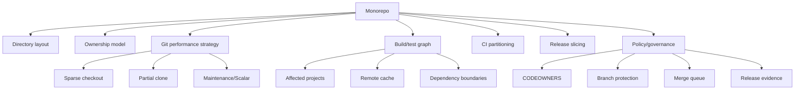
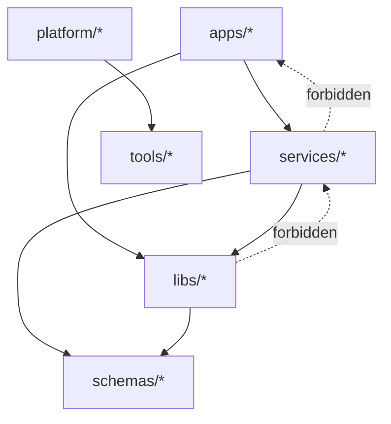
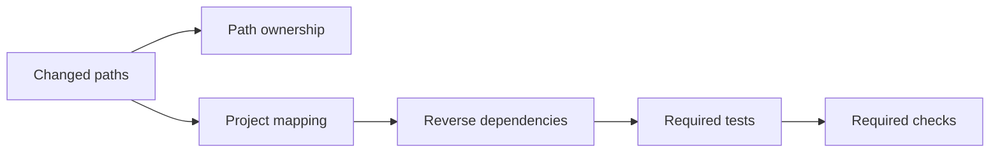
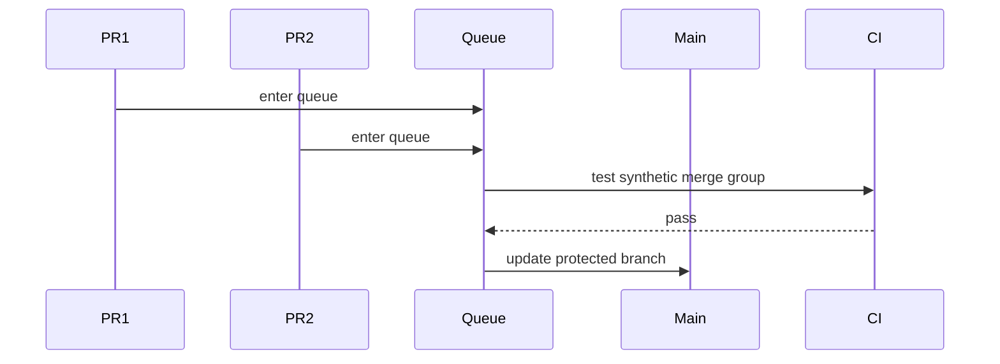

# Part 076 — Monorepo Git Strategy

Part 069–075 membahas performance tools:

- maintenance;
- MIDX/bitmap/repack;
- partial clone;
- sparse checkout;
- Scalar;
- shallow clone dan CI checkout.

Part ini membahas keputusan arsitektur yang lebih besar:

> Bagaimana merancang Git strategy untuk monorepo agar repository tetap bisa dipakai, direview, diuji, dirilis, dan diaudit ketika jumlah tim, service, library, dan history tumbuh?

Monorepo bukan sekadar “semua code dalam satu repo”.

Monorepo adalah **coordination architecture**.

Ia memindahkan sebagian kompleksitas dari dependency distribution ke source control, CI, ownership, build graph, dan release governance.

---

## 1. Monorepo Is a Trade-off, Not a Maturity Badge

Monorepo memberi keuntungan nyata:

- atomic changes lintas service/library;
- shared tooling dan policy lebih mudah;
- refactor lintas boundary lebih visible;
- dependency update bisa dikoordinasikan;
- ownership dan review dapat dikodekan per path;
- build/test graph bisa memanfaatkan changed-file analysis;
- platform team bisa mengontrol standar lebih konsisten.

Tapi monorepo juga membawa biaya:

- clone/fetch/status bisa melambat;
- PR diff bisa terlalu besar;
- CI bisa mahal tanpa affected graph;
- ownership noise meningkat;
- release slicing menjadi kompleks;
- branch lifetime drift lebih berbahaya;
- accidental coupling mudah tumbuh;
- Git history menjadi shared infrastructure risk.

Core mental model:

> Monorepo centralizes source history. It does not automatically centralize architecture discipline.

Kalau boundary code buruk, monorepo memperjelas keburukan itu.

Kalau CI buruk, monorepo memperbesar biayanya.

Kalau ownership kabur, monorepo membuat review routing kacau.

---

## 2. Monorepo Strategy in One Diagram



The repository is only one layer.

A successful monorepo needs all layers.

---

## 3. When Monorepo Makes Sense

Monorepo is a strong fit when many of these are true:

| Signal | Why it favors monorepo |
|---|---|
| Shared domain model changes across services | Atomic cross-boundary commits reduce version skew |
| Shared libraries are updated frequently | Avoid slow package release loops |
| Platform standards matter | Centralized hooks, CI, config, templates |
| Many internal packages have tight compatibility | Single source graph helps compatibility testing |
| Large refactors are common | One PR can update producers and consumers |
| Compliance needs traceability across system changes | One commit/range can represent cross-entity change |
| Build graph tooling exists or can be built | CI can test only affected units safely |

Monorepo is a weak fit when these dominate:

| Signal | Why it hurts |
|---|---|
| Teams have truly independent release cadence and contracts | Repository coupling may create false coordination |
| Huge binary/data assets live with source | Git becomes artifact storage accidentally |
| No build graph or test selection exists | CI cost explodes |
| Ownership boundaries are political, not technical | Review routing becomes conflict engine |
| Security domains require strict source isolation | Path-level ownership may be insufficient |
| Tooling assumes small repo | Developer experience degrades |

---

## 4. Directory Layout as Architecture Contract

A monorepo layout is not cosmetic.

It encodes ownership, dependency direction, CI partitioning, and release grouping.

Example:

```text
repo/
  apps/
    case-management-ui/
    enforcement-admin/
  services/
    case-intake/
    investigation/
    enforcement-action/
    notification/
  libs/
    domain-events/
    authz-client/
    audit-log/
    workflow-engine/
  platform/
    ci/
    docker/
    observability/
    deployment/
  schemas/
    events/
    api/
    database/
  docs/
    adr/
    runbooks/
  tools/
    repo-doctor/
    affected/
```

Good layout properties:

- top-level directories map to ownership domains;
- shared libraries live under explicit shared area;
- generated files are isolated;
- schemas are first-class artifacts;
- platform tooling is versioned with product source;
- docs/runbooks/ADRs live near source of truth;
- tests are either colocated or consistently mapped.

Bad layout properties:

```text
repo/
  common/
  misc/
  old/
  shared2/
  temp/
  all-services/
  utilities/
```

These names hide boundaries.

Hidden boundaries create hidden dependencies.

Hidden dependencies make affected builds unsafe.

---

## 5. Ownership Model

Use path ownership as a first-class design artifact.

Example CODEOWNERS shape:

```text
# Platform
/platform/ci/                  @platform-ci
/platform/deployment/          @platform-runtime
/tools/affected/               @developer-productivity

# Domain services
/services/case-intake/         @case-intake-team
/services/investigation/       @investigation-team
/services/enforcement-action/  @enforcement-team

# Shared contracts
/schemas/events/               @architecture-board @domain-platform
/libs/domain-events/           @domain-platform
/libs/authz-client/            @security-platform

# High-risk files
/.github/workflows/            @platform-ci @security-platform
/.gitattributes                @developer-productivity
/CODEOWNERS                    @engineering-leads
```

Ownership is not only “who reviews”.

It answers:

```text
Who can approve semantic compatibility?
Who owns runtime risk?
Who owns migration risk?
Who maintains backward compatibility?
Who gets paged if this boundary breaks?
```

Review routing should follow risk, not only directory.

Example:

| Change | Required review |
|---|---|
| Service implementation only | Service owner |
| Public API schema | Producer + consumer/platform owner |
| Event contract | Domain/event governance owner |
| Authz policy/client | Security/platform owner |
| CI workflow | Platform CI owner |
| Release pipeline | Release engineering owner |
| Database migration framework | Data/platform owner |

---

## 6. Dependency Direction

Monorepo makes imports easy.

Too easy.

Without rules, every directory can import every other directory.

That creates a distributed monolith.

Define allowed dependency direction.



Example rules:

```yaml
rules:
  - from: apps/*
    allow:
      - libs/*
      - schemas/*
  - from: services/*
    allow:
      - libs/*
      - schemas/*
  - from: libs/*
    deny:
      - apps/*
      - services/*
  - from: platform/*
    allow:
      - tools/*
      - schemas/*
```

Enforce via build tool, static analysis, or custom repo checker.

Git alone cannot enforce architecture.

But Git can version the rules and CI can enforce them per commit.

---

## 7. Git Performance Profile for Monorepo

A monorepo strategy should define default checkout profile.

For developers:

```bash
git clone --filter=blob:none --sparse <url> repo
cd repo
git sparse-checkout set apps/case-management-ui libs/domain-events tools
```

For large-repo managed experience:

```bash
scalar clone <url> repo
cd repo/src
git sparse-checkout set services/investigation libs/audit-log schemas/events
```

For CI snapshot jobs:

```bash
git clone --filter=blob:none --depth 1 --single-branch <url> repo
```

For affected-project jobs:

```bash
git clone --filter=blob:none <url> repo
cd repo
git fetch origin main:refs/remotes/origin/main --depth=500
BASE=$(git merge-base origin/main HEAD) || git fetch --unshallow origin
```

For release jobs:

```bash
git fetch --tags --force origin
if git rev-parse --is-shallow-repository | grep -qx true; then
  git fetch --unshallow origin
fi
```

Do not make one checkout strategy serve all jobs.

---

## 8. Sparse Checkout Strategy

Sparse checkout works best when repository layout has stable directory boundaries.

Good sparse profiles:

```text
frontend-case-worker:
  - apps/case-management-ui
  - libs/ui
  - libs/authz-client
  - schemas/api
  - tools

service-investigation:
  - services/investigation
  - libs/domain-events
  - libs/audit-log
  - schemas/events
  - platform/docker
  - tools

platform-ci:
  - .github
  - platform/ci
  - tools
  - docs/runbooks
```

Bad sparse profile:

```text
team-a:
  - common
  - misc
  - services
```

That is not sparse.

That is almost the whole repo with worse expectations.

Store profiles as code:

```text
repo/
  .repo-profiles/
    frontend-case-worker.txt
    service-investigation.txt
    platform-ci.txt
```

Apply:

```bash
git sparse-checkout set --stdin < .repo-profiles/service-investigation.txt
```

This makes onboarding deterministic.

---

## 9. Partial Clone Strategy

Partial clone is usually better than shallow clone for developer work in monorepos.

Why?

Developers often need history for:

- blame;
- log;
- merge-base;
- rebase;
- code archaeology;
- review context.

But they may not need every blob immediately.

Use:

```bash
git clone --filter=blob:none --sparse <url> repo
```

This preserves commit/tree graph more completely while delaying blob download.

Common profiles:

| Filter | Meaning | Fit |
|---|---|---|
| `--filter=blob:none` | Skip blobs until needed | Strong default for code monorepo |
| `--filter=blob:limit=1m` | Skip large blobs | Good when small text files should be immediate |
| `--filter=tree:0` | More aggressive tree omission | Specialized, higher lazy-fetch risk |

Do not use partial clone as a replacement for artifact storage.

If large generated binaries are part of current build input, Git still becomes painful.

---

## 10. CI Partitioning

Naive monorepo CI:

```text
Every PR -> build everything -> test everything -> deploy nothing
```

This is correct but expensive.

Optimized but dangerous CI:

```text
Every PR -> diff changed files -> run only guessed tests
```

This can be cheap but wrong.

Mature monorepo CI needs a **build graph**.



Input:

```text
changed files from merge-base to HEAD
```

Mapping:

```yaml
projects:
  services/investigation:
    owns:
      - services/investigation/**
    dependsOn:
      - libs/domain-events
      - libs/audit-log
      - schemas/events
    tests:
      - investigation-unit
      - investigation-contract

  libs/domain-events:
    owns:
      - libs/domain-events/**
      - schemas/events/**
    affectedByConsumers: true
    tests:
      - domain-events-unit
      - event-compatibility
      - consumer-contract-smoke
```

Affected calculation must include reverse dependencies.

If `libs/domain-events` changes, run consumers.

Not only the library tests.

---

## 11. Merge Queue and Monorepo CI

Monorepo raises integration race risk.

Two PRs may pass independently but fail together.

Example:

```text
PR A changes libs/authz-client behavior.
PR B changes service enforcement config.
Both pass against main.
Together they break integration.
```

Merge queue solves part of this by testing candidate merge groups.



But merge queue only helps if CI checks are meaningful.

If affected-project logic misses dependencies, queue can still merge broken changes.

Monorepo merge policy should define:

- which checks always run;
- which checks are affected-only;
- which files force global test;
- which owner approvals are required;
- which changes bypass queue never;
- how flaky tests are quarantined.

---

## 12. Files That Should Force Global Validation

Some files affect the whole repo.

Examples:

```text
.gitattributes
.gitignore
CODEOWNERS
build tool version files
root dependency lockfile
shared CI templates
Docker base images
compiler/runtime version
lint rules
formatters
security policy
schema compatibility rules
```

Policy:

```yaml
globalValidationTriggers:
  - .gitattributes
  - .gitignore
  - CODEOWNERS
  - .github/workflows/**
  - platform/ci/**
  - tools/affected/**
  - build.gradle
  - settings.gradle
  - pom.xml
  - package-lock.json
  - pnpm-lock.yaml
  - go.work
  - go.mod
```

When these change, affected-only may be unsafe.

Run wider checks.

---

## 13. Release Slicing in Monorepo

Monorepo history is shared.

Release boundaries may be per product/service.

This creates a distinction:

```text
Repository commit != every product release.
```

Options:

### 13.1 Whole-repo release

One tag releases everything.

```text
v2026.07.07 -> all services/apps/libs at commit abc123
```

Simple and auditable.

Expensive if services are independent.

### 13.2 Product-specific tags

```text
case-intake/v1.4.0
investigation/v2.1.0
enforcement-ui/v0.9.3
```

Better for independent services.

Requires tag naming discipline.

### 13.3 Release manifest

```yaml
release: enforcement-platform-2026.07.07
repoCommit: abc123
components:
  case-intake:
    version: 1.4.0
    image: registry/case-intake@sha256:...
    sourcePath: services/case-intake
  investigation:
    version: 2.1.0
    image: registry/investigation@sha256:...
    sourcePath: services/investigation
```

Best for complex platform releases.

Requires manifest tooling.

---

## 14. Release Tags in Monorepo

Do not use ambiguous tags.

Bad:

```text
v1.0.0
v1.0.1
v1.1.0
```

If multiple products release independently, this is unclear.

Better:

```text
case-intake/v1.0.0
investigation/v1.0.0
platform/v2026.07.07
```

Tag policy:

```text
<component>/<semver>
<release-train>/<date-or-build>
<platform>/<version>
```

Every release artifact should record:

```text
repo commit SHA
component path
component version
release tag
build workflow id
artifact digest
source dirty state false
```

Monorepo release evidence must prove both source identity and component boundary.

---

## 15. Branching Strategy for Monorepo

Recommended default:

```text
short-lived branches + protected trunk + merge queue + release tags/branches
```

Avoid long-lived integration branches per team.

Bad pattern:

```text
main
team-a-main
team-b-main
dev
staging
prod
```

This recreates multi-repo drift inside one repo.

Better:

```text
main
release/case-intake/1.4
release/platform/2026.07
hotfix/investigation/INC-1234
```

Branch policy:

| Branch type | Lifetime | Merge policy | History policy |
|---|---:|---|---|
| feature branch | hours-days | PR into main | rebase/fixup allowed before merge |
| stack branch | days | ordered PR chain | range-diff required after rewrite |
| release branch | days-weeks | cherry-pick fixes only | no arbitrary feature merge |
| maintenance branch | months-years | backport train | signed/protected tags |
| environment branch | avoid | usually anti-pattern | deployment system should track artifact, not branch |

---

## 16. Monorepo and Regulatory Systems

For regulatory/enforcement platforms, monorepo can be powerful because cross-entity changes often need traceability.

Example one commit series can include:

```text
workflow state transition change
case escalation rule update
authorization policy change
audit event schema update
UI display of enforcement status
migration for historical case data
```

If split across many repos, evidence requires stitching many commit identities.

In monorepo, a release manifest can point to one repository commit plus component artifacts.

But the audit burden shifts:

- commit messages must explain domain impact;
- PR must capture approval trail;
- CODEOWNERS must route to domain/security/data owners;
- release manifest must map component versions;
- deployment must pin immutable artifacts;
- tag policy must prevent mutable release identity.

Monorepo helps traceability only if governance exists.

---

## 17. Migration into Monorepo

Migration should be staged.

### Stage 1: Inventory

```text
repos
owners
languages
build systems
release cadence
dependencies
secrets/history risks
binary assets
CI jobs
branch policies
```

### Stage 2: Define target layout

```text
apps/
services/
libs/
schemas/
platform/
tools/
docs/
```

### Stage 3: Import history decision

Options:

| Option | Pros | Cons |
|---|---|---|
| Preserve full history | Archaeology and blame preserved | Large repo immediately |
| Squash import | Clean start, smaller | Loses detailed history in monorepo |
| Keep old repos archived | Smaller monorepo | Archaeology split across systems |
| Use subtree import | Preserves path history with prefix | More complex import process |

### Stage 4: Establish tooling before mass migration

Do not migrate 200 repos first and build tooling later.

Minimum before migration:

- CODEOWNERS;
- branch protection;
- CI affected graph;
- sparse profiles;
- build/test commands;
- release tagging convention;
- repo health dashboard;
- onboarding docs.

### Stage 5: Migrate by domain slice

Move coherent product/domain groups, not random repositories.

---

## 18. Migration Out of Monorepo

Sometimes monorepo boundaries need splitting.

Reasons:

- security isolation;
- open-source extraction;
- independent vendor/customer delivery;
- repository size not manageable;
- organizational separation;
- different compliance boundary.

Use history filtering carefully.

Extraction concerns:

```text
path history
tags
submodule/subtree replacement
CI migration
package names
release identity
ownership
archived references
```

High-level pattern:

```bash
# Prefer git-filter-repo when available for real migrations.
# Conceptual flow:
git clone --mirror <monorepo-url> extracted.git
cd extracted.git
git filter-repo --path services/investigation/ --path-rename services/investigation/:
```

After split:

- freeze source path in monorepo;
- create dependency artifact/package;
- update consumers;
- preserve old release evidence;
- document commit mapping.

---

## 19. Binary and Artifact Boundaries

Monorepo should not become artifact storage.

Bad:

```text
services/reporting/test-data/huge-prod-dump.sql
apps/mobile/build/app-release.apk
libs/vendor/sdk.zip
videos/demo.mov
```

Better:

```text
source code in Git
large test fixtures in artifact/object storage
release binaries in artifact registry
third-party binaries pinned by digest
small golden files allowed by policy
```

If binary assets are unavoidable:

- use Git LFS with explicit policy;
- cap file size in pre-receive hook;
- monitor largest blobs;
- keep generated artifacts out of source;
- document retention and mirroring.

Git performance strategy cannot compensate for unlimited binary growth.

---

## 20. Monorepo Health Metrics

Track objective signals.

### Git health

```text
clone time
fetch time
status time
working tree file count
index size
pack size
loose object count
largest blobs
number of refs/tags
commit-graph freshness
MIDX/bitmap status
```

### CI health

```text
queue time
checkout time
cache hit rate
affected calculation time
false global-test triggers
flake rate
merge queue failure rate
time to green main
```

### Collaboration health

```text
PR size
PR lifetime
review latency
CODEOWNER load
hotspot directories
ownership orphan paths
long-lived branches
revert rate
```

### Architecture health

```text
forbidden dependency violations
shared library churn
cross-domain change frequency
schema compatibility failures
release rollback frequency
```

Build a repo doctor:

```bash
git count-objects -vH
git for-each-ref --format='%(refname)' | wc -l
git rev-list --objects --all | \
  git cat-file --batch-check='%(objecttype) %(objectname) %(objectsize) %(rest)' | \
  awk '$1=="blob" {print $3, $4}' | sort -n | tail -20
```

---

## 21. Common Monorepo Failure Modes

### 21.1 Repository becomes slow for everyone

Cause:

- too many files;
- huge blobs;
- many refs;
- no maintenance;
- full checkout default;
- generated artifacts tracked.

Response:

- enable partial clone/sparse checkout;
- introduce Scalar/maintenance;
- remove/generated artifacts from Git;
- split artifact boundary;
- monitor large blobs.

### 21.2 Affected tests miss failures

Cause:

- path mapping incomplete;
- reverse dependencies ignored;
- global files not modeled;
- shallow checkout missing merge-base.

Response:

- validate merge-base;
- model build graph;
- make global triggers explicit;
- compare affected-only with full test periodically.

### 21.3 CODEOWNERS causes review bottlenecks

Cause:

- ownership too broad;
- same few people own root/global files;
- generated files trigger irrelevant reviewers;
- ownership not aligned with runtime responsibility.

Response:

- refine path ownership;
- exclude generated paths where safe;
- rotate ownership;
- use risk-based review rules.

### 21.4 Shared libs become dumping ground

Cause:

- easy imports;
- no dependency rules;
- no API boundary;
- unclear package ownership.

Response:

- enforce dependency direction;
- require public API review;
- track consumer count;
- split libraries by domain.

### 21.5 Release identity becomes ambiguous

Cause:

- one `v1.0.0` tag for multiple products;
- mutable tags;
- no release manifest;
- artifact not pinned to commit.

Response:

- component-scoped tags;
- signed annotated tags;
- release manifests;
- artifact digest + commit SHA metadata.

---

## 22. Monorepo Policy as Code

Example policy file:

```yaml
repository:
  defaultClone:
    filter: blob:none
    sparse: true
  maxBlobSizeMB: 20
  generatedPaths:
    - '**/dist/**'
    - '**/target/**'
    - '**/build/**'

ownership:
  requiredFor:
    - schemas/events/**
    - platform/ci/**
    - .github/workflows/**

ci:
  targetBranch: main
  requireMergeBase: true
  globalValidationTriggers:
    - CODEOWNERS
    - .gitattributes
    - .github/workflows/**
    - tools/affected/**

release:
  tagPattern: '<component>/v<semver>'
  requireAnnotatedTags: true
  requireArtifactDigest: true
  requireCommitShaMetadata: true
```

Then implement checks:

```text
pre-receive hook for max blob size
CI job for forbidden dependencies
CI job for ownership coverage
release job for tag/artifact identity
repo doctor for health trend
```

---

## 23. Developer Experience Standard

A monorepo succeeds only if daily work is boring.

Provide one command:

```bash
repo init --profile service-investigation
```

It should:

- clone with correct filter;
- configure sparse checkout;
- install hooks;
- start maintenance;
- set recommended Git config;
- verify tool versions;
- print next commands.

Example output:

```text
Profile: service-investigation
Sparse paths:
  services/investigation
  libs/domain-events
  libs/audit-log
  schemas/events
Maintenance: enabled
Partial clone: blob:none
Hooks: installed
Next:
  ./tools/build service-investigation
  ./tools/test affected
```

Do not make every engineer memorize large-repo Git incantations.

Encode them.

---

## 24. Lab: Design a Monorepo Strategy

Given this system:

```text
case-management-ui
case-intake-service
investigation-service
enforcement-action-service
notification-service
authz-client
audit-log-lib
domain-events-lib
workflow-engine-lib
event schemas
api schemas
ci templates
deployment manifests
```

Design:

1. directory layout;
2. CODEOWNERS;
3. allowed dependency graph;
4. sparse profiles;
5. CI affected mapping;
6. release tag convention;
7. global validation triggers;
8. repo health metrics.

Expected shape:

```text
repo/
  apps/case-management-ui
  services/case-intake
  services/investigation
  services/enforcement-action
  services/notification
  libs/authz-client
  libs/audit-log
  libs/domain-events
  libs/workflow-engine
  schemas/events
  schemas/api
  platform/ci
  platform/deployment
  tools/affected
  docs/adr
```

Then ask:

```text
If libs/domain-events changes, which services must test?
If schemas/api changes, who reviews?
If platform/ci changes, can affected-only be trusted?
If investigation releases v2.1.0, what tag name is used?
If a secret is found in services/notification history, what is the blast radius?
```

---

## 25. Checklist

Before adopting monorepo:

- Is there a real coordination need?
- Is directory layout aligned with architecture?
- Are owners defined per path?
- Are dependency directions enforceable?
- Is CI based on a build graph, not only file globs?
- Are global validation triggers explicit?
- Are sparse profiles defined?
- Is partial clone supported by server/client environment?
- Is release tagging component-aware?
- Are artifacts pinned by commit SHA and digest?
- Are binary assets kept out of Git or controlled?
- Is branch protection configured?
- Is merge queue needed?
- Is repository maintenance automated?
- Is onboarding one command?
- Are repo health metrics visible?

---

## 26. Closing Model

A monorepo is not primarily a Git feature.

It is an engineering operating model implemented partly through Git.

The Git part matters:

- clone shape;
- refs;
- tags;
- sparse checkout;
- partial clone;
- maintenance;
- history boundaries;
- release identity.

But the non-Git part matters just as much:

- ownership;
- architecture boundaries;
- CI graph;
- release slicing;
- governance;
- developer experience.

Use this invariant:

> A monorepo must make cross-boundary change easier without making every local operation, review, test, and release globally expensive.

If that invariant fails, you do not have a monorepo strategy.

You have a large repository.

