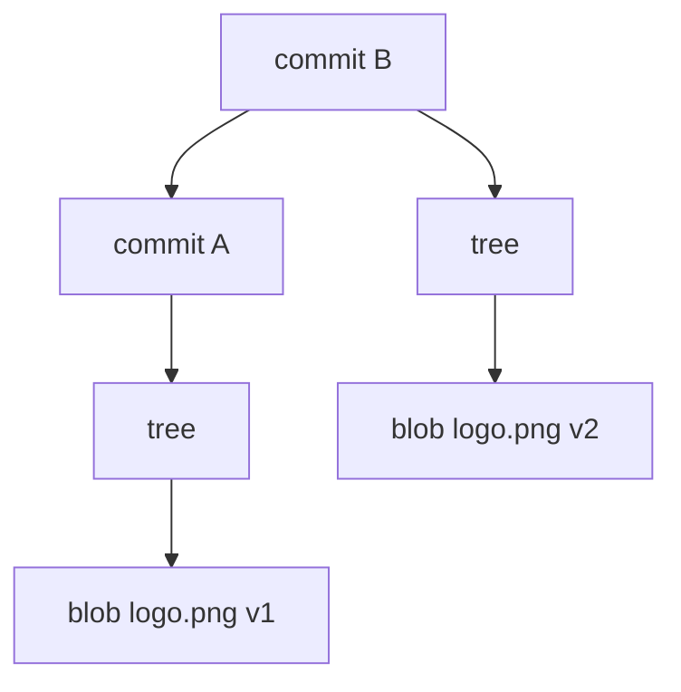
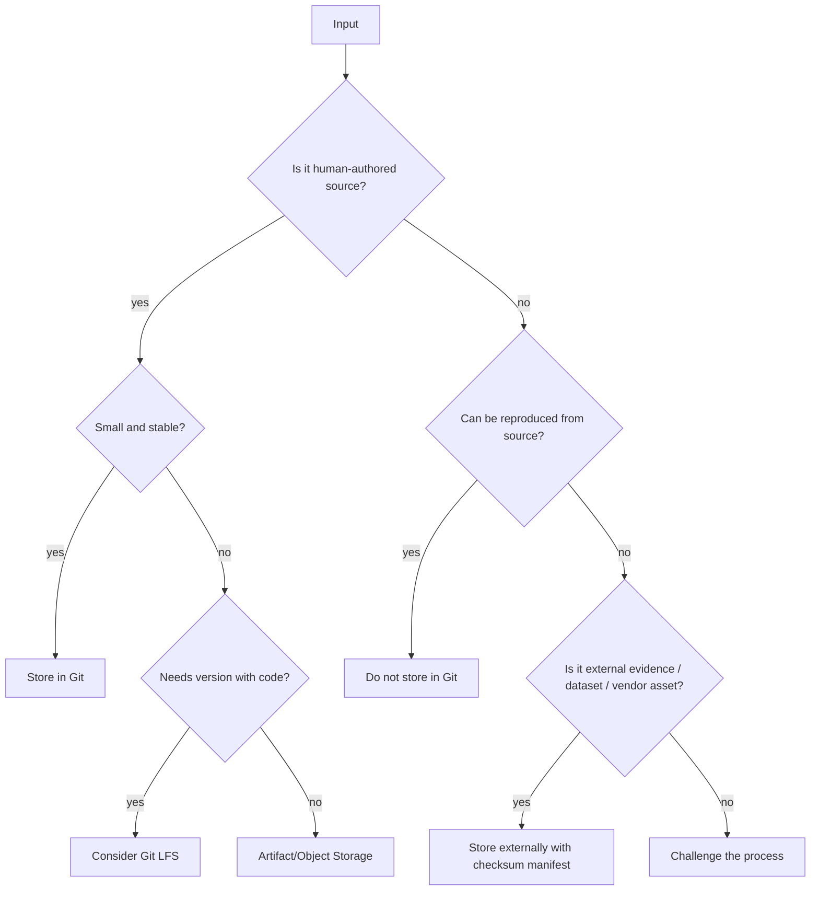
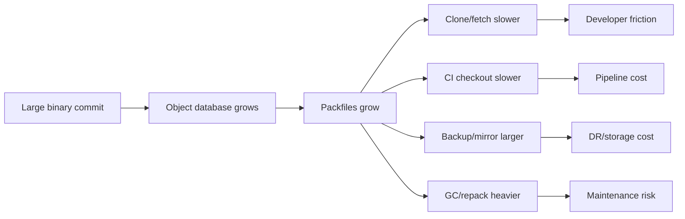
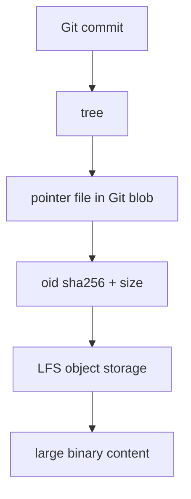
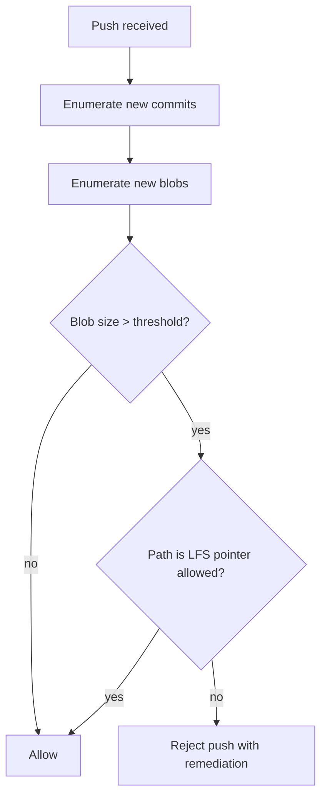
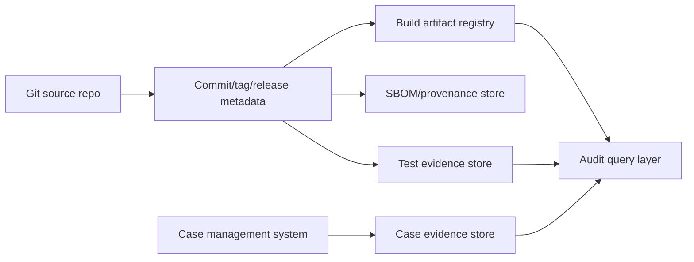

# Part 077 — Binary Files, LFS, and Artifact Boundaries

Di part sebelumnya kita membahas monorepo strategy.

Sekarang kita masuk ke salah satu sumber kerusakan repository paling mahal:

> Binary file yang masuk ke Git tanpa batas arsitektur yang jelas.

Masalah binary file bukan hanya ukuran file hari ini.

Masalahnya adalah **history permanence**.

Ketika blob besar masuk ke history Git, file itu tidak hilang hanya karena commit berikutnya menghapus file tersebut. Object lama tetap bisa reachable dari commit lama, tag lama, branch lama, fork, clone developer, cache CI, backup server, mirror, atau artifact provenance.

Git sangat kuat sebagai content-addressed source history.

Git lemah sebagai storage utama untuk artifact besar yang sering berubah.

Part ini membahas:

- kenapa binary file membuat repository bloat;
- kapan binary boleh masuk Git;
- kapan harus memakai Git LFS;
- kapan lebih tepat memakai artifact repository/object storage/package registry;
- bagaimana mendesain boundary source vs artifact;
- bagaimana menangani binary yang sudah terlanjur masuk history;
- bagaimana membuat policy tim agar problem ini tidak berulang.

---

## 1. Mental Model: Git Stores Content History, Not File Slots

Di filesystem biasa, path terlihat seperti slot:

```text
assets/logo.png
```

Saat file diganti, terlihat seolah slot yang sama berubah isi.

Di Git, yang terjadi lebih dekat ke ini:



Jika `logo.png` berubah total, Git menyimpan object content baru.

Path dapat sama.

Blob identity berbeda.

Untuk source text, ini biasanya baik:

- diff bisa dibaca;
- merge bisa dilakukan line-based;
- delta compression sering efektif;
- review bisa memahami intent.

Untuk binary file, banyak manfaat itu hilang:

- diff manusia biasanya tidak bermakna;
- merge otomatis hampir tidak mungkin;
- perubahan kecil secara semantic bisa menghasilkan blob yang sangat berbeda;
- packfile/delta compression bisa gagal efektif;
- clone/fetch menjadi mahal;
- CI cache membengkak;
- repository menjadi lambat untuk semua orang, bukan hanya author file tersebut.

Core invariant:

> Git history adalah shared infrastructure. Binary besar yang masuk history menjadi biaya permanen untuk banyak workflow.

---

## 2. Binary Is Not One Category

Jangan membuat policy semacam:

> “No binary files in Git.”

Itu terlalu kasar.

Lebih tepat:

> “Binary boleh masuk Git hanya kalau ia kecil, stabil, reviewable secara policy, dan merupakan source-of-truth yang memang perlu versioned bersama code.”

Binary perlu diklasifikasikan.

| Jenis File | Contoh | Biasanya Masuk Git? | Catatan |
|---|---|---:|---|
| Small static asset | icon kecil, logo kecil | Kadang | Boleh jika stabil dan kecil. |
| Generated artifact | `.jar`, `.dll`, bundle build | Tidak | Harus bisa dibangun ulang dari source. |
| Release artifact | tarball, installer, container image | Tidak | Simpan di release/artifact registry. |
| Test fixture kecil | sample PDF 20KB | Kadang | Boleh jika penting untuk test dan stabil. |
| Test fixture besar | dataset 2GB | Tidak langsung | Pakai LFS/object storage/dataset registry. |
| ML model weight | `.pt`, `.onnx`, `.safetensors` | Biasanya tidak | Pakai model registry/artifact storage. |
| Database dump | `.dump`, `.bak`, `.sql.gz` besar | Tidak | Risiko data/privacy/security. |
| Vendor dependency binary | jar/dll/exe vendor | Jarang | Lebih baik package manager/artifact mirror. |
| Design asset | `.psd`, `.fig`, video | Tidak di source repo | Bisa LFS kalau workflow memang version-control aset. |
| Golden snapshot | screenshot baseline | Kadang | Perlu limit, compression, review gate. |
| Lockfile | `package-lock.json`, `go.sum` | Ya | Text, source of dependency resolution. |

Policy yang baik bukan “binary yes/no”.

Policy yang baik menjawab:

1. Apakah file ini source-of-truth?
2. Apakah file ini perlu berubah bersama code?
3. Apakah diff/review-nya bermakna?
4. Apakah ukurannya wajar untuk semua clone?
5. Apakah ia bisa dibangun ulang?
6. Apakah mengandung data sensitif?
7. Apakah ada retention/audit requirement?
8. Apakah file ini dibutuhkan oleh semua developer atau hanya pipeline tertentu?

---

## 3. Source Boundary vs Artifact Boundary

Repository sehat punya batas yang jelas.



Gunakan istilah berikut secara konsisten.

## Source

Source adalah input yang diedit manusia dan menjadi dasar build/test/release.

Contoh:

- Java source;
- Vue component;
- Terraform module;
- SQL migration;
- OpenAPI spec;
- small config file;
- small test fixture yang memang dibuat sebagai bagian test.

Source cocok masuk Git.

## Build Artifact

Build artifact adalah output dari source.

Contoh:

- `.jar`;
- `.war`;
- `.dll`;
- `.exe`;
- transpiled JS bundle;
- generated docs;
- compiled protobuf;
- generated OpenAPI client;
- container image.

Build artifact umumnya tidak masuk Git.

Kalau artifact tidak reproducible, solusinya bukan commit artifact ke Git. Solusinya memperbaiki build reproducibility.

## Release Artifact

Release artifact adalah output yang dirilis, disimpan, ditandatangani, atau dipromosikan.

Contoh:

- container image dengan digest;
- signed binary;
- source archive;
- SBOM;
- deployment bundle;
- migration package;
- release evidence bundle.

Release artifact sebaiknya disimpan di release registry/artifact repository, dengan metadata yang menunjuk ke commit/tag.

## Operational Data

Operational data adalah data runtime atau data produksi.

Contoh:

- database dump;
- log export;
- customer data;
- support attachment;
- incident packet dengan data rahasia.

Operational data hampir tidak pernah pantas masuk source repository.

## Evidence Artifact

Di regulated system, ada artifact yang tidak selalu bisa diregenerate dari source tetapi penting sebagai bukti.

Contoh:

- approval PDF;
- test execution report;
- signed validation evidence;
- release attestation;
- scanned letter;
- external regulatory correspondence.

Evidence artifact bisa perlu retention, integrity, dan audit trail.

Tetapi itu tidak otomatis berarti harus masuk Git.

Biasanya lebih tepat:

- object storage dengan immutable retention;
- document management system;
- artifact repository;
- checksum manifest di Git;
- metadata link dari commit/release ke evidence object.

---

## 4. Why Binary Bloat Hurts Everyone

Binary besar memberi biaya di banyak titik.



## 4.1 Clone Cost

Clone biasanya butuh history reachable dari refs yang diambil.

Jika binary besar pernah masuk branch/tag reachable, user baru bisa membayar biaya download object lama meskipun file itu sudah dihapus dari working tree saat ini.

## 4.2 Fetch Cost

Binary yang masuk branch aktif bisa memperbesar packfile transfer.

Even worse: kalau binary sering berubah, setiap versi bisa menjadi blob besar baru.

## 4.3 Repack Cost

Packfile maintenance mencoba mengatur object storage agar efisien.

Binary yang besar dan sulit didelta bisa membuat repack:

- lebih lama;
- makan disk sementara lebih besar;
- membuat server maintenance berat;
- mengganggu CI/server performance.

## 4.4 Review Cost

Reviewer tidak bisa membaca binary diff seperti source diff.

Review berubah menjadi:

- percaya pada author;
- buka file manual;
- bandingkan checksum;
- gunakan tool eksternal;
- atau skip review.

Ini buruk untuk security-sensitive system.

## 4.5 Merge Cost

Git bisa merge text dengan three-way merge.

Binary biasanya menjadi whole-file conflict.

Jika dua branch mengubah file binary yang sama, Git tidak bisa menyatukan intent secara otomatis.

## 4.6 Storage Retention Cost

Repo Git disalin ke banyak tempat:

- developer laptop;
- CI workspace;
- build cache;
- mirror;
- fork;
- backup;
- security scanner;
- analytics tool;
- artifact provenance system.

Satu binary besar bisa menjadi puluhan atau ratusan copy.

---

## 5. Decision Framework: Git vs LFS vs External Artifact Store

Gunakan matrix berikut.

| Pertanyaan | Git | Git LFS | External Artifact Store |
|---|---:|---:|---:|
| Perlu diff text? | Sangat cocok | Tidak utama | Tidak |
| File besar? | Buruk | Lebih cocok | Cocok |
| File sering berubah? | Buruk | Bisa, tapi hati-hati | Biasanya lebih baik |
| Dibutuhkan saat checkout normal? | Cocok | Bisa mahal | Tidak langsung |
| Perlu versioned bersama commit? | Cocok | Cocok via pointer | Via manifest/metadata |
| Perlu release retention? | Kurang ideal | Bisa, tapi bukan registry | Cocok |
| Bisa dibangun ulang? | Jangan simpan output | Jangan simpan output | Simpan artifact release |
| Mengandung data sensitif? | Hindari | Hindari | Controlled storage |
| Perlu locking? | Tidak native | Ada LFS locking | Tergantung platform |
| Perlu browser preview/review? | Text bagus | Terbatas | Tergantung tool |

Rule praktis:

```text
Small + source + reviewable -> Git
Large + source-ish + must version with code -> Git LFS
Generated/release/operational/evidence -> external artifact store + Git manifest
```

---

## 6. Git LFS Mental Model

Git LFS mengubah object boundary.

Alih-alih menyimpan content besar langsung sebagai Git blob, repository menyimpan pointer file kecil di Git.

Content besar disimpan di LFS storage remote.



Pointer file biasanya berisi metadata seperti:

```text
version https://git-lfs.github.com/spec/v1
oid sha256:<hash>
size <bytes>
```

Working tree terlihat berisi file asli karena Git LFS clean/smudge filter mengganti pointer dengan content besar saat checkout, dan mengganti content besar menjadi pointer saat commit.

Mental model:

> Git LFS keeps Git history small by putting a pointer in Git and the heavy content elsewhere.

Tetapi Git LFS bukan sihir.

Ia menambah dependency baru:

- LFS client harus tersedia;
- LFS server harus reachable;
- LFS object harus retained;
- CI harus fetch object LFS yang diperlukan;
- backup harus mencakup Git refs dan LFS objects;
- access control Git dan LFS harus konsisten;
- migration history tetap rewrite jika blob lama ingin diganti pointer.

---

## 7. What Git LFS Solves

Git LFS membantu ketika:

- file besar memang perlu versioned bersama source;
- binary tidak perlu masuk packfile Git biasa;
- checkout normal bisa mengambil pointer dulu;
- team dapat mengelola LFS storage dan bandwidth;
- CI dapat meng-cache LFS objects;
- file locking dibutuhkan untuk asset non-mergeable.

Contoh kandidat LFS:

- game asset;
- CAD file;
- design binary yang memang dikembangkan bersama code;
- golden image baseline besar;
- sample media untuk integration test;
- small-to-medium model file yang perlu sinkron dengan test suite;
- training fixture yang tidak sensitif dan memang fixed.

---

## 8. What Git LFS Does Not Solve

Git LFS tidak otomatis menyelesaikan:

## 8.1 Artifact Boundary yang Salah

Jika `.jar`, `.zip`, `.exe`, atau container layer dimasukkan ke LFS, repository mungkin lebih ringan, tetapi prosesnya tetap buruk.

Generated artifact harus lahir dari pipeline, bukan menjadi source.

## 8.2 Secret Leak

Kalau secret sudah masuk Git history, memindahkannya ke LFS bukan remediation utama.

Rotasi credential tetap wajib.

Rewrite history mungkin perlu, tetapi bukan pengganti rotasi.

## 8.3 Data Privacy

LFS tetap storage yang bisa direplikasi/cache.

Jangan simpan production data sensitif di LFS hanya karena “bukan Git biasa”.

## 8.4 Repository Semantics

LFS pointer masuk commit.

Jika LFS object hilang atau access-nya putus, checkout commit bisa gagal mendapatkan file asli.

## 8.5 Merge Semantics

Binary tetap sulit di-merge.

LFS tidak membuat binary menjadi line-mergeable.

## 8.6 Cost Governance

LFS storage dan bandwidth punya limit/cost di banyak hosting platform.

Tanpa policy, LFS bisa menjadi tempat pembuangan artifact besar.

---

## 9. Introducing LFS in a Repository

Typical new-repo workflow:

```bash
git lfs install
git lfs track "*.psd"
git lfs track "*.zip"
git add .gitattributes
git commit -m "Configure Git LFS for large design assets"
```

`.gitattributes` akan berisi filter LFS, misalnya:

```gitattributes
*.psd filter=lfs diff=lfs merge=lfs -text
*.zip filter=lfs diff=lfs merge=lfs -text
```

Critical practice:

> Commit `.gitattributes` before adding large files.

Jika file besar sudah terlanjur committed sebelum rule LFS aktif, file lama tetap ada sebagai Git blob biasa.

---

## 10. Verify LFS State

Useful commands:

```bash
git lfs ls-files

git lfs status

git check-attr -a -- path/to/file.bin

git cat-file -p HEAD:path/to/file.bin
```

Expected pointer check:

```bash
git cat-file -p HEAD:path/to/file.bin | head
```

Jika output menunjukkan pointer LFS, Git blob kecil tersimpan.

Jika output menunjukkan binary content asli, file tersebut tidak berada di LFS pada commit itu.

---

## 11. CI and LFS

CI harus eksplisit.

Ada dua mode umum.

## 11.1 Need LFS Content

Jika build/test butuh file asli:

```bash
git lfs install --local
git lfs pull
```

Atau gunakan checkout action/runner config yang fetch LFS.

Pastikan cache LFS dikunci pada:

- OS;
- architecture;
- LFS oid;
- dependency profile;
- repository identity.

## 11.2 Do Not Need LFS Content

Jika job hanya lint source dan tidak butuh binary:

```bash
GIT_LFS_SKIP_SMUDGE=1 git clone <repo>
```

Atau:

```bash
git lfs install --skip-smudge
```

Lalu fetch hanya object yang dibutuhkan:

```bash
git lfs pull --include "test-fixtures/small/**"
```

Avoid default full LFS pull untuk semua job.

Itu membuat pipeline membayar cost yang tidak perlu.

---

## 12. LFS Locking for Non-Mergeable Assets

Untuk file binary yang tidak bisa di-merge, optimistic concurrency bisa buruk.

Git LFS menyediakan locking workflow di platform yang mendukung.

Pattern:

```bash
git lfs lock assets/map.psd
# edit file
git add assets/map.psd
git commit -m "Update campaign map asset"
git push
git lfs unlock assets/map.psd
```

Locking bukan pengganti branch protection.

Locking adalah coordination aid untuk file non-mergeable.

Failure modes:

- lock lupa dilepas;
- lock tidak enforced server-side;
- user offline mengedit file terkunci;
- stale lock setelah employee keluar;
- CI tidak punya access LFS lock API.

Policy perlu menjelaskan override procedure.

---

## 13. Migration: Large File Already in Git History

Jika binary besar sudah masuk history, ada tiga level remediation.

## 13.1 Stop the Bleeding

Tambahkan rule LFS atau ignore rule agar commit berikutnya tidak memperparah problem.

```bash
git lfs track "*.bin"
git add .gitattributes
git commit -m "Track binary fixtures with Git LFS"
```

Ini tidak menghapus blob lama dari history.

## 13.2 Move Future Versions to LFS Without Rewriting Old History

Anda bisa mulai menggunakan LFS untuk versi baru.

Pros:

- tidak rewrite public history;
- aman untuk downstream clones;
- cepat diterapkan.

Cons:

- blob lama tetap ada;
- clone penuh tetap membawa historical bloat;
- tidak menyelesaikan secret leak.

## 13.3 Rewrite History to Replace Old Blobs with LFS Pointers

Ini disruptive.

`git lfs migrate import` dapat mengubah history agar file tertentu menjadi LFS pointer.

Contoh:

```bash
git lfs migrate info

git lfs migrate import --include="*.psd,*.zip"
```

Konsekuensi:

- commit SHA berubah;
- tag bisa berubah;
- branch harus force-push;
- PR lama bisa rusak;
- semua clone perlu rebase/reset/reclone;
- signed commits/tags lama invalid;
- audit trail harus mencatat rewrite.

Jangan lakukan di public/shared repo tanpa runbook.

---

## 14. Binary Accident Playbook

Skenario:

> Developer accidentally committed `dataset.tar.gz` 4GB ke branch feature dan belum merge.

Playbook:

```bash
# confirm file is only on private branch
git log --oneline -- path/to/dataset.tar.gz

git status

# remove from commit history with interactive rebase or reset if private
# option A: amend latest commit
git rm --cached path/to/dataset.tar.gz
printf "path/to/dataset.tar.gz\n" >> .gitignore
git add .gitignore
git commit --amend

# option B: if older commit, interactive rebase and edit that commit
git rebase -i origin/main
```

If already pushed to shared branch:

1. freeze branch;
2. identify exposure;
3. decide whether rewrite is justified;
4. if sensitive, rotate secret/data access first;
5. prepare backup refs;
6. rewrite in clean clone;
7. force-push with coordination;
8. invalidate CI caches if needed;
9. tell all developers exact recovery command;
10. update policy/hook.

---

## 15. Artifact Manifest Pattern

Instead of committing artifact content, commit a manifest.

Example:

```yaml
artifact:
  name: enforcement-rules-engine
  version: 2026.07.07-rc.1
  sourceCommit: 4f7c9d2e7c9d9c0b0a4e2d6c1b6f7a3d2e1c0b9a
  tag: v2026.07.07-rc.1
  uri: s3://company-release-artifacts/enforcement-rules-engine/2026.07.07-rc.1/app.jar
  sha256: 35b0c0f4e2b0d7a8f8c0a3a8c6d8e5b7c9a0e2d1f6a4b3c2d1e0f9a8b7c6d5e4
  sbom: s3://company-release-artifacts/enforcement-rules-engine/2026.07.07-rc.1/sbom.spdx.json
  builtAt: 2026-07-07T03:22:10Z
  builder: ci-release-prod
```

This gives:

- Git auditability;
- artifact reproducibility path;
- storage outside Git;
- checksum integrity;
- release traceability.

In regulated systems, this pattern is often better than storing evidence binary in Git.

---

## 16. Generated Files: Commit or Not?

Generated files are tricky.

Do not use a universal rule.

Ask:

1. Is the generator deterministic?
2. Is the generator available to all developers/CI?
3. Is generated output reviewed by humans?
4. Does generated output affect release artifact?
5. Is the generated output required by downstream consumers who cannot run generator?
6. Does generated output create merge conflicts?
7. Is the generated output large?

Examples:

| File | Recommendation |
|---|---|
| generated Java protobuf classes | Usually do not commit in service repo if build can generate. |
| generated API client SDK in separate published repo | May commit because output is the product. |
| generated database migration | Usually commit if migration is authoritative and reviewed. |
| generated docs site HTML | Usually artifact, not source. |
| generated `package-lock.json` | Commit because it is dependency resolution source. |
| generated screenshot baseline | Commit if small; LFS/object storage if large. |

---

## 17. Binary Review Patterns

When binary must be versioned, make review explicit.

## 17.1 Checksum Review

Commit manifest:

```text
assets/model.onnx sha256:<hash> size:<bytes> source:<training-run-id>
```

Reviewer validates:

- size change expected;
- source run approved;
- checksum matches artifact store;
- license/security scan passed.

## 17.2 Preview Artifact

CI can render preview:

- image diff;
- PDF text extraction;
- model metadata;
- media thumbnail;
- schema summary;
- dataset row/column summary.

## 17.3 Ownership Routing

Use CODEOWNERS or similar routing:

```text
/test-fixtures/large/** @platform-test-infra
/models/** @ml-platform @security-review
/assets/legal/** @legal-engineering
```

## 17.4 Size Gate

Pre-commit/pre-receive policy:

```text
Reject Git blobs > 10MB unless path matches LFS-tracked allowlist.
Warn blobs > 1MB.
Require approval for LFS object > 100MB.
```

---

## 18. Pre-Receive Guardrail Concept

A server-side hook can scan incoming objects.

Pseudo-flow:



The important part is not the hook itself.

The important part is that rejection explains what to do next:

```text
Push rejected: raw Git blob exceeds 10MB.
Use Git LFS for source-like binary assets, or artifact storage for generated outputs.
See: docs/git/binary-file-policy.md
```

A guardrail without remediation creates frustration.

A guardrail with playbook creates learning.

---

## 19. Binary Boundary for Microservices

In microservice repositories, do not commit built dependencies from other services.

Bad:

```text
service-a/lib/service-b-client.jar
service-a/lib/service-c-contract.zip
```

Better:

- publish service client to package registry;
- pin dependency version in build file;
- use checksum verification;
- store generated client source only if it is the actual deliverable;
- use contract schema source instead of generated binary.

Git is not an artifact bus.

Microservice communication should not smuggle deployment artifacts through source history.

---

## 20. Binary Boundary for Frontend Projects

Common traps:

- committed `dist/`;
- committed `.next/` or build cache;
- committed video assets too large;
- committed generated screenshots without retention policy;
- committed downloaded fonts/licenses incorrectly;
- committed source maps containing sensitive paths/secrets.

Better:

- source assets in Git if small;
- large media in CDN/object storage with manifest;
- build output in CI artifact;
- release bundle in artifact registry;
- source map upload to observability tool, not source repo;
- LFS only where code and binary asset must evolve together.

---

## 21. Binary Boundary for Infrastructure Repositories

Common traps:

- terraform provider binaries;
- Helm chart packages `.tgz` generated from chart source;
- kubeconfig with certs;
- database dumps;
- vendor CLI binaries;
- generated plan files.

Better:

- lock dependency versions;
- use provider/plugin cache outside Git;
- commit source Helm chart, publish chart package separately;
- never commit kubeconfig secrets;
- store plan artifacts in CI with retention;
- store compliance evidence externally with checksum manifest.

---

## 22. Regulatory System Lens

In enforcement lifecycle/case-management systems, binary/evidence handling must be especially careful.

Do not confuse:

- source code audit trail;
- case evidence audit trail;
- release evidence audit trail;
- operational data retention;
- regulatory correspondence retention.

Putting all of them in Git creates false simplicity.

Better architecture:



Git should anchor source and release identity.

It should not become the primary evidence vault for case data.

---

## 23. Common Anti-Patterns

## 23.1 “Just Commit the ZIP”

This is usually a process smell.

Ask why the zip exists.

- Is it generated? Build it in CI.
- Is it vendor input? Store in artifact mirror.
- Is it release output? Store in release registry.
- Is it evidence? Store in evidence system.

## 23.2 “Delete It in the Next Commit”

This does not remove the object from history.

It only removes the path from future trees.

## 23.3 “Use LFS for Everything Big”

LFS is not a dumping ground.

Generated artifacts should not become LFS objects just to avoid Git blob limits.

## 23.4 “CI Can Download Everything”

CI bandwidth is not free.

Unbounded LFS pull can destroy pipeline performance.

## 23.5 “Binary Review Is Fine Because Tests Pass”

Tests are not review.

For security/compliance-sensitive binary changes, require metadata, owner review, and provenance.

---

## 24. Repository Health Checks for Binary Bloat

Find largest reachable blobs:

```bash
git rev-list --objects --all \
  | git cat-file --batch-check='%(objecttype) %(objectname) %(objectsize) %(rest)' \
  | awk '$1 == "blob" { print $3, $2, substr($0, index($0,$4)) }' \
  | sort -nr \
  | head -50
```

Find currently tracked large files:

```bash
git ls-files -z \
  | xargs -0 du -h \
  | sort -hr \
  | head -50
```

Check LFS tracked files:

```bash
git lfs ls-files
```

Check attributes:

```bash
git check-attr -a -- path/to/file
```

Count repository objects:

```bash
git count-objects -vH
```

Inspect pack heavy objects:

```bash
git verify-pack -v .git/objects/pack/*.idx \
  | sort -k3 -nr \
  | head -20
```

---

## 25. Team Policy Template

```mdx
# Binary File Policy

## Principle
Git stores source history. Generated artifacts, release artifacts, operational data, and evidence binaries must not be committed unless explicitly approved.

## Limits
- Warn: raw Git blob > 1MB
- Reject: raw Git blob > 10MB
- Require architecture approval: LFS object > 100MB

## Allowed in Git
- source code
- text config
- lockfiles
- small stable test fixtures
- small static assets

## Allowed in Git LFS
- large source-like binary assets that must evolve with code
- approved golden fixtures
- non-sensitive media test data

## Not Allowed in Git or LFS
- production data
- database dumps
- generated release artifacts
- build outputs
- secrets
- customer evidence
- private keys/certificates

## Artifact Storage
Release artifacts must be stored in the approved artifact registry with commit SHA, tag, checksum, builder identity, and timestamp.

## Incident Handling
If a forbidden file is committed:
1. stop pushing the branch;
2. classify exposure;
3. rotate secrets if relevant;
4. decide private amend vs public rewrite;
5. notify repository owners;
6. update guardrails.
```

---

## 26. Practical Lab: Convert Future Large Fixtures to LFS

Goal:

- configure LFS;
- add large fixture;
- verify pointer;
- avoid accidental raw blob.

Steps:

```bash
mkdir git-lfs-lab
cd git-lfs-lab
git init

git lfs install --local
git lfs track "fixtures/**/*.bin"
git add .gitattributes
git commit -m "Configure LFS for binary fixtures"

mkdir -p fixtures/payment
head -c 1048576 </dev/urandom > fixtures/payment/sample.bin

git add fixtures/payment/sample.bin
git commit -m "Add payment binary fixture"

git lfs ls-files

git cat-file -p HEAD:fixtures/payment/sample.bin
```

Expected:

- `git lfs ls-files` shows the file;
- `git cat-file -p` shows pointer text, not random binary content.

---

## 27. Practical Lab: Detect Accidental Large Blob

```bash
mkdir raw-binary-lab
cd raw-binary-lab
git init

git commit --allow-empty -m "Initial commit"
mkdir data
head -c 5242880 </dev/urandom > data/raw.bin

git add data/raw.bin
git commit -m "Accidentally add raw binary"

git rev-list --objects --all \
  | git cat-file --batch-check='%(objecttype) %(objectname) %(objectsize) %(rest)' \
  | sort -k3 -nr \
  | head
```

Then remove from latest private commit:

```bash
git rm --cached data/raw.bin
echo "data/raw.bin" >> .gitignore
git add .gitignore
git commit --amend
```

Verify:

```bash
git log -- data/raw.bin
```

If no commit contains it after amend, local private history is clean.

If it was pushed/shared, use Part 078 playbook.

---

## 28. Decision Checklist

Before adding a binary file:

```text
[ ] Is this file human-authored source?
[ ] Is it small enough for every clone/fetch?
[ ] Is the review mechanism clear?
[ ] Is the file non-sensitive?
[ ] Is it not generated from source?
[ ] Is it not a release artifact?
[ ] Is it not production/customer data?
[ ] If large, is LFS explicitly configured before commit?
[ ] If external, is there a checksum manifest?
[ ] Is ownership/code review routing defined?
```

Before accepting a PR with binary changes:

```text
[ ] File type is allowed by policy.
[ ] File size is within limit.
[ ] Diff/preview/checksum is reviewable.
[ ] Provenance is documented.
[ ] LFS pointer is valid if using LFS.
[ ] CI does not pull unnecessary LFS objects.
[ ] No generated artifact is being smuggled into source.
```

---

## 29. Summary

Binary file strategy is not a storage detail.

It is an architecture decision.

The strongest rule:

> Git should store source identity. Artifact systems should store artifact content. Git can reference artifacts through immutable metadata.

Use Git for source.

Use LFS for large source-like binary files that must evolve with commits.

Use artifact/object storage for generated, released, operational, or evidence artifacts.

When binary mistakes enter history, do not panic-delete the file in a new commit and assume the problem is solved.

Classify exposure, decide private amend vs public rewrite, coordinate downstream clones, and add guardrails.

---

## 30. References

- Git LFS official site: `https://git-lfs.com/`
- Git LFS specification: `https://github.com/git-lfs/git-lfs/blob/main/docs/spec.md`
- GitHub Docs — About Git Large File Storage: `https://docs.github.com/repositories/working-with-files/managing-large-files/about-git-large-file-storage`
- Git LFS migrate manual: `https://github.com/git-lfs/git-lfs/blob/main/docs/man/git-lfs-migrate.adoc`
- Git documentation — `gitattributes`: `https://git-scm.com/docs/gitattributes`
- Git documentation — `git cat-file`: `https://git-scm.com/docs/git-cat-file`
- Git documentation — `git rev-list`: `https://git-scm.com/docs/git-rev-list`
