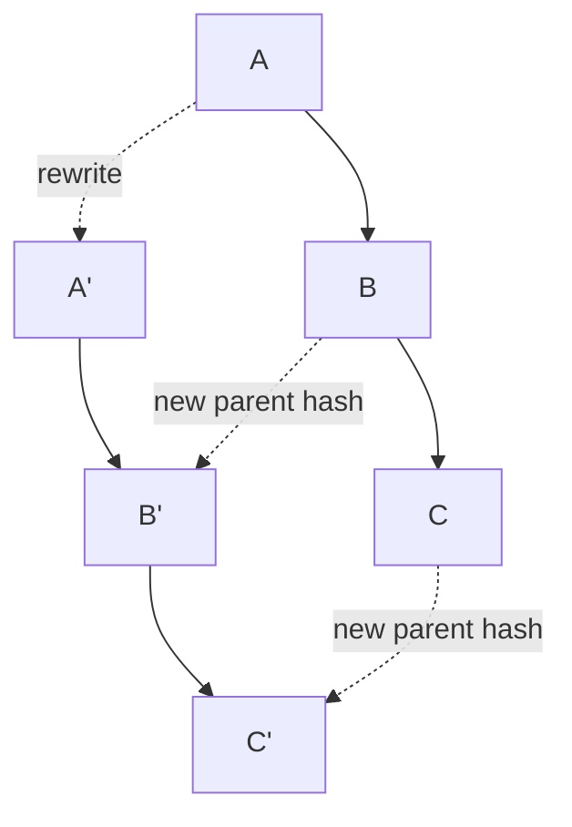
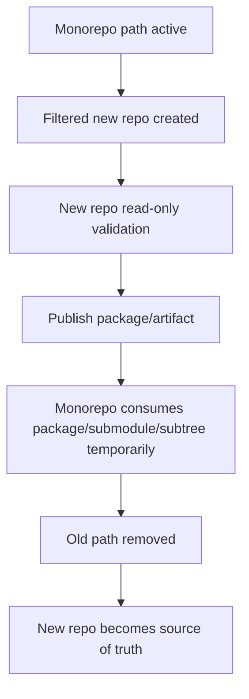

# Part 078 — Repository Splitting and History Rewrite

Part 077 membahas binary files, Git LFS, dan artifact boundaries.

Sekarang kita membahas tindakan yang sering muncul setelah boundary repository rusak:

> Memecah repository atau menulis ulang history.

Ini bukan operasi biasa.

History rewrite adalah operasi yang mengubah identity commit.

Repository splitting adalah operasi yang mengubah boundary ownership, CI, release, dependency, dan audit trail.

Keduanya bisa benar.

Keduanya juga bisa menghancurkan workflow tim jika dilakukan tanpa model mental yang tepat.

Part ini membahas:

- kapan repository split masuk akal;
- kapan history rewrite dibenarkan;
- kenapa rewrite mengubah commit SHA;
- bagaimana memakai `git filter-repo` secara aman;
- bagaimana memecah repository berdasarkan path;
- bagaimana menghapus file sensitif/binary besar dari history;
- bagaimana mengelola tags, branches, PR, forks, CI cache, dan downstream clones;
- bagaimana membuat runbook migrasi untuk organisasi engineering.

---

## 1. Core Mental Model: Rewrite Creates a New Graph

Commit identity Git tergantung pada isi commit object.

Commit object menyimpan antara lain:

- tree hash;
- parent hash;
- author/committer metadata;
- message.

Jika Anda mengubah isi tree, parent, atau metadata commit, commit hash berubah.

Karena child commit menyimpan parent hash, perubahan satu commit membuat descendant commit ikut berubah.



History rewrite bukan “mengedit commit lama”.

History rewrite membuat commit baru yang mirip commit lama tetapi punya identity baru.

Old graph mungkin masih ada di:

- local clone developer;
- fork;
- mirror;
- CI cache;
- backup;
- pull request refs;
- release artifacts;
- package provenance;
- security scanner archive;
- hosting-provider object store;
- Software Heritage-like archival systems;
- downstream submodules pinned to old SHA.

Core invariant:

> A rewritten public history is not erased reality. It is a new official reality that must be coordinated with old copies.

---

## 2. Repository Splitting vs History Rewrite

Repository splitting dan history rewrite sering tumpang tindih, tetapi bukan hal yang sama.

## Repository Splitting

Tujuan:

- memindahkan subset project ke repo baru;
- memisahkan ownership;
- open-source subset;
- mengurangi clone size;
- memisahkan release lifecycle;
- membuat boundary dependency lebih jelas.

Biasanya melibatkan filtering history berdasarkan path.

## History Rewrite

Tujuan:

- menghapus secret;
- menghapus large blob;
- mengganti email/metadata;
- mengubah path layout sepanjang history;
- memigrasi binary ke LFS;
- membersihkan repository sebelum open-source;
- membuat repo hasil split hanya berisi history relevan.

Tidak semua split harus rewrite public canonical repo.

Kadang lebih aman:

- create new repo from filtered copy;
- freeze old path;
- redirect development;
- preserve old repo as archive;
- avoid rewriting old public main.

---

## 3. When Repository Splitting Makes Sense

Split repository masuk akal jika satu atau lebih kondisi ini kuat.

## 3.1 Ownership Boundary Sudah Jelas

Jika folder tertentu dimiliki oleh tim berbeda dengan lifecycle berbeda, split bisa mengurangi coordination cost.

Contoh:

```text
platform/
case-management/
identity/
reporting/
sdk/public-java-client/
```

Jika `sdk/public-java-client` punya release cadence dan audience eksternal sendiri, repo terpisah bisa lebih tepat.

## 3.2 Release Cadence Berbeda

Jika satu bagian dirilis harian dan bagian lain dirilis quarterly dengan validation ketat, monorepo bisa membawa friction.

Split bisa membuat:

- release branch lebih sederhana;
- tag semantics lebih jelas;
- CI lebih fokus;
- artifact provenance lebih bersih.

## 3.3 Open-Source Subset

Jika ingin open-source sebagian code, filtering wajib hati-hati.

Jangan hanya copy working tree saat ini.

Pertanyaan:

- Apakah history lama mengandung secret?
- Apakah author metadata boleh dipublikasikan?
- Apakah license di semua commit/path konsisten?
- Apakah internal issue IDs/message boleh keluar?
- Apakah deleted files di history mengandung data internal?

## 3.4 Performance Boundary

Jika repository terlalu besar karena satu subsystem besar, split bisa membantu.

Tetapi jangan split hanya karena CI lambat.

Kadang solusi lebih baik:

- sparse checkout;
- partial clone;
- affected-project CI;
- artifact boundary;
- Git LFS;
- maintenance/repack.

Split adalah perubahan organisasi, bukan hanya performance optimization.

## 3.5 Dependency Direction Sudah Stabil

Split memperkenalkan versioned dependency boundary.

Jika dua subsystem masih berubah secara atomik setiap hari, split akan menambah friction.

Good split candidate:

```text
A depends on B through stable API.
B rarely needs atomic changes with A.
B can be tested/released independently.
```

Bad split candidate:

```text
A and B frequently require same-commit changes.
Tests require whole-system source state.
API boundary not stable.
Ownership unclear.
```

---

## 4. When History Rewrite Is Justified

Public history rewrite has high blast radius.

Justification must be strong.

Common justified cases:

1. committed secret/private key;
2. committed regulated/customer data;
3. committed huge binary causing severe operational harm;
4. preparing subset for public release;
5. legal/license removal requirement;
6. catastrophic repository bloat before wide adoption;
7. repository split where new repo needs filtered history.

Weak justifications:

- “history looks messy”;
- “commit messages are ugly”;
- “we want linear history after years of merge commits”;
- “someone committed a typo”;
- “we want to remove embarrassing but harmless code.”

For shared repositories, cosmetic rewrite is usually not worth the cost.

---

## 5. Secret Leak Rule: Rotate First, Rewrite Second

If secret entered Git history, do not start by rewriting history.

Start with containment:

1. revoke/rotate credential;
2. identify exposure window;
3. check logs for use;
4. invalidate sessions/tokens if needed;
5. notify security owner;
6. only then rewrite history if appropriate.

Why?

Because rewrite does not guarantee old copies disappear.

Someone may already have cloned, cached, forked, mirrored, indexed, or logged the secret.

History rewrite reduces future accidental discovery.

It does not make exposed credentials safe again.

---

## 6. Tooling: Prefer `git filter-repo` for Serious Rewrites

Historically, Git provided `git filter-branch`.

Modern practice usually prefers `git filter-repo` for non-trivial rewrites because it is faster, more capable, and less error-prone.

Other tools exist:

- BFG Repo-Cleaner for common large-file/secret removal cases;
- `git lfs migrate` for LFS migration;
- custom scripts for one-off metadata transformations;
- `git replace`/grafts for temporary local history views.

This part focuses on `git filter-repo` because it is general-purpose and explicit.

Important:

> Run destructive rewrites in a fresh clone, not your daily working directory.

---

## 7. Pre-Rewrite Runbook

Before touching history, produce a migration record.

```mdx
# Repository Rewrite Plan

## Purpose
Remove large binary fixtures from history and split public SDK into new repository.

## Scope
- branches: main, release/*
- tags: v2.0.0 and later
- paths: sdk/java-client/**
- exclude: internal test data, deployment scripts

## Not in Scope
- rewriting archived release branches older than v2.0.0
- changing author metadata
- changing current product source repo

## Risks
- downstream clones need reset/reclone
- old PR refs become stale
- signed tags invalid if rewritten
- CI caches contain old objects
- submodules pinned to old SHAs break

## Rollback
- backup mirror kept at <location>
- refs/original preserved in local migration clone
- old repository archived read-only for 90 days

## Communication
- announcement before freeze
- freeze window
- migration complete message
- developer recovery instructions
```

---

## 8. Inventory Before Rewrite

Capture current state.

```bash
git remote -v

git branch -avv

git tag --list | tail -50

git show-ref > /tmp/show-ref.before.txt

git count-objects -vH > /tmp/count-objects.before.txt
```

Find large blobs:

```bash
git rev-list --objects --all \
  | git cat-file --batch-check='%(objecttype) %(objectname) %(objectsize) %(rest)' \
  | awk '$1 == "blob" {print $3, $2, substr($0, index($0,$4))}' \
  | sort -nr \
  | head -100
```

Find path history:

```bash
git log --oneline --all -- path/to/remove
```

Find refs containing a commit:

```bash
git branch --all --contains <commit>
git tag --contains <commit>
```

---

## 9. Backup Strategy

Before rewrite:

```bash
git clone --mirror <url> repo-backup.git
cd repo-backup.git
git show-ref > show-ref.backup.txt
git bundle create repo-backup.bundle --all
```

Store backup in controlled location.

Do not rely on “we can recover from someone’s laptop”.

A mirror backup preserves refs and object database.

A bundle gives portable recovery artifact.

---

## 10. Path-Based Repository Split

Goal:

> Extract `sdk/java-client/` into a new repository while preserving relevant history.

Use a fresh clone:

```bash
git clone <old-repo-url> java-client-split
cd java-client-split
```

Filter to path:

```bash
git filter-repo --path sdk/java-client/ --path-rename sdk/java-client/:
```

After filtering:

```bash
git log --oneline --decorate --graph --all --max-count=30
ls
```

Now create new remote:

```bash
git remote remove origin
git remote add origin <new-repo-url>
git push -u origin main
```

Then decide tags:

- push only tags relevant to extracted project;
- rewrite tag names if old tags were monorepo-wide;
- avoid pushing misleading tags.

Example tag policy:

```text
Old monorepo tag: platform-v2026.07.07
New SDK tag: java-client-v1.8.0
```

---

## 11. Preserve Directory or Flatten Directory?

When splitting `services/reporting/**`, decide whether new repo root should contain old path content.

## Preserve Path

```bash
git filter-repo --path services/reporting/
```

New repo still has:

```text
services/reporting/src/...
```

Pros:

- history path context preserved;
- easier trace to old repo;
- lower surprise.

Cons:

- awkward root layout.

## Flatten Path

```bash
git filter-repo --path services/reporting/ --path-rename services/reporting/:
```

New repo has:

```text
src/...
```

Pros:

- clean new repo layout;
- easier developer ergonomics.

Cons:

- path names changed across rewritten history;
- mapping old references requires documentation.

Choose intentionally.

---

## 12. Multi-Path Split

Sometimes a new repo needs multiple paths:

```bash
git filter-repo \
  --path services/reporting/ \
  --path libs/reporting-core/ \
  --path tools/reporting-migration/
```

If flattening multiple paths, avoid collisions.

Example:

```bash
git filter-repo \
  --path services/reporting/ --path-rename services/reporting/:service/ \
  --path libs/reporting-core/ --path-rename libs/reporting-core/:libs/reporting-core/ \
  --path tools/reporting-migration/ --path-rename tools/reporting-migration/:tools/migration/
```

Before push, verify:

```bash
git ls-tree -r --name-only HEAD | sort | head -100
```

---

## 13. Remove a File From All History

Scenario:

```text
config/prod/private-key.pem
```

First rotate/revoke key.

Then rewrite in clean clone:

```bash
git filter-repo --path config/prod/private-key.pem --invert-paths
```

Verify:

```bash
git log --all -- config/prod/private-key.pem

git rev-list --objects --all | grep 'private-key.pem' || true
```

Do not stop there.

You must still handle:

- remote force-push;
- PR refs;
- forks;
- CI caches;
- release artifacts;
- developer clones;
- package provenance;
- backups/archives.

---

## 14. Remove Multiple Sensitive Patterns

Use a path file:

```text
config/prod/private-key.pem
secrets/
*.p12
*.jks
```

Then:

```bash
git filter-repo --paths-from-file paths-to-remove.txt --invert-paths
```

Be careful with globs.

Do a dry analysis first by listing matches from current and historical tree if possible.

---

## 15. Replace Text Across History

Sometimes you need to replace sensitive text in files.

Use with caution.

Example concept:

```text
literal:old-secret-value==>REMOVED
regex:password=[^\n]+==>password=REMOVED
```

Then:

```bash
git filter-repo --replace-text replacements.txt
```

Risks:

- binary files may be affected unexpectedly;
- config semantics can break;
- replacement may miss encoded/compressed variants;
- secret may still exist in issue tracker, CI logs, artifacts, or forks.

Again: rotate first.

---

## 16. Rewrite Tags

Tags are refs too.

If filtered history changes commit identity, old tags may point to old commits or be rewritten depending tool/options and scope.

Questions:

1. Should old release tags exist in new repository?
2. Were old tags product-wide or component-specific?
3. Are tags signed?
4. Do downstream systems verify tag signatures?
5. Are release artifacts tied to old tag SHA?
6. Should new tags be created instead of rewriting old ones?

In regulated release systems, moving or rewriting release tags is dangerous.

Often better:

- archive old repo/tags;
- create new repo with new tag namespace;
- document lineage;
- keep release evidence pointing to original immutable commit/tag;
- avoid pretending old releases were produced from new rewritten commits.

---

## 17. Branch Scope

Do not blindly rewrite every branch forever.

Classify branches:

| Branch Type | Rewrite? | Notes |
|---|---:|---|
| `main` | Often yes if canonical rewrite | High coordination. |
| `release/*` active | Maybe | Depends on support promise. |
| old archived release | Usually no | Archive old repo instead. |
| feature branches | Usually no | Ask owners to recreate/rebase. |
| PR refs | No direct | Hosting provider-specific. |
| forks | Cannot control fully | Communicate. |

If open-sourcing, you may need stricter filtering across all reachable history.

If performance cleanup, limit scope may be acceptable.

---

## 18. Force Push Protocol After Rewrite

After validation and approval:

```bash
git push --force-with-lease origin main
```

For multiple branches/tags, prefer explicit pushes.

Avoid casual:

```bash
git push --mirror --force
```

unless you are intentionally replacing the whole remote ref namespace and have rehearsed the operation.

After push:

```bash
git ls-remote origin | sort > /tmp/remote.after.txt
```

Compare with intended ref plan.

---

## 19. Developer Recovery After Public Rewrite

Give exact instructions.

For most developers, safest is reclone:

```bash
cd ..
mv repo repo-before-rewrite-backup
git clone <repo-url> repo
```

If preserving local work:

```bash
cd repo
git status

git branch backup/my-work

git fetch origin

git switch main
git reset --hard origin/main
```

For feature branch:

```bash
git switch feature/my-work
git rebase --onto origin/main <old-base> feature/my-work
```

But this requires understanding old base.

For many teams, “reclone and cherry-pick your private commits” is safer.

---

## 20. Downstream Clone Blast Radius

Public rewrite can break:

## 20.1 Pull Workflow

Developers see unrelated histories or forced updates.

## 20.2 Open PRs

PR diffs may explode because merge base changed.

## 20.3 CI Cache

Cache may contain old objects, old LFS content, old submodule pins.

## 20.4 Submodules

If another repo pins old commit SHA, it may fail after old commit is no longer advertised.

## 20.5 Signed Commits/Tags

Rewritten commits are new objects. Old signatures do not carry over unless re-signed.

## 20.6 Release Provenance

Old artifact metadata points to old commit SHA.

Do not rewrite historical release evidence casually.

## 20.7 Forks

Fork owners may keep old history and accidentally reintroduce removed objects through future PRs.

## 20.8 Mirrors and Backups

Mirrors may need explicit update or quarantine.

---

## 21. Prevent Reintroduction After Cleanup

After removing large/sensitive files, add guardrails.

## 21.1 `.gitignore`

```gitignore
*.pem
*.p12
*.jks
*.dump
*.bak
*.sql.gz
/build/
/dist/
```

## 21.2 `.gitattributes` for LFS

```gitattributes
*.psd filter=lfs diff=lfs merge=lfs -text
*.onnx filter=lfs diff=lfs merge=lfs -text
```

## 21.3 Secret Scanning

Use pre-commit feedback and server-side/CI enforcement.

## 21.4 Blob Size Gate

Reject raw blobs above threshold.

## 21.5 Branch Protection

Require checks to pass before merge.

## 21.6 Education

Provide concrete remediation path, not just rejection.

---

## 22. Split Without Preserving History

Sometimes preserving history is not worth it.

Option:

```bash
mkdir new-repo
cd new-repo
git init
cp -R ../old-repo/path/* .
git add .
git commit -m "Initial import from old repository"
```

Pros:

- simple;
- avoids dragging secret/bloat history;
- clean start;
- easier open-source review.

Cons:

- loses file-level history in new repo;
- blame starts at import;
- audit requires old repo reference;
- harder to trace old evolution.

This is valid when:

- old history is noisy/dangerous;
- new repo is product boundary, not forensic archive;
- old repo remains archived internally;
- import commit documents source lineage.

Import commit message should include:

```text
Initial import of public Java SDK from internal monorepo.

Source lineage:
- old repository: internal/platform-monorepo
- old path: sdk/java-client/
- source commit: <old-sha>
- import date: 2026-07-07
- filtering notes: history intentionally not preserved because old repository contains internal-only paths and metadata.
```

---

## 23. Split With History and Archive Old Path

If split with history succeeds, decide what happens to old path.

Options:

## 23.1 Delete Old Path

```bash
git rm -r sdk/java-client
git commit -m "Move Java client SDK to dedicated repository"
```

Include new repo URL and migration note.

## 23.2 Replace with README Pointer

```text
sdk/java-client/README.md
```

Content:

```mdx
# Java Client SDK Moved

This SDK now lives in `<new-repo-url>`.

Last monorepo commit before split: `<old-sha>`.
First standalone repository commit: `<new-sha>`.
Migration date: 2026-07-07.
```

## 23.3 Keep Mirror Temporarily

Keep old path read-only for a deprecation window.

Risk:

- divergence;
- people continue changing old copy;
- duplicate ownership.

Use only with explicit freeze enforcement.

---

## 24. Open-Sourcing Checklist

Before publishing filtered repo:

```text
[ ] All paths reviewed for internal-only code.
[ ] Deleted historical files reviewed, not only HEAD.
[ ] Secrets scanned across all branches/tags to be published.
[ ] Author metadata policy approved.
[ ] Commit messages checked for internal references.
[ ] License headers consistent.
[ ] Third-party code provenance checked.
[ ] CI config sanitized.
[ ] Issue/PR templates external-safe.
[ ] Release tags renamed or filtered intentionally.
[ ] Security contact added.
[ ] Old private lineage documented internally.
```

Open-sourcing is not just path filtering.

History itself is content.

---

## 25. Case Study: Extract SDK from Regulated Platform Monorepo

Context:

```text
platform-monorepo/
  services/case-lifecycle/
  services/enforcement-actions/
  libs/authorization-core/
  sdk/java-client/
  internal-test-data/
  deployment/
```

Goal:

- publish `sdk/java-client` to a separate private/customer-accessible repo;
- preserve SDK history;
- avoid internal service history;
- avoid internal test data;
- release SDK independently;
- maintain audit lineage.

Plan:

1. freeze SDK path in monorepo;
2. create mirror backup;
3. filter only `sdk/java-client/`;
4. flatten path to root;
5. scan resulting history;
6. create new repository;
7. push `main` only first;
8. create new SDK tag namespace;
9. update build/publish pipeline;
10. replace old path with README pointer;
11. update CODEOWNERS and documentation;
12. monitor for accidental old-path changes.

Key decision:

> Do not rewrite the original monorepo. Create a filtered new repository and archive the old path.

Why?

- lower blast radius;
- existing release provenance remains valid;
- active teams not forced to realign clones;
- new repo gets focused history.

---

## 26. Case Study: Secret in Public Repo

Context:

```text
config/prod/payment-provider.env
```

Secret was committed and pushed to public Git hosting.

Correct order:

1. revoke provider credential immediately;
2. rotate dependent credentials if chained;
3. inspect provider logs;
4. notify security/legal if required;
5. remove file from current HEAD;
6. rewrite history using filter tool;
7. force-push rewritten refs;
8. contact hosting provider support if needed for cached views;
9. invalidate CI caches/artifacts containing secret;
10. scan forks and open PRs;
11. add secret scanning and pre-receive rules;
12. write incident postmortem.

Wrong order:

```text
rewrite history -> assume secret is safe -> do not rotate
```

That is a security bug.

---

## 27. Case Study: Huge Binary in Internal Repo

Context:

- 40GB test dataset accidentally committed six months ago;
- reachable from `main` history;
- cloned by hundreds of CI jobs;
- no sensitive data;
- repo clone time unacceptable.

Options:

## Option A — Do Not Rewrite

Move future dataset to object storage and live with old bloat.

Pros:

- no clone disruption;
- no commit identity break.

Cons:

- clone remains large;
- long-term maintenance cost persists.

## Option B — Rewrite Main History

Remove dataset from history.

Pros:

- real repository size reduction after server GC/prune;
- future clone better.

Cons:

- high coordination;
- all active branches need recovery;
- old CI caches need cleanup;
- tags and release provenance affected if dataset existed before releases.

Decision criteria:

```text
Rewrite if operational cost is severe, repo is internal, coordination is possible, and release/audit impact is understood.
```

---

## 28. Validation After Rewrite

After filtering, validate content.

```bash
git fsck --full

git log --oneline --decorate --graph --all --max-count=50

git count-objects -vH

git rev-list --objects --all | grep 'forbidden-path' || true
```

Compare large blobs before/after:

```bash
git rev-list --objects --all \
  | git cat-file --batch-check='%(objecttype) %(objectname) %(objectsize) %(rest)' \
  | awk '$1 == "blob" {print $3, $2, substr($0, index($0,$4))}' \
  | sort -nr \
  | head -50
```

Run build/test:

```bash
./gradlew test
# or
npm test
# or repo-specific validation
```

Validate release tags if retained:

```bash
git tag --list

git show <tag>
```

---

## 29. Communication Template

```mdx
# Repository History Rewrite Notice

We are rewriting `<repo>` history on 2026-07-07 at 15:00 Asia/Jakarta.

## Why
Large binary files were accidentally committed and are causing severe clone/fetch/CI cost.

## What Changes
- `main` will point to rewritten commits.
- Some old commit SHAs will no longer be reachable from official refs.
- Active feature branches must be recreated or rebased.

## What Does Not Change
- Current source content after migration.
- Release artifacts already published.
- Issue tracker history.

## Required Action
After migration, safest path is to reclone:

```bash
mv repo repo-before-rewrite
git clone <repo-url> repo
```

If you have unmerged local work, create a backup branch before migration:

```bash
git branch backup/my-work
```

Contact `#platform-git-support` for branch recovery.
```

---

## 30. Post-Rewrite Server Cleanup

After force-push, old objects may remain on server until garbage collection/pruning.

Depending on hosting provider, you may need:

- support ticket;
- repository maintenance operation;
- prune unreachable objects;
- clear caches;
- delete hidden refs;
- remove old PR refs;
- rotate credentials anyway.

Do not assume local rewrite immediately reduces remote storage.

Do not assume remote caches are purged automatically.

---

## 31. Hidden References and Recontamination

Even if `main` is clean, old object can remain reachable from:

- tags;
- release branches;
- backup branches;
- pull request refs;
- `refs/original/*`;
- notes;
- stash refs;
- fork refs;
- CI refs;
- mirrors.

Check refs:

```bash
git show-ref | sort
```

After filter tools, remove local backup refs only after you have a backup elsewhere and are certain:

```bash
git for-each-ref refs/original/ --format='%(refname)'
```

Be careful before deleting.

Backup refs are useful for rollback but keep old objects reachable.

---

## 32. Rewrite and Signed History

Signed commits/tags prove identity of specific objects.

Rewrite creates different objects.

Therefore:

- old signatures do not prove new commit objects;
- signed tags may need recreation;
- commit signing policy needs update;
- audit documentation must mention rewritten lineage;
- regulated systems may need approval before replacing signed release refs.

Do not silently rewrite signed release tags.

---

## 33. Rewrite and `git blame`

Filtered history may change blame output.

Path rename/flattening also changes path history.

Preserve mapping documentation:

```text
Old path: sdk/java-client/src/main/java/...
New path: src/main/java/...
Rewrite tool: git-filter-repo
Rewrite date: 2026-07-07
Source backup: internal archive repo <id>
```

This matters for:

- incident investigation;
- license review;
- authorship questions;
- compliance evidence;
- security vulnerability provenance.

---

## 34. Safer Alternative: New Repo + Subtree/Submodule Transition

When split risk is high, transition gradually.

Pattern:



This avoids simultaneous boundary migration and production release change.

---

## 35. Practical Lab: Split a Subdirectory

Create sample repo:

```bash
mkdir split-lab
cd split-lab
git init

mkdir -p app service-a lib/shared
printf 'app v1\n' > app/app.txt
printf 'service a v1\n' > service-a/a.txt
printf 'shared v1\n' > lib/shared/shared.txt
git add .
git commit -m 'Initial monorepo layout'

printf 'service a v2\n' > service-a/a.txt
git add service-a/a.txt
git commit -m 'Update service a'

printf 'app v2\n' > app/app.txt
git add app/app.txt
git commit -m 'Update app'
```

Clone for split:

```bash
cd ..
git clone split-lab service-a-split
cd service-a-split
```

Filter:

```bash
git filter-repo --path service-a/ --path-rename service-a/:
```

Inspect:

```bash
git log --oneline --graph --all
ls
```

Expected:

- only commits touching `service-a/` remain, plus rewritten history needed for that path;
- root contains `a.txt`;
- commit hashes changed.

---

## 36. Practical Lab: Remove a Large Blob from Private History

Create accidental file:

```bash
mkdir rewrite-lab
cd rewrite-lab
git init

git commit --allow-empty -m 'Initial commit'
mkdir data
head -c 10485760 </dev/urandom > data/huge.bin
git add data/huge.bin
git commit -m 'Accidentally add huge binary'

rm data/huge.bin
git add data/huge.bin
git commit -m 'Remove huge binary from working tree'
```

Verify blob still in history:

```bash
git rev-list --objects --all | grep huge.bin
```

Rewrite:

```bash
git filter-repo --path data/huge.bin --invert-paths
```

Verify:

```bash
git rev-list --objects --all | grep huge.bin || true
```

Important:

This lab is safe because it is local/private.

Do not translate directly to public repo without the runbook above.

---

## 37. Decision Checklist: Should We Rewrite?

```text
[ ] Is the repository public/shared?
[ ] Is the reason stronger than cosmetic cleanup?
[ ] Have secrets been rotated if relevant?
[ ] Is there a mirror backup and bundle backup?
[ ] Are branches/tags in scope listed explicitly?
[ ] Are release artifacts and provenance impacts understood?
[ ] Are signed tags/commits affected?
[ ] Are forks/submodules/downstream dependencies known?
[ ] Are CI caches and PR refs considered?
[ ] Is there a communication plan?
[ ] Are developer recovery commands prepared?
[ ] Are post-rewrite guardrails ready?
```

If any answer is unknown, pause.

Unknown blast radius is the danger signal.

---

## 38. Decision Checklist: Should We Split?

```text
[ ] Is ownership boundary clear?
[ ] Is release cadence independent?
[ ] Is API/dependency boundary stable?
[ ] Are atomic cross-boundary changes rare?
[ ] Is CI/build ownership separable?
[ ] Is history preservation needed?
[ ] Are tags meaningful after split?
[ ] Are internal-only paths/messages absent or filtered?
[ ] Is consumer migration plan ready?
[ ] Is old path frozen or removed?
```

If split mainly hides architectural coupling, do not split yet.

Fix the boundary first.

---

## 39. Summary

Repository splitting and history rewrite are graph-level operations with organizational consequences.

The most important mental models:

1. rewrite creates a new commit graph;
2. old history may still exist elsewhere;
3. secret remediation starts with rotation, not rewrite;
4. splitting a repo changes ownership and release architecture;
5. path filtering is not the same as open-source readiness;
6. force-push is not the end of migration;
7. guardrails must prevent recontamination.

Good engineering teams do not avoid rewrite forever.

They treat it as a controlled migration with scope, backup, validation, communication, and post-migration controls.

---

## 40. References

- GitHub Docs — Removing sensitive data from a repository: `https://docs.github.com/en/authentication/keeping-your-account-and-data-secure/removing-sensitive-data-from-a-repository`
- `git-filter-repo` project documentation: `https://github.com/newren/git-filter-repo`
- Git documentation — `git filter-branch`: `https://git-scm.com/docs/git-filter-branch`
- Git LFS migrate manual: `https://github.com/git-lfs/git-lfs/blob/main/docs/man/git-lfs-migrate.adoc`
- Git documentation — `git bundle`: `https://git-scm.com/docs/git-bundle`
- Git documentation — `git push`: `https://git-scm.com/docs/git-push`
- Git documentation — `git fsck`: `https://git-scm.com/docs/git-fsck`
