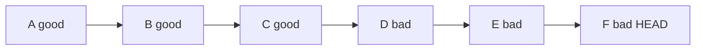
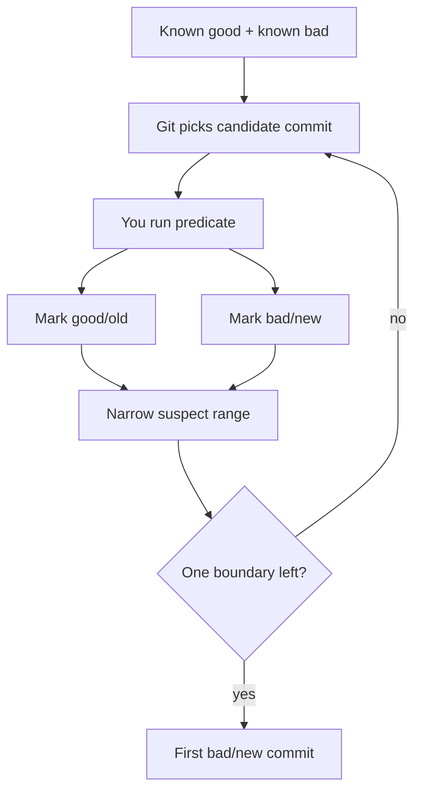
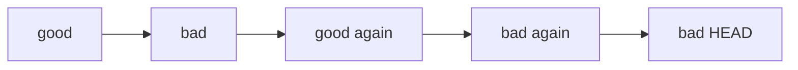
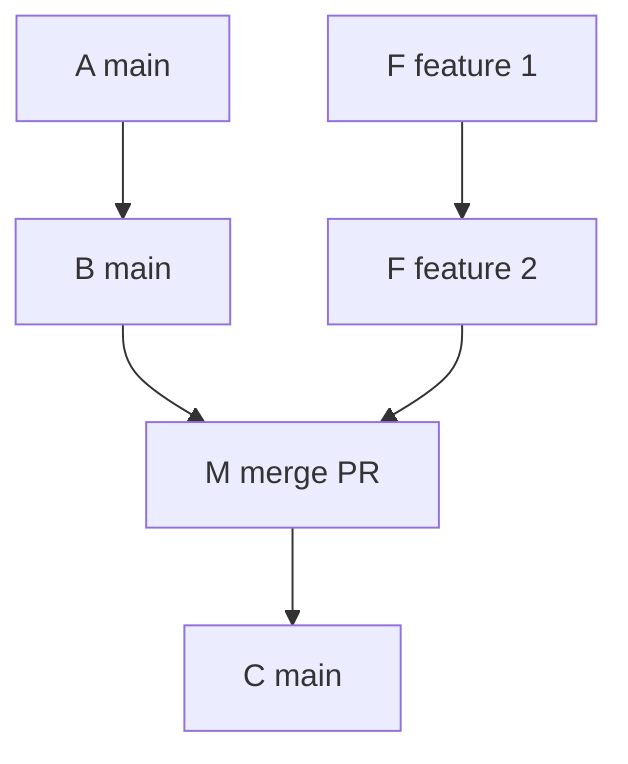

# Part 079 — Bisect as Causal Search

Part 078 membahas repository splitting dan history rewrite.

Sekarang kita masuk ke Phase 10: debugging, forensics, dan code archaeology.

Kita mulai dari salah satu command Git yang paling powerful untuk debugging production regression:

```bash
git bisect
```

`git bisect` sering dijelaskan sebagai “binary search untuk commit”.

Itu benar, tapi belum cukup.

Mental model yang lebih berguna:

> `git bisect` adalah causal search di atas commit graph untuk menemukan boundary pertama saat sebuah property berubah.

Property itu bisa berupa:

- test mulai gagal;
- benchmark mulai lambat;
- bug mulai muncul;
- endpoint mulai mengembalikan response berbeda;
- schema compatibility mulai rusak;
- memory leak mulai naik;
- binary size melewati threshold;
- security rule mulai terbuka;
- file tertentu mulai mengandung pattern tertentu;
- build artifact mulai tidak reproducible.

Git tidak tahu domain property tersebut.

Git hanya tahu commit graph.

Anda harus menyediakan predicate yang menjawab:

```text
commit ini masih old/good, atau sudah new/bad?
```

Jika predicate Anda buruk, hasil bisect buruk.

Jika predicate Anda deterministic, scoped, dan benar, `bisect` bisa mengubah debugging multi-hari menjadi investigasi puluhan menit.

---

## 1. Core Mental Model

Bayangkan history linear sederhana:



Ada satu boundary penting:

```text
C = terakhir masih good
D = pertama sudah bad
```

`git bisect` mencari boundary itu dengan menguji commit tengah.



Git tidak membuktikan “niat commit”.

Git membuktikan boundary menurut predicate yang Anda berikan.

Itu distinction penting.

Jika predicate Anda menguji symptom yang salah, bisect akan menemukan penyebab symptom itu, bukan necessarily root cause bisnis.

---

## 2. Bisect Is Not Only for Bugs

Nama default command memakai istilah `good` dan `bad`, tetapi secara konseptual `bisect` mencari perubahan property.

Untuk regression:

```text
good = property belum rusak
bad  = property sudah rusak
```

Untuk mencari commit yang memperbaiki bug:

```text
old = bug masih ada
new = bug sudah hilang
```

Untuk mencari performance improvement:

```text
slow = latency masih tinggi
fast = latency sudah turun
```

Untuk mencari policy drift:

```text
closed = unauthorized access masih ditolak
open   = unauthorized access mulai lolos
```

Contoh alternate terms:

```bash
git bisect start --term-old fast --term-new slow
git bisect slow HEAD
git bisect fast v2.4.0
```

Atau untuk mencari fix:

```bash
git bisect start --term-old broken --term-new fixed
git bisect fixed HEAD
git bisect broken v1.8.0
```

Jangan terlalu terikat pada kata `good`/`bad`.

Yang penting adalah boundary property.

---

## 3. Invariant Utama: Predicate Harus Monotonic di Range yang Diuji

`bisect` bekerja paling baik jika property berubah satu arah dalam range commit.

Untuk regression:

```text
sebelum culprit: good
di culprit dan setelahnya: bad
```

Untuk fix:

```text
sebelum fix: broken

di fix dan setelahnya: fixed
```

Masalah muncul jika property tidak monotonic:



Kemungkinan penyebab:

- bug diperkenalkan, diperbaiki, lalu muncul lagi;
- test flaky;
- dependency eksternal berubah;
- fixture data berubah di luar repository;
- feature flag default berbeda per environment;
- commit lama tidak bisa build dengan toolchain sekarang;
- migration/data contract tidak backward compatible;
- test bergantung pada waktu, timezone, network, atau ordering.

Jika monotonicity tidak benar, hasil bisect masih bisa berguna, tetapi interpretasinya harus hati-hati.

`git bisect` menemukan boundary menurut observasi Anda, bukan kebenaran absolut.

---

## 4. Manual Bisect Workflow

Kasus: `HEAD` gagal, `v1.8.0` diketahui aman.

```bash
git status --short
# Pastikan working tree bersih.

git bisect start
git bisect bad HEAD
git bisect good v1.8.0
```

Git akan checkout commit tengah.

Anda jalankan test:

```bash
./gradlew test --tests 'com.acme.AuthorizationRegressionTest'
```

Jika lolos:

```bash
git bisect good
```

Jika gagal dengan symptom yang sama:

```bash
git bisect bad
```

Jika commit tidak bisa dites karena build rusak unrelated:

```bash
git bisect skip
```

Selesai:

```bash
git bisect reset
```

Jangan lupa reset.

Selama bisect, Git checkout commit berbeda-beda. Anda biasanya berada dalam detached `HEAD`.

---

## 5. Fast Start Form

Bisa langsung:

```bash
git bisect start HEAD v1.8.0 --
```

Maknanya:

```text
bad = HEAD
good = v1.8.0
```

Dengan pathspec:

```bash
git bisect start HEAD v1.8.0 -- services/billing src/main/java/com/acme/billing
```

Ini membatasi kandidat ke commit yang menyentuh path tersebut.

Gunakan pathspec jika Anda yakin area perubahan relevan.

Jangan gunakan pathspec jika bug bisa muncul akibat perubahan di dependency, shared library, config, build logic, schema, atau generated code di luar path tersebut.

---

## 6. Automated Bisect with `git bisect run`

Manual bisect bagus untuk eksplorasi.

Namun untuk regression nyata, automation lebih kuat.

```bash
git bisect start HEAD v1.8.0 --
git bisect run ./scripts/bisect-authz-regression.sh
git bisect reset
```

Script harus mengembalikan exit code yang benar:

| Exit Code | Meaning untuk `git bisect run` |
|---:|---|
| `0` | good / old |
| `1..127`, kecuali `125` | bad / new |
| `125` | skip commit ini |
| lainnya | abort bisect |

Contoh script sederhana:

```bash
#!/usr/bin/env bash
set -euo pipefail

./gradlew clean test --tests 'com.acme.authz.AuthorizationRegressionTest'
```

Jika test gagal, shell mengembalikan non-zero sehingga commit dianggap bad.

Tetapi script production-grade perlu lebih presisi.

---

## 7. Production-Grade Bisect Script

Masalah umum:

- commit lama tidak bisa compile karena toolchain berubah;
- build failure unrelated dianggap bad;
- dependency download flaky;
- test menghasilkan false negative;
- generated file stale;
- database fixture tidak compatible;
- test gagal karena semua test suite dijalankan terlalu luas.

Script yang lebih defensif:

```bash
#!/usr/bin/env bash
set -euo pipefail

log() {
  printf '[bisect] %s\n' "$*" >&2
}

log "commit=$(git rev-parse --short=12 HEAD)"

# 1. Clean generated state that should not leak between commits.
git clean -ffdqx build .gradle/generated src/generated 2>/dev/null || true

# 2. Compile/build. If historical commit cannot build due to unrelated drift,
# skip instead of marking it bad.
if ! ./gradlew compileJava --no-daemon; then
  log "compile failed; skipping this commit"
  exit 125
fi

# 3. Run narrow deterministic regression predicate.
if ./gradlew test --no-daemon --tests 'com.acme.authz.AuthorizationRegressionTest'; then
  log "predicate passed => good"
  exit 0
else
  log "predicate failed => bad"
  exit 1
fi
```

Important distinction:

```text
build cannot run predicate = skip
predicate ran and symptom present = bad
predicate ran and symptom absent = good
```

Do not collapse all failures into `bad`.

---

## 8. Choosing Good and Bad Anchors

Bad anchor harus menunjukkan symptom.

Good anchor harus terbukti tidak menunjukkan symptom.

Jangan asal memilih release lama sebagai good hanya karena “seharusnya aman”.

Validasi dulu:

```bash
git checkout HEAD
./scripts/repro.sh
# confirm bad

git checkout v1.8.0
./scripts/repro.sh
# confirm good
```

Jika `v1.8.0` tidak bisa build dengan environment sekarang, cari good anchor lain:

```bash
git log --oneline --first-parent --decorate
```

Atau pakai release branch/tag yang lebih dekat.

Good anchor yang terlalu jauh meningkatkan risiko:

- build system berubah;
- dependency lock berubah;
- test harness berubah;
- API contract berubah;
- database migration berubah;
- test tidak portable across history.

Prinsip:

> Pilih range sekecil mungkin yang masih mengandung boundary.

---

## 9. Bisect over First-Parent History

Repository dengan banyak merge commit bisa membuat bisect masuk ke feature branch internal.

Kadang itu benar.

Kadang tidak.

Jika Anda ingin mencari integration commit yang membawa bug ke mainline, gunakan first-parent.

```bash
git bisect start --first-parent HEAD v1.8.0
```

Mental model:



Normal bisect bisa menguji `F1` atau `F2`.

First-parent bisect fokus pada jalur mainline:

```text
A -> B -> M -> C
```

Gunakan first-parent ketika pertanyaannya:

> Merge/integration mana yang merusak main?

Jangan gunakan first-parent ketika pertanyaannya:

> Commit internal mana dalam feature branch yang benar-benar memperkenalkan bug?

Seringnya, workflow efektif adalah dua tahap:

1. first-parent bisect untuk menemukan PR/merge commit;
2. bisect di branch/commit range PR untuk menemukan commit internal.

---

## 10. Bisect with Pathspec: Power and Trap

Pathspec bisa memperkecil search space.

```bash
git bisect start HEAD v2.0.0 -- src/main/java/com/acme/authz
```

Tetapi pathspec berarti:

> Hanya commit yang menyentuh path ini yang dipertimbangkan.

Ini berbahaya jika bug berasal dari:

- shared config;
- dependency version;
- database migration;
- security middleware;
- generated code;
- framework upgrade;
- test fixture;
- environment file;
- build plugin;
- transitive library.

Contoh salah:

```bash
git bisect start HEAD v2.0.0 -- src/main/java/com/acme/authz
```

Padahal regression authorization disebabkan oleh:

```text
config/security-defaults.yml
```

Bisect akan melewatkan culprit.

Gunakan pathspec hanya setelah hypothesis cukup kuat.

---

## 11. Bisecting Performance Regression

Performance regression sulit karena predicate sering noisy.

Jangan pakai sekali run benchmark lalu langsung good/bad.

Buruk:

```bash
./benchmark.sh | grep 'p95 < 100ms'
```

Lebih baik:

```bash
#!/usr/bin/env bash
set -euo pipefail

./gradlew :service:shadowJar --no-daemon || exit 125

python3 scripts/run_benchmark.py \
  --warmup 5 \
  --runs 15 \
  --metric p95_ms \
  --threshold 120 \
  --max-flake-ratio 0.2
```

Script benchmark harus:

- warm up JVM/runtime;
- pin workload;
- pin data set;
- menghindari network eksternal;
- mengulang beberapa kali;
- membedakan noise vs signal;
- output metric yang tersimpan;
- exit `0` jika masih good, `1` jika bad, `125` jika invalid.

Performance bisect tidak selalu mencari satu culprit commit.

Kadang menemukan commit tempat performance melewati threshold.

Itu boundary, bukan full causal explanation.

---

## 12. Bisecting Security or Authorization Regression

Untuk sistem enforcement/regulatory/case management, regression sering bukan “crash”, tetapi policy semantic drift.

Contoh predicate:

```bash
#!/usr/bin/env bash
set -euo pipefail

./gradlew :case-service:test --tests 'com.acme.security.AuthorizationBoundaryTest' --no-daemon || rc=$?
rc=${rc:-0}

case "$rc" in
  0)
    exit 0 # unauthorized access still blocked
    ;;
  1)
    exit 1 # test detected policy regression
    ;;
  *)
    exit 125 # infrastructure/build issue
    ;;
esac
```

Better: test exact invariant.

```java
@Test
void investigatorCannotEscalateClosedCaseWithoutSupervisorRole() {
    var actor = user("investigator");
    var caseId = closedCaseOwnedByOtherTeam();

    assertThatThrownBy(() -> service.escalate(caseId, actor))
        .isInstanceOf(ForbiddenException.class);
}
```

A good bisect predicate is usually:

- narrow;
- deterministic;
- domain-specific;
- fast enough to run repeatedly;
- independent from external mutable state;
- able to distinguish invalid commit from bad property.

---

## 13. Bisecting Compile Failures

If the regression is compile failure, the build itself is the predicate.

```bash
git bisect start HEAD v2.1.0 --
git bisect run ./gradlew compileJava --no-daemon
```

But if old commits cannot build because current environment is incompatible, use a wrapper.

```bash
#!/usr/bin/env bash
set -euo pipefail

# If wrapper did not exist yet in older commits, skip.
if [[ ! -x ./gradlew ]]; then
  exit 125
fi

./gradlew compileJava --no-daemon
```

For language ecosystems with lockfiles, containerize the historical environment:

```bash
docker build -f tools/bisect/Dockerfile -t acme-bisect . || exit 125
docker run --rm acme-bisect ./gradlew test --tests '...'
```

But beware:

- Dockerfile itself changes across commits;
- old commits may not contain the Dockerfile;
- dependency registries may have deleted versions;
- build uses current network state, not historical reality.

For high-value forensic work, create a stable external bisect harness that checks out commits and mounts them into a known environment.

---

## 14. Handling Flaky Tests

Flaky predicate poisons bisect.

Bad script:

```bash
./gradlew test
```

If a random test fails, Git marks commit bad.

Better:

```bash
#!/usr/bin/env bash
set -euo pipefail

pass=0
fail=0

for i in 1 2 3 4 5; do
  if ./gradlew test --tests 'com.acme.RegressionTest' --no-daemon; then
    pass=$((pass + 1))
  else
    fail=$((fail + 1))
  fi

done

if [[ "$fail" -ge 4 ]]; then
  exit 1
fi

if [[ "$pass" -ge 4 ]]; then
  exit 0
fi

# inconclusive
exit 125
```

This is not mathematically perfect.

But it is better than pretending a flaky predicate is deterministic.

For critical incidents, combine:

- repeated test runs;
- deterministic seed;
- isolated database;
- fixed clock;
- disabled network;
- pinned container image;
- logging of each candidate commit result.

---

## 15. The Skip Problem

`git bisect skip` is useful.

It is also dangerous if overused.

When you skip a commit, Git has less information.

If skipped commits are near the boundary, Git may not identify a single culprit.

Common skip reasons:

- commit does not compile;
- migration state impossible to reproduce;
- test framework not yet present;
- external dependency unavailable;
- binary artifact missing;
- generated source inconsistent;
- commit is known unrelated mechanical migration.

Use skip for invalid test points, not for inconvenient points.

Bad:

```bash
git bisect skip
# because test takes too long
```

Better:

- make test narrower;
- use pathspec;
- first-parent bisect;
- use a faster predicate;
- start with a smaller range.

---

## 16. Bisect Log and Replay

During manual bisect, humans make mistakes.

Inspect session:

```bash
git bisect log
```

Save:

```bash
git bisect log > /tmp/bisect.log
```

If one mark was wrong:

```bash
vim /tmp/bisect.log
# remove incorrect line

git bisect reset
git bisect replay /tmp/bisect.log
```

For incident response, store bisect log as evidence:

```bash
mkdir -p incident/2026-07-authz-regression
git bisect log > incident/2026-07-authz-regression/bisect.log
git show --stat --patch --find-renames bisect/bad > incident/2026-07-authz-regression/culprit.patch
```

This creates a reproducible investigation trail.

---

## 17. What to Do After Culprit Is Found

When Git reports culprit, do not stop.

Run this checklist:

```bash
CULPRIT=$(git rev-parse refs/bisect/bad)

git show --stat --summary "$CULPRIT"
git show --find-renames --find-copies "$CULPRIT"
git show --name-status "$CULPRIT"
git branch --contains "$CULPRIT"
git tag --contains "$CULPRIT"
```

Questions:

1. Is this commit truly causal or just where predicate crosses threshold?
2. Is culprit a merge commit?
3. Was the bug introduced by code, config, schema, generated file, or dependency?
4. Did the commit include multiple concerns?
5. Is this already released?
6. Which maintenance branches contain it?
7. Which tags/artifacts were built from descendants?
8. Can we revert safely?
9. Is fix-forward safer than revert?
10. Do we need a new regression test?

Bisect gives suspect commit.

Engineering still requires domain analysis.

---

## 18. Culprit Is a Merge Commit

If culprit is a merge commit, possibilities:

1. conflict resolution introduced bug;
2. integration of two independently correct branches caused semantic conflict;
3. bug already existed in merged branch;
4. first-parent bisect intentionally found the merge boundary;
5. merge commit changed generated/lockfile/config artifact.

Inspect merge commit:

```bash
git show --cc <merge-commit>
git show -m --first-parent <merge-commit>
git log --oneline --graph --decorate <merge-commit>^1..<merge-commit>^2
```

If you need culprit inside merged branch:

```bash
MERGE=<merge-commit>
BASE=$(git merge-base ${MERGE}^1 ${MERGE}^2)

git bisect reset
git bisect start ${MERGE}^2 $BASE --
git bisect run ./scripts/repro.sh
```

But if semantic conflict appears only when both branches are integrated, no single side commit may fail alone.

In that case, the merge itself is the causal boundary.

---

## 19. Bisect and Database Migrations

Database-backed apps create a special problem.

Historical code may require historical schema.

Your bisect predicate should define schema handling explicitly.

Options:

### Option A: Recreate DB from migrations at each commit

```bash
./gradlew flywayClean flywayMigrate test
```

Pros:

- tests code + migrations together.

Cons:

- slow;
- old migrations may not be idempotent;
- external DB version drift.

### Option B: Use fixed snapshot fixture

```bash
restore_db_snapshot baseline.dump
./gradlew test --tests 'RegressionTest'
```

Pros:

- deterministic input.

Cons:

- old code may not support snapshot schema.

### Option C: Use domain-level unit/contract test

```bash
./gradlew test --tests 'AuthorizationPolicyTest'
```

Pros:

- fast;
- avoids infrastructure.

Cons:

- may miss integration issue.

For bisect, the best predicate is not always the full production path.

It is the smallest deterministic test that preserves the failure’s causal signal.

---

## 20. Bisect and Feature Flags

Feature flags can break monotonicity.

A commit may introduce code behind a disabled flag.

The bug appears later when another commit flips the flag.

Which commit is culprit?

Depends on question.

If question is:

> When did production behavior become bad?

The flag flip may be culprit.

If question is:

> When was defective implementation introduced?

The hidden implementation commit may be culprit.

Use two predicates:

### Production-behavior predicate

Run with flag defaults as production.

```bash
./scripts/run-with-prod-flags.sh ./gradlew test --tests 'RegressionTest'
```

### Latent-defect predicate

Force flag on.

```bash
FEATURE_NEW_AUTHZ=true ./gradlew test --tests 'RegressionTest'
```

Document which question you are answering.

---

## 21. Bisecting Generated Code and Lockfiles

If culprit is a generated file or lockfile, ask:

- was generated output committed intentionally?
- did generator version change?
- did input change?
- is generated output reproducible?
- should generated file be reviewed as source artifact?

Commands:

```bash
git show --name-status <culprit>
git show <culprit> -- package-lock.json pnpm-lock.yaml build.gradle gradle.lockfile
git log --follow -- generator-config.yml
git log -S 'changed_symbol' -- generated/
```

For lockfile dependency bumps:

```bash
git diff <culprit>^ <culprit> -- package-lock.json
git diff <culprit>^ <culprit> -- gradle.lockfile
git diff <culprit>^ <culprit> -- pom.xml
```

A lockfile-only commit can still be highly causal.

---

## 22. Bisect Search Space Math

Binary search reduces candidate count roughly logarithmically.

If there are 1024 candidate commits, ideal linear history needs about 10 tests.

```text
1024 -> 512 -> 256 -> 128 -> 64 -> 32 -> 16 -> 8 -> 4 -> 2 -> 1
```

But real Git history is a DAG, not always a line.

Merge topology, skipped commits, pathspec, and first-parent selection change search behavior.

Still, the practical lesson holds:

> A deterministic 60-second predicate can search hundreds or thousands of commits quickly.

A flaky 5-second predicate can waste hours.

Quality of predicate beats raw speed.

---

## 23. Bisect in CI or Ephemeral Workers

You can run bisect in CI to diagnose a regression automatically.

Example job:

```bash
git fetch --tags --prune origin

git bisect start HEAD v2.3.1 --
git bisect run ./scripts/bisect-repro.sh

git show --stat --patch refs/bisect/bad > bisect-result.patch
git bisect log > bisect.log
git bisect reset
```

CI caveats:

- checkout depth must include the entire candidate range;
- tags must be fetched if anchors use tags;
- submodules/LFS must be initialized if predicate requires them;
- cache may leak across candidate commits;
- job timeout must account for repeated builds;
- generated state should be cleaned per iteration;
- credentials/secrets should not be exposed to old code if old commits are untrusted.

For security-sensitive repositories, be careful running old code with modern secrets.

Old code may log, leak, or misuse secrets.

Prefer fake credentials, local services, or network isolation.

---

## 24. Bisect Playbook: Broken Main

Scenario:

- `main` is broken;
- latest release tag `v2.4.0` was good;
- branch has many PR merges;
- you need identify culprit quickly.

```bash
# 1. Start clean.
git status --short

# 2. Confirm anchors.
git checkout main
./scripts/repro.sh || echo "main bad confirmed"

git checkout v2.4.0
./scripts/repro.sh && echo "tag good confirmed"

# 3. Find integration boundary.
git checkout main
git bisect start --first-parent main v2.4.0 --
git bisect run ./scripts/repro.sh

# 4. Save result.
git bisect log > /tmp/broken-main-bisect.log
git show --stat --patch refs/bisect/bad > /tmp/broken-main-culprit.patch
CULPRIT=$(git rev-parse refs/bisect/bad)

# 5. Reset.
git bisect reset

# 6. Inspect.
git show --cc "$CULPRIT"
git branch --contains "$CULPRIT"
git tag --contains "$CULPRIT"
```

If culprit is merge commit, inspect the PR.

If safe, revert from main:

```bash
git revert -m 1 <merge-commit>
```

Then verify.

---

## 25. Bisect Playbook: Latency Regression

Scenario:

- p95 latency jumped from 80ms to 180ms;
- test is noisy;
- codebase is JVM service.

Script:

```bash
#!/usr/bin/env bash
set -euo pipefail

./gradlew :service:assemble --no-daemon || exit 125

python3 tools/bench_http_endpoint.py \
  --jar service/build/libs/service.jar \
  --endpoint /api/cases/search \
  --dataset tools/fixtures/search-fixture.json \
  --warmup 10 \
  --runs 20 \
  --threshold-p95-ms 120
```

Run:

```bash
git bisect start --term-old fast --term-new slow
git bisect slow HEAD
git bisect fast v2.2.0
git bisect run ./scripts/bisect-latency.sh
```

After result:

```bash
git show --stat refs/bisect/slow
git bisect reset
```

Then validate culprit manually with more rigorous benchmark.

Bisect narrows. It does not replace performance methodology.

---

## 26. Bisect Playbook: Authorization Regression

Scenario:

- unauthorized user can escalate a case;
- bug exists in `main`;
- prior release `v4.9.2` was compliant.

```bash
git bisect start HEAD v4.9.2 --
git bisect run ./scripts/bisect-authz-boundary.sh
```

Script should:

- isolate DB;
- seed minimal case state;
- use fixed actor roles;
- assert exact forbidden behavior;
- avoid live services;
- return `125` if setup invalid.

Result evidence:

```bash
mkdir -p evidence/authz-regression

git bisect log > evidence/authz-regression/bisect.log
git show --stat --patch refs/bisect/bad > evidence/authz-regression/culprit.patch
git show --format=fuller --no-patch refs/bisect/bad > evidence/authz-regression/culprit.metadata.txt
```

For regulated systems, keep:

- anchor commits;
- test command;
- exact predicate version;
- culprit commit metadata;
- reviewer decision;
- remediation commit;
- release tag containing remediation.

---

## 27. Common Failure Modes

| Failure Mode | Symptom | Root Cause | Mitigation |
|---|---|---|---|
| Wrong good anchor | Bisect cannot find culprit or finds weird old commit | Good anchor was already bad | Validate anchors before start |
| Flaky predicate | Different result for same commit | Test nondeterminism | repeat, isolate, seed, skip inconclusive |
| Build failure marked bad | Culprit is unrelated build break | Script returns bad for setup failure | use `125` for invalid candidate |
| Too broad test | Bisect finds unrelated failure | Suite includes unrelated flaky tests | narrow predicate |
| Pathspec too narrow | Culprit excluded | bug caused by outside path | avoid pathspec until hypothesis strong |
| Missing tags/history in CI | Bisect cannot start or range incomplete | shallow checkout | fetch full relevant range |
| External dependency drift | Old commits fail today | registry/toolchain changed | pin environment or skip invalid |
| Merge semantic conflict | culprit is merge commit | two branches correct alone, wrong together | inspect merge resolution/domain invariant |
| Feature flag confusion | culprit is flag flip, not implementation | production behavior vs latent defect | define question explicitly |

---

## 28. Bisect as Engineering Culture

Teams that use bisect well usually also have:

- atomic commits;
- reviewable PRs;
- deterministic tests;
- reproducible builds;
- meaningful commit messages;
- small batch integration;
- preserved release tags;
- CI capable of historical checkout;
- runtime metadata exposing commit SHA;
- incident playbooks that preserve evidence.

Bisect rewards good engineering hygiene.

Bad history makes bisect noisy.

Atomic history makes bisect sharp.

---

## 29. Mini Lab: Create and Find a Regression

```bash
mkdir /tmp/git-bisect-lab
cd /tmp/git-bisect-lab
git init

cat > calc.sh <<'EOF'
#!/usr/bin/env bash
n=$1
echo $((n * 2))
EOF
chmod +x calc.sh
git add calc.sh
git commit -m 'Add calculator'

git tag good-v1

cat > calc.sh <<'EOF'
#!/usr/bin/env bash
n=$1
# harmless refactor
result=$((n * 2))
echo "$result"
EOF
git add calc.sh
git commit -m 'Refactor calculator output'

cat > calc.sh <<'EOF'
#!/usr/bin/env bash
n=$1
# bug: accidental multiply by three
result=$((n * 3))
echo "$result"
EOF
git add calc.sh
git commit -m 'Optimize multiplication path'

cat > calc.sh <<'EOF'
#!/usr/bin/env bash
n=$1
result=$((n * 3))
printf '%s\n' "$result"
EOF
git add calc.sh
git commit -m 'Use printf for output'
```

Create predicate:

```bash
cat > test.sh <<'EOF'
#!/usr/bin/env bash
set -euo pipefail
actual=$(./calc.sh 4)
[[ "$actual" == "8" ]]
EOF
chmod +x test.sh
```

Run:

```bash
git bisect start HEAD good-v1 --
git bisect run ./test.sh
git show --stat refs/bisect/bad
git bisect reset
```

Observe:

- Git did not know calculator semantics.
- The predicate encoded expected behavior.
- The culprit is the first commit where predicate changed.

---

## 30. Commands Worth Memorizing

```bash
# Start manual bisect.
git bisect start
git bisect bad HEAD
git bisect good <known-good>

# Mark result.
git bisect good
git bisect bad
git bisect skip

# Automated.
git bisect start HEAD <known-good> --
git bisect run ./scripts/repro.sh

# Alternate terms.
git bisect start --term-old fast --term-new slow
git bisect slow HEAD
git bisect fast v1.0.0

# First-parent integration search.
git bisect start --first-parent HEAD <known-good>

# Restrict by path.
git bisect start HEAD <known-good> -- path/to/component

# Inspect session.
git bisect log
git bisect visualize --stat

# Replay corrected session.
git bisect log > bisect.log
vim bisect.log
git bisect reset
git bisect replay bisect.log

# Reset after done.
git bisect reset

# Inspect culprit.
git show --stat --patch refs/bisect/bad
git branch --contains refs/bisect/bad
git tag --contains refs/bisect/bad
```

---

## 31. Practical Heuristics

Use bisect when:

- there is a known good and known bad commit;
- property can be tested deterministically;
- search space is larger than a few commits;
- history is available locally or fetchable;
- you need evidence, not guessing.

Do not start with bisect when:

- you do not have a reproducible symptom;
- the bug is purely environmental and not tied to repo state;
- the test predicate cannot distinguish invalid vs bad;
- range contains massive incompatible infrastructure changes;
- a simple `git log -S` can directly find the semantic change.

Bisect is not always first tool.

But when the symptom is reproducible across history, it is one of Git’s highest-leverage debugging tools.

---

## 32. Connection to Previous Parts

This part depends on earlier concepts:

- Part 003: commit graph and reachability;
- Part 009: commit as change unit;
- Part 010: atomic commits;
- Part 016: revert as public compensation;
- Part 018: merge-base;
- Part 048: first-parent history;
- Part 055: release candidate flow;
- Part 058: commit pinning and reproducibility.

`git bisect` is where all of that becomes operational debugging power.

---

## 33. References

- Git documentation: `git bisect` — https://git-scm.com/docs/git-bisect
- Git documentation: `git rev-list` — https://git-scm.com/docs/git-rev-list
- Git documentation: `git log` — https://git-scm.com/docs/git-log
- Git documentation: `git show` — https://git-scm.com/docs/git-show

---

## 34. Summary

`git bisect` is not just a command.

It is a debugging method:

```text
known good + known bad + deterministic predicate + commit graph = causal boundary
```

The hard part is not pressing `git bisect bad`.

The hard part is designing a predicate that reflects the property you actually care about.

Good teams use bisect as part of incident response, release validation, performance investigation, security regression analysis, and long-term engineering hygiene.

The next part moves from causal search to historical explanation: `blame`, `log`, pickaxe, and code archaeology.
