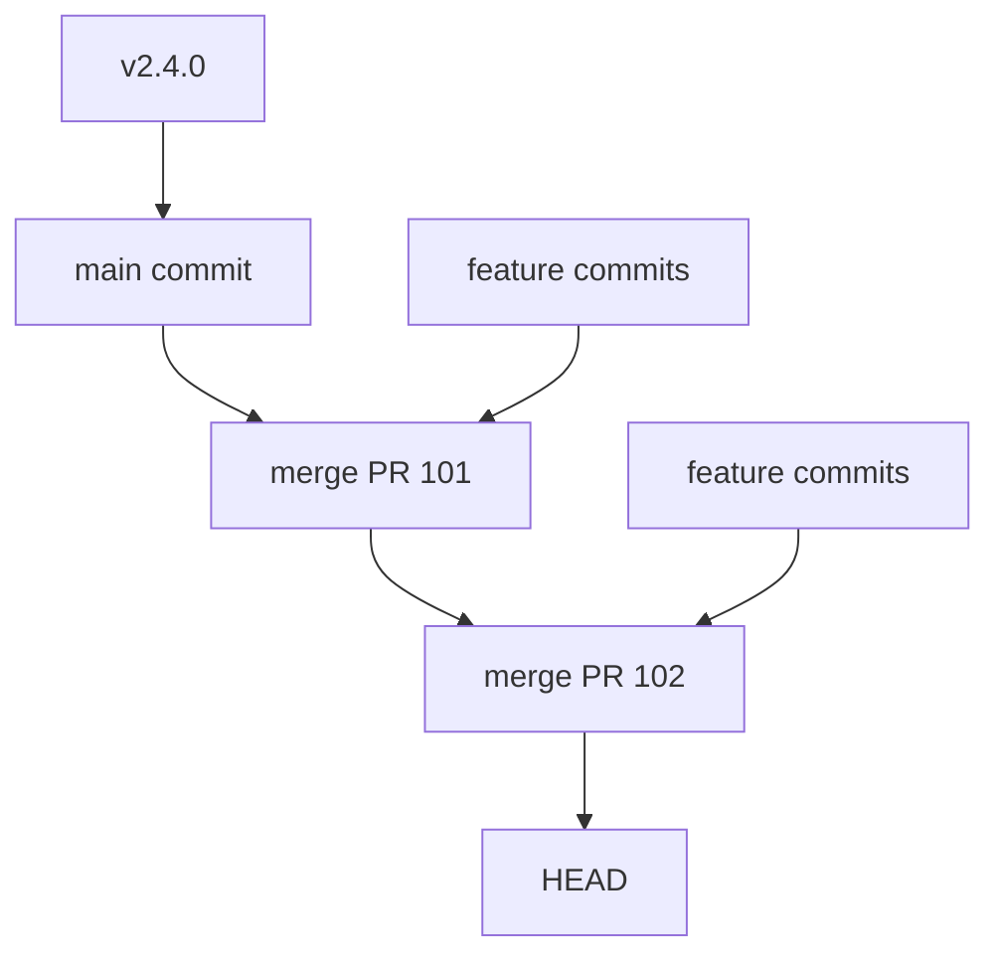
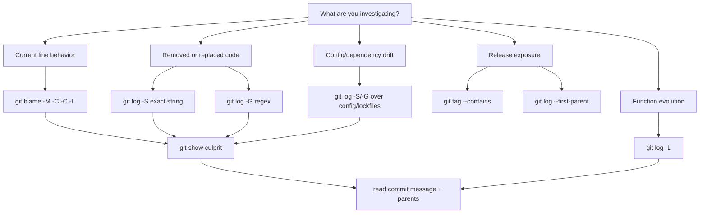

# Part 080 — Blame, Log, Pickaxe, and Code Archaeology

Part 079 membahas `git bisect` sebagai causal search.

`bisect` menjawab:

> Commit mana yang pertama mengubah property dari good menjadi bad?

Part ini menjawab pertanyaan berbeda:

> Mengapa kode ini ada? Kapan berubah? Siapa mengubahnya? Apa konteks keputusan saat itu? Apakah perubahan ini bagian dari refactor, bug fix, migration, hotfix, security patch, atau accidental drift?

Inilah code archaeology.

Tools utama:

```bash
git blame
git log
git show
git diff
git grep
git log -S
git log -G
git log -L
```

Tujuan bukan mencari orang untuk disalahkan.

Tujuan adalah membangun timeline teknis yang bisa dipercaya.

---

## 1. Core Mental Model

Git menyimpan snapshot dan commit graph.

Git tidak menyimpan “file identity” sebagai entitas permanen independen dari path.

Git tidak menyimpan “function history” sebagai konsep first-class.

Saat Anda bertanya:

```bash
git blame src/PolicyEngine.java
```

Git menghitung, dari history, commit mana yang terakhir mengubah setiap line.

Saat Anda bertanya:

```bash
git log -S 'hasSupervisorOverride'
```

Git mencari commit yang mengubah jumlah kemunculan string tersebut dalam diff.

Saat Anda bertanya:

```bash
git log -G 'hasSupervisorOverride\('
```

Git mencari commit whose patch lines match regex.

Ini bukan database semantik.

Ini toolkit untuk merekonstruksi sejarah dari snapshots dan diffs.

---

## 2. Code Archaeology Questions

Pertanyaan yang bagus:

- Kapan rule ini pertama kali ditambahkan?
- Apakah perubahan ini bug fix atau feature?
- Apakah line ini pernah dipindahkan dari file lain?
- Apakah behavior ini berubah saat migration tertentu?
- Commit mana yang menghapus guard clause?
- Apakah perubahan ini masuk via PR tertentu?
- Apakah perubahan ini sudah ada di release tag tertentu?
- Apakah line ini berasal dari mechanical refactor?
- Apakah culprit sebenarnya di config, lockfile, generated code, atau dependency?
- Apakah comment lama masih menjelaskan invariant saat ini?

Pertanyaan yang buruk:

- Siapa yang salah?
- Kenapa orang itu menulis ini?
- Kenapa Git tidak otomatis menjelaskan semua intent?

`git blame` memberi pointer.

Anda tetap harus membaca konteks.

---

## 3. `git blame`: Last Modifier per Line

Basic:

```bash
git blame src/main/java/com/acme/PolicyEngine.java
```

Output roughly:

```text
2f4a8c91 (Ayu 2026-04-12 14:20:11 +0700 102) if (actor.hasRole(SUPERVISOR)) {
9c10deaa (Bima 2026-05-03 09:18:40 +0700 103)     return Decision.allow();
```

Meaning:

```text
line 102 was last changed by commit 2f4a8c91
line 103 was last changed by commit 9c10deaa
```

Not meaning:

```text
that author invented the rule
that author owns the bug
that commit is causal
that line was not moved from elsewhere
```

Blame is starting point, not verdict.

---

## 4. Blame a Specific Range

Avoid blaming entire large file.

Use line ranges:

```bash
git blame -L 90,130 -- src/main/java/com/acme/PolicyEngine.java
```

Function-like range:

```bash
git blame -L :evaluateEscalation -- src/main/java/com/acme/PolicyEngine.java
```

Depending on language and hunk header detection, function matching can vary.

If function range is unreliable, use explicit lines.

With commit details:

```bash
git blame -L 90,130 --show-email --date=iso -- src/main/java/com/acme/PolicyEngine.java
```

With commit summary:

```bash
git blame -L 90,130 --line-porcelain -- src/main/java/com/acme/PolicyEngine.java \
  | sed -n '/^summary /p' \
  | sort \
  | uniq -c
```

---

## 5. Ignore Mechanical Formatting Commits

Mechanical formatting destroys blame signal.

Example:

```text
commit A: adds authorization rule
commit B: formats entire file
```

Naive blame points to B.

Use ignore revs.

Create `.git-blame-ignore-revs`:

```text
# 2026-03-12: apply spotless formatting to Java files
abc1234def5678...

# 2026-05-01: normalize import ordering
fedcba987654...
```

Run:

```bash
git blame --ignore-revs-file .git-blame-ignore-revs \
  -L 90,130 -- src/main/java/com/acme/PolicyEngine.java
```

Configure default:

```bash
git config blame.ignoreRevsFile .git-blame-ignore-revs
```

Team rule:

> If you run mechanical formatting, put the commit hash in `.git-blame-ignore-revs` and keep formatting commit separate from behavior changes.

This is why atomic commits matter.

---

## 6. Follow Renames and Moved Lines

Git can follow whole-file renames in blame.

For moved/copied lines, use `-M` and `-C`.

```bash
git blame -M -C -C -L 90,130 -- src/main/java/com/acme/PolicyEngine.java
```

Mental model:

- `-M` tries to detect moved/copied lines within a file;
- `-C` tries harder across files;
- repeated `-C` increases cross-file copy/move detection scope.

Do not blindly trust one run.

Compare:

```bash
git blame -L 90,130 -- file.java
git blame -M -C -C -L 90,130 -- file.java
```

If results differ, inspect both histories.

Rename/copy detection is heuristic.

It is useful, not absolute.

---

## 7. Blame Tells Last Touch, Pickaxe Finds Add/Delete History

`git blame` cannot tell you about lines that were deleted or replaced.

If a guard clause disappeared, blame current file may show nothing.

Use pickaxe.

Example removed line:

```java
if (!actor.hasPermission(CASE_ESCALATE)) throw new ForbiddenException();
```

Search exact string history:

```bash
git log --all -S 'CASE_ESCALATE' -- src/main/java
```

Show patches:

```bash
git log --all -p -S 'CASE_ESCALATE' -- src/main/java
```

Search regex in patch:

```bash
git log --all -p -G 'hasPermission\(.*CASE_ESCALATE' -- src/main/java
```

Key difference:

| Tool | Finds |
|---|---|
| `git blame` | last commit that changed current lines |
| `git log -S` | commits where occurrence count of string changed |
| `git log -G` | commits whose patch contains lines matching regex |
| `git log -L` | evolution of a line/function range |

---

## 8. `-S` vs `-G` Pickaxe

This distinction matters.

### `-S<string>`

Find commits that changed number of occurrences of exact string.

```bash
git log -S 'isSupervisorOverrideAllowed' --all -- src/
```

Good for:

- symbol introduced/removed;
- constant added/deleted;
- function call appears/disappears;
- config key introduced;
- feature flag added/removed.

Bad for:

- expression changed but same symbol count remains;
- rename without count change in same diff;
- whitespace/comment-only pattern;
- regex search.

### `-G<regex>`

Find commits whose patch text matches regex.

```bash
git log -G 'isSupervisorOverrideAllowed\s*=\s*true' --all -- config/
```

Good for:

- pattern mutation;
- condition changed;
- config value changed;
- regex over patch lines.

Potentially noisier than `-S`.

Use both when investigating.

---

## 9. Archaeology Workflow: Why Is This Line Here?

Start from line:

```bash
git blame -M -C -C -L 118,118 -- src/main/java/com/acme/PolicyEngine.java
```

Get commit:

```bash
COMMIT=2f4a8c91
```

Inspect full commit:

```bash
git show --stat --summary "$COMMIT"
git show --find-renames --find-copies "$COMMIT"
git show --format=fuller --no-patch "$COMMIT"
```

Inspect surrounding history:

```bash
git log --oneline --decorate --graph "$COMMIT"~5.."$COMMIT"~5
```

Better:

```bash
git log --oneline --decorate --graph --ancestry-path "$COMMIT"..HEAD -- src/main/java/com/acme/PolicyEngine.java
```

Find PR/merge context:

```bash
git log --merges --oneline --ancestry-path "$COMMIT"..HEAD
```

Check releases:

```bash
git tag --contains "$COMMIT"
git branch --contains "$COMMIT"
```

Search linked issue/commit trailer:

```bash
git show -s --format='%B' "$COMMIT"
```

Conclusion should include:

- line origin;
- surrounding change;
- reason from commit message/PR if available;
- release exposure;
- whether current behavior still matches original invariant.

---

## 10. Archaeology Workflow: Who Removed This Guard?

You remember this line used to exist:

```java
requireSupervisorApproval(caseId, actor);
```

Search:

```bash
git log --all -p -S 'requireSupervisorApproval' -- src/
```

If symbol renamed:

```bash
git log --all -p -G 'Supervisor.*Approval|Approval.*Supervisor' -- src/
```

If file moved:

```bash
git log --all --follow -- src/main/java/com/acme/OldPolicyEngine.java
```

But `--follow` is single-path oriented and has limitations.

For broader history:

```bash
git log --all --name-status --find-renames -- src/main/java/com/acme
```

Once commit found:

```bash
git show --stat --patch <commit>
git show --format=fuller --no-patch <commit>
```

Then ask:

- Was guard intentionally removed?
- Was it replaced by central middleware?
- Was it removed due to migration?
- Was it hidden behind feature flag?
- Did tests change in same commit?
- Did docs/policy change?
- Did approval come from CODEOWNERS/security reviewer?

The actual answer may be:

> The guard was not removed; it moved into `AuthorizationInterceptor` in commit X, then that interceptor was bypassed in commit Y.

That is why archaeology chains tools.

---

## 11. `git log` as Query Engine

`git log` is not only “show commits”.

It is a history query engine.

### By path

```bash
git log --oneline -- src/main/java/com/acme/authz
```

### By author

```bash
git log --author='@company.com' --since='6 months ago'
```

### By message

```bash
git log --grep='CVE\|security\|authorization' --all --extended-regexp
```

### By content change

```bash
git log -S 'ForbiddenException' --all -- src/
```

### By patch regex

```bash
git log -G 'return\s+Decision\.allow\(' --all -- src/
```

### By first-parent release history

```bash
git log --first-parent --oneline v2.4.0..main
```

### By ancestry path

```bash
git log --ancestry-path <old>..<new>
```

### By merge commits only

```bash
git log --merges --first-parent --oneline v2.4.0..main
```

### By non-merge commits only

```bash
git log --no-merges --oneline v2.4.0..main
```

### By file status

```bash
git log --diff-filter=D --summary -- src/
git log --diff-filter=R --summary -- src/
```

You should think of `git log` as a programmable lens over the commit DAG.

---

## 12. `git show`: Commit-Level Inspection

Once you have a commit, inspect it from multiple angles.

```bash
git show <commit>
```

Better for archaeology:

```bash
git show --stat --summary <commit>
git show --name-status <commit>
git show --find-renames --find-copies <commit>
git show --word-diff <commit>
git show --color-moved <commit>
git show --format=fuller <commit>
```

For merge commit:

```bash
git show --cc <merge>
git show -m <merge>
git show -m --first-parent <merge>
```

For commit metadata only:

```bash
git show -s --format=fuller <commit>
git show -s --format='%H%n%an <%ae>%n%ad%n%s%n%n%b' <commit>
```

Read commit message first.

Then read diff.

Then read parent context.

---

## 13. Use `git log -L` for Function/Line Evolution

`git log -L` traces evolution of a line range or function.

Example:

```bash
git log -L :evaluateEscalation:src/main/java/com/acme/PolicyEngine.java
```

Or explicit lines:

```bash
git log -L 90,130:src/main/java/com/acme/PolicyEngine.java
```

Good for:

- seeing how a function evolved;
- reviewing semantic drift;
- finding when a condition changed;
- understanding incremental policy relaxation.

Limitations:

- function detection depends on diff hunk header/language configuration;
- large refactors can confuse continuity;
- rename/move may require additional options or manual search;
- output can be noisy.

Use `log -L` when you care about evolution of a code region, not just one line’s last touch.

---

## 14. Combining `blame` and `show`

A practical one-liner:

```bash
COMMIT=$(git blame -L 118,118 --porcelain -- src/main/java/com/acme/PolicyEngine.java \
  | sed -n '1s/ .*//p')

git show --stat --patch "$COMMIT"
```

But do not automate away thinking.

If blame points to formatting commit, use ignore revs.

If blame points to move commit, use `-M -C` and pickaxe.

If blame points to merge commit, inspect parents.

If blame points to generated file, inspect generator input.

---

## 15. First-Parent History for Release Archaeology

When asking “what reached main/release?”, use first-parent.

```bash
git log --first-parent --oneline v2.4.0..main
```

Why?

In a merge-commit workflow, first-parent follows the mainline integration path.



First-parent answers:

```text
Which integration events changed main?
```

Without first-parent, you see every internal feature commit mixed into main history.

For release notes, incident timeline, and merge queue debugging, first-parent is often the right lens.

For finding internal culprit inside PR, non-first-parent history may be needed.

---

## 16. Two-Dot and Three-Dot in Archaeology

Recall Part 046.

For commits reachable from B but not A:

```bash
git log A..B
```

For commits reachable from either side but not both:

```bash
git log A...B
```

For diff from merge-base to B:

```bash
git diff A...B
```

For direct tree diff A vs B:

```bash
git diff A..B
# equivalent to git diff A B for diff semantics
```

In archaeology, wrong range creates wrong story.

Examples:

```bash
# What changed on branch since it forked from main?
git diff main...feature

# What commits are on feature but not main?
git log main..feature

# What commits differ between both branches?
git log --left-right main...feature

# What went into release after v2.4.0 along mainline?
git log --first-parent v2.4.0..release/2.5
```

Be explicit about whether you are asking about commits or tree diff.

---

## 17. Finding When a File Was Deleted

```bash
git log --diff-filter=D --summary -- path/to/file
```

If path unknown:

```bash
git log --all --diff-filter=D --summary -- '*PolicyEngine*'
```

Show deletion patch:

```bash
git show <delete-commit> -- path/to/file
```

Recover file from parent:

```bash
git show <delete-commit>^:path/to/file > /tmp/file.before-delete
```

Or restore into working tree:

```bash
git restore --source=<delete-commit>^ -- path/to/file
```

Then inspect why:

```bash
git show --format=fuller --stat <delete-commit>
```

Deletion may be:

- intentional migration;
- rename;
- generated file cleanup;
- accidental delete;
- repo split;
- vendor code removal;
- security takedown.

Do not infer from deletion alone.

---

## 18. Finding Renames

```bash
git log --follow -- path/to/current-file
```

But `--follow` works on a single path and has limitations.

For rename-heavy investigation:

```bash
git log --name-status --find-renames --all -- path/to/area
```

For specific commit:

```bash
git show --name-status --find-renames <commit>
```

Tune similarity if needed:

```bash
git log --find-renames=40% --name-status -- path/to/file
```

Lower threshold may detect more renames but increase false positives.

Higher threshold may miss heavy rewrite renames.

Best practice:

> Commit pure rename separately from content changes.

That preserves archaeology signal.

---

## 19. Finding When Config Changed

Config drift often causes production incidents.

Search for key:

```bash
git log --all -p -S 'authorization.supervisorOverride' -- config/ deploy/ helm/
```

Search for value pattern:

```bash
git log --all -p -G 'supervisorOverride:\s*true' -- config/ deploy/ helm/
```

Find releases containing change:

```bash
COMMIT=<config-change>
git tag --contains "$COMMIT"
git branch --contains "$COMMIT"
```

Compare environment folders:

```bash
git diff v2.4.0..v2.5.0 -- deploy/prod deploy/staging
```

Watch for environment-branch anti-pattern:

```text
prod branch has direct config edits not present in main
```

Then archaeology must include both Git history and deployment history.

---

## 20. Finding Dependency-Introduced Behavior

Sometimes no source code changed.

Dependency did.

Search lockfiles/manifests:

```bash
git log --all -p -- package-lock.json pnpm-lock.yaml yarn.lock pom.xml build.gradle gradle.lockfile go.mod go.sum
```

Search dependency name:

```bash
git log --all -p -S 'spring-security' -- build.gradle gradle.lockfile pom.xml
```

Search CVE/security update message:

```bash
git log --all --grep='CVE\|security\|dependency\|bump' --extended-regexp
```

If behavior changed in transitive dependency, culprit may be a lockfile update.

Treat lockfile diff as code review surface.

---

## 21. Finding Introduced Secrets or Sensitive Text

For incident response:

```bash
git log --all -p -S 'AKIA' -- .
git log --all -p -G 'secret|password|private_key' -- .
```

But do not paste real secrets into commands stored in shell history.

Safer:

```bash
PATTERN_FILE=/tmp/secret-regex.txt
printf '%s\n' 'AKIA[0-9A-Z]{16}' > "$PATTERN_FILE"

git log --all -p -G "$(cat "$PATTERN_FILE")" -- .
```

For large-scale scanning, use dedicated secret scanning tools.

Git archaeology helps identify:

- first introduction commit;
- branches/tags containing secret;
- removal commit;
- whether rewrite is needed;
- who needs to rotate credentials.

Remember:

> Removing a secret from latest commit does not remove it from history.

---

## 22. Archaeology for Regulated Systems

For enforcement/case management systems, code archaeology must answer evidentiary questions.

Example:

> When did rule “case escalation requires supervisor role” change, who approved it, and which release contained it?

Workflow:

```bash
# 1. Search code symbol.
git log --all -p -S 'requiresSupervisorRole' -- src/

# 2. Search policy text/config.
git log --all -p -G 'supervisor.*role|role.*supervisor' -- src/ config/ docs/

# 3. Inspect candidate commits.
git show --format=fuller --stat --patch <commit>

# 4. Find merge/integration event.
git log --merges --first-parent --ancestry-path <commit>..main

# 5. Find release exposure.
git tag --contains <commit>

# 6. Find associated review metadata.
git show -s --format='%B' <commit>
```

Evidence record should include:

- commit hash;
- parent hash;
- author/committer;
- timestamp;
- diff summary;
- full patch or hash of patch;
- PR/review reference;
- release tag;
- runtime artifact hash if available;
- whether change was policy, implementation, config, or test.

Do not rely only on current code.

Regulatory defensibility depends on traceable change history.

---

## 23. Reading Commit Message as Evidence

Good commit messages make archaeology easy.

Bad:

```text
fix stuff
```

Useful:

```text
Require supervisor approval for cross-team case escalation

Previously, an investigator could escalate a closed case from another team
when they owned an earlier task. This violated escalation rule ER-42.

This changes PolicyEngine to require SUPERVISOR role for cross-team escalation
when case state is CLOSED or UNDER_REVIEW.

Decision record: ADR-0142
Risk: authorization boundary
Tests: AuthorizationBoundaryTest
```

Archaeology commands:

```bash
git show -s --format='%B' <commit>
git log --grep='ER-42\|ADR-0142\|AuthorizationBoundary' --all
```

Commit messages are part of the engineering record.

They are not decoration.

---

## 24. Timeline Reconstruction

Often you need a timeline, not just one commit.

Example:

```bash
git log --date=iso --pretty=format:'%ad %h %an %s' \
  --first-parent v2.4.0..main \
  -- src/main/java/com/acme/authz config/security.yml
```

Include patches for candidates:

```bash
git log --date=iso --stat --patch \
  --grep='authz\|authorization\|permission' \
  --extended-regexp \
  v2.4.0..main
```

For release boundary:

```bash
git log --first-parent --oneline v2.4.0..v2.5.0
```

For a specific symbol:

```bash
git log --date=iso --pretty=format:'%ad %h %s' -S 'Permission.CASE_ESCALATE' --all -- src/ config/
```

Timeline output should separate:

- observed incident time;
- commit author time;
- commit committer time;
- merge time;
- release tag time;
- deployment time.

Git alone does not know deployment time unless your deployment metadata is committed or tagged.

---

## 25. `git grep` + History Search

Current code search:

```bash
git grep -n 'CASE_ESCALATE'
```

Search specific revision:

```bash
git grep -n 'CASE_ESCALATE' v2.4.0 -- src/
```

Search all branches is trickier.

Use `git log -S` or `git grep` over refs selectively:

```bash
for ref in $(git for-each-ref --format='%(refname)' refs/heads refs/remotes); do
  git grep -n 'CASE_ESCALATE' "$ref" -- src/ || true
done
```

For large repos, be careful: this can be expensive.

Use targeted refs or pathspecs.

---

## 26. Archaeology Anti-Patterns

### Anti-pattern 1: Blame and stop

```bash
git blame file.java
# conclude author caused bug
```

Wrong.

Blame is a pointer, not proof.

### Anti-pattern 2: Ignore merge context

A line may be correct in branch but wrong after merge.

Inspect integration event.

### Anti-pattern 3: Trust current filename

File may have moved, split, or merged.

Use rename detection and pickaxe.

### Anti-pattern 4: Ignore config and dependencies

Behavior may change without source code diff.

Search config, lockfiles, generated code, deployment manifests.

### Anti-pattern 5: Use wrong range

`git log A..B` and `git diff A...B` answer different questions.

### Anti-pattern 6: Treat timestamps as absolute truth

Author date and committer date differ.

Rebase/cherry-pick can preserve author date but change committer date.

Use both.

### Anti-pattern 7: Forget release exposure

A bad commit that never reached release may not be production culprit.

Use:

```bash
git tag --contains <commit>
git branch --contains <commit>
```

---

## 27. Practical Query Recipes

### Find when string was introduced or removed

```bash
git log --all -p -S 'SomeSymbol' -- path/
```

### Find when regex pattern appeared in patch

```bash
git log --all -p -G 'Some.*Regex' -- path/
```

### Find current line origin

```bash
git blame -M -C -C -L 120,140 -- path/file.java
```

### Trace function evolution

```bash
git log -L :functionName:path/file.java
```

### Ignore formatting commits

```bash
git blame --ignore-revs-file .git-blame-ignore-revs -L 120,140 -- path/file.java
```

### Find deletion of a file

```bash
git log --diff-filter=D --summary -- path/file.java
```

### Find renames

```bash
git log --name-status --find-renames -- path/file.java
```

### Inspect merge commit

```bash
git show --cc <merge>
git show -m <merge>
```

### Find release exposure

```bash
git tag --contains <commit>
git branch --contains <commit>
```

### Find commits touching path between releases

```bash
git log --oneline v2.4.0..v2.5.0 -- path/
```

### Find mainline integrations between releases

```bash
git log --first-parent --oneline v2.4.0..v2.5.0
```

---

## 28. Mini Lab: Track a Removed Guard

```bash
mkdir /tmp/git-archaeology-lab
cd /tmp/git-archaeology-lab
git init

mkdir -p src
cat > src/policy.js <<'EOF'
function canEscalate(user, kase) {
  if (!user.roles.includes('SUPERVISOR')) {
    return false;
  }
  return kase.state === 'OPEN';
}
EOF

git add src/policy.js
git commit -m 'Require supervisor role for escalation'

git tag v1-good

cat > src/policy.js <<'EOF'
function canEscalate(user, kase) {
  // state validation moved to workflow layer
  if (!user.roles.includes('SUPERVISOR')) {
    return false;
  }
  return true;
}
EOF

git add src/policy.js
git commit -m 'Move case state validation out of policy engine'

cat > src/policy.js <<'EOF'
function canEscalate(user, kase) {
  // temporary relaxation for legacy queue migration
  return true;
}
EOF

git add src/policy.js
git commit -m 'Relax escalation during legacy queue migration'
```

Find current line origin:

```bash
git blame src/policy.js
```

Find when role guard disappeared:

```bash
git log -p -S "roles.includes('SUPERVISOR')" -- src/policy.js
```

Find state check removal:

```bash
git log -p -S "kase.state === 'OPEN'" -- src/policy.js
```

Trace function:

```bash
git log -L :canEscalate:src/policy.js
```

Exercise:

- Which commit removed state validation?
- Which commit removed supervisor guard?
- Which commit is more dangerous?
- What regression test should be added?
- Which commit message gives better domain context?

---

## 29. Building a Forensic Note

A useful archaeology output is not a pile of command output.

It is a concise, evidence-backed note.

Template:

```md
## Finding

The supervisor-role guard for case escalation was removed in commit `<hash>`.

## Evidence

- `git log -S 'roles.includes('SUPERVISOR')' -- src/policy.js` identifies `<hash>`.
- `git show <hash>` shows the guard removed without replacement in the same file.
- `git tag --contains <hash>` shows the change is included in `v2.5.0` and later.
- No corresponding policy migration appears in `config/` or `docs/` within the same commit.

## Interpretation

The commit message says the relaxation was temporary for legacy queue migration.
No follow-up commit reintroduced the guard.
The current behavior violates escalation rule ER-42.

## Recommended Remediation

- Add regression test for cross-team closed-case escalation.
- Reintroduce authorization guard in PolicyEngine or central interceptor.
- Audit releases `v2.5.0` through `v2.5.3`.
```

This is the difference between browsing history and doing engineering forensics.

---

## 30. Code Archaeology Decision Tree



---

## 31. How This Connects to Bisect

`bisect` finds boundary.

Archaeology explains boundary.

Typical incident flow:

```bash
# 1. Find culprit boundary.
git bisect start HEAD v2.4.0 --
git bisect run ./scripts/repro.sh
CULPRIT=$(git rev-parse refs/bisect/bad)
git bisect reset

# 2. Explain culprit.
git show --stat --patch "$CULPRIT"
git show -s --format='%B' "$CULPRIT"

# 3. Find exposure.
git tag --contains "$CULPRIT"
git branch --contains "$CULPRIT"

# 4. Search related symbols/config.
git log --all -p -S 'RelatedSymbol' -- src/ config/
```

Causal boundary plus historical explanation gives a remediation plan.

---

## 32. Team Practices That Improve Archaeology

- Keep behavior changes separate from formatting/refactor commits.
- Use meaningful commit messages.
- Reference issue/ADR/security ticket in commit body or trailers.
- Put mechanical commit hashes in `.git-blame-ignore-revs`.
- Commit pure renames separately from content changes.
- Avoid mixing lockfile bump, feature, and formatting in one commit.
- Preserve release tags.
- Embed commit SHA in runtime artifact.
- Use first-parent merge commits if you need integration-level release traceability.
- Keep CODEOWNERS/review metadata tied to sensitive paths.

Good history is not aesthetic.

Good history reduces incident cost.

---

## 33. Commands Worth Memorizing

```bash
# Current line origin.
git blame -L 10,30 -- path/file

# Better blame across movement/copy.
git blame -M -C -C -L 10,30 -- path/file

# Ignore formatting commits.
git blame --ignore-revs-file .git-blame-ignore-revs -L 10,30 -- path/file

# Exact string add/remove history.
git log --all -p -S 'SomeSymbol' -- path/

# Regex patch history.
git log --all -p -G 'Some.*Regex' -- path/

# Function evolution.
git log -L :functionName:path/file

# Path history.
git log --oneline -- path/

# Rename-aware path history.
git log --name-status --find-renames -- path/

# Single-file follow.
git log --follow -- path/file

# File deletion.
git log --diff-filter=D --summary -- path/file

# First-parent release history.
git log --first-parent --oneline v1.0.0..v1.1.0

# Exposure.
git tag --contains <commit>
git branch --contains <commit>

# Commit detail.
git show --stat --patch --find-renames <commit>
```

---

## 34. References

- Git documentation: `git blame` — https://git-scm.com/docs/git-blame
- Git documentation: `git log` — https://git-scm.com/docs/git-log
- Git documentation: `git diff` — https://git-scm.com/docs/git-diff
- Git documentation: `git show` — https://git-scm.com/docs/git-show
- Git documentation: `gitrevisions` — https://git-scm.com/docs/gitrevisions

---

## 35. Summary

Code archaeology is disciplined history investigation.

Use:

```text
git blame     -> who last touched current lines
git log -S    -> where exact string count changed
git log -G    -> where patch matched regex
git log -L    -> how a line/function evolved
git show      -> what commit actually did
git tag --contains / branch --contains -> where change is exposed
```

The goal is not blame.

The goal is explanation.

A top-tier engineer can look at a system, identify a suspicious behavior, reconstruct the relevant historical chain, distinguish mechanical change from semantic change, and produce an evidence-backed remediation plan.

Next part: debugging regressions with history by combining bisect, blame, diff, range-diff, release tags, and runtime metadata into one investigation workflow.
