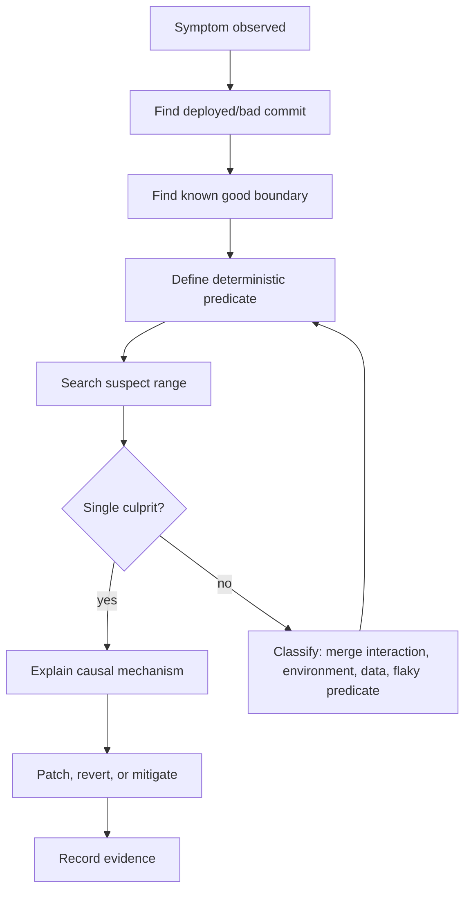
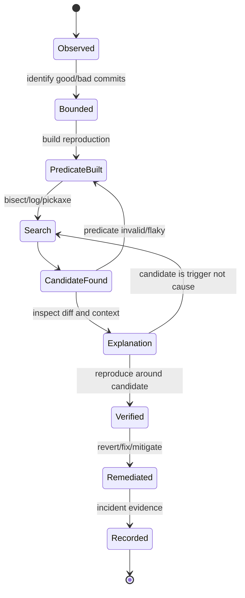
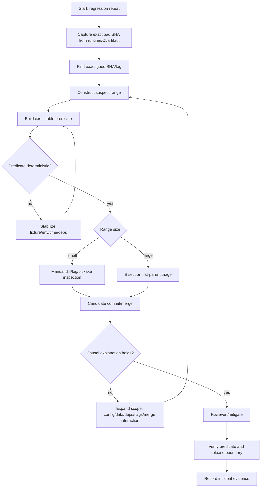

# Part 081 — Debugging Regressions with History

> A regression is not merely a broken behavior. A regression is evidence that a property which used to hold no longer holds at a later commit.

Git becomes powerful for debugging when you stop asking:

```txt
Who touched this file?
```

and start asking:

```txt
Between which two known-good/known-bad states did this property change,
what exact commit introduced the change,
and what larger system assumption made that change unsafe?
```

This part is about using Git history as an investigation system.

You already learned:

- `bisect` as binary search over history.
- `blame` for line-level provenance.
- `log`, pickaxe, and `log -L` for code archaeology.
- release tags as history boundaries.
- commit ranges and merge-base semantics.

Now we combine them into a practical incident-grade debugging workflow.

---

## 1. Regression Debugging Mental Model

A regression investigation has four core objects:

| Object | Meaning | Git representation |
|---|---|---|
| Known good state | Last commit/tag/build where the property held | tag, commit SHA, release branch tip, artifact metadata |
| Known bad state | First observed commit/build where the property failed | deployed SHA, failed CI SHA, bug report SHA |
| Predicate | Testable statement that classifies a commit as good or bad | shell script, test command, replay script, benchmark threshold |
| Suspect range | Commit set where the cause must exist | `good..bad`, merge-base to head, release-tag range |

A good investigation narrows uncertainty.

A bad investigation expands speculation.



### Important distinction

A commit can be:

| Classification | Meaning |
|---|---|
| Symptom commit | First commit where you noticed the bug |
| Trigger commit | Commit that exposed an already-existing weakness |
| Causal commit | Commit that introduced the unsafe behavior |
| Fix commit | Commit that restores the property |
| Mitigation commit | Commit that reduces impact without fully fixing root cause |

Git can help identify candidates.

Git cannot prove business causality alone.

You still need domain reasoning.

---

## 2. Regression Investigation Invariants

Before using commands, protect these invariants:

1. **Never debug from a dirty working tree unless dirtiness is intentional and documented.**
2. **Always identify exact commit SHA for good and bad states.**
3. **Never rely on branch names alone for historical evidence.** Branches move.
4. **Never assume file-level history equals behavior-level history.**
5. **Never call the first suspicious commit the root cause until the predicate is validated.**
6. **Always distinguish source regression from environment/data/config regression.**

Use this preflight:

```bash
# Confirm local state
git status --short --branch

# Confirm exact current commit
git rev-parse --verify HEAD^{commit}

# Confirm working tree has no accidental local changes
git diff --check
git diff --stat
git diff --cached --stat
```

For incident work, create a dedicated investigation branch:

```bash
git switch -c investigate/REG-482-payment-timeout HEAD
```

The branch is not for fixes yet.

It is for notes, scripts, reproduction harnesses, and safe local experiments.

---

## 3. Step Zero: Capture the Failure as an Executable Predicate

The investigation is only as good as the predicate.

A predicate is a command that answers:

```txt
Does this commit have the regression?
```

Examples:

```bash
./gradlew test --tests PaymentTimeoutRegressionTest
```

```bash
npm test -- payment-timeout.spec.ts
```

```bash
./scripts/replay-prod-case.sh cases/REG-482.json
```

```bash
./scripts/benchmark-check.sh --max-p95-ms 250
```

### Good predicate properties

| Property | Why it matters |
|---|---|
| Deterministic | Bisect becomes meaningless if result flips randomly |
| Fast enough | Search may run many times |
| Isolated | Reduces environment noise |
| Commit-compatible | Works across historical revisions or gracefully skips |
| Binary result | Good/bad classification must be clear |
| Domain-representative | Avoids proving the wrong thing |

### Bad predicate example

```bash
curl https://staging.company.test/payments
```

This is weak because result may depend on live staging state, database content, feature flags, network, deployed backend, cache, or credentials.

### Better predicate example

```bash
./scripts/start-local-stack.sh
./scripts/replay-payment-case.sh fixtures/regression-482.json
./scripts/assert-ledger-invariant.sh
```

This is better because it pins the scenario.

---

## 4. Find Good and Bad Anchors

Regression debugging begins with boundaries.

Common anchors:

| Anchor | Example | Reliability |
|---|---|---|
| Release tag | `v2.18.0` | high if tags are immutable |
| Deployed SHA | runtime `/version` endpoint | high if build metadata is trustworthy |
| CI build SHA | build logs/artifact metadata | high if checkout is correct |
| Branch tip | `origin/main` | low as evidence because it moves |
| Date | `main@{2026-07-01}` | local reflog only; weak for shared evidence |

Prefer exact SHAs:

```bash
GOOD=$(git rev-parse --verify v2.18.0^{commit})
BAD=$(git rev-parse --verify 9f1c2ab^{commit})

echo "GOOD=$GOOD"
echo "BAD=$BAD"
```

If the user report says "worked last week", do not bisect from a date immediately.

Convert date to candidate commits:

```bash
git log --since='2026-06-24' --until='2026-07-01' --oneline --first-parent main
```

Then reproduce against exact commits.

---

## 5. Suspect Range Construction

The simplest range:

```bash
git log --oneline GOOD..BAD
```

Meaning:

```txt
commits reachable from BAD that are not reachable from GOOD
```

But real systems need nuance.

### Release-to-release range

```bash
git log --oneline v2.18.0..v2.19.0
```

Useful for release regression.

### First-parent integration range

```bash
git log --first-parent --oneline v2.18.0..v2.19.0
```

Useful when you want integration commits into the release line, not every feature branch commit.

### Full suspect history

```bash
git log --oneline --graph --decorate v2.18.0..v2.19.0
```

Useful when you need all commits, including feature branch internals.

### File-scoped suspect range

```bash
git log --oneline v2.18.0..v2.19.0 -- src/payments src/risk
```

Danger: file-scoped history can miss cross-cutting causes:

- config changes
- dependency upgrades
- database migration
- build flags
- generated code
- shared library behavior
- feature flag default

Use path filters as narrowing tools, not proof.

---

## 6. The Regression Debugging Loop

The loop is:

```txt
observe -> bound -> search -> explain -> verify -> remediate -> record
```



A regression investigation is not complete when you find a commit.

It is complete when you can explain:

```txt
Before commit X, invariant Y held because Z.
After commit X, invariant Y fails because the change altered A while assuming B.
The fix/revert/mitigation restores Y by doing C.
```

---

## 7. Automated Bisect Workflow

Manual bisect:

```bash
git bisect start

git bisect bad $BAD
git bisect good $GOOD

# Git checks out candidate commits.
# You run predicate manually:
./scripts/reproduce-regression.sh

# Then mark:
git bisect bad
# or
git bisect good
```

Automated bisect:

```bash
git bisect start $BAD $GOOD
git bisect run ./scripts/reproduce-regression.sh
```

The script should follow exit-code discipline:

```bash
#!/usr/bin/env bash
set -euo pipefail

# Build may not work for old commits that predate the test harness.
if ! ./scripts/bootstrap.sh; then
  exit 125 # skip this commit
fi

if ./scripts/replay-prod-case.sh cases/REG-482.json; then
  exit 0   # good
else
  exit 1   # bad
fi
```

`125` tells `git bisect run` to skip unsuitable commits.

### Do not use `set -e` blindly

A failing test may be the expected signal.

This is safer:

```bash
#!/usr/bin/env bash
set -uo pipefail

./gradlew test --tests PaymentRegressionTest
status=$?

case "$status" in
  0) exit 0 ;;
  1) exit 1 ;;
  *) exit 125 ;;
esac
```

---

## 8. Bisecting Merge Histories

Merge-heavy histories introduce complications.

A merge commit can be the first bad commit because:

1. The merge itself resolved conflict incorrectly.
2. Two independently safe branches interact badly.
3. The merge brought in a bad feature commit.
4. The predicate only fails in the merged topology.

Inspect first-parent timeline:

```bash
git log --first-parent --oneline GOOD..BAD
```

Then inspect the merge commit:

```bash
git show --cc <merge-sha>
```

Show parents:

```bash
git show --no-patch --pretty=raw <merge-sha>
```

Compare each parent to merge result:

```bash
git diff <merge-sha>^1 <merge-sha> --stat
git diff <merge-sha>^2 <merge-sha> --stat
```

If merge resolution is suspicious:

```bash
git show --remerge-diff <merge-sha>
```

When available, remerge diff can expose conflict-resolution choices more clearly than a normal combined diff.

### Merge regression classification

| Observation | Likely cause |
|---|---|
| Parent 1 good, parent 2 bad | bad feature branch imported |
| Both parents good, merge bad | semantic interaction or bad conflict resolution |
| Merge diff touches conflict file manually | resolution error likely |
| Merge has huge generated diff | generated artifact conflict risk |
| Merge only changes lockfile | dependency graph risk |

---

## 9. Using Tags as Release Regression Boundaries

A release regression often starts with:

```txt
v2.19.0 has the bug; v2.18.0 did not.
```

Start with release-level range:

```bash
git log --first-parent --oneline v2.18.0..v2.19.0
```

Show release diff summary:

```bash
git diff --stat v2.18.0..v2.19.0
```

Show changed files:

```bash
git diff --name-status v2.18.0..v2.19.0
```

Search high-risk surfaces:

```bash
git diff --name-status v2.18.0..v2.19.0 -- \
  ':(top)src/auth' \
  ':(top)src/payments' \
  ':(top)config' \
  ':(top)migrations' \
  ':(top)package-lock.json' \
  ':(top)pom.xml'
```

Then decide:

| Result | Next move |
|---|---|
| Very small range | inspect manually |
| Medium range with test predicate | bisect |
| Large merge-heavy range | first-parent triage, then bisect inside suspect branch |
| Sensitive area changed | audit-sensitive-change workflow |
| No source change explains behavior | investigate runtime config/data/dependency/environment |

---

## 10. Using `blame` Without Falling Into Blame Thinking

`git blame` answers:

```txt
Which commit last changed this line?
```

It does not answer:

```txt
Who caused the incident?
```

Use blame to find context:

```bash
git blame -L 120,170 -- src/payments/RetryPolicy.java
```

Then inspect the commit:

```bash
git show --stat <sha>
git show <sha> -- src/payments/RetryPolicy.java
```

Follow movement:

```bash
git blame -M -C -L 120,170 -- src/payments/RetryPolicy.java
```

### Blame trap

Suppose a line says:

```java
private static final Duration TIMEOUT = Duration.ofMillis(250);
```

`git blame` says it was last changed two years ago.

But the regression happened yesterday.

Possible causes:

- new caller path increases load
- config override changed
- retry count changed elsewhere
- network dependency changed
- thread pool saturation changed
- migration changed data distribution
- feature flag enabled a path

Line provenance is not system causality.

---

## 11. Pickaxe for Concept-Level Search

Pickaxe finds commits that add/remove occurrences of a string or regex-like pattern.

Search for a symbol:

```bash
git log -S'TimeoutPolicy' --oneline -- src
```

Search for a semantic pattern:

```bash
git log -G'retry|timeout|backoff' --oneline -- src/payments
```

Show patch:

```bash
git log -S'TimeoutPolicy' -p -- src
```

Search full change set when the match appears:

```bash
git log -S'TimeoutPolicy' --pickaxe-all --stat
```

### When to use `-S`

Use `-S` when you search for count changes of a specific string:

```bash
git log -S'ROLE_ADMIN'
```

### When to use `-G`

Use `-G` when you search patch lines by regex:

```bash
git log -G'hasPermission\(|authorize\('
```

### Pickaxe failure modes

| Failure | Example |
|---|---|
| Renamed concept | `TimeoutPolicy` became `DeadlinePolicy` |
| Generated code | source of truth changed elsewhere |
| Config-driven behavior | code unchanged, config changed |
| Dependency behavior | library upgrade changed semantics |
| Feature flag | dormant code became active |
| Data-dependent bug | no relevant source text changed |

Pickaxe is a high-signal search tool.

It is not an oracle.

---

## 12. Debugging Performance Regressions

Performance regressions need stronger predicates.

A unit test that says "pass" is insufficient.

You need threshold and noise control:

```bash
./scripts/bench-payment-routing.sh --warmup 20 --runs 100 --max-p95-ms 80
```

But Git history search over performance is tricky because old commits may have different benchmark harnesses.

### Performance bisect script skeleton

```bash
#!/usr/bin/env bash
set -uo pipefail

if ! ./scripts/bootstrap-benchmark.sh; then
  exit 125
fi

result=$(./scripts/bench-critical-path.sh --json || true)

if [ -z "$result" ]; then
  exit 125
fi

p95=$(echo "$result" | jq -r '.p95_ms')

# Threshold chosen from known-good baseline + tolerance.
awk -v p95="$p95" 'BEGIN { exit (p95 <= 120 ? 0 : 1) }'
```

### Git commands useful for performance regressions

```bash
# Search dependency and config changes
git log --oneline -- package-lock.json pom.xml build.gradle go.mod Cargo.lock

# Search algorithm-sensitive code
git log -G'for \(|while \(|parallel|cache|memo|index' -- src

# See path churn in suspect range
git diff --stat GOOD..BAD
```

### Performance investigation checklist

- Did data volume change?
- Did index/DB query plan change?
- Did dependency version change?
- Did default config change?
- Did logging level change?
- Did serialization format change?
- Did concurrency limit change?
- Did cache key or invalidation change?
- Did a branch merge introduce interaction between two safe changes?

Git can identify code/config candidates.

It cannot measure production load by itself.

---

## 13. Debugging Security Regressions

Security regressions often do not manifest as failing tests.

Examples:

- authorization check removed
- token validation weakened
- sensitive field logged
- TLS verification disabled
- dependency version downgraded
- admin route exposed
- feature flag default changed

Use sensitive-surface search:

```bash
git log --oneline GOOD..BAD -- \
  src/auth src/security config deploy .github/workflows
```

Pickaxe dangerous terms:

```bash
git log -G'permitAll|disable|skip|insecure|verify=false|admin|role|permission|token|secret|password' \
  --oneline GOOD..BAD
```

Search for removed checks:

```bash
git log -S'hasPermission' --oneline GOOD..BAD -- src
```

Search release diff:

```bash
git diff GOOD..BAD -- src/auth src/security config
```

Security debugging needs a different output:

```txt
Impact window: commits/releases affected.
Exposure condition: who could trigger it.
Control bypassed: which check failed or was weakened.
Evidence: exact commit/range/config diff.
Remediation: revert/fix/secret rotation/rule hardening.
Prevention: test/policy/hook/branch protection.
```

---

## 14. Debugging Config Regressions

Many regressions are not code regressions.

They are configuration regressions.

Search config paths:

```bash
git log --oneline GOOD..BAD -- \
  config \
  deploy \
  helm \
  k8s \
  terraform \
  .github/workflows \
  docker-compose.yml \
  Dockerfile
```

Show config diff:

```bash
git diff GOOD..BAD -- config deploy helm k8s terraform
```

Search dangerous config changes:

```bash
git log -G'timeout|retry|pool|limit|cache|debug|trace|enabled|disabled|endpoint|region|replica' \
  --oneline GOOD..BAD -- config deploy helm k8s terraform
```

### Config regression examples

| Change | Possible effect |
|---|---|
| timeout reduced | false failures under load |
| retry count increased | traffic amplification |
| cache disabled | DB load spike |
| feature flag default changed | dormant code path activated |
| endpoint changed | calls wrong service/region |
| log level changed | PII exposure or IO overhead |
| pool size reduced | queue saturation |
| circuit breaker threshold changed | cascading failures |

---

## 15. Debugging Dependency Regressions

Dependency upgrades are compressed changes.

A one-line lockfile change may represent thousands of changed lines outside your repository.

Inspect dependency files:

```bash
git log --oneline GOOD..BAD -- \
  package.json package-lock.json pnpm-lock.yaml yarn.lock \
  pom.xml build.gradle gradle.lockfile \
  go.mod go.sum \
  Cargo.toml Cargo.lock \
  requirements.txt poetry.lock
```

Show lockfile-only commits:

```bash
git log --oneline GOOD..BAD -- '*lock*' 'go.sum' 'pom.xml' 'build.gradle'
```

Diff dependency versions:

```bash
git diff GOOD..BAD -- package.json package-lock.json
```

### Dependency regression investigation

1. Identify changed dependency and version.
2. Determine transitive impact.
3. Check runtime path using dependency tree command.
4. Reproduce with version pinned back if possible.
5. Decide: revert dependency bump, patch adaptation, or vendor-specific workaround.

Git gives you the change boundary.

Your package manager explains the dependency graph.

---

## 16. Debugging Database Migration Regressions

Migration regressions are often irreversible in production.

Search migrations:

```bash
git log --oneline GOOD..BAD -- migrations db schema sql liquibase flyway
```

Show migration diff:

```bash
git diff GOOD..BAD -- migrations db schema sql
```

Pickaxe dangerous operations:

```bash
git log -G'DROP|ALTER|TRUNCATE|DELETE|NOT NULL|UNIQUE|INDEX|CONSTRAINT|DEFAULT' \
  --oneline GOOD..BAD -- migrations db schema sql
```

### Migration regression checklist

- Does migration preserve existing data?
- Is migration backward-compatible with previous application version?
- Is rollback migration real or only theoretical?
- Did schema and application deploy order change?
- Did index creation lock tables?
- Did default value change behavior?
- Did constraint reject previously accepted data?
- Did migration alter authorization or tenancy boundary?

### Git limitation

Git can show migration text.

Git cannot show actual production data distribution.

Always combine with database evidence.

---

## 17. Debugging Feature Flag Regressions

Feature flags split source history from behavior history.

A code path can be merged months before it becomes active.

Search flag definitions:

```bash
git log -G'featureFlag|isEnabled|flag\(|toggle|experiment' --oneline GOOD..BAD
```

Search flag defaults/config:

```bash
git log --oneline GOOD..BAD -- config flags deploy
```

Ask:

| Question | Why |
|---|---|
| When was code merged? | source introduction time |
| When was flag enabled? | behavior activation time |
| Was rollout gradual? | impact window |
| Was flag environment-specific? | reproduction condition |
| Was kill switch tested? | mitigation reliability |

A feature flag incident may have:

```txt
Causal source commit: old
Trigger config commit: recent
Production activation: outside Git
```

Do not force Git to answer non-Git history.

Record both histories.

---

## 18. Debugging Generated Code Regressions

Generated code creates two histories:

1. source-of-truth history
2. generated artifact history

If generated files are committed, a regression may appear in generated output while cause is template/schema/tooling.

Search both:

```bash
git log --oneline GOOD..BAD -- proto openapi graphql schema templates generated
```

Diff generated and source separately:

```bash
git diff GOOD..BAD -- proto openapi graphql schema templates

git diff GOOD..BAD -- generated
```

### Generated code checklist

- Was generator version changed?
- Was schema changed?
- Was template changed?
- Was generated output manually edited?
- Was generated file committed without source change?
- Was source changed but generated output not updated?

### Guardrail

Add CI check:

```bash
./scripts/generate.sh
git diff --exit-code -- generated
```

This prevents stale generated artifacts from hiding regressions.

---

## 19. Debugging Regressions in a Stacked Branch

Stacked branches complicate investigation because each branch has a parent proposal.

Find stack relation:

```bash
git log --graph --oneline --decorate --all --simplify-by-decoration
```

Compare branch against its intended parent:

```bash
git diff parent-branch...child-branch
```

After restack, compare patch series:

```bash
git range-diff old-parent..old-child new-parent..new-child
```

### Stack-specific failure modes

| Failure | Symptom |
|---|---|
| Child branch includes parent commits in PR diff | wrong target branch |
| Parent squash-merged | child rebase becomes messy |
| Restack silently changed patch | review misses semantic drift |
| Child tested without parent landing order | CI gives false confidence |
| Parent changed API contract | child still compiles but behavior changes |

Regression debugging in stacks requires preserving branch relationships in your notes.

---

## 20. Debugging Regressions after Squash Merge

Squash merge destroys individual commit identity on the target branch.

The content lands as one new commit.

That is not necessarily wrong, but debugging changes.

Use PR metadata if available.

In Git alone:

```bash
git show --stat <squash-commit>
git show <squash-commit>
```

If you still have original branch locally:

```bash
git range-diff origin/main~1..origin/main old-feature-base..feature-branch
```

### Squash merge regression consequences

| Consequence | Debugging effect |
|---|---|
| Atomic commits lost on main | bisect points to squash commit |
| Fixup history hidden | harder to isolate sub-change |
| PR review context external | Git alone insufficient |
| Revert easy if PR is one unit | good when PR truly atomic |
| Revert broad if PR mixed concerns | bad if PR bundled unrelated changes |

Squash merge works best when PR itself is a coherent change unit.

---

## 21. Debugging Regressions after Rebase Merge

Rebase merge preserves individual commits but rewrites them onto target.

Good:

- linear history
- bisect can find individual commit
- no merge commit noise

Risk:

- original reviewed commit SHAs differ from landed SHAs
- conflict resolution during rebase may alter content
- signed commits may need re-signing

Use range-diff if old and new series are available:

```bash
git range-diff old-base..old-topic main~5..main
```

Use first-parent plus normal log:

```bash
git log --oneline GOOD..BAD
```

In linear history, first-parent gives less separation because every commit is on the first-parent chain.

---

## 22. Debugging Regressions after Merge Commit

Merge commit preserves topology.

Good:

- PR/group boundary visible
- revert of whole PR possible
- first-parent history shows integration timeline

Risk:

- bisect may land on merge commit
- conflict resolution can be culprit
- feature branch internals may be noisy

Investigate:

```bash
git log --first-parent --oneline GOOD..BAD
```

Then inspect merge:

```bash
git show --cc <merge-commit>
git show --remerge-diff <merge-commit>
```

Trace into second parent:

```bash
git log --oneline <merge-commit>^1..<merge-commit>^2
```

Compare what branch introduced:

```bash
git diff <merge-commit>^1...<merge-commit>^2
```

---

## 23. Regression Investigation Report Template

Use this template for incident-grade debugging.

```md
# Regression Investigation: <ID / Title>

## Symptom
- What failed:
- First observed at:
- User/system impact:

## Boundaries
- Known good commit/tag/build:
- Known bad commit/tag/build:
- Suspect range:

## Predicate
- Command:
- Determinism notes:
- Data fixture:
- Environment assumptions:

## Search Method
- Bisect/log/pickaxe/blame/manual review:
- Commands used:

## Candidate Commit(s)
- SHA:
- Author date / commit date:
- Files changed:
- PR / issue:

## Causal Explanation
- Old invariant:
- Change introduced:
- Broken assumption:
- Why tests/review missed it:

## Remediation
- Revert/fix/mitigation:
- Commit/tag:
- Verification:

## Prevention
- Test added:
- Policy/tooling change:
- Documentation/runbook update:
```

This template forces the investigation to separate evidence from interpretation.

---

## 24. Command Cookbook

### Find exact release range

```bash
git rev-parse --verify v2.18.0^{commit}
git rev-parse --verify v2.19.0^{commit}
git log --oneline v2.18.0..v2.19.0
```

### Show integration timeline

```bash
git log --first-parent --oneline --decorate v2.18.0..v2.19.0
```

### Show all changed files in range

```bash
git diff --name-status v2.18.0..v2.19.0
```

### Show risky file categories

```bash
git diff --name-status v2.18.0..v2.19.0 -- \
  config deploy migrations .github/workflows Dockerfile package-lock.json pom.xml
```

### Search for semantic string addition/removal

```bash
git log -S'hasPermission' --oneline -p -- src
```

### Search by patch regex

```bash
git log -G'permitAll|disable|timeout|retry' --oneline -p -- src config
```

### Inspect line history

```bash
git log -L 120,170:src/payments/RetryPolicy.java
```

### Inspect merge commit

```bash
git show --cc <merge>
git show --remerge-diff <merge>
```

### Find candidate commits touching a path

```bash
git log --oneline --follow -- src/payments/RetryPolicy.java
```

### Find commits reachable from bad not good

```bash
git rev-list --oneline GOOD..BAD
```

### Bisect automatically

```bash
git bisect start BAD GOOD
git bisect run ./scripts/reproduce-regression.sh
git bisect reset
```

---

## 25. Advanced: Regression Debugging by Commit Set Algebra

Sometimes the suspect is not a simple linear range.

### Commits in bad release not in good release

```bash
git rev-list GOOD..BAD
```

### Commits unique to branch since fork point

```bash
git merge-base main feature

git log --oneline $(git merge-base main feature)..feature
```

### Commits on ancestry path from good to bad

```bash
git log --ancestry-path --oneline GOOD..BAD
```

Useful when you want commits that lie on a path between two commits.

### First-parent release chain

```bash
git log --first-parent --oneline GOOD..BAD
```

Useful when main/release branch has merge commits representing PR integration.

### Patch-equivalent commit detection

```bash
git cherry -v release/2.18 main
```

Useful when checking whether a fix is already present in another branch by patch equivalence.

---

## 26. Advanced: When Bisect Lies

Bisect can produce misleading results.

| Cause | Explanation | Fix |
|---|---|---|
| Flaky test | same commit can be good or bad | make predicate deterministic, repeat, quarantine flakiness |
| Environment drift | old commits build against new external systems | containerize, pin dependencies, skip unsuitable commits |
| Non-buildable commits | history contains intermediate broken states | use `exit 125`, first-parent bisect, or release-only search |
| Behavior depends on data | test fixture does not represent production | capture minimal fixture |
| Feature flag activation | source commit old, activation new | include config/flag history |
| Merge interaction | both parents good, merge bad | inspect merge resolution and semantic interaction |
| Time-sensitive behavior | date-based logic changes result | freeze time in predicate |
| Network dependency | remote service changes | mock or record/replay |

A bisect result is a search result.

It is not a root-cause analysis.

---

## 27. Advanced: Reproducing Historical Commits Safely

Old commits may require old build tools.

Use a clean worktree:

```bash
git worktree add ../repo-bisect BAD
cd ../repo-bisect
```

Run bisect there:

```bash
git bisect start BAD GOOD
git bisect run ../main-repo/scripts/reproduce-regression.sh
```

Why worktree helps:

- keeps your primary workspace clean
- avoids untracked local files interfering
- allows separate dependency caches
- makes investigation disposable

Clean up:

```bash
cd ../main-repo
git worktree remove ../repo-bisect
```

---

## 28. Advanced: Runtime Commit Metadata

Regression debugging becomes much easier when every running service reports exact source identity.

Runtime endpoint example:

```json
{
  "service": "payments-api",
  "version": "2.19.0",
  "commit": "9f1c2ab7d0e4...",
  "dirty": false,
  "buildTime": "2026-07-07T04:15:09Z",
  "artifactDigest": "sha256:..."
}
```

Build-time extraction:

```bash
GIT_COMMIT=$(git rev-parse --verify HEAD^{commit})
GIT_DIRTY=$(test -z "$(git status --porcelain)" && echo false || echo true)
```

Do not rely on branch name at runtime.

Branches move.

Commits identify content.

---

## 29. Playbook: Production Regression

```txt
1. Freeze deploys if impact is ongoing.
2. Capture runtime version metadata from affected service.
3. Identify last known good release/tag/artifact.
4. Reproduce locally or in isolated environment.
5. Build executable predicate.
6. Inspect release diff for obvious dangerous surfaces.
7. Run bisect or first-parent triage.
8. Identify candidate commit/merge.
9. Explain causal mechanism.
10. Choose mitigation: rollback, revert, config disable, hotfix.
11. Verify against predicate and production-like scenario.
12. Record evidence and prevention actions.
```

Commands:

```bash
BAD=<deployed-sha>
GOOD=$(git rev-parse --verify v2.18.0^{commit})

git diff --name-status $GOOD..$BAD
git log --first-parent --oneline $GOOD..$BAD

git bisect start $BAD $GOOD
git bisect run ./scripts/reproduce-prod-regression.sh
```

---

## 30. Playbook: CI Regression

CI regressions can be caused by:

- source code
- tests
- CI config
- runner image
- dependency cache
- secrets/permissions
- external service availability

Start with source and CI config:

```bash
git log --oneline GOOD..BAD -- .github workflows ci Jenkinsfile build.gradle pom.xml package-lock.json Dockerfile
```

Compare workflow config:

```bash
git diff GOOD..BAD -- .github workflows ci Jenkinsfile
```

If only runner environment changed outside Git, Git cannot answer alone.

Record the external change.

---

## 31. Playbook: Authorization Regression

Search source:

```bash
git log -G'authorize|permission|role|scope|policy|ACL|permitAll|deny|allow' \
  --oneline GOOD..BAD -- src config
```

Search removed specific guard:

```bash
git log -S'hasPermission' --oneline -p GOOD..BAD -- src
```

Search route/security config:

```bash
git diff GOOD..BAD -- src config routes .github deploy
```

Verify with fixtures:

```bash
./scripts/replay-auth-case.sh fixtures/authz/tenant-boundary.json
```

Expected report:

```txt
User type X could access resource Y after commit Z because policy P changed from deny-by-default to allow-if-missing-role.
```

---

## 32. Playbook: Data Corruption Regression

Data corruption demands caution.

Do not run destructive reproduction against shared environments.

Search:

```bash
git log --oneline GOOD..BAD -- migrations src db config

git log -G'insert|update|delete|upsert|transaction|commit|rollback|idempotent|dedupe' \
  --oneline GOOD..BAD -- src db migrations
```

Inspect transaction boundaries:

```bash
git log -G'@Transactional|BEGIN|COMMIT|ROLLBACK|transaction' -p -- src db
```

Predicate should use isolated fixture DB:

```bash
./scripts/replay-data-corruption-case.sh --db ephemeral --fixture cases/DC-91.json
```

---

## 33. Mermaid: Full Regression Investigation Flow



---

## 34. Labs

### Lab 1 — Create a regression and bisect it

1. Create a small project with a passing test.
2. Add five commits.
3. Introduce a subtle bug in commit 3.
4. Add two unrelated commits after it.
5. Use `git bisect run` to find the bug.

Expected learning:

- good/bad anchors
- predicate exit codes
- bisect reset discipline

### Lab 2 — Merge regression

1. Create two branches from the same base.
2. Make both branches pass tests independently.
3. Merge them and introduce bad conflict resolution.
4. Use first-parent log and `git show --cc` to diagnose.

Expected learning:

- both parents can be good while merge is bad
- merge resolution is a real change

### Lab 3 — Config regression

1. Keep source code unchanged.
2. Change config default that activates a code path.
3. Reproduce failure.
4. Use `git log -G` and path-scoped diff on config.

Expected learning:

- behavior history may be config history

### Lab 4 — Dependency regression

1. Upgrade a dependency or simulate one through a lockfile.
2. Observe test failure.
3. Use release diff and dependency file history.

Expected learning:

- small Git diff can represent large external behavior change

---

## 35. Review Questions

1. Why is a regression predicate more important than the first suspicious diff?
2. When can `git blame` mislead a regression investigation?
3. Why can a merge commit be the first bad commit even if both parents pass?
4. Why are branch names weak evidence for production debugging?
5. What does `GOOD..BAD` mean operationally?
6. When should path-limited log be avoided?
7. Why can feature flags split source introduction from behavior activation?
8. What should an incident-grade regression report contain?

---

## 36. Practical Checklist

Before investigation:

```txt
[ ] Exact bad commit identified.
[ ] Exact good commit identified.
[ ] Working tree clean or intentionally isolated.
[ ] Reproduction predicate exists.
[ ] Predicate deterministic enough.
[ ] Range constructed explicitly.
```

During investigation:

```txt
[ ] Use release tags and first-parent log for integration timeline.
[ ] Use full log for feature branch internals when needed.
[ ] Use pickaxe for concept search.
[ ] Use blame only as context, not accusation.
[ ] Treat merge commits as possible causal changes.
[ ] Consider config/dependency/data/feature flag histories.
```

After investigation:

```txt
[ ] Candidate commit verified.
[ ] Causal mechanism written down.
[ ] Fix/revert/mitigation linked to evidence.
[ ] Regression test or guardrail added.
[ ] Incident record includes exact commit SHAs and tags.
```

---

## 37. Key Takeaways

- Regression debugging is a bounded search over history plus domain reasoning.
- `git bisect` is powerful only when the predicate is deterministic and meaningful.
- `git blame` tells line provenance, not incident causality.
- Pickaxe finds concept-level changes that normal file history can miss.
- Release tags and deployed SHAs are stronger anchors than branch names.
- Merge commits can be causal, especially through conflict resolution or semantic interaction.
- Config, dependency, data, and feature flag histories can be more important than source code history.
- The output of debugging should be an evidence-backed explanation, not just a culprit SHA.

---

## References

- Git Documentation — `git-bisect`: https://git-scm.com/docs/git-bisect
- Git Documentation — `git-log`: https://git-scm.com/docs/git-log
- Git Documentation — `git-diff`: https://git-scm.com/docs/git-diff
- Git Documentation — `git-rev-list`: https://git-scm.com/docs/git-rev-list
- Git Documentation — `gitrevisions`: https://git-scm.com/docs/gitrevisions
- Git Documentation — `git-blame`: https://git-scm.com/docs/git-blame
- Git Documentation — `git-range-diff`: https://git-scm.com/docs/git-range-diff
