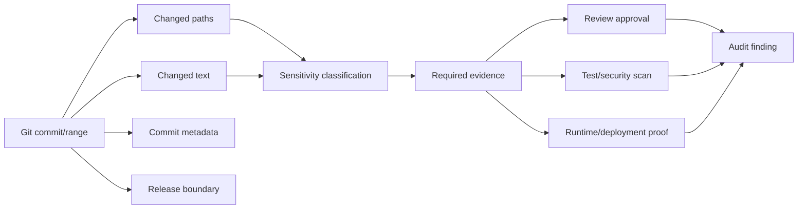
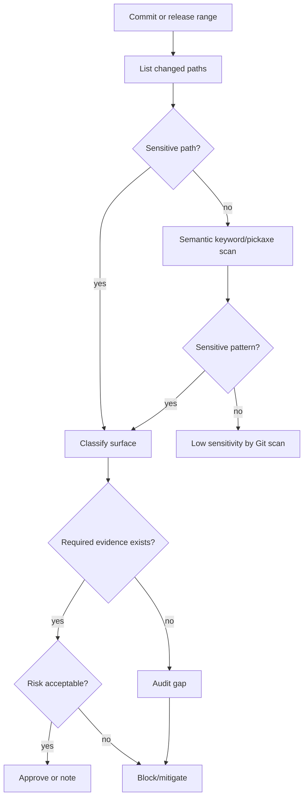

# Part 082 — Auditing Sensitive Changes

> Sensitive change auditing is not "look at scary files". It is a systematic attempt to prove that changes affecting trust, money, identity, data, deployment, or control boundaries were intentional, reviewed, tested, and traceable.

Git is unusually useful for audit because it stores:

- commit identity
- author and committer metadata
- parent relationships
- file-level changes
- tag/release boundaries
- branch integration history
- cryptographic object names

But Git is not automatically an audit system.

An audit requires a policy model.

This part teaches how to turn Git history into audit evidence.

---

## 1. What Counts as a Sensitive Change?

A sensitive change is any change that can alter:

| Boundary | Examples |
|---|---|
| Identity | login, session, token, SSO, user mapping |
| Authorization | permissions, roles, scopes, ACLs, policy checks |
| Data protection | PII handling, encryption, masking, logging |
| Money/value movement | pricing, payment, refund, ledger, settlement |
| Enforcement/legal workflow | case status, escalation, evidence retention, approval logic |
| Deployment control | CI/CD, release workflow, environment config, secrets wiring |
| Infrastructure | network, firewall, IAM, storage, database, queues |
| Dependency trust | package updates, lockfiles, build plugins |
| Runtime safety | feature flags, circuit breakers, timeouts, retries |
| Auditability | logs, event schema, trace IDs, retention policy |
| Destructive behavior | delete, purge, migration, truncate, overwrite |

The audit goal is not to block all sensitive changes.

The goal is to ensure sensitive changes have appropriate controls.

---

## 2. Audit Mental Model

Every sensitive change audit asks five questions:

```txt
1. What changed?
2. Why is it sensitive?
3. Who reviewed/approved it?
4. What evidence proves it is safe enough?
5. What release/build/deployment contains it?
```

Git answers only part of this:

| Question | Git can answer? | Notes |
|---|---:|---|
| What changed? | yes | diff, commit, range, path |
| When changed? | partially | author/commit dates, but deployment time may be external |
| Who changed? | partially | author/committer metadata, not necessarily identity proof |
| Who approved? | not by Git alone | PR/review platform needed |
| Why changed? | partially | commit message, PR link, issue ID |
| Is it safe? | no | tests, review, threat model, domain reasoning needed |
| Which release contains it? | yes if tags/release discipline exists | range/tag/build metadata |



---

## 3. Build a Sensitive Surface Registry

You cannot audit sensitive changes reliably if the organization has not defined sensitive surfaces.

Start with a registry.

Example:

```yaml
sensitiveSurfaces:
  authn:
    paths:
      - src/auth/**
      - src/security/**
      - config/security/**
    keywords:
      - token
      - session
      - password
      - oauth
      - saml
      - jwt
    requiredEvidence:
      - security-review
      - auth-regression-test

  authz:
    paths:
      - src/authorization/**
      - src/policy/**
      - src/**/permissions/**
    keywords:
      - permission
      - role
      - scope
      - allow
      - deny
      - ACL
    requiredEvidence:
      - owner-review
      - negative-access-test

  release:
    paths:
      - .github/workflows/**
      - Jenkinsfile
      - deploy/**
      - helm/**
      - terraform/**
    keywords:
      - production
      - deploy
      - secret
      - token
      - approval
    requiredEvidence:
      - platform-review
      - dry-run
```

This registry becomes the bridge between Git data and policy.

---

## 4. Start from a Release Range

Most audits should be scoped.

Common scopes:

| Audit scope | Git range |
|---|---|
| Changes in a release | `v2.18.0..v2.19.0` |
| Changes since last security review | `<review-tag>..HEAD` |
| Changes merged to main this week | `main@{date}` is weak; prefer exact commit boundary |
| Changes in a PR branch | `origin/main...feature` |
| Changes in hotfix branch | `v2.19.0..hotfix/2.19.1` |

Use exact boundaries:

```bash
OLD=$(git rev-parse --verify v2.18.0^{commit})
NEW=$(git rev-parse --verify v2.19.0^{commit})
```

List commits:

```bash
git log --first-parent --oneline $OLD..$NEW
```

List all changed paths:

```bash
git diff --name-status $OLD..$NEW
```

Generate a machine-readable path list:

```bash
git diff --name-status -z $OLD..$NEW > changed-files.zstaging
```

NUL-separated output matters for scripts because filenames can contain spaces, tabs, newlines, or leading dashes.

---

## 5. Sensitive Path Audit

Start with path-based detection.

```bash
git diff --name-status $OLD..$NEW -- \
  ':(top)src/auth' \
  ':(top)src/security' \
  ':(top)src/policy' \
  ':(top)config' \
  ':(top)deploy' \
  ':(top).github/workflows' \
  ':(top)migrations'
```

Use `--diff-filter` to classify file operations:

```bash
# Added, copied, modified, renamed
git diff --name-status --diff-filter=ACMR $OLD..$NEW -- src/auth src/security

# Deleted files
git diff --name-status --diff-filter=D $OLD..$NEW -- src/auth src/security
```

Deleted checks can be more dangerous than added code.

### Sensitive path examples

| Path | Audit concern |
|---|---|
| `src/auth/**` | authentication weakening |
| `src/policy/**` | authorization bypass |
| `migrations/**` | irreversible schema/data effect |
| `.github/workflows/**` | CI/CD trust boundary |
| `deploy/**` | environment exposure |
| `terraform/**` | cloud/IAM/network/security group change |
| `config/**` | feature enablement, endpoint, secret reference |
| `package-lock.json` | transitive dependency behavior |
| `Dockerfile` | runtime base image and supply chain |
| `logging/**` | sensitive data leakage |

Path audit is fast and explainable.

But it misses sensitive changes outside known paths.

So you also need semantic search.

---

## 6. Semantic Audit with Pickaxe

Search for additions/removals of sensitive terms:

```bash
git log -G'password|secret|token|apiKey|privateKey|credential' \
  --oneline -p $OLD..$NEW
```

Search authorization concepts:

```bash
git log -G'authorize|permission|role|scope|ACL|policy|allow|deny|admin' \
  --oneline -p $OLD..$NEW
```

Search dangerous bypass terms:

```bash
git log -G'permitAll|disable|skip|bypass|insecure|verify=false|trustAll|TODO|temporary' \
  --oneline -p $OLD..$NEW
```

Search destructive data terms:

```bash
git log -G'DROP|TRUNCATE|DELETE FROM|ALTER TABLE|CASCADE|PURGE|overwrite|deleteAll' \
  --oneline -p $OLD..$NEW -- migrations db src
```

Search exact symbol removal/addition:

```bash
git log -S'hasPermission' --oneline -p $OLD..$NEW -- src
```

### `-S` vs `-G` for audit

| Option | Best for |
|---|---|
| `-S'string'` | exact symbol/string occurrence count changes |
| `-G'regex'` | patch lines matching a pattern |
| `--pickaxe-all` | show whole changeset when matched |

Use `--pickaxe-all` when the matching line is only one clue inside a broader sensitive commit:

```bash
git log -G'permitAll|bypass|insecure' --pickaxe-all --stat $OLD..$NEW
```

---

## 7. Auditing Permission and Mode Changes

Git tracks executable bit changes.

A mode change can be security-sensitive:

- script made executable
- hook script changed
- deployment script changed
- binary-like artifact introduced

Show summary:

```bash
git diff --summary $OLD..$NEW
```

Show raw mode changes:

```bash
git diff --raw $OLD..$NEW
```

Example output concept:

```txt
:100644 100755 abc123 def456 M scripts/deploy-prod.sh
```

Meaning file mode changed from normal file to executable.

Audit questions:

- Why is this now executable?
- Does CI run it?
- Does deployment run it?
- Does it access secrets?
- Is it reviewed by platform/security owner?

---

## 8. Auditing CI/CD Changes

CI/CD config is a trust boundary.

Audit it as code that can move artifacts to production.

```bash
git diff $OLD..$NEW -- \
  .github/workflows \
  Jenkinsfile \
  .gitlab-ci.yml \
  buildkite.yml \
  azure-pipelines.yml \
  deploy scripts
```

Search dangerous workflow terms:

```bash
git log -G'pull_request_target|secrets|GITHUB_TOKEN|permissions:|id-token|deploy|production|sudo|curl|bash' \
  --oneline -p $OLD..$NEW -- .github/workflows scripts deploy
```

Audit checklist:

```txt
[ ] Did workflow permissions become broader?
[ ] Can untrusted PR code access secrets?
[ ] Was deployment approval removed or weakened?
[ ] Was artifact signing/verification changed?
[ ] Was test coverage skipped for some path?
[ ] Was checkout depth changed in a way that breaks release logic?
[ ] Was a new third-party action introduced?
[ ] Was a pinned action changed to a mutable ref?
```

For third-party GitHub Actions, prefer pinned commit SHA over mutable branch/tag for high-trust workflows.

---

## 9. Auditing Dependency Changes

Dependency changes are sensitive because external code enters your trust boundary.

Find dependency files:

```bash
git diff --name-status $OLD..$NEW -- \
  package.json package-lock.json pnpm-lock.yaml yarn.lock \
  pom.xml build.gradle gradle.lockfile \
  go.mod go.sum \
  Cargo.toml Cargo.lock \
  requirements.txt poetry.lock \
  Dockerfile
```

Show dependency commits:

```bash
git log --oneline $OLD..$NEW -- \
  package.json package-lock.json pom.xml build.gradle go.mod go.sum Cargo.lock poetry.lock Dockerfile
```

Audit questions:

- Was dependency added, upgraded, downgraded, or source changed?
- Is it direct or transitive?
- Is it used in runtime, build, test, or deployment?
- Is the package pinned by digest/lockfile?
- Is a build plugin or code generator involved?
- Does the dependency touch authentication, crypto, parsing, templating, deserialization, or networking?

Git shows the boundary.

Package tooling and vulnerability scanning provide additional evidence.

---

## 10. Auditing Secrets and Credentials

If a secret appears in Git history, deleting the line is not enough.

Treat it as exposed.

Correct response order:

```txt
1. Revoke/rotate the secret.
2. Assess exposure window and access logs.
3. Remove from source and prevent reintroduction.
4. Decide whether history rewrite is necessary.
5. Coordinate downstream clone cleanup if rewriting.
```

Git search examples should avoid printing actual secret values when possible.

Search patterns carefully:

```bash
# Show filenames and commits, then inspect with caution.
git log -G'AKIA[0-9A-Z]{16}|BEGIN PRIVATE KEY|password\s*=|secret\s*=' \
  --oneline $OLD..$NEW
```

List files with suspicious words:

```bash
git grep -n -I -E 'password|secret|private_key|api_key|token' $NEW -- \
  ':(exclude)docs/**' \
  ':(exclude)**/*.md'
```

Audit questions:

- Was an actual secret committed or only a variable name?
- Was the secret valid at commit time?
- Was it pushed to shared remote?
- Was it included in a release artifact?
- Were logs/build artifacts exposed?
- Has it been rotated?
- Has a prevention control been added?

---

## 11. Auditing Authorization Changes

Authorization changes are among the highest-risk changes in business systems.

Search paths:

```bash
git diff --name-status $OLD..$NEW -- \
  src/authz src/policy src/permissions config/security
```

Search concepts:

```bash
git log -G'hasPermission|authorize|role|scope|tenant|owner|deny|allow|policy|admin' \
  --oneline -p $OLD..$NEW -- src config
```

Search removed guard by exact string:

```bash
git log -S'hasPermission' --oneline -p $OLD..$NEW -- src
```

Audit checklist:

```txt
[ ] Are deny-by-default invariants preserved?
[ ] Are tenant/account/org boundaries preserved?
[ ] Are admin paths separately protected?
[ ] Are negative authorization tests added/updated?
[ ] Is policy migration backward-compatible?
[ ] Did config default change from restricted to permissive?
[ ] Did UI hide-only logic replace server enforcement?
[ ] Did batch/export/report path bypass normal checks?
```

### Authorization audit invariant

A UI permission change is not an authorization control unless the server enforces it.

Git audit should inspect backend enforcement, not just frontend visibility.

---

## 12. Auditing Authentication and Session Changes

Authentication changes touch identity proof.

Search:

```bash
git log -G'login|logout|session|token|jwt|oauth|saml|cookie|csrf|mfa|password|refresh' \
  --oneline -p $OLD..$NEW -- src config
```

Audit checklist:

```txt
[ ] Token validation still verifies signature, issuer, audience, expiry.
[ ] Session fixation protection preserved.
[ ] Logout invalidates server-side/session state where applicable.
[ ] Refresh token rotation/invalidation preserved.
[ ] Cookie flags remain secure/httpOnly/sameSite as required.
[ ] MFA bypass rules are explicit and tested.
[ ] Test users/backdoors are not enabled in production config.
```

---

## 13. Auditing Logging and PII Changes

Logging changes can become data leaks.

Search:

```bash
git log -G'log\.|logger|println|console\.log|debug|trace|audit|PII|email|phone|ssn|dob|address' \
  --oneline -p $OLD..$NEW -- src config
```

Audit checklist:

```txt
[ ] No tokens/secrets logged.
[ ] No sensitive payload logged at debug/trace in production.
[ ] Audit logs include necessary metadata without excessive data.
[ ] Masking/redaction remains active.
[ ] Log retention and access policy still match data classification.
[ ] Error handling does not expose sensitive fields.
```

### Auditability trade-off

Regulated systems need enough logs to explain decisions.

Privacy/security systems need minimization.

The correct answer is usually structured audit events, not raw payload logging.

---

## 14. Auditing Database and Migration Changes

Migrations can be sensitive even if code reviewers treat them as routine.

Search:

```bash
git diff --name-status $OLD..$NEW -- migrations db schema sql liquibase flyway
```

Search destructive operations:

```bash
git log -G'DROP|TRUNCATE|DELETE FROM|ALTER TABLE|CASCADE|NOT NULL|UNIQUE|INDEX|CONSTRAINT' \
  --oneline -p $OLD..$NEW -- migrations db schema sql
```

Audit checklist:

```txt
[ ] Migration is backward-compatible with previous app version if needed.
[ ] Data migration has dry-run or verification query.
[ ] Destructive operation is explicitly approved.
[ ] Rollback path is real, not hand-wavy.
[ ] Index creation strategy avoids production lock hazard.
[ ] Tenant/ownership constraints preserved.
[ ] Audit/event data retention not weakened.
```

---

## 15. Auditing Infrastructure Changes

Infrastructure changes can alter security posture without touching application code.

Search paths:

```bash
git diff --name-status $OLD..$NEW -- \
  terraform infra k8s helm deploy Dockerfile docker-compose.yml
```

Search dangerous terms:

```bash
git log -G'0\.0\.0\.0/0|public|admin|root|iam|policy|role|secret|privileged|hostNetwork|LoadBalancer' \
  --oneline -p $OLD..$NEW -- terraform infra k8s helm deploy
```

Audit checklist:

```txt
[ ] Public exposure did not increase unexpectedly.
[ ] IAM permissions remain least-privilege enough.
[ ] Secrets are referenced securely, not embedded.
[ ] Containers are not newly privileged.
[ ] Network policy/security group changes are reviewed.
[ ] Storage/database access did not broaden.
[ ] Region/account/environment targeting is correct.
```

---

## 16. Auditing Enforcement Lifecycle Changes

For regulatory or case-management systems, sensitive changes include business state transitions.

Search:

```bash
git log -G'status|state|transition|escalate|approve|reject|close|reopen|appeal|enforcement|violation' \
  --oneline -p $OLD..$NEW -- src config migrations
```

Audit checklist:

```txt
[ ] State machine transition invariants preserved.
[ ] Terminal states remain terminal unless explicitly allowed.
[ ] Escalation deadlines/calculations are unchanged or approved.
[ ] Approval gates cannot be bypassed by alternate path.
[ ] Audit events are emitted for significant lifecycle changes.
[ ] Cross-entity impact is considered.
[ ] Historical case data remains interpretable after migration.
```

Example invariant:

```txt
A case cannot move from CLOSED to ACTIVE without a reopen reason, authorized actor, timestamp, and audit event.
```

Git audit should search both code and migration/config changes affecting this invariant.

---

## 17. First-Parent vs Full-History Audit

First-parent history answers:

```txt
What was integrated into the protected line, in what order?
```

Command:

```bash
git log --first-parent --oneline $OLD..$NEW
```

Full history answers:

```txt
What commits exist in the release range, including feature branch internals?
```

Command:

```bash
git log --oneline --graph $OLD..$NEW
```

Use both.

| Audit need | Preferred view |
|---|---|
| Release integration timeline | first-parent |
| Individual risky commit | full history |
| PR-level revert planning | first-parent with merge commits |
| Bisectability | full or first-parent depending workflow |
| Evidence for governance | first-parent + PR metadata |
| Code-level forensic search | full history |

---

## 18. Auditing Merge Commits

A merge commit can hide sensitive manual conflict resolution.

Inspect merge commits:

```bash
git log --merges --oneline $OLD..$NEW
```

Show combined diff:

```bash
git show --cc <merge-sha>
```

Show remerge diff if supported:

```bash
git show --remerge-diff <merge-sha>
```

Compare merge result against parents:

```bash
git diff <merge-sha>^1 <merge-sha> --name-status

git diff <merge-sha>^2 <merge-sha> --name-status
```

Audit questions:

- Did conflict resolution choose permissive security behavior?
- Did generated code/lockfile resolution combine incompatible states?
- Did migration order change?
- Did config conflict choose production default accidentally?
- Did the merge result include changes from neither parent?

---

## 19. Auditing Reverts

Reverts are sensitive because they restore old behavior or remove fixes.

Find reverts:

```bash
git log --grep='^Revert' --oneline $OLD..$NEW
```

Inspect revert:

```bash
git show <revert-sha>
```

Audit questions:

```txt
[ ] What commit was reverted?
[ ] Was the reverted commit security-related?
[ ] Was the revert complete or partial?
[ ] Did the revert resurrect an old vulnerability/bug?
[ ] Was a follow-up fix required?
[ ] Was release note/changelog updated?
```

Revert is safe for public history structure.

It is not automatically safe for business behavior.

---

## 20. Auditing Tag and Release Integrity

Tags define release identity.

Audit release tags:

```bash
git tag --points-at $NEW

git show v2.19.0
```

Verify signed tag if policy requires:

```bash
git tag -v v2.19.0
```

Check if release tag is annotated:

```bash
git cat-file -t v2.19.0
```

Expected for annotated tag:

```txt
tag
```

Peel to commit:

```bash
git rev-parse v2.19.0^{commit}
```

Audit checklist:

```txt
[ ] Release tag is annotated/signed if required.
[ ] Tag points to expected commit.
[ ] Build artifact records same commit.
[ ] Release notes cover same range.
[ ] Tag was not moved after publication.
[ ] Protected tag policy exists for release patterns.
```

---

## 21. Audit Evidence Report

Produce evidence in a repeatable format.

Example:

```md
# Sensitive Change Audit: v2.18.0 -> v2.19.0

## Scope
- Old boundary: v2.18.0 / <sha>
- New boundary: v2.19.0 / <sha>
- Branch/release line:

## Sensitive Surfaces Checked
- authn:
- authz:
- data/migration:
- CI/CD:
- dependencies:
- infrastructure:
- logging/PII:

## Findings
### Finding 1: Authorization policy changed
- Commit:
- Files:
- Reason sensitive:
- Evidence reviewed:
- Tests:
- Owner approval:
- Risk rating:
- Decision:

## Gaps
- Missing tests:
- Missing reviewer:
- Missing provenance:
- Unclear commit message:

## Release Decision
- Approved / blocked / approved with mitigation:
- Required follow-up:
```

The report should include command output references, not just conclusions.

---

## 22. Building a Simple Sensitive Change Scanner

This is not a replacement for review.

It is a triage tool.

```bash
#!/usr/bin/env bash
set -euo pipefail

OLD=${1:?old revision required}
NEW=${2:?new revision required}

printf 'Sensitive path changes:\n'
git diff --name-status "$OLD..$NEW" -- \
  src/auth src/security src/policy config deploy .github/workflows migrations terraform || true

printf '\nPotentially sensitive text changes:\n'
git log --oneline -G'password|secret|token|permission|role|admin|permitAll|bypass|insecure|DROP|TRUNCATE' \
  "$OLD..$NEW" || true

printf '\nExecutable bit / mode changes:\n'
git diff --summary "$OLD..$NEW" || true

printf '\nDependency changes:\n'
git diff --name-status "$OLD..$NEW" -- \
  package.json package-lock.json pnpm-lock.yaml yarn.lock pom.xml build.gradle go.mod go.sum Cargo.lock poetry.lock Dockerfile || true
```

Limitations:

- keyword search has false positives
- path search misses unknown surfaces
- Git cannot prove PR approvals
- secrets may evade patterns
- semantic behavior may change without sensitive keywords

Use scanner output as audit input, not audit conclusion.

---

## 23. NUL-Safe Path Handling for Audit Automation

Do not write scripts that break on spaces or newlines in paths.

Bad:

```bash
for f in $(git diff --name-only $OLD..$NEW); do
  echo "$f"
done
```

Good:

```bash
git diff --name-only -z "$OLD..$NEW" | while IFS= read -r -d '' path; do
  printf 'changed: %q\n' "$path"
done
```

NUL-safe automation matters in adversarial or high-integrity settings.

A malicious filename can confuse naive scripts.

---

## 24. Risk Rating Sensitive Changes

A lightweight rating model:

| Rating | Criteria | Example |
|---|---|---|
| Critical | Can cause unauthorized access, data loss, secret exposure, production deploy bypass | authz bypass, CI secret exposure |
| High | Changes control boundary or irreversible data behavior | migration drop column, IAM broadened |
| Medium | Sensitive surface touched but guarded/tested | auth refactor with tests |
| Low | Documentation/test-only change in sensitive area | auth README update |

Do not rate by file count.

Rate by blast radius and reversibility.

### Risk dimensions

```txt
impact × exposure × reversibility × confidence
```

- Impact: what can go wrong?
- Exposure: who can trigger it?
- Reversibility: can it be safely undone?
- Confidence: how strong is the evidence?

---

## 25. Sensitive Change Review Matrix

| Change type | Required reviewer | Required evidence |
|---|---|---|
| Authn/Authz | security/domain owner | negative tests, threat note |
| Migration/destructive data | DBA/platform/domain owner | dry-run, rollback/forward plan |
| CI/CD deploy | platform/release owner | least privilege, environment gate |
| Dependency runtime | service owner/security | lockfile review, scan, changelog |
| Infrastructure/IAM | platform/security | diff plan, approval, blast radius |
| Logging/PII | privacy/security/domain | redaction test, data classification |
| State machine/enforcement lifecycle | domain/process owner | transition tests, audit event proof |

A Git audit should flag missing evidence, not silently assume it exists.

---

## 26. Mermaid: Sensitive Change Decision Tree



---

## 27. Common Audit Anti-Patterns

### Anti-pattern 1: Auditing only changed files

Sensitive behavior can change through dependency, config, feature flag, or generated code.

### Anti-pattern 2: Treating commit author as approval

Author is not reviewer.

Committer is not approver.

### Anti-pattern 3: Relying only on PR title

PR title may say "refactor" while diff changes authorization behavior.

### Anti-pattern 4: Treating tag as immutable without protection

A tag can move unless controls prevent it.

### Anti-pattern 5: Ignoring deleted checks

Removed validation is often more dangerous than added functionality.

### Anti-pattern 6: Trusting green CI blindly

CI may not test negative authorization, production config, migration scale, or feature flag combinations.

### Anti-pattern 7: Printing secrets during audit

Audit tooling must avoid spreading sensitive values further.

---

## 28. Case Study: Authorization Guard Removed

Situation:

```txt
Release v4.8.0 allows regional manager to export national-level enforcement cases.
```

Audit range:

```bash
OLD=v4.7.0
NEW=v4.8.0
```

Search:

```bash
git log -G'export|authorize|permission|region|national|scope' \
  --oneline -p $OLD..$NEW -- src config
```

Finding:

```txt
Commit abc123 changed ExportCaseController from requireScope("CASE_EXPORT_NATIONAL")
to requireScope("CASE_EXPORT") while moving UI routes.
```

Why sensitive:

```txt
Server-side authorization boundary weakened.
```

Required evidence:

```txt
- domain owner approval
- negative test: regional manager cannot export national cases
- audit event validation
```

Remediation:

```txt
Reintroduce national-scope check and add regression test.
```

Prevention:

```txt
Sensitive keyword audit gate for `requireScope`, `authorize`, and `export`.
```

---

## 29. Case Study: CI Workflow Secret Exposure

Situation:

```txt
A workflow was changed to run on pull_request_target and execute code from the PR branch.
```

Search:

```bash
git log -G'pull_request_target|checkout|secrets|GITHUB_TOKEN|permissions:' \
  --oneline -p $OLD..$NEW -- .github/workflows
```

Audit concern:

```txt
Untrusted code may run with elevated token/secrets depending on workflow structure.
```

Evidence required:

```txt
- workflow permission review
- proof secrets unavailable to untrusted code
- pinned third-party actions
- branch/environment protection
```

Git evidence is the workflow diff.

Security conclusion requires understanding CI platform semantics.

---

## 30. Case Study: Database Migration with Hidden Business Impact

Situation:

```txt
A migration adds NOT NULL constraint to `case.assigned_officer_id`.
```

Search:

```bash
git log -G'NOT NULL|assigned_officer|case' --oneline -p $OLD..$NEW -- migrations src
```

Audit questions:

```txt
[ ] Are historical cases allowed to be unassigned?
[ ] Does migration backfill correctly?
[ ] Does application deploy order handle old/new schema?
[ ] Does escalation workflow depend on null meaning "unassigned"?
[ ] Does reporting logic change?
```

Git shows the change.

Domain model determines sensitivity.

---

## 31. Labs

### Lab 1 — Sensitive path scanner

Create a repository with:

- `src/auth/LoginService.java`
- `src/payments/RefundService.java`
- `.github/workflows/deploy.yml`
- `migrations/V002__alter_case.sql`

Make a release tag before and after changes.

Write a scanner that reports sensitive path changes between tags.

Expected learning:

- range selection
- pathspec usage
- `--name-status`
- release-scoped audit

### Lab 2 — Pickaxe audit

Introduce a commit that changes:

```java
requirePermission("CASE_READ")
```

to:

```java
requirePermission("CASE_LIST")
```

Use `git log -S` and `git log -G` to find it.

Expected learning:

- exact string search vs regex patch search

### Lab 3 — Merge commit audit

Create two branches that edit security config.

Resolve merge conflict incorrectly.

Use:

```bash
git show --cc <merge>
git show --remerge-diff <merge>
```

Expected learning:

- merge resolution itself can be sensitive

### Lab 4 — Release evidence report

Between two tags, produce:

- changed sensitive files
- risky keyword hits
- dependency changes
- CI/CD changes
- release tag verification
- audit findings

Expected learning:

- converting Git commands into defensible audit evidence

---

## 32. Review Questions

1. Why is a sensitive surface registry necessary?
2. Why is path-based scanning insufficient by itself?
3. What is the difference between author, committer, reviewer, and approver?
4. Why can a dependency lockfile change be high-risk?
5. Why should secret leak response rotate first and rewrite second?
6. How can a merge commit introduce sensitive behavior not obvious from either parent?
7. Why should audit scripts use NUL-safe path handling?
8. What evidence is needed before approving an authorization change?
9. Why are release tags central to scoped audits?
10. Why is green CI not enough for sensitive change approval?

---

## 33. Practical Checklist

Audit scope:

```txt
[ ] Old boundary is exact commit/tag.
[ ] New boundary is exact commit/tag.
[ ] Release branch or target line is known.
[ ] Full range and first-parent range reviewed.
```

Sensitive detection:

```txt
[ ] Sensitive path registry applied.
[ ] Semantic pickaxe scan applied.
[ ] Dependency files checked.
[ ] CI/CD files checked.
[ ] Migration/schema files checked.
[ ] Infrastructure files checked.
[ ] Mode/executable changes checked.
[ ] Merge commits inspected where relevant.
```

Evidence:

```txt
[ ] Required reviewers identified.
[ ] Required tests/security scans present.
[ ] Commit/PR/release traceability available.
[ ] Release tag integrity verified.
[ ] Audit gaps recorded.
[ ] Decision documented.
```

---

## 34. Key Takeaways

- Sensitive change auditing requires a policy model, not just Git commands.
- Start audits from exact release/commit boundaries.
- Use path-based scans for known surfaces and pickaxe for semantic signals.
- CI/CD, dependency, config, migration, and infrastructure changes are sensitive control surfaces.
- Deleted checks, mode changes, and merge resolutions deserve special attention.
- Commit author metadata is not approval evidence.
- A secret committed to Git should be treated as exposed; rotate first.
- Audit output should be an evidence report with findings, gaps, and decisions.

---

## References

- Git Documentation — `git-diff`: https://git-scm.com/docs/git-diff
- Git Documentation — `git-log`: https://git-scm.com/docs/git-log
- Git Documentation — `gitrevisions`: https://git-scm.com/docs/gitrevisions
- Git Documentation — `git-rev-list`: https://git-scm.com/docs/git-rev-list
- Git Documentation — `git-tag`: https://git-scm.com/docs/git-tag
- Git Documentation — `git-show`: https://git-scm.com/docs/git-show
- Git Documentation — `git-grep`: https://git-scm.com/docs/git-grep
- GitHub Docs — About code owners: https://docs.github.com/repositories/managing-your-repositorys-settings-and-features/customizing-your-repository/about-code-owners
