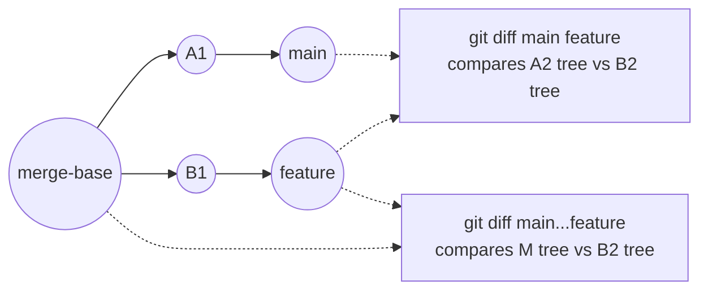

# Part 083 — Diff Algorithms and Review Signal

A diff is not the change.

A diff is a **projection** of two states into a human-readable explanation. That projection can be useful, misleading, too noisy, too small, or structurally wrong for the question you are asking.

Advanced Git users do not treat `git diff` output as objective truth. They treat it as a view that must be configured for the job:

- reviewing semantic code changes,
- auditing sensitive files,
- debugging regressions,
- generating patches,
- investigating churn,
- validating refactors,
- understanding release boundaries,
- or proving that two histories are equivalent enough.

Git exposes several diff algorithms and diffcore transformations. The official `git diff` documentation supports algorithm choices including `myers`, `minimal`, `patience`, and `histogram`. `patience` uses the patience diff algorithm, while `histogram` extends patience by supporting low-occurrence common elements.

Reference:

- <https://git-scm.com/docs/git-diff>
- <https://git-scm.com/docs/diff-algorithm-option>
- <https://git-scm.com/docs/gitdiffcore>

This part is about reading diff as an engineer, not as a passive UI consumer.

---

## 1. The Core Mental Model

Git diff compares two snapshots.

Depending on the command, those snapshots may be:

| Command | Compared states |
|---|---|
| `git diff` | working tree vs index |
| `git diff --cached` / `--staged` | index vs `HEAD` |
| `git diff HEAD` | working tree plus index vs `HEAD` |
| `git diff A B` | tree at `A` vs tree at `B` |
| `git diff A..B` | usually same as `git diff A B` |
| `git diff A...B` | merge-base of `A` and `B` vs `B` |
| `git show <commit>` | parent tree vs commit tree |
| `git log -p` | patch for each commit in selected commit set |

The critical distinction:

```txt
commit selection != tree comparison
```

For `git log`, `A..B` means “commits reachable from `B` but not from `A`”.

For `git diff`, `A..B` is effectively a tree diff between `A` and `B`.

For `git diff A...B`, Git compares the merge-base of `A` and `B` against `B`. This is why PR UIs often show the change introduced by a topic branch relative to the base branch.



Review mistake:

```bash
# This may include changes already made on main after the branch point.
git diff main feature

# This shows what feature introduced since its branch point.
git diff main...feature
```

The right diff depends on the question.

| Question | Better command |
|---|---|
| “What did my branch introduce?” | `git diff main...HEAD` |
| “What is different between deployed tag and current main?” | `git diff v1.2.0 main` |
| “What will this commit patch do?” | `git show --stat --patch <commit>` |
| “What changed in the release range?” | `git log --oneline --stat v1.2.0..v1.3.0` |
| “What will be staged?” | `git diff --cached` |
| “What is not staged?” | `git diff` |

---

## 2. Diff Is a Human Interface, Not Just an Algorithm

A review diff must optimize for **human reasoning**.

A minimal edit script is not always the clearest explanation.

Consider this pseudo-change:

```diff
- validateCase(caseRecord);
- persistCase(caseRecord);
- publishCaseOpened(caseRecord);
+ validateCase(caseRecord);
+ enrichCase(caseRecord);
+ persistCase(caseRecord);
+ publishCaseOpened(caseRecord);
```

This diff is readable: one step inserted.

But if a file has repeated blocks, braces, similar function names, or reordered sections, a diff algorithm may choose anchors that produce an output like:

```diff
- validateCase(caseRecord);
- persistCase(caseRecord);
+ validateCase(caseRecord);
+ enrichCase(caseRecord);
+ persistCase(caseRecord);
```

Still correct, but less helpful.

The reviewer asks:

> What is the smallest trustworthy explanation of intent?

Git lets you influence that explanation.

---

## 3. The Four Main Diff Algorithms

Git exposes these common diff algorithms:

```bash
git diff --diff-algorithm=myers
git diff --diff-algorithm=minimal
git diff --diff-algorithm=patience
git diff --diff-algorithm=histogram
```

You can also configure a default:

```bash
git config diff.algorithm histogram
```

And override it when needed:

```bash
git diff --diff-algorithm=default
```

### 3.1 Myers

`myers` is the classic/default-style diff algorithm in Git.

It is usually fast and produces reasonable output.

Use it when:

- changes are straightforward,
- files are not heavily reordered,
- you want default Git behavior,
- tooling assumes default output,
- you are generating patches for broad compatibility.

Failure mode:

- repeated lines can create confusing anchors,
- large refactors may look noisier than they need to,
- brace-heavy or boilerplate-heavy code can produce misleading hunks.

Example:

```bash
git diff --diff-algorithm=myers main...HEAD
```

### 3.2 Minimal

`minimal` spends extra effort to produce the smallest possible diff.

Use it when:

- patch size matters,
- you are investigating small mechanical changes,
- you want to reduce unnecessary changed lines,
- you are preparing a patch for mailing-list style review.

Trade-off:

- smaller is not always clearer,
- may be slower,
- can still choose anchors that are not semantically meaningful.

```bash
git diff --diff-algorithm=minimal main...HEAD
```

### 3.3 Patience

`patience` tends to improve readability when there are unique lines that make better anchors.

Use it when:

- functions were moved,
- repeated boilerplate confuses the default diff,
- code blocks were reordered,
- you want reviewer-friendly output.

```bash
git diff --patience main...HEAD
```

or:

```bash
git diff --diff-algorithm=patience main...HEAD
```

### 3.4 Histogram

`histogram` extends patience with support for low-occurrence common elements.

In practice, it is often a strong default for code review because it tends to produce readable diffs in codebases with repeated but not completely unique structural lines.

Use it when:

- reviewing application code,
- analyzing large but structured changes,
- investigating source-code history,
- comparing refactor vs behavior changes,
- mining history for risk signal.

```bash
git diff --histogram main...HEAD
```

or:

```bash
git diff --diff-algorithm=histogram main...HEAD
```

Team default candidate:

```bash
git config --global diff.algorithm histogram
```

But be careful: changing the default affects how local diffs look, not the actual repository. Review platforms may use their own defaults.

---

## 4. Decision Framework: Which Algorithm Should I Use?

| Situation | Recommended first view | Why |
|---|---|---|
| Normal daily review | `--histogram` | Usually good readability for source code. |
| Patch looks weird | compare `myers`, `patience`, `histogram` | Diff output is a projection; inspect alternate projections. |
| Large reorder | `--patience` or `--histogram` | Better anchors around moved blocks. |
| Generated file | avoid reviewing manually | Diff algorithm cannot restore semantic signal. |
| Patch application compatibility | default / `myers` | Keep closer to standard output. |
| Churn metrics / mining history | fixed explicit algorithm | Reproducibility requires stable diff settings. |
| Security audit | multiple views + path-specific inspection | One diff view can hide sensitive intent. |
| Refactor mixed with behavior | split commits first | Algorithm cannot compensate for bad change boundaries. |

A top-tier engineer does not ask only:

```txt
Which algorithm is best?
```

They ask:

```txt
What question am I asking of this change?
```

---

## 5. Diff Output Modes That Improve Review Signal

### 5.1 Summary and Stats First

Before reading line diffs, get shape:

```bash
git diff --stat main...HEAD
git diff --shortstat main...HEAD
git diff --numstat main...HEAD
```

Interpretation:

- `--stat` is human-friendly.
- `--shortstat` gives aggregate changed files/insertions/deletions.
- `--numstat` is machine-friendly and uses numeric fields.

Example review entry:

```bash
git diff --stat --find-renames main...HEAD
```

Use this before reading patch hunks.

You want to know whether the PR is:

- one small focused change,
- a broad mechanical rename,
- a generated-file avalanche,
- a dependency update,
- a schema migration,
- a release manifest update,
- or a mixed-risk bundle.

### 5.2 Name-only / Name-status

```bash
git diff --name-only main...HEAD
git diff --name-status main...HEAD
```

`--name-status` exposes status codes such as add, modify, delete, rename, copy depending on detection options.

Useful for:

- routing reviewers,
- release audit,
- impact analysis,
- detecting sensitive path changes.

Example:

```bash
git diff --name-status --find-renames main...HEAD
```

### 5.3 Word Diff

Line diff is often too coarse for prose, SQL, JSON, policy rules, or validation expressions.

Use:

```bash
git diff --word-diff main...HEAD
```

Or a regex for domain-specific tokens:

```bash
git diff --word-diff-regex='[A-Za-z_][A-Za-z0-9_]*|[^[:space:]]' main...HEAD
```

Good for:

- documentation,
- policy text,
- error messages,
- SQL migrations,
- regulatory clause wording,
- JSON/YAML where one logical item is on a long line.

Bad for:

- large code changes,
- files where token-level noise creates false confidence.

### 5.4 Function Context

```bash
git diff -W main...HEAD
```

`-W` / `--function-context` shows whole functions around changes when Git can identify function boundaries.

Useful for:

- review of behavior changes,
- detecting hidden control-flow impact,
- auditing guard conditions,
- understanding invariant changes.

You can also use custom diff drivers in `.gitattributes` for languages or file formats where Git's default hunk headers are weak.

### 5.5 Moved Code Detection

```bash
git diff --color-moved main...HEAD
```

Useful when a refactor moves code around.

But moved-code coloring is not semantic proof. It helps detect “mostly moved” code, but it cannot prove behavior is unchanged.

Use with:

```bash
git diff --color-moved --color-moved-ws=allow-indentation-change main...HEAD
```

Good for:

- file extraction,
- method relocation,
- package moves,
- module restructuring.

Bad if reviewers stop reading because “it is just moved”.

---

## 6. Review Signal Taxonomy

A diff can show several kinds of signal.

| Signal | Example | Review question |
|---|---|---|
| Behavioral | new branch, condition, state transition | Does runtime behavior change correctly? |
| Structural | moved file, renamed class, extracted method | Is it semantically equivalent? |
| Contractual | API/schema/event field changed | Are consumers handled? |
| Operational | config, CI, deploy script | Does deployment/runtime behavior change? |
| Security | authz, secret, crypto, logging | Does trust boundary shift? |
| Data | migration, default value, retention | Is data safe and reversible? |
| Generated | lockfile, codegen output | Was it generated from correct input? |
| Documentation | docs, comments, runbook | Does it match implementation? |

The diff algorithm affects line presentation, but it does not classify risk for you.

A strong review starts by separating signal types.

---

## 7. Path-Level Diff Strategy

Do not read a large PR from top to bottom.

Group paths by risk.

```bash
git diff --name-status main...HEAD
```

Then inspect high-risk surfaces first:

```bash
# Auth and permission surface
git diff --histogram main...HEAD -- 'src/**/auth*' 'src/**/permission*' 'src/**/policy*'

# Database migrations
git diff --histogram main...HEAD -- 'db/migration/**'

# CI and release automation
git diff --histogram main...HEAD -- '.github/**' 'ci/**' 'deploy/**'

# Runtime config
git diff --histogram main...HEAD -- 'config/**' '*.yaml' '*.yml' '*.json'
```

This matters because review attention is finite.

Diff output is not just technical data. It is a **review workload allocation mechanism**.

---

## 8. Whitespace: Noise, Signal, and Risk

Whitespace can be noise.

Whitespace can also be behavior.

Examples where whitespace may matter:

- Python,
- YAML,
- Makefiles,
- Markdown tables,
- SQL formatting inside strings,
- generated parser files,
- indentation-sensitive config,
- string literals,
- golden snapshots.

Useful commands:

```bash
# Ignore whitespace changes for a first pass.
git diff -w main...HEAD

# Ignore changes in amount of whitespace.
git diff -b main...HEAD

# Show whitespace errors.
git diff --check main...HEAD
```

Review rule:

```txt
Use whitespace-ignore views to reduce noise, not to approve changes.
```

A safe workflow:

```bash
# 1. Understand if this is mostly formatting.
git diff --shortstat main...HEAD
git diff -w --shortstat main...HEAD

# 2. Inspect semantic diff ignoring whitespace.
git diff -w --histogram main...HEAD

# 3. Inspect exact diff before approval.
git diff --histogram main...HEAD

# 4. Check whitespace problems.
git diff --check main...HEAD
```

If exact diff is huge but `-w` diff is tiny, the PR should probably be split:

1. formatting-only commit,
2. behavior commit.

---

## 9. Diff Algorithms Cannot Fix Bad Commit Boundaries

A bad PR:

```txt
commit 1: refactor service, change authorization rule, update tests, regenerate client, format all files
```

No diff algorithm can make this easy.

Correct shape:

```txt
commit 1: mechanical rename only
commit 2: extract shared authorization helper
commit 3: change escalation permission rule
commit 4: update tests for escalation rule
commit 5: regenerate client from updated schema
```

Then review with:

```bash
git show --stat --find-renames <commit>
git show --histogram <commit>
git range-diff origin/main...HEAD@{1} origin/main...HEAD
```

Diff quality is downstream from change design.

---

## 10. Diff in Review vs Diff in Debugging

Review diff asks:

```txt
Should we integrate this change?
```

Debugging diff asks:

```txt
What changed between known-good and known-bad states?
```

Release audit diff asks:

```txt
What exactly entered the released artifact boundary?
```

These are different questions.

### Review

```bash
git diff --histogram origin/main...HEAD
```

### Regression

```bash
git diff --histogram good_sha bad_sha
```

### Release boundary

```bash
git diff --stat --find-renames v1.2.0 v1.3.0
git log --oneline --first-parent v1.2.0..v1.3.0
```

### Security audit

```bash
git diff --name-status v1.2.0..v1.3.0 -- 'src/**/auth*' 'config/**' '.github/**'
git log -p --histogram v1.2.0..v1.3.0 -- 'src/**/auth*'
```

---

## 11. Diff and Generated Files

Generated files distort review signal.

Examples:

- API clients,
- protobuf/gRPC generated code,
- OpenAPI clients,
- lockfiles,
- ORM metamodels,
- compiled assets,
- snapshots,
- minified bundles.

Review anti-pattern:

```txt
Reviewer reads generated output and misses generator input change.
```

Better review order:

1. Review generator input.
2. Verify generated output was produced by expected tool/version.
3. Confirm no manual edits exist in generated output.
4. Use hash or command evidence if necessary.

Example:

```bash
# Show schema/input changes first.
git diff --histogram main...HEAD -- 'api/**/*.yaml' 'proto/**/*.proto'

# Then generated output stats.
git diff --stat main...HEAD -- 'generated/**'

# Confirm generated files are not mixed with manual code.
git diff --name-status main...HEAD
```

For generated files, consider `.gitattributes`:

```gitattributes
generated/** linguist-generated=true
*.pb.go -diff
```

Or custom diff drivers for more useful semantic views.

---

## 12. Custom Diff Drivers

Git attributes can configure custom diff behavior.

`.gitattributes`:

```gitattributes
*.md diff=markdown
*.sql diff=sql
*.proto diff=proto
*.json diff=json
```

Git config:

```ini
[diff "proto"]
  xfuncname = "^(message|service|rpc|enum)[[:space:]].*$"

[diff "sql"]
  xfuncname = "^(CREATE|ALTER|DROP|INSERT|UPDATE|DELETE)[[:space:]].*$"
```

This improves hunk headers.

Instead of:

```diff
@@ -44,7 +44,9 @@
```

You may see a domain-relevant anchor:

```diff
@@ message EnforcementCase
```

This is especially useful in:

- SQL migrations,
- protobuf schemas,
- policy files,
- DSLs,
- regulatory rule definitions,
- workflow/state-machine definitions.

---

## 13. Diff as Risk Estimator

You can use diff shape to estimate review risk.

### 13.1 Breadth

```bash
git diff --name-only main...HEAD | wc -l
```

More files usually means broader impact.

But a one-file change can still be high risk if it touches authorization or migration logic.

### 13.2 Churn

```bash
git diff --shortstat main...HEAD
```

High churn increases review cost.

But low churn in a critical branch condition can be more dangerous than high churn in docs.

### 13.3 Sensitive paths

```bash
git diff --name-only main...HEAD | grep -E 'auth|permission|policy|migration|deploy|ci|secret|crypto'
```

Better: maintain a real sensitive surface registry.

```txt
.security-sensitive-paths
.release-critical-paths
.data-migration-paths
```

### 13.4 Rename ratio

```bash
git diff --summary --find-renames main...HEAD
```

High rename/move signal means reviewers must verify whether movement is mechanical.

---

## 14. Diff and Semantic Conflict

A clean diff does not prove a safe merge.

Example:

Branch A changes:

```java
if (case.status() == OPEN) escalate(case);
```

Branch B changes:

```java
if (case.priority() == HIGH) escalate(case);
```

Merged result might compile:

```java
if (case.status() == OPEN && case.priority() == HIGH) escalate(case);
```

Or:

```java
if (case.status() == OPEN || case.priority() == HIGH) escalate(case);
```

A textual diff cannot prove which one is correct.

Reviewers must inspect domain invariants:

- escalation rule,
- regulatory deadline,
- permission boundary,
- audit evidence,
- workflow state transition,
- exception handling.

Diff is the entry point. Domain reasoning is the review.

---

## 15. Practical Review Workflow

A strong manual review sequence:

```bash
# 1. Verify branch relationship.
git merge-base --fork-point origin/main HEAD || git merge-base origin/main HEAD

# 2. Inspect shape.
git diff --stat --find-renames origin/main...HEAD
git diff --name-status --find-renames origin/main...HEAD

# 3. Inspect commit narrative.
git log --oneline --decorate --graph origin/main..HEAD

# 4. Review each commit if series is clean.
git log --reverse --format='%h %s' origin/main..HEAD

# 5. Inspect patch with readable algorithm.
git diff --histogram --find-renames origin/main...HEAD

# 6. Inspect whitespace/noise view.
git diff -w --histogram origin/main...HEAD

# 7. Inspect high-risk paths explicitly.
git diff --histogram origin/main...HEAD -- 'src/**/auth*' 'db/migration/**' '.github/**'

# 8. Run exact checks.
git diff --check origin/main...HEAD
```

Review invariant:

```txt
Every high-risk change must be visible in at least one intentional review view.
```

If a high-risk change is only visible inside a huge mechanical diff, the PR is not reviewable.

---

## 16. CI and Diff Correctness

Many CI systems compute affected files.

Common mistakes:

```bash
# Wrong for PR if target branch moved.
git diff origin/main HEAD

# Usually better for PR introduced changes.
git diff origin/main...HEAD
```

But this assumes the CI checkout has enough history to compute the merge-base.

Shallow clone failure:

```bash
fatal: no merge base
```

Fix:

```bash
git fetch --deepen=100 origin main
# or for correctness-sensitive jobs
git fetch --unshallow
```

Affected-project detection must be correct, not merely fast.

If a CI job skips tests because the diff was computed against the wrong base, that is an integration control failure.

---

## 17. Diff in Regulated Systems

For regulated systems, diff review must preserve evidence.

You need answerable questions:

- Which commit changed the enforcement rule?
- Which reviewer approved the authorization boundary change?
- Which release tag contains it?
- Was a migration included?
- Was the generated artifact built from the same commit?
- Did the PR diff expose the actual sensitive change?

Useful evidence commands:

```bash
git diff --name-status --find-renames v1.4.2..v1.4.3
git log --first-parent --oneline v1.4.2..v1.4.3
git log -p --histogram v1.4.2..v1.4.3 -- 'src/**/policy/**'
git show --show-signature v1.4.3
```

Policy:

```txt
A release cannot be approved if sensitive changes are only buried in noisy mechanical diffs.
```

---

## 18. Anti-Patterns

### Anti-pattern 1: Trusting the first diff view

Bad:

```bash
git diff main HEAD
```

Then approve.

Better:

```bash
git diff --stat --find-renames main...HEAD
git diff --histogram --find-renames main...HEAD
git diff -w --histogram main...HEAD
```

### Anti-pattern 2: Mixing formatting and behavior

Bad:

```txt
format all files + change business rule
```

Better:

```txt
commit 1: format only
commit 2: change business rule
```

### Anti-pattern 3: Reviewing generated output instead of source

Bad:

```txt
Reviewer spends time reading generated client and misses schema change.
```

Better:

```txt
Review schema/input first, generated output second.
```

### Anti-pattern 4: Using `-w` as proof

Bad:

```bash
git diff -w main...HEAD
# Looks small. Approve.
```

Better:

```bash
git diff -w main...HEAD
git diff main...HEAD
git diff --check main...HEAD
```

### Anti-pattern 5: Not pinning algorithm for automation

If metrics depend on diff output, configure explicitly:

```bash
git diff --diff-algorithm=histogram --numstat A B
```

Do not rely on developer global config.

---

## 19. Build a `review-diff` Alias

```bash
git config --global alias.review-diff '!f() { base=${1:-origin/main}; git fetch --quiet origin; echo "== shape =="; git diff --stat --find-renames "$base"...HEAD; echo; echo "== files =="; git diff --name-status --find-renames "$base"...HEAD; echo; echo "== patch =="; git diff --histogram --find-renames "$base"...HEAD; }; f'
```

Usage:

```bash
git review-diff origin/main
```

For large PRs, do not dump everything. Scope first:

```bash
git diff --name-status --find-renames origin/main...HEAD
git diff --histogram origin/main...HEAD -- src/enforcement/workflow/
```

---

## 20. Lab: Compare Diff Algorithms

Create a file:

```bash
mkdir /tmp/git-diff-lab
cd /tmp/git-diff-lab
git init
cat > workflow.txt <<'TXT'
validate input
load case
check permission
apply transition
persist case
publish event
TXT
git add workflow.txt
git commit -m 'initial workflow'
```

Modify by reordering and inserting:

```bash
cat > workflow.txt <<'TXT'
validate input
load case
check permission
check regulatory deadline
persist case
publish event
apply transition
TXT
```

Compare:

```bash
git diff --diff-algorithm=myers
git diff --diff-algorithm=minimal
git diff --diff-algorithm=patience
git diff --diff-algorithm=histogram
```

Questions:

1. Which output is easiest to review?
2. Which output is smallest?
3. Which output best preserves intent?
4. Would a reviewer infer a move, an insertion, or both?
5. Would splitting the change into two commits improve review more than changing the algorithm?

Expected conclusion:

```txt
Algorithm choice helps, but commit design dominates reviewability.
```

---

## 21. Operational Checklist

Before approving a non-trivial diff:

- [ ] I know which two snapshots are being compared.
- [ ] I checked the file-level shape before reading hunks.
- [ ] I used three-dot diff for branch-introduced changes when appropriate.
- [ ] I checked rename/move signal if files moved.
- [ ] I inspected whitespace/noise separately from exact changes.
- [ ] I inspected high-risk paths explicitly.
- [ ] I did not approve generated output without checking generator input.
- [ ] I did not let a massive refactor hide behavior change.
- [ ] I used a readable algorithm like `histogram` or `patience` when default output was confusing.
- [ ] I treated diff as evidence input, not proof of semantic correctness.

---

## 22. Key Takeaways

Diff is not truth. Diff is a projection.

The same change can produce different review signals depending on:

- selected commit range,
- compared trees,
- diff algorithm,
- whitespace settings,
- rename detection,
- pathspec,
- custom diff drivers,
- generated files,
- and commit boundaries.

The engineer's job is to choose the projection that answers the real question.

For code review, optimize for intent clarity.

For debugging, optimize for causal isolation.

For release audit, optimize for reproducible evidence.

For regulated systems, optimize for traceability and defensibility.

---

## References

- Git `diff` documentation: <https://git-scm.com/docs/git-diff>
- Git diff algorithm option documentation: <https://git-scm.com/docs/diff-algorithm-option>
- Git diffcore documentation: <https://git-scm.com/docs/gitdiffcore>
- Git revisions documentation: <https://git-scm.com/docs/gitrevisions>
- Git attributes documentation: <https://git-scm.com/docs/gitattributes>
