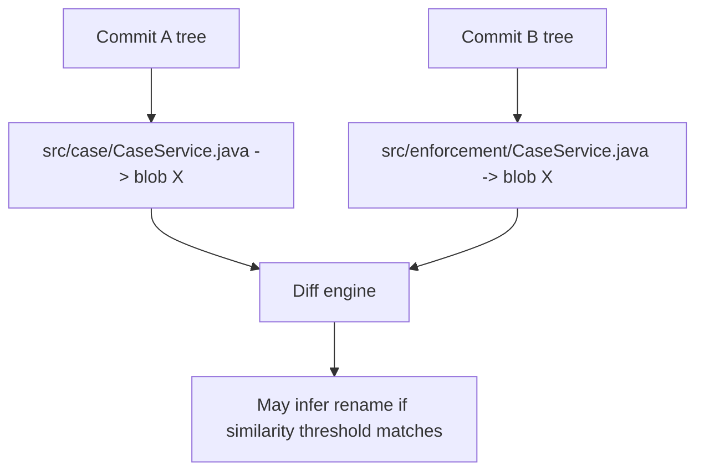

# Part 084 — Rename Detection, Copy Detection, and Review Risk

Git does not store “rename events” as first-class history objects.

Git stores snapshots.

A commit contains a tree. A tree maps path names to object IDs and modes. If a file path changes, the new tree simply has a different path entry. Rename detection is inferred later by comparing deleted files and added files.

This is the first invariant:

```txt
Rename is not stored. Rename is detected.
```

That one sentence explains many advanced Git surprises:

- `git mv` does not create a special rename object.
- `git diff` may show delete/add or rename depending on similarity detection.
- Review UIs may disagree with CLI output.
- A file can be “renamed” and heavily modified, but Git may not detect it as rename.
- Copy detection is even more expensive and less commonly enabled by default.
- Large mechanical refactors can hide behavior changes.

The official `gitdiffcore` documentation describes `diffcore-rename` as the transformation used to detect renames and copies. It is controlled by `-M` for renames and `-C` for copies. The `git diff` documentation exposes related options like `--find-renames`, `--find-copies`, `--break-rewrites`, and similarity thresholds.

References:

- <https://git-scm.com/docs/gitdiffcore>
- <https://git-scm.com/docs/git-diff>
- <https://git-scm.com/docs/directory-rename-detection>

---

## 1. Git Stores Snapshots, Not File Histories

A simplified Git commit:

```txt
commit
  parent: <parent-commit>
  tree:   <root-tree>
```

A simplified tree:

```txt
100644 blob a1b2... src/case/CaseService.java
100644 blob c3d4... src/case/CaseRepository.java
```

After a rename:

```txt
100644 blob a1b2... src/enforcement/CaseService.java
100644 blob c3d4... src/case/CaseRepository.java
```

The blob object may be identical. The path changed.

Git can infer:

```txt
src/case/CaseService.java -> src/enforcement/CaseService.java
```

But the commit did not store a rename operation.



This is why rename detection is configurable at diff time.

---

## 2. `git mv` Is Convenience, Not History Semantics

Command:

```bash
git mv old/path/File.java new/path/File.java
```

This is roughly equivalent to:

```bash
mv old/path/File.java new/path/File.java
git add new/path/File.java
git rm old/path/File.java
```

After commit, Git stores the resulting tree.

There is no durable “rename metadata” object created by `git mv`.

This matters for review:

```bash
# Depending on similarity detection, both may show rename.
git diff --find-renames HEAD~1 HEAD
```

And for history tracing:

```bash
git log --follow -- path/to/file
```

`--follow` asks Git to continue history across renames for a single path. It is useful, but it is still based on detection and has limitations.

---

## 3. Rename Detection Basics

Use:

```bash
git diff -M A B
```

or:

```bash
git diff --find-renames A B
```

With a threshold:

```bash
git diff -M90% A B
```

Meaning:

```txt
Only classify as rename if similarity is high enough.
```

Common examples:

```bash
# Default rename detection threshold.
git diff -M main...HEAD

# More strict.
git diff -M90% main...HEAD

# More permissive.
git diff -M30% main...HEAD
```

Review interpretation:

| Output | Meaning |
|---|---|
| `R100` | rename with identical content |
| `R095` | rename with 95% similarity |
| `D` + `A` | delete/add; Git did not classify as rename under current options |

Inspect:

```bash
git diff --name-status -M main...HEAD
```

Example output:

```txt
R100    src/case/CaseService.java    src/enforcement/CaseService.java
R087    src/case/CasePolicy.java     src/enforcement/CasePolicy.java
M       src/enforcement/CasePolicy.java
```

Note that actual output formatting can vary by command/options.

---

## 4. Copy Detection Basics

Use:

```bash
git diff -C A B
```

or:

```bash
git diff --find-copies A B
```

Copy detection asks:

```txt
Did an added file appear to come from an existing file, while the original still exists?
```

Example:

```txt
src/case/CasePolicy.java
src/escalation/EscalationPolicy.java
```

If similar enough, Git may infer a copy.

Use:

```bash
git diff --name-status -C main...HEAD
```

Possible output:

```txt
C082    src/case/CasePolicy.java    src/escalation/EscalationPolicy.java
```

Copy detection is generally more expensive than rename detection because the source candidate set can be larger.

Operational rule:

```txt
Enable copy detection when copy provenance matters. Do not assume it is always enabled in every UI/tool.
```

---

## 5. Break-Rewrite Detection

Some changes are technically modifications but semantically full rewrites.

Example:

```bash
git diff -B A B
```

or:

```bash
git diff --break-rewrites A B
```

This can split a total rewrite into delete/create style output, making review clearer.

Use when:

- a file was heavily rewritten,
- the normal diff is unreadable,
- you want to separate “old implementation removed” from “new implementation added”,
- rename detection is confused by large modifications.

Combined with rename detection:

```bash
git diff -B -M main...HEAD
```

This is useful when a file was both rewritten and moved.

Review warning:

```txt
A rewrite is high risk even when the diff is small or elegantly presented.
```

---

## 6. The Review Problem: Mechanical Move + Semantic Change

Dangerous PR shape:

```txt
Move package from src/case to src/enforcement
Change authorization rule during the move
Update imports everywhere
Reformat moved files
```

Diff output may say:

```txt
R065 src/case/CasePolicy.java -> src/enforcement/CasePolicy.java
```

A reviewer may think:

```txt
Mostly rename. Low risk.
```

But inside the 35% difference may be the real production change:

```diff
- return user.hasRole("CASE_MANAGER");
+ return user.hasPermission("ENFORCEMENT_ESCALATE");
```

This is the main rule of this part:

```txt
Rename detection reduces visual noise, but it can also reduce reviewer suspicion.
```

---

## 7. Safe Review Strategy for Rename/Move PRs

### 7.1 First classify the shape

```bash
git diff --name-status -M -C main...HEAD
```

Look for:

- many `R100` entries,
- many `R<low>` entries,
- delete/add pairs,
- high file count,
- sensitive path movement.

### 7.2 Inspect pure move vs modified move

```bash
# Show summary of renames.
git diff --summary -M main...HEAD

# Show full patch with rename detection.
git diff --histogram -M main...HEAD
```

### 7.3 Compare ignoring whitespace

```bash
git diff -w --histogram -M main...HEAD
```

If exact diff is huge but whitespace-ignore diff is small, the move may include formatting noise.

### 7.4 Inspect behavior-sensitive paths separately

```bash
git diff --histogram -M main...HEAD -- 'src/**/auth*' 'src/**/policy*' 'src/**/permission*'
```

### 7.5 Require split commits when needed

Best structure:

```txt
commit 1: move files only
commit 2: update package/import paths only
commit 3: apply behavior change
commit 4: update tests
```

If the move and behavior are mixed, ask for split unless urgent production constraints justify accepting higher risk.

---

## 8. Mechanical Refactor Protocol

A safe large move/refactor protocol:

### Step 1 — Snapshot current behavior

```bash
git switch -c refactor/move-case-module
```

Run tests before changes:

```bash
./gradlew test
# or npm test / mvn test / go test ./...
```

### Step 2 — Mechanical move only

```bash
git mv src/case src/enforcement
```

Update only imports/package declarations if required.

Commit:

```bash
git add -A
git commit -m 'Move case module under enforcement package'
```

### Step 3 — Verify move-only diff

```bash
git show --name-status -M --stat HEAD
git show -w --histogram -M HEAD
```

The whitespace-ignore diff should be boring.

### Step 4 — Behavior change separately

```bash
# edit behavior
git add -p
git commit -m 'Require enforcement escalation permission for case escalation'
```

### Step 5 — Review each commit independently

```bash
git log --oneline origin/main..HEAD
git show --histogram -M <move-commit>
git show --histogram <behavior-commit>
```

Reviewer can now answer:

```txt
Was the move mechanical?
Was the behavior change correct?
```

Those are different questions and should not be blended.

---

## 9. Directory Rename Detection

Git can reason about directory renames in merge machinery by aggregating individual file rename detection in some scenarios.

Example:

```txt
Branch A:
  src/case/* -> src/enforcement/*

Branch B:
  modifies src/case/DeadlinePolicy.java
```

During merge, Git may be able to place Branch B's modification under the new directory:

```txt
src/enforcement/DeadlinePolicy.java
```

But directory rename detection is not magic.

Failure modes:

- partial directory moves,
- files split across multiple destinations,
- new files added to old directory after the move,
- heavy modifications that reduce similarity,
- tooling/UI views that only show file-level diff.

Operational rule:

```txt
After a directory move, check active branches that touched the old path.
```

Commands:

```bash
# Find branches with changes under old path.
git branch --all --contains origin/main

git log --oneline --all -- src/case/

# Compare old and new path activity.
git log --oneline --all -- src/case/ src/enforcement/
```

For teams, announce directory moves before landing large refactors.

---

## 10. Rename Detection and Merge/Rebase

Rename detection affects merge/rebase outcomes because Git must decide which paths correspond across versions.

Potential cases:

| Case | Risk |
|---|---|
| One side renames, other side edits | Git may apply edit to renamed file. |
| Both sides rename differently | Conflict or surprising path choice. |
| One side deletes, other side edits | Modify/delete conflict. |
| One side copies, other side edits original | Copy detection may not protect semantics. |
| Directory moved, other branch adds file in old dir | Directory rename handling may be ambiguous. |

During conflict:

```bash
git status
git diff --name-status --diff-filter=U
git ls-files -u
```

Read conflict as topology + path mapping problem, not only line conflict.

---

## 11. `--follow` and File History Across Renames

Use:

```bash
git log --follow -- path/to/file
```

This asks Git to continue history across renames for a single path.

Good for:

- tracing a file that moved,
- investigating ownership over time,
- finding original introduction of a function in a moved file.

Limitations:

- works on one path at a time,
- detection-based,
- can be confused by heavy rewrites,
- does not mean Git stores durable rename history,
- may miss complex copy/split/merge file evolution.

For archaeology, combine:

```bash
git log --follow --stat -- path/to/file
git log -M -C --find-copies-harder -- path/to/file
git log -S 'permissionName' --all -- path/to/file
```

---

## 12. Rename Detection in Release Audit

Release audit question:

```txt
Did a sensitive file change, or was it merely moved?
```

Bad audit:

```bash
git diff --name-only v1.2.0..v1.3.0
```

This may show old deletion/new addition without context.

Better:

```bash
git diff --name-status -M -C v1.2.0..v1.3.0
```

Then inspect sensitive moves:

```bash
git diff --histogram -M v1.2.0..v1.3.0 -- 'src/**/policy/**' 'src/**/auth/**'
```

Audit statement should distinguish:

```txt
File moved from A to B with no content change.
```

from:

```txt
File moved from A to B and authorization condition changed.
```

Those are not equivalent.

---

## 13. Rename Detection in Monorepos

Monorepos make rename detection harder because:

- many files are similar,
- package moves are broad,
- generated files are common,
- refactors touch thousands of paths,
- copy/paste patterns produce false copy candidates,
- CI may use path-based affected-project detection.

Guidelines:

### Keep mechanical moves isolated

```txt
Move-only PRs should not change behavior.
```

### Use ownership-aware review

If files move between ownership boundaries, review both old and new owners.

### Preserve import-only commits

Example:

```txt
commit 1: move module directory
commit 2: update import/package declarations
commit 3: adjust build configuration
commit 4: behavior change
```

### Recompute affected projects carefully

A path move may require testing:

- old owner area,
- new owner area,
- downstream dependents,
- build graph roots,
- release packaging.

Do not rely only on changed final paths.

---

## 14. Rename Detection and Path-Based CI

Path-based CI usually asks:

```txt
Which files changed?
```

But after rename:

```txt
old/path/File.java -> new/path/File.java
```

Which owner should run tests?

Safe answer:

```txt
Both old and new ownership surfaces may be affected.
```

Example script:

```bash
git diff --name-status -M origin/main...HEAD > /tmp/changed.txt

awk '$1 ~ /^R/ { print $2; print $3; next } { print $2 }' /tmp/changed.txt | sort -u
```

This emits both old and new paths for rename entries.

For ownership routing, use both.

For release audit, use both.

For migration planning, use both.

---

## 15. Copy Detection and Security Risk

Copying security-sensitive code can be risky.

Example:

```txt
Copy CasePermissionEvaluator into LegacyCasePermissionEvaluator
Modify small condition
```

Risks:

- old bug copied into new surface,
- old exception copied without context,
- future fix only applied to original,
- divergence begins silently,
- duplicated policy logic becomes inconsistent.

Use:

```bash
git diff -C --find-copies main...HEAD -- 'src/**/permission*' 'src/**/policy*'
```

For stronger search:

```bash
git log -S 'hasPermission' --all -- 'src/**'
```

Review question:

```txt
Should this be copied, extracted, or intentionally forked?
```

Copy detection is not just convenience. It reveals architectural debt.

---

## 16. Similarity Threshold Is a Review Lever

A rename detected at 95% similarity is different from one detected at 35%.

Commands:

```bash
git diff --name-status -M90% main...HEAD
git diff --name-status -M50% main...HEAD
git diff --name-status -M20% main...HEAD
```

Interpretation:

| If rename appears only at low threshold | Meaning |
|---|---|
| File moved and heavily changed | Review as rewrite plus move. |
| Similar boilerplate confused detection | Inspect manually. |
| Generated files dominate similarity | Do not infer semantic continuity. |
| File was split/merged | Review lineage as architectural change. |

For high-risk files, low-similarity rename should trigger more review, not less.

---

## 17. Large Refactor Review Playbook

Use this when a PR has many moved/renamed files.

### Step 1 — Shape

```bash
git diff --name-status -M -C origin/main...HEAD
```

### Step 2 — Count status categories

```bash
git diff --name-status -M -C origin/main...HEAD \
  | awk '{print $1}' \
  | sed 's/[0-9].*$//' \
  | sort \
  | uniq -c
```

### Step 3 — Inspect move-only equivalence

```bash
git diff -w --stat -M origin/main...HEAD
```

### Step 4 — Identify non-mechanical hunks

```bash
git diff -w --histogram -M origin/main...HEAD
```

### Step 5 — Audit sensitive files

```bash
git diff --name-status -M -C origin/main...HEAD \
  | grep -Ei 'auth|permission|policy|migration|crypto|secret|deploy|workflow'
```

### Step 6 — Ask for split if behavior is buried

Policy:

```txt
A large move/refactor PR must prove which commits are mechanical and which commits are semantic.
```

---

## 18. Case Study: Moving an Enforcement Workflow Module

Initial structure:

```txt
src/case/workflow/CaseStateMachine.java
src/case/workflow/EscalationPolicy.java
src/case/workflow/DeadlineCalculator.java
```

Target structure:

```txt
src/enforcement/workflow/CaseStateMachine.java
src/enforcement/workflow/EscalationPolicy.java
src/enforcement/workflow/DeadlineCalculator.java
```

Bad PR:

```txt
Move workflow package and improve escalation behavior
```

Problems:

- reviewers see many renamed files,
- import changes create noise,
- escalation behavior change is buried,
- tests might pass but audit trail is weak,
- release note cannot isolate behavior change.

Good commit series:

```txt
1. Move case workflow package under enforcement
2. Update imports for enforcement workflow package
3. Rename CaseEscalationPolicy to EnforcementEscalationPolicy
4. Require supervisor approval for severe enforcement escalation
5. Add regression tests for severe escalation approval
```

Review commands:

```bash
# Mechanical move commit
git show --name-status -M <commit-1>
git show -w --histogram -M <commit-1>

# Behavior commit
git show --histogram <commit-4>

# Test commit
git show --histogram <commit-5>
```

Now audit evidence is clear:

```txt
The behavior change is commit 4, not hidden inside the package move.
```

---

## 19. False Sense of Safety: `R100`

`R100` means identical file content under rename detection.

It does not mean:

- build behavior is identical,
- package/class identity is identical,
- runtime resource lookup is identical,
- ownership is identical,
- deployment packaging is identical,
- import paths are correct,
- reflection/classpath behavior is unchanged,
- configuration references were updated.

Example:

```txt
R100 config/dev/rules.yaml -> config/prod/rules.yaml
```

Content identical, but risk is huge because environment boundary changed.

Review rule:

```txt
Rename similarity is content similarity, not system equivalence.
```

---

## 20. False Sense of Danger: Delete/Add

Delete/add does not always mean unrelated files.

A file can be renamed and heavily edited enough that Git shows:

```txt
D old/path/RuleEngine.java
A new/path/RuleEngine.java
```

Investigate manually:

```bash
git diff -M20% --name-status main...HEAD
```

or compare files directly:

```bash
git diff --no-index old-copy.java new-copy.java
```

If source exists in history:

```bash
git show main:old/path/RuleEngine.java > /tmp/old.java
git show HEAD:new/path/RuleEngine.java > /tmp/new.java
git diff --no-index --histogram /tmp/old.java /tmp/new.java
```

This is useful when Git's automatic detection is insufficient for review.

---

## 21. Tooling Guardrail: Detect Dangerous Mixed Rename PRs

A simple script idea:

```bash
#!/usr/bin/env bash
set -euo pipefail

base=${1:-origin/main}

renames=$(git diff --name-status -M "$base"...HEAD | awk '$1 ~ /^R/ { print $0 }')

if [ -z "$renames" ]; then
  exit 0
fi

echo "Rename summary:"
echo "$renames"

echo

echo "Non-whitespace patch after rename detection:"
git diff -w --histogram -M "$base"...HEAD --stat

echo

echo "Sensitive renamed paths:"
echo "$renames" | grep -Ei 'auth|permission|policy|migration|workflow|deploy|secret|crypto' || true
```

This does not approve or reject. It surfaces risk.

Advanced version:

- compare exact vs `-w` stats,
- enforce max non-whitespace churn in move-only PR,
- require owner review for old and new paths,
- block behavior changes in `refactor/move-*` branches unless explicitly labeled.

---

## 22. Git Attributes and Rename Review

For generated/binary files, rename detection may be unhelpful.

`.gitattributes` can reduce bad signal:

```gitattributes
*.png binary
*.pdf binary
generated/** -diff
*.lock diff=lockfile
```

For domain files, custom diff drivers can improve hunk context:

```gitattributes
*.policy diff=policy
*.workflow diff=workflow
```

Config:

```ini
[diff "workflow"]
  xfuncname = "^(state|transition|guard|action)[[:space:]].*$"
```

This matters when files move across directories but contain domain-specific rule changes.

---

## 23. Operational Policy for Teams

A strong Git workflow defines rename/refactor rules.

Recommended policy:

```txt
1. Pure move/rename commits must not change behavior.
2. Formatting-only changes must not be mixed with behavior changes.
3. High-risk files moved across ownership boundaries require old and new owner review.
4. Large rename PRs must include a review note explaining mechanical vs semantic commits.
5. CI affected-path logic must consider both old and new paths for renames.
6. Release audit must classify moved sensitive files separately from modified sensitive files.
7. Low-similarity rename of sensitive file must be reviewed as rewrite.
```

This is not bureaucracy. It is signal preservation.

---

## 24. Exercises

### Exercise 1 — Rename-only vs rename-plus-change

```bash
mkdir /tmp/git-rename-lab
cd /tmp/git-rename-lab
git init
mkdir -p src/case src/enforcement
cat > src/case/policy.txt <<'TXT'
rule: case_manager_can_escalate
condition: user.role == CASE_MANAGER
TXT
git add .
git commit -m 'Add case policy'
```

Rename only:

```bash
git mv src/case/policy.txt src/enforcement/policy.txt
git commit -am 'Move policy under enforcement'

git show --name-status -M HEAD
git show -w --histogram -M HEAD
```

Then modify:

```bash
sed -i.bak 's/user.role == CASE_MANAGER/user.permission == ENFORCEMENT_ESCALATE/' src/enforcement/policy.txt
rm src/enforcement/policy.txt.bak
git add .
git commit -m 'Require enforcement escalation permission'

git show --histogram HEAD
```

Compare with a single mixed commit by resetting and doing both together.

Questions:

1. Which history is easier to review?
2. Which history is easier to audit?
3. Which history is safer to revert?

### Exercise 2 — Threshold impact

```bash
git diff --name-status -M90% HEAD~2..HEAD
git diff --name-status -M50% HEAD~2..HEAD
git diff --name-status -M20% HEAD~2..HEAD
```

Question:

```txt
At which threshold does Git classify movement as rename?
```

### Exercise 3 — Manual compare when detection fails

```bash
git show HEAD~2:src/case/policy.txt > /tmp/old-policy.txt
git show HEAD:src/enforcement/policy.txt > /tmp/new-policy.txt
git diff --no-index --histogram /tmp/old-policy.txt /tmp/new-policy.txt || true
```

---

## 25. Key Takeaways

Git stores snapshots. Rename and copy detection are inferred views.

`git mv` is useful, but it does not create permanent rename metadata.

`-M` detects renames. `-C` detects copies. `-B` can make rewrites easier to review.

Rename detection is helpful because it reduces noise.

Rename detection is dangerous because it can reduce suspicion.

A moved file with 70% similarity may contain the one 30% that matters.

Large refactors must preserve review signal by separating:

- move,
- formatting,
- import/package adjustment,
- behavior,
- tests,
- generated output.

For high-risk systems, the question is never merely:

```txt
Did Git detect a rename?
```

The real question is:

```txt
Can reviewers and auditors clearly see whether behavior changed?
```

---

## References

- Git `diff` documentation: <https://git-scm.com/docs/git-diff>
- Git diffcore documentation: <https://git-scm.com/docs/gitdiffcore>
- Git directory rename detection documentation: <https://git-scm.com/docs/directory-rename-detection>
- Git `log` documentation: <https://git-scm.com/docs/git-log>
- Git attributes documentation: <https://git-scm.com/docs/gitattributes>
