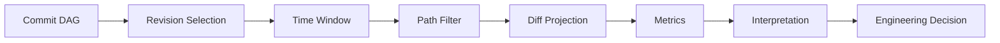
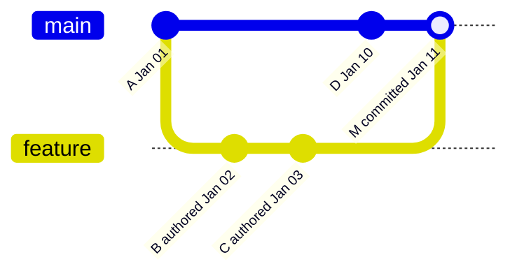
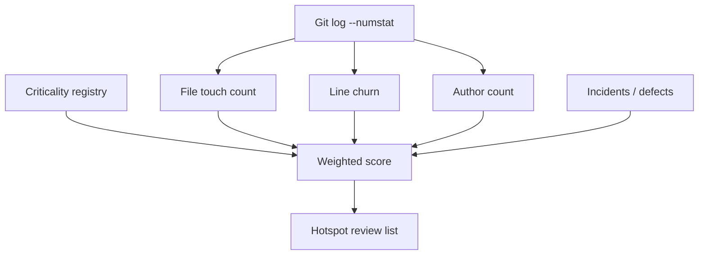
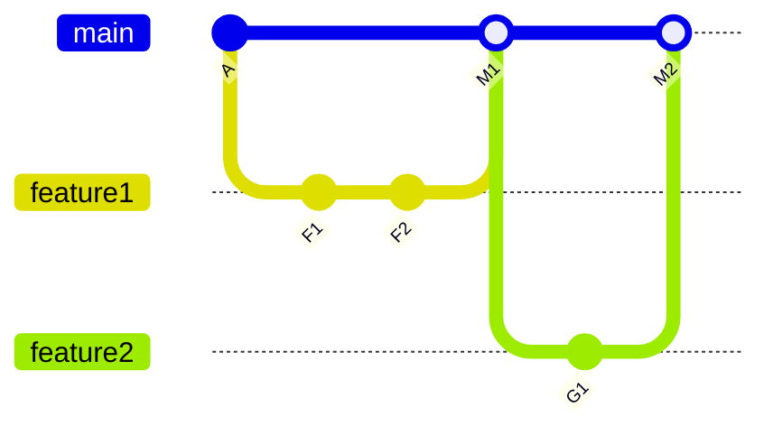
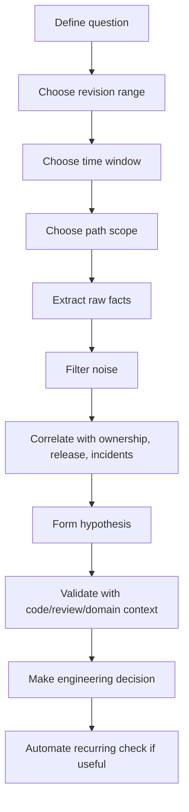

# Part 085 — Time-Based History Analysis

Git history is often treated as a list of commits. That is the shallow model.

For engineering leadership, platform teams, release engineers, and senior reviewers, Git history is also a **temporal signal system**:

- where the code changes most often,
- which parts are stable but dangerous,
- which files repeatedly change near incidents,
- which ownership boundaries are decaying,
- which release windows produce risky changes,
- which branches are drifting away from the mainline,
- which subsystems have hidden coordination cost.

This part is about using Git history as a **risk analysis input**, not as a vanity metric machine.

The core rule:

> Time-based Git analysis should help you reduce engineering risk. It should not be used to score individual developer productivity.

A commit count is not productivity. Lines changed are not value. Churn is not automatically bad. A low-change file is not automatically safe. The point is to correlate time, change, ownership, release boundary, and system criticality.

---

## 1. Mental Model: Git History as Temporal Event Stream

Git stores snapshots connected by parent links. But commands like `git log`, `git rev-list`, `git shortlog`, and `git for-each-ref` let us project that graph into timelines, counters, ranges, and ownership views.



The dangerous part is the last two steps. Git can produce facts. Humans often overinterpret them.

A good analysis separates:

| Layer | Question | Example |
|---|---|---|
| Raw Git fact | What happened? | `auth/policy.go` changed 46 times in 90 days. |
| Derived metric | What pattern exists? | High churn, mostly by 2 authors, mostly before releases. |
| Engineering interpretation | Why might it matter? | Authorization policy is unstable and release-coupled. |
| Decision | What should we do? | Add ownership review, stronger tests, or isolate policy engine. |

Do not skip from raw fact to management conclusion.

---

## 2. Date Semantics: Author Date, Committer Date, Topological Reality

A Git commit has author metadata and committer metadata.

- **Author date**: when the original change was authored.
- **Committer date**: when the commit object was created in the current history, often affected by rebase, cherry-pick, amend, or import.
- **Topology**: parent relationship, which defines ancestry and integration order.

These three are not the same.



A feature commit may have been authored days before it was integrated. A cherry-picked commit may preserve author date but get a new committer date. A rebase may preserve author date while rewriting committer date.

### Practical implication

For different questions, choose different clocks:

| Question | Prefer |
|---|---|
| When did this idea originate? | Author date |
| When did this history line accept it? | Committer date or first-parent integration date |
| What changed between releases? | Tag/commit range, not wall-clock only |
| What code shipped? | Reachability from release tag |
| What did reviewers see in PR? | Platform PR metadata, not Git alone |

A time window alone can lie if you ignore topology.

---

## 3. The Minimal Command Set

The following commands are enough to build serious repository analysis:

```bash
# Commit stream by time window
git log --since="90 days ago" --until="now" --format='%H%x09%an%x09%ae%x09%ad%x09%s' --date=iso-strict

# Count commits in a range
git rev-list --count v2.3.0..v2.4.0

# First-parent release integration stream
git log --first-parent --oneline v2.3.0..v2.4.0

# Churn by file in a time window
git log --since="90 days ago" --numstat --format='commit %H' -- .

# Author summary
git shortlog -sn --since="90 days ago" --all

# Recent branch tips
git for-each-ref --sort=-committerdate \
  --format='%(committerdate:iso8601)%09%(refname:short)%09%(objectname:short)' \
  refs/heads refs/remotes

# Tag timeline
git for-each-ref --sort=-creatordate \
  --format='%(creatordate:iso8601)%09%(refname:short)%09%(objectname:short)' \
  refs/tags
```

The commands are simple. The discipline is in choosing a correct range and interpreting the result.

---

## 4. Time Window Is Not Enough: Always Define the Boundary

A vague question like “what changed recently?” is underspecified.

Better questions:

- What changed between `v2.7.1` and `v2.8.0`?
- What changed on the first-parent release path during the last release cycle?
- Which files changed most often in `main` in the last 90 days?
- Which files changed in hotfix branches but not yet forward-ported to `main`?
- Which directories had high churn from many authors right before incidents?

A proper analysis has four parameters:

```text
analysis = revision_range + time_window + path_scope + projection
```

Examples:

```bash
# Release-boundary analysis
git log --first-parent --oneline v2.8.0..v2.9.0

# Time-window analysis over all refs
git log --all --since="2026-04-01" --until="2026-06-30" --oneline

# Path-scoped analysis
git log --since="90 days ago" --oneline -- services/auth/

# Diff projection per commit
git log --since="90 days ago" --numstat --format='-- %H %ad %an' --date=short -- services/auth/
```

Use release ranges for release questions. Use time windows for activity questions. Use topology for integration questions.

---

## 5. Metric 1: Change Frequency

Change frequency asks: how often does a file, directory, or subsystem change?

```bash
git log --since="90 days ago" --name-only --format='' -- services/auth/ \
  | sed '/^$/d' \
  | sort \
  | uniq -c \
  | sort -nr \
  | head -30
```

Interpretation:

| Observation | Possible meaning | Not enough without |
|---|---|---|
| High change frequency | Active feature area, instability, or poor boundaries | Domain context |
| Low change frequency | Stable area or neglected critical code | Criticality map |
| Many files changed together | Coupling or coordinated feature work | Commit grouping |
| Same file changed across releases | Release-coupled hotspot | Incident/release data |

High change frequency is not inherently bad. A healthy product area changes often. The risk increases when high frequency combines with criticality, poor tests, unclear ownership, or high defect rate.

---

## 6. Metric 2: Churn

Churn usually means added plus deleted lines over time.

```bash
git log --since="90 days ago" --numstat --format='' -- . \
  | awk 'NF==3 && $1 ~ /^[0-9]+$/ && $2 ~ /^[0-9]+$/ { add[$3]+=$1; del[$3]+=$2 } \
         END { for (f in add) print add[f]+del[f], add[f], del[f], f }' \
  | sort -nr \
  | head -50
```

Output shape:

```text
TOTAL_CHURN ADDED DELETED FILE
1288        703   585     services/auth/policy_engine.go
911         480   431     web/src/routes/cases.tsx
```

Churn is useful because a file repeatedly rewritten is often expensive to understand.

But churn lies when:

- generated files are included,
- vendor files are included,
- lockfiles dominate the output,
- formatting commits rewrite many lines,
- file renames are treated as delete/add,
- squashed commits hide real temporal behavior,
- migration commits are mixed with business changes.

Filter aggressively:

```bash
git log --since="90 days ago" --numstat --format='' -- \
  ':(exclude)vendor/**' \
  ':(exclude)**/dist/**' \
  ':(exclude)**/*.min.js' \
  ':(exclude)**/package-lock.json'
```

The goal is not a beautiful chart. The goal is to identify where human review and architecture attention should go.

---

## 7. Metric 3: Hotspot Score

A useful hotspot combines at least two dimensions:

```text
hotspot_score = change_frequency * churn * criticality_weight
```

You can start simple:

```bash
git log --since="180 days ago" --numstat --format='commit %H' -- . \
  | awk '
      /^commit / {next}
      NF==3 && $1 ~ /^[0-9]+$/ && $2 ~ /^[0-9]+$/ {
        commits[$3] += 1
        churn[$3] += $1 + $2
      }
      END {
        for (f in churn) print churn[f] * commits[f], commits[f], churn[f], f
      }
    ' \
  | sort -nr \
  | head -30
```

This naive version overcounts if one commit changes the same file once, but it is often enough for a first pass.

A better model separates:

- number of commits touching file,
- total line churn,
- number of authors,
- recency,
- criticality,
- test coverage,
- incidents linked to file.



Do not pretend the formula is objective truth. It is a triage lens.

---

## 8. Metric 4: Ownership Distribution

Ownership analysis asks: who has been changing this area?

```bash
git shortlog -sn --since="180 days ago" -- services/auth/
```

For email-level grouping:

```bash
git log --since="180 days ago" --format='%ae' -- services/auth/ \
  | sort \
  | uniq -c \
  | sort -nr
```

Questions to ask:

| Pattern | Risk |
|---|---|
| One person owns critical code | Bus factor / review bottleneck |
| Many drive-by authors touch critical file | Boundary unclear or ownership weak |
| Bot dominates churn | Generated/dependency noise may hide real work |
| Old owner left, no recent owner appears | Ownership decay |
| Same area touched by multiple teams | Cross-team coordination boundary |

Ownership is not blame. Ownership is about who can responsibly approve, explain, and maintain the subsystem.

---

## 9. Ownership Decay

Ownership decay happens when code remains critical but the people who understand it stop touching or reviewing it.

Symptoms:

- critical subsystem has no recent human author,
- recent changes are only dependency updates,
- current maintainers do not understand historical decisions,
- PR reviews are routed to generic team aliases,
- incidents require archaeology before action.

A quick view:

```bash
# Last human changes per directory, ignoring bots by crude email filter
git log --since="2 years ago" --format='%ad%x09%an%x09%ae' --date=short -- services/auth/ \
  | grep -vi 'bot\|noreply\|automation' \
  | head -20
```

A stronger view by file:

```bash
for f in $(git ls-files services/auth); do
  last=$(git log -1 --format='%ad %an <%ae>' --date=short -- "$f")
  printf '%s	%s
' "$last" "$f"
done | sort | head -50
```

Use this to plan knowledge transfer, not to shame teams.

---

## 10. Temporal Coupling

Temporal coupling means files often change together.

Example:

- `PolicyEngine.java`
- `CaseEscalationRules.java`
- `CaseStatusTransitionValidator.java`

If they change together repeatedly, they may represent one conceptual module split across awkward boundaries.

A rough extraction:

```bash
git log --since="180 days ago" --name-only --format='---COMMIT---' -- services/ \
  | awk '
      /^---COMMIT---/ {
        for (i=1; i<=n; i++) for (j=i+1; j<=n; j++) print files[i], files[j]
        delete files; n=0; next
      }
      NF { files[++n]=$0 }
    ' \
  | sort \
  | uniq -c \
  | sort -nr \
  | head -50
```

Interpretation:

| Temporal coupling | Possible response |
|---|---|
| Files always change together | Consider module consolidation or clearer abstraction |
| Test changes always accompany implementation | Good sign if expected |
| Config always changes with code | Consider typed config/versioned schema |
| DB migration always changes with application logic | Need deployment sequencing rules |
| Frontend and backend contract always change together | Consider contract tests or API versioning |

Temporal coupling is especially important in microservices and regulatory workflows where one business transition touches UI, API, state machine, policy engine, eventing, and audit logging.

---

## 11. Release Window Analysis

Time-based analysis becomes more valuable when aligned to release boundaries.

Example:

```bash
# First-parent release commits
git log --first-parent --format='%h %ad %s' --date=short v3.2.0..v3.3.0

# Files changed in a release
git diff --name-only v3.2.0..v3.3.0

# High churn during release stabilization
git log --since="2026-06-01" --until="2026-06-15" --numstat --format='' -- release/3.3
```

Good release analysis separates:

| Window | Meaning |
|---|---|
| Feature development | Expected broad changes |
| Stabilization | Only blocker fixes should land |
| Release candidate | Only release-critical corrections |
| Post-release hotfix | Production-impacting changes |
| Maintenance branch | Backport and support fixes |

Red flags:

- large refactors during stabilization,
- configuration changes after RC tag,
- migration changes late in release,
- security-sensitive code touched without owner review,
- release branch diverges from main without forward-port plan,
- hotfix branch has commits not present in main.

---

## 12. Branch Age and Drift

Long-lived branches accumulate integration debt.

Find stale local branches:

```bash
git for-each-ref --sort=committerdate \
  --format='%(committerdate:short)%09%(refname:short)%09%(objectname:short)' \
  refs/heads
```

Find branches not merged into main:

```bash
git branch --no-merged main
```

Estimate divergence:

```bash
git rev-list --left-right --count main...feature/some-work
```

Output:

```text
12  37
```

Meaning:

- 12 commits reachable from `main` but not branch,
- 37 commits reachable from branch but not `main`.

Risk grows when divergence combines with:

- high-churn target files,
- release pressure,
- unclear branch owner,
- no CI against merge result,
- rebased public branch,
- stale approvals.

---

## 13. Integration-Time Analysis with First Parent

For release and production history, first-parent view often matters more than raw chronological history.

```bash
git log --first-parent --oneline main
```

Why?

In a merge-heavy workflow, the first-parent chain shows what was integrated into the mainline and when.



Raw log may show feature commits by author date. First-parent log shows integration events `M1`, `M2`.

Use first-parent for:

- release notes by merged PR,
- integration timeline,
- bisecting mainline health,
- incident containment,
- determining when code entered protected branch.

Avoid first-parent for:

- finding the original commit that changed a line,
- auditing all commits in a feature branch,
- detecting exact patch authorship.

---

## 14. Risk Patterns by Time Shape

Time shape matters. The same churn total can mean different things.

### 14.1 Steady churn

```text
small changes every week
```

Possible meaning:

- actively maintained subsystem,
- evolving requirements,
- continuous improvement.

Risk if tests/owners are weak.

### 14.2 Burst churn

```text
quiet for months, then huge rewrite
```

Possible meaning:

- migration,
- emergency fix,
- architecture refactor,
- late release scramble.

Risk if review is rushed or ownership stale.

### 14.3 Release-edge churn

```text
changes cluster right before tags
```

Possible meaning:

- stabilization fixes,
- release process pressure,
- poor earlier validation.

Risk if sensitive files change after RC.

### 14.4 Multi-team churn

```text
same files touched by many teams in short window
```

Possible meaning:

- unclear ownership,
- cross-cutting concern,
- shared abstraction too weak.

Risk: semantic conflicts even if textual conflicts are rare.

---

## 15. Do Not Weaponize Git Metrics

Bad use:

```text
Engineer A made 42 commits. Engineer B made 12 commits. A is better.
```

This is nonsense.

Git metrics are distorted by:

- pairing,
- squash merge,
- review work not reflected as commits,
- debugging time,
- design work,
- incident response,
- generated code,
- large deletes,
- rebase/amend style,
- bot commits,
- team conventions.

Good use:

```text
The authorization policy area changed in every release, has high churn, only one active reviewer, and is involved in recent incidents. We should improve tests, ownership, and module boundaries.
```

The target is system improvement.

---

## 16. Build a Simple History Analyzer

Create a script `git-history-hotspots.sh`:

```bash
#!/usr/bin/env bash
set -euo pipefail

SINCE="${1:-180 days ago}"
SCOPE="${2:-.}"

printf 'Analyzing since: %s\n' "$SINCE" >&2
printf 'Scope: %s\n' "$SCOPE" >&2

# Format: score, touches, churn, authors, file
git log --since="$SINCE" --numstat --format='@@COMMIT@@ %H %ae' -- "$SCOPE" \
  | awk '
      /^@@COMMIT@@/ { commit=$2; author=$3; next }
      NF==3 && $1 ~ /^[0-9]+$/ && $2 ~ /^[0-9]+$/ {
        file=$3
        key=commit SUBSEP file
        if (!(key in seen)) {
          touches[file]++
          seen[key]=1
        }
        churn[file]+=$1+$2
        authors[file SUBSEP author]=1
      }
      END {
        for (k in authors) {
          split(k, parts, SUBSEP)
          author_count[parts[1]]++
        }
        for (f in churn) {
          score=touches[f]*churn[f]
          print score, touches[f], churn[f], author_count[f], f
        }
      }
    ' \
  | sort -nr \
  | head -50
```

Run:

```bash
chmod +x git-history-hotspots.sh
./git-history-hotspots.sh "180 days ago" services/auth/
```

Use the result as a review agenda, not as a final report.

---

## 17. Build a CSV for Deeper Analysis

Sometimes shell is enough. Sometimes you need a CSV.

```bash
git log --since="180 days ago" \
  --date=iso-strict \
  --numstat \
  --format='COMMIT%x09%H%x09%an%x09%ae%x09%ad%x09%s' \
  -- . > git-numstat.tsv
```

Each commit header is followed by numstat rows. You can parse it into structured data with Python:

```python
from __future__ import annotations

import csv
from pathlib import Path

input_file = Path("git-numstat.tsv")
output_file = Path("git-file-churn.csv")

current = None
rows = []

for line in input_file.read_text(encoding="utf-8", errors="replace").splitlines():
    parts = line.split("\t")
    if parts and parts[0] == "COMMIT":
        _, commit, author_name, author_email, date, subject = parts[:6]
        current = {
            "commit": commit,
            "author_name": author_name,
            "author_email": author_email,
            "date": date,
            "subject": subject,
        }
        continue

    if current and len(parts) == 3:
        added, deleted, path = parts
        if added == "-" or deleted == "-":
            # binary file in numstat
            added_i = deleted_i = 0
            binary = True
        else:
            added_i = int(added)
            deleted_i = int(deleted)
            binary = False

        rows.append({
            **current,
            "path": path,
            "added": added_i,
            "deleted": deleted_i,
            "churn": added_i + deleted_i,
            "binary": binary,
        })

with output_file.open("w", newline="", encoding="utf-8") as f:
    writer = csv.DictWriter(f, fieldnames=list(rows[0].keys()))
    writer.writeheader()
    writer.writerows(rows)

print(f"Wrote {len(rows)} file-change rows to {output_file}")
```

From there you can group by directory, author, release window, or file type.

---

## 18. Directory-Level Aggregation

File-level analysis can be noisy. Directory-level analysis often better matches ownership.

```bash
git log --since="180 days ago" --numstat --format='' -- . \
  | awk '
      NF==3 && $1 ~ /^[0-9]+$/ && $2 ~ /^[0-9]+$/ {
        path=$3
        split(path, parts, "/")
        dir=parts[1]
        if (parts[2] != "") dir=parts[1] "/" parts[2]
        churn[dir]+=$1+$2
        files[dir][path]=1
      }
      END {
        for (d in churn) print churn[d], d
      }
    ' \
  | sort -nr
```

Use directory-level results to ask:

- Is a team boundary aligned to code churn?
- Are shared libraries absorbing too much unrelated change?
- Are release-critical modules changing late?
- Are tests changing with implementation?
- Is one directory becoming a dumping ground?

---

## 19. Detecting Risky Release Diff Shapes

A risky release diff is not just “large”. It is large in the wrong places.

Check changed files between tags:

```bash
git diff --name-only v2.8.0..v2.9.0
```

Check sensitive areas:

```bash
git diff --name-only v2.8.0..v2.9.0 -- \
  ':(top)services/auth/**' \
  ':(top)infra/**' \
  ':(top).github/workflows/**' \
  ':(top)**/migrations/**'
```

Check churn:

```bash
git diff --numstat v2.8.0..v2.9.0 \
  | sort -nr \
  | head -30
```

Check release branch uniqueness:

```bash
# commits in release branch but not main
git log --oneline main..release/2.9

# commits in main but not release branch
git log --oneline release/2.9..main
```

For regulated or high-risk systems, create a release evidence summary:

```text
Release: v2.9.0
Previous release: v2.8.0
Commit range: v2.8.0..v2.9.0
First-parent integration commits: N
Sensitive files changed: yes/no
Database migrations: yes/no
Authorization changes: yes/no
CI/CD changes: yes/no
Config changes: yes/no
Hotfixes not forward-ported: none/list
Tag verified: yes/no
```

---

## 20. Time-Based Analysis for Regulatory Systems

In enforcement lifecycle systems, case management systems, and audit-heavy platforms, time-based Git analysis should align with domain risk.

Examples of sensitive code categories:

| Category | Why time analysis matters |
|---|---|
| State machine transitions | Late changes can alter legal process behavior |
| Escalation rules | Policy changes must be explainable |
| Authorization checks | Small changes can create unauthorized access |
| Evidence handling | Chain-of-custody risk |
| Audit logging | Missing logs can damage defensibility |
| Notification rules | Missed or incorrect notice may have procedural impact |
| Data retention | Legal/compliance exposure |
| Migration scripts | Irreversible data transformation risk |

A useful query:

```bash
git log --since="12 months ago" --format='%h %ad %an %s' --date=short -- \
  services/case-lifecycle/ \
  services/policy/ \
  services/audit/ \
  services/authz/
```

Then ask:

- Were changes linked to approved requirements?
- Did sensitive changes land near release cutoff?
- Did the correct owner review them?
- Did tests and documentation change with behavior?
- Did runtime audit/event schema change?
- Is the shipped artifact pinned to the inspected commit?

Git alone cannot prove compliance, but it can provide evidence boundaries.

---

## 21. Bot and Automation Noise

Modern repositories include bots:

- dependency update bots,
- formatting bots,
- code generation bots,
- release bots,
- merge queue bots,
- localization sync bots.

Filter them deliberately:

```bash
git log --since="180 days ago" --format='%ae' \
  | grep -viE 'bot|noreply|automation|dependabot' \
  | sort \
  | uniq -c \
  | sort -nr
```

But do not always remove bots. Bot activity is itself a signal:

| Bot pattern | Possible signal |
|---|---|
| Frequent dependency bot changes | Supply-chain churn |
| Bot-only changes in critical module | Human ownership decay |
| Failed bot PRs | Fragile dependency/testing setup |
| Large generated diffs | Poor review signal |
| Release bot moved tags | Release integrity concern |

---

## 22. Merge Commits, Squash Merges, and History Shape Bias

Your metrics depend heavily on merge policy.

| Workflow | Analysis bias |
|---|---|
| Merge commits | More topology available, but raw log includes branch commits |
| Squash merge | PR appears as one commit; author/review detail may be lost in Git |
| Rebase merge | Linear history, commit series preserved, integration event less explicit |
| Fast-forward only | Clean line, but PR grouping may require platform data |
| Cherry-pick backports | Duplicate patch intent across branches |

For squash-heavy teams, Git alone may not answer:

- who reviewed the change,
- how many iterations occurred,
- what commits existed before squash,
- which PR discussion justified the decision.

In that case, combine Git with platform metadata.

---

## 23. Time-Based Branch Hygiene Report

A weekly branch hygiene report can prevent integration debt.

```bash
#!/usr/bin/env bash
set -euo pipefail

BASE="${1:-origin/main}"

git fetch --prune

printf 'Branch\tLastCommit\tBehind\tAhead\tOwnerGuess\n'

git for-each-ref --format='%(refname:short)' refs/remotes/origin \
  | grep -v '^origin/HEAD$' \
  | while read -r branch; do
      last_date=$(git log -1 --format='%ad' --date=short "$branch")
      counts=$(git rev-list --left-right --count "$BASE...$branch" || echo "? ?")
      owner=$(git log -1 --format='%an <%ae>' "$branch")
      printf '%s\t%s\t%s\t%s\n' "$branch" "$last_date" "$counts" "$owner"
    done \
  | sort -k2
```

Use report categories:

| Category | Rule of thumb |
|---|---|
| Fresh | active and regularly integrated |
| Stale | no commits for 30+ days |
| Diverged | high ahead/behind count |
| Orphaned | owner left or unknown |
| Release-critical | branch maps to supported release |
| Dangerous | stale + high divergence + sensitive files |

---

## 24. The Analysis Loop

A professional time-based history analysis follows a loop:



If you cannot state the decision the analysis supports, you are probably just generating charts.

---

## 25. Common Failure Modes

| Failure | Consequence | Prevention |
|---|---|---|
| Counting commits as productivity | Wrong incentives | Use metrics for system risk only |
| Ignoring merge policy | Misread timeline | Use first-parent or platform data where needed |
| Ignoring generated files | False hotspots | Exclude generated/vendor paths |
| Ignoring author vs committer date | Wrong chronology | Pick clock intentionally |
| Ignoring release tags | Bad release analysis | Analyze tag ranges |
| Ignoring path renames | Split history | Use `--follow` carefully and inspect renames |
| Ignoring bots | Noise or missed signal | Classify bot activity explicitly |
| Using shallow clone | Incomplete history | Fetch enough history/tags for analysis |
| Using local stale refs | Wrong branch data | `git fetch --prune --tags` first |
| Treating metrics as truth | Bad management decisions | Validate with context |

---

## 26. Practical Playbooks

### 26.1 Pre-refactor hotspot scan

```bash
# Find churn in candidate module
git log --since="12 months ago" --numstat --format='' -- services/case-lifecycle/ \
  | awk 'NF==3 && $1 ~ /^[0-9]+$/ { churn[$3]+=$1+$2 } END { for (f in churn) print churn[f], f }' \
  | sort -nr \
  | head -30

# Find recent authors
git shortlog -sn --since="12 months ago" -- services/case-lifecycle/

# Find temporal coupling
git log --since="12 months ago" --name-only --format='---' -- services/case-lifecycle/
```

Decision:

- refactor the highest-churn seams first,
- involve current and historical owners,
- add characterization tests around volatile behavior,
- avoid mixing mechanical move and semantic change.

### 26.2 Release risk scan

```bash
PREV=v2.8.0
NEXT=v2.9.0

git log --first-parent --oneline "$PREV..$NEXT"
git diff --name-only "$PREV..$NEXT" -- services/authz/ services/audit/ infra/ .github/workflows/
git diff --numstat "$PREV..$NEXT" | sort -nr | head -50
git tag -v "$NEXT" || true
```

Decision:

- require additional owner review for sensitive areas,
- verify migrations and config changes,
- confirm artifact commit SHA equals tag target,
- include sensitive-change evidence in release record.

### 26.3 Ownership decay scan

```bash
MODULE=services/policy

git shortlog -sn --since="2 years ago" -- "$MODULE"
git shortlog -sn --since="90 days ago" -- "$MODULE"

git log -1 --format='%ad %an <%ae> %h %s' --date=short -- "$MODULE"
```

Decision:

- update CODEOWNERS,
- assign review rotation,
- schedule knowledge transfer,
- add architectural documentation.

---

## 27. Exercises

### Exercise 1 — Build a release churn report

Pick two release tags and produce:

- commit count,
- first-parent merge count,
- top 20 files by churn,
- sensitive file changes,
- authors involved,
- release risk summary.

### Exercise 2 — Find top hotspots

For a repository you know, generate top hotspots for the last 180 days. For each top 10 file, classify:

- active feature area,
- architectural hotspot,
- generated noise,
- dependency noise,
- release-critical file,
- ownership risk.

### Exercise 3 — Detect ownership decay

Pick one critical directory and compare contributors over:

- last 30 days,
- last 180 days,
- last 2 years.

Write whether ownership is healthy, concentrated, noisy, or decaying.

### Exercise 4 — Temporal coupling investigation

Find pairs of files that often change together. Decide whether they represent:

- healthy implementation/test pairing,
- poor module boundary,
- missing abstraction,
- shared config coupling,
- deployment sequencing coupling.

---

## 28. Final Mental Model

Time-based Git analysis is not about drawing charts from commits.

It is about answering engineering questions with historical evidence:

- Where is change concentrated?
- Which critical areas are unstable?
- Which stable areas have lost ownership?
- Which release windows are risky?
- Which branches are drifting?
- Which files move together and reveal hidden coupling?
- Which changes require stronger review or tests?

Use Git as the evidence source. Use engineering judgment as the interpreter.

The strongest signal is rarely one metric. It is usually a combination:

```text
risk = criticality + churn + ownership weakness + release pressure + poor tests
```

That is the level of analysis senior engineers need.

---

## References

- Git `git-log` documentation: https://git-scm.com/docs/git-log
- Git `git-rev-list` documentation: https://git-scm.com/docs/git-rev-list
- Git `git-shortlog` documentation: https://git-scm.com/docs/git-shortlog
- Git `git-for-each-ref` documentation: https://git-scm.com/docs/git-for-each-ref
- Git revisions documentation: https://git-scm.com/docs/gitrevisions
