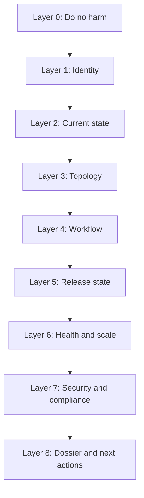
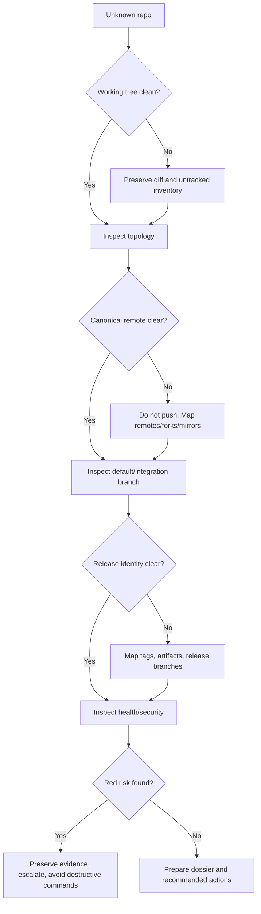

# Part 086 — Forensic Playbook for Unknown Repository

You inherit a repository.

Maybe it is a production system. Maybe it is an old internal service. Maybe it is a vendor fork. Maybe it is the repo behind a regulatory case management platform that nobody fully owns anymore.

Your job is not to immediately refactor it.

Your job is first to answer:

> What is this repository, what state is it in, what history matters, what risks exist, and what must not be touched casually?

This part gives a practical forensic playbook.

The mindset:

- observe before changing,
- preserve evidence before cleanup,
- understand topology before merging,
- understand release identity before deploying,
- understand ownership before approving changes,
- understand workflow before enforcing policy.

---

## 1. Prime Directive: Start Read-Only

Do not begin with:

```bash
git gc
git clean -fdx
git reset --hard
git pull --rebase
git push --force
git filter-repo
git tag -d
git branch -D
```

Those commands may destroy forensic evidence, local work, dangling commits, untracked artifacts, or release identity.

Start with observation:

```bash
git status --porcelain=v2 -b
git rev-parse --show-toplevel
git rev-parse --git-dir
git rev-parse HEAD
git branch --show-current || true
git remote -v
```

If the repository matters, create a forensic snapshot before changing anything.

---

## 2. Investigation Layers

A good repository investigation is layered. Do not try to understand everything at once.



Each layer should produce notes. If you cannot explain a layer, you are not ready to make destructive changes.

---

## 3. The First 10 Minutes: Identify the Repository

Run:

```bash
pwd
git rev-parse --show-toplevel
git rev-parse --git-dir
git rev-parse --is-inside-work-tree
git rev-parse --is-bare-repository
git rev-parse --show-superproject-working-tree || true
git rev-parse --show-prefix
```

Interpretation:

| Signal | Meaning |
|---|---|
| `--show-toplevel` prints path | You are inside a worktree |
| `--is-bare-repository` true | No normal working tree; likely server/mirror/admin repo |
| `--show-superproject-working-tree` prints path | You are inside a submodule |
| `.git` is a file, not directory | Worktree/submodule/gitfile layout |
| No branch name | Detached HEAD or unborn branch |

Check Git version and config origin:

```bash
git --version
git config --list --show-origin --show-scope | sed -n '1,120p'
```

Why config matters:

- aliases may hide dangerous behavior,
- hooks path may be custom,
- pull/rebase policy may be set locally,
- LFS/filter behavior may be configured,
- partial clone/sparse checkout may be active,
- credential helpers/remotes may reveal topology.

---

## 4. Capture a Forensic Snapshot

Create a directory outside the repository:

```bash
mkdir -p ../repo-forensics
OUT="../repo-forensics/$(basename "$(pwd)")-$(date +%Y%m%d-%H%M%S)"
mkdir -p "$OUT"
```

Capture read-only state:

```bash
{
  echo '# Identity'
  pwd
  git --version
  git rev-parse --show-toplevel || true
  git rev-parse --git-dir || true
  git rev-parse HEAD || true
  git branch --show-current || true

  echo '# Status'
  git status --porcelain=v2 -b || true

  echo '# Remotes'
  git remote -v || true

  echo '# Branches'
  git branch -vv --all || true

  echo '# Tags recent'
  git tag --sort=-creatordate | head -50 || true

  echo '# Recent log'
  git log --graph --decorate --oneline --all -100 || true
} > "$OUT/snapshot.txt" 2>&1

# Separate files for machine parsing
git status --porcelain=v2 -b > "$OUT/status-porcelain-v2.txt" 2>&1 || true
git show-ref > "$OUT/show-ref.txt" 2>&1 || true
git reflog --date=iso > "$OUT/reflog-head.txt" 2>&1 || true
git config --list --show-origin --show-scope > "$OUT/config.txt" 2>&1 || true
```

Do this before cleanup. Especially before `reset --hard`, `clean`, `gc`, or prune.

---

## 5. Current State Triage

Run:

```bash
git status --porcelain=v2 -b
```

Classify state:

| State | Meaning | First response |
|---|---|---|
| Clean working tree | Safe to inspect deeper | Continue |
| Modified tracked files | Local work or generated changes | Do not reset yet |
| Untracked files | Could be build artifacts or uncommitted work | Inventory before clean |
| Unmerged entries | In-progress merge/rebase/cherry-pick | Inspect operation state |
| Ahead/behind upstream | Local branch diverged | Do not pull blindly |
| Detached HEAD | Build/release checkout or manual inspection | Identify target ref |
| Sparse checkout | Working tree incomplete by design | Do not assume missing files absent |
| Shallow clone | History incomplete | Fetch may be needed for analysis |

More detail:

```bash
git diff --stat
git diff --cached --stat
git ls-files -u
git stash list
git worktree list
```

Do not run `git stash` automatically. Stash changes the repo state and can hide the evidence you need to understand.

---

## 6. Detect In-Progress Operations

Git records operation state under `.git/`.

Check:

```bash
git rev-parse --git-path MERGE_HEAD
git rev-parse --git-path REBASE_HEAD
git rev-parse --git-path CHERRY_PICK_HEAD
git rev-parse --git-path REVERT_HEAD

test -f "$(git rev-parse --git-path MERGE_HEAD)" && echo "merge in progress"
test -d "$(git rev-parse --git-path rebase-merge)" && echo "interactive rebase in progress"
test -d "$(git rev-parse --git-path rebase-apply)" && echo "am/rebase apply in progress"
test -f "$(git rev-parse --git-path CHERRY_PICK_HEAD)" && echo "cherry-pick in progress"
test -f "$(git rev-parse --git-path REVERT_HEAD)" && echo "revert in progress"
```

If an operation is in progress, inspect before aborting:

```bash
git status
git ls-files -u
git diff
git diff --cached
```

Abort only after you understand whether the in-progress operation belongs to someone else or to a CI/release script.

---

## 7. Topology: Branches, Remotes, and Refs

List remotes:

```bash
git remote -v
```

Inspect fetch/push refspecs:

```bash
git config --get-all remote.origin.fetch
git config --get-all remote.origin.push || true
```

List branches with tracking:

```bash
git branch -vv --all
```

List refs by recency:

```bash
git for-each-ref --sort=-committerdate \
  --format='%(committerdate:iso8601)%09%(refname:short)%09%(objectname:short)%09%(authorname)' \
  refs/heads refs/remotes | head -80
```

List tags by creator date:

```bash
git for-each-ref --sort=-creatordate \
  --format='%(creatordate:iso8601)%09%(refname:short)%09%(objecttype)%09%(objectname:short)' \
  refs/tags | head -80
```

Interpretation questions:

- Which remote is canonical?
- Is `origin` a fork or upstream?
- Are there multiple push destinations?
- Are release branches local only or remote tracked?
- Are tags present and recent?
- Are there hidden refs, PR refs, or vendor refs?
- Does branch naming imply environment branches?

---

## 8. Default Branch and Integration Line

Do not assume `main` or `master` is the integration line.

Check remote HEAD:

```bash
git remote show origin
```

Check symbolic refs:

```bash
git symbolic-ref refs/remotes/origin/HEAD || true
```

Look at recent activity:

```bash
git for-each-ref --sort=-committerdate \
  --format='%(committerdate:short)%09%(refname:short)' \
  refs/remotes/origin | head -20
```

Candidate integration branches:

- `main`,
- `master`,
- `develop`,
- `trunk`,
- `release/*`,
- `production`,
- protected branch from platform settings,
- branch referenced by CI deploy workflow.

You may need platform data to know branch protection. A clone alone usually does not tell you required reviews/checks/merge queues.

---

## 9. History Shape Scan

Start with recent graph:

```bash
git log --graph --decorate --oneline --all -80
```

Then inspect mainline:

```bash
git log --first-parent --decorate --oneline origin/main -80 2>/dev/null || true
git log --first-parent --decorate --oneline origin/master -80 2>/dev/null || true
```

Classify shape:

| Shape | Signal |
|---|---|
| Mostly merge commits | PR merge workflow, first-parent useful |
| Mostly linear commits | rebase/fast-forward/squash workflow |
| Giant squash commits | Git may hide PR iteration details |
| Many long-lived branches | Integration debt risk |
| Frequent revert commits | Mainline instability or release discipline |
| Many hotfix branches | Support matrix complexity |
| Tags sparse/inconsistent | Release identity risk |
| Environment branches | Deployment-model confusion possible |

Use graph shape to decide which later commands are meaningful.

---

## 10. Release State Reconstruction

Find tags:

```bash
git tag --sort=-creatordate | head -50
```

Inspect a tag:

```bash
git show --stat v1.2.3
```

Verify tag if signed:

```bash
git tag -v v1.2.3
```

Find release branches:

```bash
git branch -a --list '*release*' '*hotfix*' '*support*' '*maintenance*'
```

Find commits after latest tag:

```bash
LATEST_TAG=$(git describe --tags --abbrev=0 2>/dev/null || true)
if [ -n "$LATEST_TAG" ]; then
  git log --oneline "$LATEST_TAG..HEAD"
fi
```

Questions:

- What was the latest release tag?
- Is the tag annotated or lightweight?
- Is the tag signed?
- Does CI build from tag, branch, or commit SHA?
- Are artifacts traceable to commit SHA?
- Are release branches forward-ported?
- Were tags moved or recreated?
- Are there RC tags?
- Is SemVer followed consistently?

Release identity matters because deployment and audit depend on it.

---

## 11. Repository Health and Storage

Start safe:

```bash
git count-objects -vH
```

Check object integrity without immediately repairing:

```bash
git fsck --full
```

Inspect large blobs carefully:

```bash
git rev-list --objects --all \
  | git cat-file --batch-check='%(objecttype) %(objectname) %(objectsize) %(rest)' \
  | awk '$1 == "blob" { print $3, $2, substr($0, index($0,$4)) }' \
  | sort -nr \
  | head -50
```

Check packfiles:

```bash
find "$(git rev-parse --git-dir)/objects/pack" -maxdepth 1 -type f -print
```

Check commit graph and multi-pack-index if present:

```bash
find "$(git rev-parse --git-dir)/objects/info" -maxdepth 2 -type f -print 2>/dev/null || true
find "$(git rev-parse --git-dir)/objects/pack" -maxdepth 1 -name 'multi-pack-index*' -print 2>/dev/null || true
```

Interpretation:

| Signal | Meaning |
|---|---|
| Many loose objects | Recent activity, failed maintenance, or interrupted operations |
| Huge packfiles | Large history or binaries |
| Very large blobs | Git performance and clone risk |
| Dangling commits | May be recoverable work or normal post-rewrite residue |
| `fsck` errors | Treat as possible corruption until explained |
| Missing objects | Partial clone, promisor remote, corruption, or broken alternates |

Do not run aggressive cleanup until you know whether dangling objects matter.

---

## 12. Detect Shallow, Partial, Sparse, LFS, Submodule, Worktree

These features change what “complete repository” means.

```bash
# Shallow clone
test -f "$(git rev-parse --git-dir)/shallow" && echo "shallow clone"

# Partial clone / promisor remote
git config --get remote.origin.promisor || true
git config --get remote.origin.partialclonefilter || true

# Sparse checkout
git sparse-checkout list 2>/dev/null || true
git config --get core.sparseCheckout || true
git config --get index.sparse || true

# Git LFS
git lfs env 2>/dev/null || true
git lfs ls-files 2>/dev/null | head || true

# Submodules
test -f .gitmodules && cat .gitmodules
git submodule status --recursive 2>/dev/null || true

# Worktrees
git worktree list 2>/dev/null || true
```

Failure if ignored:

| Feature | Wrong assumption |
|---|---|
| Shallow clone | “History does not contain that commit” |
| Partial clone | “Object is missing, repo corrupt” |
| Sparse checkout | “File was deleted” |
| Git LFS | “Pointer file is actual content” |
| Submodule | “Directory content is part of superproject tree” |
| Worktree | “Only one checkout uses this `.git` database” |

---

## 13. Workflow Discovery from Files

Look for workflow control files:

```bash
find . -maxdepth 3 \( \
  -name CODEOWNERS -o \
  -name .gitignore -o \
  -name .gitattributes -o \
  -name .gitmodules -o \
  -name Makefile -o \
  -name justfile -o \
  -name package.json -o \
  -name pom.xml -o \
  -name build.gradle -o \
  -name go.mod -o \
  -name Cargo.toml -o \
  -name pyproject.toml -o \
  -name Dockerfile -o \
  -name docker-compose.yml \
\) -print
```

CI/CD:

```bash
find .github .gitlab .circleci .azure-pipelines .buildkite Jenkinsfile* -maxdepth 4 -type f -print 2>/dev/null || true
```

Read these before running build scripts. Build scripts may deploy, mutate files, install hooks, or fetch secrets.

Workflow clues:

| File | Clue |
|---|---|
| `CODEOWNERS` | Review/ownership model |
| `.gitattributes` | EOL, diff/merge drivers, LFS patterns |
| `.gitmodules` | External Git dependency pins |
| `.github/workflows/*` | CI, release, deploy paths |
| `Makefile` / `justfile` | Developer command surface |
| lockfiles | Dependency resolution boundary |
| migration directories | Data evolution model |
| `Dockerfile` | Runtime packaging |
| `charts/`, `k8s/`, `terraform/` | Deployment ownership |

---

## 14. Security and Trust Scan

Start with Git-level trust:

```bash
# Signed tag verification, if tags are expected to be signed
git tag --sort=-creatordate | head -20 | while read -r tag; do
  git tag -v "$tag" >/dev/null 2>&1 && echo "verified $tag" || echo "not verified $tag"
done

# Recent signed commit metadata display
git log --show-signature -5
```

Sensitive file scan by history:

```bash
git log --all --name-only --format='' \
  | grep -Ei '(^|/)(\.env|id_rsa|secret|credential|token|private-key|keystore|\.p12|\.pem)$' \
  | sort -u
```

Recent sensitive changes:

```bash
git log --since="12 months ago" --oneline -- \
  .github/workflows/ \
  infra/ \
  terraform/ \
  services/auth/ \
  services/authz/ \
  services/audit/ \
  '**/migrations/**'
```

Remember:

- absence of obvious secret filenames does not prove no secret leak,
- deleting a secret from current tree does not remove it from history,
- signed commits/tags prove identity only within configured trust model,
- branch protection/rulesets live on the hosting platform, not in plain Git history.

---

## 15. Ownership and Social Topology

Git can reveal historical authors, but not full responsibility.

```bash
# Repository-level contributors
git shortlog -sn --all | head -30

# Directory-level contributors
git shortlog -sn --since="12 months ago" -- services/auth/

# Recent owners by file
git log -1 --format='%ad %an <%ae> %h %s' --date=short -- services/auth/policy_engine.go
```

Combine with:

- CODEOWNERS,
- PR review history,
- on-call ownership,
- service catalog,
- incident records,
- architecture docs,
- team boundaries.

Ownership questions:

- Who can approve changes safely?
- Who understands release process?
- Who owns migrations?
- Who owns deployment manifests?
- Who owns security-sensitive paths?
- Which areas have no active human owner?

---

## 16. Dependency and Build Boundary

Identify build system before changing Git workflow.

Language clues:

```bash
find . -maxdepth 3 -type f \( \
  -name package.json -o \
  -name pnpm-lock.yaml -o \
  -name yarn.lock -o \
  -name package-lock.json -o \
  -name pom.xml -o \
  -name build.gradle -o \
  -name go.mod -o \
  -name Cargo.toml -o \
  -name requirements.txt -o \
  -name pyproject.toml -o \
  -name Pipfile.lock \
\) -print
```

Release/build clues:

```bash
grep -R "git rev-parse\|GITHUB_SHA\|CI_COMMIT_SHA\|BUILD_VERSION\|VERSION" -n \
  .github .gitlab Jenkinsfile* Makefile build.gradle pom.xml package.json 2>/dev/null | head -100
```

Questions:

- Is artifact version derived from tag or commit SHA?
- Are builds reproducible from clean clone?
- Does CI checkout shallow history?
- Does release note generation require tags?
- Are submodules or LFS fetched in CI?
- Are generated files committed or generated in build?

---

## 17. Unknown Repository Risk Classification

After the first pass, classify the repository.

### Green

- clean working tree,
- clear canonical remote,
- clear default branch,
- recent CI config,
- consistent tags,
- clear ownership,
- no obvious storage/corruption issue,
- documented build/release path.

### Yellow

- stale branches,
- sparse/inconsistent tags,
- unclear owner for some modules,
- large blobs but manageable,
- shallow clone limits analysis,
- CI present but not obviously release-safe,
- some untracked/generated noise.

### Red

- dirty working tree with unknown changes,
- in-progress merge/rebase/cherry-pick,
- missing/corrupt objects,
- moved release tags,
- secrets in history,
- no clear canonical remote,
- release branch diverged from main with no plan,
- unverified artifacts,
- large binary history causing severe clone/fetch failure,
- unknown deploy scripts tied to branch names.

Red does not mean panic. It means preserve evidence, reduce blast radius, and avoid casual mutation.

---

## 18. The 30/90/240-Minute Playbook

### First 30 minutes — safety and identity

Goal: do no harm and identify current state.

Run:

```bash
git status --porcelain=v2 -b
git remote -v
git branch -vv --all
git log --graph --decorate --oneline --all -50
git tag --sort=-creatordate | head -20
git config --list --show-origin --show-scope | sed -n '1,160p'
```

Deliverable:

```text
Repository identity:
Current branch/HEAD:
Canonical remote guess:
Working tree state:
Default branch guess:
Latest tag:
Immediate dangers:
```

### First 90 minutes — topology and release

Goal: understand branch/release model.

Run:

```bash
git remote show origin
git for-each-ref --sort=-committerdate --format='%(committerdate:short)%09%(refname:short)' refs/remotes | head -80
git log --first-parent --decorate --oneline origin/main -100 2>/dev/null || true
git log --first-parent --decorate --oneline origin/master -100 2>/dev/null || true
git describe --tags --always --dirty
```

Deliverable:

```text
Integration line:
Release branches:
Tag policy guess:
Merge policy guess:
Branch drift risks:
CI/release entry points:
```

### First 240 minutes — health, ownership, risk

Goal: produce actionable repository dossier.

Run:

```bash
git count-objects -vH
git fsck --full
git shortlog -sn --all | head -50
git log --since="12 months ago" --numstat --format='' -- . | head -100
find . -maxdepth 3 -type f \( -name CODEOWNERS -o -name .gitattributes -o -name .gitmodules \) -print
```

Deliverable:

```text
Storage health:
Large objects:
Sensitive paths:
Ownership map:
Hotspots:
Release integrity risks:
Recommended next actions:
```

---

## 19. Forensic Dossier Template

Use this template when handing off findings:

```md
# Repository Forensic Dossier

## Identity
- Repository path:
- Git version:
- HEAD:
- Current branch:
- Canonical remote:
- Default branch:
- Is bare/shallow/partial/sparse:

## Current State
- Working tree clean:
- Index clean:
- Untracked files:
- In-progress operation:
- Stashes:
- Worktrees:

## Topology
- Important remotes:
- Main integration branch:
- Release branches:
- Long-lived branches:
- Stale branches:
- Fork/mirror relationships:

## Release State
- Latest tag:
- Tag type/signature:
- Recent releases:
- Artifact commit source:
- RC/hotfix pattern:
- Tag immutability concerns:

## Workflow
- Merge policy inferred:
- PR/review indicators:
- CODEOWNERS:
- CI entry points:
- Deploy entry points:
- Hooks/config surprises:

## Health
- Object count:
- Packfiles:
- Large blobs:
- fsck result:
- LFS/submodules:
- Maintenance concerns:

## Security / Compliance
- Sensitive paths:
- Secret exposure indicators:
- Signed tags/commits:
- Auth/authz/audit changes:
- Branch protection unknowns:

## Ownership
- Top contributors:
- Active owners:
- Decayed areas:
- Review bottlenecks:

## Risks
- Red:
- Yellow:
- Green:

## Recommended Actions
1.
2.
3.
```

A dossier is useful because it turns scattered Git commands into shared operational knowledge.

---

## 20. Specific Incident Playbooks

### 20.1 Dirty inherited working tree

Symptoms:

```bash
git status --porcelain=v2 -b
```

shows modifications/untracked files.

Do:

```bash
git diff > ../repo-forensics/dirty-working-tree.diff
git diff --cached > ../repo-forensics/dirty-index.diff
git ls-files --others --exclude-standard > ../repo-forensics/untracked-files.txt
```

Then decide:

- Are changes generated?
- Are changes local emergency patch?
- Are changes secrets/config that must not be committed?
- Is this somebody else’s work?
- Should it become a branch?

Only after that consider stash, commit, reset, or clean.

### 20.2 Unknown detached HEAD

Run:

```bash
git rev-parse HEAD
git branch --contains HEAD
git tag --contains HEAD
git describe --tags --always --dirty
```

Interpretation:

| Result | Meaning |
|---|---|
| Tag contains HEAD | likely release checkout |
| Remote branch contains HEAD | branch checkout detached by CI/tool |
| No ref contains HEAD | orphaned/temporary commit or incomplete history |
| Dirty state | build or local mutation after checkout |

Do not create a branch unless needed. First identify why HEAD is detached.

### 20.3 Suspected corruption

Run:

```bash
git fsck --full
git count-objects -vH
```

If missing objects appear:

- check partial clone config,
- check alternates,
- check submodules,
- check shallow clone,
- fetch from canonical remote if safe,
- avoid `gc` until diagnosis is complete.

### 20.4 Suspected secret in history

Do not start with history rewrite.

First:

1. identify exposed secret,
2. revoke/rotate secret,
3. determine exposure scope,
4. preserve evidence,
5. plan rewrite only if useful,
6. coordinate all clones/downstream consumers,
7. add prevention guardrails.

Useful Git queries:

```bash
git log --all --name-only --format='%H' | grep -Ei 'secret|token|credential|\.env|\.pem|\.p12'
git grep -n -I -E 'AKIA|BEGIN RSA PRIVATE KEY|BEGIN OPENSSH PRIVATE KEY|password\s*=' $(git rev-list --all) -- 2>/dev/null || true
```

The second command can be expensive and noisy on large repositories. Use dedicated secret scanning tools for serious work.

### 20.5 Unknown release artifact

Given an artifact with commit SHA:

```bash
SHA=<artifact-sha>
git cat-file -t "$SHA"
git branch --contains "$SHA"
git tag --contains "$SHA"
git describe --tags --contains "$SHA" 2>/dev/null || true
git log --oneline -1 "$SHA"
```

Questions:

- Is SHA in this repository?
- Is SHA reachable from release tag?
- Is SHA reachable from protected branch?
- Is SHA dirty-build or clean-build source?
- Does artifact metadata match Git tag/version?

---

## 21. Platform Boundary: What Git Cannot Tell You Alone

A local clone cannot fully reveal:

- branch protection rules,
- required checks,
- merge queue configuration,
- CODEOWNER enforcement settings,
- PR approvals,
- review dismissal policy,
- deployment environment approvals,
- repository secrets,
- audit log of force pushes/deleted branches,
- who had permission at the time.

Git can show refs and objects. Hosting platforms hold governance state.

For serious forensics, combine:

```text
Git clone data + hosting platform metadata + CI logs + artifact registry + incident records
```

---

## 22. Build a `repo-forensics.sh` Script

```bash
#!/usr/bin/env bash
set -euo pipefail

ROOT=$(git rev-parse --show-toplevel 2>/dev/null || pwd)
NAME=$(basename "$ROOT")
OUT="${1:-../repo-forensics/${NAME}-$(date +%Y%m%d-%H%M%S)}"
mkdir -p "$OUT"

run() {
  local name="$1"
  shift
  echo "Running $name..." >&2
  {
    echo "# $*"
    "$@"
  } > "$OUT/$name.txt" 2>&1 || true
}

run identity git rev-parse --show-toplevel
run git-dir git rev-parse --git-dir
run head git rev-parse HEAD
run status git status --porcelain=v2 -b
run remotes git remote -v
run branches git branch -vv --all
run refs git show-ref
run reflog git reflog --date=iso
run config git config --list --show-origin --show-scope
run recent-log git log --graph --decorate --oneline --all -100
run tags bash -lc "git for-each-ref --sort=-creatordate --format='%(creatordate:iso8601)%09%(refname:short)%09%(objecttype)%09%(objectname:short)' refs/tags | head -100"
run recent-refs bash -lc "git for-each-ref --sort=-committerdate --format='%(committerdate:iso8601)%09%(refname:short)%09%(objectname:short)' refs/heads refs/remotes | head -100"
run count-objects git count-objects -vH
run fsck git fsck --full
run worktrees git worktree list
run submodules git submodule status --recursive
run lfs bash -lc "git lfs env && git lfs ls-files | head -100"
run sparse bash -lc "git sparse-checkout list && git config --get index.sparse"

find . -maxdepth 3 -type f \( \
  -name CODEOWNERS -o \
  -name .gitattributes -o \
  -name .gitmodules -o \
  -name .gitignore -o \
  -path './.github/workflows/*' \
\) -print > "$OUT/control-files.txt" 2>&1 || true

echo "Forensic snapshot written to $OUT"
```

Run it from the repository root:

```bash
chmod +x repo-forensics.sh
./repo-forensics.sh
```

This script intentionally avoids mutation.

---

## 23. Reading the Evidence Without Fooling Yourself

Common traps:

| Trap | Correction |
|---|---|
| `origin` is assumed canonical | Verify remote topology |
| `main` is assumed production | Check CI/deploy workflows and tags |
| clean working tree means safe repo | Need history/release/security scan |
| no current secret means no leaked secret | Search history and rotate if exposed |
| latest tag means latest deployment | Check artifact/deployment metadata |
| branch name `prod` means production truth | Verify with deployment system |
| signed tag means safe release | Signature only covers identity/integrity, not correctness |
| shallow clone means old commits absent | Fetch complete history before conclusion |
| no CODEOWNERS means no owner | Ownership may live outside Git |
| `fsck` warning means corruption | Could be partial clone/promisor/alternates context |

Forensics is controlled skepticism.

---

## 24. Unknown Repository Decision Tree



---

## 25. What “Good” Looks Like After Forensics

After a strong initial investigation, you should be able to say:

```text
This repository's canonical remote appears to be X.
The integration branch appears to be Y.
The latest release tag is Z and points to commit C.
The working tree is clean/dirty for these reasons.
The history shape suggests merge/squash/rebase workflow.
The active release branches are A, B, C.
The risky areas are P, Q, R.
The current ownership map is incomplete/clear.
There are/no obvious large-object/storage risks.
There are/no obvious secret/tag/signature risks.
Before changing workflow, we need these platform facts.
```

That is actionable. “Looks okay” is not.

---

## 26. Exercises

### Exercise 1 — Build a repository dossier

Take any unfamiliar repository and produce the dossier template from this part. Do not change the repository.

### Exercise 2 — Identify release identity

Find latest release tag, determine whether it is annotated/lightweight/signed, and identify whether current `HEAD` is ahead/behind it.

### Exercise 3 — Detect incomplete clone assumptions

Determine whether the repo is shallow, partial, sparse, LFS-enabled, or submodule-based. Explain what each means for analysis correctness.

### Exercise 4 — Risk classify branches

List remote branches by last commit date and classify stale/diverged/release-critical branches.

### Exercise 5 — Platform boundary

List at least five things you cannot know from Git alone and what system you would query for each.

---

## 27. Final Mental Model

An unknown repository is not just source code. It is a living operational artifact:

- object database,
- branch topology,
- release record,
- collaboration protocol,
- ownership map,
- security boundary,
- CI/deployment source,
- historical evidence store.

The first job is not to be clever. The first job is to be safe.

Professional repository forensics follows this invariant:

```text
preserve state -> identify topology -> reconstruct release identity -> assess health -> assess risk -> recommend controlled action
```

Only after that should you refactor, clean, rewrite, or enforce new policy.

---

## References

- Git `git-status` documentation: https://git-scm.com/docs/git-status
- Git `git-rev-parse` documentation: https://git-scm.com/docs/git-rev-parse
- Git `git-for-each-ref` documentation: https://git-scm.com/docs/git-for-each-ref
- Git `git-fsck` documentation: https://git-scm.com/docs/git-fsck
- Git repository layout documentation: https://git-scm.com/docs/gitrepository-layout
- Git `git-tag` documentation: https://git-scm.com/docs/git-tag
- Git `git-worktree` documentation: https://git-scm.com/docs/git-worktree
