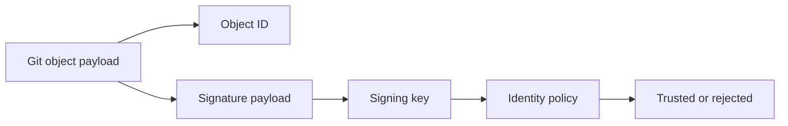
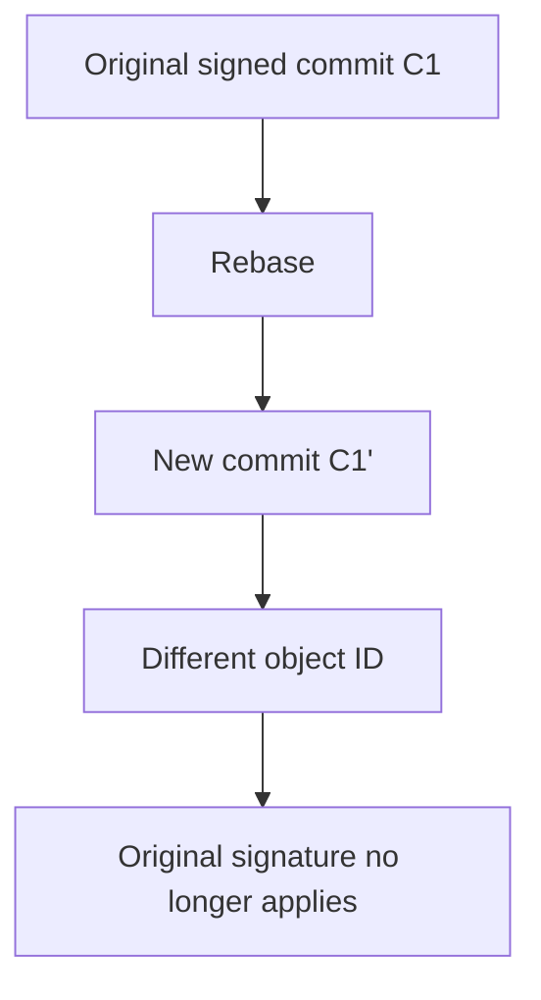
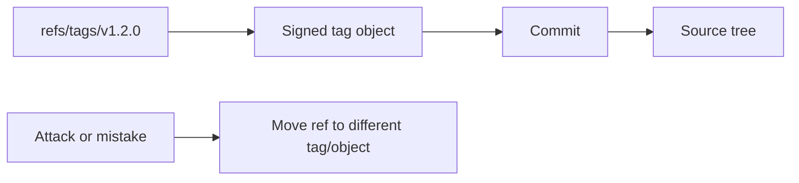
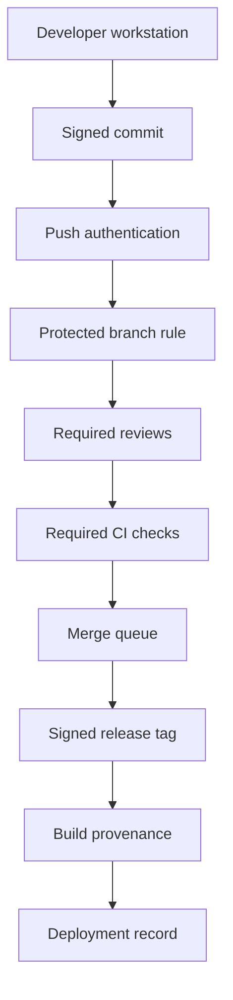

# Part 087 — Signed Commits and Signed Tags

A Git signature is not magic trust.

It is a cryptographic statement attached to a Git object.

That statement can help answer:

```text
Did the holder of this signing key produce or approve this exact object?
```

It does **not** automatically answer:

```text
Was the code reviewed?
Was the CI run valid?
Was the signer authorized?
Was the workstation uncompromised?
Was the release artifact built from this object?
Was the deployed binary identical to the reviewed source?
```

Signed commits and signed tags are useful only when they sit inside a larger trust chain:

```text
identity -> signed source object -> protected ref -> CI evidence -> signed artifact -> deployment record
```

This part explains how to reason about Git signatures as engineering controls, not as security theater.

---

## 1. The Problem: Git Object Identity Is Strong, Human Identity Is Separate

Git already has strong content identity.

A commit hash names the exact commit object:

```bash
git rev-parse HEAD^{commit}
```

If the commit object changes, its object id changes.

But the commit hash alone does not prove who intentionally created it. A commit object contains author and committer fields, but those fields are metadata text, not cryptographic proof.

A commit can say:

```text
Author: Platform Lead <platform@example.com>
Committer: Platform Lead <platform@example.com>
```

That does not prove the real Platform Lead created it.

A signature adds a verifiable binding between:

- an exact Git object,
- a cryptographic key,
- an identity policy outside Git,
- and a verification result.



The Git object hash answers:

> Is this object exactly the same object?

The signature answers:

> Did a trusted signing key sign this exact object?

Those are related but different questions.

---

## 2. Signed Commit vs Signed Tag

Git can sign different object types.

The two most important are:

| Control | Object signed | Best use |
|---|---|---|
| Signed commit | Individual commit object | Authorship/approval trace for source changes |
| Signed tag | Tag object pointing to release object | Release identity and published version integrity |

A signed commit says:

```text
this exact commit object was signed
```

A signed tag says:

```text
this exact tag object, usually naming a release commit, was signed
```

For release engineering, signed tags are often more important than signed commits because consumers usually care about the release boundary:

```text
v2.8.3 -> signed annotated tag -> commit SHA -> source tree -> artifact
```

For development governance, signed commits are useful because they can prevent anonymous or spoofed source mutations from entering protected branches.

---

## 3. Commit Signing Mental Model

A commit object contains commit metadata, parent pointers, tree pointer, message, and optional signature header.

Conceptually:

```text
commit <size>\0
tree <tree-sha>
parent <parent-sha>
author ...
committer ...
gpgsig -----BEGIN ...

<commit message>
```

When a commit is signed, the signature covers the commit content in a Git-defined way. If the commit content changes, the signature no longer verifies.

That is why operations that rewrite commits usually invalidate or replace signatures:

- `git commit --amend`
- `git rebase`
- `git rebase -i`
- `git cherry-pick`
- `git filter-repo`
- squash merge
- rebase merge

A signed commit is bound to an exact commit object, not to a logical change forever.



The invariant:

> Rewriting a commit creates a new object; a new object needs a new signature.

---

## 4. Tag Signing Mental Model

A lightweight tag is just a ref:

```text
refs/tags/v1.2.0 -> <object-id>
```

An annotated tag is a real Git object:

```text
object <commit-sha>
type commit
tag v1.2.0
tagger Release Engineer <release@example.com> ...

Release v1.2.0
```

A signed annotated tag adds a signature to that tag object.

The release trust boundary becomes:

```text
refs/tags/v1.2.0 -> tag object -> commit object -> tree -> files
```

A signed tag proves the tag object has not changed and was signed by the key. It does not prove the mutable ref `refs/tags/v1.2.0` was never moved unless your hosting policy prevents moving it.

That distinction is critical:



A signature protects the object.

Branch/tag protection protects the ref.

You usually need both.

---

## 5. Signing Technologies

Modern Git hosting workflows commonly support several signing key types:

| Type | Typical use | Strength | Operational caveat |
|---|---|---|---|
| GPG/OpenPGP | Longstanding Git signing model | Mature and flexible | Key management can be hard for teams |
| SSH signing | Developer-friendly when SSH keys already exist | Simpler onboarding | Must separate auth keys from signing policy carefully |
| X.509/S/MIME | Enterprise identity infrastructure | Good centralized identity story | Depends on corporate PKI maturity |

Do not confuse these:

```text
SSH key used to push != proof that every pushed commit was signed
```

Authentication to the remote proves the remote accepted a connection from an account/key.

Commit signing proves a particular commit object carries a valid signature.

They are separate layers.

---

## 6. Basic Commands

Create a signed commit:

```bash
git commit -S -m "enforce release tag verification"
```

Configure signing by default:

```bash
git config --global commit.gpgsign true
```

Create a signed annotated tag:

```bash
git tag -s v1.8.0 -m "Release v1.8.0"
```

Verify a commit:

```bash
git verify-commit HEAD
```

Verify a tag:

```bash
git verify-tag v1.8.0
```

Show signature while inspecting:

```bash
git log --show-signature -1 HEAD
git tag -v v1.8.0
```

When scripting, avoid trusting human-readable output alone. First resolve the exact object:

```bash
commit=$(git rev-parse --verify "v1.8.0^{commit}")
echo "$commit"
```

Then verify the tag object and the peeled commit separately.

---

## 7. What Signatures Prove

A valid signature can prove:

- the signed Git object has not changed since signing,
- the signature was produced by the private key corresponding to the public key,
- the key is recognized by your configured trust mechanism,
- the object identity is cryptographically bound to that signature.

For a signed release tag, this is valuable:

```text
Release v1.8.0 was intentionally signed as pointing to commit abc123...
```

For a signed commit, this is valuable:

```text
Commit abc123... was produced or approved by a recognized signing identity.
```

---

## 8. What Signatures Do Not Prove

A signature does **not** prove:

- the signer was authorized to make that change,
- the signer understood the change,
- the change was reviewed,
- the change passed tests,
- the private key was not stolen,
- the local machine was not compromised,
- the artifact was built from the signed commit,
- the deployment used that artifact,
- the tag ref was never moved,
- a downstream fork did not replace the ref with something else.

The common weak assumption is:

```text
Signed == safe
```

The better model is:

```text
Signed == object identity is bound to a key
Safe == signature + policy + protected refs + CI + review + provenance + deployment control
```

---

## 9. Policy Layers

A mature repository separates controls by layer.



| Layer | Control | Purpose |
|---|---|---|
| Workstation | commit/tag signing | Bind source object to signing identity |
| Remote | authenticated push | Bind network action to account |
| Protected refs | branch/tag protection | Prevent unauthorized ref mutation |
| Review | required reviewers/CODEOWNERS | Validate intent and ownership |
| CI | required checks | Validate behavior and policy |
| Release | signed annotated tag | Bind version to source commit |
| Build | provenance/artifact digest | Bind source to artifact |
| Deploy | deployment record | Bind artifact to environment |

Signatures are one control in a chain.

---

## 10. Recommended Team Policy

For normal repositories:

```text
- require signed commits on protected branches if onboarding is manageable
- require signed annotated tags for production releases
- protect release tags from deletion and force update
- verify release tags in CI before building artifacts
- embed commit SHA and tag in artifact metadata
```

For regulated or high-integrity repositories:

```text
- require signed commits for protected branches
- require signed tags for releases
- restrict release signing keys to release engineers or release automation
- use bot signing keys only for bot-generated commits
- rotate keys on staff transition or suspected compromise
- record verification output in release evidence bundle
- block unsigned or unverified release artifacts
```

For open-source projects:

```text
- sign release tags even if not all contributor commits are signed
- publish release verification instructions
- avoid moving public release tags
- treat key compromise as a release integrity incident
```

---

## 11. CI Verification Pattern

A release job should not merely run from `main` and assume it is building a valid release.

It should verify:

1. The input ref is a tag.
2. The tag is annotated.
3. The tag signature verifies.
4. The tag peels to a commit.
5. The commit is reachable from an allowed release branch.
6. The working tree is clean.
7. The artifact embeds the peeled commit SHA.

Example shell sketch:

```bash
set -euo pipefail

TAG="${RELEASE_TAG:?missing RELEASE_TAG}"

git fetch --tags --force origin

tag_obj=$(git rev-parse --verify "$TAG^{tag}")
commit=$(git rev-parse --verify "$TAG^{commit}")

git verify-tag "$TAG"
git merge-base --is-ancestor "$commit" origin/main

test -z "$(git status --porcelain)"

echo "tag_object=$tag_obj"
echo "source_commit=$commit"
```

This does not make the release perfect. It prevents a large class of ambiguous release builds.

---

## 12. Bot and Automation Signing

Automation often creates commits:

- dependency update PRs,
- generated code updates,
- release version bumps,
- changelog updates,
- vendored dependency syncs,
- API client regeneration.

Do not let all automation share one broad signing identity.

Use separate identities by trust class:

| Bot identity | Scope |
|---|---|
| dependency-update bot | lockfile and dependency metadata |
| release bot | version bump, changelog, signed release tag |
| codegen bot | generated source paths only |
| mirror bot | vendor import branch only |

Then enforce scope through CODEOWNERS, CI, or server-side hooks.

A signed bot commit proves the bot key signed it. It does not prove the bot was allowed to modify every file.

---

## 13. Rewrite and Signature Failure Modes

### 13.1 Rebase destroys original commit signatures

A rebase creates new commits. If your policy requires signed commits, developers must re-sign rewritten commits.

```bash
git rebase --exec 'git commit --amend --no-edit -S'
```

Use carefully. Re-signing a commit after rebase means the signer is now attesting to the rewritten commit object.

### 13.2 Squash merge changes identity

A PR with signed commits may be squash-merged into one new commit. The resulting commit may be signed by the merger or hosting platform, not the original authors.

Policy must say what matters:

```text
Do we require every author commit signed?
Or only the final commit on protected branch?
Or only the release tag?
```

Do not pretend these are equivalent.

### 13.3 Cherry-pick creates new signed state

A signed commit cherry-picked into a release branch becomes a new commit. The original signature does not transfer.

Use `-x` for traceability:

```bash
git cherry-pick -x <source-commit>
git commit --amend --no-edit -S
```

### 13.4 Moved tag can point to a different signed object

If tag refs are mutable, an attacker or careless maintainer can move `v1.2.0` to a different object. The new object may also be signed.

Protect the ref, not only the object.

---

## 14. Key Lifecycle

A signing policy is only as good as its key lifecycle.

Minimum operational controls:

- keys have owners,
- keys have creation dates,
- keys have expiry/rotation process,
- lost keys are revoked,
- compromised keys trigger incident response,
- departed employees lose signing trust,
- bot keys are scoped,
- release signing keys are not stored casually on developer laptops,
- verification trust store is documented.

Key compromise is not a Git typo. It is a provenance incident.

---

## 15. Release Evidence Bundle

For production releases, record:

```text
release_version: v1.8.0
tag: v1.8.0
tag_object: <sha>
peeled_commit: <sha>
tag_signature_verified: true
signing_identity: <identity>
source_branch: release/1.8
artifact_digest: sha256:...
build_run: <url/id>
deployment_record: <url/id>
```

Store this evidence outside the mutable repository branch.

In regulated systems, this evidence should survive:

- branch deletion,
- repository migration,
- hosting provider outage,
- local clone cleanup,
- future history rewrite.

---

## 16. Practical Verification Checklist

Before trusting a release:

```bash
git fetch --tags origin
git rev-parse --verify v1.8.0^{tag}
git verify-tag v1.8.0
git rev-parse --verify v1.8.0^{commit}
git show --show-signature --no-patch v1.8.0
```

Ask:

- Is it an annotated tag?
- Is it signed?
- Is the signer trusted for releases?
- Does it point to the expected commit?
- Is the commit reachable from an allowed branch?
- Was the artifact built from that commit?
- Is the tag protected against mutation?

---

## 17. Anti-Patterns

Avoid:

```text
- requiring signed commits but allowing unsigned release tags
- signing release tags but allowing tag force-push
- treating GitHub verified badge as complete supply-chain assurance
- allowing personal keys to sign production releases forever
- letting bots sign broad changes without path constraints
- assuming squash merge preserves original commit signatures
- not documenting how verification is performed
- not revoking keys after compromise or staff departure
```

The strongest local signature is weak if the release ref is mutable and the artifact has no provenance.

---

## 18. Summary

Signed commits and signed tags provide cryptographic binding between Git objects and signing keys.

The key invariants:

```text
Object hash proves object content.
Signature proves a trusted key signed that object.
Protected refs prevent authorized objects from being silently replaced.
CI and review validate behavior and intent.
Release evidence binds source to artifact and deployment.
```

Use signatures as part of a chain, not as a substitute for the chain.

---

## References

- `git commit -S`
- `git tag -s`
- `git verify-commit`
- `git verify-tag`
- `git log --show-signature`
- `git rev-parse`
- `git merge-base`
