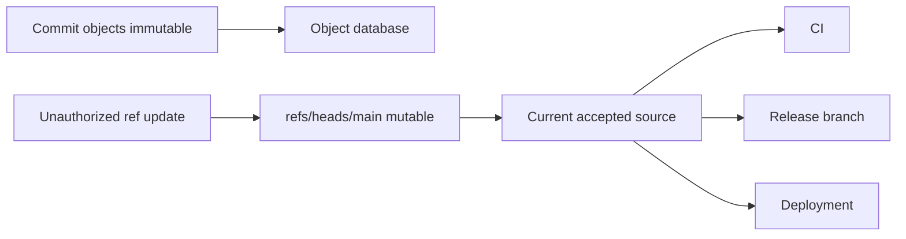
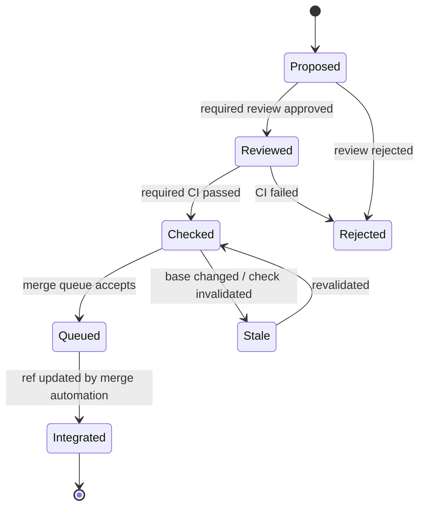
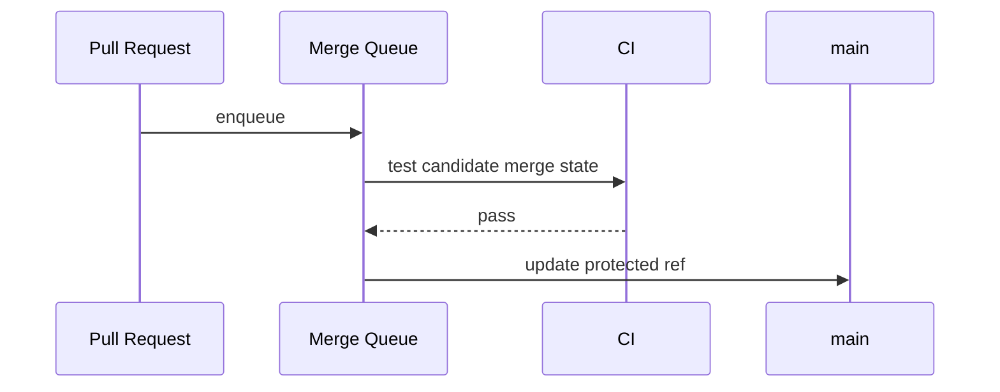

# Part 088 — Branch Protection as Security Control

A protected branch is not just workflow preference.

It is a security boundary around a mutable Git ref.

The branch name `main` is not special because Git says so. It is special because your organization gives it meaning:

```text
main is deployable
main is reviewed
main is tested
main is source of release branches
main is allowed input for production builds
main is audit evidence for what was accepted
```

If anyone can force-push, delete, bypass review, or merge without valid checks, then `main` is not really a protected integration contract. It is only a convention.

This part treats branch protection as a control system over repository mutation.

---

## 1. Mental Model: Protect the Ref, Not Just the Commit

Git objects are immutable. Refs are mutable.

A commit object does not change after it exists. But a branch ref can be moved:

```text
refs/heads/main -> commit A
refs/heads/main -> commit B
refs/heads/main -> commit C
```

That movement is the risk surface.



Branch protection exists to control who can move important refs, under what conditions.

The invariant:

> The security of a production branch is the security of the rules that allow its ref to move.

---

## 2. What Branch Protection Can Control

A mature protected branch configuration usually controls:

| Control | Purpose |
|---|---|
| Require pull request | Prevent direct mutation of protected branch |
| Require reviews | Human validation of intent and risk |
| Require CODEOWNERS review | Domain owner approval for sensitive paths |
| Require status checks | Automated validation before integration |
| Require branches up to date | Reduce stale-base merges |
| Require signed commits | Bind source object to signing identity |
| Require linear history | Restrict merge topology |
| Disallow force push | Prevent destructive ref rewrite |
| Disallow deletion | Preserve source and audit continuity |
| Restrict who can push | Limit mutation rights to automation or maintainers |
| Merge queue | Validate PRs against queued integration state |
| Protected tags/rulesets | Extend control to release identity |

Do not enable controls blindly. Each control has a purpose, cost, and bypass surface.

---

## 3. Threat Model

Branch protection should be designed from threats, not from vibes.

Common threats:

```text
- accidental direct push to main
- force-push erases accepted commits
- compromised developer account pushes malicious code
- maintainer merges without required review
- stale PR passes old CI but breaks current main
- malicious contributor modifies CI workflow file
- release tag is moved after artifact publication
- bot token has too much write power
- admin bypass is used without evidence
- sensitive path changed without domain owner review
```

For each threat, ask:

```text
Which ref can move?
Who can move it?
What condition must be true?
What evidence is recorded?
Who can bypass?
How is bypass audited?
```

---

## 4. Branch Protection as a State Machine

Protected branch integration can be modeled as a state machine.



The key is not that every team must use this exact model.

The key is that protected branch movement should have explicit states and transitions.

If the state transition is hidden inside someone's local `git push`, you have weak governance.

---

## 5. Required Pull Request

Requiring pull requests prevents normal direct push to protected branch.

This creates a reviewable integration proposal:

```text
source branch + target branch + diff + checks + discussion + approvals
```

But PR requirement alone is weak.

A PR without required checks or required reviews can still merge risky changes.

A PR with stale checks can merge code that was never validated against current target branch.

A PR from a compromised automation account can still be dangerous.

PR is the container. It is not the entire control.

---

## 6. Required Reviews

Reviews are useful when they are tied to ownership and risk.

Bad review policy:

```text
Any one approval from anyone is enough.
```

Better review policy:

```text
- at least one general reviewer
- CODEOWNERS review for owned paths
- security review for auth/crypto/secrets/infra paths
- database review for migration paths
- release owner review for release workflow changes
```

Review controls should consider path sensitivity:

| Path | Suggested owner |
|---|---|
| `.github/workflows/**` | platform/security |
| `deploy/**` | platform/SRE |
| `db/migrations/**` | data/application owner |
| `auth/**` | security/domain owner |
| `policy/**` | compliance/domain owner |
| `infra/**` | platform/security |

The security issue is not only “bad code got merged”.

It is also:

```text
code changed without the right authority seeing it
```

---

## 7. Required Status Checks

Required checks enforce automated evidence.

Examples:

- build succeeds,
- unit/integration tests pass,
- lint/format passes,
- type checks pass,
- dependency scan passes,
- secret scan passes,
- policy-as-code passes,
- release integrity verifier passes,
- migration compatibility test passes,
- generated code is up to date.

The trap is stale or incomplete checks.

A check is meaningful only if it ran against the correct Git state.

Ask:

```text
Did this check run against the PR head?
Did it run against the merge result?
Did it fetch enough history and tags?
Did it use trusted workflow code?
Did it validate the paths that changed?
```

For high-risk repositories, prefer validating the merge result, not only the topic branch head.

---

## 8. Merge Queue

A merge queue solves a real race:

```text
PR A passes against main@1
PR B passes against main@1
A merges and main becomes main@2
B may no longer be valid against main@2
```

Without revalidation, B can break main even though its checks were green.

A merge queue creates a candidate integration state and validates it before moving `main`.



Merge queue is most valuable when:

- main must stay green,
- many PRs merge concurrently,
- test suite is non-trivial,
- branch protection requires up-to-date validation,
- release train depends on main health.

---

## 9. Force Push and Deletion Controls

Force push to protected branches should be disabled by default.

A force push can remove accepted commits from the visible branch tip:

```bash
git push --force origin main
```

Even if objects remain temporarily recoverable via reflog or backups, the accepted integration record is damaged.

Deletion is similar:

```bash
git push origin :main
```

A production branch or release branch should not disappear casually.

For protected branches:

```text
- disallow force push
- disallow deletion
- restrict direct push to automation if needed
- require emergency override evidence
```

Emergency override should be treated as incident activity, not routine workflow.

---

## 10. Signed Commit Requirement

Signed commit requirement can reduce spoofing and improve provenance, but it is not sufficient alone.

It answers:

```text
Are commits on this protected branch signed by accepted keys?
```

It does not answer:

```text
Was this change reviewed?
Was the signer authorized for this path?
Did CI validate the merge result?
Was the release artifact built from this commit?
```

Use signed commits as one layer:

```text
signed commits + required PR + CODEOWNERS + required checks + protected tags
```

Be careful with squash merge or bot-generated commits. Define whether the final commit must be signed by the merger, the bot, or the original authors.

---

## 11. Protecting CI Configuration

CI configuration is often more sensitive than application code.

If a contributor can change CI workflow files and that modified workflow runs with secrets, they may escalate privileges.

Protect paths like:

```text
.github/workflows/**
.gitlab-ci.yml
buildkite/**
jenkins/**
ci/**
scripts/release/**
scripts/deploy/**
```

Controls:

- CODEOWNERS for CI files,
- required approval from platform/security,
- limited token permissions,
- no secrets for untrusted fork PRs,
- pinned third-party actions,
- branch protection for workflow changes,
- policy check for dangerous CI permission changes.

The branch protection model must include the automation that enforces it.

---

## 12. Bot and Token Risk

Bots often have more power than humans because they are used for automation.

Common bot risks:

```text
- bot can push directly to main
- bot can bypass pull request reviews
- bot token can edit workflow files
- bot can create or move release tags
- bot can approve its own PR indirectly
- bot key is shared across repositories
```

Better model:

| Bot | Allowed actions |
|---|---|
| dependency bot | open PRs, no direct protected branch push |
| release bot | create signed release tag after gates pass |
| mirror bot | update mirror refs only |
| codegen bot | update generated paths through PR |
| merge queue bot | update protected branch after required checks |

A bot should have the minimum authority needed for its role.

---

## 13. Admin Bypass

Every bypass is a policy hole.

Sometimes bypass is necessary during incident response, but it must be explicit and auditable.

Minimum bypass record:

```text
- who bypassed
- which rule was bypassed
- why bypass was necessary
- which commit/ref was affected
- what validation was done before/after
- who approved the bypass
- how normal protection was restored
```

Do not normalize admin bypass as a convenience mechanism.

If maintainers routinely bypass branch protection, the protection is mostly decorative.

---

## 14. Protected Tags

Release integrity requires protecting tags too.

A branch protection policy that ignores tags leaves a gap:

```text
main is protected
release tag is mutable
artifact says v1.4.2
v1.4.2 can be moved
```

For production releases:

```text
- require annotated tags
- require signed tags
- restrict who can create release tags
- disallow tag deletion
- disallow tag force update
- verify tag in release CI
```

Tags are refs. Refs are mutable unless protected.

---

## 15. Regulated-System Policy Matrix

For regulated systems, use explicit control classes.

| Ref class | Example | Protection |
|---|---|---|
| integration | `main` | PR, reviews, CODEOWNERS, checks, no force, no delete |
| release branch | `release/2026.07` | restricted push, backport PRs, release owner approval |
| hotfix branch | `hotfix/INC-1234` | incident owner approval, expedited checks |
| release tag | `v2026.07.1` | signed annotated tag, immutable/protected |
| vendor mirror | `vendor/acme/*` | mirror bot only |
| experimental | `users/alice/*` | lighter controls |

The goal is not maximum friction everywhere.

The goal is proportional control where mutation matters.

---

## 16. Example Policy Bundle

A practical production repository baseline:

```text
main:
  require_pull_request: true
  required_reviews: 2
  require_code_owner_review: true
  dismiss_stale_reviews: true
  require_status_checks: true
  require_merge_queue: true
  require_signed_commits: true
  allow_force_push: false
  allow_deletion: false

release/*:
  require_pull_request: true
  required_reviews: 1
  require_release_owner_review: true
  require_status_checks: true
  allow_force_push: false
  allow_deletion: false

tags/v*:
  require_signed_annotated_tag: true
  restrict_creation_to: release-engineering
  allow_force_update: false
  allow_deletion: false
```

Actual syntax depends on hosting provider, but the invariant is portable.

---

## 17. Verification Checklist

For an important repository, ask:

```text
- Can anyone push directly to main?
- Can anyone force-push main?
- Can anyone delete main?
- Are PRs required?
- Are reviews required?
- Are CODEOWNERS enforced for sensitive paths?
- Are status checks required and trusted?
- Are stale approvals dismissed?
- Is merge queue used where concurrency is high?
- Are signed commits required where provenance matters?
- Are release tags protected?
- Are release tags signed?
- Who can bypass rules?
- Is bypass audited?
- Can bots mutate protected refs directly?
- Are CI workflow files protected?
```

If you cannot answer these, the repository security model is not explicit yet.

---

## 18. Failure Modes

### 18.1 Green check on wrong commit

CI passes on PR head, but merge result breaks.

Control:

```text
merge queue or merge-result validation
```

### 18.2 Stale approval after risky change

Reviewer approves; author pushes new commits; approval remains valid.

Control:

```text
dismiss stale reviews after new commits
```

### 18.3 Sensitive path changed by wrong team

General reviewer approves auth or deployment change.

Control:

```text
CODEOWNERS + required owner review + path policy checks
```

### 18.4 Admin bypass becomes normal

Maintainers bypass because rules are slow.

Control:

```text
fix the workflow bottleneck; audit bypass as exception
```

### 18.5 Protected branch, mutable tag

Main is protected, but release tag can be moved.

Control:

```text
protected signed tags
```

---

## 19. Do Not Confuse Controls

Branch protection is not a replacement for:

- code review quality,
- secure CI design,
- secret rotation,
- artifact signing,
- runtime authorization,
- deployment approval,
- incident response,
- audit evidence retention.

It is a control over Git ref mutation.

That control is powerful because many other systems trust Git refs.

---

## 20. Summary

Branch protection turns important refs into controlled integration surfaces.

The core mental model:

```text
Git objects are immutable.
Refs are mutable.
Production meaning attaches to refs.
Therefore protected refs are security controls.
```

A strong protected branch policy combines:

```text
restricted mutation
required PRs
required reviews
CODEOWNERS
trusted CI checks
merge queue
signed commits
protected release tags
bypass audit
least-privilege bots
```

Without these, `main` is only culturally protected.

With them, `main` becomes an enforceable integration contract.

---

## References

- `git push`
- `git receive-pack`
- `githooks`
- `git verify-commit`
- `git verify-tag`
- `git merge-base`
- Branch protection and repository rules in Git hosting platforms
