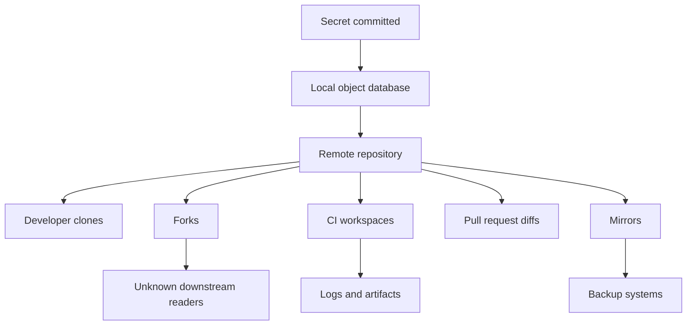
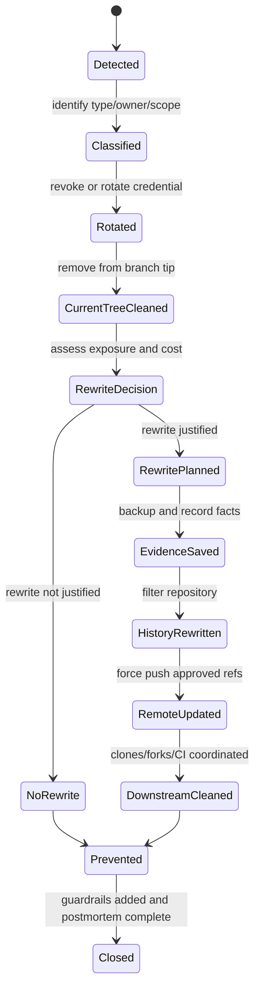

# Part 089 — Secret Leak Response in Git

A secret leak in Git is **not primarily a Git problem**.

It is a **credential incident** that happens to have Git as one of its distribution channels.

That distinction matters because the first instinct of many engineers is wrong:

```bash
# Wrong first response
git rm config/prod.env
git commit -m "remove secret"
git push
```

This removes the secret from the latest tree, but the secret remains in earlier commits. Anyone who can fetch those commits, inspect caches, view pull request diffs, browse forks, read CI logs, or retrieve artifacts may still have access.

The correct first response is:

```text
revoke / rotate / disable the exposed credential first
then clean repository state
then coordinate all distributed copies
then prevent recurrence
```

Git cleanup reduces future exposure. It does **not** make an already leaked credential safe again.

---

## 1. Mental Model: A Leaked Secret Is a Capability That Escaped

A password, token, API key, SSH private key, signing key, database URL, service account JSON, OAuth client secret, webhook secret, or cloud credential is not just text. It is a **capability**.

A capability can authorize an action:

- read data
- write data
- deploy code
- mint new credentials
- impersonate users
- access internal infrastructure
- bypass approval flow
- mutate production state
- exfiltrate regulated data

Once a capability is committed, the problem is not merely:

```text
this file contains sensitive text
```

The real problem is:

```text
a capability may have been distributed to unknown readers through a replicated history system
```

Git is distributed by design. Every clone may contain its own object database. A history rewrite on `origin` does not automatically purge every clone, fork, cache, mirror, PR ref, CI workspace, log stream, artifact, local backup, or developer laptop.



The operational invariant is simple:

> If a secret reached Git history, assume it may have been copied.

Therefore:

> Rotation is security remediation. History rewrite is exposure reduction.

---

## 2. Response Priorities

Use this order unless there is a very specific reason not to.

| Priority | Action | Why |
|---:|---|---|
| 1 | Identify the secret type and owner | You cannot rotate what you do not understand. |
| 2 | Revoke, rotate, or disable the credential | Stops future unauthorized use. |
| 3 | Reduce permissions and invalidate derived sessions | Limits blast radius if the secret was used. |
| 4 | Preserve evidence | Needed for audit, postmortem, and incident response. |
| 5 | Remove the secret from current code | Prevents new commits from keeping it alive. |
| 6 | Rewrite history when justified | Reduces repository exposure. |
| 7 | Coordinate downstream cleanup | Git is distributed; remote rewrite is not enough. |
| 8 | Add preventive controls | Prevents recurrence. |

Do **not** start with history rewrite while the credential remains valid.

That is equivalent to locking the door after handing out the key.

---

## 3. Secret Leak Taxonomy

Not all leaks have the same response path. Classify quickly.

| Secret class | Examples | Immediate action |
|---|---|---|
| Long-lived cloud credential | AWS access key, GCP service account JSON, Azure secret | Disable/rotate immediately; inspect cloud audit logs. |
| Database credential | JDBC URL with username/password, connection string | Rotate credential; check DB access logs; invalidate sessions if applicable. |
| Source hosting credential | GitHub PAT, deploy key, SSH private key | Revoke token/key; inspect repo/org audit logs. |
| Signing key | GPG private key, code signing cert, package signing key | Revoke/replace key; assess releases signed with exposed key. |
| Webhook secret | GitHub/GitLab webhook secret, Stripe webhook secret | Rotate webhook secret; check replay risk. |
| OAuth secret | Client secret, refresh token | Rotate; check token grant logs; invalidate refresh tokens. |
| Internal service token | JWT signing key, service-to-service token | Rotate; invalidate derived tokens; check lateral movement. |
| Test-only secret | Fake credential, local dev key | Confirm it is truly non-sensitive; still add prevention. |
| Customer/regulatory data | API sample containing real PII or case data | Treat as data breach pathway; involve privacy/legal/security. |

A fake-looking secret still deserves verification. Many incidents start with "this is probably just a test key".

---

## 4. The Core Playbook

### Phase 0 — Freeze the blast radius

Before rewriting anything, reduce concurrent mutation.

For a production repository:

1. pause merges to affected branches
2. pause release jobs if the secret can affect build/deploy credentials
3. disable automation that might keep using the secret
4. identify the affected repository, branch, commit, PR, and file
5. notify security/incident channel if the secret is valid or unknown

```text
Goal: stop new copies and stop credential use, not make history pretty.
```

A freeze does not need to mean company-wide panic. It means the repository state is now incident evidence.

---

### Phase 1 — Identify the secret and owner

Capture facts without pasting the full secret into more systems.

Do not put the complete secret into Slack, tickets, terminal recordings, issue comments, or PR comments. Use fingerprints.

Useful fingerprint fields:

```text
secret type: AWS access key / PAT / private key / unknown
prefix: first 4-8 safe characters if provider allows
hash: sha256(secret value) if already available in a secure channel
file path: config/prod.env
commit: <sha>
branch/ref: origin/main, pull/123/head
first known exposure time: 2026-07-07T09:12+07:00
owner: platform-identity / payments / unknown
scope: read-only? deploy? admin?
```

Commands for locating context:

```bash
# Show commit that introduced a known path
git log --all --decorate --source -- config/prod.env

# Search for a non-sensitive fragment or identifier, not necessarily the full secret
git log --all -S 'AKIA' --oneline --decorate --source

# Search diffs with regex semantics
git log --all -G 'aws_access_key_id|private_key|client_secret' --oneline --decorate --source

# Show all refs containing a commit
git branch --all --contains <commit>
git tag --contains <commit>

# List remote refs that may carry the object
git ls-remote --heads --tags origin
```

For a known file name:

```bash
git log --all --full-history -- config/prod.env
```

For object-level investigation:

```bash
# List objects and paths. Useful for finding historical files.
git rev-list --objects --all | grep 'prod.env'
```

Be careful with grep output. You can accidentally re-print the secret into terminal logs.

---

### Phase 2 — Revoke or rotate first

This is the non-negotiable step.

For provider-managed credentials:

- disable the exposed key
- issue a replacement credential
- deploy replacement through secret manager or secure environment injection
- verify consumers use the replacement
- remove the old credential from all systems
- check audit logs for suspicious use after exposure

For signing keys:

- revoke or deprecate exposed key according to your PKI process
- rotate signing identity
- identify artifacts signed after exposure
- publish advisory if external consumers rely on signatures

For database credentials:

- rotate database user password
- consider replacing the principal entirely
- check access logs from exposure time onward
- invalidate application sessions if the secret signs or decrypts tokens

For JWT/HMAC signing keys:

- rotate key with key identifier strategy
- invalidate issued tokens if the old key can verify them
- shorten compatibility window intentionally
- audit services that cache keys

For cloud credentials:

- disable key immediately if possible
- rotate to a new scoped role/key
- review provider audit logs
- inspect IAM permissions; reduce excessive scope

A history rewrite cannot revoke a cloud key. Only the provider or credential authority can.

---

### Phase 3 — Preserve evidence

A secret leak is an incident trail. Preserve enough context before destructive cleanup.

Evidence bundle:

```text
- repository URL
- affected refs
- affected commits
- affected paths
- first known introduction commit
- latest ref carrying the secret
- actor/automation that introduced it
- pull request / merge queue / release job involved
- provider credential identifier
- rotation timestamp
- suspicious usage findings
- cleanup method
- old-to-new commit mapping if history is rewritten
- downstream notification record
```

Create a local evidence bundle without publishing the secret:

```bash
mkdir -p incident-secret-leak-evidence

git log --all --decorate --source --date=iso-strict -- config/prod.env \
  > incident-secret-leak-evidence/history-for-path.txt

git branch --all --contains <bad_commit> \
  > incident-secret-leak-evidence/branches-containing-bad-commit.txt

git tag --contains <bad_commit> \
  > incident-secret-leak-evidence/tags-containing-bad-commit.txt

git show --stat --summary --decorate <bad_commit> \
  > incident-secret-leak-evidence/bad-commit-summary.txt
```

Do not store the raw secret inside this evidence bundle unless it is protected under your incident evidence process.

---

### Phase 4 — Remove the secret from current state

Even before rewriting history, fix the latest tree.

If the file should never be tracked:

```bash
git rm --cached config/prod.env
printf '\n# local secrets\nconfig/prod.env\n' >> .gitignore
git add .gitignore
git commit -m "Remove tracked environment secret file"
```

If the file is legitimate but contains one secret value:

```bash
# edit file: replace secret with placeholder or environment variable reference
git add config/application.yml
git commit -m "Load database password from secret manager"
```

If the secret is embedded in generated files:

```bash
# fix generator, not just output
git add tools/render-config.ts templates/application.yml.gotmpl
git commit -m "Stop rendering secret values into generated config"
```

Current-state cleanup prevents new commits from preserving the leak while the history cleanup is planned.

---

## 5. Should You Rewrite History?

Not every secret leak needs the same Git cleanup.

Use this decision matrix.

| Condition | Recommended action |
|---|---|
| Secret was valid and pushed to shared remote | Rotate immediately; rewrite history if practical; coordinate downstream. |
| Secret was valid but only in local unpushed commit | Rotate if any uncertainty; interactive rebase/reset locally; no remote coordination needed. |
| Secret was invalid/fake and never usable | Remove from current tree; maybe rewrite if it looks real and triggers scanners. |
| Secret was in public repository | Rotate; assume copied; rewrite reduces casual exposure but cannot guarantee deletion. |
| Secret was in release tag/artifact | Rotate; assess release compromise; usually prefer corrective release over tag mutation. |
| Secret was in forked/open-source repo | Rotate; rewrite upstream; request fork cleanup; assume some copies remain. |
| Secret was in regulated data sample | Treat as data/privacy incident; legal/security involvement before rewrite. |
| Secret is in CI logs/artifacts too | Rotate; clean logs/artifacts according to retention policy; Git rewrite alone is insufficient. |

Rewrite is most useful when:

- the secret remains visible in normal repository browsing
- the repository is private and clone population is bounded
- the secret pattern triggers scanners repeatedly
- the file contains regulated data that should not remain in history
- repository bloat or history hygiene also matters

Rewrite is least useful when:

- the repository is public and widely cloned
- the secret has already been rotated and caches are uncontrollable
- the rewrite would break critical release traceability without strong reason
- the affected commit is in many published release tags

Again: rewrite is not a substitute for rotation.

---

## 6. History Rewrite Tooling

The modern default tool for repository-wide secret cleanup is usually `git filter-repo`.

Avoid `git filter-branch` for new remediation work unless you have a constrained reason and understand its pitfalls. `filter-branch` is historically powerful but slow and easy to misuse. Many modern docs and communities recommend `git filter-repo` instead.

Common rewrite patterns:

| Scenario | Tooling pattern |
|---|---|
| Remove file from all history | `git filter-repo --path <path> --invert-paths` |
| Replace secret text everywhere | `git filter-repo --replace-text replacements.txt` |
| Remove directory from all history | `git filter-repo --path <dir>/ --invert-paths` |
| Split repo by path | `git filter-repo --path <dir>/ --path-rename <dir>/:` |
| Convert large files to LFS | `git lfs migrate import` |
| Rewrite only local private commits | `git rebase -i`, `git reset`, `git commit --amend` |

---

## 7. Rewrite Playbook: Remove a Leaked File from All History

### Step 1 — Work from a clean clone

Use a fresh clone to avoid mixing incident rewrite with dirty local state.

```bash
mkdir -p ~/incident-work
cd ~/incident-work

git clone --mirror git@github.com:org/repo.git repo.git
cd repo.git
```

A mirror clone contains all refs and is suitable for repository-wide rewrite.

Verify refs:

```bash
git for-each-ref --format='%(refname)' | sort | sed -n '1,80p'
```

Create a backup bundle before destructive operation:

```bash
git bundle create ../repo-before-secret-cleanup.bundle --all
```

This backup must be stored as sensitive incident evidence because it still contains the secret.

---

### Step 2 — Analyze where the file exists

```bash
git log --all --full-history -- config/prod.env

git rev-list --objects --all | grep 'config/prod.env'
```

If the path changed over time, identify all historical names.

```bash
git log --all --name-status --follow -- config/prod.env
```

`--follow` is useful for a single path investigation, but for robust rewrite you must remove every historical path that actually contained the secret.

---

### Step 3 — Rewrite

Remove a file from all refs:

```bash
git filter-repo --path config/prod.env --invert-paths
```

Remove multiple files:

```bash
git filter-repo \
  --path config/prod.env \
  --path secrets/service-account.json \
  --invert-paths
```

Remove a directory:

```bash
git filter-repo --path secrets/ --invert-paths
```

---

### Step 4 — Verify absence

```bash
# Path should not appear in any reachable object list
git rev-list --objects --all | grep 'config/prod.env' || true

# Search commit diffs for risky identifiers
git log --all -G 'aws_access_key_id|private_key|client_secret' --oneline

# Repository object integrity
git fsck --full
```

Verification should be scripted and saved into the evidence bundle.

---

### Step 5 — Push rewritten refs

This is destructive for shared history. Do it only after communication and approval.

```bash
# Push rewritten branches
git push --force --all origin

# Push rewritten tags if affected
git push --force --tags origin
```

For a full mirror rewrite:

```bash
git push --mirror --force origin
```

Use mirror push only when you intentionally want to update/delete all remote refs according to the mirror. It is powerful and dangerous.

Protected branches/tags may require temporary admin intervention. Document the bypass.

---

### Step 6 — Request host-side cleanup if needed

Depending on hosting provider, rewritten data may still appear in:

- cached pull request diffs
- closed PR refs
- release assets
- code search index
- fork networks
- CI logs
- pages/static deployments
- container images
- package artifacts
- raw file caches

History rewrite does not guarantee immediate removal from every provider surface.

For GitHub-hosted repositories, follow the provider's documented sensitive data removal process, including support escalation where required for cached views or unreachable objects that still appear through the platform.

---

## 8. Rewrite Playbook: Replace Secret Text Across History

Sometimes removing the whole file is not acceptable because the file contains legitimate configuration history. In that case, replace only the secret value.

Create a replacement file:

```bash
cat > replacements.txt <<'EOF_REPLACEMENTS'
# Literal replacement
old-secret-value==>***REMOVED***

# Regex replacement example
regex:client_secret: [A-Za-z0-9_\-]{20,}==>client_secret: ***REMOVED***
EOF_REPLACEMENTS
```

Run rewrite:

```bash
git filter-repo --replace-text replacements.txt
```

Verify:

```bash
git log --all -G 'client_secret|old-secret-value' --oneline
```

Be careful with `--replace-text`:

- It changes blobs across history.
- It changes commit IDs for affected commits and descendants.
- It may alter examples/tests if your regex is too broad.
- It may not catch encoded, compressed, encrypted, or generated variants.

Always run verification after rewrite.

---

## 9. Downstream Coordination

After rewriting `origin`, every existing clone may have old objects.

You must give developers clear instructions.

### Preferred instruction for most developers

For high-risk incidents, prefer reclone.

```bash
cd ..
mv repo repo-before-secret-cleanup-do-not-use

git clone git@github.com:org/repo.git repo
```

Reclone is boring. Boring is good during incident response.

---

### If developers must repair existing clone

For feature branches that can be discarded:

```bash
git fetch --all --prune --tags

git switch main
git reset --hard origin/main

git branch -D old-feature-branch
```

For a local branch that must be preserved:

```bash
# Save a patch before realignment
git switch feature/my-work
git format-patch origin/main..HEAD -o ../my-work-patches

# Realign main
git fetch --all --prune --tags
git switch main
git reset --hard origin/main

# Recreate branch from clean main
git switch -c feature/my-work-clean origin/main
git am ../my-work-patches/*.patch
```

For advanced users who know old/new base:

```bash
git fetch --all --prune --tags

git switch feature/my-work
git rebase --onto <new-base> <old-base> feature/my-work
```

Warn developers not to push old branches back. A single stale branch can resurrect the sensitive object on the remote.

---

### Local garbage collection

Even after branch realignment, old objects may remain locally until garbage collection.

For normal developer machines, do not force dangerous deletion unless your security policy requires it.

If instructed by security:

```bash
git reflog expire --expire=now --all
git gc --prune=now --aggressive
```

This can remove local recovery paths. Use only after developers have saved legitimate work.

---

## 10. Preventing Reintroduction

Secret cleanup is incomplete without guardrails.

### Source-level prevention

- use secret manager instead of committed config
- commit templates without real values
- sample files use `.example`, `.template`, `.sample`
- document local setup explicitly
- add real secret paths to `.gitignore`
- keep `.env.example` tracked, `.env` ignored

Example:

```gitignore
# local environment secrets
.env
.env.*
!.env.example

# cloud credentials
*.pem
*.p12
*.pfx
service-account*.json

# local config overrides
config/local*.yml
config/*-secret.yml
```

Do not blindly ignore all `.json` or all `.yml`. That creates configuration drift.

---

### Developer feedback prevention

Use local hooks for fast feedback:

```bash
#!/usr/bin/env bash
set -euo pipefail

if git diff --cached --name-only | grep -E '(\.env$|secret|credential|private-key)' >/dev/null; then
  echo "Potential secret-related file staged. Review before committing." >&2
  exit 1
fi
```

Local hooks are helpful but not sufficient. Developers can bypass them.

---

### Server-side prevention

Use server-side checks for enforcement:

- secret scanning on push
- push protection for known token formats
- pre-receive hooks in self-hosted environments
- required CI checks for secret scan
- branch protection/rulesets
- CODEOWNERS for sensitive paths
- policy exceptions with audit trail

### CI prevention

CI should detect newly introduced secrets before merge:

```bash
# Example conceptual gate
secret-scan --base origin/main --head HEAD
```

Design the scan to compare only introduced changes when possible, but periodically scan full history for drift and legacy leaks.

---

## 11. Sensitive Path Ownership

A good Git workflow treats certain paths as security boundaries.

Examples:

```text
.github/workflows/**
infra/**
terraform/**
k8s/**
helm/**
config/**
secrets/**
scripts/deploy/**
auth/**
permissions/**
```

Pair these paths with CODEOWNERS or equivalent review routing.

```text
# CODEOWNERS example
.github/workflows/** @platform-security @devex
infra/**             @platform-infra
config/**            @runtime-platform
secrets/**           @security-team
```

A secret leak often reveals an ownership leak. Nobody knew who owned the config, so nobody noticed the credential should not be there.

---

## 12. Pull Request Handling

If the secret leaked through a PR:

1. close or freeze the PR
2. rotate the secret
3. remove secret from branch tip
4. rewrite PR branch history if needed
5. force-push cleaned branch
6. verify PR diff no longer shows secret
7. check provider cached diff behavior
8. rerun scans
9. continue only after security approval

If the PR came from a fork:

- do not assume you can clean the contributor's fork
- rotate immediately
- ask contributor to delete/clean fork branch
- avoid posting secret details in PR comments
- consider repository advisory if public

---

## 13. Release Handling

If the leaked secret is in a released tag or source archive, treat the release as exposed.

Do not silently move a release tag.

Safer default:

```text
v1.8.2 contains leaked credential in source history
v1.8.3 is corrective release with credential removed and rotated
v1.8.2 remains historically documented as affected
```

If you must rewrite a tag due to legal/security requirements:

- get explicit approval
- preserve old tag evidence privately
- publish a security advisory or correction note when appropriate
- recreate signed tag
- invalidate old artifact checksums if necessary
- update downstream consumers

Release identity is a supply-chain contract. Treat it carefully.

---

## 14. CI/CD and Artifact Surfaces

Git history is only one surface.

Check:

| Surface | Risk |
|---|---|
| CI logs | Secret printed during build/test/deploy. |
| Build artifacts | Secret embedded in config bundle. |
| Container images | Secret copied into image layer. |
| Package registries | Secret shipped in source package. |
| Static sites | Secret rendered into public assets. |
| Deployment manifests | Secret committed or archived. |
| Cache layers | Secret stored in build cache. |
| Observability logs | Secret logged by app startup. |

A complete incident response asks:

```text
Where did the secret go after Git?
```

Not just:

```text
Which commit had the secret?
```

---

## 15. Secret Leak State Machine



Do not skip `Rotated`.

---

## 16. Operational Checklist

### Triage checklist

```text
[ ] What secret type is this?
[ ] Is it valid?
[ ] Who owns it?
[ ] What permissions does it grant?
[ ] When was it first committed?
[ ] Was it pushed?
[ ] Which refs contain it?
[ ] Was it in PR diff?
[ ] Was it in release tag?
[ ] Was it in CI log/artifact?
[ ] Was repository public or forked?
[ ] Is regulated/customer data involved?
```

### Containment checklist

```text
[ ] Credential revoked/rotated
[ ] Dependent systems updated
[ ] Old credential verified unusable
[ ] Audit logs reviewed
[ ] Suspicious use investigated
[ ] Merge/release freeze applied if needed
```

### Cleanup checklist

```text
[ ] Current tree no longer contains secret
[ ] Secret source moved to secret manager
[ ] History rewrite decision recorded
[ ] Backup bundle created if rewriting
[ ] Rewrite performed in clean clone/mirror
[ ] All affected refs/tags verified
[ ] Remote updated intentionally
[ ] Provider-side cache cleanup requested if needed
[ ] Developers/forks notified
[ ] CI logs/artifacts checked
```

### Prevention checklist

```text
[ ] .gitignore covers local secret files
[ ] Sample config uses placeholders
[ ] Secret scanning enabled
[ ] Push protection enabled if available
[ ] Sensitive paths have owners
[ ] CI blocks new secrets
[ ] Incident lessons added to handbook
[ ] Credential scope reduced if excessive
```

---

## 17. Failure Modes and Anti-Patterns

### Anti-pattern: Delete file and assume safe

```bash
git rm secrets/prod.env
git commit -m "remove secret"
```

This removes the file from the latest commit only. The object remains reachable through old commits.

---

### Anti-pattern: Rewrite before rotation

History rewrite can take time and may fail. During that time the exposed credential may still be usable.

Rotate first.

---

### Anti-pattern: Paste secret into incident ticket

You can turn one leak into multiple leaks.

Use fingerprints and secure secret handling channels.

---

### Anti-pattern: Force-push without notifying downstream

Developers may push old refs back and resurrect the leak.

Coordinate the rewrite.

---

### Anti-pattern: Move release tag silently

Consumers who already fetched the old tag now have a different repository reality from consumers who fetch later.

Prefer corrective release unless there is a documented emergency reason.

---

### Anti-pattern: Trust hooks alone

Client-side hooks are bypassable. They are feedback, not enforcement.

Use server-side checks and branch protection for enforcement.

---

## 18. Regulated Systems Considerations

For regulated case management, enforcement lifecycle, financial, healthcare, public-sector, or audit-heavy systems, secret leak response must preserve evidence while reducing exposure.

Do not let “remove from Git” become “destroy the audit trail.”

Recommended incident record:

```text
Incident ID: SEC-GIT-2026-0007
Repository: enforcement-platform/api
Secret type: database credential
Affected commit: abc123...
Affected refs: origin/main, release/2026.07
Exposure window: 2026-07-07T09:12+07:00 to 2026-07-07T09:35+07:00
Credential rotated: 2026-07-07T09:24+07:00
Suspicious use: none found / under investigation
Git cleanup: filter-repo path removal
Release impact: no public artifact / v2026.07.1 corrective release
Approvals: Security, Platform, Release Manager
Downstream action: reclone required by 2026-07-08
Preventive control: push protection and CODEOWNERS update
```

The goal is defensibility:

- what happened
- what was exposed
- who could access it
- what was revoked
- what was cleaned
- what remains impossible to guarantee
- how recurrence is prevented

---

## 19. Practical Lab

Create a throwaway repository.

```bash
mkdir git-secret-lab
cd git-secret-lab
git init

cat > app.env <<'EOF_ENV'
DATABASE_URL=postgres://app:super-secret-password@db/prod
EOF_ENV

git add app.env
git commit -m "Add app config"

mkdir src
cat > src/app.js <<'EOF_JS'
console.log('hello')
EOF_JS

git add src/app.js
git commit -m "Add app"
```

Remove from current tree:

```bash
git rm --cached app.env
echo 'app.env' >> .gitignore
git add .gitignore
git commit -m "Stop tracking local env file"
```

Observe the secret is still in history:

```bash
git log --all -G 'super-secret-password' --oneline
```

Rewrite:

```bash
git filter-repo --path app.env --invert-paths
```

Verify:

```bash
git log --all -G 'super-secret-password' --oneline || true
git rev-list --objects --all | grep app.env || true
```

Discuss:

- Why did commit hashes change?
- Why would pushed clones still need coordination?
- Why would rotation still be required in real life?

---

## 20. Engineering Standard

Adopt this policy:

```text
1. No production secret may be committed to Git.
2. If a valid secret enters Git, rotate/revoke first.
3. Removing a secret from the latest commit is not sufficient remediation.
4. History rewrite requires incident approval for shared branches.
5. Release tags are immutable unless emergency exception is approved.
6. Downstream cleanup instructions must be published after rewrite.
7. Sensitive paths require owner review.
8. Secret scanning must run before merge.
9. Client hooks are feedback, not enforcement.
10. Every secret incident ends with a prevention control.
```

This is not bureaucracy. It is an invariant set that prevents a text mistake from becoming a distributed credential compromise.

---

## 21. References

- GitHub Docs — Removing sensitive data from a repository: https://docs.github.com/en/authentication/keeping-your-account-and-data-secure/removing-sensitive-data-from-a-repository
- GitHub Docs — Remediating a leaked secret: https://docs.github.com/en/code-security/tutorials/remediate-leaked-secrets/remediating-a-leaked-secret
- GitHub Docs — Secret scanning: https://docs.github.com/en/code-security/secret-scanning/about-secret-scanning
- git-filter-repo project: https://github.com/newren/git-filter-repo
- Git documentation — git-filter-branch: https://git-scm.com/docs/git-filter-branch
- Git documentation — git-rebase: https://git-scm.com/docs/git-rebase
- Git documentation — git-push: https://git-scm.com/docs/git-push
