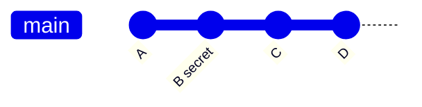
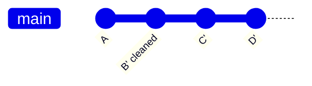
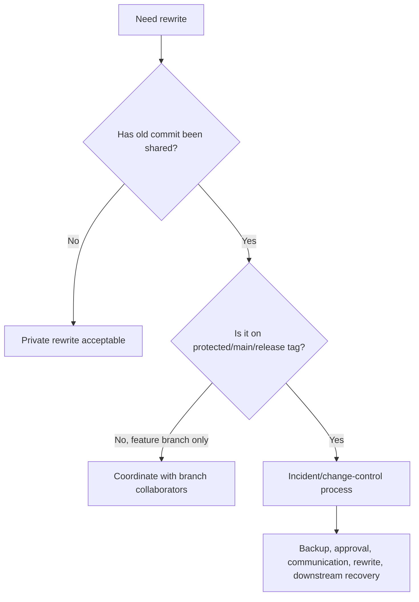
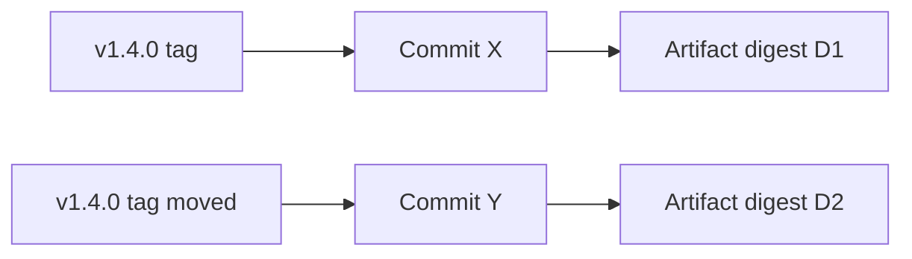

# Part 090 — History Rewrite Security and Compliance Risk

History rewrite is one of Git's most powerful capabilities.

It is also one of the easiest ways to damage trust in a repository.

A rewrite can be perfectly legitimate:

- remove a leaked secret
- remove regulated data
- delete huge binary blobs
- split a repository
- fix author metadata before publication
- clean private commits before review
- reshape a patch series before it becomes shared history

But the same mechanism can also:

- invalidate audit trails
- break downstream clones
- change release provenance
- hide suspicious changes
- invalidate signatures
- mutate tags
- destroy reproducibility
- confuse incident timelines
- let old history be resurrected accidentally

A senior engineer does not treat history rewrite as taboo. They treat it as a **controlled change to repository identity**.

---

## 1. Core Mental Model: Rewrite Changes Object Identity

In Git, a commit ID is not an arbitrary database row ID. It is a content-derived identity.

A commit object includes, among other things:

- root tree ID
- parent commit ID(s)
- author metadata
- committer metadata
- commit message

Change any of these and the commit ID changes.

Because child commits contain parent commit IDs, rewriting one commit usually changes all descendants.



After rewriting `B`:



`C'` may have the same file content as old `C`, but it is not the same commit. It points to a different parent.

This is the key invariant:

> History rewrite creates a new graph that may look equivalent at the tree level but is different at the object identity level.

---

## 2. What Counts as History Rewrite?

History rewrite is not one command. It is any operation that replaces existing commits/refs with different commit identities.

| Operation | Scope | Typical risk |
|---|---|---|
| `git commit --amend` | latest local commit | Low if unpushed; high if shared. |
| `git rebase -i` | local patch series | Low before sharing; medium after PR review. |
| `git reset --hard` then force push | branch pointer rewrite | High on shared branches. |
| `git filter-repo` | repository-wide object rewrite | Very high; affects many refs/tags. |
| `git filter-branch` | repository-wide object rewrite | Very high plus tooling pitfalls. |
| `git lfs migrate import` | large-file history rewrite | High; changes commits/tags. |
| delete/recreate tag | release identity rewrite | Critical if tag was published. |
| rewrite author metadata | commit identity rewrite | Medium/high depending on audit requirements. |
| squash merge | proposal branch history compressed into one commit | Usually acceptable if policy says so; loses commit-level detail. |

The danger depends less on the command and more on whether someone else has based work, audit, release, or evidence on the old identity.

---

## 3. Private Rewrite vs Shared Rewrite

The same operation can be safe or dangerous depending on visibility.



### Private rewrite

Safe examples:

```bash
git commit --amend
git rebase -i origin/main
git reset --soft HEAD~1
```

Private means:

```text
nobody else has fetched, reviewed, built, released, audited, or based work on these commits
```

Not just:

```text
I personally think nobody cares
```

### Shared rewrite

Shared means at least one of these is true:

- pushed to remote
- opened as PR
- used by CI
- included in release candidate
- referenced in issue/ticket/audit evidence
- pulled by teammate
- mirrored to another server
- tagged
- published publicly

Shared rewrite requires coordination.

---

## 4. Why Shared Rewrite Is Dangerous

### 4.1 Downstream clones diverge

If upstream rewrites:

```text
origin/main: A - B - C
```

into:

```text
origin/main: A - B' - C'
```

A developer clone may still have:

```text
local/main: A - B - C
```

When they push a stale branch, they can accidentally reintroduce old objects.

---

### 4.2 Audit references break

Tickets, incidents, approvals, release notes, and compliance evidence may point to old commit IDs.

After rewrite:

```text
OLD: 8f4a2c7 fixed authorization bypass
NEW: c91be44 fixed authorization bypass
```

Without a mapping, historical evidence becomes ambiguous.

---

### 4.3 Signatures become invalid or irrelevant

Signed commits and signed tags bind identity to exact objects.

If a commit is rewritten, the old signature does not sign the new commit. New commits need new signatures if your policy requires them.

If a signed tag is moved, consumers must decide whether to trust the new tag object and why the old one changed.

---

### 4.4 Release reproducibility breaks

A release built from `v2.4.1` should be reproducible from the same source identity.

If `v2.4.1` is moved:

```text
consumer A fetched tag before rewrite -> old commit
consumer B fetched tag after rewrite  -> new commit
```

Both may say they built `v2.4.1`, but they did not build the same source.

---

### 4.5 Security review can be bypassed

A malicious or sloppy rewrite can alter a previously reviewed patch series.

Example:

```text
reviewed: A -> B -> C
pushed:   A -> B' -> C'
```

If reviewers only look at the latest branch diff without `range-diff`, they may miss that a reviewed commit was subtly changed.

---

### 4.6 Legal/compliance retention may be violated

Some organizations must retain records of what was approved, shipped, or submitted.

Deleting or rewriting history without evidence preservation can look like evidence destruction, even if the intent was benign.

---

## 5. Legitimate Reasons to Rewrite History

History rewrite is not inherently bad.

Use it when the risk of leaving old history reachable is greater than the risk of changing commit identity.

| Legitimate driver | Rewrite justification |
|---|---|
| Valid secret in history | Reduce exposure after rotation. |
| Regulated data in repository | Remove data from ordinary repo access path. |
| Huge binary accidentally committed | Restore repository performance. |
| Repository split | Create clean project-specific history. |
| Pre-publication cleanup | Improve quality before shared history exists. |
| Author email privacy | Remove private email before public release. |
| License correction before publication | Fix metadata before external consumers rely on it. |
| Vendor import cleanup | Normalize imported repository before internal adoption. |

But “I want to hide an embarrassing mistake” is not a sufficient reason for public history rewrite.

Use revert, corrective commit, or postmortem instead.

---

## 6. Rewrite Risk Classification

| Scope | Example | Risk | Required process |
|---|---|---|---|
| Local unpushed branch | Amend typo before PR | Low | Personal judgment. |
| Personal remote branch | Force-push own PR before review | Low/medium | `--force-with-lease`; note in PR if review started. |
| Shared feature branch | Rebase branch used by team | Medium/high | Notify collaborators; backup ref. |
| Main branch | Rewrite `origin/main` | Critical | Incident/change approval. |
| Release branch | Rewrite `release/2026.07` | Critical | Release manager + security approval. |
| Published tag | Move `v1.2.3` | Extreme | Avoid unless emergency; publish advisory. |
| Public repository | Rewrite public history | Extreme | Assume old history persists somewhere. |
| Fork network | Rewrite upstream with forks | Extreme | Coordinate; cannot guarantee deletion. |

---

## 7. Controlled Rewrite Protocol

Use this protocol for any rewrite beyond a private branch.

### Step 1 — Define objective

Write down the exact reason.

```text
Objective: remove valid AWS key from all reachable repository history after key rotation.
Non-objective: hide the fact that the key was committed.
```

If the objective is unclear, stop.

---

### Step 2 — Classify affected refs

```bash
git for-each-ref --format='%(refname)' | sort > refs-before.txt

git branch --all --contains <bad_commit> > branches-containing.txt
git tag --contains <bad_commit> > tags-containing.txt
```

For repository-wide rewrite, assume all refs may be affected until proven otherwise.

---

### Step 3 — Freeze mutation

Temporarily stop:

- merges to affected branches
- tag creation
- release promotion
- mirror sync
- automated pushes
- scheduled dependency update bots

A rewrite while bots keep pushing is a race condition.

---

### Step 4 — Create backup evidence

```bash
git clone --mirror git@github.com:org/repo.git repo-prewrite.git
cd repo-prewrite.git

git bundle create ../repo-prewrite-incident-SEC-2026-007.bundle --all

git for-each-ref --format='%(refname) %(objectname)' \
  > ../refs-prewrite-incident-SEC-2026-007.txt
```

The backup bundle may contain sensitive material. Store it under incident evidence controls.

---

### Step 5 — Perform rewrite in clean mirror

```bash
cd ..
cp -a repo-prewrite.git repo-rewrite.git
cd repo-rewrite.git

git filter-repo --path secrets/prod.env --invert-paths
```

Or replacement:

```bash
git filter-repo --replace-text replacements.txt
```

---

### Step 6 — Generate old-to-new mapping

Some rewrite tools generate commit maps. Preserve them.

If available:

```bash
find .git -type f | grep -E 'commit-map|ref-map|changed-refs' || true
```

At minimum, capture old and new ref tips:

```bash
git for-each-ref --format='%(refname) %(objectname)' \
  > ../refs-postwrite-incident-SEC-2026-007.txt
```

A mapping helps:

- audit evidence
- downstream rebase
- release notes correction
- incident reports
- support/debugging after rewrite

---

### Step 7 — Verify rewritten repository

```bash
# Object health
git fsck --full

# Sensitive path removed
git rev-list --objects --all | grep 'secrets/prod.env' && exit 1 || true

# Sensitive text absent from diffs
git log --all -G 'client_secret|private_key|AWS_SECRET_ACCESS_KEY' --oneline

# Ref count sanity
git for-each-ref --format='%(refname)' | wc -l
```

For signed-release repositories:

```bash
git tag -v v1.2.3
```

If tags were rewritten, recreate and re-sign them intentionally.

---

### Step 8 — Push with explicit approval

```bash
git push --force --all origin
git push --force --tags origin
```

Or mirror push only if you intentionally want remote refs to match the local mirror exactly:

```bash
git push --mirror --force origin
```

Mirror push can delete remote refs. Treat it like a production database migration.

---

### Step 9 — Publish downstream instructions

Downstream consumers need clear commands.

Example message:

```text
Repository history was rewritten for incident SEC-2026-007 after secret rotation.
Do not push branches based on commits before 2026-07-07T10:00+07:00.
Preferred action: reclone repository.
If you have local work, export patches before resetting.
Old commit IDs should not be used in new PRs.
```

---

### Step 10 — Close with prevention

A rewrite without prevention is incomplete.

Add:

- secret scanning
- protected branches
- CODEOWNERS for sensitive paths
- push protection
- CI gate
- local templates/hooks
- documented secret injection pattern
- release/tag immutability policy

---

## 8. Compliance Risk Model

History rewrite affects compliance in three ways.

### 8.1 Evidence continuity

Auditors may ask:

```text
Which exact commit was approved?
Which exact source produced the artifact?
Who approved the change?
What changed after approval?
```

If commit IDs change, evidence must include old-to-new mapping and justification.

---

### 8.2 Retention and legal hold

Some records cannot be destroyed casually.

If repository history is under retention or legal hold, rewriting may require legal/compliance approval.

The right pattern is often:

```text
remove from normal developer access path
preserve restricted incident evidence bundle
record reason and approval
```

Not:

```text
make all evidence disappear
```

---

### 8.3 Release provenance

If a release artifact says:

```text
sourceCommit=abc123
version=2026.07.1
```

and `abc123` disappears from normal history, you need evidence explaining why and how the release remains traceable.

For released artifacts, prefer corrective releases over silent rewrite.

---

## 9. Security Risk Model

### 9.1 Rewriting can hide malicious changes

A malicious actor with force-push rights can:

- replace reviewed commits
- remove suspicious commits from branch history
- move tags
- rewrite author/committer metadata
- make incident analysis harder

Controls:

- protected branches
- protected tags
- signed commits/tags
- required reviews
- server audit logs
- merge queue
- force-push restrictions
- immutable release records

---

### 9.2 Rewriting can resurrect old objects

After cleanup, stale clones can push old refs.

Controls:

- temporary freeze
- force-push restrictions after rewrite
- reject pushes containing known bad object IDs if possible
- communicate reclone/reset instructions
- prune stale remote refs
- monitor secret scanner after rewrite

---

### 9.3 Rewriting can invalidate signatures

If your policy requires signed commits, a rewrite must re-sign rewritten commits or explicitly document why signatures are no longer expected for old rewritten range.

For release tags, recreate signed annotated tags intentionally.

Do not leave release consumers guessing.

---

### 9.4 Rewriting can break provenance tooling

Tools may depend on commit IDs:

- SBOM metadata
- SLSA/provenance attestations
- deployment records
- issue references
- changelog generators
- monitoring dashboards
- error trackers
- feature flag rollout logs
- audit systems

If commit IDs change, update or map these references.

---

## 10. Release Tags: The Highest-Risk Rewrite Surface

A branch is expected to move. A tag is expected to identify a specific version.

Moving a release tag breaks that expectation.



Now two artifacts can claim the same version.

Default policy:

```text
Never move public release tags.
```

Exception policy:

```text
A public release tag may only be moved under documented emergency approval, with advisory, old/new mapping, artifact invalidation, and consumer notification.
```

Safer alternative:

```text
v1.4.0 affected
v1.4.1 corrective release
```

---

## 11. Branches: Safer but Still Risky

Branches are mutable by nature, but important branches need controls.

| Branch class | Rewrite policy |
|---|---|
| Personal feature branch | Allowed before review; use `--force-with-lease`. |
| Active PR branch | Allowed with reviewer notice; use `range-diff`. |
| Shared feature branch | Avoid; require collaborator agreement. |
| `main` / `master` | Prohibited except incident process. |
| release branch | Prohibited except release/security process. |
| support/maintenance branch | Prohibited except maintenance owner approval. |
| environment branch | Avoid environment branches; if used, treat as deployment state. |

---

## 12. `--force` vs `--force-with-lease`

Use `--force-with-lease` for personal/shared feature branches.

```bash
git push --force-with-lease origin feature/my-change
```

The lease checks that the remote ref is still what your local Git expects. This reduces the chance of overwriting someone else's new remote work.

It does not make force-push safe for protected/release/main branches. It only guards against one class of race.

For critical branches, policy should prevent force push entirely except admin-controlled incidents.

---

## 13. Rewrite Verification Checklist

After rewrite, verify the new repository is correct before reopening normal work.

```text
[ ] Affected secret/path/object no longer reachable from intended refs
[ ] Repository passes git fsck
[ ] Branch tips are expected
[ ] Tags are expected
[ ] Release tags were not silently moved
[ ] Signed tags/commits verified or re-signed intentionally
[ ] CI passes from rewritten branch tip
[ ] Secret scanning passes
[ ] Old-to-new commit mapping stored
[ ] Downstream instructions published
[ ] Branch protection restored
[ ] Merge/release freeze lifted intentionally
```

Useful commands:

```bash
git fsck --full

git for-each-ref --format='%(refname) %(objectname)' | sort

git log --all -G 'private_key|client_secret|password' --oneline

git rev-list --objects --all | grep 'sensitive/path' || true

git tag -v v1.2.3
```

---

## 14. Downstream Recovery Patterns

### Pattern A — Reclone

Best for most developers after high-risk rewrite.

```bash
mv repo repo-before-rewrite-do-not-use
git clone git@github.com:org/repo.git repo
```

### Pattern B — Reset local branch to remote

For disposable local state:

```bash
git fetch --all --prune --tags

git switch main
git reset --hard origin/main
```

### Pattern C — Save local work as patches

For work that must survive:

```bash
git switch feature/my-work
mkdir -p ../patches-my-work

git format-patch origin/main..HEAD -o ../patches-my-work

git fetch --all --prune --tags
git switch -C feature/my-work-clean origin/main

git am ../patches-my-work/*.patch
```

### Pattern D — Rebase with old/new base

For advanced users with known mapping:

```bash
git fetch --all --prune --tags

git switch feature/my-work
git rebase --onto <new-base> <old-base> feature/my-work
```

### Pattern E — Archive old clone as evidence

For incident responders:

```bash
mv repo repo-incident-evidence-SEC-2026-007
chmod -R go-rwx repo-incident-evidence-SEC-2026-007
```

Do not keep incident clones casually on developer laptops if they contain secrets or regulated data.

---

## 15. Rewrite and Pull Request Review

If a PR branch is rewritten after review, reviewers need a way to compare old and new patch series.

Use `range-diff`.

```bash
# Before force push, save old tip
git branch backup/pr-123-before-rewrite HEAD

# After rewrite
git range-diff origin/main backup/pr-123-before-rewrite feature/my-change
```

Reviewers should ask:

```text
Did the rewrite only reshape commits?
Did it change semantics?
Did it add files outside previous scope?
Did it modify sensitive paths?
Did it alter generated files or lockfiles?
Did it invalidate previous approvals?
```

Branch protection features like stale review dismissal exist because rewritten or updated branches can invalidate earlier review assumptions.

---

## 16. Rewrite and Signed Work

If signed commits are required, rewriting creates new unsigned commits unless the rewrite process signs them.

Interactive/private rewrite:

```bash
git rebase -i --rebase-merges --exec 'git commit --amend --no-edit -S'
```

This pattern is simplistic and may be disruptive; use carefully.

For release tags:

```bash
git tag -s v1.2.4 -m "Release v1.2.4" <commit>
git tag -v v1.2.4
```

Do not reuse a signature conceptually. A signature is over an exact object.

---

## 17. Rewrite and SBOM / Provenance

Modern build pipelines often embed Git metadata:

```text
version=2026.07.1
commit=abc123
branch=release/2026.07
buildUrl=https://ci.example/build/4421
artifactDigest=sha256:...
```

If `abc123` is rewritten away, artifact provenance must still be explainable.

Options:

1. preserve restricted old object bundle as evidence
2. publish old-to-new mapping
3. issue corrective release with new source commit
4. mark old release as affected/superseded
5. avoid silently editing artifact metadata

Supply-chain trust depends on stable identity.

---

## 18. Compliance-Friendly Rewrite Record

Template:

```text
Change ID: GIT-REWRITE-2026-0004
Repository: org/enforcement-platform
Reason: Remove rotated database credential from history
Incident: SEC-2026-007
Requested by: Security Engineering
Approved by: Security, Platform Lead, Release Manager
Legal/compliance review: Not required / Required and approved
Affected refs: origin/main, release/2026.07, tags v2026.07.0-rc1
Unaffected refs: docs/*, archived/*
Rewrite tool: git-filter-repo 2.x
Rewrite command: git filter-repo --path config/prod.env --invert-paths
Pre-rewrite bundle: restricted evidence store path
Old-to-new ref map: attached
Credential rotation: completed 2026-07-07T09:24+07:00
Verification: git fsck, secret scan, CI passed
Downstream instructions: sent to #eng and release consumers
Residual risk: public forks may retain old history
Prevention: push protection + CODEOWNERS update
```

The record should make the rewrite defensible, not invisible.

---

## 19. Policy Decision Framework

Ask these questions before rewriting shared history:

```text
1. What concrete harm remains if we do not rewrite?
2. Has the credential/data already been revoked/rotated/contained?
3. Which refs/tags/releases contain the problematic object?
4. Who has fetched or mirrored those refs?
5. Are any release artifacts tied to those commit IDs?
6. Are there signed commits/tags affected?
7. Are there legal/audit retention constraints?
8. Can we use a corrective commit/release instead?
9. What is the downstream recovery plan?
10. What prevents reintroduction?
```

If you cannot answer these, you are not ready to rewrite public history.

---

## 20. Safer Alternatives to History Rewrite

| Problem | Alternative |
|---|---|
| Bad code on main | `git revert` and fix-forward. |
| Bad release | corrective release version. |
| Embarrassing commit message | leave it or append corrective note unless private. |
| Wrong author in public history | `.mailmap` may solve display without rewrite. |
| Wrong file in latest commit only | normal delete commit may be enough if not sensitive. |
| Feature branch messy before review | interactive rebase is fine. |
| Large generated file in one unpushed commit | amend/reset locally. |
| Secret in pushed history | rotate first; rewrite only as exposure reduction. |

Rewrite is not the only cleanup tool.

---

## 21. Engineering Standard

Adopt these rules:

```text
1. Local unpushed rewrite is normal engineering hygiene.
2. Shared rewrite is a coordination event.
3. Main/release/tag rewrite is an incident or change-control event.
4. Release tags are immutable by default.
5. Secret/data cleanup must rotate/contain before rewrite.
6. Every shared rewrite must preserve old-to-new mapping.
7. Every shared rewrite must publish downstream recovery instructions.
8. Signed work must be re-signed or explicitly documented.
9. Compliance evidence must be preserved under restricted controls.
10. Rewrites must end with prevention, not just cleanup.
```

This is the difference between using Git powerfully and using Git destructively.

---

## 22. Practical Lab

Create a toy repository:

```bash
mkdir git-rewrite-risk-lab
cd git-rewrite-risk-lab
git init

mkdir app
cat > app/config.txt <<'EOF_CONFIG'
mode=dev
password=secret123
EOF_CONFIG

git add app/config.txt
git commit -m "Add config"

cat > app/main.txt <<'EOF_MAIN'
hello
EOF_MAIN

git add app/main.txt
git commit -m "Add app"

git tag -a v1.0.0 -m "Release v1.0.0"
```

Capture identities:

```bash
git log --oneline --decorate
OLD_TAG=$(git rev-parse v1.0.0^{commit})
echo "old tag commit=$OLD_TAG"
```

Rewrite:

```bash
git filter-repo --replace-text <(echo 'secret123==>***REMOVED***')
```

Capture new identity:

```bash
git log --oneline --decorate
NEW_HEAD=$(git rev-parse HEAD)
echo "new head=$NEW_HEAD"
```

Observe:

```bash
# Commit IDs changed.
# Annotated tag may be affected depending on rewrite/ref behavior.
# Any external reference to old IDs now needs explanation.
```

Discussion:

- Why did commit IDs change?
- What would happen if `v1.0.0` had already been published?
- How would a developer with old clone recover?
- What evidence would you preserve?
- Why is rotation still required if this were a real password?

---

## 23. Final Mental Model

History rewrite is not "editing Git history" in the casual sense.

It is:

```text
constructing a new repository graph and moving refs to point at it
```

That means the old graph may still exist elsewhere.

The new graph may be cleaner, safer, smaller, or more publishable. But it also changes identity, audit references, signatures, release provenance, and downstream assumptions.

Use rewrite when it is the right tool. But use it like a production migration:

```text
planned
approved
backed up
verified
communicated
monitored
closed with prevention
```

That is how top-tier engineering organizations treat Git history: not as a personal scratchpad, but as a shared source-of-truth system with security and compliance consequences.

---

## 24. References

- Git documentation — git-rebase, including warnings about rewriting shared history: https://git-scm.com/docs/git-rebase
- Pro Git — Rewriting History: https://git-scm.com/book/en/v2/Git-Tools-Rewriting-History
- Git documentation — git-push, force and force-with-lease semantics: https://git-scm.com/docs/git-push
- Git documentation — git-filter-branch: https://git-scm.com/docs/git-filter-branch
- git-filter-repo project: https://github.com/newren/git-filter-repo
- GitHub Docs — Removing sensitive data from a repository: https://docs.github.com/en/authentication/keeping-your-account-and-data-secure/removing-sensitive-data-from-a-repository
- GitHub Docs — About protected branches: https://docs.github.com/en/repositories/configuring-branches-and-merges-in-your-repository/managing-protected-branches/about-protected-branches
