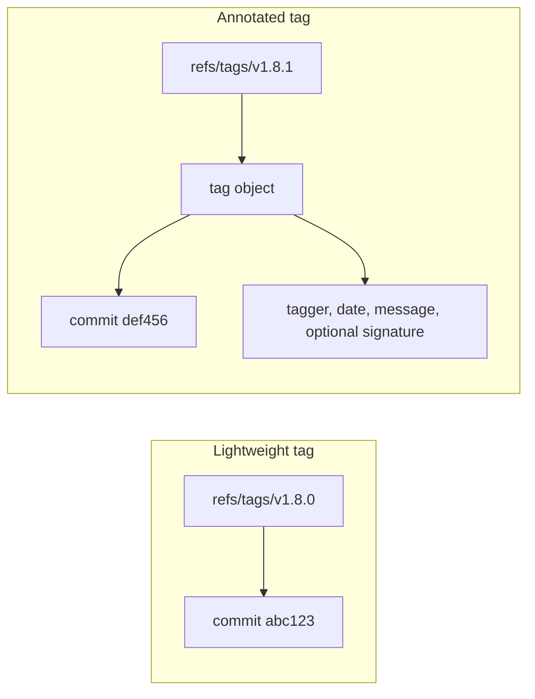
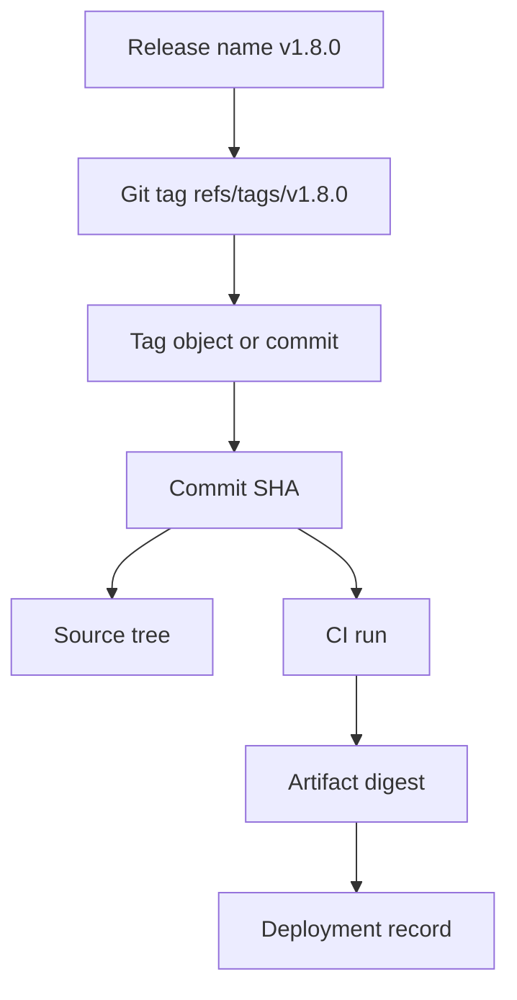
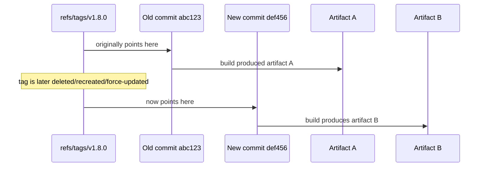
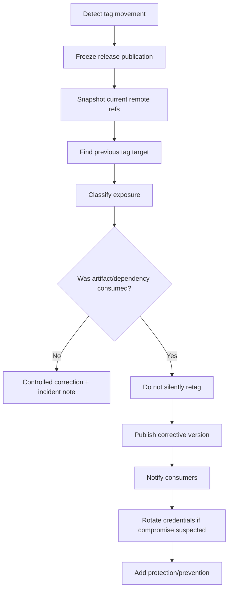

# Part 091 — Tag Mutability and Release Integrity

A Git tag looks simple:

```bash
# create a release tag
git tag -a v1.8.0 -m "Release v1.8.0"

# publish it
git push origin v1.8.0
```

But a release tag is not just a label.

In production engineering, a release tag is an **identity boundary**.

It answers:

- what source code was released?
- what commit produced the artifact?
- which review and CI checks applied?
- which migration/config/runtime contract belongs to this version?
- which dependency consumers are allowed to trust this release?
- which evidence should auditors inspect later?

The problem: Git tags are **technically mutable**.

A team may intend tags to be immutable, but Git itself allows a tag ref to be deleted, recreated, and force-pushed unless policy prevents it.

That gap between **social immutability** and **technical mutability** is where many release integrity failures happen.

---

## 1. Core Mental Model

A Git tag is a ref under `refs/tags/*`.

A tag can point directly to an object, or it can point to a tag object which then points to another object.



The important distinction:

| Tag form | What the ref points to | Metadata | Release suitability |
|---|---|---|---|
| Lightweight tag | usually commit object | no tagger/date/message/signature object | poor for production release identity |
| Annotated tag | tag object | tagger/date/message | good baseline for releases |
| Signed annotated tag | tag object | tagger/date/message/signature | stronger release provenance |

A release should usually use an annotated tag, and security-sensitive release processes should use signed annotated tags.

This is not because lightweight tags are invalid Git. It is because they are weak release records.

---

## 2. The Invariant: Tag Name Is Not the Release

A tag name is human-friendly.

A commit hash is object identity.

An artifact digest is artifact identity.

A release record is the binding between them.



A mature release system does not say:

> We deployed v1.8.0.

It says:

> We deployed artifact digest `sha256:...`, built from commit `abc123...`, referenced by signed tag `v1.8.0`, produced by build run `...`, under release approval `...`.

The tag is only one link in the chain.

If the tag moves, the chain breaks.

---

## 3. Why Tag Mutation Is Dangerous

A mutable branch is expected.

`main` moves every day.

A mutable release tag is dangerous because many systems treat it as stable:

- package managers
- Docker build scripts
- deployment manifests
- SBOM/provenance records
- CI release jobs
- changelog generators
- downstream repositories
- documentation links
- audit evidence
- rollback instructions
- incident reports

A moved tag creates two realities:



Both artifacts may claim `v1.8.0`.

Only one can be the canonical release.

In supply-chain terms, this is not a cosmetic problem. It is an identity collision.

---

## 4. Common Tag Mutation Failure Modes

### 4.1 Accidental Retag Before Public Exposure

A developer creates the wrong tag locally:

```bash
git tag -a v1.8.0 -m "Release v1.8.0" wrong-commit
```

If the tag has not been pushed and no artifact has been published, correction is simple:

```bash
git tag -d v1.8.0
git tag -a v1.8.0 -m "Release v1.8.0" correct-commit
```

This is not a supply-chain incident yet. It is a local mistake.

### 4.2 Pushed Tag, No Artifact Consumed Yet

The tag exists on remote, but no release artifact was published and no consumer has fetched it.

Correction may still be acceptable, but it must be controlled:

```bash
git tag -d v1.8.0
git tag -a v1.8.0 -m "Release v1.8.0" correct-commit
git push origin :refs/tags/v1.8.0
git push origin refs/tags/v1.8.0
```

This should require release-owner approval, not casual developer action.

### 4.3 Pushed Tag and Published Artifact

The moment an artifact, release page, container image, package, or deployment references the tag, treat the release as public.

Do not silently move the tag.

Preferred remediation:

```text
v1.8.0     bad release, documented as bad
v1.8.1     corrective release
```

If the tag must be removed for legal/security reasons, keep a signed incident record.

### 4.4 Attacker or Compromised Token Moves Tag

An attacker with push rights can replace a tag so that future consumers resolve a trusted version name to malicious source.

This is why tag protection, signed tags, immutable releases, and artifact digest verification matter.

### 4.5 Release Automation Reuses Existing Tag

A CI job uses:

```bash
git tag -f v1.8.0
```

or publishes release assets under a tag that already exists.

This is a workflow bug.

Release automation should fail closed if the tag exists:

```bash
if git rev-parse -q --verify "refs/tags/$VERSION" >/dev/null; then
  echo "Tag $VERSION already exists. Refusing to overwrite." >&2
  exit 1
fi
```

---

## 5. Lightweight vs Annotated vs Signed Tags

### 5.1 Lightweight Tag

```bash
git tag v1.8.0 abc123
```

A lightweight tag is just a ref.

Inspect:

```bash
git show-ref --tags v1.8.0
git cat-file -t v1.8.0
```

Likely output:

```text
commit
```

There is no independent tag object.

### 5.2 Annotated Tag

```bash
git tag -a v1.8.0 abc123 -m "Release v1.8.0"
```

Inspect:

```bash
git cat-file -t v1.8.0
git cat-file -p v1.8.0
```

Expected type:

```text
tag
```

The tag object contains:

- target object
- target object type
- tag name
- tagger identity
- date
- message

### 5.3 Signed Tag

```bash
git tag -s v1.8.0 abc123 -m "Release v1.8.0"
```

Verify:

```bash
git tag -v v1.8.0
```

A signed tag strengthens the release record because the tag object itself is signed.

But it does not solve every problem.

A signed tag can still be deleted and replaced by another signed tag if policy allows tag mutation.

Therefore:

> Signature proves who signed the tag object. Protection policy controls whether the tag ref can be replaced.

You need both for strong release integrity.

---

## 6. Tag Object vs Peeled Commit

Annotated tags point to tag objects, not directly to commits.

Use peeling to resolve the commit behind a tag:

```bash
# tag object SHA if annotated, commit SHA if lightweight
git rev-parse v1.8.0

# commit object behind tag
git rev-parse v1.8.0^{commit}

# show both ref and peeled target
git show-ref --dereference --tags v1.8.0
```

For release automation, do not accidentally compare the tag object SHA when you intend to compare the commit SHA.

A safe verification script should record both:

```bash
TAG="v1.8.0"
TAG_OBJECT=$(git rev-parse --verify "$TAG")
TAG_COMMIT=$(git rev-parse --verify "$TAG^{commit}")

printf 'tag=%s\n' "$TAG"
printf 'tag_object=%s\n' "$TAG_OBJECT"
printf 'tag_commit=%s\n' "$TAG_COMMIT"
```

For lightweight tags, `tag_object` and `tag_commit` may be the same commit SHA.

For annotated tags, they differ.

---

## 7. Release Integrity Invariants

A strong release process enforces these invariants:

| Invariant | Why it matters | Example enforcement |
|---|---|---|
| Release tags are annotated | carries tagger/date/message | release script rejects lightweight tags |
| Release tags are signed | strengthens provenance | `git tag -v` / hosting verification |
| Release tags are immutable after publication | prevents silent source mutation | protected tags / immutable release settings |
| Artifact records commit SHA | tag name alone is insufficient | build metadata contains `git rev-parse HEAD` |
| Artifact records digest | artifact identity is independent from Git | SBOM/provenance/deployment record |
| CI builds from tag commit, not moving branch | prevents branch drift | checkout by SHA or tag-ref with verification |
| Release notes are generated from commit range | avoids wrong boundary | previous tag commit to current tag commit |
| Rollback references artifact digest and commit | avoids ambiguous rollback | deployment manifest pins digest/SHA |
| Tag creation is controlled | reduces accidental retagging | release bot + restricted permissions |
| Tag deletion/replacement is auditable | incident reconstruction | server audit logs + signed incident note |

---

## 8. Dangerous Anti-Patterns

### 8.1 `latest` as Release Tag

```text
v1.8.0
v1.8.1
latest   -> moves repeatedly
```

A moving tag named `latest` is semantically a branch or channel, not a release.

Better:

| Need | Better representation |
|---|---|
| Immutable release | `v1.8.1` annotated/signed tag |
| Moving channel | branch `release/stable` or package dist-tag/channel |
| Docker latest-like UX | mutable image tag plus immutable digest record |
| Deployment pointer | environment record, not source release tag |

### 8.2 Retagging to Fix a Release

Bad:

```bash
git tag -f v1.8.0 fixed-commit
git push --force origin v1.8.0
```

Better:

```bash
git tag -a v1.8.1 fixed-commit -m "Release v1.8.1: fix v1.8.0 regression"
git push origin v1.8.1
```

A new version tells the truth.

A moved tag edits history after consumers may have trusted it.

### 8.3 Build by Tag Name Without Verification

Risky:

```bash
git checkout v1.8.0
./build.sh
```

Safer:

```bash
TAG=v1.8.0
EXPECTED_COMMIT=abc123...

git fetch --tags --force origin
ACTUAL_COMMIT=$(git rev-parse --verify "$TAG^{commit}")

test "$ACTUAL_COMMIT" = "$EXPECTED_COMMIT"
git checkout --detach "$ACTUAL_COMMIT"
./build.sh
```

The safer version treats the tag as a lookup that must match an expected identity.

### 8.4 Release Notes from Moving Boundaries

Risky:

```bash
git log v1.7.0..v1.8.0
```

This is fine only if both tags are immutable and correct.

If either tag moved, release notes change after publication.

For serious releases, archive the commit boundary used to generate notes:

```text
previous_tag: v1.7.0
previous_commit: 1111111...
current_tag: v1.8.0
current_commit: 2222222...
range: 1111111..2222222
```

---

## 9. Designing Protected Tag Policy

A mature repository treats release tags as protected refs.

Example policy:

```text
refs/tags/v[0-9]*
  create: release-bot only
  update: nobody
  delete: nobody
  require signed tag: true
  require CI release workflow: true
  require release approval: true
```

If your hosting platform supports immutable releases or protected tags, use them.

If it does not, approximate with server-side hooks.

### Server-Side Hook Concept

```bash
#!/usr/bin/env bash
# pre-receive pseudo-hook

while read oldrev newrev refname; do
  case "$refname" in
    refs/tags/v*)
      ZERO=0000000000000000000000000000000000000000

      if [ "$oldrev" != "$ZERO" ]; then
        echo "Release tag update/delete is forbidden: $refname" >&2
        exit 1
      fi

      type=$(git cat-file -t "$newrev")
      if [ "$type" != "tag" ]; then
        echo "Release tags must be annotated tag objects: $refname" >&2
        exit 1
      fi
      ;;
  esac
done
```

This hook blocks updates to existing release tags and rejects lightweight release tags.

In a real server policy, also verify signature and actor identity.

---

## 10. Release Tag Creation Playbook

### Step 1: Freeze Source Identity

```bash
git fetch origin --tags
git switch main
git pull --ff-only origin main
```

Record:

```bash
RELEASE_COMMIT=$(git rev-parse HEAD)
```

### Step 2: Verify Clean State

```bash
git status --short

git diff --quiet
git diff --cached --quiet
```

No dirty state should exist in release tagging.

### Step 3: Verify CI and Review Evidence

Do not tag just because local tests pass.

Release tag should point to a commit that passed the release gates.

Evidence should include:

- CI run ID
- approval ID or PR IDs
- source commit SHA
- dependency lockfile state
- migration review
- security scan output
- artifact digest after build

### Step 4: Create Signed Annotated Tag

```bash
git tag -s v1.8.0 "$RELEASE_COMMIT" -m "Release v1.8.0

Commit: $RELEASE_COMMIT
Approved-by: release-owner@example.com
CI-Run: <ci-run-id>
"
```

### Step 5: Verify Before Push

```bash
git tag -v v1.8.0
git rev-parse --verify v1.8.0^{commit}
git show --stat --decorate v1.8.0
```

### Step 6: Push Tag Explicitly

```bash
git push origin refs/tags/v1.8.0
```

Avoid broad tag push from dirty developer environments:

```bash
# risky in release process if local has experimental tags
git push --tags
```

### Step 7: Build Artifact from Resolved Commit

```bash
git checkout --detach "$(git rev-parse v1.8.0^{commit})"
./build.sh
```

Record artifact digest:

```bash
sha256sum dist/my-service.tar.gz
```

### Step 8: Publish Release Record

Minimum release record:

```yaml
version: v1.8.0
tag: v1.8.0
tagObject: <sha>
commit: <sha>
sourceRepository: <url>
ciRun: <id>
artifactDigest: sha256:<digest>
createdBy: release-bot
approvedBy:
  - <person-or-group>
releaseNotesRange:
  fromTag: v1.7.0
  fromCommit: <sha>
  toTag: v1.8.0
  toCommit: <sha>
```

---

## 11. Verifying a Release Tag

Use a layered verification approach.

### 11.1 Does the Tag Exist?

```bash
git ls-remote --tags origin v1.8.0
```

### 11.2 Is It Annotated?

```bash
git cat-file -t v1.8.0
```

Expected:

```text
tag
```

### 11.3 Is It Signed?

```bash
git tag -v v1.8.0
```

### 11.4 What Commit Does It Resolve To?

```bash
git rev-parse --verify v1.8.0^{commit}
```

### 11.5 Does It Match the Artifact?

Check artifact embedded metadata:

```bash
./my-service --version
```

Expected output should include:

```text
version=v1.8.0
commit=<same commit>
build=<ci-run-id>
```

### 11.6 Does the Artifact Digest Match the Release Record?

```bash
sha256sum my-service.tar.gz
```

Tag verification alone is not enough. Artifact verification completes the chain.

---

## 12. Incident Playbook: Release Tag Moved

If a release tag moved after publication, treat it as a supply-chain incident until proven harmless.



### Step 1: Freeze

Stop:

- release jobs
- package publication
- deployment promotion
- dependency update bots

### Step 2: Snapshot Evidence

```bash
git ls-remote --tags origin > tags-remote-after.txt
git show-ref --tags > tags-local-after.txt
```

If someone has an older clone:

```bash
git show-ref --tags v1.8.0
```

Collect:

- old tag target
- new tag target
- actor if audit logs exist
- time of mutation
- release artifacts produced before/after
- consumers that fetched the tag

### Step 3: Compare Old and New Trees

```bash
git diff --stat OLD_COMMIT NEW_COMMIT
git diff OLD_COMMIT NEW_COMMIT -- . ':!dist/'
```

Classify difference:

| Difference | Risk |
|---|---|
| identical commit | low, but still audit actor |
| same tree, different metadata | medium for signatures/audit |
| source difference | high |
| build scripts/dependencies changed | critical |
| security-sensitive files changed | critical |
| unknown actor changed tag | critical |

### Step 4: Decide Remediation

| Exposure | Recommended action |
|---|---|
| local only | delete/recreate locally |
| pushed, no consumption | controlled correction, documented |
| public artifact published | publish new version; do not silently move |
| package ecosystem consumed | security advisory / consumer notification |
| suspected compromise | revoke tokens, rotate secrets, investigate access logs |

### Step 5: Prevent Recurrence

- protect release tags
- require signed tags
- restrict release bot token
- fail if tag exists
- publish artifact digest
- pin dependencies by commit/digest
- monitor tag mutation
- write immutable release policy

---

## 13. Tag Mutation Detection

A simple local monitor can store tag state:

```bash
mkdir -p .git-tag-audit

git ls-remote --tags origin \
  | sort \
  > .git-tag-audit/tags-$(date +%Y%m%d-%H%M%S).txt
```

Compare snapshots:

```bash
diff -u old-tags.txt new-tags.txt
```

Better: store tag state in a release database:

```sql
release_tag_name
remote_ref_sha
peeled_commit_sha
tag_object_sha
first_seen_at
last_verified_at
created_by
release_artifact_digest
```

A tag mutation should trigger an alert.

Do not rely on people remembering that tags should not move.

---

## 14. Tag Integrity in Monorepos

Monorepos complicate tag semantics.

Possible tag schemes:

| Scheme | Example | Use case | Risk |
|---|---|---|---|
| global repo tag | `v2026.07.07` | all services released together | overcouples unrelated services |
| service prefix | `payments/v1.8.0` | independent service releases | many tags, requires convention |
| package prefix | `libs/auth/v2.4.1` | library release in monorepo | release notes range harder |
| build train tag | `train/2026-07-07.1` | coordinated release train | needs manifest |

For monorepo service releases, tag alone may not identify the changed scope.

Add release manifest:

```yaml
release: payments/v1.8.0
repoCommit: abc123
service: payments
path: services/payments
previousRelease: payments/v1.7.4
changedPaths:
  - services/payments
  - libs/auth
  - libs/risk
artifactDigest: sha256:...
```

The tag identifies the repository commit. The manifest identifies the product boundary.

---

## 15. Tags, Containers, and Artifact Registries

Git tags and container tags are both names that may be mutable depending on registry policy.

Do not confuse them.

| Identity | Mutable by default? | Stronger anchor |
|---|---:|---|
| Git branch | yes | commit SHA |
| Git tag | technically yes unless protected | protected signed tag + commit SHA |
| Container tag | often yes | image digest |
| Package version | usually intended immutable, ecosystem-dependent | package checksum/digest/provenance |
| Release page asset | platform-dependent | asset digest |

A secure deployment should pin artifact digest, not only image tag:

```yaml
image: registry.example.com/payments@sha256:abc...
source:
  gitTag: payments/v1.8.0
  gitCommit: def...
```

Git release identity and runtime artifact identity must both be recorded.

---

## 16. Minimal Release Tag Policy Template

```md
# Release Tag Policy

## Scope
All tags matching `v*`, `*/v*`, or `release/*` are release tags.

## Rules
1. Release tags must be annotated.
2. Release tags must be signed by the release bot or approved release key.
3. Release tags must point to commits that passed required release CI.
4. Release tags must be created by the release workflow, not manually from developer machines.
5. Release tags must not be updated or deleted after publication.
6. A bad release is remediated by a new version, not by moving the old tag.
7. Artifact digest and commit SHA must be recorded in the release record.
8. Tag mutation, deletion, or signature failure is treated as a release-integrity incident.

## Emergency Exception
Any exception requires:
- incident ID
- security/release owner approval
- old tag object and commit
- new tag object and commit
- consumer impact assessment
- public or internal notification as applicable
```

---

## 17. Build a Release Tag Verifier

Create `verify-release-tag.sh`:

```bash
#!/usr/bin/env bash
set -euo pipefail

TAG=${1:?usage: verify-release-tag.sh <tag> [expected_commit]}
EXPECTED=${2:-}

# Make sure tag resolves.
git rev-parse --verify --quiet "$TAG" >/dev/null

TYPE=$(git cat-file -t "$TAG")
if [ "$TYPE" != "tag" ]; then
  echo "ERROR: $TAG is not an annotated tag. Actual type: $TYPE" >&2
  exit 1
fi

# Verify signature if present/required.
if ! git tag -v "$TAG" >/tmp/tag-verify.$$ 2>&1; then
  cat /tmp/tag-verify.$$ >&2
  rm -f /tmp/tag-verify.$$
  echo "ERROR: tag signature verification failed: $TAG" >&2
  exit 1
fi
rm -f /tmp/tag-verify.$$

COMMIT=$(git rev-parse --verify "$TAG^{commit}")
TAG_OBJECT=$(git rev-parse --verify "$TAG")

if [ -n "$EXPECTED" ] && [ "$COMMIT" != "$EXPECTED" ]; then
  echo "ERROR: tag commit mismatch" >&2
  echo "expected: $EXPECTED" >&2
  echo "actual:   $COMMIT" >&2
  exit 1
fi

echo "tag=$TAG"
echo "tagObject=$TAG_OBJECT"
echo "commit=$COMMIT"
echo "status=verified"
```

Use in CI:

```bash
./verify-release-tag.sh v1.8.0 abc123...
```

This script intentionally rejects lightweight release tags.

---

## 18. Decision Framework

| Situation | Move tag? | Better action |
|---|---:|---|
| Local tag wrong, not pushed | yes | delete/recreate locally |
| Pushed tag, no artifact, no consumers | maybe, with approval | delete/recreate with incident note |
| Published artifact exists | no | release new patch version |
| Public package consumed | no | new version + notification/advisory |
| Secret in release commit | do not rely on retag | rotate secret, publish clean release, consider history rewrite separately |
| Attacker moved tag | no silent fix | incident response, revoke access, publish advisory |
| Need stable channel | do not use release tag | branch/channel/dist-tag with explicit mutability |

The rule is simple:

> If someone outside the release process may have observed the tag, changing it is no longer a normal Git correction. It is a release integrity event.

---

## 19. Practical Checklist

Before creating a release tag:

- [ ] target commit is correct
- [ ] working tree is clean
- [ ] release CI passed on target commit
- [ ] dependency lockfiles are reviewed
- [ ] migrations/config changes are approved
- [ ] release notes boundary is correct
- [ ] tag will be annotated
- [ ] tag will be signed
- [ ] tag name is not already used
- [ ] tag protection is active
- [ ] release bot token scope is minimal

After publishing:

- [ ] verify remote tag target
- [ ] verify tag signature
- [ ] record peeled commit SHA
- [ ] build artifact from resolved commit
- [ ] record artifact digest
- [ ] publish release record
- [ ] monitor tag mutation

During incident:

- [ ] freeze publication
- [ ] snapshot refs
- [ ] identify old/new target
- [ ] classify exposure
- [ ] do not silently retag public release
- [ ] publish corrective version if consumed
- [ ] notify consumers if needed
- [ ] add missing protection

---

## 20. Summary

Tag mutability is a supply-chain problem disguised as a Git convenience.

The advanced mental model is:

- branch names are expected to move
- release tag names should not move after publication
- Git technically allows tag mutation unless policy prevents it
- annotated tags are better release records than lightweight tags
- signed tags prove signer and tag object integrity, not ref immutability
- protected tags prevent replacement/deletion
- artifact digests complete the release identity chain
- bad public releases should be corrected with new versions, not moved tags

The strongest release identity is not a tag alone.

It is a verified binding:

```text
release version
  -> protected signed Git tag
  -> peeled commit SHA
  -> source tree
  -> CI/provenance record
  -> artifact digest
  -> deployment record
```

That is the difference between “we tagged it” and “we can prove what we shipped.”

---

## References

- Git Book — Tagging: https://git-scm.com/book/en/v2/Git-Basics-Tagging
- Git tag documentation: https://git-scm.com/docs/git-tag
- Git rev-parse documentation: https://git-scm.com/docs/git-rev-parse
- Git push documentation: https://git-scm.com/docs/git-push
- GitHub Docs — Immutable releases: https://docs.github.com/en/code-security/concepts/supply-chain-security/immutable-releases
- SLSA provenance: https://slsa.dev/spec/v0.1/provenance
