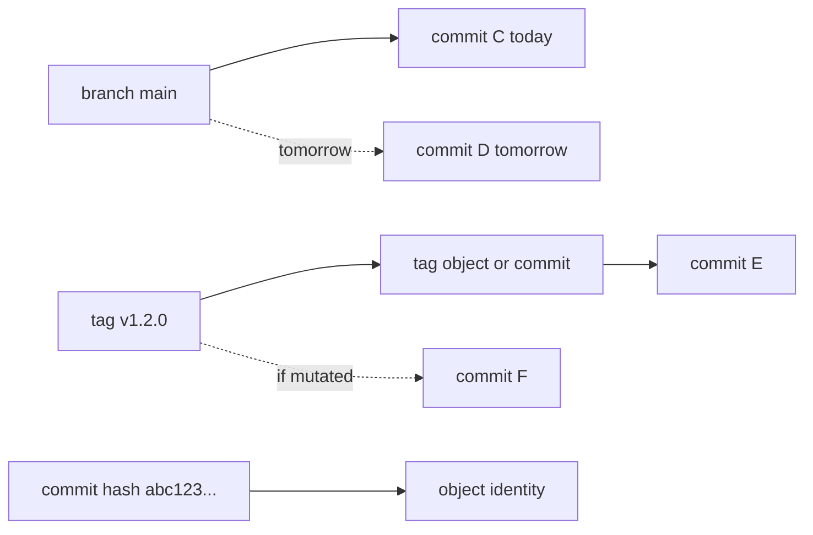
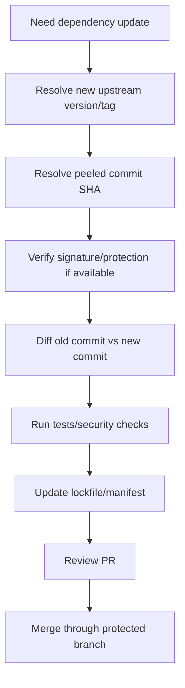

# Part 092 — Dependency Pinning to Commit Hash

A dependency reference is a trust decision.

This is obvious when the dependency is a container image, package, binary, or third-party library.

It is less obvious when the dependency is a Git reference:

```text
https://github.com/example/lib.git#main
https://github.com/example/lib.git#v1.2.0
https://github.com/example/lib.git#abc123...
```

All three look precise.

They are not equally precise.

| Reference | Meaning | Mutation risk |
|---|---|---:|
| branch name | moving line of development | high |
| tag name | intended release label, technically mutable unless protected | medium/high |
| commit hash | object identity | low, but not zero operational risk |

Advanced engineering practice is not “always use commit hashes everywhere.”

The correct principle is:

> Any dependency that affects build, release, security, compliance, or production behavior must resolve to a stable, auditable identity.

For Git dependencies, that usually means commit hash pinning, often paired with tag/version metadata for human readability.

---

## 1. Core Mental Model: Names vs Identity

Git has multiple layers of naming.



A branch is a moving pointer by design.

A tag is intended to be stable in release culture, but Git can move it unless prevented.

A commit hash names a specific object.

This is why pinning to a commit hash is stronger than pinning to a tag name.

---

## 2. What Commit Pinning Solves

Commit pinning helps with:

- reproducible builds
- deterministic dependency resolution
- supply-chain auditability
- incident investigation
- rollback correctness
- security review evidence
- cache correctness
- CI stability
- release note traceability
- avoiding surprise updates from branch movement
- avoiding silent retagging surprises

Example:

```text
bad:
  dependency = git+https://github.com/acme/risk-rules.git#main

better:
  dependency = git+https://github.com/acme/risk-rules.git#7e84c0d4...

best in many systems:
  dependency = name: risk-rules
               version: v2.4.1
               commit: 7e84c0d4...
               source: https://github.com/acme/risk-rules.git
               artifactDigest: sha256:...
```

The best record keeps both machine identity and human version context.

---

## 3. What Commit Pinning Does Not Solve

Commit pinning is stronger, but not magic.

It does not prove:

- the commit was reviewed
- the commit was built by a trusted builder
- the commit came from the expected repository owner
- the commit was not malicious when created
- the artifact was built from that commit
- the dependency is free of vulnerabilities
- the repository will always retain the object
- the commit is reachable forever
- the source archive was generated correctly
- transitive dependencies are pinned

It solves one specific class of risk:

> the dependency cannot silently change to another commit while keeping the same branch/tag name.

That is valuable, but it is only one layer.

---

## 4. Pinning Strength Ladder

| Level | Example | Strength | Main risk |
|---:|---|---|---|
| 0 | `main` | weak | changes constantly |
| 1 | `release/1.x` | weak | branch still moves |
| 2 | `v1.2.0` | medium | tag may move unless protected |
| 3 | signed/protected `v1.2.0` | stronger | consumer still resolves by name |
| 4 | commit SHA | strong source identity | repository retention / provenance limits |
| 5 | commit SHA + signed/protected tag metadata | stronger auditability | still source-level only |
| 6 | commit SHA + artifact digest + provenance | strongest practical release chain | provenance trust boundary |

Commit pinning belongs near the top, but artifact digest and provenance complete the supply-chain chain.

---

## 5. The Dependency Resolution Invariant

Every build should be able to answer:

```text
For each dependency:
  what human version did we intend?
  what immutable source identity did we resolve?
  what artifact identity did we consume?
  who approved it?
  when did it change?
  why did it change?
```

A dependency record should be shaped like this:

```yaml
name: risk-rules
source: https://github.com/acme/risk-rules.git
version: v2.4.1
ref: v2.4.1
commit: 7e84c0d4f9d2...
resolvedAt: 2026-07-07T03:22:10Z
verifiedBy: dependency-update-ci
approvedBy:
  - platform-security
  - risk-domain-owner
artifact:
  digest: sha256:...
  registry: artifacts.example.com/risk-rules
```

This makes dependency updates reviewable as explicit changes.

---

## 6. Why Branch Pinning Is Unsafe

Branch references are designed to move.

```bash
git ls-remote https://github.com/acme/lib.git refs/heads/main
```

Today:

```text
1111111 refs/heads/main
```

Tomorrow:

```text
2222222 refs/heads/main
```

If your build consumes `main`, the same build definition can resolve different source code across time.

This breaks:

- reproducibility
- incident replay
- cache integrity
- dependency review
- vulnerability triage
- rollback certainty

Branch dependencies may be acceptable for experimental local development.

They should not be acceptable for production release inputs.

---

## 7. Why Tag Pinning Is Better but Not Enough

A tag like `v1.2.0` is better than `main` because it expresses release intent.

But unless the tag is protected/immutable and verified, the name can still resolve to different commits over time.

```bash
# observe tag target
git ls-remote --tags https://github.com/acme/lib.git v1.2.0

# resolve peeled commit after fetching
git rev-parse v1.2.0^{commit}
```

If a dependency manager records only:

```text
lib = v1.2.0
```

then a retag can produce a different build with the same manifest.

Better:

```text
lib = v1.2.0 @ 7e84c0d4f9d2...
```

This captures both meaning and identity.

---

## 8. Commit Hash Pinning Pattern

### 8.1 Direct Git Checkout

```bash
git clone https://github.com/acme/lib.git deps/lib
cd deps/lib
git checkout --detach 7e84c0d4f9d2...
```

Verify:

```bash
git rev-parse --verify HEAD
git status --short
```

### 8.2 Fetch Single Commit Carefully

Many servers allow fetching by SHA only if reachable from advertised refs or configured to allow it.

Safer pattern:

```bash
git init deps/lib
cd deps/lib
git remote add origin https://github.com/acme/lib.git
git fetch --tags origin
git checkout --detach 7e84c0d4f9d2...
```

For private/internal infrastructure, ensure pinned commits remain reachable.

Do not garbage-collect release dependency commits that production builds still need.

### 8.3 Verify Expected Tag Also Points There

```bash
EXPECTED_COMMIT=7e84c0d4f9d2...
TAG=v2.4.1

ACTUAL_COMMIT=$(git rev-parse --verify "$TAG^{commit}")
test "$ACTUAL_COMMIT" = "$EXPECTED_COMMIT"
```

This lets humans review version names while machines enforce identity.

---

## 9. Pinning Git Submodules

Submodules are commit-pinned by design.

The superproject stores a gitlink entry pointing to a specific submodule commit.

```bash
git ls-tree HEAD path/to/submodule
```

Example output:

```text
160000 commit 7e84c0d4f9d2... path/to/submodule
```

That is good.

But submodules still have operational risks:

- submodule commit may not exist on remote anymore
- developer may forget to update submodule recursively
- CI may fetch shallow history insufficiently
- submodule URL may point to unexpected fork
- submodule branch config may mislead people into thinking it tracks automatically
- review may ignore submodule commit diff

Safe submodule update workflow:

```bash
git submodule update --init --recursive

git -C path/to/submodule rev-parse HEAD

git diff --submodule=log main...HEAD
```

Review should inspect what changed between old and new submodule commits:

```bash
git diff --submodule=log -- path/to/submodule
```

Commit-pinned does not mean review-free.

---

## 10. Pinning GitHub Actions and CI Dependencies

A common supply-chain issue is referencing an action by branch or tag:

```yaml
# weaker
uses: actions/checkout@v4
uses: some-vendor/deploy@main
```

A stronger source identity pin uses a commit SHA:

```yaml
uses: actions/checkout@692973e3d937129bcbf40652eb9f2f61becf3332
```

But pure SHA is hard for humans to review.

A practical policy combines:

```yaml
# actions/checkout v4.1.7
uses: actions/checkout@692973e3d937129bcbf40652eb9f2f61becf3332
```

Governance rule:

- internal low-risk actions may use protected tags
- third-party actions in production/release workflows should be pinned by full commit SHA
- dependency update automation should open PRs that show old/new tag and old/new SHA
- security reviews should focus on diff between old/new commit, not only version label

---

## 11. Pinning Git Dependencies in Application Manifests

Many package managers allow Git references.

The exact syntax differs, but the principle is the same:

```text
repo URL + immutable commit identity
```

Weak examples:

```text
git+https://github.com/acme/lib.git#main
git+https://github.com/acme/lib.git#v1.2.0
```

Stronger example:

```text
git+https://github.com/acme/lib.git#7e84c0d4f9d2...
```

Best operational pattern:

- use package registry artifacts where possible
- if using Git dependency, pin commit SHA
- record human version/tag as metadata/comment
- include lockfile in review
- verify transitive dependencies
- mirror critical dependencies internally
- monitor upstream tag mutation and commit availability

Git is a source control system. It is not always the best production dependency distribution system.

For release artifacts, a package registry with checksums/provenance may be better than raw Git dependencies.

---

## 12. Commit Pinning and Lockfiles

A lockfile is the natural place for resolved identity.

A good lockfile records:

```yaml
name: lib
repo: https://github.com/acme/lib.git
requested: v1.2.0
resolvedCommit: 7e84c0d4f9d2...
checksum: sha256:...
```

A bad lockfile records only:

```yaml
name: lib
ref: v1.2.0
```

The lockfile should be reviewed like code.

Dependency PR checklist:

- [ ] old commit identified
- [ ] new commit identified
- [ ] old/new diff reviewed
- [ ] upstream tag signature checked if applicable
- [ ] release notes reviewed
- [ ] vulnerability advisory checked
- [ ] license checked if dependency changed materially
- [ ] tests run against the resolved commit
- [ ] transitive dependency lockfile changes understood

---

## 13. Vendor, Mirror, or Pin?

Commit pinning is one option. It is not the only option.

| Strategy | Pros | Cons | Good for |
|---|---|---|---|
| branch ref | easy | nondeterministic | local experiments |
| tag ref | readable | tag mutation risk | low-risk dev tooling |
| commit pin | deterministic source identity | may be hard to update/review | production source deps |
| internal mirror + commit pin | protects availability | mirror ops overhead | critical third-party source deps |
| vendoring source | strongest availability/review | repo bloat, update burden | small critical libs |
| package artifact + digest | best distribution boundary | requires packaging/provenance | production binaries/libs |
| submodule | explicit Git commit pin | UX complexity | source-level multi-repo dependencies |

A regulated or high-security system often combines:

```text
upstream dependency
  -> internal mirror
  -> reviewed commit pin
  -> built internal artifact
  -> artifact digest pinned in deploy
```

---

## 14. Availability Risk: Pinned Commit Disappears

A commit hash is stable only if the object remains available.

Risks:

- upstream force-push removes commit from advertised refs
- repository is deleted
- private access revoked
- hosting provider outage
- garbage collection prunes unreachable object
- shallow clone cannot reach commit
- partial clone lazy fetch fails offline

Mitigation:

- mirror critical repositories internally
- keep release tags/refs pointing to pinned commits
- vendor small critical dependencies when justified
- cache source archives with checksums
- store artifact digest and binary artifact
- record provenance materials

Commit identity solves mutation. It does not solve availability.

---

## 15. Security Risk: Correct Commit, Wrong Repository

A commit SHA alone may not be enough context.

The same abbreviated SHA could be ambiguous, and even full SHA must be tied to source repository identity in policy.

Always record:

```yaml
repository: https://github.com/acme/lib.git
commit: 7e84c0d4f9d2...
remote: origin
owner: acme
expectedTag: v1.2.0
```

Do not accept dependency records like:

```text
commit=7e84c0d
```

without repository context.

Use full-length commit hashes for policy and evidence.

Short hashes are display conveniences, not dependency anchors.

---

## 16. Update Workflow for Commit-Pinned Dependencies

Commit pinning shifts work from implicit update to explicit update.

That is a feature.



Example PR body:

```md
## Dependency Update

Dependency: acme/risk-rules
From: v2.4.1 / 7e84c0d4...
To: v2.4.2 / 91faab12...

## Verification
- Upstream tag verified: yes
- Diff reviewed: yes
- Tests: passed
- Security scan: passed
- Breaking change: no

## Reason
Includes fix for rule evaluation overflow in enforcement lifecycle transition.
```

This makes dependency changes explicit and reviewable.

---

## 17. Diffing Dependency Updates

The real review is not the version label.

It is the diff between old and new commits.

```bash
OLD=7e84c0d4...
NEW=91faab12...

git clone https://github.com/acme/risk-rules.git /tmp/risk-rules
cd /tmp/risk-rules

git fetch --tags origin

git log --oneline --decorate --graph "$OLD..$NEW"
git diff --stat "$OLD..$NEW"
git diff "$OLD..$NEW" -- . ':!generated/'
```

For sensitive dependencies, add pickaxe queries:

```bash
git log -G 'eval|exec|token|secret|permission|auth|crypto' -- "$OLD..$NEW"
```

For release notes:

```bash
git tag --contains "$NEW" | head
```

But remember: tag containment helps interpretation. It is not the identity anchor.

---

## 18. Build-Time Verification Script

Create `verify-git-dependency.sh`:

```bash
#!/usr/bin/env bash
set -euo pipefail

REPO=${1:?repo url required}
EXPECTED_COMMIT=${2:?expected commit required}
EXPECTED_REF=${3:-}
DIR=${4:-dep-check}

rm -rf "$DIR"
git clone --no-checkout "$REPO" "$DIR"
cd "$DIR"

git fetch --tags origin

# Verify commit object exists and is a commit.
git cat-file -e "$EXPECTED_COMMIT^{commit}"

if [ -n "$EXPECTED_REF" ]; then
  ACTUAL=$(git rev-parse --verify "$EXPECTED_REF^{commit}")
  if [ "$ACTUAL" != "$EXPECTED_COMMIT" ]; then
    echo "ERROR: ref $EXPECTED_REF does not resolve to expected commit" >&2
    echo "expected: $EXPECTED_COMMIT" >&2
    echo "actual:   $ACTUAL" >&2
    exit 1
  fi
fi

git checkout --detach "$EXPECTED_COMMIT"

echo "repo=$REPO"
echo "commit=$(git rev-parse HEAD)"
echo "status=verified"
```

Usage:

```bash
./verify-git-dependency.sh \
  https://github.com/acme/risk-rules.git \
  7e84c0d4f9d2... \
  v2.4.1
```

This verifies both identity and expected human ref mapping.

---

## 19. Commit Pinning in Release Evidence

A release evidence bundle should include dependencies as resolved identities.

```yaml
release: payments/v1.8.0
sourceCommit: abc123...
artifactDigest: sha256:...
dependencies:
  - name: risk-rules
    source: https://github.com/acme/risk-rules.git
    requested: v2.4.1
    resolvedCommit: 7e84c0d4...
    verifiedTag: true
    approvedBy: risk-domain-owner
  - name: fraud-model-config
    source: https://github.com/acme/fraud-model-config.git
    requested: release/2026-07
    resolvedCommit: 99a1b2c3...
    verifiedTag: false
    note: moving branch accepted only for internal pre-prod config; production must pin
```

For regulated systems, this record is not paperwork. It is the bridge between source review and operational accountability.

---

## 20. Policy Matrix

| Dependency type | Allowed ref in local dev | Allowed ref in CI main | Allowed ref in release | Notes |
|---|---|---|---|---|
| internal service source | branch | branch/commit | commit/tag+commit | deploy by artifact digest |
| internal shared library | branch/tag | tag+commit | commit + artifact checksum | prefer registry package |
| third-party Git dependency | tag/commit | commit | commit + mirror/artifact digest | avoid branch |
| GitHub Action | tag for low risk | full SHA for sensitive workflows | full SHA | comment version for readability |
| submodule | commit | commit | commit | review submodule diff |
| generated code repo | commit | commit | commit + generator version | record generator identity |
| config/rules repo | branch in sandbox | commit in staging | commit in prod | config changes are behavior changes |
| ML model/config repo | never branch in prod | commit + artifact digest | digest + provenance | Git may not be right storage |

---

## 21. Common Objections

### “Commit hashes are unreadable.”

Correct.

That is why you keep version metadata next to the hash:

```yaml
version: v2.4.1
commit: 7e84c0d4f9d2...
```

Humans read version names. Machines enforce identities.

### “Tags are supposed to be immutable.”

Culturally, yes.

Technically, not unless protected.

Release engineering should design for technical reality, not intention.

### “Updating pinned commits creates noisy PRs.”

Yes, and that is the point.

Dependency changes are behavior changes. They deserve review.

Reduce noise with automation, grouping, ownership routing, and risk-tiered policy—not by accepting nondeterminism.

### “Our package manager already has a lockfile.”

Good.

Check whether the lockfile records immutable source identity and artifact checksum.

A lockfile that records only a tag/branch has weaker reproducibility.

### “We trust our internal repos.”

Trust does not remove drift.

Internal branch dependencies still make builds non-reproducible unless resolved to immutable identities.

---

## 22. Failure Mode Catalogue

| Failure | Root cause | Prevention |
|---|---|---|
| Build changes overnight | dependency pinned to branch | commit pin + lockfile |
| Same version produces different artifact | tag moved | commit pin + protected tags + artifact digest |
| CI passes, release rebuild fails | shallow clone cannot reach pinned commit | fetch strategy + internal mirror |
| Incident cannot reproduce dependency state | no resolved commit record | release evidence bundle |
| Submodule update hides risky changes | review only sees gitlink SHA | `git diff --submodule=log` required |
| Third-party action compromised | workflow uses mutable tag/branch | pin action to full SHA |
| Pinned commit unavailable | upstream deleted/GC'd | mirror/vendor/cache source |
| Wrong fork used | repo URL not controlled | repository allowlist + owner verification |
| Transitive dependency drifts | only top-level pinned | lock transitive dependencies |
| Artifact not built from pinned source | no provenance/digest link | build provenance + artifact digest |

---

## 23. Recommended Team Standard

```md
# Git Dependency Pinning Standard

## Principle
Production-affecting dependencies must resolve to immutable, auditable identities.

## Rules
1. Branch refs are forbidden in release builds.
2. Tag refs are allowed only when paired with resolved commit SHA.
3. Third-party Git dependencies must be pinned to full commit SHA.
4. Sensitive CI actions must be pinned to full commit SHA.
5. Submodule updates must show old/new commit diff in PR.
6. Critical third-party dependencies must be mirrored or vendored if availability matters.
7. Release evidence must record dependency source URL, requested version/ref, resolved commit, and artifact digest when applicable.
8. Dependency updates must be reviewed as code changes.
9. Short SHA is not sufficient for policy records.
10. A dependency source may be used only if it is on the repository allowlist.
```

---

## 24. Advanced Pattern: Dual Pinning

For maintainability, use **dual pinning**:

```yaml
name: risk-rules
version: v2.4.1
commit: 7e84c0d4f9d2a7e2e9b3c0d1e2f3a4b5c6d7e8f9
```

Validation rule:

```text
version/ref must resolve to commit
commit is the build identity
```

This gives:

- readable PRs
- deterministic builds
- tag mutation detection
- easier incident communication
- better release notes

The version is explanation. The commit is authority.

---

## 25. Summary

Dependency pinning to commit hash is not a style preference.

It is a reproducibility and supply-chain control.

The core lessons:

- branch names are moving pointers
- tags are better but technically mutable unless protected
- commit hashes provide stable source object identity
- commit pinning does not replace review, provenance, checksums, or mirroring
- dependency updates should be explicit PRs with old/new commit diff
- release evidence should record source URL, requested ref, resolved commit, and artifact digest
- production systems should avoid mutable dependency refs

The target state is:

```text
human meaning:
  version/tag/release notes

machine identity:
  commit SHA + artifact digest

trust evidence:
  signature/protection/provenance/review/CI
```

That is how Git becomes a defensible dependency boundary instead of a convenient source downloader.

---

## References

- Git rev-parse documentation: https://git-scm.com/docs/git-rev-parse
- Git tag documentation: https://git-scm.com/docs/git-tag
- Git submodule documentation: https://git-scm.com/docs/git-submodule
- GitHub Docs — Immutable releases: https://docs.github.com/en/code-security/concepts/supply-chain-security/immutable-releases
- SLSA provenance: https://slsa.dev/spec/v0.1/provenance
