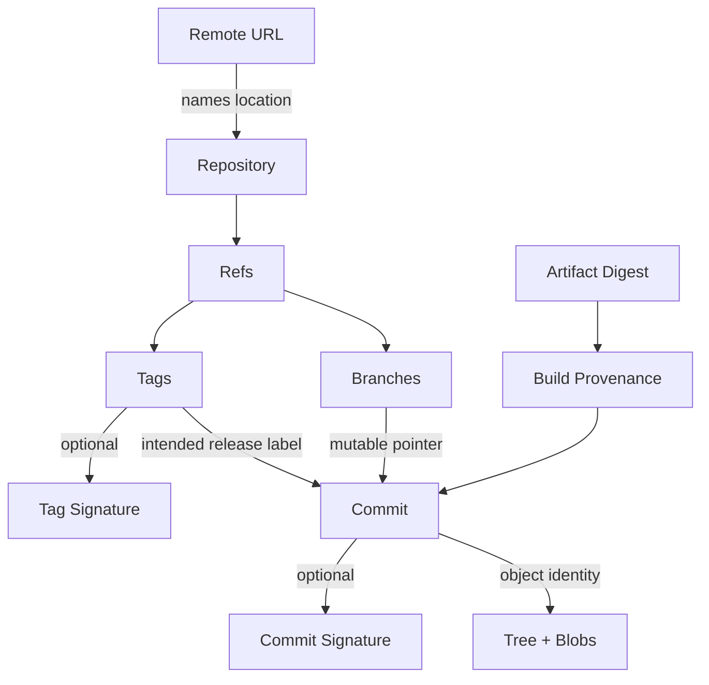
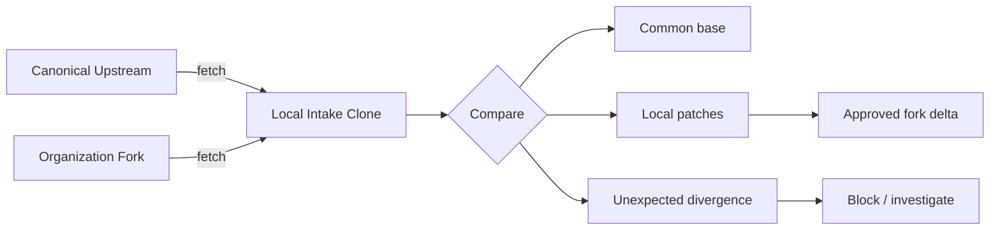
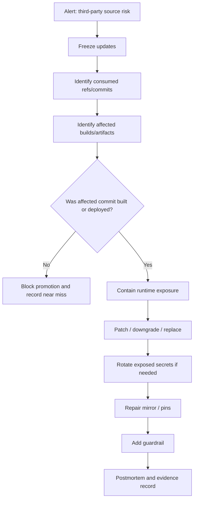

# Part 093 — Safe Use of Third-Party Repositories

A third-party Git repository is not just source code.

It is an external authority entering your engineering system.

That authority may influence:

- source code compiled into your product;
- build scripts executed in CI;
- GitHub Actions or workflow templates;
- submodules pulled recursively;
- generated artifacts checked into the repository;
- release tags used as build inputs;
- transitive dependencies declared by the repo;
- legal/license obligations;
- security assumptions inherited from another maintainer group.

The common beginner model is:

```text
Looks useful -> clone -> install -> build -> ship
```

The advanced engineering model is:

```text
Identify source -> verify provenance -> constrain execution -> pin identity -> mirror if needed -> review update -> record evidence -> monitor drift
```

This part is about using third-party Git repositories without turning your build and release process into a trust lottery.

---

## 1. Core Mental Model: Repository Name Is Not Provenance

A Git remote URL looks like a stable identity.

```text
https://github.com/org/project.git
```

But the URL is only a location/name.

It does not prove:

- who authored every commit;
- whether release tags are immutable;
- whether the repository was transferred or compromised;
- whether a tag was moved;
- whether the source matches published package artifacts;
- whether CI scripts are safe to execute;
- whether submodules point somewhere unexpected;
- whether the repository history was rewritten;
- whether the current `main` branch is the same code reviewed last week.

In Git, stable identity lives closer to object identity and signed/provenance evidence:



The URL is the weakest anchor.

A branch is a moving pointer.

A tag is culturally expected to be stable, but technically mutable unless protected or externally verified.

A commit hash is stronger, but it still does not prove intent, review, maintainer identity, artifact equivalence, or absence of malicious behavior.

The practical invariant is:

> Treat third-party repository intake as supply-chain onboarding, not as a casual clone.

---

## 2. Third-Party Repository Topologies

Not every external Git source enters your system the same way.

| Topology | Example | Main risk | Good use |
|---|---|---|---|
| Direct remote dependency | package manager pulls Git URL | mutable source | prototypes, low-risk tooling |
| Pinned Git dependency | dependency points to commit SHA | update friction | controlled source dependency |
| Fork | your org fork of upstream | fork drift | patching upstream while contributing back |
| Internal mirror | read-only mirror of external upstream | stale mirror / tag policy | enterprise control and availability |
| Vendored copy | code copied into repo | update debt | small stable dependency, audits |
| Submodule | superproject pins external commit | submodule checkout complexity | exact source pin with separate history |
| Subtree | external history merged under prefix | history bloat | operationally simple vendoring |
| Generated artifact | binary/source archive committed | provenance gap | rarely, only when reproducibility is handled |

The safest topology is not universal.

It depends on:

- dependency criticality;
- update frequency;
- build-time execution;
- maintainer trust;
- ability to audit source;
- license obligations;
- release reproducibility requirements;
- incident response cost.

---

## 3. Threat Model

Before choosing a workflow, define what you are defending against.

### 3.1 Mutable reference attack

A dependency references a branch or tag that later points to different code.

```text
lib.git#main
lib.git#v1.2.3
```

If your build resolves that ref at build time, two builds using the same dependency declaration may consume different source.

### 3.2 Tag move or tag replacement

A release tag is deleted and recreated.

Symptoms:

```bash
git ls-remote --tags https://example.com/lib.git v1.2.3
```

returns a different object ID than your previous evidence record.

### 3.3 Repository takeover or transfer

A repository owner, organization, domain, or hosting account changes control.

Your URL still resolves.

Your trust assumption changed.

### 3.4 Fork confusion

A fork looks like the canonical upstream.

Risk increases when names are similar:

```text
github.com/acme/security-lib
github.com/acme-security/security-lib
github.com/acrne/security-lib
```

### 3.5 Transitive Git execution

The repository contains scripts that your build executes:

- `build.sh`;
- `Makefile`;
- package lifecycle scripts;
- GitHub Actions workflows;
- Dockerfiles;
- code generators;
- install hooks;
- test setup scripts.

The risk is not only the source library.

The risk is what you run while consuming it.

### 3.6 Submodule URL pivot

A repository may contain `.gitmodules` pointing to other repositories.

```ini
[submodule "vendor/foo"]
  path = vendor/foo
  url = https://example.com/foo.git
```

Recursive clone/update can expand your trust boundary.

### 3.7 Binary and generated artifact opacity

A repository may contain binaries, generated code, minified JavaScript, model files, archives, or build outputs.

Git can store them.

Git does not prove they were generated from reviewed source.

### 3.8 History rewrite after review

You review commit `A`, but a branch later points to rewritten commit `B`.

If update automation tracks a branch, the review evidence no longer matches the source consumed.

---

## 4. Intake Rule: Never Start with Recursive Trust

The unsafe first command is often:

```bash
git clone --recursive https://example.com/vendor/project.git
cd project
./install.sh
```

A safer intake starts read-only and non-recursive:

```bash
mkdir intake-third-party
cd intake-third-party

git clone --no-recurse-submodules https://example.com/vendor/project.git project
cd project

git status --short --branch
git remote -v
git branch -vv
git tag --list | tail
```

Then inspect trust-expanding surfaces before executing anything:

```bash
find . -maxdepth 3 -type f \
  \( -name '.gitmodules' \
  -o -name 'package.json' \
  -o -name 'pom.xml' \
  -o -name 'build.gradle' \
  -o -name 'Makefile' \
  -o -name 'Dockerfile' \
  -o -name '*.sh' \
  -o -path './.github/workflows/*' \) \
  -print
```

For a high-risk repository, inspect without checkout execution side effects:

```bash
git ls-tree -r --name-only HEAD | sed -n '1,200p'
git ls-tree -r -l HEAD | sort -k4 -nr | head -50
```

Remember: Git hooks are not normally cloned as active hooks, but build tools and package managers often execute project-defined scripts.

The main danger is not Git executing hooks from a clone.

The main danger is the surrounding build ecosystem executing code from an untrusted repository.

---

## 5. Source Identity Record

Every accepted third-party repository should have a source identity record.

Minimum fields:

```yaml
name: example-lib
canonical_url: https://github.com/example/example-lib.git
selected_ref: v1.2.3
selected_commit: 7f3c2d9a...
commit_date: 2026-06-12T10:45:00Z
license: Apache-2.0
intake_decision: approved
approved_by:
  - platform-security
  - owning-team
risk_level: medium
submodules: false
contains_binaries: false
signed_tag_verified: true
artifact_equivalence_checked: partial
internal_mirror: ssh://git.internal/mirror/example/example-lib.git
last_reviewed: 2026-07-07
update_policy: monthly or security-driven
```

This is not bureaucracy for its own sake.

It solves operational questions later:

- Which exact source did we consume?
- Who approved it?
- Which commit was built?
- Did the tag move?
- Which internal mirror should CI use?
- What is the update cadence?
- Which teams must be notified during an incident?

---

## 6. Verify Remote and Selected Commit

Start with remote inspection.

```bash
git remote -v
git remote show origin
```

Check which refs exist remotely:

```bash
git ls-remote --heads origin
git ls-remote --tags origin
```

Resolve the selected ref to a commit object:

```bash
git fetch --tags origin

git rev-parse --verify v1.2.3^{commit}
git rev-parse --verify HEAD^{commit}
```

Record the resolved commit:

```bash
SELECTED_COMMIT=$(git rev-parse --verify v1.2.3^{commit})
echo "$SELECTED_COMMIT"
```

If using an annotated tag, inspect the tag object:

```bash
git cat-file -t v1.2.3
git show --no-patch --pretty=fuller v1.2.3
```

Verify signed tags/commits where the project publishes them:

```bash
git tag -v v1.2.3

git verify-commit "$SELECTED_COMMIT"
```

A failed signature check does not automatically mean malicious code.

It means you cannot use signature verification as evidence for that object.

Your policy must define whether that is acceptable for this risk tier.

---

## 7. Fork Validation

A fork is useful when you need local patches, emergency fixes, internal review, or contribution workflow.

But a fork can drift.

The fork validation model:



Set remotes explicitly:

```bash
git remote add upstream https://github.com/canonical/project.git
git remote add fork git@github.com:your-org/project.git

git fetch upstream --tags
git fetch fork --tags
```

Compare fork branch against upstream:

```bash
git log --oneline --decorate --graph upstream/main..fork/main

git range-diff upstream/main...fork/main
```

Check whether fork tags differ from upstream tags:

```bash
git ls-remote --tags upstream | sort > /tmp/upstream.tags
git ls-remote --tags fork | sort > /tmp/fork.tags

diff -u /tmp/upstream.tags /tmp/fork.tags || true
```

If your fork carries patches, each patch must have an owner and reason.

Bad fork delta:

```text
"We had some changes from last year; not sure why."
```

Acceptable fork delta:

```yaml
patches:
  - commit: 9c1a...
    reason: disable unsafe dynamic plugin loading in production profile
    owner: platform-security
    upstream_issue: https://example.com/issues/1234
    rebase_policy: re-evaluate on every upstream minor update
```

---

## 8. Internal Mirror Strategy

For production-critical third-party repositories, direct internet fetch from CI is often too weak.

An internal mirror gives you:

- availability control;
- ref update auditing;
- controlled promotion;
- protection against upstream deletion;
- repeatable CI access;
- place to enforce tag immutability;
- separation between intake and build.

Basic mirror creation:

```bash
git clone --mirror https://github.com/example/project.git project.git
cd project.git

git remote set-url --push origin DISABLED
```

Push to internal hosting:

```bash
git remote add internal ssh://git.internal/mirrors/example/project.git
git push --mirror internal
```

Mirror update should not be blind promotion.

Bad:

```bash
git fetch origin --prune
git push --mirror internal
```

Better:

```bash
git fetch origin --prune --tags

# snapshot ref state before promotion
git for-each-ref --format='%(refname) %(objectname)' refs/heads refs/tags \
  | sort > /tmp/new-ref-state.txt

# compare with last approved state
# investigate tag movement, branch rewrites, deleted refs

# promote only after checks pass
git push --mirror internal
```

For stricter environments, do not mirror all refs.

Promote only approved tags/commits:

```bash
git push internal \
  refs/tags/v1.2.3:refs/tags/v1.2.3 \
  "$SELECTED_COMMIT":refs/approved/example-lib/v1.2.3
```

This creates an internal approval namespace:

```text
refs/approved/example-lib/v1.2.3 -> selected commit
```

That namespace can be protected separately from raw upstream mirror refs.

---

## 9. Submodules and Third-Party Repositories

Submodules are exact commit pins, but they expand the trust graph.

Before recursive update:

```bash
cat .gitmodules

git config --file .gitmodules --get-regexp '^submodule\..*\.url$' || true
```

Check submodule commit recorded by the superproject:

```bash
git ls-tree HEAD path/to/submodule
```

Example output:

```text
160000 commit 3f2a9b... path/to/submodule
```

The recorded commit is precise.

The URL from which you fetch it is a trust decision.

Safe submodule intake checklist:

- inspect `.gitmodules` before update;
- disallow unknown protocols where possible;
- replace external URLs with internal mirror URLs;
- verify each recorded submodule commit exists in the approved mirror;
- avoid branch-tracking submodule updates for production builds;
- record submodule commit IDs in release evidence.

Use internal URL override:

```bash
git config submodule.vendor/foo.url ssh://git.internal/mirrors/vendor/foo.git

git submodule sync --recursive
git submodule update --init --recursive
```

---

## 10. GitHub Actions and Workflow Repository Risk

A repository can be consumed as source code, but it can also be consumed as automation.

Examples:

```yaml
uses: actions/checkout@v4
uses: some-org/some-action@main
uses: some-org/some-action@v1
uses: some-org/some-action@a1b2c3d4...
```

For critical pipelines, branch-based action references are weak.

Tag-based references are better for readability, but still mutable unless the source enforces tag protection and you verify movement.

Commit SHA references are strongest as Git object anchors.

A practical policy:

| Action source | Acceptable reference |
|---|---|
| official low-risk action | version tag, monitored |
| third-party marketplace action | full commit SHA |
| internal reusable workflow | protected tag or commit SHA |
| deployment/signing action | full commit SHA + review + provenance |
| unknown action | not allowed |

Audit workflow references:

```bash
grep -R "uses:" .github/workflows \
  | grep -E '@(main|master|latest|dev)$' || true
```

This is not only a Git issue.

It is a CI/CD supply-chain issue.

But Git references are the source of many weak anchors.

---

## 11. Vendoring Decision Framework

Vendoring means bringing third-party code into your own repository.

It can improve availability and reviewability.

It can also create update debt and blur authorship.

Use vendoring when:

- the dependency is small;
- update frequency is low;
- source review matters more than upstream history fidelity;
- build systems cannot fetch network dependencies;
- compliance needs source included in release archive;
- internal patches are expected.

Avoid vendoring when:

- dependency is large or binary-heavy;
- upstream changes frequently;
- transitive dependency ecosystem is complex;
- package manager lockfile already solves deterministic resolution;
- license obligations become harder to track;
- you cannot maintain update discipline.

Vendor import commit should be explicit:

```text
vendor: import example-lib v1.2.3

Source: https://github.com/example/example-lib.git
Tag: v1.2.3
Commit: 7f3c2d9a...
License: Apache-2.0
Verification: signed tag verified with key fingerprint ABCD...
Local changes: none
```

Local patch commit should be separate:

```text
vendor: patch example-lib unsafe default timeout

Reason: production request timeout must not exceed gateway limit.
Upstream issue: https://github.com/example/example-lib/issues/456
Patch-owner: platform-runtime
```

Do not mix vendor import and local patch in one commit.

That destroys reviewability.

---

## 12. Binary and Generated Content Intake

A third-party repository containing large binaries or generated artifacts needs special handling.

Find large objects in current tree:

```bash
git ls-tree -r -l HEAD \
  | sort -k4 -nr \
  | head -50
```

Find large blobs in history:

```bash
git rev-list --objects --all \
  | git cat-file --batch-check='%(objecttype) %(objectname) %(objectsize) %(rest)' \
  | awk '$1 == "blob" { print $3, $2, substr($0, index($0,$4)) }' \
  | sort -nr \
  | head -50
```

Classify:

| Content | Git risk | Action |
|---|---|---|
| source code | normal | review |
| generated source | review opacity | require generator/provenance |
| minified JS | hidden behavior | prefer source + reproducible build |
| binary library | high opacity | artifact repository or verified release |
| model/data file | size + provenance | artifact/object storage |
| archive file | nested opacity | unpack/scan or reject |
| executable script | execution risk | review before running |

If you cannot explain how a binary artifact was produced, do not treat the Git repository as sufficient evidence.

---

## 13. Update Protocol

Third-party updates should be controlled as changes to production input.

A strong update PR includes:

```yaml
from:
  ref: v1.2.2
  commit: abc111...
to:
  ref: v1.2.3
  commit: def222...
verification:
  signed_tag: true
  tag_movement_checked: true
  changelog_reviewed: true
  license_changed: false
  submodule_changed: false
  binaries_changed: false
  ci_workflows_changed: true
risk:
  security_sensitive: true
  requires_platform_security_review: true
```

Git commands:

```bash
OLD=abc111
NEW=def222

git diff --stat "$OLD" "$NEW"
git diff --name-status "$OLD" "$NEW"
git log --oneline --decorate "$OLD..$NEW"

git diff "$OLD" "$NEW" -- .github/workflows
git diff "$OLD" "$NEW" -- '**/Dockerfile' '**/*.sh'
git diff "$OLD" "$NEW" -- package.json package-lock.json pnpm-lock.yaml yarn.lock pom.xml build.gradle
```

Check sensitive path movement:

```bash
git diff --name-only "$OLD" "$NEW" \
  | grep -E '(^\.github/workflows/|Dockerfile$|\.sh$|lock$|pom\.xml$|build\.gradle$|auth|crypto|security|deploy)' \
  || true
```

The update PR should answer:

- What changed?
- Why are we updating?
- Is this security-driven?
- Did executable build/deploy code change?
- Did license terms change?
- Did binary/generated content change?
- Did submodules change?
- Was selected tag/commit verified?
- What rollback is available?

---

## 14. Third-Party Repository Incident Playbook

Trigger examples:

- upstream repository compromised;
- maintainer account compromised;
- release tag moved;
- malicious commit discovered;
- package artifact does not match source;
- dependency points to branch and now resolves differently;
- internal mirror accidentally promoted bad ref.

Playbook:



Find where a commit is used:

```bash
BAD=deadbeef...

git branch --contains "$BAD" --all
git tag --contains "$BAD"
git for-each-ref --contains="$BAD" --format='%(refname)'
```

Search dependency manifests:

```bash
grep -R "$BAD" . || true
grep -R "github.com/example/project" . || true
```

If tags moved, compare stored evidence with current remote:

```bash
git ls-remote --tags https://github.com/example/project.git v1.2.3
```

If internal mirror promoted the bad ref, preserve evidence before repair:

```bash
git for-each-ref --format='%(refname) %(objectname)' > incident-ref-state.txt

git show --no-patch --pretty=fuller "$BAD" > incident-bad-commit.txt
```

---

## 15. Policy Matrix

Not all third-party repositories need the same strictness.

| Risk tier | Example | Required controls |
|---|---|---|
| low | docs theme, dev-only utility | tag or version pin, license check |
| medium | build plugin, codegen tool | commit pin, update PR, CI review |
| high | runtime library, auth/security library | commit pin, signed/provenance check if available, security review |
| critical | deployment action, signing tool, compiler/plugin | internal mirror, commit pin, restricted updates, explicit approval, evidence record |

A useful rule:

> The more a repository can affect production behavior without human review, the stronger its Git identity and approval controls must be.

---

## 16. Practical Intake Checklist

Before accepting a third-party repository:

- [ ] canonical upstream identified;
- [ ] license reviewed;
- [ ] selected ref resolved to commit SHA;
- [ ] tag movement risk assessed;
- [ ] signed tag/commit verified where available;
- [ ] submodules inspected;
- [ ] CI/workflow files inspected;
- [ ] executable scripts inspected;
- [ ] large/binary/generated files inspected;
- [ ] dependency manifests reviewed;
- [ ] internal mirror decision made;
- [ ] update cadence defined;
- [ ] owner assigned;
- [ ] rollback plan documented;
- [ ] evidence stored.

---

## 17. Example: Safe Third-Party Intake Script

This is not a complete security scanner.

It is a deterministic first-pass snapshot.

```bash
#!/usr/bin/env bash
set -euo pipefail

repo_url="${1:?repo url required}"
ref="${2:-HEAD}"
workdir="${3:-third-party-intake}"

rm -rf "$workdir"
git clone --no-recurse-submodules "$repo_url" "$workdir"
cd "$workdir"

git fetch --tags origin
commit=$(git rev-parse --verify "${ref}^{commit}")

echo "repo_url: $repo_url"
echo "selected_ref: $ref"
echo "selected_commit: $commit"
echo "head_short: $(git rev-parse --short HEAD)"
echo

echo "== remotes =="
git remote -v

echo
 echo "== selected commit =="
git show --no-patch --pretty=fuller "$commit"

echo
 echo "== submodules =="
if [ -f .gitmodules ]; then
  cat .gitmodules
else
  echo "none"
fi

echo
 echo "== largest files in tree =="
git ls-tree -r -l "$commit" | sort -k4 -nr | head -20

echo
 echo "== potentially sensitive files =="
git ls-tree -r --name-only "$commit" \
  | grep -E '(^\.github/workflows/|Dockerfile$|\.sh$|package(-lock)?\.json$|pnpm-lock\.yaml$|yarn\.lock$|pom\.xml$|build\.gradle$|\.gitmodules$)' \
  || true

echo
 echo "== recent tags =="
git tag --sort=-creatordate | head -20
```

Use the output as an intake artifact.

Do not mistake it for approval.

---

## 18. Common Failure Modes

### 18.1 “We pinned to a tag, so we are safe”

A tag can move unless protected and monitored.

Record the peeled commit SHA.

### 18.2 “The repo is popular, so it is safe”

Popularity is not provenance.

Popular repositories can be compromised, transferred, or misused.

### 18.3 “We use a fork, so we control it”

A fork can silently drift or accumulate unowned patches.

Control requires review and explicit fork delta records.

### 18.4 “CI fetched the same branch name”

A branch name is not a stable build input.

Use commit identity in release records.

### 18.5 “It passed tests”

Tests validate expected behavior.

They do not prove source integrity, license compliance, or absence of malicious build scripts.

### 18.6 “We mirrored upstream, so we are safe”

A blind mirror replicates upstream compromise into your perimeter.

A promoted mirror adds control only if it has policy, review, and audit.

---

## 19. Engineering Heuristics

Use these rules in real systems:

1. Never consume production source from a moving branch.
2. Record commit SHA even when humans discuss version tags.
3. Treat recursive submodules as trust expansion.
4. Treat workflow/action repositories as code execution dependencies.
5. Do not run unknown build scripts during initial intake.
6. Use internal mirrors for critical dependencies.
7. Separate vendor import from local vendor patch.
8. Require stronger controls for dependencies that affect build, deploy, auth, crypto, or data access.
9. Store evidence before fixing incidents.
10. Design update workflow before the first emergency update.

---

## 20. References

- Git documentation: `git remote`, `git ls-remote`, `git rev-parse`, `git tag`, `git verify-commit`, `git submodule`, `git diff`, `git log`.
- Pro Git: Working with Remotes; Git Internals; Signing Your Work.
- GitHub Docs: About remote repositories; managing branch protection; immutable releases; removing sensitive data from a repository.
- SLSA: Provenance model for describing how artifacts were produced.
- Git LFS documentation: pointer-file model and large object storage.

---

## 21. Summary

Third-party Git repositories are not just code locations.

They are external trust roots.

Safe usage requires separating:

- URL from identity;
- branch/tag name from commit object;
- source code from executable build behavior;
- upstream repository from internal approval;
- mirror replication from mirror promotion;
- popularity from provenance;
- passing tests from supply-chain integrity.

The professional workflow is not “clone and hope.”

It is:

```text
inspect -> verify -> pin -> mirror/promote -> review -> build -> record -> monitor
```
