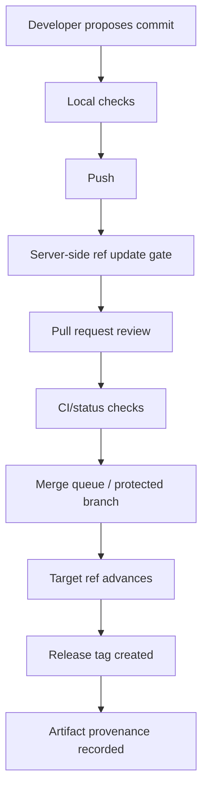
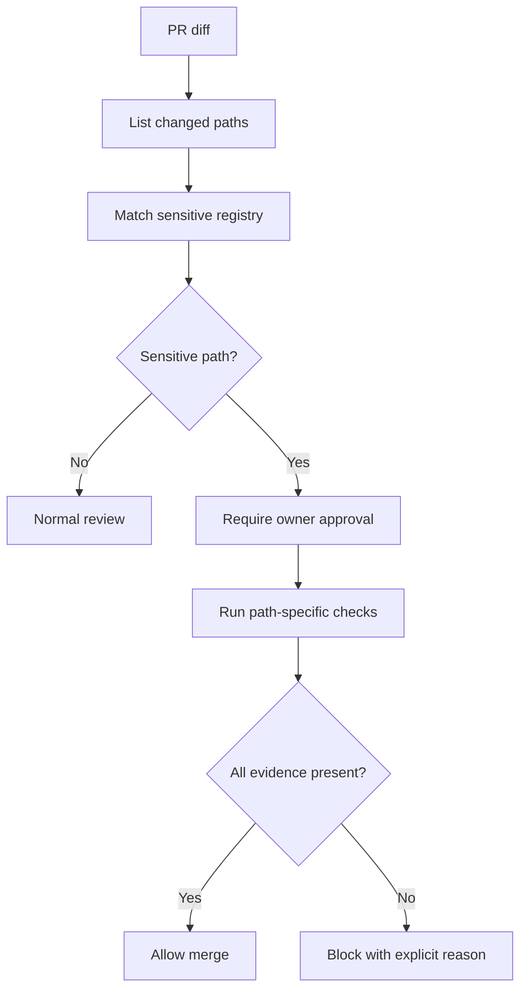
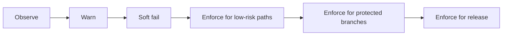
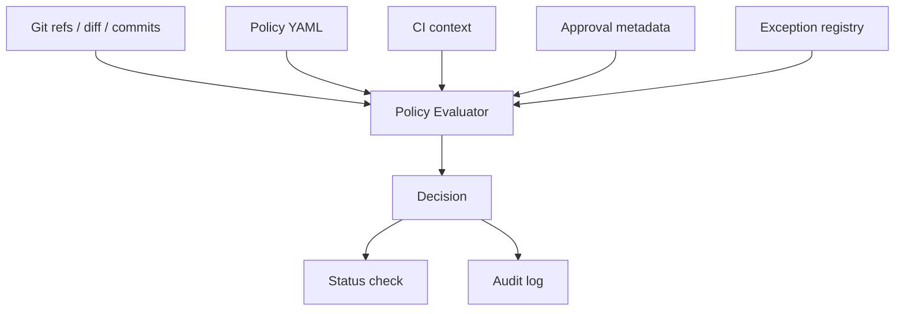

# Part 094 — Git Policy as Code

A Git workflow policy that only exists in a wiki is a suggestion.

A Git workflow policy encoded into checks, hooks, protected refs, rulesets, and release gates becomes part of the engineering system.

This is policy as code in the Git layer.

Not because every rule should be automated.

Not because automation replaces judgment.

But because high-value invariants should not depend on everyone remembering them during pressure.

Examples:

- production release tags must not move;
- `main` must only advance through reviewed PRs;
- release branches require passing release tests;
- sensitive paths require domain owners;
- commits must include traceability trailers;
- generated artifacts must be generated by CI, not handwritten;
- GitHub Actions must not reference third-party actions by `@main`;
- large binaries must not enter Git history;
- deployment manifests must not change without platform approval;
- emergency bypasses must create audit evidence.

The goal is not more rules.

The goal is executable invariants.

---

## 1. Core Mental Model: Git Policy Is Ref Mutation Control

Most meaningful Git policy is about controlling how refs move.



A repository is a database of objects.

Refs are named pointers into that database.

Policy decides which object IDs refs are allowed to point to, under which evidence.

That means policy must reason about:

- who is moving the ref;
- which ref is moving;
- old object ID;
- new object ID;
- commits introduced by the movement;
- files changed by those commits;
- signatures and authorship;
- review approvals;
- CI results;
- release metadata;
- exception records.

---

## 2. Policy Layers

No single layer is enough.

| Layer | Examples | Strength | Weakness |
|---|---|---|---|
| Local config | aliases, templates, default pull mode | improves daily safety | not enforceable |
| Client hooks | `pre-commit`, `commit-msg`, `pre-push` | fast feedback | bypassable |
| Server hooks | `pre-receive`, `update` | authoritative on self-hosted Git | platform-specific availability |
| Hosting rules | branch protection, rulesets, required reviews | strong collaboration control | depends on provider features |
| CI checks | tests, policy scanners, provenance checks | rich validation | may run after push/PR, can be slow |
| Merge queue | validates integration result | prevents stale green PR race | platform/process coupling |
| Release gate | tag/artifact/provenance verification | protects production | needs disciplined release process |
| Audit process | exception records, approvals | handles real-world complexity | manual burden |

A mature system composes layers.

Client hooks provide fast feedback.

Server/hosting policies enforce critical invariants.

CI validates expensive semantic rules.

Release gates protect artifact promotion.

Audit records handle exceptions.

---

## 3. Policy Taxonomy

Git policy can be grouped by what it protects.

### 3.1 Ref policy

Controls which refs may move and how.

Examples:

- `main` only moves via merge queue;
- release branches require PR;
- tags under `v*` are immutable;
- force push disabled except temporary integration branches;
- branch deletion restricted;
- protected namespaces for approved third-party sources.

### 3.2 Commit policy

Controls properties of introduced commits.

Examples:

- signed commits required for release branch;
- author email must belong to allowed domain;
- commit message requires issue reference;
- security-sensitive commits require trailer;
- merge commits forbidden or required depending on branch.

### 3.3 File/path policy

Controls sensitive surfaces.

Examples:

- `.github/workflows/**` requires platform-security approval;
- `infra/**` requires platform owner;
- `auth/**` requires security owner;
- database migration files require migration review;
- generated files must match generator output;
- large files over threshold blocked.

### 3.4 Dependency policy

Controls external trust inputs.

Examples:

- Git dependencies must pin commit SHA;
- GitHub Actions cannot use `@main` or `@master`;
- submodule URLs must point to internal mirrors;
- dependency updates require manifest diff and owner review;
- lockfile changes must accompany dependency manifest changes.

### 3.5 Release policy

Controls release identity.

Examples:

- release tag must be annotated and signed;
- release tag must point to commit already on protected release branch;
- artifact must embed commit SHA;
- provenance must reference source commit;
- retagging is forbidden after publication;
- rollback requires new corrective release, not moved tag.

---

## 4. Policy as Invariants

Weak policy wording:

```text
Please do not force push main.
```

Executable invariant:

```text
For refs/heads/main, reject any non-fast-forward update.
```

Weak policy wording:

```text
Use good commit messages.
```

Executable invariant:

```text
Every commit merged to release/* must contain one of:
- Issue: ABC-123
- Incident: INC-123
- Change-Type: docs|fix|feature|migration|security|config
```

Weak policy wording:

```text
Do not use unsafe GitHub Actions.
```

Executable invariant:

```text
No workflow file may contain `uses: <third-party>/<action>@main` or `@master`; high-risk actions must be pinned to full commit SHA.
```

A good invariant has four properties:

1. It is observable from repository state or CI context.
2. It is deterministic enough to evaluate repeatedly.
3. It has a clear failure message.
4. It has an exception path with evidence.

---

## 5. Client-Side Hooks: Fast Feedback, Not Authority

Client-side hooks are useful because they fail early.

They are not sufficient enforcement because developers can bypass them, misconfigure them, or not install them.

Useful client hooks:

| Hook | Good use | Avoid using for |
|---|---|---|
| `pre-commit` | formatting, lint on staged files, secret pre-scan | final security control |
| `prepare-commit-msg` | template insertion | blocking policy |
| `commit-msg` | message format/trailers | organization-wide final enforcement |
| `pre-push` | prevent pushing wrong branch, run quick tests | expensive CI replacement |

Example `commit-msg` hook for traceability:

```bash
#!/usr/bin/env bash
set -euo pipefail

msg_file="$1"

if grep -Eq '^(Issue|Incident|Change-Type): ' "$msg_file"; then
  exit 0
fi

cat >&2 <<'MSG'
Commit message must include at least one trailer:

  Issue: ABC-123
  Incident: INC-123
  Change-Type: fix|feature|migration|security|config|docs
MSG

exit 1
```

Example `pre-push` guard against accidental `main` push:

```bash
#!/usr/bin/env bash
set -euo pipefail

while read -r local_ref local_sha remote_ref remote_sha; do
  case "$remote_ref" in
    refs/heads/main|refs/heads/master)
      echo "Direct push to $remote_ref is blocked. Use PR/merge queue." >&2
      exit 1
      ;;
  esac
done
```

Distribute hooks with `core.hooksPath`:

```bash
git config core.hooksPath .githooks
```

But remember: this is feedback.

Critical policy must be enforced server-side or by hosting rules.

---

## 6. Server-Side Hooks: Ref Update Gate

Server-side hooks receive proposed ref updates and can reject them.

The most important hooks are:

- `pre-receive`: reads all proposed updates from stdin;
- `update`: called once per ref;
- `post-receive`: notification/audit after accepted updates.

A `pre-receive` hook sees lines like:

```text
<old-oid> <new-oid> <refname>
```

Example: reject non-fast-forward updates to protected branches.

```bash
#!/usr/bin/env bash
set -euo pipefail

zero="0000000000000000000000000000000000000000"

while read -r old new ref; do
  case "$ref" in
    refs/heads/main|refs/heads/release/*)
      if [ "$old" = "$zero" ]; then
        echo "Creating protected branch $ref is not allowed via direct push" >&2
        exit 1
      fi

      if [ "$new" = "$zero" ]; then
        echo "Deleting protected branch $ref is not allowed" >&2
        exit 1
      fi

      if ! git merge-base --is-ancestor "$old" "$new"; then
        echo "Non-fast-forward update to $ref is rejected" >&2
        exit 1
      fi
      ;;
  esac
done
```

Example: reject mutable release tags.

```bash
#!/usr/bin/env bash
set -euo pipefail

zero="0000000000000000000000000000000000000000"

while read -r old new ref; do
  case "$ref" in
    refs/tags/v*)
      if [ "$old" != "$zero" ] && [ "$new" != "$zero" ]; then
        echo "Release tag update rejected: $ref is immutable" >&2
        exit 1
      fi

      if [ "$old" != "$zero" ] && [ "$new" = "$zero" ]; then
        echo "Release tag deletion rejected: $ref is immutable" >&2
        exit 1
      fi
      ;;
  esac
done
```

Server hooks are powerful, but they come with operational responsibilities:

- test hooks before rollout;
- keep failure messages actionable;
- avoid network calls inside hot path if possible;
- log decisions;
- create emergency bypass procedure;
- version hooks like production code.

---

## 7. Hosting Rules and Rulesets

Hosted Git platforms provide policy primitives such as:

- protected branches;
- required status checks;
- required reviews;
- CODEOWNERS review;
- signed commit requirement;
- linear history requirement;
- merge queue;
- tag protection or rulesets;
- bypass actors;
- push restrictions.

These controls are usually preferable to custom hooks when they cover the invariant.

Why?

- they integrate with PR review UI;
- they are visible to contributors;
- they are supported by platform audit logs;
- they are less fragile than custom shell scripts;
- they can compose with CI checks.

But they are not magic.

You still need policy design.

Bad setup:

```text
main requires one approval and CI green.
```

Better setup:

```text
main:
  direct push: disabled
  force push: disabled
  deletion: disabled
  required checks:
    - unit-test
    - integration-test
    - policy/git
    - security/secret-scan
  required reviews: 2
  stale review dismissal: enabled
  code owner review: enabled
  merge queue: enabled
  bypass: limited to release-admin group with audit issue required
```

For critical repos, document who can bypass and under what incident class.

An unrestricted admin bypass is not a policy.

It is a hidden root account.

---

## 8. CI as Policy Evaluator

CI is the right layer for expensive or semantic checks.

Examples:

- dependency policy;
- generated-code verification;
- lockfile consistency;
- migration safety;
- secret scanning;
- license scanning;
- code owner matrix beyond platform CODEOWNERS;
- release note completeness;
- workflow/action pinning;
- artifact provenance verification.

A CI policy check should be deterministic and scoped.

Example GitHub Actions pinning check:

```bash
#!/usr/bin/env bash
set -euo pipefail

bad=0

while IFS=: read -r file line content; do
  ref=$(printf '%s\n' "$content" | sed -nE 's/.*uses:[[:space:]]*[^@]+@([^[:space:]]+).*/\1/p')
  [ -z "$ref" ] && continue

  case "$ref" in
    main|master|latest|dev)
      echo "$file:$line: action reference @$ref is not allowed" >&2
      bad=1
      ;;
  esac

done < <(grep -RInE 'uses:[[:space:]]*[^@]+@(main|master|latest|dev)' .github/workflows || true)

exit "$bad"
```

Example large-file guard:

```bash
#!/usr/bin/env bash
set -euo pipefail

limit=$((5 * 1024 * 1024))
base="${BASE_REF:-origin/main}"
head="${HEAD_REF:-HEAD}"

bad=0

while read -r status path; do
  [ ! -f "$path" ] && continue
  size=$(wc -c < "$path")
  if [ "$size" -gt "$limit" ]; then
    echo "$path is $size bytes; exceeds $limit. Use artifact storage or Git LFS policy." >&2
    bad=1
  fi
done < <(git diff --name-status "$base...$head" | awk '$1 != "D" { print $1, $2 }')

exit "$bad"
```

Example generated-code verification:

```bash
#!/usr/bin/env bash
set -euo pipefail

./scripts/generate.sh

if ! git diff --exit-code -- generated/; then
  echo "Generated files are stale. Run ./scripts/generate.sh and commit the result." >&2
  exit 1
fi
```

---

## 9. Sensitive Path Policy

Path-based policy is where Git meets domain ownership.

Example sensitive path registry:

```yaml
paths:
  - pattern: ".github/workflows/**"
    owners:
      - platform-security
    risk: ci-cd-control-plane
    required_checks:
      - policy/workflow-pinning

  - pattern: "infra/**"
    owners:
      - platform-runtime
    risk: infrastructure

  - pattern: "src/main/java/**/auth/**"
    owners:
      - security-engineering
    risk: authorization

  - pattern: "db/migrations/**"
    owners:
      - data-platform
    risk: irreversible-data-change
```

Policy evaluation flow:



Command to list changed paths in PR-style comparison:

```bash
git diff --name-only origin/main...HEAD
```

Command to identify commits touching sensitive path:

```bash
git log --oneline -- src/main/java/com/acme/auth
```

Path policy should not only say “who owns this.”

It should say “what risk does this path represent.”

Ownership without risk classification turns into reviewer routing bureaucracy.

---

## 10. Commit Message and Trailer Policy

Commit trailers make history queryable.

Examples:

```text
Change-Type: security
Issue: SEC-1842
Risk: authorization-bypass
Reviewed-By: security-engineering
```

Use trailers for structured metadata that must survive outside PR UI.

Good trailer candidates:

- issue or incident ID;
- change type;
- migration ID;
- security review marker;
- release note marker;
- breaking-change marker;
- co-authorship;
- sign-off where required.

Do not overload commit messages with fields better represented in build provenance or deployment metadata.

Example policy check:

```bash
#!/usr/bin/env bash
set -euo pipefail

base="${BASE_REF:-origin/main}"
range="$base..HEAD"

bad=0

for commit in $(git rev-list "$range"); do
  msg=$(git log -1 --format=%B "$commit")

  if ! grep -Eq '^(Issue|Incident): [A-Z]+-[0-9]+' <<<"$msg"; then
    echo "$(git rev-parse --short $commit): missing Issue or Incident trailer" >&2
    bad=1
  fi

done

exit "$bad"
```

Policy should account for merge/squash strategy.

If the team squash-merges PRs, commit-level trailers on intermediate commits may be lost.

Then enforce metadata on PR title/body or squash commit message instead.

---

## 11. Release Policy as Code

Release policy must protect the chain:

```text
source commit -> release tag -> build artifact -> deployment record
```

Example release gate:

```bash
#!/usr/bin/env bash
set -euo pipefail

tag="${1:?tag required}"

# Tag must exist and resolve to a commit.
commit=$(git rev-parse --verify "$tag^{commit}")

# Tag must be annotated.
if [ "$(git cat-file -t "$tag")" != "tag" ]; then
  echo "$tag is not an annotated tag" >&2
  exit 1
fi

# Tag signature must verify where signing policy is required.
git tag -v "$tag"

# Commit must be reachable from protected release branch.
if ! git merge-base --is-ancestor "$commit" origin/release/current; then
  echo "$tag commit is not reachable from origin/release/current" >&2
  exit 1
fi

# Working tree must be clean.
git diff --quiet
git diff --cached --quiet

# Artifact metadata must embed exact commit.
./gradlew build
./scripts/assert-artifact-metadata.sh "$commit"
```

The point is not the exact script.

The point is that release identity should be checked mechanically.

A release manager should not need to visually inspect ten moving pieces under pressure.

---

## 12. Exception Handling

Every real system needs exceptions.

But exceptions must be explicit, time-bounded, and auditable.

Bad exception:

```text
Admin force pushed because release was urgent.
```

Acceptable exception:

```yaml
exception_id: GIT-EXC-2026-071
repo: enforcement-platform
ref: refs/heads/release/2026.07
requested_by: release-manager
approved_by:
  - engineering-director
  - security-lead
reason: restore release branch to previously approved commit after accidental tag promotion
old_oid: abc111...
new_oid: def222...
time_window: 2026-07-07T09:00:00+07:00/2026-07-07T10:00:00+07:00
post_action:
  - compare ref state
  - rerun release gate
  - revoke bypass permission
  - postmortem
```

Exception design rule:

> If a bypass is necessary, the bypass itself becomes an event that must produce evidence.

---

## 13. Policy Rollout Model

Do not turn on strict Git policy globally in one shot.

Roll it out like production infrastructure.



### 13.1 Observe

Run checks and collect violations without blocking.

Output:

```text
policy/workflow-pinning: 14 branch-pinned actions found
policy/large-files: 3 files over threshold
policy/commit-message: 22 commits missing Issue trailer
```

### 13.2 Warn

Comment on PRs or print warnings in CI.

No blocking yet.

### 13.3 Soft fail

Allow override with explicit label or approval.

### 13.4 Enforce

Block merges to protected refs.

### 13.5 Release enforce

Apply strongest checks before tags/artifacts are published.

This staged rollout prevents policy from becoming a productivity incident.

---

## 14. Policy Repository Pattern

For many teams, policy should live in a dedicated repository.

Example layout:

```text
engineering-policy/
  git/
    branch-rules.yaml
    tag-rules.yaml
    sensitive-paths.yaml
    commit-message.yaml
    dependency-rules.yaml
  hooks/
    commit-msg
    pre-push
    pre-receive
  ci/
    check-workflow-pins.sh
    check-large-files.sh
    check-release-tag.sh
  docs/
    exception-process.md
    rollout-guide.md
```

Application repositories consume policy as a versioned dependency:

```yaml
policy_version: git-policy-v2026.07.0
```

Why version policy?

Because policy changes are production changes.

A policy update can block releases, alter developer workflow, or change audit evidence.

Versioning lets teams answer:

- which policy version applied to this release?
- when did enforcement change?
- which repositories are behind?
- did the incident occur before or after the guardrail existed?

---

## 15. Policy Engine Architecture

A general Git policy engine can be simple.

Input:

- base ref;
- head ref;
- old/new ref OIDs;
- changed files;
- introduced commits;
- commit messages;
- tag metadata;
- CI context;
- approvals from hosting API;
- exception record.

Output:

- pass/fail;
- rule ID;
- message;
- remediation;
- evidence.



A small evaluator can be written in Bash, Python, Go, or Node.

For organization-wide policy, prefer a testable language and structured output.

Example structured violation:

```json
{
  "rule": "git.workflow.action-ref-no-moving-branch",
  "severity": "high",
  "file": ".github/workflows/release.yml",
  "line": 22,
  "message": "Third-party action is pinned to @main. Pin to a full commit SHA.",
  "remediation": "Replace @main with reviewed commit SHA and add update evidence."
}
```

---

## 16. Rego-Style Policy Example

Some organizations use policy engines like OPA/Rego.

Example concept:

```rego
package git.policy

deny[msg] {
  file := input.changed_files[_]
  startswith(file.path, ".github/workflows/")
  not input.approvals["platform-security"]
  msg := sprintf("%s requires platform-security approval", [file.path])
}

deny[msg] {
  action := input.github_actions[_]
  action.ref == "main"
  msg := sprintf("%s uses moving branch @main", [action.file])
}

deny[msg] {
  input.ref.name == "refs/heads/main"
  input.ref.non_fast_forward
  msg := "main rejects non-fast-forward updates"
}
```

The policy language matters less than the discipline:

- explicit input model;
- deterministic evaluation;
- test cases;
- versioned policy;
- actionable failure messages.

---

## 17. Testing Git Policy

Policy code needs tests.

Test fixtures can be miniature repositories.

Example test cases:

| Case | Expected |
|---|---|
| PR changes `src/foo.java` only | pass normal policy |
| PR changes `.github/workflows/release.yml` without security approval | fail |
| release tag is lightweight | fail |
| release tag annotated and signed | pass |
| action uses `@main` | fail |
| action pinned to SHA | pass |
| commit missing issue trailer | fail for release branch |
| branch update is non-fast-forward | fail for protected branch |

Use throwaway repos:

```bash
rm -rf /tmp/policy-test
mkdir /tmp/policy-test
cd /tmp/policy-test

git init
git config user.name "Policy Test"
git config user.email "policy@example.com"

echo ok > README.md
git add README.md
git commit -m "Initial commit

Issue: TEST-1"
```

A policy that is not tested will eventually block the wrong thing or allow the wrong thing.

---

## 18. Failure Modes

### 18.1 Policy exists only in docs

People forget under pressure.

Automate high-value invariants.

### 18.2 Client hooks treated as enforcement

Client hooks are bypassable.

Use them for feedback, not final control.

### 18.3 No exception path

If legitimate emergencies have no path, people will create unofficial bypasses.

### 18.4 Too much policy too early

Overly strict policy creates local workarounds and cultural rejection.

Start with audit/warn.

### 18.5 False positives without remediation

A failed check must tell the developer exactly what to do.

Bad:

```text
Policy failed.
```

Good:

```text
.github/workflows/deploy.yml uses third-party action foo/bar@main.
Pin foo/bar to a reviewed full commit SHA.
```

### 18.6 Platform-only policy with no portability plan

Hosted rules are useful, but document their semantics.

If you migrate hosting providers, you need to recreate equivalent controls.

### 18.7 Admin bypass invisible to audit

Bypass is sometimes necessary.

Invisible bypass is governance failure.

### 18.8 Policy not connected to risk

Rules without risk rationale become ceremony.

Every strict rule should map to a failure mode.

---

## 19. Git Policy for Regulated Systems

Regulated software does not merely need correctness.

It needs defensibility.

Git policy helps create defensible evidence:

- who proposed the change;
- what changed;
- who reviewed it;
- which checks passed;
- which commit was released;
- which tag identified the release;
- whether that tag was signed;
- which artifact was built;
- which exception was used;
- why a bypass was justified;
- how rollback was performed.

Policy as code should produce artifacts:

```text
release-evidence/
  source-commit.txt
  tag-verification.txt
  diff-summary.txt
  required-checks.json
  approvals.json
  dependency-update-report.json
  artifact-digests.txt
  provenance.json
  exception-record.yaml
```

The point is not to make Git look compliant.

The point is to ensure the enforcement lifecycle can be reconstructed later.

---

## 20. Practical Git Policy Baseline

For a serious engineering organization, a reasonable baseline is:

### Branches

- `main` protected;
- no direct push;
- no force push;
- required CI;
- required review;
- stale approvals dismissed;
- CODEOWNERS enabled for sensitive paths;
- merge queue for high-concurrency repositories.

### Tags

- release tags protected;
- release tags annotated;
- signed release tags for high-risk systems;
- no tag movement after publication;
- tag creation restricted.

### Commits

- issue/incident traceability required for release branches;
- signed commits where identity assurance is required;
- merge strategy standardized.

### Files

- `.github/workflows/**` requires platform/security review;
- infra/deploy/auth/db migration paths require owner approval;
- large binary guardrail;
- generated file verification;
- secret scanning.

### Dependencies

- no branch-pinned third-party actions in critical workflows;
- Git dependencies pinned to commit SHA for production builds;
- submodule URLs use approved mirrors;
- dependency updates require diff summary.

### Release

- artifact embeds commit SHA;
- release gate verifies tag -> commit -> artifact;
- provenance/evidence stored;
- rollback strategy documented.

---

## 21. Summary

Git policy as code turns workflow standards into executable controls.

But the key is not automation for automation's sake.

The key is identifying invariants that protect:

- branch integrity;
- release identity;
- source provenance;
- sensitive ownership;
- dependency trust;
- review correctness;
- incident recovery;
- audit defensibility.

Use the right layer:

```text
local hooks     -> fast feedback
server hooks    -> authoritative ref gates
hosting rules   -> collaboration control
CI checks       -> semantic validation
release gates   -> production identity
exceptions      -> controlled human override
```

A top-tier Git workflow is not defined by how many rules it has.

It is defined by whether the important failure modes are impossible, visible, or recoverable.
