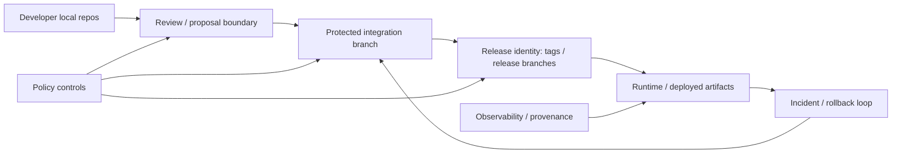
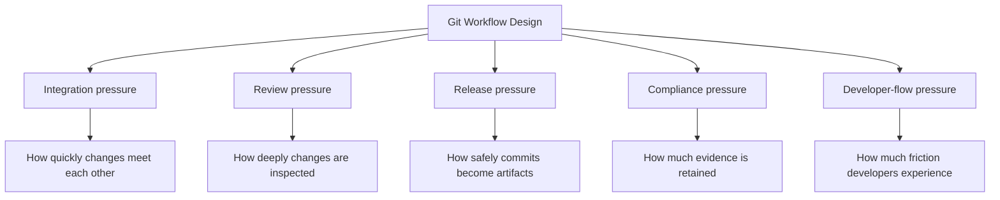
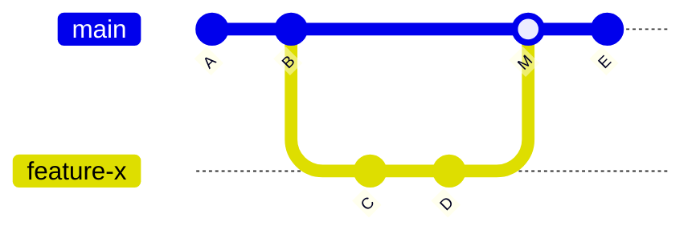
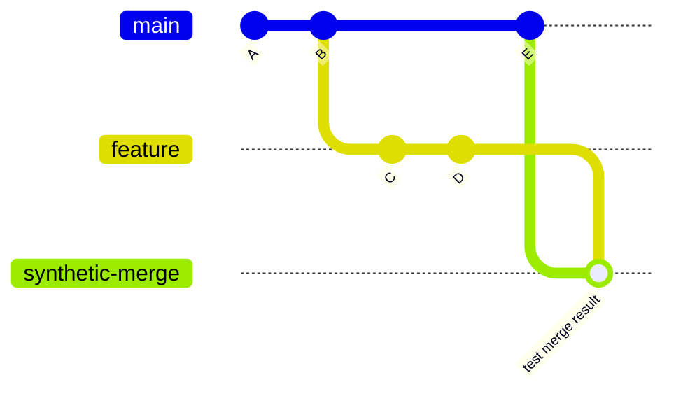
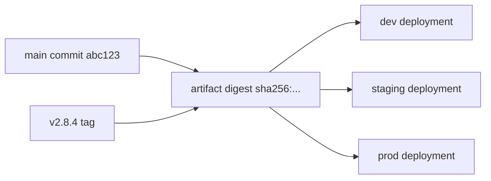
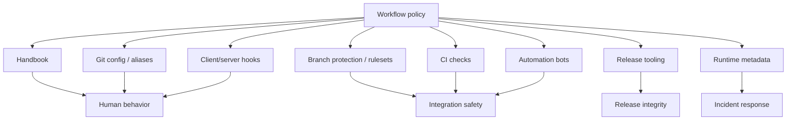
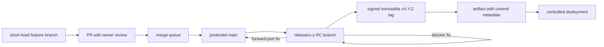

# Part 095 — Designing Team Git Workflows

A team Git workflow is not a diagram of branches.

It is a **coordination protocol** for turning many local changes into one trustworthy shared history without losing reviewability, release safety, auditability, or developer flow.

Most teams choose a workflow by copying a named pattern:

- GitHub Flow.
- GitFlow.
- trunk-based development.
- release branch model.
- fork-based contribution.
- stacked PRs.

That is backwards.

A strong team starts from invariants:

- What must always be true about `main`?
- How long may unintegrated work live?
- Who can mutate release refs?
- What evidence is required before a commit enters a protected line?
- How do we revert, backport, and hotfix without ambiguous history?
- How do we prevent branch topology from encoding deployment confusion?

The workflow is the executable answer to those questions.

This part builds a decision framework for designing a Git workflow from first principles.

---

## 1. The Core Model

A Git workflow coordinates four moving systems:



A workflow fails when these systems disagree.

Examples:

| Disagreement | Failure |
|---|---|
| PR diff says safe, merge result fails | CI tested the wrong state. |
| Release tag points to one commit, artifact built from another | No reproducible release identity. |
| `main` is called stable but frequently broken | The branch name lies. |
| `staging` branch represents an environment, not code intent | Deployment state is encoded as source history. |
| Review requires approval but anyone can force-push after approval | Review evidence is not tied to the merged commit. |
| Hotfix lands on release branch but never forward-ports to trunk | The fix disappears from future versions. |

Good workflow design makes disagreement hard.

---

## 2. Git Workflow Is a Socio-Technical System

Git gives primitives:

- commits;
- refs;
- branches;
- tags;
- merge;
- rebase;
- cherry-pick;
- revert;
- fetch/push;
- hooks;
- configuration.

A team workflow adds human and organizational semantics:

- ownership;
- review responsibility;
- release authority;
- incident protocol;
- compliance evidence;
- naming conventions;
- allowed merge methods;
- exception handling;
- protected refs;
- CI gates.

The hard part is not knowing `git merge`.

The hard part is deciding whether a given branch is:

- private scratch work;
- review proposal;
- integration candidate;
- release stabilization line;
- long-term maintenance line;
- deployment pointer;
- audit evidence.

Each category needs different mutation rules.

---

## 3. Workflow Design Starts with Ref Classes

Do not start with branch names.

Start with **ref classes**.

| Ref class | Example | Meaning | Mutation rule |
|---|---|---|---|
| Private branch | `alice/refactor-cache` | Local or personal work | Freely rewrite. |
| Proposal branch | `feature/case-escalation-audit` | Candidate change under review | Rewrite only before approval, with protocol. |
| Integration branch | `main`, `trunk` | Shared integration line | Protected; no direct unsafe mutation. |
| Release branch | `release/2026.07`, `maintenance/2.8` | Stabilization/support line | Strict cherry-pick/revert policy. |
| Release tag | `v2.8.4` | Immutable release identity | Never move after publication. |
| Environment pointer | deployment metadata, not Git branch | Where artifact is deployed | Prefer external deployment state, not source branch. |
| Mirror ref | `vendor/main`, `upstream/main` | Imported authority | Updated by sync protocol only. |

Once refs are classified, rules become obvious.

A private branch can be rebased aggressively.

A release tag cannot be moved.

A maintenance branch may accept cherry-picks but not random feature merges.

An integration branch should be protected by checks.

A deployment environment should not usually be modeled as a mutable source branch.

---

## 4. The Five Workflow Pressures

Every team Git workflow balances five pressures.



No workflow optimizes all five absolutely.

Long-lived branches reduce short-term integration pain for individuals but increase later merge debt.

Heavy review gates increase assurance but can increase batch size if they become slow.

Strict release branch policy improves auditability but requires disciplined backport/forward-port management.

A workflow is good when its trade-offs match the product risk and team shape.

---

## 5. The Real Unit of Workflow Design: Integration Latency

The most important metric is not number of branches.

It is **integration latency**:

> The time between a developer making a change and that change being validated against the shared integration line.

High integration latency creates:

- stale assumptions;
- larger conflicts;
- hidden semantic drift;
- painful rebases;
- ambiguous ownership;
- risky release stabilization;
- low-confidence hotfixes.

Low integration latency creates:

- smaller conflicts;
- faster feedback;
- better bisectability;
- smaller PRs;
- less branch coordination;
- easier release candidate creation.

But low latency requires safeguards:

- fast CI;
- feature flags;
- small commits;
- strong review routing;
- clear revert protocol;
- protected trunk/main;
- observability after deployment.

---

## 6. Workflow Archetypes

### 6.1 Centralized Mainline

All integration happens through one protected branch.



Good for:

- small/medium teams;
- regular deployment;
- strong CI;
- short-lived feature branches;
- services with feature flags.

Risks:

- broken main if checks are weak;
- PR queue contention;
- too many unrelated changes in same release train;
- pressure to bypass protections during incidents.

### 6.2 Trunk-Based Development

All developers integrate frequently into a single trunk, usually `main`.

Branches are absent or short-lived.

Good for:

- continuous integration;
- continuous delivery;
- low batch size;
- high engineering maturity;
- feature flag culture.

Risks:

- incomplete work leaks without flags/branch-by-abstraction;
- CI must be fast and reliable;
- weak review practices can turn trunk into a firehose;
- teams may confuse trunk-based development with reckless direct pushes.

### 6.3 GitHub Flow

Feature branch → pull request → protected main → deployment.

Good for:

- SaaS products;
- deployable main;
- lightweight release model;
- PR-based review.

Risks:

- production release boundaries may be under-modeled;
- hotfix/release candidate process can become ad hoc;
- large PRs accumulate if branch lifetime is not controlled.

### 6.4 Release Branch Model

Main continues development while release branches stabilize and receive fixes.

```mermaid
gitGraph
  commit id: "A"
  commit id: "B"
  branch release/2.8
  checkout main
  commit id: "C"
  commit id: "D"
  checkout release/2.8
  commit id: "RC fix 1"
  commit id: "v2.8.0 tag"
  checkout main
  cherry-pick id: "forward-port RC fix"
```

Good for:

- installed software;
- enterprise support windows;
- regulated release approvals;
- maintenance patch versions.

Risks:

- fixes lost if not forward-ported;
- branch explosion;
- stale release branches;
- unclear ownership between release managers and feature teams.

### 6.5 GitFlow-Like Model

Dedicated `develop`, `main`, feature, release, and hotfix branches.

Good for:

- slower release cadence;
- explicit stabilization phase;
- products where `main` represents production releases only.

Risks:

- `develop` becomes a second trunk with delayed integration to `main`;
- merge paths become ceremonial;
- environment branches are often added incorrectly;
- high operational overhead for continuously deployed services.

### 6.6 Fork-Based Contribution

External contributors work through forks, maintainers integrate into canonical repo.

Good for:

- open source;
- vendor/customer collaboration;
- limited write access;
- untrusted contributors.

Risks:

- CI secret exposure boundaries;
- stale forks;
- ambiguous upstream sync;
- maintainer burden.

### 6.7 Stacked PR Workflow

Changes are broken into dependent branches/PRs.

Good for:

- large refactors;
- incremental review;
- platform changes;
- cross-cutting migrations.

Risks:

- restack complexity;
- squash-merge destroying stack ancestry;
- hidden dependency between PRs;
- reviewers seeing noisy diffs if base branch is wrong.

---

## 7. Workflow Decision Matrix

| Context | Default workflow | Why |
|---|---|---|
| Small product team, frequent deployment | Protected trunk / GitHub Flow | Low ceremony, fast integration. |
| Large service team, mature CI | Trunk-based with short-lived PR branches and merge queue | Keeps integration pressure low while preserving gates. |
| Regulated system with release approvals | Protected main + release branches + immutable signed tags | Separates integration from release evidence. |
| Open-source library | Fork-based PR + protected main + signed release tags | Limits write access, supports external contribution. |
| Enterprise product with multiple supported versions | Main + maintenance branches + cherry-pick train | Makes support windows explicit. |
| Monorepo platform | Protected trunk + ownership + sparse profiles + merge queue | Avoids branch fragmentation across domains. |
| Legacy app with slow release cadence | Release branch model or GitFlow-like | May need explicit stabilization, but control branch drift. |
| High-risk migration | Stacked PRs or branch-by-abstraction on trunk | Keeps review small while avoiding long-lived divergence. |

No named workflow is universally correct.

The correct workflow is the one whose invariants match the cost of failure.

---

## 8. Branch Lifetime Budget

A branch lifetime budget is a policy for how long work may remain unintegrated.

| Branch type | Typical budget | Reason |
|---|---:|---|
| Personal scratch branch | hours/days | Not shared; rewrite freely. |
| PR branch | less than 1–3 days for normal change | Keep review and conflict cost low. |
| Stack branch | days, but each layer small | Dependency chain must stay reviewable. |
| Release branch | bounded by release/support policy | Exists for stabilization or maintenance. |
| Environment branch | avoid as source workflow | Deployment state belongs outside source history. |
| Long-running feature branch | exceptional only | Requires explicit integration plan. |

The longer a branch lives, the more it must justify itself.

A branch is not free just because Git makes it cheap to create.

---

## 9. Merge Method as Workflow Policy

The merge button is not just UI.

It decides what history means.

| Merge method | Result | Strength | Weakness |
|---|---|---|---|
| Merge commit | Preserves branch topology | Good audit of integration event | History can become noisy. |
| Squash merge | One commit per PR | Clean mainline, easy revert per PR | Loses internal commit series and stack ancestry. |
| Rebase merge | Linear commit series | Preserves commits without merge bubbles | Rewrites proposal branch; can confuse signed commits/PR history. |
| Fast-forward only | No merge commits | Simple linear history | Requires branch always directly ahead. |

Policy must answer:

- Are PRs the audit unit or commits?
- Do we need first-parent release history?
- Do we need commit-by-commit bisectability?
- Do stacked branches matter?
- Do signed commits matter?
- Do revert operations target PRs or individual commits?

A team that uses stacked PRs usually should be careful with squash merge.

A team that values first-parent release audit may prefer merge commits.

A team that values linear bisectable history may prefer rebase merge or squash merge.

---

## 10. The Integration Contract

Every PR should answer these questions:

```mdx
## Intent
What behavior, risk, or system invariant changes?

## Scope
Which files/domains are intentionally affected?

## Validation
What was tested locally and in CI?

## Rollback
Can this be reverted safely? Are migrations or data effects involved?

## Release Impact
Is this behind a flag? Does it affect versioned APIs, migrations, security, or operations?

## Evidence
Links to issue, design note, incident, approval, or migration plan.
```

This is not bureaucracy.

It lowers reviewer reconstruction cost.

A reviewer should not have to infer the intended contract from a 2,000-line diff.

---

## 11. Protected Branch Design

A protected integration branch usually needs:

- no direct push for normal contributors;
- required CI checks;
- required review;
- stale approval invalidation when new commits are pushed;
- CODEOWNERS or risk-based ownership;
- restricted force push;
- restricted deletion;
- signed commit/tag policy where needed;
- merge queue for high concurrency;
- admin bypass logging;
- emergency protocol.

Do not protect everything equally.

Protect by risk.

| Ref | Protection level |
|---|---|
| `main` / `trunk` | high |
| `release/*` | high |
| `maintenance/*` | high |
| `refs/tags/v*` | very high / immutable |
| `feature/*` | medium / team-specific |
| personal branches | low |

---

## 12. CI as Part of the Workflow, Not an Afterthought

A Git workflow without correct CI semantics is theater.

CI must test the state that will actually be integrated.

For PRs, there are at least three relevant states:



| State | What it proves |
|---|---|
| Feature branch head | The branch builds by itself. |
| Base branch head | The target branch is currently healthy. |
| Synthetic merge result | The branch integrates cleanly with current target. |
| Merge queue batch | The branch integrates with other queued changes. |

If CI tests only the feature branch, it may miss integration failures.

If CI tests stale merge base, it may approve a branch that no longer integrates.

If CI is shallow and cannot compute merge base or tags, release tooling may produce wrong results.

---

## 13. Release Model Must Be Explicit

A team workflow must define how commits become releases.

Options:

### 13.1 Release from Trunk

- `main` is always releasable.
- Release tag points to commit on `main`.
- Hotfix is revert/fix-forward on `main`, then tag.

Best when:

- deployment is frequent;
- rollback is operationally mature;
- feature flags are standard;
- CI/CD is reliable.

### 13.2 Release Branch Stabilization

- Cut `release/x.y` from `main`.
- Stabilize only blocker fixes.
- Tag final release from branch.
- Forward-port fixes back to `main`.

Best when:

- release candidates require explicit approval;
- external customers consume versions;
- regulatory evidence is required;
- multiple active versions exist.

### 13.3 Maintenance Branches

- Long-lived `maintenance/x.y` branch.
- Only approved backports.
- Patch releases tagged from branch.

Best when:

- supported versions exist in parallel;
- customers cannot upgrade immediately;
- security patches need targeted delivery.

Bad release model smell:

> The team cannot answer which commit produced the running artifact.

---

## 14. Environment Branches Are Usually a Smell

Branches like these often indicate confusion:

```text
main
dev
qa
staging
production
```

Sometimes they are used to represent deployment environments.

That is dangerous because source history and environment state are different things.

A branch should usually represent a line of code evolution, not a mutable deployment pointer.

Better model:



Deployment environment should track:

- artifact digest;
- commit SHA;
- config version;
- migration version;
- deployment timestamp;
- approver;
- rollout state.

Not a branch that is manually merged forward.

Environment branches create problems:

- merge history becomes deployment history;
- hotfix path becomes unclear;
- commits can exist in staging but not main;
- production source can diverge from integration source;
- rollback becomes branch surgery instead of artifact rollback.

There are exceptions, but they require clear semantics.

---

## 15. Workflow Invariants

Write invariants before writing process docs.

Example invariants:

```text
I1. main must always be buildable.
I2. No release tag matching v* may be moved after publication.
I3. Every production artifact must record commit SHA, tag, dirty state, and build ID.
I4. Release branch fixes must be forward-ported to main unless explicitly waived.
I5. PR approval is invalidated when code changes after review.
I6. Security-sensitive path changes require CODEOWNER approval.
I7. Force push to shared branches is disabled except approved recovery windows.
I8. Branches older than 14 days must be refreshed, split, or closed.
I9. History rewrite on shared refs requires incident/change record.
I10. Hotfix must include rollback strategy before production release.
```

Then implement them in:

- branch protection;
- CODEOWNERS;
- CI checks;
- hooks;
- release scripts;
- templates;
- bot comments;
- scheduled audits;
- docs.

A policy not encoded anywhere is folklore.

---

## 16. Workflow Control Surface



Different controls serve different goals.

| Control | Good for | Bad for |
|---|---|---|
| Handbook | intent, rationale, examples | hard enforcement |
| Aliases | local safety shortcuts | team-wide guarantees |
| Client hooks | fast feedback | security enforcement |
| Server hooks | push-time enforcement | complex semantic validation |
| Branch protection | protected ref control | nuanced domain policy alone |
| CI checks | build/test/policy evaluation | human intent verification |
| CODEOWNERS | review routing | real ownership health alone |
| Merge queue | integration race avoidance | fixing flaky tests |
| Release tooling | evidence and provenance | reviewing design quality |

Use layered controls.

---

## 17. Designing for Failure

A Git workflow must define what happens when things go wrong.

### 17.1 Broken Main

Protocol:

1. Freeze merges.
2. Identify suspect range.
3. Prefer revert if public history is affected.
4. Validate main again.
5. Reopen queue.
6. Record incident.

### 17.2 Bad Release Tag

Protocol:

1. Classify exposure.
2. If public, do not silently move tag.
3. Publish corrective version.
4. Invalidate artifact if needed.
5. Explain consumer impact.

### 17.3 Secret Leak

Protocol:

1. Revoke/rotate first.
2. Preserve incident evidence.
3. Remove from current tree.
4. Rewrite history only if needed.
5. Coordinate all downstream clones.
6. Install prevention.

### 17.4 Force Push Accident

Protocol:

1. Stop pushes.
2. Find previous ref via reflog/local clones/server logs.
3. Create rescue branch.
4. Restore with explicit lease.
5. Notify team to realign.

Design workflows so these protocols are known before incidents happen.

---

## 18. Workflow Metrics That Matter

Do not measure vanity Git metrics.

Bad metrics:

- number of commits per developer;
- lines changed per developer;
- number of branches created;
- raw PR count without context.

Useful workflow health metrics:

| Metric | Why it matters |
|---|---|
| Median PR lifetime | Integration latency. |
| PR size distribution | Reviewability. |
| Main breakage frequency | Integration branch health. |
| Revert frequency | Release/change risk signal. |
| Time to revert broken main | Recovery maturity. |
| Branch age | Drift risk. |
| Stale approval rate | Review validity. |
| Merge queue wait time | Integration bottleneck. |
| Flaky check rate | CI trust. |
| Backport forward-port completion | Maintenance correctness. |
| Moved/deleted tag events | Release integrity risk. |

Metrics should improve system design, not punish individuals.

---

## 19. Workflow Anti-Patterns

### 19.1 Long-Lived Feature Branch as Default

Symptom:

- branch lives for weeks;
- huge PR;
- repeated conflict resolution;
- main moved far ahead;
- tests pass only on branch.

Fix:

- split work;
- use stacked PRs;
- use feature flags;
- branch by abstraction;
- merge behind disabled path.

### 19.2 Environment Branches as Deployment State

Symptom:

- `staging` branch differs from `main`;
- production hotfix is merged into `production` only;
- rollback means changing branch pointers.

Fix:

- deploy artifacts by digest;
- record environment state externally;
- keep source branch model separate.

### 19.3 PR Approval Without Merge-Result Validation

Symptom:

- PR passed CI;
- main changed;
- merge breaks main.

Fix:

- require branch up-to-date or merge queue;
- test synthetic merge result;
- reduce flaky checks.

### 19.4 Squash Everything in a Stacked Workflow

Symptom:

- child PR loses parent ancestry;
- restack becomes confusing;
- range-diff hard to interpret.

Fix:

- use merge commit or rebase merge for stack-sensitive repos;
- land stack bottom-up;
- retarget children after landing.

### 19.5 Release Tags as Mutable Labels

Symptom:

- tag moved to fix release mistake;
- artifact consumers disagree about source;
- reproducibility fails.

Fix:

- immutable signed release tags;
- corrective versions;
- protected tags.

### 19.6 Policy Only in Documentation

Symptom:

- handbook says one thing;
- branch protection allows another;
- incident happens by accident.

Fix:

- encode policy in controls;
- audit controls;
- test policy exceptions.

---

## 20. Workflow Design Workshop

Use this workshop when designing or revising a team workflow.

### Step 1 — Name the Product Risk

Ask:

- What happens if `main` is broken for one hour?
- What happens if a release tag is wrong?
- What happens if a migration is reverted incorrectly?
- What happens if a secret lands in history?
- What happens if a customer is on an old version?

### Step 2 — Classify Refs

Write every important branch/tag pattern.

```text
main
release/*
maintenance/*
feature/*
hotfix/*
refs/tags/v*
refs/tags/rc-*
```

For each one define:

- purpose;
- owner;
- allowed writers;
- allowed operations;
- required checks;
- rewrite policy;
- deletion policy;
- retention policy.

### Step 3 — Define Integration Rules

For each change type:

| Change type | Required path |
|---|---|
| normal feature | PR to main |
| emergency fix | hotfix PR + expedited checks |
| release blocker | cherry-pick to release branch + forward-port |
| secret removal | incident protocol |
| migration | migration review + rollback plan |
| generated code | regeneration evidence |
| dependency update | lockfile + provenance check |

### Step 4 — Define Release Identity

For every artifact:

- source commit;
- source tag if any;
- dirty state;
- build ID;
- artifact digest;
- builder identity;
- dependency lock state;
- CI run URL;
- approver;
- deployment environment.

### Step 5 — Encode Controls

Map every invariant to a control.

| Invariant | Control |
|---|---|
| `main` must pass tests | required status checks |
| tags cannot move | protected tags / server hook |
| sensitive paths need approval | CODEOWNERS + CI path check |
| release branch fixes forward-port | bot/checklist/release dashboard |
| no large binaries | pre-receive hook / CI scan |
| signed release tags | release script verification |

### Step 6 — Write Incident Playbooks

At minimum:

- broken main;
- bad release tag;
- accidental force push;
- secret leak;
- failed migration;
- bad backport;
- corrupt repository/local recovery.

---

## 21. Example: Regulated Case Management Platform

Assume a platform for enforcement lifecycle modeling.

Risk profile:

- audit trail matters;
- state transitions must be defensible;
- authorization changes are sensitive;
- database migrations affect legal records;
- releases may require approval;
- hotfixes must preserve evidence.

Recommended workflow:



Controls:

| Area | Control |
|---|---|
| Authorization model | CODEOWNERS + policy tests. |
| State machine changes | architecture review + transition invariant tests. |
| Database migration | rollback/roll-forward plan. |
| Release | signed tag + artifact provenance. |
| Hotfix | cherry-pick train + forward-port gate. |
| Audit | PR template + release evidence bundle. |

This workflow is heavier than a toy project.

That is correct.

The cost of workflow control should track the cost of failure.

---

## 22. Minimal Team Git Workflow Standard

A practical baseline:

```mdx
# Team Git Workflow Standard

## Protected Lines
- `main` is the integration branch.
- `release/*` branches are release stabilization or maintenance branches.
- `v*` tags are immutable release tags.

## Normal Change Flow
1. Create a short-lived branch from latest `main`.
2. Keep branch scoped to one intent.
3. Open PR with intent, validation, rollback, and release impact.
4. Required checks and required review must pass.
5. Merge through configured merge method or queue.

## Rewrite Policy
- Private branches may be rewritten.
- Shared branches may not be rewritten without explicit coordination.
- Release tags must not be moved after publication.

## Release Policy
- Every production artifact must embed source commit SHA.
- Release tags must be annotated and preferably signed.
- Release branch fixes must be forward-ported to `main`.

## Incident Policy
- Broken `main`: freeze, revert/fix, validate, reopen.
- Secret leak: rotate first, rewrite second.
- Bad tag: publish corrective version unless unexposed.
```

This is a starting point, not a complete governance model.

---

## 23. Checklist: Is Your Git Workflow Healthy?

Answer yes/no:

- Can a new engineer explain what `main` means?
- Can the team identify which commit produced production?
- Are release tags immutable?
- Are force pushes disabled on shared protected branches?
- Does CI test the actual merge result?
- Are PRs small enough to review accurately?
- Are long-lived branches exceptional, not normal?
- Are hotfixes forward-ported?
- Are sensitive paths owner-reviewed?
- Is there a documented broken-main playbook?
- Is there a documented secret-leak playbook?
- Are branch protections audited periodically?
- Are workflow exceptions recorded?

A workflow that cannot answer these is not designed.

It has merely happened.

---

## 24. Mental Model Summary

A team Git workflow is a set of invariants over refs, commits, reviews, checks, and releases.

The best workflow is not the most fashionable named branching model.

The best workflow is the one that:

- minimizes integration latency;
- keeps review batches small;
- protects shared refs;
- makes release identity immutable;
- supports incident recovery;
- encodes policy in automation;
- matches the risk profile of the system.

The elite skill is not memorizing workflows.

It is designing one whose failure modes are known, bounded, and recoverable.

---

## References

- Git Documentation — `gitworkflows`: https://git-scm.com/docs/gitworkflows
- Pro Git — Branching Workflows: https://git-scm.com/book/en/v2/Git-Branching-Branching-Workflows
- GitHub Docs — Git workflows: https://docs.github.com/en/get-started/git-basics/git-workflows
- GitHub Docs — About protected branches: https://docs.github.com/repositories/configuring-branches-and-merges-in-your-repository/managing-protected-branches/about-protected-branches
- GitHub Docs — Managing a merge queue: https://docs.github.com/en/repositories/configuring-branches-and-merges-in-your-repository/configuring-pull-request-merges/managing-a-merge-queue
- Git Documentation — `git merge`: https://git-scm.com/docs/git-merge
- Git Documentation — `git revert`: https://git-scm.com/docs/git-revert
