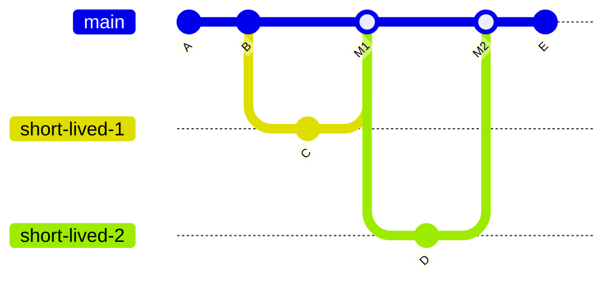
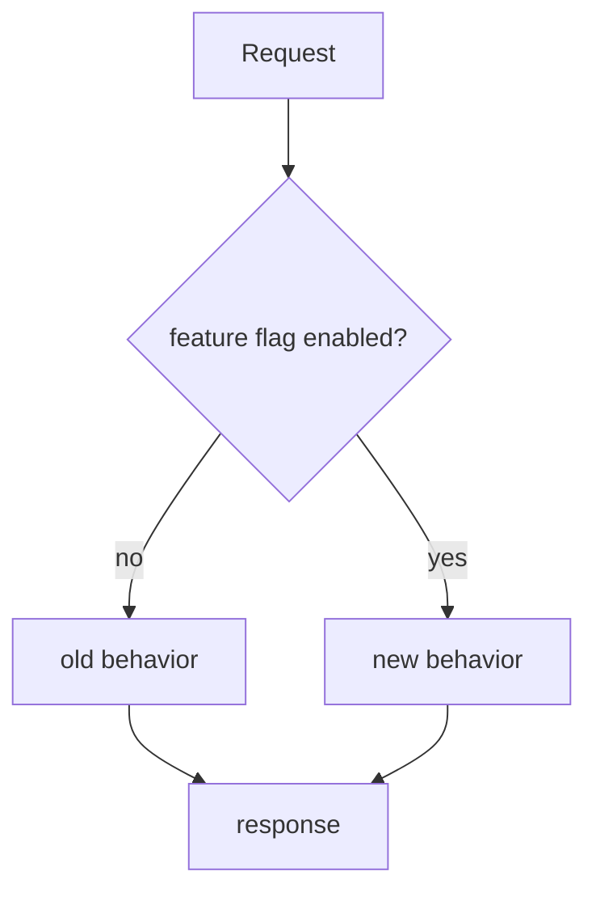
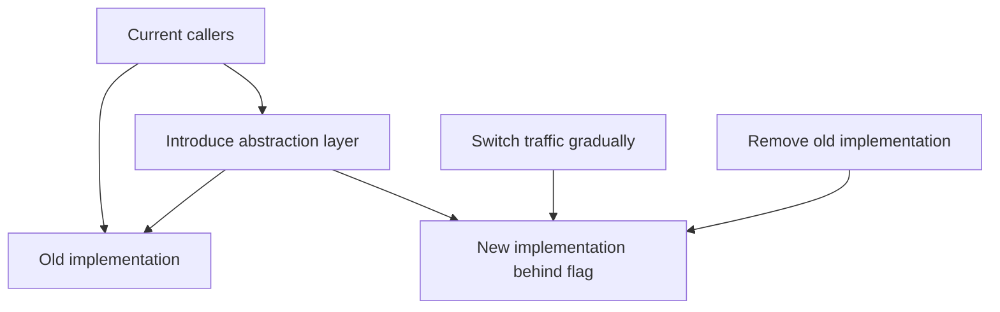
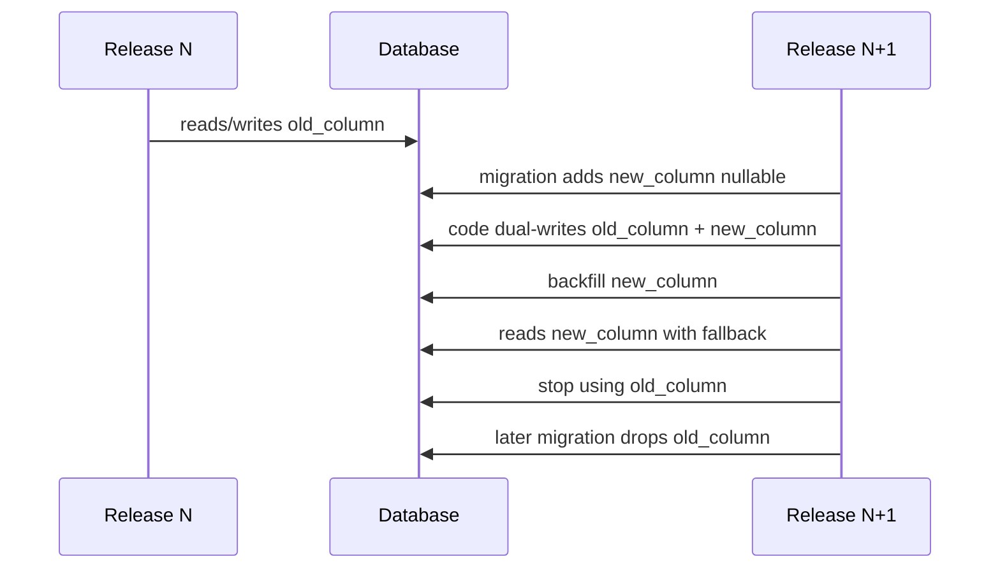
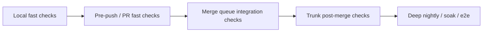
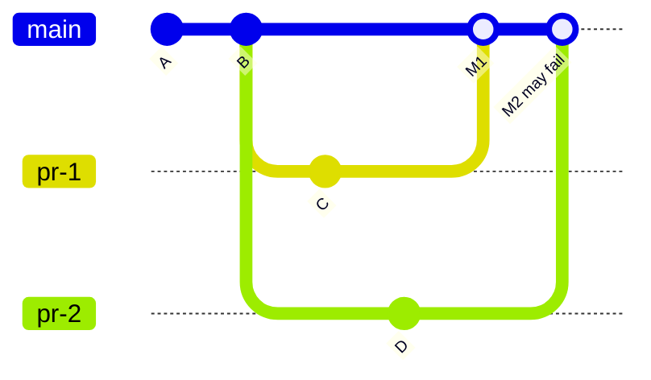
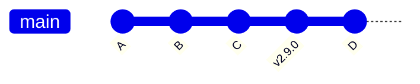
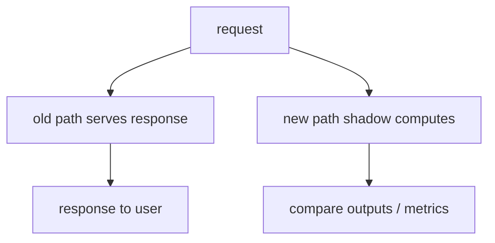
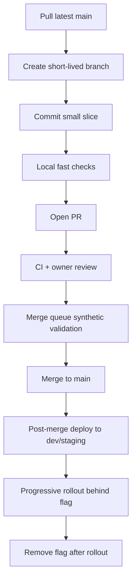
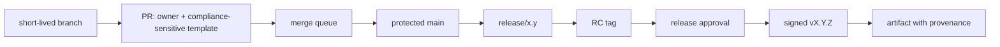

# Part 096 — Trunk-Based Development in Practice

Trunk-based development is not “everyone pushes directly to `main` and hopes CI saves them.”

It is a disciplined workflow where developers integrate small changes into one shared trunk frequently, while unfinished work is hidden behind safe design techniques such as feature flags, branch by abstraction, incremental migration, and rapid revert.

The goal is not fewer branches for aesthetic reasons.

The goal is lower **integration latency**.

Long-lived branches postpone conflict, design disagreement, and semantic drift.

Trunk-based development pulls that risk forward while it is still small.

---

## 1. Definition

In Git terms, trunk-based development means:

- one primary integration branch, usually `main` or `trunk`;
- developers integrate into that branch frequently;
- branches are absent or short-lived;
- trunk is kept healthy by automation and discipline;
- incomplete features are controlled by runtime/configuration/design techniques, not by hiding code in long-lived branches;
- releases are cut from trunk or short-lived release branches.



The key is not branch count.

The key is that branch lifetime is short enough that integration remains continuous.

---

## 2. What Trunk-Based Development Is Optimizing

Trunk-based development optimizes for:

| Goal | Mechanism |
|---|---|
| Low integration latency | Frequent merges into trunk. |
| Small conflict surface | Short-lived branches and small changes. |
| Early semantic feedback | CI and review against current trunk. |
| Release readiness | Trunk remains buildable/releasable. |
| Fast incident response | Revert or disable small changes quickly. |
| Accurate shared reality | Everyone integrates against the same line. |

It deliberately rejects the idea that isolation equals safety.

Isolation delays integration risk.

Safety comes from small batches, fast validation, reversible changes, and protected trunk.

---

## 3. The Trunk Invariant

The central invariant:

```text
Trunk must always be in a known-good state or recoverable quickly.
```

Known-good does not always mean every feature is enabled.

It means:

- code compiles;
- tests pass at the agreed gate level;
- incomplete behavior is disabled or unreachable;
- migrations are backward/forward compatible where required;
- release metadata can identify source commit;
- bad changes can be reverted or disabled quickly.

If trunk is often broken and recovery is slow, the team is not doing trunk-based development.

It is doing branchless chaos.

---

## 4. Direct-to-Trunk vs Short-Lived Branches

There are two common variants.

### 4.1 Direct-to-Trunk

Developers commit directly to trunk after local validation.

Works best when:

- team is small;
- CI is very fast;
- engineers are experienced;
- pairing or pre-commit review exists;
- changes are tiny;
- revert culture is strong.

Risks:

- weak review;
- accidental broken trunk;
- hard enforcement of ownership;
- high trust requirement.

### 4.2 Short-Lived PR Branches

Developers create short-lived branches and merge through PR/checks.

Works best when:

- team is medium/large;
- review is required;
- branch protection is available;
- merge queue can test the merge result;
- branch lifetime is measured in hours/days, not weeks.

Risks:

- PRs grow too large;
- review queue becomes bottleneck;
- stale branches accumulate;
- “short-lived” becomes a slogan.

Modern trunk-based development often uses short-lived PR branches.

That is still trunk-based if integration is frequent and branches do not become isolation silos.

---

## 5. Branch Lifetime Rule

A practical default:

```text
Normal branches should live less than 1–2 days.
Exceptional branches need an explicit integration plan.
```

For high-performing teams, even 1–2 days can be long.

The exact number matters less than the discipline:

- if the branch is hard to merge, it lived too long or changed too much;
- if reviewers cannot understand it, it contains too much intent;
- if it requires repeated manual conflict resolution, integration is delayed;
- if it cannot be safely reverted, it is too large or too coupled.

---

## 6. The Change-Slicing Discipline

Trunk-based development depends on slicing work.

Do not ask:

> “How do I finish the whole feature before merging?”

Ask:

> “What is the smallest safe, reviewable, disabled or backward-compatible slice that can land today?”

Common slices:

| Large work | Trunk-friendly slice |
|---|---|
| New feature | Add hidden model/API behind flag. |
| UI redesign | Add parallel component unused by default. |
| Database migration | Add nullable column / dual-write compatibility. |
| Authorization engine change | Add policy evaluator beside old evaluator. |
| API replacement | Add new endpoint version behind routing flag. |
| Refactor | Move behavior-preserving step first, semantic change later. |
| Performance rewrite | Add instrumentation, then shadow path, then switch. |
| Event schema change | Add producer compatibility, then consumer compatibility. |

Small slices are not about doing less work.

They are about exposing integration risk earlier.

---

## 7. Feature Flags Are Not Optional for Large Changes

Feature flags let incomplete code exist in trunk without being active for all users.



A good flag has:

- owner;
- purpose;
- default state;
- target audience;
- rollout plan;
- rollback plan;
- removal date;
- monitoring metric;
- cleanup issue.

A bad flag is just a permanent branch in runtime.

### Flag Taxonomy

| Flag type | Purpose | Expected lifetime |
|---|---|---:|
| Release flag | hide incomplete feature | short |
| Ops flag | disable risky behavior | medium/long |
| Experiment flag | A/B or cohort testing | bounded |
| Permission flag | entitlement/customer capability | product-defined |
| Migration flag | switch between old/new implementation | short/medium |
| Kill switch | emergency disable | long but controlled |

Feature flags reduce branch risk but introduce runtime complexity.

You need cleanup discipline.

---

## 8. Branch by Abstraction

Branch by abstraction is a technique for landing long-running replacement work on trunk without long-lived source branches.

Instead of this:

```text
create branch rewrite-payment-engine
work for 6 weeks
merge giant branch
pray
```

Do this:



Steps:

1. Introduce an abstraction with old implementation only.
2. Route existing callers through abstraction.
3. Add new implementation behind flag or config.
4. Run shadow/dual execution if needed.
5. Switch traffic gradually.
6. Remove old implementation.
7. Remove flag and abstraction if unnecessary.

This makes integration continuous while the migration remains controlled.

---

## 9. Database and Schema Changes in Trunk-Based Development

Database changes are where naive trunk-based development breaks.

The rule:

```text
Code and schema must be compatible across deployment overlap.
```

For rolling deploys, old and new code may run simultaneously.

Use expand-contract migration:



Trunk-friendly schema slices:

| Step | Safe property |
|---|---|
| Add nullable column/table | backward compatible. |
| Write both old and new | supports overlap. |
| Backfill | data consistency. |
| Read new with fallback | progressive migration. |
| Switch reads | behavior changes after data is ready. |
| Remove old | only after all runtimes no longer need it. |

Never merge a schema change whose safe deployment requires a hidden branch of application code.

---

## 10. CI Requirements for Trunk-Based Development

Trunk-based development requires high-trust CI.

Minimum CI gate for trunk:

- compile/build;
- unit tests;
- lint/static checks;
- security-sensitive policy checks;
- migration compatibility tests where relevant;
- generated-file consistency;
- dependency lockfile validation;
- smoke test or contract test for core paths.

But CI must also be fast.

A trunk workflow with slow CI causes large branches because developers batch work while waiting.

### CI Layering



Not every check belongs on the PR critical path.

| Check type | Where it belongs |
|---|---|
| formatting | local/pre-commit/fast CI |
| compile/unit | PR required |
| integration smoke | PR or merge queue |
| full e2e | merge queue or post-merge depending speed |
| performance regression | scheduled or targeted gate |
| security scan | PR for changed surfaces + scheduled full scan |
| migration dry run | required for migration paths |
| flaky long test | quarantine/fix; do not let it destroy trust |

The trunk gate must be strong enough to protect trunk and fast enough to keep batches small.

---

## 11. Merge Queue and Trunk-Based Development

At high concurrency, “PR passed CI” is not enough.

Two PRs can each pass against trunk and fail when merged together.



A merge queue tests a synthetic state:

```text
current trunk + queued PR(s)
```

Use a merge queue when:

- many PRs land daily;
- required checks are expensive;
- main breakage from race conditions is common;
- teams compete for trunk integration;
- release cadence requires high mainline trust.

A merge queue does not fix:

- flaky tests;
- too-large PRs;
- poor ownership;
- weak rollback practices.

It only serializes or batches integration under validation.

---

## 12. Review Model for Trunk-Based Development

Trunk-based development does not remove review.

It changes review shape.

Review must become:

- smaller;
- faster;
- risk-based;
- ownership-aware;
- supported by CI;
- comfortable with incremental slices.

Reviewer questions:

- Is this slice safe to land independently?
- Is unfinished behavior unreachable or disabled?
- Is rollback clear?
- Are migrations compatible?
- Is the flag owner/removal plan clear?
- Is the next slice obvious?
- Does this change preserve trunk health?

Bad review question:

> “Is the entire feature complete?”

Good review question:

> “Is this incomplete slice safe in trunk?”

---

## 13. Revert Culture

A trunk workflow needs fast revert.

Revert should be normal, not shameful.

```bash
# Revert a bad commit on trunk
git switch main
git pull --ff-only
git revert <bad-commit>
git push origin main
```

For merge commits:

```bash
git revert -m 1 <merge-commit>
```

But revert safety depends on slice design.

Easy to revert:

- small isolated code change;
- feature behind flag;
- no irreversible migration;
- no external side effects;
- no cross-service protocol break.

Hard to revert:

- destructive migration;
- public API contract change;
- data backfill with side effects;
- shared event schema change;
- huge refactor mixed with behavior change.

A trunk-friendly change is designed to be reverted or disabled.

---

## 14. Release Strategies with Trunk-Based Development

There are two common release patterns.

### 14.1 Release Directly from Trunk



Flow:

1. Trunk remains releasable.
2. Create annotated/signed tag from trunk commit.
3. Build artifact from tag/commit.
4. Deploy progressively.
5. Rollback by artifact or revert/disable.

Best when:

- deployment is frequent;
- trunk health is strong;
- features are flag-controlled;
- rollback is operationally mature.

### 14.2 Short-Lived Release Branch

```mermaid
gitGraph
  commit id: "A"
  commit id: "B"
  branch release/2.9
  checkout release/2.9
  commit id: "RC fix"
  commit id: "v2.9.0"
  checkout main
  commit id: "C"
  cherry-pick id: "forward-port RC fix"
```

Flow:

1. Cut release branch from trunk.
2. Only blocker fixes allowed.
3. Tag RC/final from release branch.
4. Forward-port every release fix to trunk.
5. Delete or convert to maintenance branch based on support policy.

Best when:

- release certification exists;
- customers consume versions;
- deploy and release are distinct;
- compliance evidence matters.

Trunk-based development does not forbid release branches.

It rejects long-lived development isolation branches.

---

## 15. Working with Large Changes

Large changes are not an excuse for long-lived branches.

They need decomposition patterns.

### 15.1 Feature Flag Pattern

Land code disabled, enable gradually.

### 15.2 Branch by Abstraction Pattern

Introduce abstraction, migrate behind it.

### 15.3 Parallel Run / Shadow Mode

Run old and new implementations simultaneously, compare results, serve old.



### 15.4 Expand-Contract Schema Pattern

Make schema changes compatible across versions.

### 15.5 Strangler Pattern

Route a small subset of behavior to new subsystem.

### 15.6 Adapter Compatibility Pattern

Add compatibility layer so callers can migrate one by one.

---

## 16. Local Developer Workflow

A practical short-lived branch loop:

```bash
git switch main
git pull --ff-only

git switch -c feature/small-intent

# work in small slices
git add -p
git commit -m "Add disabled escalation audit event writer"

# refresh before PR
git fetch origin
git rebase origin/main

# push proposal
git push -u origin feature/small-intent
```

Before opening PR:

```bash
# inspect branch relative to trunk
git log --oneline --decorate origin/main..HEAD
git diff --stat origin/main...HEAD
git diff origin/main...HEAD

# verify no accidental large/generated files
git status --short
git ls-files --others --exclude-standard
```

After review feedback:

```bash
# create fixup commit
git commit --fixup=<target-commit>

# autosquash locally
git rebase -i --autosquash origin/main

# compare rewritten series
git range-diff origin/main@{1}..HEAD@{1} origin/main..HEAD

# safe push
git push --force-with-lease
```

The branch remains short-lived.

Rewrite is acceptable because the branch is a proposal, not a shared integration line.

---

## 17. Trunk Protection Configuration

Recommended baseline:

| Control | Default |
|---|---|
| Direct push to trunk | disabled except bots/admin emergency. |
| Required PR | enabled for normal flow. |
| Required status checks | enabled. |
| Require branch up-to-date or merge queue | enabled for high concurrency. |
| Required review | enabled, risk-based count. |
| CODEOWNERS | enabled for sensitive areas. |
| Stale approval invalidation | enabled. |
| Force push | disabled. |
| Deletion | disabled. |
| Signed release tags | required in release process. |
| Emergency bypass | logged and reviewed. |

Trunk-based development needs stronger protection, not weaker protection.

Because everyone depends on trunk, trunk is critical infrastructure.

---

## 18. Trunk-Based Development for Monorepos

Monorepos amplify trunk pressure.

Additional requirements:

- ownership by path;
- sparse checkout profiles;
- affected-project detection;
- merge queue batching;
- global invariant tests;
- dependency graph awareness;
- generated-file policy;
- large binary boundaries;
- localized CI plus periodic full validation.

Monorepo trunk-based development works when trunk remains a shared integration line, not a dumping ground.

Use path ownership and CI partitioning to keep changes reviewable.

---

## 19. Trunk-Based Development for Regulated Systems

A regulated system can use trunk-based development if audit and release controls are explicit.

Key adaptations:

| Risk | Control |
|---|---|
| Unauthorized state-machine change | CODEOWNER + invariant tests. |
| Incomplete feature exposure | feature flag default off. |
| Migration rollback risk | expand-contract + migration review. |
| Release evidence | signed tag + artifact provenance. |
| Hotfix traceability | cherry-pick `-x` + forward-port record. |
| Approval evidence | PR template + branch protection. |
| Runtime traceability | embed commit/tag/build metadata. |

Trunk-based does not mean uncontrolled.

It means integration happens early while release authority remains controlled.

---

## 20. Failure Modes

### 20.1 Trunk Is Always Red

Cause:

- flaky CI;
- weak local validation;
- direct push without review;
- too many unsafe changes;
- no revert discipline.

Fix:

- freeze merges;
- restore trunk;
- quarantine flakes;
- require merge queue/checks;
- improve change slicing.

### 20.2 Flags Never Die

Cause:

- no owner;
- no removal date;
- no cleanup tracking;
- flags used as permanent configuration.

Fix:

- flag registry;
- cleanup tickets;
- CI check for expired flags;
- distinguish release flags from product permissions.

### 20.3 PRs Are Still Huge

Cause:

- branch lifetime policy ignored;
- reviewers accept large batches;
- no decomposition skill;
- pressure to finish feature before merge.

Fix:

- require slice plan;
- stack PRs;
- branch by abstraction;
- flag incomplete behavior.

### 20.4 Release Branch Becomes Second Development Line

Cause:

- features added to release branch;
- unclear release branch policy;
- fixes not forward-ported.

Fix:

- blocker-only rule;
- release manager approval;
- forward-port checklist;
- close branch after release unless maintenance needed.

### 20.5 Merge Queue Becomes Bottleneck

Cause:

- slow checks;
- flaky tests;
- huge PRs;
- too many required checks.

Fix:

- split check layers;
- reduce flakiness;
- batch safe PRs;
- optimize CI cache;
- enforce smaller PRs.

### 20.6 Revert Is Unsafe

Cause:

- irreversible migrations;
- large coupled commits;
- behavior mixed with refactor;
- no feature flag.

Fix:

- expand-contract;
- separate refactor from behavior;
- flag risky paths;
- require rollback plan in PR.

---

## 21. Transitioning from Long-Lived Branches to Trunk-Based

Do not switch by announcement.

Switch by reducing risk step by step.

### Step 1 — Measure Current Branch Drift

```bash
git for-each-ref refs/remotes/origin \
  --format='%(refname:short) %(committerdate:short)' \
  --sort=committerdate
```

Look for:

- branches older than 14/30/90 days;
- branches far behind main;
- repeated conflict zones;
- huge PRs;
- release branch misuse.

### Step 2 — Protect Trunk

Before increasing merge frequency:

- required checks;
- required review;
- no force push;
- no deletion;
- merge queue if needed.

### Step 3 — Teach Change Slicing

Run examples:

- feature flag slice;
- expand-contract migration;
- branch by abstraction;
- stacked PR decomposition.

### Step 4 — Shorten Branch Lifetime

Move policy gradually:

```text
30 days -> 14 days -> 7 days -> 2 days -> same day where possible
```

### Step 5 — Add Flag/Config Infrastructure

Without flags, teams will recreate long-lived branches.

### Step 6 — Improve CI Speed

Slow CI creates batching pressure.

### Step 7 — Define Release Branch Policy

Clarify whether release branches exist and what they may accept.

### Step 8 — Close the Loop

Track:

- PR lifetime;
- trunk red time;
- revert time;
- branch age;
- queue wait;
- flag cleanup.

---

## 22. Example Workflow: Service Team with Short-Lived PR Branches



Policy:

```text
- Branches older than 3 days require explicit note.
- PRs over 500 changed lines require split justification.
- All risky behavior must be behind a flag or reversible migration.
- main must not stay red for more than 15 minutes without owner response.
- Release tags are annotated and immutable.
```

---

## 23. Example Workflow: Regulated Platform



Additional rules:

```text
- State machine changes require invariant test updates.
- Authorization changes require security owner approval.
- Migration changes require rollback/forward plan.
- Release branch accepts blocker fixes only.
- Every release fix must be forward-ported to main.
- Production artifact must expose commit SHA and tag.
```

This is still trunk-based because normal development integrates continuously into trunk.

Release approval is separated from integration.

---

## 24. Practical Command Cheat Sheet

### Create short-lived branch

```bash
git switch main
git pull --ff-only
git switch -c feature/<small-intent>
```

### Inspect branch before PR

```bash
git log --oneline --decorate origin/main..HEAD
git diff --stat origin/main...HEAD
git diff --check origin/main...HEAD
```

### Refresh branch safely

```bash
git fetch origin
git rebase origin/main
```

### Abort bad rebase

```bash
git rebase --abort
```

### Recover previous branch state

```bash
git reflog
git branch rescue HEAD@{1}
```

### Revert bad trunk commit

```bash
git switch main
git pull --ff-only
git revert <sha>
git push origin main
```

### Tag release from trunk

```bash
git switch main
git pull --ff-only
git tag -a v2.9.0 -m "Release v2.9.0"
git push origin v2.9.0
```

---

## 25. Checklist: Are You Actually Doing Trunk-Based Development?

You are likely doing trunk-based development if:

- there is one primary integration branch;
- normal branches are short-lived;
- work lands in small slices;
- incomplete behavior is disabled safely;
- CI protects trunk;
- trunk red time is treated as urgent;
- release identity is tied to trunk/tag/commit;
- revert is fast and culturally acceptable;
- long-lived development branches are exceptional.

You are not really doing trunk-based development if:

- feature branches live for weeks;
- trunk is often broken;
- teams merge giant features only when complete;
- release branch becomes a second development branch;
- feature flags have no cleanup plan;
- CI only tests stale feature branch heads;
- production source cannot be traced to trunk/tag.

---

## 26. Mental Model Summary

Trunk-based development is an integration strategy.

It says:

> Keep the shared source of truth close to everyone’s daily work, and make changes small enough that integration is continuous, reviewable, reversible, and releasable.

It requires:

- short branch lifetime;
- strong trunk protection;
- fast reliable CI;
- feature flags;
- branch by abstraction;
- expand-contract migrations;
- small PRs;
- merge-result validation;
- fast revert;
- explicit release identity.

The win is not that branches disappear.

The win is that hidden integration debt disappears.

---

## References

- Trunk-Based Development — Introduction: https://trunkbaseddevelopment.com/
- Trunk-Based Development — Short-Lived Feature Branches: https://trunkbaseddevelopment.com/short-lived-feature-branches/
- Trunk-Based Development — Branch by Abstraction: https://trunkbaseddevelopment.com/branch-by-abstraction/
- GitHub Docs — About protected branches: https://docs.github.com/repositories/configuring-branches-and-merges-in-your-repository/managing-protected-branches/about-protected-branches
- GitHub Docs — Managing a merge queue: https://docs.github.com/en/repositories/configuring-branches-and-merges-in-your-repository/configuring-pull-request-merges/managing-a-merge-queue
- Git Documentation — `git merge`: https://git-scm.com/docs/git-merge
- Git Documentation — `git revert`: https://git-scm.com/docs/git-revert
- Git Documentation — `git rebase`: https://git-scm.com/docs/git-rebase
- Git Documentation — `git tag`: https://git-scm.com/docs/git-tag
