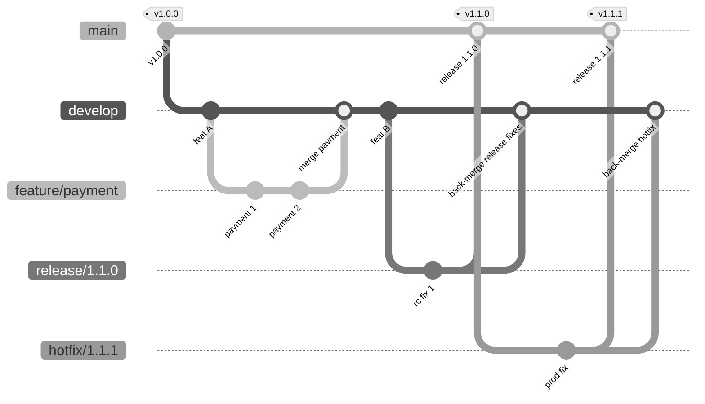
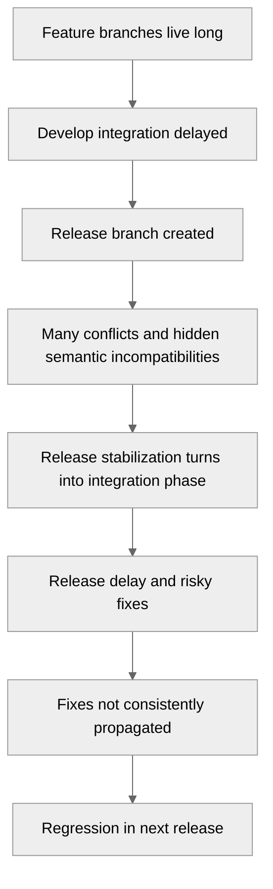
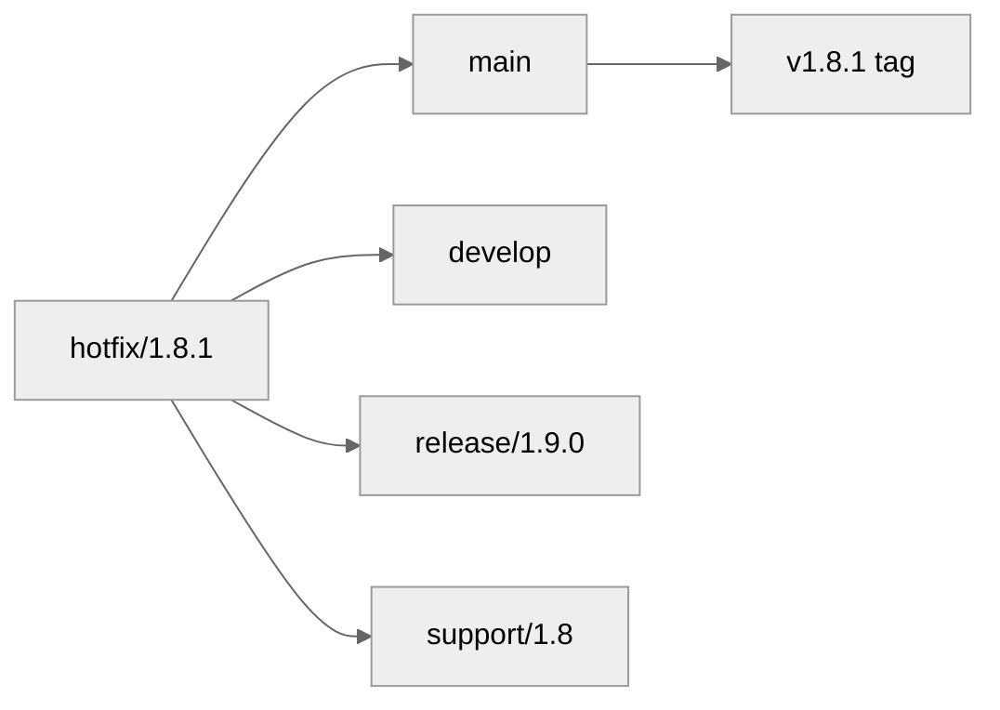

# Part 097 — GitFlow: Where It Works and Fails

GitFlow sering diperdebatkan dengan cara yang salah.

Sebagian engineer memperlakukannya sebagai “best practice Git”. Sebagian lain memperlakukannya sebagai “legacy workflow yang pasti buruk”. Dua-duanya terlalu dangkal.

GitFlow adalah **branching topology**. Ia mendefinisikan beberapa kelas branch dengan tujuan berbeda: `main`, `develop`, `feature/*`, `release/*`, dan `hotfix/*`. Model ini mencoba memisahkan pekerjaan aktif, stabilisasi release, dan patch production. Masalahnya: semakin banyak branch kelas permanen dan semi-permanen yang hidup bersamaan, semakin besar integration latency, merge debt, dan ambiguity tentang source of truth.

Tujuan part ini bukan menyuruh kamu memakai atau membuang GitFlow. Tujuannya adalah membuat kamu bisa menilai:

- masalah apa yang GitFlow coba selesaikan,
- invariant apa yang harus dipenuhi agar GitFlow tidak rusak,
- konteks apa yang masih cocok,
- konteks apa yang akan dibuat lebih buruk,
- bagaimana memigrasikan tim dari GitFlow ke model yang lebih ringan tanpa kehilangan kontrol release.

---

## 1. Mental Model: GitFlow Is a Release Isolation Machine

GitFlow bukan sekadar kumpulan nama branch. GitFlow adalah mesin isolasi release.

Ia mengasumsikan bahwa ada beberapa jenis pekerjaan yang tidak boleh bercampur terlalu cepat:

1. **Development integration** — pekerjaan fitur yang sedang dikembangkan.
2. **Release stabilization** — kandidat release yang sedang diuji dan dipoles.
3. **Production maintenance** — patch cepat untuk versi yang sudah live.
4. **Historical release identity** — tag versi yang mewakili artifact yang sudah dirilis.

Dalam bentuk klasik:



GitFlow berhasil bila semua orang memahami bahwa setiap branch punya **semantic role** yang berbeda.

Ia gagal ketika branch hanya menjadi “tempat transit” tanpa invariant.

---

## 2. Branch Roles in GitFlow

### 2.1 `main`

`main` mewakili production history.

Invariant ideal:

- setiap commit di `main` adalah release atau mendekati release,
- setiap release di-tag dari `main`,
- `main` tidak menerima fitur mentah,
- `main` bisa dipakai untuk hotfix production.

`main` bukan “branch yang paling baru”. Ia adalah **branch yang paling defensible untuk production history**.

### 2.2 `develop`

`develop` mewakili integration line untuk fitur berikutnya.

Invariant ideal:

- feature branch merge ke `develop`,
- `develop` bisa tidak production-ready,
- `develop` menjadi source untuk `release/*`,
- `develop` harus menerima balik fix dari `release/*` dan `hotfix/*`.

Di sinilah banyak failure muncul. `develop` sering berubah menjadi hidden trunk, tetapi tanpa disiplin trunk-based development. Ia menampung banyak perubahan besar, tetapi tidak selalu dijaga releasable.

### 2.3 `feature/*`

`feature/*` adalah branch pekerjaan fitur.

Invariant ideal:

- dibuat dari `develop`,
- pendek umur,
- merge balik ke `develop`,
- tidak di-tag release,
- tidak deploy production langsung.

Jika `feature/*` hidup lama, GitFlow mendapat dua level integration debt: feature branch drift terhadap `develop`, lalu `develop` drift terhadap `main`.

### 2.4 `release/*`

`release/*` adalah branch stabilisasi.

Invariant ideal:

- dibuat dari `develop` ketika scope release dibekukan,
- hanya menerima release-blocker fixes,
- tidak menerima fitur baru,
- setelah final, merge ke `main`, tag release, lalu merge balik ke `develop`.

`release/*` bukan environment branch. Ia bukan `staging`. Ia adalah **source boundary untuk calon versi**.

### 2.5 `hotfix/*`

`hotfix/*` adalah branch patch production.

Invariant ideal:

- dibuat dari `main` atau release tag production,
- perubahan minimal,
- merge ke `main`, tag patch release,
- merge/cherry-pick balik ke `develop` dan release branch aktif.

Hotfix branch adalah mekanisme kompensasi saat production membutuhkan patch lebih cepat daripada release train normal.

---

## 3. The Core Invariants

GitFlow hanya sehat kalau invariant ini ditegakkan.

| Invariant | Mengapa penting | Jika dilanggar |
|---|---|---|
| `main` hanya production/release history | Membuat rollback, audit, dan hotfix jelas | `main` kehilangan makna sebagai source production |
| `develop` adalah integration line, bukan dump branch | Menjaga fitur bergabung sebelum release | Integrasi terlambat dan conflict debt naik |
| `release/*` hanya stabilisasi | Mencegah scope creep | RC tidak pernah stabil |
| `hotfix/*` minimal dan cepat | Mengurangi blast radius patch production | Hotfix berubah menjadi mini-release tersembunyi |
| Release fix balik ke `develop` | Mencegah fix hilang di versi berikutnya | Bug muncul lagi setelah next release |
| Tag release immutable | Menjaga artifact/source identity | Build reproducibility dan audit rusak |

GitFlow bukan masalah command. GitFlow adalah masalah **discipline**.

---

## 4. GitFlow Command Skeleton

Contoh skeleton tanpa tool eksternal `git-flow`:

```bash
# Feature branch dari develop
git switch develop
git pull --ff-only
git switch -c feature/payment-retry

# Setelah selesai
git switch develop
git pull --ff-only
git merge --no-ff feature/payment-retry

# Membuat release branch
git switch develop
git pull --ff-only
git switch -c release/1.8.0

# Release blocker fix
git commit -m "Fix payment retry timeout in release 1.8.0"

# Final release
git switch main
git pull --ff-only
git merge --no-ff release/1.8.0
git tag -a v1.8.0 -m "Release 1.8.0"
git push origin main v1.8.0

# Back-merge release fixes
git switch develop
git pull --ff-only
git merge --no-ff release/1.8.0
git push origin develop

# Hotfix dari main
git switch main
git pull --ff-only
git switch -c hotfix/1.8.1
# commit minimal fix

# Release hotfix
git switch main
git merge --no-ff hotfix/1.8.1
git tag -a v1.8.1 -m "Release 1.8.1"
git push origin main v1.8.1

# Propagate hotfix
git switch develop
git merge --no-ff hotfix/1.8.1
git push origin develop
```

Perhatikan pola repetitif: setiap fix yang masuk release/hotfix harus kembali ke development line.

GitFlow bukan mengurangi merge. Ia menambah merge untuk menjaga banyak line tetap konsisten.

---

## 5. Where GitFlow Works

GitFlow masih bisa masuk akal ketika release cadence dan operational constraints memang membutuhkan isolasi yang jelas.

### 5.1 Produk dengan Release Besar dan Jarang

Contoh:

- desktop application,
- embedded firmware,
- on-prem enterprise software,
- regulated packaged release,
- mobile app dengan store review cycle panjang,
- appliance software yang tidak bisa deploy harian.

Dalam konteks seperti ini, release tidak selalu bisa terjadi langsung dari trunk setiap hari. Ada fase stabilisasi yang nyata.

GitFlow membantu bila:

- release scope besar,
- test cycle lama,
- approval cycle formal,
- artifact harus dibekukan,
- bug fix release harus dipisah dari development berikutnya.

### 5.2 Banyak Versi Production Aktif

Jika tim harus maintain beberapa major/minor version sekaligus, branch maintenance memang diperlukan.

Contoh:

```text
main
support/1.8
support/1.9
release/2.0
```

Dalam kasus ini, ide “satu trunk selalu cukup” bisa terlalu simplistik. Namun ini tidak berarti full GitFlow klasik selalu diperlukan. Kadang cukup trunk-based + maintenance branches.

### 5.3 Manual QA dan Certification Gate

Jika release harus melewati certification gate eksternal, release branch memberi tempat stabil untuk:

- final QA,
- regulatory review,
- UAT,
- security approval,
- release note finalization,
- evidence bundle.

Yang penting: release branch harus menerima **fix stabilisasi**, bukan fitur baru.

### 5.4 Team Maturity Belum Siap untuk Trunk-Based

Trunk-based development butuh:

- test suite cepat dan dipercaya,
- feature flags,
- small batches,
- CI discipline,
- culture revert cepat,
- branch lifetime pendek.

Jika tim belum punya hal itu, memaksa trunk-based bisa menyebabkan `main` sering rusak. GitFlow memberi pagar awal, meski dengan biaya integrasi lebih tinggi.

Namun ini harus dilihat sebagai **transitional safety**, bukan tujuan akhir otomatis.

---

## 6. Where GitFlow Fails

GitFlow gagal ketika branch topology dipakai untuk menutupi masalah engineering system.

### 6.1 `develop` Becomes a Second Main

Ini failure paling umum.

Tim berkata:

> `main` production, `develop` tempat semua kerjaan.

Lalu realitasnya:

- semua PR merge ke `develop`,
- `develop` sering broken,
- release branch dibuat dari `develop`,
- release branch penuh conflict/fix,
- fix di release branch lupa balik ke `develop`,
- `main` hanya bergerak saat release,
- history production dan history engineering terlalu jauh.

Masalahnya: `develop` menjadi trunk, tapi tidak diperlakukan seperti trunk.

Jika `develop` adalah integration line utama, ia butuh standar yang sama seperti trunk:

- CI wajib hijau,
- PR kecil,
- revert cepat,
- branch protection,
- no broken integration.

Kalau tidak, `develop` hanyalah tempat menunda masalah.

### 6.2 Integration Happens Too Late

GitFlow dapat mendorong mentalitas:

> Integrasi beneran nanti pas release.

Ini berbahaya. Semakin lama branch/feature tidak diintegrasikan ke line bersama, semakin besar:

- conflict debt,
- semantic drift,
- duplicate work,
- hidden dependency,
- test gap,
- ownership confusion.

Diagram failure:



Release stabilization harus mengurangi risk, bukan menjadi momen pertama semua perubahan bertemu.

### 6.3 Release Branch Becomes Feature Branch

`release/1.8.0` seharusnya stabilisasi. Tetapi karena business pressure, tim sering memasukkan “satu fitur kecil lagi”.

Gejalanya:

- release branch terus bertambah scope,
- testing restart berkali-kali,
- commit message berbunyi `Add ...` bukan `Fix ...`,
- UAT menemukan bug dari fitur yang baru masuk saat freeze,
- `develop` dan `release/*` diverge terlalu jauh.

Rule sederhana:

```text
Setelah release branch dibuat, default jawaban untuk fitur baru adalah: next release.
```

Exception boleh ada, tetapi harus eksplisit dan dicatat.

### 6.4 Hotfix Becomes Shortcut Around Review

Hotfix branch dari `main` punya legitimasi tinggi karena production incident. Namun legitimasi ini sering disalahgunakan:

- bypass review,
- bypass tests,
- bypass security approval,
- “sekalian” masukkan change lain,
- patch tidak balik ke `develop`.

Hotfix harus punya constraint lebih ketat, bukan lebih longgar:

- scope minimal,
- reviewer domain wajib,
- release note wajib,
- post-hotfix forward-port wajib,
- expiry cepat.

### 6.5 Branches Model Environments Instead of Code State

GitFlow sering bercampur dengan branch environment:

```text
feature/* -> develop -> qa -> staging -> main/prod
```

Ini bukan GitFlow sehat. Ini environment branch anti-pattern, yang akan dibahas di Part 098.

Jika branch bernama environment dipakai untuk menandai deployment state, Git history mulai mencampur dua realitas:

1. source code evolution,
2. runtime environment promotion.

Akibatnya, branch tidak lagi menjawab “apa perubahan source ini?”, melainkan “apa yang sedang ada di staging?”. Itu dua domain berbeda.

---

## 7. Hidden Cost Model

GitFlow menambah struktur. Struktur itu punya biaya.

### 7.1 Merge Cost

GitFlow menambah merge karena change harus bergerak antar line:

- feature → develop,
- release → main,
- release → develop,
- hotfix → main,
- hotfix → develop,
- hotfix → release branch aktif.

Semakin banyak branch line, semakin besar propagation graph.



Satu fix bisa butuh banyak aplikasi. Jika tim tidak punya manifest dan checklist, fix hilang.

### 7.2 Cognitive Cost

Engineer harus tahu:

- branch mana source of truth,
- branch mana target PR,
- branch mana boleh deploy,
- branch mana harus menerima hotfix,
- kapan harus merge vs cherry-pick,
- kapan tag dibuat,
- kapan branch dihapus.

Jika workflow perlu pengetahuan tribal knowledge, workflow itu rapuh.

### 7.3 CI Cost

Setiap branch class butuh CI yang berbeda:

| Branch | CI expectation |
|---|---|
| `feature/*` | fast feedback |
| `develop` | integration validation |
| `release/*` | release candidate validation |
| `main` | release/provenance validation |
| `hotfix/*` | targeted regression + release gate |

Jika CI tidak disesuaikan, GitFlow memberi ilusi kontrol tanpa bukti.

### 7.4 Release Note Cost

Release notes harus tahu commit boundary.

Dalam GitFlow, boundary bisa berasal dari:

- tag sebelumnya di `main`,
- merge commit release branch,
- first-parent history,
- cherry-pick ke support branch,
- revert commit.

Jika merge strategy tidak konsisten, changelog menjadi noise.

### 7.5 Audit Cost

GitFlow membantu audit kalau dijalankan disiplin. Ia memperburuk audit kalau tidak.

Pertanyaan audit:

- commit mana masuk release?
- siapa approve release fix?
- apakah fix di release branch sudah masuk `develop`?
- tag menunjuk ke commit mana?
- artifact dibangun dari tag atau branch bergerak?
- apakah hotfix punya test evidence?

Jika jawabannya tersebar di chat, GitFlow tidak memberi defensibility.

---

## 8. Decision Framework: Should You Use GitFlow?

Gunakan framework berikut.

### 8.1 GitFlow Fit Signals

GitFlow mungkin cocok jika sebagian besar benar:

- release besar dan jarang,
- ada phase stabilisasi nyata,
- software dikirim sebagai paket/versioned product,
- banyak versi production aktif,
- customer tidak selalu auto-upgrade,
- hotfix ke versi lama sering terjadi,
- regulatory/certification gate butuh frozen source boundary,
- tim punya release manager atau release captain,
- CI/test tidak cukup cepat untuk direct trunk release.

### 8.2 GitFlow Misfit Signals

GitFlow mungkin buruk jika sebagian besar benar:

- deploy harian atau beberapa kali sehari,
- feature flags sudah matang,
- CI cepat dan dipercaya,
- service backend bisa rollback/redeploy cepat,
- branch lama sering conflict,
- `develop` sering broken,
- release branch menjadi tempat fitur baru,
- hotfix sering bypass governance,
- tim bingung branch target PR,
- environment dimodelkan sebagai branch.

### 8.3 Decision Table

| Context | Recommended model |
|---|---|
| SaaS dengan CI kuat dan feature flags | Trunk-based + short-lived release branch jika perlu |
| Mobile app dengan store review dan staged rollout | Trunk-based atau lightweight GitFlow dengan release branch |
| On-prem enterprise release quarterly | GitFlow-like atau trunk + maintenance branches |
| Embedded/firmware dengan certification | Release branches + signed tags + strict maintenance branches |
| Library dengan multiple supported major versions | Main/trunk + support branches per major |
| Small startup deploy daily | GitFlow biasanya overhead |
| Regulated case management platform | Depends: trunk for integration, release/support branches for evidence boundary |

---

## 9. A Healthier GitFlow Variant

Jika kamu harus memakai GitFlow, gunakan versi yang lebih ketat dan lebih kecil.

### 9.1 Keep `develop` Always Green

Jika `develop` adalah integration line, treat it as protected trunk:

- required checks,
- required review,
- short-lived feature branches,
- revert broken merge quickly,
- no “broken develop acceptable” culture.

### 9.2 Keep Release Branch Short-Lived

Release branch harus punya expiry.

Contoh policy:

```yaml
release_branch_policy:
  allowed_changes:
    - release_blocker_bugfix
    - version_metadata
    - release_notes
    - documentation_required_for_release
  disallowed_changes:
    - new_feature
    - unrelated_refactor
    - dependency_upgrade_unless_blocker
  max_lifetime_days: 14
  required:
    - release_owner
    - rc_tag
    - final_tag
    - back_merge_to_develop
```

### 9.3 Use Tags as Release Identity

Branch bergerak. Tag release seharusnya immutable.

Jangan build production dari `main` tanpa merekam commit SHA/tag.

Minimal:

```bash
git rev-parse --verify v1.8.0^{commit}
git tag -v v1.8.0 || true
git log --oneline v1.7.9..v1.8.0
```

### 9.4 Prefer Cherry-Pick Manifest for Maintenance Branches

Untuk support branch, jangan hanya “merge whatever”. Buat manifest:

```text
Backport train for 1.8.4

Source branch: main
Target branch: support/1.8

Commits:
- a1b2c3d Fix auth token expiry race
- b2c3d4e Add regression test for refresh token retry
- c3d4e5f Harden timeout handling in token introspection

Excluded:
- d4e5f6a Refactor auth client package layout — not needed for 1.8

Verification:
- auth regression suite passed
- security smoke passed
- no schema migration
```

GitFlow tanpa manifest akan menjadi memory game.

---

## 10. GitFlow vs Trunk-Based: The Real Trade-Off

Perdebatan GitFlow vs trunk-based sering disederhanakan menjadi:

```text
GitFlow = safe
Trunk-based = fast
```

Itu tidak tepat.

Yang lebih tepat:

```text
GitFlow trades integration frequency for release isolation.
Trunk-based trades branch isolation for continuous integration discipline.
```

GitFlow mengurangi risiko “unfinished feature masuk release” dengan memisahkan branch. Tetapi ia menaikkan risiko “integrasi terlambat”.

Trunk-based mengurangi integrasi terlambat dengan mengharuskan perubahan masuk main cepat. Tetapi ia membutuhkan mekanisme runtime/product untuk menyembunyikan pekerjaan belum siap: feature flags, branch by abstraction, dark launch, config gates.

Tidak ada workflow gratis.

---

## 11. Migration: From GitFlow to Lighter Workflow

Jika GitFlow terlalu berat, jangan langsung hapus semua branch model. Migrasi bertahap.

### Step 1 — Stabilize `develop`

Sebelum menghapus `develop`, buat ia hijau:

```bash
git switch develop
git pull --ff-only
git log --oneline --decorate --graph --first-parent -30
```

Tambahkan:

- branch protection,
- required checks,
- no direct push,
- revert policy.

### Step 2 — Shorten Feature Branch Lifetime

Target awal:

```text
feature branch lifetime <= 2 days for normal changes
```

Kalau fitur besar, pecah dengan:

- feature flag,
- branch by abstraction,
- incremental schema migration,
- compatibility layer.

### Step 3 — Make Release Branch Exceptional

Ubah release branch dari default menjadi conditional:

```text
Create release branch only when stabilization requires independent commits after scope freeze.
```

Jika release bisa langsung dari trunk/main, cukup tag.

### Step 4 — Move from `develop` to `main` as Integration Line

Setelah `develop` sehat dan branch lifetime pendek, `develop` sering tidak lagi memberi nilai. Kamu bisa menjadikan `main` sebagai integration line.

Migration sketch:

```bash
# freeze develop briefly
git switch main
git pull --ff-only

git merge --no-ff develop -m "Promote develop as main integration baseline"

git tag -a migration-main-integration-2026-07-07 -m "Main becomes integration line"
```

Setelah itu:

- PR target `main`,
- release tag dari `main`,
- release branch hanya saat stabilisasi,
- support branch untuk versi lama.

### Step 5 — Retire `develop`

Jangan hapus diam-diam. Buat deprecation window.

```text
From 2026-08-01:
- New PRs target main.
- develop is read-only.
- Any missed fix must be cherry-picked to main through PR.
- develop will be deleted after 30 days.
```

---

## 12. GitFlow in Regulated Systems

Regulated systems tidak otomatis membutuhkan GitFlow. Mereka membutuhkan:

- traceability,
- approval evidence,
- immutable release identity,
- reproducible artifact provenance,
- auditable change boundary,
- rollback story,
- segregation of duties.

GitFlow bisa membantu sebagian, tetapi juga bisa menambah ambiguity kalau branch propagation tidak disiplin.

Untuk regulatory case management/enforcement lifecycle systems, desain yang biasanya lebih defensible:

```text
main/trunk
  -> short-lived feature branches
  -> protected PR + CODEOWNERS
  -> signed release tags
  -> release branch only for RC stabilization
  -> support branches for active maintained versions
  -> evidence bundle per release
```

Key invariant:

```text
Every deployed artifact must be traceable to an immutable commit/tag and approval record.
```

Nama branch bukan evidence cukup.

---

## 13. Anti-Patterns Checklist

GitFlow sudah rusak jika kamu melihat pola ini:

- `develop` boleh broken berhari-hari.
- Release branch menerima fitur baru tanpa explicit exception.
- Hotfix tidak balik ke `develop`.
- Release tag dipindah setelah publish.
- `main` tidak bisa dipakai untuk mengetahui production history.
- PR target branch membingungkan.
- Tim merge manual antar environment branch.
- CI berbeda jauh antara branch sehingga hasil test tidak comparable.
- Changelog sulit dibuat karena history bercampur.
- Release branch hidup berbulan-bulan.
- Banyak conflict besar baru muncul saat release freeze.

Jika lebih dari tiga terjadi, masalahnya bukan “kurang training GitFlow”. Masalahnya adalah workflow architecture.

---

## 14. Practical Policy Template

Contoh policy GitFlow yang lebih aman:

```yaml
workflow: gitflow-lite

branches:
  main:
    meaning: production-release-history
    direct_push: false
    required_checks:
      - build
      - unit-test
      - integration-test
      - provenance
    tags_required_for_release: true

  develop:
    meaning: next-release-integration
    direct_push: false
    must_be_green: true
    max_broken_duration_minutes: 30

  feature:
    base: develop
    target: develop
    max_lifetime_days: 3
    require_small_batches: true

  release:
    base: develop
    target:
      - main
      - develop
    allowed_changes:
      - release_blocker_fix
      - release_metadata
      - release_notes
    disallowed_changes:
      - new_feature
      - broad_refactor
    max_lifetime_days: 14

  hotfix:
    base: main
    target:
      - main
      - develop
      - active_release_branches
    require_incident_id: true
    require_post_hotfix_forward_port: true

release:
  tag_type: annotated_or_signed
  tag_mutability: forbidden_after_publish
  artifact_source: release_tag
  evidence_required:
    - commit_sha
    - tag
    - changelog
    - ci_result
    - approval_record
```

---

## 15. Commands for Inspecting GitFlow Health

### Divergence between `main` and `develop`

```bash
git fetch --all --prune

git log --oneline --left-right --cherry-pick main...develop
```

Interpretasi:

- `<` commit hanya di `main`,
- `>` commit hanya di `develop`,
- output besar berarti branch divergence tinggi.

### Release fix not propagated

```bash
git log --oneline main..release/1.8.0
git log --oneline develop..release/1.8.0
```

Jika ada release fix yang sudah masuk `main` tapi belum masuk `develop`, next release berisiko regress.

### Hotfix missing from develop

```bash
git cherry -v develop hotfix/1.8.1
```

Atau pakai patch-equivalence:

```bash
git log --cherry-pick --right-only --oneline develop...hotfix/1.8.1
```

### Release branch lifespan

```bash
git for-each-ref refs/remotes/origin/release \
  --format='%(refname:short) %(committerdate:iso8601)'
```

Release branch tua adalah smell.

---

## 16. Better Questions Than “GitFlow or Not?”

Pertanyaan yang lebih berguna:

1. Apa source of truth untuk integration?
2. Apa source of truth untuk production release?
3. Berapa lama branch boleh hidup?
4. Di mana release scope dibekukan?
5. Bagaimana hotfix dipropagate ke versi berikutnya?
6. Apakah artifact dibangun dari tag immutable?
7. Apakah environment state dimodelkan sebagai deployment metadata, bukan branch?
8. Apakah CI menguji merge result yang benar?
9. Apakah rollback adalah revert, redeploy artifact lama, atau patch release?
10. Apakah workflow bisa dijelaskan ke engineer baru dalam 10 menit?

Jika jawaban ini jelas, nama workflow menjadi kurang penting.

---

## 17. Summary

GitFlow adalah alat isolasi release. Ia berguna ketika release memang butuh stabilisasi formal, banyak versi harus dipelihara, dan production patch perlu jalur khusus.

GitFlow gagal ketika:

- `develop` menjadi tempat menunda integrasi,
- release branch menjadi tempat fitur baru,
- hotfix menjadi bypass governance,
- fix tidak dipropagate,
- environment dimodelkan sebagai branch,
- branch topology lebih rumit daripada kemampuan tim mengoperasikannya.

Top 1% engineer tidak bertanya “workflow mana yang populer?”. Mereka bertanya:

```text
Apa invariant workflow ini, failure mode apa yang muncul jika invariant dilanggar, dan control apa yang menegakkannya?
```

---

## References

- Git documentation — `gitworkflows`: https://git-scm.com/docs/gitworkflows
- Git documentation — `git merge`: https://git-scm.com/docs/git-merge
- Git documentation — `git cherry-pick`: https://git-scm.com/docs/git-cherry-pick
- Git documentation — `git tag`: https://git-scm.com/docs/git-tag
- Vincent Driessen — A successful Git branching model: https://nvie.com/posts/a-successful-git-branching-model/
- Martin Fowler — Patterns for Managing Source Code Branches: https://martinfowler.com/articles/branching-patterns.html
- Trunk Based Development: https://trunkbaseddevelopment.com/
