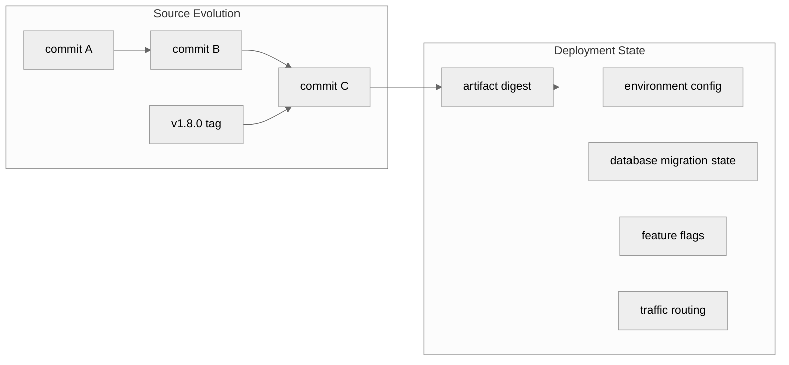
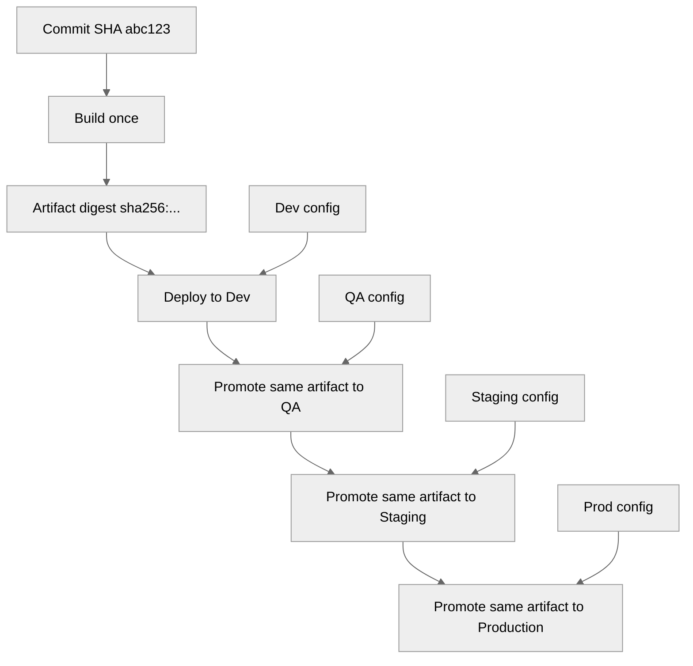
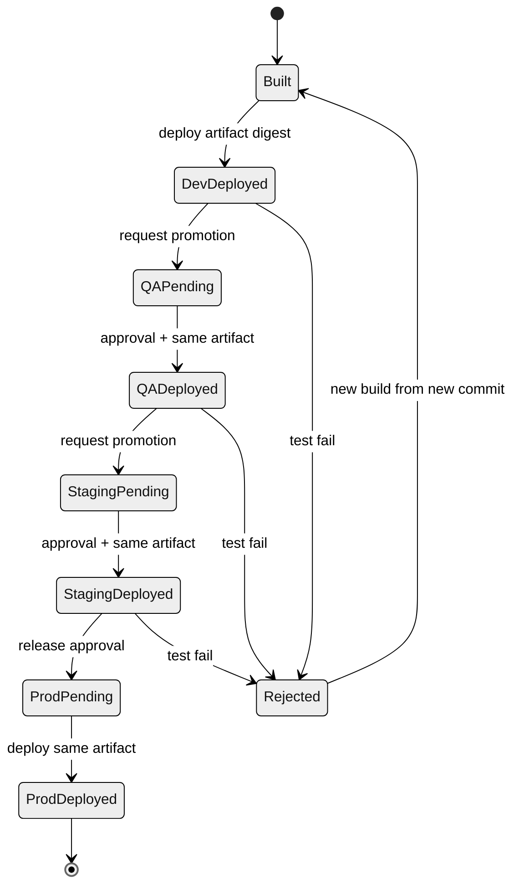
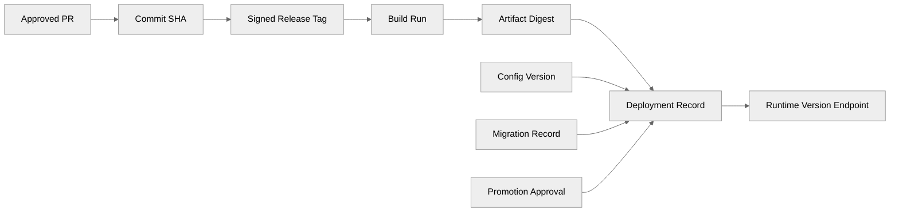

# Part 098 — Environment Branch Anti-Pattern

Banyak tim membuat branch seperti ini:

```text
dev
qa
staging
prod
```

Lalu mereka mendefinisikan pipeline:

```text
feature/* -> dev -> qa -> staging -> prod
```

Secara permukaan, ini terlihat masuk akal. Branch seolah mewakili environment. Merge dari `dev` ke `qa` berarti promote ke QA. Merge dari `staging` ke `prod` berarti deploy production.

Masalahnya: ini mencampur dua domain berbeda.

- **Git branch** adalah pointer ke commit dalam source history.
- **Environment** adalah runtime state: artifact, config, secrets, database state, traffic, infrastructure, feature flags, dan deployment metadata.

Jika environment dimodelkan sebagai branch, branch tidak lagi hanya menjawab “source code berubah bagaimana?”. Branch juga dipaksa menjawab “apa yang sedang berjalan di environment?”. Itu menciptakan ambiguity, drift, dan release risk.

Part ini membahas kenapa environment branch adalah anti-pattern, failure mode apa yang muncul, dan alternatif yang lebih defensible.

---

## 1. The Core Mistake

Environment branch anti-pattern terjadi saat branch dipakai sebagai proxy untuk deployment state.

Contoh:

```text
origin/dev      -> aplikasi di Dev environment
origin/qa       -> aplikasi di QA environment
origin/staging  -> aplikasi di Staging environment
origin/prod     -> aplikasi di Production environment
```

Masalahnya, branch hanya pointer:

```bash
git show-ref --heads
```

Output branch hanya memberi commit SHA. Ia tidak membuktikan:

- artifact mana yang dibangun,
- apakah artifact itu benar dari commit tersebut,
- config environment apa yang dipakai,
- secrets version mana yang aktif,
- database migration mana yang sudah jalan,
- feature flag mana yang ON,
- traffic routing mana yang aktif,
- apakah deploy berhasil penuh atau partial,
- apakah rollback terjadi setelah merge.

Jadi branch environment memberikan rasa kontrol, tetapi bukan model state yang lengkap.

---

## 2. Source Evolution vs Deployment State

Pisahkan dua hal ini:



Git source history adalah input. Environment state adalah hasil dari proses deployment yang memakai input itu plus banyak input lain.

Jika kamu memaksa branch menjadi environment state, kamu kehilangan variabel penting.

---

## 3. Why It Feels Attractive

Environment branch terasa menarik karena sederhana:

```bash
git merge dev qa
git merge qa staging
git merge staging prod
```

Orang bisa berkata:

> Yang sudah di `prod` branch berarti production.

Tetapi ini hanya benar jika:

- setiap merge langsung deploy,
- deploy selalu berhasil,
- tidak ada rollback manual,
- tidak ada config difference,
- tidak ada cherry-pick langsung ke prod,
- tidak ada hotfix di prod branch,
- tidak ada artifact rebuild nondeterministic,
- tidak ada database migration mismatch,
- tidak ada manual environment patch.

Di sistem nyata, asumsi ini sering salah.

---

## 4. Failure Mode 1: Branch Drift

Branch drift terjadi saat environment branches punya commit berbeda bukan karena release sequencing yang jelas, tetapi karena selective merge, cherry-pick, revert, atau conflict resolution lokal.

```mermaid
%%{init: {'theme': 'neutral'}}%%
gitGraph
  commit id: "A"
  branch dev
  checkout dev
  commit id: "B feature"
  commit id: "C feature"
  branch qa
  checkout qa
  merge dev id: "promote B+C"
  checkout dev
  commit id: "D new work"
  checkout qa
  commit id: "E QA-only fix"
  branch staging
  checkout staging
  merge qa id: "promote to staging"
  checkout qa
  commit id: "F QA tweak"
  checkout staging
  commit id: "G staging-only fix"
```

Sekarang pertanyaannya:

- Apakah `staging` adalah subset dari `qa`?
- Apakah `qa` adalah subset dari `dev`?
- Apakah fix `E`, `F`, `G` harus kembali ke `dev`?
- Apakah production nanti menerima `D` juga?

Ketika pertanyaan ini tidak bisa dijawab dengan cepat, environment branch sudah menjadi source of confusion.

---

## 5. Failure Mode 2: Promotion by Merge Changes the Code

Promosi seharusnya memindahkan artifact yang sama ke environment berikutnya.

Environment branch model sering melakukan ini:

```bash
git switch staging
git merge qa
# resolve conflicts
git push origin staging
```

Masalah: merge dapat membuat commit baru. Conflict resolution dapat mengubah source. Jadi “promote” bukan sekadar promote. Ia bisa menjadi **new code generation event**.

Ini sangat berbahaya.

Promotion yang sehat:

```text
Artifact X built once from commit C is deployed to dev, then qa, then staging, then prod.
```

Promotion yang buruk:

```text
Source branch qa merged into staging, conflict resolved, new commit S built into new artifact, then deployed.
```

Jika setiap environment build dari branch berbeda, kamu tidak mempromosikan artifact. Kamu membangun ulang variasi source.

---

## 6. Failure Mode 3: Hotfix Bypasses Lower Environments

Ketika production incident terjadi, tim sering commit langsung ke `prod` branch:

```bash
git switch prod
git switch -c hotfix/prod-auth-timeout
# fix
git merge hotfix/prod-auth-timeout
git push origin prod
```

Lalu hotfix harus balik ke:

- `staging`,
- `qa`,
- `dev`,
- `main`,
- feature branches terkait.

Sering kali tidak semua balik. Akibatnya bug yang sudah diperbaiki production muncul lagi ketika release berikutnya dari `dev` dipromosikan.

Ini bukan bug Git. Ini bug topology.

---

## 7. Failure Mode 4: Environment Config Leaks into Source Branches

Karena branch mewakili environment, tim tergoda menaruh config environment langsung di branch:

```text
application.yml
application-prod.yml
helm-values.yaml
terraform.tfvars
```

Lalu branch berbeda punya nilai berbeda:

```text
dev branch:     replicas: 1
staging branch: replicas: 2
prod branch:    replicas: 8
```

Masalah:

- merge antar branch membawa config environment yang salah,
- review source bercampur review config,
- secret placeholder bisa bocor,
- production config bisa tertimpa dev config,
- diff menjadi noise.

Config environment sebaiknya eksplisit sebagai data environment, bukan variasi source branch yang diam-diam diverge.

---

## 8. Failure Mode 5: Audit Trail Lies by Omission

Auditor bertanya:

> Versi apa yang berjalan di production pada 2026-07-07 pukul 10:00?

Tim menjawab:

```text
prod branch menunjuk ke commit abc123.
```

Jawaban itu belum cukup.

Pertanyaan lanjutan:

- artifact digest apa yang deploy?
- kapan build dibuat?
- build dibuat dari tree bersih atau dirty?
- dependency lockfile apa yang dipakai?
- config apa yang aktif?
- migration apa yang sudah dijalankan?
- siapa approve deploy?
- apakah ada rollback setelah merge?
- apakah branch `prod` pernah force-pushed?

Environment branch sering menyembunyikan data yang seharusnya menjadi deployment record.

---

## 9. Failure Mode 6: CI Result Is Not Comparable

Setiap branch punya CI:

```text
dev CI
qa CI
staging CI
prod CI
```

Tetapi jika branch berbeda source, hasil CI tidak selalu comparable.

Misalnya:

- `qa` punya conflict resolution yang tidak ada di `dev`,
- `staging` punya config branch khusus,
- `prod` punya cherry-pick hotfix,
- build job memakai secret berbeda,
- release tag tidak ada.

Ketika production gagal, sulit tahu apakah bug berasal dari:

- source commit,
- branch merge,
- environment config,
- artifact rebuild,
- migration state,
- dependency cache.

CI yang sehat menguji artifact/release candidate yang sama sepanjang pipeline, bukan variasi branch yang mirip.

---

## 10. The Correct Model: Immutable Artifact Promotion

Model yang lebih sehat:



Invariant:

```text
Promotion changes environment, not source.
```

Build once. Promote artifact. Record deployment.

Git branch/tag identifies source. Artifact digest identifies build output. Deployment record identifies environment state.

---

## 11. Better Git Topology

Alih-alih environment branches, gunakan source/release branches:

```text
main
feature/*
release/1.8.0        # optional, stabilization only
support/1.7          # optional, maintained old version
hotfix/*             # temporary branch from release tag/main
```

Deployment environments tidak menjadi branch source.

Environment state disimpan sebagai:

- deployment database,
- GitOps config path,
- release manifest,
- environment overlay,
- deployment tag/annotation,
- artifact registry metadata,
- Kubernetes/infra state,
- CI/CD run record.

---

## 12. Environment State as Data

Jika kamu perlu menyimpan desired state environment di Git, jangan langsung pakai branch per environment sebagai default. Pertimbangkan struktur path:

```text
infra/
  base/
    deployment.yaml
    service.yaml
  overlays/
    dev/
      kustomization.yaml
      values.yaml
    qa/
      kustomization.yaml
      values.yaml
    staging/
      kustomization.yaml
      values.yaml
    prod/
      kustomization.yaml
      values.yaml
```

Atau release manifest:

```yaml
service: case-management-api
environment: production
release: v1.8.0
source_commit: abc123def456
artifact: registry.example.com/case-api@sha256:9f...
config_version: prod-2026-07-07-001
migrations:
  applied_until: 202607070930_add_case_escalation_index
approved_by:
  - release-manager@example.com
  - security-owner@example.com
deployed_at: 2026-07-07T10:15:00+07:00
```

Ini lebih jujur daripada `prod` branch.

---

## 13. GitOps Nuance

GitOps sering membuat orang berkata:

> Bukankah environment state memang disimpan di Git?

Ya, tetapi hati-hati: menyimpan **desired environment state** di Git tidak berarti source code branch harus menjadi environment branch.

Model GitOps yang lebih jelas:

```text
app-repo:
  main
  release tags

config-repo:
  environments/dev/...
  environments/staging/...
  environments/prod/...
```

Atau mono config repo:

```text
clusters/
  dev/
  staging/
  prod/
apps/
  case-api/
    base/
    overlays/
```

Yang dipromosikan biasanya adalah perubahan manifest yang mengubah artifact digest, bukan merge source code antar environment branches.

Contoh PR promosi:

```diff
 image: registry.example.com/case-api@sha256:1111
+image: registry.example.com/case-api@sha256:2222
```

Ini jelas: environment prod bergerak dari artifact digest lama ke digest baru.

---

## 14. Environment Branch vs Release Branch

Jangan samakan `release/1.8.0` dengan `staging`.

| Branch | Meaning | Lifetime | Should contain environment config? |
|---|---|---:|---|
| `release/1.8.0` | source stabilization for version 1.8.0 | temporary | no, except release metadata if needed |
| `support/1.8` | maintenance line for version 1.8.x | long-lived | no |
| `staging` branch | environment runtime proxy | usually long-lived | often yes, and that is the problem |
| config path `environments/staging` | desired state for staging | long-lived | yes, explicitly |

Release branch is about **source version boundary**.

Environment state is about **deployment target boundary**.

---

## 15. Safer Promotion Pipeline

A good pipeline looks like this:



Perhatikan: jika test gagal di QA, kamu tidak memperbaiki langsung di `qa` branch. Kamu membuat commit baru di source branch yang benar, build artifact baru, lalu mempromosikan ulang.

---

## 16. How to Track “What Is in Prod?” Without `prod` Branch

Gunakan deployment records.

Minimal:

```bash
# artifact contains source metadata
case-api --version
```

Output:

```text
version: 1.8.0
commit: abc123def456
branch: main
tag: v1.8.0
build_time: 2026-07-07T08:30:00+07:00
artifact_digest: sha256:9f...
dirty: false
```

Deployment database:

```sql
select service, environment, version, commit_sha, artifact_digest, deployed_at
from deployments
where environment = 'production'
order by deployed_at desc
limit 10;
```

Atau Git tag/notes for deployment events:

```bash
git tag -a deploy/prod/case-api/2026-07-07T101500 v1.8.0 \
  -m "Deploy case-api v1.8.0 to prod, artifact sha256:9f..."
```

Hati-hati: deployment tags bisa banyak dan perlu namespace/protection. Untuk banyak service, deployment DB biasanya lebih cocok.

---

## 17. What About Config Differences?

Environment berbeda memang butuh config berbeda.

Yang salah bukan “config berbeda”. Yang salah adalah menyembunyikan perbedaan itu dalam branch source yang diverge.

Lebih baik:

```text
config/
  base.yml
  env/
    dev.yml
    qa.yml
    staging.yml
    prod.yml
```

Atau external config management:

- parameter store,
- secret manager,
- Kubernetes config/secret,
- feature flag service,
- environment variables,
- deployment manifest overlays.

Prinsipnya:

```text
Same artifact, different environment configuration, explicit and auditable.
```

Bukan:

```text
Different source branch, maybe different artifact, maybe different config.
```

---

## 18. Migration from Environment Branches

Migrasi harus hati-hati karena branch environment sering sudah menjadi proses organisasi.

### Step 1 — Inventory Current Branches

```bash
git fetch --all --prune

git for-each-ref refs/remotes/origin \
  --format='%(refname:short) %(objectname:short) %(committerdate:iso8601)'
```

Catat:

- branch mana environment,
- commit tip masing-masing,
- divergence antar branch,
- apakah ada environment-only commit,
- apakah ada config-only commit,
- apakah ada hotfix yang belum balik.

### Step 2 — Compute Divergence

```bash
git log --oneline --left-right --cherry-pick origin/dev...origin/qa
git log --oneline --left-right --cherry-pick origin/qa...origin/staging
git log --oneline --left-right --cherry-pick origin/staging...origin/prod
```

Tujuan: tahu commit mana hanya ada di environment tertentu.

### Step 3 — Classify Unique Commits

Untuk setiap commit unik:

| Type | Action |
|---|---|
| real product fix | cherry-pick/merge ke `main` melalui PR |
| environment config | pindahkan ke config repo/path |
| temporary debug | drop atau dokumentasikan |
| secret/config leak | rotate/rewrite sesuai incident policy |
| release metadata | pindahkan ke release manifest |

### Step 4 — Create Source Truth

Pilih source branch utama:

```text
main
```

Lalu pastikan production source state tercermin di tag/commit yang jelas.

```bash
git switch main
git pull --ff-only
# integrate missing production fixes intentionally
git tag -a migration-prod-baseline-2026-07-07 -m "Baseline after retiring prod branch model"
```

### Step 5 — Introduce Artifact Promotion

Pipeline baru:

```text
merge to main -> build artifact -> deploy dev -> promote same artifact -> qa -> staging -> prod
```

Catat artifact digest dan commit SHA.

### Step 6 — Freeze Environment Branches

Jangan langsung delete jika masih dipakai pipeline lama.

Policy:

```text
From 2026-08-01:
- dev/qa/staging/prod branches are read-only.
- New product changes target main.
- Environment changes go to config repo/path.
- Deployment promotion uses artifact digest.
- Branches will be deleted after 60 days of no pipeline dependency.
```

### Step 7 — Delete or Archive

Setelah aman:

```bash
git push origin --delete dev qa staging prod
```

Atau rename menjadi archive refs jika hosting mendukung policy internal.

---

## 19. Policy Template

```yaml
source_control_policy:
  forbidden_branch_roles:
    - environment_runtime_state

  forbidden_branch_names_for_source_repo:
    - dev
    - qa
    - staging
    - prod
    - production

  allowed_long_lived_branches:
    - main
    - support/*

  allowed_temporary_branches:
    - feature/*
    - bugfix/*
    - hotfix/*
    - release/*

  release_identity:
    source: immutable_tag_or_commit_sha
    artifact: digest_required
    build_once: true
    promote_same_artifact: true

  environment_state:
    stored_in:
      - deployment_records
      - config_repo_or_config_path
      - artifact_registry_metadata
    must_include:
      - service
      - environment
      - source_commit
      - source_tag
      - artifact_digest
      - config_version
      - deployment_time
      - approver
```

---

## 20. CI/CD Gate Examples

### Gate: prevent branch named environment in app repo

```bash
#!/usr/bin/env bash
set -euo pipefail

branch="${GITHUB_HEAD_REF:-${GITHUB_REF_NAME:-}}"

case "$branch" in
  dev|qa|test|staging|stage|prod|production)
    echo "ERROR: environment-named source branches are forbidden: $branch" >&2
    echo "Use main/release/support branches for source, and deployment records/config paths for environments." >&2
    exit 1
    ;;
esac
```

### Gate: require artifact digest for deploy

```bash
#!/usr/bin/env bash
set -euo pipefail

: "${ARTIFACT_DIGEST:?ARTIFACT_DIGEST is required}"
: "${SOURCE_COMMIT:?SOURCE_COMMIT is required}"

if [[ ! "$ARTIFACT_DIGEST" =~ ^sha256:[a-f0-9]{64}$ ]]; then
  echo "ERROR: deploy must use immutable sha256 artifact digest" >&2
  exit 1
fi

git rev-parse --verify "$SOURCE_COMMIT^{commit}" >/dev/null
```

### Gate: runtime version endpoint

Every production service should expose enough metadata:

```json
{
  "service": "case-management-api",
  "version": "1.8.0",
  "sourceCommit": "abc123def456",
  "sourceTag": "v1.8.0",
  "artifactDigest": "sha256:9f...",
  "buildTime": "2026-07-07T08:30:00+07:00",
  "dirty": false
}
```

This makes production state observable without abusing Git branches.

---

## 21. Environment Branches in Config Repositories: Still Bad?

Sometimes teams keep separate branches in a config repo:

```text
config repo:
  dev
  staging
  prod
```

This is less bad than source repo environment branches, but still often problematic.

Risks:

- config drift hidden across branches,
- promotion by merge can change config unexpectedly,
- hotfix to prod config not propagated,
- review cannot compare all environments easily,
- branch protection differs.

Prefer directory-based environment separation unless there is a strong reason:

```text
config repo main:
  environments/dev
  environments/staging
  environments/prod
```

Then PR diff shows exactly which environment changes.

But there are exceptions: some GitOps tools support branch-per-environment workflows. If you use that, enforce strict policy:

- no source code in config branches,
- promotion commits only update artifact digest/config version,
- no manual merge conflict resolution without review,
- deployment controller records actual sync state,
- branch protection per environment,
- automated drift detection.

Do not confuse “tool supports it” with “model is safe by default”.

---

## 22. Regulatory Systems Perspective

For regulatory or enforcement lifecycle systems, environment branch anti-pattern is especially dangerous because it blurs evidence.

A defensible deployment record should answer:

- What change was approved?
- Which commit introduced it?
- Which artifact was built?
- Which artifact was deployed?
- Which environment received it?
- Which configuration was active?
- Which migration was applied?
- Who approved promotion?
- What rollback path exists?

A branch called `prod` cannot answer those alone.

Better evidence chain:



This chain is stronger than:

```text
prod branch points to abc123
```

---

## 23. Practical Replacement Patterns

### Pattern A — Simple SaaS Service

```text
main
feature/*
hotfix/*
release tags
```

Pipeline:

```text
main commit -> build artifact -> deploy dev automatically -> promote to staging -> promote to prod
```

Use feature flags for incomplete work.

### Pattern B — Release Candidate Flow

```text
main
release/1.8.0
support/1.7
```

Pipeline:

```text
release/1.8.0 -> RC artifact -> staging/UAT -> final tag -> prod
```

Still no `staging` branch.

### Pattern C — GitOps Config Repo

```text
app repo:
  main
  tags

config repo:
  main
  environments/dev/app.yaml
  environments/staging/app.yaml
  environments/prod/app.yaml
```

Promotion PR changes image digest in target environment path.

### Pattern D — Multi-Service Platform

```text
service repos:
  main + tags

release manifest repo:
  releases/2026-07-07.yaml
  environments/prod/current.yaml
```

Manifest pins every service artifact digest.

---

## 24. Checklist: Are You in the Anti-Pattern?

You likely have environment branch anti-pattern if:

- branches are named `dev`, `qa`, `staging`, `prod`,
- merge from one branch to another means deploy,
- branch contains environment-specific config,
- production hotfix is committed directly to `prod`,
- release artifact is rebuilt separately per environment,
- lower environment and production may run different commit for same “version”,
- rollback is done by reverting/merging branch instead of redeploying known artifact,
- no deployment record exists beyond branch tip,
- it is hard to answer what artifact digest is running in prod,
- promotion requires resolving Git conflicts.

If promotion requires Git conflict resolution, you are not promoting. You are developing.

---

## 25. Summary

Environment branches confuse source history with runtime state.

Git branch is good at representing:

- line of development,
- release stabilization,
- maintenance version,
- temporary feature/hotfix work.

Git branch is bad at representing full environment state because environment includes artifact, config, secret, database, infrastructure, traffic, flags, and deployment result.

The safer model:

```text
Use Git branches/tags for source identity.
Use immutable artifact digests for build identity.
Use deployment records/config paths for environment state.
Promote the same artifact across environments.
```

The invariant to remember:

```text
Promotion should not create new source history.
```

If moving from QA to staging requires a merge commit, you have already mixed deployment with development.

---

## References

- Git documentation — `git branch`: https://git-scm.com/docs/git-branch
- Git documentation — `git tag`: https://git-scm.com/docs/git-tag
- Git documentation — `git merge`: https://git-scm.com/docs/git-merge
- Thoughtworks — Enabling Trunk Based Development with Deployment Pipelines: https://www.thoughtworks.com/insights/blog/enabling-trunk-based-development-deployment-pipelines
- Codefresh — Stop Using Branches for Deploying to Different GitOps Environments: https://codefresh.io/blog/stop-using-branches-deploying-different-gitops-environments/
- Martin Fowler — Patterns for Managing Source Code Branches: https://martinfowler.com/articles/branching-patterns.html
- Trunk Based Development: https://trunkbaseddevelopment.com/
