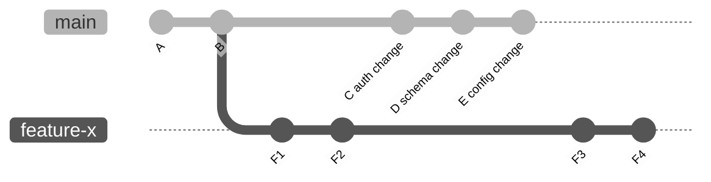
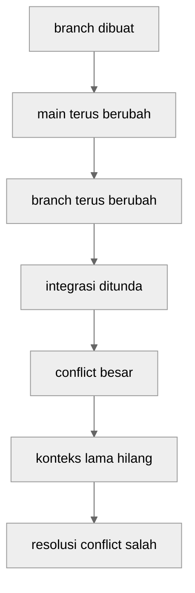
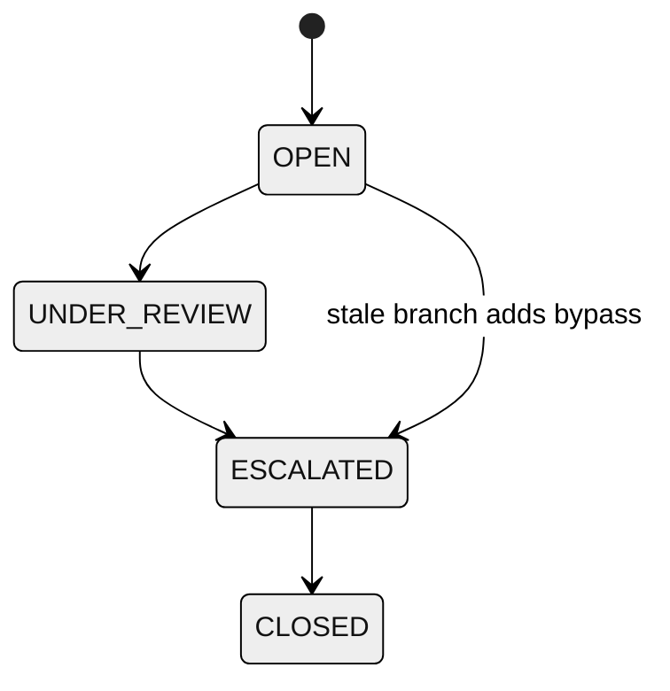

# Part 099 — Long-Lived Branch Risk Model

Long-lived branch bukan otomatis salah.

Maintenance branch, support branch, release stabilization branch, atau customer patch branch kadang memang perlu hidup lama. Masalah muncul ketika long-lived branch dipakai sebagai tempat development aktif yang terus menjauh dari integration line, tetapi tim memperlakukannya seolah risikonya masih sama seperti branch umur dua hari.

Mental model yang perlu dipegang:

> Long-lived branch adalah inventory of unintegrated assumptions.

Semakin lama branch hidup, semakin banyak asumsi di dalamnya yang belum dibuktikan terhadap realitas terbaru: kode terbaru, test terbaru, schema terbaru, dependency terbaru, security policy terbaru, deployment pipeline terbaru, dan keputusan domain terbaru.

Part ini membangun risk model untuk long-lived branch: bagaimana mengukur risikonya, failure mode apa yang biasa muncul, kapan branch masih justified, dan bagaimana menurunkan risiko tanpa sekadar berkata “sering-sering merge main”.

---

## 1. Branch Age Is Not Just Calendar Time

Umur branch bukan hanya jumlah hari sejak dibuat.

Branch bisa berumur 2 minggu tapi aman jika perubahan kecil, terus tervalidasi, dan dekat dengan trunk. Sebaliknya branch 3 hari bisa berisiko tinggi jika menyentuh schema, authorization, dependency, dan deployment pipeline sekaligus.

Gunakan beberapa dimensi sekaligus:

| Dimension | Meaning | Signal |
|---|---|---|
| Calendar age | Berapa lama branch hidup | `committerdate`, branch creation approximation |
| Commit distance | Berapa commit branch tertinggal/maju dari base | `rev-list --left-right --count` |
| File overlap | Seberapa banyak branch menyentuh area yang juga berubah di trunk | `git diff --name-only`, churn report |
| Domain criticality | Apakah area menyentuh auth, billing, case lifecycle, audit, release | CODEOWNERS / path registry |
| Dependency drift | Apakah dependency/schema/config berubah di trunk | path audit |
| Test drift | Apakah tests berubah sejak branch dibuat | test path diff |
| Review drift | Apakah reviewer/context berubah | ownership and PR comments |
| Release exposure | Apakah branch menargetkan release dekat | tag/release calendar |

Long-lived branch risk adalah kombinasi semua ini.

---

## 2. Graph Model: Integration Debt Accumulates Silently

Misalkan `main` terus bergerak, sementara feature branch tetap hidup.



Di branch `feature-x`, developer melihat history lokal yang tampak stabil:

```text
A - B - F1 - F2 - F3 - F4
```

Tetapi integration reality adalah:

```text
main has C, D, E that feature-x has never proven against.
```

Git tidak menampilkan “semantic debt” ini sebagai error sampai integrasi dilakukan.

Itulah bahaya utama long-lived branch: risiko disembunyikan, bukan dihilangkan.

---

## 3. The Risk Equation

Tidak perlu menjadikan ini formula matematis kaku. Gunakan sebagai reasoning aid.

```text
Long-lived branch risk
  = divergence
  × touched-surface criticality
  × integration delay
  × uncertainty of verification
  × number of consumers depending on the branch
```

Versi operasional:

```text
risk(branch) = graph drift + semantic drift + validation drift + ownership drift
```

Dimana:

- **graph drift**: branch semakin jauh dari main secara commit graph,
- **semantic drift**: aturan bisnis berubah di main,
- **validation drift**: test, pipeline, dan environment berubah,
- **ownership drift**: orang yang tahu konteks tidak lagi aktif atau tidak lagi ingat detailnya.

Yang berbahaya bukan hanya conflict. Yang lebih buruk adalah branch merge tanpa conflict, tetapi menghasilkan sistem yang salah secara domain.

---

## 4. Failure Mode 1: Conflict Debt

Conflict debt adalah akumulasi resolusi yang ditunda.

Branch kecil yang sering diintegrasikan membayar conflict sedikit demi sedikit. Long-lived branch menunda pembayaran hingga jumlah conflict lebih besar dan konteks lebih kabur.



Conflict besar memperburuk kualitas keputusan karena resolver cenderung fokus pada “make Git green”, bukan “apakah behavior gabungan benar?”.

### Signal

```bash
git fetch origin
git merge-tree $(git merge-base HEAD origin/main) HEAD origin/main
```

Atau lakukan dry-run integration di throwaway branch:

```bash
git switch -c tmp/integration-check

git merge --no-commit --no-ff origin/main
# inspect conflicts, run tests, then abort/reset

git merge --abort
```

Jika konflik besar muncul setelah branch lama tidak diintegrasikan, masalahnya bukan conflict itu sendiri. Masalahnya adalah integration feedback terlambat.

---

## 5. Failure Mode 2: Semantic Drift Without Text Conflict

Git conflict hanya mendeteksi ambiguity pada level merge text/tree. Ia tidak tahu apakah perubahan gabungan melanggar invariant bisnis.

Contoh:

- Branch A menambah status `ESCALATED` pada case lifecycle.
- Main mengubah rule: semua transition harus melewati `UNDER_REVIEW`.
- Merge tidak conflict karena file berbeda.
- Runtime behavior salah karena state machine sekarang punya bypass path.



Git tidak bisa membuktikan domain invariant.

### Mitigation

Untuk branch yang menyentuh domain critical path, wajib ada semantic validation:

- state-machine tests,
- migration compatibility tests,
- permission matrix tests,
- API contract tests,
- event compatibility tests,
- release-range regression test.

Jangan jadikan “merge clean” sebagai bukti branch aman.

---

## 6. Failure Mode 3: Stale Assumptions

Long-lived branch sering membawa asumsi lama:

- API internal belum berubah,
- schema belum berubah,
- feature flag masih bernama sama,
- default config masih sama,
- deployment pipeline masih sama,
- owner file masih orang yang sama,
- performance envelope masih sama,
- business rule belum diperbarui.

Stale assumption sulit terlihat di diff karena diff hanya menunjukkan perubahan branch, bukan asumsi yang sudah kadaluarsa.

### Practical Check

Cari file yang berubah di main sejak branch fork point:

```bash
base=$(git merge-base HEAD origin/main)

git diff --name-only "$base"..origin/main > /tmp/main-changes.txt
git diff --name-only "$base"..HEAD > /tmp/branch-changes.txt

comm -12 \
  <(sort /tmp/main-changes.txt) \
  <(sort /tmp/branch-changes.txt)
```

File overlap adalah sinyal awal, bukan satu-satunya risiko. Untuk domain systems, path berbeda pun bisa saling bergantung.

---

## 7. Failure Mode 4: Review Collapse

Branch yang terlalu lama biasanya menghasilkan PR besar.

PR besar membuat reviewer melakukan scanning, bukan reasoning.

Symptoms:

- reviewer hanya komentar style,
- migration tidak dibaca detail,
- generated files menutup semantic diff,
- test changes tidak dikaitkan dengan behavior,
- commit history tidak membantu narasi,
- reviewer approve karena fatigue.

### Reviewability Budget

Sebuah branch sebaiknya punya review budget eksplisit:

| Risk Level | Suggested Shape |
|---|---|
| Low-risk UI copy / small refactor | 1 PR, small commit set |
| Medium feature | stacked PR atau phased PR |
| Schema/API/security change | design PR + implementation PR + migration PR |
| Release-critical change | isolated branch, explicit test evidence, owner approval |
| Regulated workflow change | traceability matrix + audit evidence |

Jika branch sudah tidak bisa direview sebagai satu unit, itu bukan lagi satu branch yang sehat. Itu backlog yang kebetulan berada di satu ref.

---

## 8. Failure Mode 5: Hidden Release Train

Long-lived feature branch kadang berubah menjadi release train informal.

Tanda-tandanya:

- banyak orang commit ke branch yang sama,
- branch punya “mini-main”,
- branch punya QA cycle sendiri,
- branch punya hotfix sendiri,
- branch punya release notes sendiri,
- branch merge ke main dianggap big-bang event.

Ini bukan feature branch lagi. Ini parallel integration line.

Jika memang butuh parallel integration line, treat it explicitly:

- beri owner,
- beri branch protection,
- beri CI penuh,
- beri merge policy,
- beri release policy,
- beri sunset date,
- beri sync protocol,
- beri rollback plan.

Jangan menjalankan release train tersembunyi tanpa governance.

---

## 9. Failure Mode 6: False Sense of Safety from “Keeping Up to Date”

Banyak tim berkata:

```text
Tidak apa-apa branch lama, yang penting sering merge main.
```

Itu membantu, tetapi tidak cukup.

Merging main into branch mengurangi graph drift, tetapi tidak otomatis mengurangi:

- review size,
- stale design,
- ownership drift,
- hidden feature coupling,
- release uncertainty,
- semantic incompatibility,
- audit ambiguity.

Selain itu, repeated merge-from-main membuat branch history penuh merge commits yang sulit dibaca, terutama jika conflict resolution berulang tidak terdokumentasi.

Alternatif yang lebih sehat:

- pecah branch menjadi smaller integration units,
- gunakan feature flags,
- gunakan branch by abstraction,
- gunakan stacked PR,
- merge vertical slices ke trunk,
- gunakan release branch hanya untuk stabilization, bukan active feature development.

---

## 10. Measuring Branch Drift

### Ahead/behind count

```bash
git fetch origin

git rev-list --left-right --count origin/main...HEAD
```

Output:

```text
12 7
```

Interpretasi umum:

```text
12 commits reachable from origin/main but not HEAD
7 commits reachable from HEAD but not origin/main
```

### Fork point

```bash
git merge-base HEAD origin/main
```

### Branch age approximation

Git tidak menyimpan creation time branch secara portable. Gunakan reflog lokal jika tersedia:

```bash
git reflog show --date=iso my-branch | tail -1
```

Untuk remote branch, gunakan commit time dari earliest branch-only commit sebagai approximation:

```bash
base=$(git merge-base origin/main HEAD)

git log --reverse --format='%h %ci %s' "$base"..HEAD | head -1
```

### Files changed by branch

```bash
base=$(git merge-base HEAD origin/main)

git diff --name-status "$base"..HEAD
```

### Sensitive surface touched

```bash
base=$(git merge-base HEAD origin/main)

git diff --name-only "$base"..HEAD \
  | grep -E '(^auth/|^security/|^db/migration|^infra/|^\.github/workflows/)'
```

### Integration preview

```bash
git switch -c tmp/check-merge origin/main

git merge --no-commit --no-ff HEAD@{1}
# run targeted checks

git merge --abort || git reset --hard origin/main
```

Use throwaway branch. Jangan eksperimen integrasi destructive di branch kerja utama.

---

## 11. Risk Classification

Contoh klasifikasi yang bisa dipakai di engineering handbook:

| Branch Condition | Risk | Required Control |
|---|---:|---|
| < 2 days old, < 5 commits, no critical paths | Low | normal PR |
| > 5 days old or > 20 files changed | Medium | update from main + targeted tests |
| > 10 days old or touches schema/auth/CI | High | owner review + integration branch + full CI |
| > 20 days old or multi-team dependency | Critical | split plan / design review / explicit release plan |
| hidden release train | Critical | formalize or stop |

Threshold tidak universal. Yang penting: tim punya batas eksplisit, bukan judgment ad hoc.

---

## 12. When Long-Lived Branches Are Legitimate

Long-lived branch bisa justified jika branch tersebut bukan sekadar feature branch yang telat selesai.

Legitimate cases:

### 12.1 Maintenance branch

```text
release/1.8.x
release/1.9.x
```

Tujuannya menjaga supported release line. Perubahan harus selektif, minimal, dan auditable.

### 12.2 Release stabilization branch

```text
release/2.4.0
```

Tujuannya menstabilkan release candidate. Branch harus punya freeze rule dan final tag.

### 12.3 Customer-specific branch

Hanya jika produk memang punya contractual/customized deployment model. Risiko ownership dan backport harus eksplisit.

### 12.4 Large migration branch with explicit integration strategy

Misalnya migrasi framework besar. Tetapi branch seperti ini tetap perlu split, flags, compatibility layer, dan regular integration proof.

### 12.5 Experimental branch

Boleh lama jika tidak diperlakukan sebagai soon-to-merge branch. Kalau nanti dipromosikan, harus dipecah atau direview ulang.

---

## 13. When Long-Lived Branches Are a Smell

Long-lived branch adalah smell jika:

- branch dipakai karena tim takut merge main,
- branch menampung banyak unrelated changes,
- branch punya QA cycle sendiri tanpa release policy,
- branch target-nya terus berubah,
- branch tidak punya owner tunggal,
- branch hanya bisa dipahami oleh satu orang,
- branch tidak punya sunset date,
- branch tidak punya integration proof terhadap trunk,
- branch selalu “hampir selesai” selama berminggu-minggu.

Kalimat berbahaya:

```text
Nanti kita merge semuanya di akhir.
```

Itu biasanya berarti risiko integrasi sedang dikapitalisasi diam-diam.

---

## 14. Mitigation Strategy

### 14.1 Shorten branch lifetime

Default paling kuat: integrasikan lebih sering ke trunk/main.

Gunakan:

- small PR,
- feature flag,
- branch by abstraction,
- incremental schema migration,
- compatibility adapter,
- hidden UI path,
- dead-code removal phase terpisah.

### 14.2 Split by invariant boundary

Jangan split hanya berdasarkan file. Split berdasarkan invariant:

```text
1. introduce compatibility layer
2. add new behavior behind flag
3. migrate callers incrementally
4. switch default
5. remove old path
```

### 14.3 Use stacked branches intentionally

Untuk dependency chain yang nyata:

```text
main
  └── stack/001-api-contract
        └── stack/002-storage-change
              └── stack/003-ui-flow
```

Setiap stack layer harus reviewable dan mergeable.

### 14.4 Keep branch private until it is ready for public coordination

Private rewrite boleh. Public branch harus punya protocol.

### 14.5 Create integration branch only as temporary proof branch

```bash
git switch -c integration/feature-x origin/main
git merge --no-ff feature-x
```

Integration branch bukan tempat development baru. Ia tempat membuktikan hasil integrasi.

---

## 15. Long-Lived Branch Triage Playbook

Saat menemukan branch lama, jangan langsung delete atau merge.

### Step 1 — Identify purpose

```bash
git branch --show-current
git log --oneline --decorate --max-count=20
```

Tanyakan:

- branch ini feature, release, maintenance, experiment, atau abandoned?
- siapa owner-nya?
- apakah ada PR?
- apakah ada deployment dari branch ini?
- apakah ada customer/release dependency?

### Step 2 — Compute divergence

```bash
git fetch origin

git rev-list --left-right --count origin/main...HEAD
```

### Step 3 — Identify touched surfaces

```bash
base=$(git merge-base HEAD origin/main)

git diff --stat "$base"..HEAD
git diff --name-only "$base"..HEAD
```

### Step 4 — Compare with main changes

```bash
git diff --name-only "$base"..origin/main > /tmp/main.txt
git diff --name-only "$base"..HEAD > /tmp/branch.txt
comm -12 <(sort /tmp/main.txt) <(sort /tmp/branch.txt)
```

### Step 5 — Decide path

| Finding | Action |
|---|---|
| abandoned | archive/delete after owner confirmation |
| small and relevant | rebase/merge, test, PR |
| large but separable | split into stack/slices |
| release/maintenance | apply branch policy |
| risky and unclear | do not merge; require design/review |
| contains secrets | incident response first |

---

## 16. Policy Example

```md
# Branch Lifetime Policy

- Feature branches should target merge within 2-5 working days.
- Branches older than 7 days must be rebased or integration-tested against main.
- Branches older than 14 days require owner acknowledgement and split/merge plan.
- Branches touching auth, data migration, CI/CD, production config, or regulatory workflow require explicit owner review regardless of age.
- Branches older than 30 days are considered stale unless classified as release, maintenance, support, or experiment.
- Hidden release-train branches are prohibited unless formalized with protection, CI, owner, and sunset date.
```

The goal is not bureaucracy. The goal is preventing invisible risk from accumulating without a decision.

---

## 17. Automation: Branch Risk Report

Example shell sketch:

```bash
#!/usr/bin/env bash
set -euo pipefail

base_branch=${1:-origin/main}

git fetch origin --prune

for branch in $(git for-each-ref --format='%(refname:short)' refs/remotes/origin | grep -v 'origin/HEAD'); do
  if [ "$branch" = "$base_branch" ]; then
    continue
  fi

  base=$(git merge-base "$base_branch" "$branch" || true)
  if [ -z "$base" ]; then
    echo "$branch no-merge-base"
    continue
  fi

  counts=$(git rev-list --left-right --count "$base_branch...$branch")
  files=$(git diff --name-only "$base..$branch" | wc -l | tr -d ' ')
  last_commit=$(git log -1 --format='%ci' "$branch")

  printf '%s | divergence=%s | files=%s | last_commit=%s\n' \
    "$branch" "$counts" "$files" "$last_commit"
done
```

Improve it by adding:

- sensitive path detection,
- PR link detection from hosting API,
- owner lookup from CODEOWNERS,
- release branch whitelist,
- stale branch SLA,
- report to Slack/email.

---

## 18. Regulated System Lens

Untuk regulatory systems, long-lived branch risk lebih besar karena perubahan sering terkait:

- case lifecycle state machine,
- enforcement decision path,
- notification obligations,
- statutory deadlines,
- audit logs,
- permission matrix,
- evidence retention,
- approval workflow,
- data migration.

Branch lama yang menyentuh domain ini harus menjawab:

```text
Apakah perubahan ini masih valid terhadap policy dan rule terbaru?
Apakah review dilakukan oleh owner yang benar?
Apakah test evidence masih relevan?
Apakah release notes menjelaskan impact lintas entity?
Apakah rollback/revert bisa dilakukan tanpa merusak audit trail?
```

Jika jawabannya tidak jelas, branch belum siap merge.

---

## 19. Mental Checklist

Sebelum merge long-lived branch, tanyakan:

- Apa merge base-nya?
- Berapa jauh branch tertinggal dari main?
- Area apa yang berubah di main sejak branch dibuat?
- Apakah branch menyentuh sensitive paths?
- Apakah diff masih reviewable?
- Apakah branch membawa unrelated changes?
- Apakah tests di branch masih mencerminkan pipeline terbaru?
- Apakah migration/config/dependency sudah divalidasi terhadap main?
- Apakah branch perlu di-split?
- Apakah ada release/customer dependency?
- Apakah ada audit evidence untuk decision penting?
- Apakah revert strategy jelas?

---

## 20. Exercise

Ambil satu branch lama di repository nyata atau sandbox.

1. Cari merge base terhadap main.
2. Hitung ahead/behind.
3. List file yang berubah di branch.
4. List file yang berubah di main sejak fork point.
5. Cari overlap.
6. Tandai sensitive paths.
7. Jalankan integration preview di temporary branch.
8. Buat risk report singkat.
9. Putuskan: merge, rebase, split, archive, atau formalize as release/maintenance branch.

Deliverable:

```md
# Long-Lived Branch Risk Report

Branch:
Owner:
Purpose:
Merge base:
Ahead/behind:
Touched surfaces:
Sensitive paths:
Conflict preview:
Semantic risks:
Recommended action:
Exit criteria:
```

---

## 21. Key Takeaways

Long-lived branch bukan sekadar branch yang lama. Ia adalah tempat asumsi tidak terintegrasi menumpuk.

Risiko utamanya bukan conflict. Conflict hanya gejala yang terlihat. Risiko yang lebih berbahaya adalah semantic drift, stale validation, review collapse, hidden release train, dan audit ambiguity.

Branch lama boleh ada jika tujuannya eksplisit: maintenance, release stabilization, support, experiment, atau migration dengan strategy. Branch lama berbahaya jika ia hanya feature branch yang gagal dipotong kecil.

Engineer senior tidak hanya tahu cara merge branch lama. Engineer senior tahu kapan branch lama harus dipotong, diformalkan, dihapus, atau ditahan sampai risk model-nya jelas.

---

## References

- Git Documentation — `gitworkflows`: https://git-scm.com/docs/gitworkflows
- Git Documentation — `git-branch`: https://git-scm.com/docs/git-branch
- Git Documentation — `git-merge-base`: https://git-scm.com/docs/git-merge-base
- Git Documentation — `git-rev-list`: https://git-scm.com/docs/git-rev-list
- Git Documentation — `git-log`: https://git-scm.com/docs/git-log
- Pro Git — Branching Workflows: https://git-scm.com/book/en/v2/Git-Branching-Branching-Workflows
