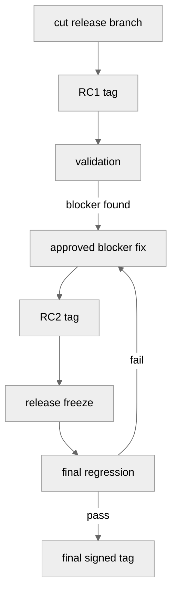
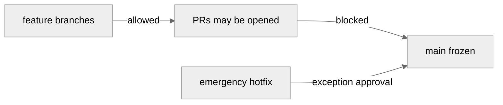
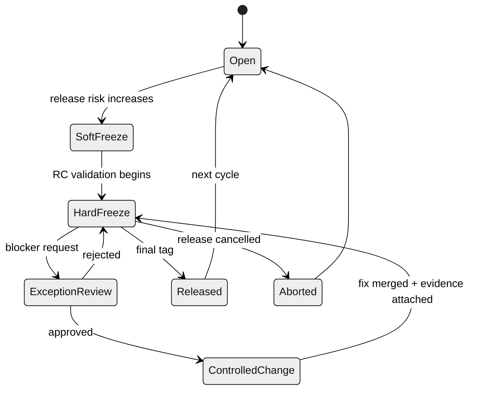
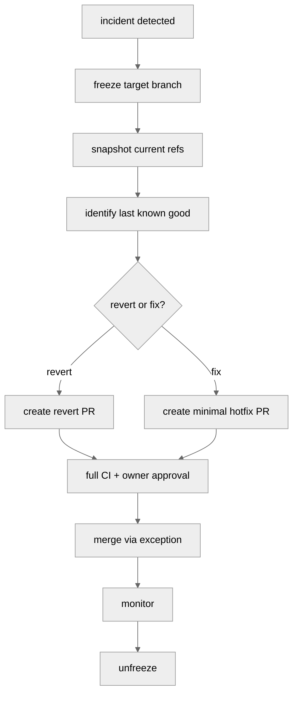

# Part 100 — Code Freeze, Release Freeze, and Branch Freeze

“Freeze” sering dipakai sebagai kata tunggal, padahal ada beberapa jenis freeze yang mengontrol risiko berbeda.

Tim sering berkata:

```text
Kita freeze dulu.
```

Tetapi tidak jelas freeze apa:

- freeze semua commit?
- freeze branch release?
- freeze merge ke main?
- freeze dependency update?
- freeze database migration?
- freeze feature scope?
- freeze deployment?
- freeze config production?
- freeze tag release?

Jika freeze tidak didefinisikan, ia berubah menjadi ritual. Orang tetap melakukan perubahan, tetapi lewat jalur tidak resmi. Akibatnya risiko tidak hilang; hanya menjadi tidak terlihat.

Part ini membedakan **code freeze**, **release freeze**, dan **branch freeze**, lalu memperluasnya ke config/dependency/schema freeze. Fokusnya adalah membuat freeze menjadi control yang jelas: apa yang dihentikan, apa yang masih boleh, siapa yang bisa memberi exception, bagaimana evidence dicatat, dan kapan freeze selesai.

---

## 1. Freeze Is a Risk Control, Not a Calendar Event

Freeze bukan tujuan. Freeze adalah mekanisme mengurangi perubahan pada surface tertentu agar verification bisa mengejar reality.

Kalimat yang lebih benar:

```text
We freeze X so that Y can be verified before Z happens.
```

Contoh:

```text
We freeze release branch changes so that RC2 can complete regression testing before final tag.
```

atau:

```text
We freeze schema migrations so that rollback and data compatibility can be verified before production deployment.
```

Freeze yang baik selalu punya:

- scope,
- start condition,
- allowed changes,
- forbidden changes,
- exception process,
- approver,
- verification requirement,
- end condition,
- evidence record.

---

## 2. Three Core Freeze Types

| Freeze Type | What It Controls | Typical Purpose |
|---|---|---|
| Code freeze | new feature/code change intake | stabilize behavior before release |
| Release freeze | changes to a specific release candidate/release branch | protect release candidate validation |
| Branch freeze | mutation of a specific Git ref/branch | prevent accidental or unauthorized branch movement |

Mereka bisa overlap, tetapi tidak sama.

---

## 3. Code Freeze

Code freeze membatasi perubahan kode yang masuk ke integration line atau release scope.

Tujuannya:

- menghentikan feature scope growth,
- memberi waktu regression testing,
- menurunkan perubahan tak terduga,
- memaksa tim fokus pada blocker,
- menstabilkan release candidate.

Contoh policy:

```md
# Code Freeze Policy

During code freeze:

Allowed:
- blocker bug fixes approved by release owner
- test fixes required to validate release
- documentation corrections for release-critical behavior
- observability fixes needed for launch readiness

Forbidden:
- new features
- broad refactors
- dependency upgrades unless security-critical
- schema changes unless release-blocking and explicitly approved
- large generated-code refreshes
- unrelated cleanup
```

Code freeze tidak berarti repository read-only. Ia berarti intake criteria berubah.

---

## 4. Release Freeze

Release freeze mengontrol perubahan pada release candidate atau release branch.

Contoh:

```text
release/2.8.0 is frozen after RC2.
```

Artinya:

- release branch hanya menerima approved blocker fixes,
- setiap fix harus punya issue/reference,
- setiap fix harus punya targeted test evidence,
- setiap fix menghasilkan RC baru,
- final tag hanya dibuat dari verified release branch commit.



Release freeze lebih sempit daripada code freeze. Main/trunk mungkin tetap menerima perubahan untuk future release, tetapi release branch frozen.

---

## 5. Branch Freeze

Branch freeze berarti ref tertentu tidak boleh bergerak kecuali lewat exception process.

Contoh:

```text
origin/main is frozen during production incident remediation.
origin/release/2.8.0 is frozen after final tag.
```

Branch freeze bisa diterapkan dengan:

- branch protection,
- required checks,
- required reviews,
- rulesets,
- server-side hooks,
- temporary permission removal,
- merge queue pause,
- admin bypass disabled.

### Important

Branch freeze bukan berarti semua development berhenti. Developer tetap bisa commit di local branch atau feature branch. Yang dibekukan adalah mutasi ke protected ref.



---

## 6. Why Teams Confuse Them

Tim sering bingung karena ketiganya terjadi berdekatan.

Contoh release week:

```text
Monday: code freeze begins
Tuesday: release branch cut
Wednesday: RC1 testing
Thursday: release branch freeze
Friday: final tag
```

Kalau semua hanya disebut “freeze”, orang tidak tahu apakah:

- PR ke main masih boleh,
- PR ke release branch masih boleh,
- hotfix ke production masih boleh,
- dependency update masih boleh,
- migration masih boleh,
- deployment masih boleh,
- rollback masih boleh.

Freeze tanpa taxonomy menciptakan shadow process.

---

## 7. Extended Freeze Types

Di sistem nyata, code/release/branch freeze belum cukup. Banyak risiko bukan berasal dari source code biasa.

### 7.1 Schema Freeze

Membatasi database migration atau storage format change.

Allowed:

- backward-compatible migration already validated,
- emergency migration to fix data corruption,
- additive index if needed for performance incident.

Forbidden:

- destructive migration,
- column removal,
- semantic type change,
- migration requiring coordinated multi-service deploy without plan.

### 7.2 Config Freeze

Membatasi perubahan runtime config, feature flags, environment variables, routing, and secrets reference.

Config freeze penting karena production behavior bisa berubah tanpa Git source change.

### 7.3 Dependency Freeze

Membatasi dependency upgrade.

Allowed:

- security patch with CVE/incident justification,
- build system fix required for release.

Forbidden:

- broad framework upgrade,
- lockfile refresh tanpa reason,
- dependency cleanup.

### 7.4 Infrastructure Freeze

Membatasi infrastructure-as-code, cluster, network, IAM, queue, database, and pipeline changes.

### 7.5 API Contract Freeze

Membatasi breaking change pada public/internal API contracts, event schemas, message payloads, and versioned interfaces.

---

## 8. Freeze State Machine

Freeze perlu punya lifecycle, bukan hanya announcement.



Interpretasi:

- **Open**: normal development.
- **Soft freeze**: new risky changes discouraged; owner approval for high-risk paths.
- **Hard freeze**: only approved blockers.
- **Exception review**: request to change frozen surface.
- **Controlled change**: limited change plus required evidence.
- **Released**: final immutable release identity produced.

---

## 9. Soft Freeze vs Hard Freeze

| Dimension | Soft Freeze | Hard Freeze |
|---|---|---|
| Purpose | reduce risk | preserve candidate validity |
| New features | discouraged / owner approval | forbidden |
| Bug fixes | allowed with scrutiny | blocker only |
| Ref protection | normal or tightened | tightened / admin bypass limited |
| CI | full but normal queue | full, release-focused |
| Exception | lightweight approval | formal approval and evidence |
| Suitable for | pre-RC stabilization | RC/final release period |

Soft freeze tanpa hard freeze sering terlalu lemah. Hard freeze terlalu awal membuat tim frustrasi dan menciptakan bypass.

---

## 10. Freeze Criteria

Freeze harus dimulai karena condition, bukan feeling.

Examples:

```md
Code freeze starts when:
- release scope is approved
- all must-have features are merged
- release branch is cut
- RC1 candidate build is produced

Hard release freeze starts when:
- RC2 passes smoke tests
- no P0/P1 open blockers remain
- release owner announces final validation window
```

Freeze juga harus selesai karena condition:

```md
Freeze ends when:
- final release tag is signed and published
- release branch is reopened for maintenance mode
- production deployment completes and monitoring window passes
- release is explicitly cancelled
```

Tanpa exit criteria, freeze menjadi indefinite limbo.

---

## 11. Implementing Freeze in Git

### 11.1 Branch protection

Gunakan protected branch/ruleset untuk:

- require PR,
- require status checks,
- require review,
- require CODEOWNERS,
- require signed commits if needed,
- disallow force push,
- disallow deletion,
- disable admin bypass during hard freeze,
- restrict who can push.

### 11.2 Server-side hook

Contoh pseudo-policy untuk release branch hard freeze:

```bash
#!/usr/bin/env bash
set -euo pipefail

while read -r old new ref; do
  case "$ref" in
    refs/heads/release/*)
      if [ "${FREEZE_MODE:-}" = "hard" ]; then
        echo "release branches are frozen; use approved exception path"
        exit 1
      fi
      ;;
  esac
done
```

In real systems, hook should check:

- approved exception ID,
- actor identity,
- change scope,
- required checks,
- audit log sink.

### 11.3 Merge queue pause

During hard branch freeze, pause merge queue for target branch unless the queue supports explicit exception items.

### 11.4 Tag protection

Final release tag should be immutable.

```bash
git tag -s v2.8.0 <release-commit>
git push origin v2.8.0
```

After publication, do not move tag. Publish corrective version if needed.

---

## 12. Exception Process

Freeze without exception process creates dangerous informal bypass.

Exception request should include:

```md
# Freeze Exception Request

Target branch/ref:
Freeze type:
Reason:
Severity:
Linked incident/issue:
Commit(s):
Files changed:
Risk assessment:
Rollback/revert plan:
Tests required:
Approvers:
Evidence after merge:
```

Approver should not be only the author. For high-risk systems, require:

- release owner,
- domain owner,
- platform/infra owner if relevant,
- security owner if relevant,
- compliance/audit owner if required.

---

## 13. Allowed Change Matrix

Example matrix for release freeze:

| Change Type | Soft Freeze | Hard Freeze |
|---|---|---|
| New feature | needs release owner | no |
| Bug fix P2/P3 | allowed if low-risk | no |
| Bug fix P0/P1 | allowed | exception approval |
| Test-only change | allowed | allowed if release validation blocker |
| Logging/observability | allowed if low-risk | exception approval |
| Dependency upgrade | security/release blocker only | security blocker only |
| Schema migration | explicit migration review | rarely; exception only |
| Feature flag default change | release owner approval | exception approval |
| Docs/release notes | allowed | allowed |
| Refactor | no | no |
| Generated files | scrutinize | no unless required |

This matrix must be visible before freeze starts.

---

## 14. Anti-Patterns

### 14.1 “Freeze” but no branch protection

Announcement without enforcement creates uneven compliance.

### 14.2 Freeze everything too early

Early hard freeze causes batching and shadow branches.

### 14.3 Bugfix label abuse

Every feature becomes “bugfix”. Require issue severity and release owner approval.

### 14.4 Refactor during freeze

Refactor may look safe but increases review burden and regression risk.

### 14.5 Moving final tag to fix release

Mutable release tag breaks release integrity. Use corrective version.

### 14.6 Freezing source but changing config freely

Behavior changes through config/flags can be as risky as code changes.

### 14.7 No exit criteria

Indefinite freeze trains people to ignore freeze announcements.

---

## 15. Freeze and Revert Strategy

During freeze, revert often becomes safer than fix-forward.

Decision guide:

| Situation | Preferred Action |
|---|---|
| new feature caused regression before release | revert feature |
| small isolated bug in must-have feature | targeted fix |
| unclear root cause | revert to last known good candidate |
| database migration issue | stop; assess rollback/forward compatibility |
| production incident during branch freeze | freeze branch, create emergency hotfix path |
| broken main during code freeze | revert-first unless low-risk fix proven |

Freeze should increase bias toward simple, auditable changes.

---

## 16. Release Freeze Playbook

### Step 1 — Announce scope

```md
Release freeze begins for release/2.8.0 at 2026-07-07 10:00 Asia/Jakarta.
Only approved P0/P1 blockers may merge.
Target final tag: v2.8.0.
Release owner: @release-owner.
Exception process: link.
```

### Step 2 — Tighten protection

- require release-owner approval,
- require full release CI,
- restrict direct push,
- disallow force push,
- protect tags,
- pause automatic dependency update bots.

### Step 3 — Produce candidate identity

```bash
git switch release/2.8.0
git pull --ff-only
git tag -s v2.8.0-rc.2 -m "Release candidate 2.8.0-rc.2"
git push origin v2.8.0-rc.2
```

### Step 4 — Validate candidate

Attach evidence:

- test run IDs,
- artifact digest,
- commit SHA,
- config version,
- migration result,
- security scan,
- manual QA signoff if required.

### Step 5 — Handle blockers only

Each blocker fix must be:

- minimal,
- reviewed,
- traceable,
- tested,
- documented,
- followed by new RC tag.

### Step 6 — Final tag

```bash
git tag -s v2.8.0 -m "Release 2.8.0" <verified-commit>
git push origin v2.8.0
```

### Step 7 — Unfreeze or transition

After release:

- unfreeze main if it was frozen,
- transition release branch to maintenance mode,
- document final commit/tag/artifact,
- close freeze announcement.

---

## 17. Branch Freeze During Incident

When `main` is broken or production is unstable:



Snapshot refs:

```bash
git fetch origin

git rev-parse origin/main
git for-each-ref --format='%(refname) %(objectname)' refs/remotes/origin > refs-snapshot.txt
```

During incident freeze, the purpose is containment. Do not allow opportunistic unrelated fixes.

---

## 18. Freeze in Regulated Systems

For regulated systems, freeze records become evidence.

A defensible freeze record includes:

- freeze announcement,
- affected refs/environments,
- release owner,
- allowed change policy,
- exception approvals,
- commit SHAs merged during freeze,
- test evidence,
- final release tag,
- artifact digest,
- deployment record,
- rollback plan,
- post-release unfreeze note.

This matters because future audit may ask:

```text
Who approved the change after release freeze?
Why was it allowed?
Which commit was built?
Which tests ran?
Was the released artifact derived from the approved commit?
Was the final tag immutable?
```

A vague Slack message saying “freeze lifted” is not enough for high-assurance environments.

---

## 19. Freeze Policy Template

```md
# Freeze Policy

## Scope
Target refs:
Target release:
Affected environments:
Freeze type:

## Start Condition
Freeze begins when:

## Allowed Changes
- ...

## Forbidden Changes
- ...

## Exception Process
Exception request must include:
- linked issue/incident
- risk assessment
- rollback plan
- required tests
- approvers

## Required Approvers
- release owner
- domain owner
- platform owner if infra/config touched
- security owner if sensitive surface touched

## Required Evidence
- commit SHA
- CI run
- artifact digest
- test report
- review link

## End Condition
Freeze ends when:

## Post-Freeze Actions
- protect final tag
- archive evidence
- publish release notes
- transition branch to maintenance mode
```

---

## 20. Practical Checklist

Before freeze starts:

- Is the freeze type explicit?
- Which refs are affected?
- Which environments are affected?
- Are allowed/forbidden changes documented?
- Is branch protection configured?
- Are bots paused or constrained?
- Is exception flow ready?
- Are approvers identified?
- Are CI checks reliable?
- Are release tags protected?

During freeze:

- Are all changes linked to approved exception or blocker?
- Is diff minimal?
- Are tests attached?
- Is release candidate retagged after every fix?
- Is config/flag/dependency drift controlled?
- Is communication centralized?

After freeze:

- Was final tag signed/protected?
- Was artifact digest recorded?
- Was branch unfrozen or moved to maintenance mode?
- Were bypasses reviewed?
- Were policy gaps fixed?

---

## 21. Exercise

Design freeze rules for a release branch.

Scenario:

```text
release/3.2.0 is cut from main.
RC1 is built.
QA finds one P1 bug in authorization workflow.
A developer proposes a dependency upgrade because it is “small”.
Another team wants a feature flag default changed for staging.
Production release is scheduled in 2 days.
```

Answer:

1. What freeze type applies?
2. Which changes are allowed?
3. Which changes are blocked?
4. What exception evidence is required for the P1 bug?
5. Should the dependency upgrade be allowed?
6. Should the feature flag default change be allowed?
7. What tag sequence should be produced?
8. What evidence should be archived?

Expected reasoning:

- P1 authorization bug may qualify as approved blocker.
- Dependency upgrade should be blocked unless required for security/release blocker.
- Feature flag default change is behavior change and needs release-owner approval; likely block during hard freeze unless part of release validation.
- Every accepted fix creates new RC.
- Final tag must point to verified commit.

---

## 22. Key Takeaways

Freeze is not one thing.

- **Code freeze** controls intake of new code/change scope.
- **Release freeze** protects a release candidate or release branch during validation.
- **Branch freeze** prevents mutation of specific refs.
- **Schema/config/dependency/API freezes** control non-code surfaces that can change runtime behavior just as strongly as source code.

A good freeze has scope, policy, enforcement, exception process, evidence, and exit criteria.

A bad freeze is an announcement with no invariant. It creates hidden bypass, unclear accountability, and false confidence.

Engineering maturity is not measured by how often a team freezes. It is measured by whether freeze reduces risk without destroying flow, recovery speed, or auditability.

---

## References

- Git Documentation — `gitworkflows`: https://git-scm.com/docs/gitworkflows
- Git Documentation — `git-merge`: https://git-scm.com/docs/git-merge
- Git Documentation — `git-tag`: https://git-scm.com/docs/git-tag
- Git Documentation — `git-push`: https://git-scm.com/docs/git-push
- GitHub Docs — About protected branches: https://docs.github.com/repositories/configuring-branches-and-merges-in-your-repository/managing-protected-branches/about-protected-branches
- GitHub Docs — Managing rulesets: https://docs.github.com/repositories/configuring-branches-and-merges-in-your-repository/managing-rulesets/about-rulesets
