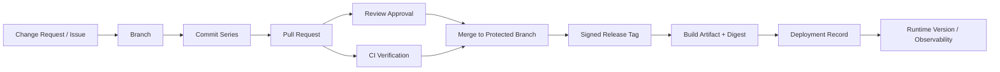
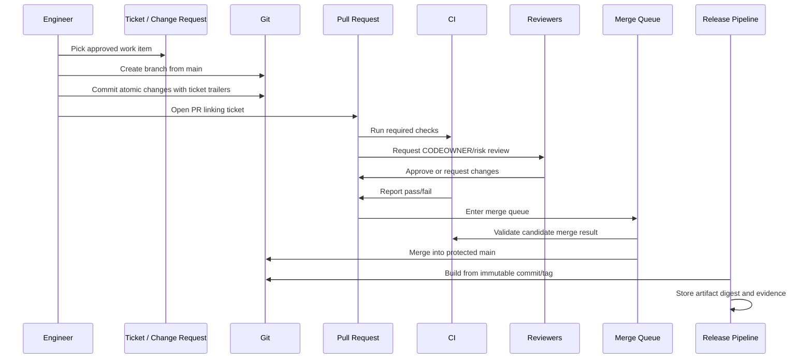
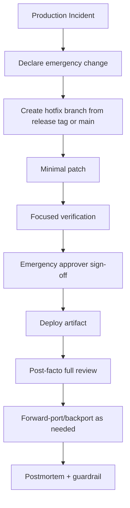
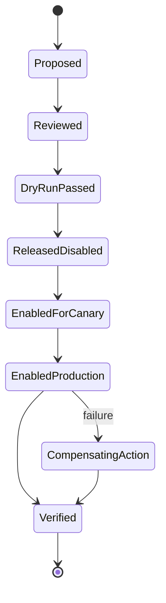

# Part 101 — Git Workflow for Regulated Systems

Regulated system bukan berarti setiap commit harus lambat. Regulated system berarti perubahan harus bisa **dibuktikan**: siapa mengusulkan, kenapa perlu, apa yang berubah, siapa menyetujui, test apa yang lewat, artifact apa yang dibangun, environment mana yang menerima, release mana yang mengandungnya, dan bagaimana rollback dilakukan bila salah.

Git tidak otomatis membuat sistem compliant. Git hanya memberi substrate: object identity, history, refs, tags, diffs, signatures, hooks, dan integrasi dengan platform hosting/CI. Compliance datang dari workflow yang mengikat Git state ke evidence yang defensible.

Kalimat inti part ini:

```text
A regulated Git workflow is not a slower Git workflow.
It is a workflow where every material change has traceable intent,
reviewed authorization, verified outcome, immutable release identity,
and recoverable operational history.
```

Tujuannya bukan membuat tim takut merge. Tujuannya membuat perubahan tetap cepat tanpa kehilangan audit trail.

---

## 1. Regulated Workflow Is Evidence Architecture

Banyak tim mengira regulated Git workflow berarti:

- semua branch harus lama,
- semua approval harus manual,
- semua release harus dibuat dari spreadsheet,
- semua engineer harus menghindari rebase,
- setiap hotfix harus menunggu meeting panjang.

Itu bukan esensi regulated workflow.

Esensinya adalah **evidence architecture**.

Sebuah perubahan harus bisa dijawab dengan pertanyaan audit berikut:

```text
What was changed?
Why was it changed?
Who requested it?
Who authored it?
Who reviewed it?
What risks were considered?
What tests ran?
What artifact was produced?
What release included it?
What environment received it?
Can we prove all of the above after the fact?
```

Git membantu menjawab sebagian:

- commit hash menjawab source snapshot identity,
- diff menjawab content change,
- author/committer metadata menjawab sebagian authorship,
- signed commit/tag memberi provenance signal,
- branch/ref history memberi integration route,
- tags memberi release identity,
- reflog membantu local recovery tetapi bukan audit evidence shared,
- hooks dan protected refs membantu guardrail.

Tetapi Git tidak sendirian menjawab semua hal:

- business approval biasanya ada di issue/ticket/change request,
- test evidence ada di CI,
- artifact identity ada di registry/build system,
- deployment evidence ada di CD platform,
- production incident record ada di incident system,
- access control ada di hosting platform/IAM.

Jadi regulated workflow harus menghubungkan Git ke sistem evidence lain.

---

## 2. Minimal Evidence Chain

Setiap perubahan material sebaiknya punya rantai evidence berikut:



Rantai ini tidak harus selalu manual. Justru sebaiknya banyak yang otomatis. Yang penting evidence-nya ada, bisa dicari, dan tidak mudah dimutasi diam-diam.

Contoh evidence record yang baik:

```yaml
change_id: CASE-48291
risk_class: sensitive-authz-change
source_branch: users/alya/case-48291-fga-escalation-rule
pull_request: https://git.example.com/reg-platform/pulls/9182
merge_commit: 7c3b09e2c6b4f3d1a3e0f8a2c8e9e3a172e54d11
release_tag: reg-platform-v2026.07.1
artifact_digest: sha256:8d6c...
deployment:
  environment: production
  deployed_at: 2026-07-07T03:21:00+07:00
  deploy_id: DEPLOY-22931
approvals:
  code_owner: platform-authz-team
  risk_owner: compliance-ops
  security: appsec
verification:
  unit: passed
  integration: passed
  migration_dry_run: passed
  audit_log_contract: passed
rollback:
  strategy: feature-flag-disable + revert commit if required
```

Perhatikan bahwa evidence chain mengikat **Git identity** dan **operational identity**. Commit SHA tanpa artifact digest belum cukup. Artifact digest tanpa commit SHA juga belum cukup.

---

## 3. Regulated Does Not Mean “No Rewrite Anywhere”

Aturan yang lebih akurat:

```text
Private history may be reshaped for reviewability.
Shared/protected/audited history must not be rewritten without formal incident handling.
```

Rebase, amend, fixup, autosquash, dan range-diff tetap berguna sebelum PR merge. Mereka membantu membuat perubahan mudah direview.

Yang berbahaya adalah rewrite pada history yang sudah menjadi evidence:

- protected main,
- release branch yang sudah dipakai RC,
- signed release tag,
- maintenance branch yang dipakai customer,
- branch yang sudah dipakai sebagai source build,
- commit yang sudah tercatat di change record.

Decision rule:

```text
If a ref has become evidence, mutation requires change control.
If a commit has become artifact input, replacing it creates provenance risk.
If a tag has been published, moving it is a release integrity incident.
```

---

## 4. Control Surfaces

Regulated Git workflow memakai beberapa control surface. Jangan berharap satu mekanisme menyelesaikan semuanya.

| Control Surface | Mengontrol | Tidak Mengontrol |
|---|---|---|
| Branch protection | siapa bisa merge/update protected ref | correctness kode itu sendiri |
| Required status checks | test/security gate sebelum merge | kualitas test jika test lemah |
| Required review | approval manusia | reviewer rubber-stamp |
| CODEOWNERS | routing review berdasarkan path | ownership yang tidak dirawat |
| Signed commits/tags | cryptographic provenance signal | intent bisnis atau approval |
| Merge queue | race antar PR sebelum merge | desain test matrix |
| CI pipeline | verification evidence | perubahan manual di luar pipeline |
| Deployment environment gates | promotion control | source history jika build tidak pinned |
| Server hooks | enforcement dekat ref update | keputusan domain kompleks |
| Audit log platform | who did what in hosting | reasoning perubahan |

Design principle:

```text
Use Git controls for Git state.
Use CI controls for verification.
Use deployment controls for environment mutation.
Use ticket/change records for business authorization.
Bind all identities together.
```

---

## 5. Reference Workflow: Normal Change

Normal change adalah perubahan material yang tidak emergency.



Operational rules:

1. Branch starts from current `main` or approved release branch.
2. Commit message references change ID.
3. Sensitive paths require designated owners.
4. Required checks run on merge result, not only branch head.
5. Release artifact records commit SHA and dirty-state=false.
6. Production deployment references artifact digest, not branch name.

---

## 6. Change Classes

Tidak semua changes butuh gate yang sama. Regulated workflow yang terlalu seragam biasanya gagal karena terlalu mahal untuk low-risk work dan terlalu lemah untuk high-risk work.

| Change Class | Examples | Required Controls |
|---|---|---|
| Cosmetic | docs, typo, non-runtime comment | normal PR, light CI |
| Low-risk code | isolated internal refactor with test coverage | code owner review, unit/integration |
| Runtime behavior | feature logic, validation, workflow transitions | owner review, domain tests, integration tests |
| Sensitive authn/authz | login, permission, ACL, role, escalation | security review, CODEOWNER, negative tests, audit-log tests |
| Data migration | schema/data/backfill | migration dry-run, rollback plan, DBA/data owner review |
| Config/runtime policy | flags, rate limits, environment config | config owner review, deploy evidence |
| Dependency/supply-chain | library/runtime/container/action update | SBOM/dependency scan, provenance check |
| Release/build pipeline | CI/CD, signing, artifact publishing | platform/security review, dry-run |
| Emergency hotfix | production incident fix | emergency approval, post-facto review, incident link |

The goal is proportional control.

```text
Small change should not need a ceremony.
Risky change should not escape with a normal-code path.
```

---

## 7. Branch Model for Regulated Systems

A clean regulated branch model usually has four ref classes:

```text
main                  protected integration line
release/*             protected stabilization/maintenance line
users/* or feature/*   private or semi-private proposal branches
hotfix/*              short-lived emergency branch with incident link
```

Optional:

```text
support/customer-*    long-lived support branch for contracted version line
archive/*             read-only historical branch namespace
```

Avoid:

```text
dev
qa
staging
prod
```

Environment branches mix source-control identity with deployment state. A production environment should point to an artifact/version/deployment record, not require a mutable `prod` branch.

Recommended invariant:

```text
Source branches describe code evolution.
Deployment records describe environment state.
Release tags describe released source identity.
Artifacts describe built output identity.
```

---

## 8. Protected Ref Policy

Minimum protected refs:

```text
main
release/*
support/*
v*
*-rc.*
```

Recommended policy for `main`:

```yaml
main:
  allow_force_push: false
  allow_delete: false
  require_pull_request: true
  require_code_owner_review: true
  require_status_checks: true
  require_signed_commits: recommended_or_required_based_on_org
  require_linear_history: org_decision
  require_conversation_resolution: true
  require_merge_queue: recommended_for_busy_repos
  restrict_bypass: true
```

Recommended policy for release tags:

```yaml
release_tags:
  pattern: "v*"
  allow_create:
    - release-bot
  allow_update: false
  allow_delete: false
  require_signed_tag: true
```

Important distinction:

```text
Protected branch prevents unauthorized ref movement.
Signed commit/tag helps verify provenance.
CI proves selected properties.
None of these alone proves business correctness.
```

---

## 9. Commit Standards for Auditability

A regulated commit should be small enough to review and rich enough to explain why it exists.

Template:

```text
<area>: <imperative summary>

<why this change is needed>
<what behavior changes>
<risk / compatibility notes>
<verification performed>

Change-Id: CASE-48291
Risk-Class: authz-sensitive
Reviewed-By: platform-authz-team
```

Example:

```text
authz: deny escalation when case is externally locked

External lock state is imported from the enforcement case registry.
Before this change, escalation workflow only checked local assignment status,
allowing a stale UI path to attempt escalation after external lock.

The guard is now evaluated before transition creation and emits an audit event
when escalation is denied.

Verification:
- added unit tests for locked/unlocked matrix
- added integration test for stale UI escalation attempt
- verified audit event contract in CaseEscalationAuditIT

Change-Id: CASE-48291
Risk-Class: authz-sensitive
```

Do not use commit messages like:

```text
fix bug
update logic
changes
misc
WIP
```

Those messages are not just aesthetically weak. They make future investigation expensive.

---

## 10. Pull Request Template for Regulated Systems

A PR template should force the author to expose risk, not write ceremony.

```md
## Change

What changed?

## Intent

Why is this change needed?

## Change ID

- Ticket / CR:
- Incident, if emergency:

## Risk Class

- [ ] cosmetic/docs
- [ ] low-risk code
- [ ] runtime behavior
- [ ] authn/authz/security-sensitive
- [ ] migration/data
- [ ] dependency/supply-chain
- [ ] CI/CD/release pipeline

## Verification

- [ ] unit tests
- [ ] integration tests
- [ ] migration dry-run
- [ ] rollback tested or documented
- [ ] audit event checked
- [ ] security review required

## Release / Rollback

- Release note needed:
- Feature flag:
- Rollback strategy:

## Evidence

- CI run:
- Build artifact:
- Related dashboards/log queries:
```

A good template reduces hidden work. A bad template creates checkboxes that people ignore.

---

## 11. Sensitive Path Routing

Sensitive paths need stronger review routing.

Example `CODEOWNERS` style policy:

```text
# Authentication and authorization
/src/main/java/com/example/security/ @platform-security @authz-owners
/src/main/java/com/example/authz/    @platform-security @authz-owners
/config/permissions/                @platform-security @compliance-ops

# Database migrations
/db/migration/                       @data-platform @service-owner

# CI/CD and release machinery
/.github/workflows/                  @platform-engineering @appsec
/scripts/release/                    @release-engineering

# Runtime configuration
/config/production/                  @service-owner @sre
```

But CODEOWNERS alone is not enough. Ownership policy must answer:

- Who owns the domain decision?
- Who owns security implication?
- Who owns operational rollout?
- Who can approve emergency exception?
- What happens when owners are unavailable?

Path routing should encode responsibility, not bureaucracy.

---

## 12. Merge Method Policy

Regulated systems can use merge commit, squash merge, or rebase merge. The important part is consistency and evidence preservation.

### Option A — Merge Commit Policy

Good when:

- PR itself is the integration unit,
- first-parent release history matters,
- reverting a whole PR must be easy,
- audit wants explicit merge event.

Trade-off:

- history is less linear,
- commit series may include noisy intermediate commits unless cleaned before merge.

### Option B — Squash Merge Policy

Good when:

- PR is the only review unit,
- teams want one commit per change request,
- internal commit series is not important after merge.

Trade-off:

- original commit-level evidence can be collapsed,
- backport granularity may be worse,
- stacked PR workflows become trickier.

### Option C — Rebase Merge Policy

Good when:

- commit series is carefully curated,
- linear history matters,
- each commit should remain independently meaningful.

Trade-off:

- requires higher discipline,
- revert of an entire PR may require reverting multiple commits,
- signed commits may need careful handling after rewrite.

Decision invariant:

```text
Choose the merge method based on the unit you want to audit and revert.
```

---

## 13. Release Identity

A regulated release should not be identified by a branch name.

Bad:

```text
Production is running main.
Production is running release/current.
Production is running latest.
```

Better:

```text
Production is running artifact sha256:...
Artifact was built from signed tag v2026.07.1.
Tag resolves to commit 7c3b09e...
Build was performed by release-bot under pipeline run 918273.
```

Minimum runtime version endpoint:

```json
{
  "service": "case-enforcement-api",
  "version": "2026.07.1",
  "gitCommit": "7c3b09e2c6b4f3d1a3e0f8a2c8e9e3a172e54d11",
  "gitTag": "v2026.07.1",
  "buildTime": "2026-07-07T03:12:11+07:00",
  "artifactDigest": "sha256:8d6c...",
  "dirty": false
}
```

Build script guard:

```bash
#!/usr/bin/env bash
set -euo pipefail

commit="$(git rev-parse --verify HEAD^{commit})"
tag="${RELEASE_TAG:-}"

if ! git diff --quiet || ! git diff --cached --quiet; then
  echo "Refusing release build from dirty working tree" >&2
  exit 1
fi

if [ -n "$tag" ]; then
  tag_commit="$(git rev-parse --verify "$tag^{commit}")"
  if [ "$commit" != "$tag_commit" ]; then
    echo "Release tag $tag does not point to HEAD" >&2
    exit 1
  fi
fi

cat > build/git-version.json <<JSON
{
  "commit": "$commit",
  "tag": "$tag",
  "dirty": false
}
JSON
```

---

## 14. Emergency Change Flow

Emergency does not mean uncontrolled. Emergency means **expedited with explicit exception record**.



Emergency invariant:

```text
Emergency path may reduce waiting time.
It must not erase identity, approval, verification, or post-facto review.
```

Emergency PR template addition:

```md
## Emergency Change

Incident ID:
Customer impact:
Why normal path is too slow:
Minimality justification:
Approver:
Post-facto review due by:
Forward-port/backport plan:
```

---

## 15. Data Migration Controls

Data migrations deserve special controls because Git rollback does not automatically roll back data.

Migration PR should include:

- schema migration script,
- backward/forward compatibility explanation,
- dry-run output,
- estimated lock/write impact,
- rollback/compensation plan,
- idempotency notes,
- production verification query,
- feature flag interaction.

Migration state machine:



Dangerous assumption:

```text
We can revert the commit, so the migration is reversible.
```

Usually false. Code rollback and data rollback are different operations.

---

## 16. Authz / Enforcement Lifecycle Example

For enforcement lifecycle systems, Git workflow must preserve domain-level evidence. A change to escalation logic is not just “code change”. It can affect legal status, deadlines, notification obligations, user permissions, or case progression.

Example change class:

```yaml
change_id: ENF-18291
change_type: state-machine-transition-rule
entity: EnforcementCase
transition: INVESTIGATION_OPEN -> ESCALATED_REVIEW
risk:
  - unauthorized escalation
  - missed audit event
  - incorrect deadline recalculation
  - legacy case compatibility
required_reviewers:
  - case-domain-owner
  - authz-owner
  - audit-log-owner
  - qa-regression-owner
required_tests:
  - transition_matrix_test
  - permission_denied_test
  - audit_event_contract_test
  - legacy_case_migration_test
```

Git evidence should point to a behavior matrix, not only code diff.

```md
## Domain Impact

Transition affected:
- INVESTIGATION_OPEN -> ESCALATED_REVIEW

Invariants:
- external lock prevents escalation
- denied escalation emits audit event
- reviewer cannot escalate own assigned case
- legacy cases without external lock remain compatible

Verification:
- TransitionMatrixTest
- EscalationPermissionIT
- AuditEventContractTest
```

---

## 17. Traceability Queries

A regulated repo should support common traceability queries quickly.

### Find all commits for a change ID

```bash
git log --all --grep='Change-Id: CASE-48291' --format='%H %s'
```

### Find release containing a commit

```bash
git tag --contains 7c3b09e2c6b4f3d1a3e0f8a2c8e9e3a172e54d11
```

### Show commits between two releases

```bash
git log --oneline --first-parent v2026.06.2..v2026.07.1
```

### Audit sensitive path over release range

```bash
git log --name-status --oneline v2026.06.2..v2026.07.1 -- \
  src/main/java/com/example/authz \
  config/permissions
```

### Verify release tag signature

```bash
git tag -v v2026.07.1
```

### Verify release tag commit

```bash
git rev-parse --verify v2026.07.1^{commit}
```

### Find mutable tag anomaly from local baseline

```bash
for tag in $(git tag -l 'v*'); do
  git rev-parse "$tag^{commit}"
done | sort
```

In real systems, store a signed release manifest externally too. Git alone cannot prove that no one ever saw a moved tag if clones already diverged.

---

## 18. Evidence Bundle

For each release, generate an evidence bundle.

Suggested contents:

```text
release-evidence/
  release.yaml
  git/
    tag.txt
    tag-verification.txt
    commit.txt
    commits-since-previous-release.txt
    changed-sensitive-paths.txt
  ci/
    pipeline-run.json
    test-summary.xml
    security-scan.json
  artifact/
    digest.txt
    sbom.json
    provenance.json
  deployment/
    staging-deploy.json
    production-deploy.json
  approvals/
    release-approval.json
    emergency-exceptions.json
```

Example `release.yaml`:

```yaml
release: v2026.07.1
previous_release: v2026.06.2
source_commit: 7c3b09e2c6b4f3d1a3e0f8a2c8e9e3a172e54d11
source_tag_verified: true
artifact_digest: sha256:8d6c...
build_dirty: false
created_by: release-bot
deployed_to:
  staging: 2026-07-06T20:00:00+07:00
  production: 2026-07-07T03:21:00+07:00
exceptions: []
```

---

## 19. Failure Modes

### Failure Mode 1 — Approval Exists but Does Not Match Code

Symptom:

```text
Ticket approved feature A, PR implements feature A plus unrelated authz behavior.
```

Control:

- atomic PR scope,
- sensitive path review,
- PR template risk declaration,
- reviewer checks changed files vs intent.

### Failure Mode 2 — Artifact Built from Branch Name

Symptom:

```text
Production artifact says source=main.
```

Risk:

- branch moved,
- artifact not reproducible,
- audit cannot reconstruct exact source.

Control:

- build from commit SHA/tag,
- embed commit SHA,
- store artifact digest.

### Failure Mode 3 — Release Tag Moved

Symptom:

```text
v2026.07.1 resolves differently in two clones.
```

Control:

- protected tags,
- signed tags,
- external release manifest,
- incident playbook if mutation occurs.

### Failure Mode 4 — Emergency Change Not Forward-Ported

Symptom:

```text
Production fix exists only on release branch.
Main does not contain it.
Next release regresses.
```

Control:

- emergency PR requires forward-port plan,
- `git branch --contains <hotfix-commit>` check,
- release readiness gate.

### Failure Mode 5 — Manual Database Change Outside Git

Symptom:

```text
Production schema/data changed outside migration repository.
```

Control:

- deploy platform blocks manual mutation,
- emergency manual change requires retrospective migration commit,
- database audit logs linked to incident.

### Failure Mode 6 — Squash Merge Removes Traceability

Symptom:

```text
Individual commit trailers disappear after squash.
```

Control:

- squash message includes change ID and risk metadata,
- PR system remains linked,
- release evidence references PR and final commit.

---

## 20. Policy as Invariants

A regulated Git workflow is easiest to maintain when expressed as invariants.

Examples:

```text
Every production artifact must reference exactly one Git commit SHA.
Every release tag must be annotated and signed.
Every production deployment must reference artifact digest and release tag.
No protected branch may be force-pushed.
No release tag may be moved or deleted after publication.
Every authz-sensitive path change must be reviewed by authz owners.
Every database migration must include rollback or compensation notes.
Every emergency change must link to an incident and receive post-facto review.
Every dependency update must pass supply-chain verification.
```

Invariants can be enforced by:

- branch protection,
- rulesets,
- CI checks,
- server hooks,
- PR templates,
- release scripts,
- deployment gates,
- audit jobs.

Do not rely on memory.

---

## 21. Implementation Blueprint

### Step 1 — Classify Refs

```yaml
refs:
  protected:
    - main
    - release/*
    - support/*
  immutable_tags:
    - v*
  private:
    - users/*
    - feature/*
```

### Step 2 — Define Change Classes

```yaml
change_classes:
  authz-sensitive:
    owners:
      - platform-security
      - authz-team
    checks:
      - authz-matrix-tests
      - audit-event-contract-tests
  migration:
    owners:
      - data-platform
    checks:
      - migration-dry-run
      - rollback-plan-present
```

### Step 3 — Enforce PR Metadata

CI check example:

```bash
#!/usr/bin/env bash
set -euo pipefail

body_file="${PR_BODY_FILE:-pr-body.md}"

required=("Change ID" "Risk Class" "Verification" "Rollback")

for field in "${required[@]}"; do
  if ! grep -qi "${field}" "$body_file"; then
    echo "PR body missing required section: $field" >&2
    exit 1
  fi
done
```

### Step 4 — Enforce Sensitive Path Review

Use hosting rules where available. Backstop with CI:

```bash
#!/usr/bin/env bash
set -euo pipefail

base="${BASE_SHA:?}"
head="${HEAD_SHA:?}"

if git diff --name-only "$base...$head" | grep -E '^(src/.*/authz|config/permissions/)'; then
  echo "Authz-sensitive files changed. Security owner approval required." >&2
  # In real CI, query platform approval API.
fi
```

### Step 5 — Generate Release Evidence

```bash
#!/usr/bin/env bash
set -euo pipefail

release_tag="${1:?release tag required}"
previous_tag="${2:?previous tag required}"
out="release-evidence/$release_tag"
mkdir -p "$out/git"

git rev-parse --verify "$release_tag^{commit}" > "$out/git/commit.txt"
git tag -v "$release_tag" > "$out/git/tag-verification.txt" 2>&1 || true
git log --first-parent --oneline "$previous_tag..$release_tag" > "$out/git/commits-since-previous-release.txt"
git diff --name-status "$previous_tag..$release_tag" -- \
  src/main/java/com/example/authz \
  config/permissions \
  db/migration \
  .github/workflows > "$out/git/changed-sensitive-paths.txt"
```

---

## 22. What Auditors Usually Need vs What Engineers Usually Keep

| Audit Need | Engineers Often Keep | Gap |
|---|---|---|
| why change existed | commit diff | missing intent |
| approval | PR approval | approval may not match risk class |
| test evidence | CI green check | no preserved test summary |
| release identity | branch/tag | no artifact digest |
| deployment identity | environment says latest | no immutable deployment record |
| rollback evidence | revert possible | rollback not tested/documented |
| access control | Git permissions | no exception log |
| emergency process | Slack thread | not durable/searchable |

Close the gap by designing evidence as first-class output.

---

## 23. Practical Defaults

For most regulated software teams, this baseline is strong enough to start:

```yaml
workflow:
  integration_branch: main
  merge_method: merge_commit_or_squash_but_standardized
  feature_branch_lifetime: <= 3 days preferred
  release_branch_lifetime: bounded by release cycle
  force_push_protected_refs: forbidden
  release_tag_mutation: forbidden
  emergency_change: allowed_with_incident_and_post_review

required_controls:
  main:
    - pull_request
    - required_checks
    - code_owner_review
    - merge_queue_if_high_velocity
  release_tags:
    - annotated_tag
    - signed_tag
    - protected_tag
  artifacts:
    - commit_sha
    - artifact_digest
    - dirty_false
  sensitive_changes:
    - owner_review
    - risk_specific_tests
    - rollback_or_compensation_plan
```

Do not start by copying a heavy process. Start with invariants and evidence gaps.

---

## 24. Checklist — Regulated Git Workflow

Before calling a workflow regulated-ready, verify:

- [ ] protected branches cannot be force-pushed or deleted,
- [ ] release tags cannot be moved or deleted,
- [ ] release tags are annotated and preferably signed,
- [ ] every production artifact embeds commit SHA,
- [ ] artifact digest is stored in release/deployment record,
- [ ] PR template captures intent, risk, verification, rollback,
- [ ] sensitive paths trigger designated review,
- [ ] emergency changes require incident link and post-facto review,
- [ ] data migrations require dry-run/rollback/compensation evidence,
- [ ] dependency and CI/CD changes receive platform/security review,
- [ ] release evidence bundle can be generated without manual archaeology,
- [ ] runtime exposes version/build metadata,
- [ ] tag movement is treated as incident,
- [ ] history rewrite on evidence refs is forbidden except through formal incident handling.

---

## 25. Final Mental Model

A regulated Git workflow is not a command sequence. It is a chain of defensible state transitions.

```text
intent -> proposal -> review -> verification -> protected integration
-> immutable release identity -> artifact identity -> deployment evidence
-> runtime traceability -> incident/recovery evidence
```

The strongest workflow is not the one with the most approvals. It is the one where:

- risky changes cannot silently bypass the right reviewers,
- release identity cannot silently move,
- artifact identity cannot silently detach from source,
- emergency changes can move fast without becoming invisible,
- future investigators can reconstruct reality without interviewing the original engineer.

Git gives you the graph. Regulated engineering requires you to bind that graph to evidence.

---

## References

- Git documentation: `git tag`, `git rev-parse`, `git log`, `git merge`, `git revert`, `gitworkflows`
- GitHub Docs: branch protection, rulesets, CODEOWNERS, required status checks, signed commits, audit logs
- SLSA provenance model and supply-chain evidence concepts
- Reproducible Builds definition and build input identity concepts
