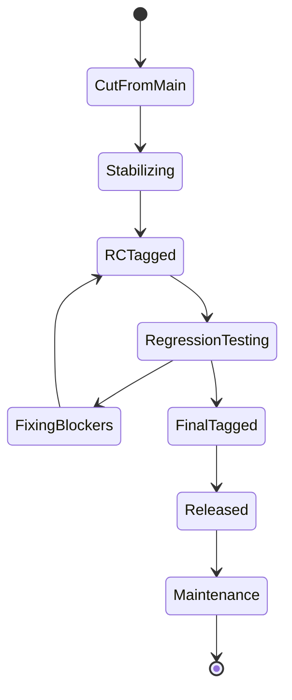

# Part 102 — Engineering Handbook Git Standards

Part ini berbentuk standar internal engineering handbook. Tujuannya bukan menjelaskan semua teori lagi, tetapi menyediakan baseline yang bisa dipakai oleh tim nyata.

Dokumen seperti ini harus preskriptif. Git workflow yang terlalu banyak “tergantung preferensi” akan menjadi sumber variasi, incident, dan review overhead. Standar bukan untuk membatasi engineer kuat; standar membuat operasi normal aman, sehingga engineer kuat bisa memakai energi untuk problem yang benar-benar sulit.

Kalimat inti:

```text
A Git standard is a set of shared invariants that makes collaboration predictable.
```

Standar ini bisa diadaptasi, tetapi jangan hapus invariant tanpa mengganti dengan kontrol lain.

---

## 1. Scope

Standar ini berlaku untuk repository product, platform, service, library internal, infrastructure-as-code, dan automation yang memengaruhi runtime, release, security, compliance, atau developer workflow.

Tidak semua aturan harus sama kuat untuk eksperimen kecil. Tetapi setiap repository production harus punya minimum berikut:

- protected integration branch,
- standard branch naming,
- standard commit/PR metadata,
- required CI before merge,
- review routing untuk sensitive paths,
- immutable release tag policy,
- reproducible build metadata,
- emergency change process,
- secret leak process,
- ownership metadata.

---

## 2. Repository Classes

Klasifikasi repository menentukan kontrol minimum.

| Class | Example | Minimum Control |
|---|---|---|
| Tier 0 | deployment platform, auth, CI/CD, release tooling | strict branch/tag protection, security review, signed release tags |
| Tier 1 | production service, regulated workflow engine | protected main, CODEOWNERS, required checks, release evidence |
| Tier 2 | internal library, shared SDK | protected main, required tests, version tags |
| Tier 3 | docs, examples, prototype | lightweight PR/review policy |

Repository owner wajib mendeklarasikan class di file metadata:

```yaml
# .repo-policy.yml
repository_class: tier-1
owners:
  primary: platform-case-management
  security: appsec
  sre: enforcement-sre
release_model: trunk-plus-release-branches
sensitive_paths:
  - src/main/java/com/example/authz/**
  - db/migration/**
  - .github/workflows/**
```

---

## 3. Branch Names

Branch name harus menjelaskan owner dan intent.

Allowed:

```text
users/<name>/<ticket>-<short-slug>
feature/<ticket>-<short-slug>
fix/<ticket>-<short-slug>
hotfix/<incident-or-ticket>-<short-slug>
release/<version>
support/<version-line>
experiment/<owner>/<slug>
```

Examples:

```text
users/alya/CASE-48291-deny-locked-escalation
fix/CASE-49001-null-decision-deadline
hotfix/INC-2291-authz-cache-stale-read
release/2026.07
support/2025-lts
```

Forbidden:

```text
my-changes
update
final
new
backup
prod
dev
staging
qa
main-copy
```

Reason:

```text
Branch names are operational handles. Ambiguous handles create wrong-push,
wrong-PR-target, wrong-cleanup, and wrong-release risks.
```

---

## 4. Protected Branches

Default protected branches:

```text
main
release/*
support/*
```

Required policy for `main`:

```yaml
main:
  allow_delete: false
  allow_force_push: false
  require_pull_request: true
  require_status_checks: true
  require_conversation_resolution: true
  require_code_owner_review: true
  stale_review_dismissal: true
  restrict_bypass: true
```

Recommended for high-velocity teams:

```yaml
main:
  require_merge_queue: true
```

Required policy for `release/*`:

```yaml
release/*:
  allow_delete: false
  allow_force_push: false
  require_pull_request: true
  require_release_manager_or_owner_review: true
  require_status_checks: true
  restrict_who_can_push: true
```

No engineer should push directly to protected branches except approved automation. Direct push is a break-glass action and must be logged.

---

## 5. Tags

Release tags are immutable.

Required naming:

```text
v<MAJOR>.<MINOR>.<PATCH>
v<MAJOR>.<MINOR>.<PATCH>-rc.<N>
```

Examples:

```text
v2026.7.1
v2026.7.1-rc.1
v2.14.0
v2.14.0-rc.3
```

Rules:

- release tags must be annotated,
- release tags should be signed,
- release tags must not be moved,
- release tags must not be deleted after publication,
- builds must resolve tag to commit before producing artifact,
- production deployment must reference artifact digest, not only tag.

Create release tag:

```bash
git tag -s v2026.7.1 -m "Release v2026.7.1"
git push origin v2026.7.1
```

Verify release tag:

```bash
git tag -v v2026.7.1
git rev-parse --verify v2026.7.1^{commit}
```

Moving a published release tag is a release integrity incident.

---

## 6. Commit Standards

Commit must represent one logical change.

Good commit:

```text
authz: deny escalation for externally locked case
```

Bad commit:

```text
fix
update stuff
misc changes
WIP
final
```

Subject format:

```text
<area>: <imperative summary>
```

Examples:

```text
case: reject transition when deadline is expired
authz: add reviewer self-approval guard
db: add case escalation audit table
ci: pin release workflow actions to commit SHA
docs: document hotfix backport process
```

Commit body required when change is non-trivial:

```text
<why>
<what changed>
<risk / compatibility / migration notes>
<verification>
<trailers>
```

Recommended trailers:

```text
Change-Id: CASE-48291
Incident: INC-2291
Risk-Class: authz-sensitive
Security-Review: required
```

Do not mix unrelated concerns in one commit:

- behavior change + formatting,
- refactor + feature,
- dependency update + business logic,
- migration + unrelated cleanup,
- generated file churn + manual source change.

---

## 7. Commit Shaping Workflow

Before opening PR:

```bash
git status --short
git diff
git diff --cached
git add -p
git commit
git log --oneline --decorate --graph main..HEAD
git range-diff main...HEAD@{1} main...HEAD || true
```

Use fixup while iterating:

```bash
git commit --fixup=<target-commit>
git rebase -i --autosquash main
```

Allowed:

- amend/fixup on private branch,
- interactive rebase before PR review,
- force push private branch with `--force-with-lease`.

Forbidden without coordination:

- rewrite branch other people are based on,
- force push shared release branch,
- rewrite any protected/evidence ref,
- move release tag.

---

## 8. Pull Request Standard

Every PR should answer:

```text
What changed?
Why?
How was it verified?
What is the rollback strategy?
What is the release impact?
```

Minimum PR sections:

```md
## Summary

## Why

## Verification

## Risk

## Rollback

## Linked Work Item
```

For sensitive changes, add:

```md
## Sensitive Change Checklist

- [ ] authn/authz behavior reviewed
- [ ] audit logging verified
- [ ] data migration rollback/compensation documented
- [ ] dependency provenance checked
- [ ] CI/CD permission impact reviewed
```

PR size guideline:

```text
Prefer PRs that can be reviewed deeply in <= 30 minutes.
If review requires multiple mental contexts, split the PR.
```

PR should not contain:

- unrelated formatting,
- generated churn without explanation,
- binary blobs without justification,
- hidden config changes,
- dependency updates mixed with behavior changes,
- migration without rollback/compensation notes.

---

## 9. Review Standard

Review is not a search for style nits. Review is risk reduction.

Reviewer must check:

- intent matches ticket/PR description,
- diff scope matches risk class,
- sensitive paths have correct owners,
- tests verify changed behavior,
- rollback/forward-fix path exists,
- migration/config/dependency implications are clear,
- observability/audit logging is adequate,
- no secret or generated artifact accidentally included.

Author must:

- keep branch fresh enough for meaningful review,
- answer review comments or update code,
- avoid force-push without context after substantial review,
- use `range-diff` summary after rewrite when helpful.

Suggested rewrite note:

```md
Rebased and autosquashed review fixes.
Range-diff summary:
- patch 1 unchanged
- patch 2 adds null-case test requested by @reviewer
- patch 3 commit message clarified rollback note
```

---

## 10. Merge Method Standard

Team must choose one default merge method per repository.

Recommended defaults:

| Repository Type | Recommended Merge Method |
|---|---|
| application/service | squash or merge commit |
| regulated/release-heavy service | merge commit or carefully curated rebase merge |
| library with clean patch series | rebase merge |
| monorepo with release trains | merge commit + first-parent release history |

If using squash merge:

- final squash commit message must preserve change ID,
- PR link must remain available,
- release notes should derive from PR metadata, not lost intermediate commits.

If using merge commit:

- branch should be cleaned before merge,
- noisy WIP commits should not be merged unless policy accepts them,
- first-parent history should be used for release review.

If using rebase merge:

- commits must be atomic,
- each commit must build/test where possible,
- revert strategy must account for multiple commits.

---

## 11. Pull Policy

Developers should not use ambiguous pull behavior.

Recommended config:

```bash
git config --global pull.ff only
```

For feature branch update:

```bash
git fetch origin
git rebase origin/main
```

For shared branch where merge commits are intended:

```bash
git fetch origin
git merge --ff-only origin/main
# or use explicit merge policy if non-ff integration is expected
```

Avoid:

```bash
git pull
```

unless repository config defines exactly whether pull means merge, rebase, or fast-forward only.

Principle:

```text
Fetch first. Inspect state. Integrate intentionally.
```

---

## 12. Push Policy

Default push:

```bash
git push -u origin HEAD
```

Force push allowed only for private proposal branches:

```bash
git push --force-with-lease
```

Forbidden:

```bash
git push --force origin main
git push --force origin release/2026.07
git push --mirror production
git push origin :refs/tags/v2026.7.1
```

Before force push:

```bash
git fetch origin
git log --oneline --left-right --graph @{u}...HEAD
git push --force-with-lease
```

If branch is shared, announce before rewriting.

---

## 13. Release Branch Standard

Release branches are for stabilization, not feature development.

Naming:

```text
release/2026.07
release/2.14
```

Allowed changes:

- release blockers,
- regression fixes,
- documentation required for release,
- version metadata,
- approved dependency/security patch.

Forbidden changes:

- new feature scope,
- unrelated refactor,
- opportunistic cleanup,
- dependency upgrade without release approval,
- large migration not part of release plan.

Release branch lifecycle:



Release branch invariant:

```text
Every commit on release branch must be explainable as release stabilization.
```

---

## 14. Hotfix Standard

Hotfix must be minimal and traceable.

Start from production source identity:

```bash
git fetch origin --tags
git checkout -b hotfix/INC-2291-authz-cache-stale-read v2026.7.1
```

Make minimal fix:

```bash
git commit -m "hotfix: prevent stale authz cache read

Incident: INC-2291
Risk-Class: authz-sensitive
Rollback: disable authz-cache-v2 flag"
```

After hotfix release:

```bash
# forward-port to main if needed
git checkout main
git pull --ff-only
git cherry-pick -x <hotfix-commit>
```

Hotfix PR must include:

- incident ID,
- customer/user impact,
- why normal path is too slow,
- minimality justification,
- verification performed,
- rollback plan,
- forward-port/backport plan,
- post-facto review due date.

---

## 15. Backport Standard

Backport must preserve traceability to original fix.

Use:

```bash
git cherry-pick -x <original-commit>
```

Backport PR title:

```text
[backport release/2026.07] authz: deny escalation for externally locked case
```

Backport checklist:

- [ ] original commit identified,
- [ ] target version affected,
- [ ] dependencies included or explicitly not needed,
- [ ] conflict resolution reviewed as domain decision,
- [ ] tests run against target branch,
- [ ] release notes updated if customer-visible,
- [ ] forward-port already present or tracked.

Avoid manually reimplementing a fix unless cherry-pick is impossible. If manual reimplementation is required, reference original commit and explain divergence.

---

## 16. Conflict Resolution Standard

Conflict resolution is code change and must be reviewed.

During conflict:

```bash
git status
git ls-files -u
```

Inspect all sides:

```bash
git show :1:path/to/file  # base
git show :2:path/to/file  # ours
git show :3:path/to/file  # theirs
```

After resolution:

```bash
git diff
git add path/to/file
git status
git rebase --continue # or git merge --continue
```

Never resolve conflict by blindly choosing ours/theirs unless the PR explains why.

Forbidden review comment:

```text
Resolved conflict.
```

Required explanation:

```text
Conflict resolved by preserving new external-lock guard from main and applying
release branch's legacy-case compatibility path. Added regression test for both.
```

---

## 17. Secrets Standard

Secrets must never be committed.

Forbidden:

- passwords,
- API tokens,
- private keys,
- cloud credentials,
- production config with secrets,
- database dumps containing PII/secrets,
- `.env` files with real values.

Allowed:

```text
.env.example
config/template.yaml
fake test credentials
local-only ignored files
```

If secret is committed:

```text
1. Stop.
2. Revoke/rotate credential immediately.
3. Remove from current tree.
4. Assess exposure.
5. Rewrite history only after rotation and coordination.
6. Invalidate caches/artifacts if needed.
7. Add prevention guardrail.
```

Do not say:

```text
I deleted the commit, so secret is safe.
```

That is usually false.

---

## 18. Binary and Large File Standard

Git is not an artifact repository.

Allowed in Git:

- source code,
- text config without secrets,
- small fixtures,
- migration scripts,
- documentation assets when reasonable.

Use Git LFS or artifact storage for:

- large media,
- model files,
- generated binaries,
- build outputs,
- large test datasets,
- archives,
- vendor bundles.

File size policy example:

```yaml
large_file_policy:
  warn_above_mb: 5
  block_above_mb: 25
  require_exception_for:
    - "*.zip"
    - "*.jar"
    - "*.war"
    - "*.tar.gz"
    - "*.mp4"
    - "*.bin"
```

Detection:

```bash
git rev-list --objects --all \
  | git cat-file --batch-check='%(objecttype) %(objectname) %(objectsize) %(rest)' \
  | awk '$1 == "blob" && $3 > 25000000 { print }'
```

---

## 19. Submodule Standard

Submodules are allowed only when dependency identity must be pinned to a Git commit and repository separation is intentional.

Rules:

- submodule commit must point to reviewed upstream commit,
- `.gitmodules` changes require owner review,
- CI must use recursive checkout if needed,
- release manifest must include submodule SHAs,
- submodule update must be reviewed like dependency update.

Common command:

```bash
git submodule update --init --recursive
git submodule status --recursive
```

Avoid submodules for simple package dependencies. Prefer package manager/artifact repository unless source-level pinning is required.

---

## 20. Sparse / Partial / Shallow Clone Standard

Allowed for developer performance:

```bash
git clone --filter=blob:none <repo>
git sparse-checkout init --cone
git sparse-checkout set services/case-api libs/authz
```

CI must not blindly use shallow clone if job needs:

- merge-base,
- tags,
- changelog,
- release range,
- affected project detection,
- bisect,
- ancestry queries.

Release jobs should fetch full required history and tags:

```bash
git fetch --tags --prune --unshallow || git fetch --tags --prune
```

Policy:

```text
Developer checkout may be optimized.
Release evidence checkout must be complete enough to prove the release range.
```

---

## 21. CI Checkout Standard

CI must test the correct state.

For PR validation, prefer testing merge result or merge queue candidate, not only branch head.

Required build metadata:

```text
GIT_COMMIT
GIT_BRANCH or PR_HEAD
GIT_BASE
GIT_TAG if release
DIRTY=false
BUILD_URL
ARTIFACT_DIGEST
```

CI must fail if release build is dirty:

```bash
if ! git diff --quiet || ! git diff --cached --quiet; then
  echo "Dirty release build is forbidden" >&2
  exit 1
fi
```

CI workflow changes require platform/security review because they can alter verification, secrets, permissions, artifact publishing, and deployment authority.

---

## 22. Hooks Standard

Client hooks are convenience, not ultimate enforcement.

Use client hooks for:

- formatting feedback,
- commit message lint,
- obvious secret scan,
- large file warning,
- local test shortcut.

Use server-side hooks / branch protection / CI for:

- protected ref enforcement,
- tag immutability,
- required checks,
- sensitive path approval,
- release policy,
- security policy.

Reason:

```text
Client hooks can be bypassed. Enforcement must live where the protected state changes.
```

Recommended `core.hooksPath` bootstrap:

```bash
git config core.hooksPath .githooks
```

Example commit message check:

```bash
#!/usr/bin/env bash
set -euo pipefail

msg_file="$1"
first_line="$(head -n1 "$msg_file")"

if ! echo "$first_line" | grep -Eq '^[a-z0-9._-]+: .+'; then
  echo "Commit subject must be '<area>: <summary>'" >&2
  exit 1
fi
```

---

## 23. Recommended Local Config

Safe defaults:

```bash
git config --global init.defaultBranch main
git config --global pull.ff only
git config --global fetch.prune true
git config --global push.default simple
git config --global rerere.enabled true
git config --global diff.algorithm histogram
git config --global merge.conflictStyle zdiff3
```

Useful aliases:

```bash
git config --global alias.st 'status --short --branch'
git config --global alias.lg 'log --oneline --decorate --graph --all'
git config --global alias.fp 'push --force-with-lease'
git config --global alias.unstage 'restore --staged'
git config --global alias.wip 'commit -m WIP --no-verify'
git config --global alias.cleanup-branches '!git fetch --prune && git branch --merged main'
```

Be careful with aliases that hide destructive commands. An alias should reduce mistakes, not conceal risk.

---

## 24. Repository Health Standard

Monthly or scheduled repository health checks:

```bash
git count-objects -vH
git fsck --full
git for-each-ref --format='%(refname:short) %(committerdate:iso8601)' refs/heads refs/remotes
git tag --sort=-creatordate | head -20
```

Large blob check:

```bash
git rev-list --objects --all \
  | git cat-file --batch-check='%(objecttype) %(objectname) %(objectsize) %(rest)' \
  | sort -k3 -n \
  | tail -50
```

Stale branch report:

```bash
git for-each-ref refs/remotes/origin \
  --format='%(committerdate:short) %(refname:short)' \
  --sort=committerdate
```

Maintenance:

```bash
git maintenance run
```

Server-side repository maintenance should be handled by hosting platform or repository admins, not ad-hoc developer commands against shared storage.

---

## 25. Incident Playbooks

Every production repository must have documented playbooks for:

- broken main,
- bad release tag,
- accidental force push,
- secret leak,
- bad migration,
- failed release candidate,
- broken CI required check,
- LFS/object storage outage,
- compromised dependency/action,
- incorrect production deployment.

Minimum incident record:

```yaml
incident_id: INC-2291
summary: authz cache stale read after v2026.7.1
source_ref: v2026.7.1
bad_commit: 7c3b09e...
mitigation_commit: 91a2d3...
artifact_digest: sha256:...
rollback_or_fix_forward: fix-forward
release: v2026.7.2
postmortem: link
preventive_control: added stale-cache regression test
```

---

## 26. Exceptions

Exceptions are allowed, but must be explicit.

Exception record:

```yaml
exception_id: EXC-2026-071
repository: case-enforcement-api
rule: require_two_approvals_for_authz_change
reason: emergency incident INC-2291, primary reviewer unavailable
time_bound: true
expires_at: 2026-07-08T00:00:00+07:00
approved_by:
  - engineering_manager
  - security_oncall
post_facto_review_due: 2026-07-09
```

No silent exceptions.

```text
A bypass without an evidence record is not an exception.
It is control failure.
```

---

## 27. Onboarding Checklist

New engineer should learn:

- [ ] repository class and owners,
- [ ] branch naming,
- [ ] protected branch policy,
- [ ] commit message standard,
- [ ] PR template,
- [ ] review expectation,
- [ ] CI checkout semantics,
- [ ] release tag policy,
- [ ] hotfix/backport process,
- [ ] secret leak process,
- [ ] local safe config,
- [ ] recovery basics: reflog, reset, revert, stash,
- [ ] who to call for protected branch/tag incident.

Hands-on onboarding labs:

1. Split messy change into three atomic commits.
2. Resolve a conflict using base/ours/theirs.
3. Recover from accidental reset using reflog.
4. Create a signed annotated tag in sandbox repo.
5. Backport a fix with `cherry-pick -x`.
6. Generate release evidence from two tags.

---

## 28. Team Operating Metrics

Track workflow health, not individual blame.

Useful metrics:

- median branch age,
- PR size distribution,
- review latency,
- number of force-pushes after review,
- broken-main incidents,
- revert frequency,
- release branch lifetime,
- hotfix count per release,
- stale branch count,
- large blob incidents,
- secret scanning incidents,
- required check flakiness,
- merge queue wait time.

Dangerous metrics if misused:

- commits per engineer,
- lines changed per engineer,
- raw review comment count,
- blame count,
- revert count without context.

Metric principle:

```text
Measure workflow risk and friction.
Do not turn Git history into individual productivity theater.
```

---

## 29. Minimal `.repo-policy.yml`

Example policy file:

```yaml
repository:
  name: case-enforcement-api
  class: tier-1
  owner: platform-case-management
  default_branch: main

branches:
  protected:
    - main
    - release/*
    - support/*
  feature_patterns:
    - users/*
    - feature/*
    - fix/*
    - hotfix/*

merge:
  method: merge_commit
  require_merge_queue: true

release:
  tag_pattern: v*
  annotated_tags: required
  signed_tags: required
  immutable_tags: required
  build_from_dirty_tree: forbidden

review:
  require_codeowners: true
  sensitive_paths:
    authz:
      paths:
        - src/main/java/com/example/authz/**
        - config/permissions/**
      owners:
        - platform-security
        - authz-team
      checks:
        - authz-matrix-tests
        - audit-event-contract-tests
    migrations:
      paths:
        - db/migration/**
      owners:
        - data-platform
      checks:
        - migration-dry-run

security:
  secrets_in_git: forbidden
  large_file_limit_mb: 25
  ci_workflow_changes_require_security_review: true
```

This file is not magical. It becomes useful when CI, hooks, or repository management automation read it and enforce/report policy.

---

## 30. Standard Daily Workflow

Recommended daily flow:

```bash
git fetch origin --prune
git switch main
git pull --ff-only
git switch -c users/<you>/<ticket>-<slug>

# work
git status --short
git diff
git add -p
git commit

# before PR
git fetch origin
git rebase origin/main
git log --oneline --decorate --graph origin/main..HEAD
git push -u origin HEAD
```

After review changes:

```bash
# make changes
git add -p
git commit --fixup=<target>
git rebase -i --autosquash origin/main
git range-diff origin/main...@{u} origin/main...HEAD || true
git push --force-with-lease
```

If branch is public/shared, coordinate before rewrite.

---

## 31. Standard Release Flow

```bash
git fetch origin --tags --prune
git switch main
git pull --ff-only

# optional release branch
git switch -c release/2026.07
git push -u origin release/2026.07

# after stabilization
git tag -s v2026.7.1-rc.1 -m "Release candidate v2026.7.1-rc.1"
git push origin v2026.7.1-rc.1

# final
git tag -s v2026.7.1 -m "Release v2026.7.1"
git push origin v2026.7.1
```

Generate evidence:

```bash
./scripts/release/evidence.sh v2026.7.1 v2026.6.2
```

Build artifact from tag:

```bash
./scripts/build-release.sh v2026.7.1
```

Deploy artifact digest, not branch name.

---

## 32. What This Standard Optimizes For

This standard optimizes for:

- predictable collaboration,
- reviewability,
- safe release identity,
- fast recovery,
- audit evidence,
- supply-chain defensibility,
- lower cognitive load,
- fewer irreversible mistakes.

It does not optimize for:

- maximum individual freedom in shared repos,
- hiding messy history after evidence is created,
- manual heroics,
- branch-per-environment deployment habits,
- using Git as artifact storage,
- bypassing review for convenience.

---

## 33. Final Handbook Summary

Use this short form as the top-level policy:

```text
1. Work on short-lived branches from main or approved release branch.
2. Keep commits atomic, meaningful, and linked to work items.
3. Open PRs that explain intent, risk, verification, and rollback.
4. Protect main, release branches, support branches, and release tags.
5. Require CI and appropriate owner review before merge.
6. Use force-with-lease only on private proposal branches.
7. Never rewrite protected/evidence history without formal incident handling.
8. Use annotated/signed immutable tags for releases.
9. Build artifacts from exact commit/tag and store artifact digest.
10. Treat secrets, moved tags, broken main, and accidental force-push as incidents.
11. Keep Git history useful for future debugging, audit, and recovery.
```

A good Git standard should make the safe path the easy path. The team should not need to remember every danger every day. The workflow should encode the important invariants before mistakes reach production.

---

## References

- Git documentation: `git branch`, `git push`, `git pull`, `git tag`, `git rebase`, `git cherry-pick`, `git revert`, `gitworkflows`
- GitHub Docs: branch protection, rulesets, CODEOWNERS, required status checks, merge queue, signed commits/tags
- Reproducible Builds definition and release artifact identity practices
- SLSA provenance concepts for source/material/artifact traceability
