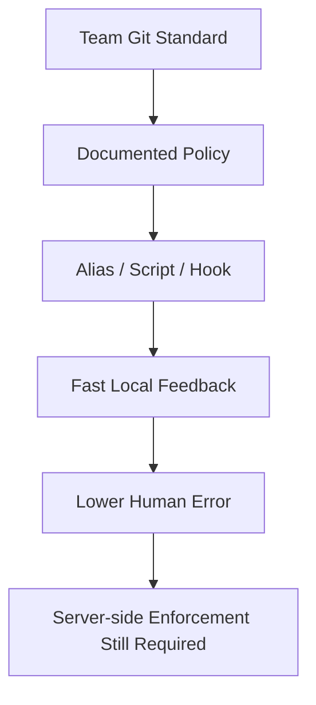
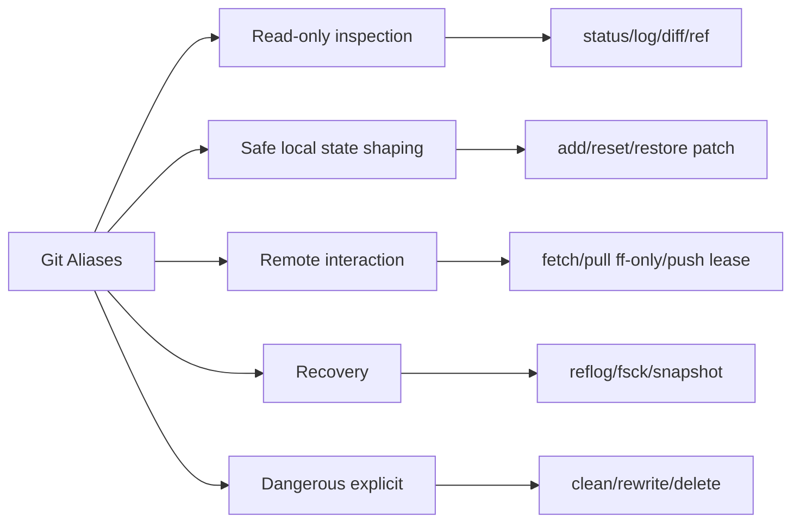

# Git Aliases that Encode Policy

Git alias bukan sekadar shortcut agar command lebih pendek.

Pada level engineering organization, alias adalah **local user-interface layer** di atas Git. Alias bisa membantu engineer melakukan hal yang benar lebih cepat, mengurangi lupa flag penting, membuat investigasi state lebih konsisten, dan mengubah workflow tim dari “ingat ritual” menjadi “jalankan command yang sudah mengandung niat operasional”.

Namun alias juga bisa berbahaya. Alias yang menyembunyikan destructive command, terlalu magic, atau berbeda semantik antar engineer akan menciptakan false confidence.

Mental model yang benar:

> Alias bukan tempat menaruh policy enforcement utama. Alias adalah tempat menaruh safe defaults, inspection routine, recovery routine, dan command composition yang membuat policy lebih mudah diikuti.

Branch protection, CI, server hooks, signed release, dan protected tags tetap menjadi enforcement boundary. Alias hanya membantu manusia bergerak benar di local machine.

---

## 1. Masalah yang Sebenarnya Diselesaikan Alias

Di tim kecil, masalah Git sering terlihat seperti:

- lupa `--ff-only`;
- lupa `--force-with-lease`;
- salah membaca PR diff;
- lupa cek upstream divergence;
- melakukan `git clean -fdx` tanpa dry-run;
- lupa snapshot sebelum rebase besar;
- tidak tahu command forensic saat repo rusak.

Secara teknis, semua bisa diselesaikan dengan dokumentasi. Secara operasional, dokumentasi saja lemah karena Git digunakan di tengah interrupt, incident, context switch, deadline release, dan review pressure.

Alias yang baik mengubah dokumentasi menjadi affordance:



Alias tidak menghapus kebutuhan pemahaman. Alias justru harus memperkuat pemahaman dengan nama yang eksplisit.

Contoh buruk:

```bash
# Buruk: terlalu pendek, destructive behavior tersembunyi
git config --global alias.done 'push --force'
```

Contoh lebih baik:

```bash
# Lebih jelas: nama menjelaskan risk boundary
git config --global alias.push-lease 'push --force-with-lease'
```

Nama alias adalah bagian dari desain safety.

---

## 2. Git Alias: Semantik Dasar

Git alias didefinisikan melalui `git config` pada key `alias.<name>`.

```bash
git config --global alias.st status
git config --global alias.co checkout
git config --global alias.br branch
git config --global alias.ci commit
```

Setelah itu:

```bash
git st
```

akan diekspansi menjadi:

```bash
git status
```

Git alias bisa berupa:

1. command Git biasa;
2. command Git dengan argumen default;
3. shell command jika dimulai dengan `!`.

Contoh command Git biasa:

```bash
git config --global alias.graph 'log --graph --decorate --oneline --all'
```

Contoh shell alias:

```bash
git config --global alias.root '!git rev-parse --show-toplevel'
```

Shell alias memberi fleksibilitas besar, tetapi juga memperbesar risiko portability dan security. Gunakan dengan disiplin.

---

## 3. Prinsip Desain Alias yang Aman

Alias yang baik harus memenuhi beberapa invariant.

| Prinsip | Penjelasan |
|---|---|
| Intent-revealing | Nama alias menyatakan tujuan, bukan hanya menyingkat command. |
| Non-surprising | Tidak mengubah state besar tanpa nama yang jelas. |
| Inspectable | Engineer bisa memahami ekspansi alias dengan cepat. |
| Composable | Output bisa dipakai bersama command lain bila masuk akal. |
| Safe by default | Operasi berisiko memakai dry-run, confirmation, atau lease. |
| Policy-aligned | Alias mencerminkan standar tim, bukan preferensi pribadi yang membingungkan. |
| Portable enough | Alias tidak bergantung pada tool lokal yang tidak tersedia tanpa fallback. |

Anti-prinsipnya:

| Anti-Pattern | Kenapa Bahaya |
|---|---|
| Alias terlalu pendek untuk destructive command | `git nuke` mudah salah ketik atau salah konteks. |
| Alias menyembunyikan force push | Bisa merusak remote branch. |
| Alias otomatis commit/push tanpa review | Menghilangkan intentional checkpoint. |
| Alias beda antar engineer untuk nama sama | Dokumentasi dan pair debugging jadi kacau. |
| Alias terlalu pintar | Semantik sulit diprediksi saat repo dalam state aneh. |

---

## 4. Alias Categories untuk Engineering Team

Alias sebaiknya dikelompokkan berdasarkan risiko.



Urutan adopsi yang aman:

1. mulai dari read-only aliases;
2. tambahkan inspection aliases untuk review dan release;
3. tambahkan remote-safe aliases;
4. tambahkan recovery aliases;
5. baru tambahkan destructive aliases dengan nama eksplisit dan dry-run default.

---

## 5. Inspection Aliases: Membaca State dengan Cepat

Skill Git tingkat lanjut dimulai dari kemampuan membaca state, bukan dari kemampuan mengubah state.

### 5.1 Status yang Lebih Padat

```bash
git config --global alias.s 'status --short --branch'
```

Usage:

```bash
git s
```

Output biasanya menunjukkan:

- branch saat ini;
- upstream divergence;
- staged changes;
- unstaged changes;
- untracked files.

Alias ini cocok sebagai default muscle memory karena read-only dan cepat.

### 5.2 State Snapshot Alias

```bash
git config --global alias.snapshot '!f() { \
  echo "== repo =="; git rev-parse --show-toplevel 2>/dev/null; \
  echo; echo "== head =="; git rev-parse --abbrev-ref HEAD; git rev-parse --short HEAD; \
  echo; echo "== status =="; git status --short --branch; \
  echo; echo "== upstream =="; git branch -vv; \
}; f'
```

Usage:

```bash
git snapshot
```

Gunanya bukan untuk automation berat, tetapi untuk debugging bersama:

> “Kirim output `git snapshot` dulu sebelum kita bahas reset/rebase.”

Ini mengurangi masalah klasik: orang menjelaskan Git state secara naratif dan salah.

### 5.3 Current Branch Alias

```bash
git config --global alias.current 'branch --show-current'
```

Usage:

```bash
git current
```

Useful untuk script kecil:

```bash
branch=$(git current)
echo "Current branch: $branch"
```

Catatan: detached `HEAD` menghasilkan output kosong. Itu justru sinyal penting. Jangan sembunyikan.

---

## 6. Log and Graph Aliases

History graph harus mudah dibaca. Engineer yang tidak nyaman membaca graph akan salah mengambil keputusan merge/rebase/revert.

### 6.1 Compact Graph

```bash
git config --global alias.lg 'log --graph --decorate --oneline --abbrev-commit --all'
```

Usage:

```bash
git lg
```

Cocok untuk melihat topology cepat:

- branch divergence;
- merge commit;
- tag posisi;
- orphan-looking branch;
- accidental local commit.

### 6.2 First-Parent Release Log

```bash
git config --global alias.fp 'log --first-parent --graph --decorate --oneline'
```

Usage:

```bash
git fp main
```

Gunanya: membaca jalur integrasi utama. Pada workflow merge commit, `--first-parent` sering lebih berguna untuk release archaeology daripada log semua commit secara datar.

### 6.3 Release Range Log

```bash
git config --global alias.release-log 'log --first-parent --decorate --oneline'
```

Usage:

```bash
git release-log v1.9.0..v1.10.0
```

Alias ini sengaja tidak menyembunyikan range. Release boundary harus eksplisit.

### 6.4 Pretty Investigation Log

```bash
git config --global alias.timeline "log --date=iso --pretty=format:'%C(auto)%h%Creset %C(bold blue)%ad%Creset %C(green)%an%Creset %C(auto)%d%Creset %s'"
```

Usage:

```bash
git timeline -- path/to/file
```

Gunanya untuk melihat perubahan file dengan konteks waktu dan author.

---

## 7. Diff Aliases untuk Review Signal

Diff yang baik bukan diff yang paling pendek. Diff yang baik adalah diff yang membantu reviewer melihat intent.

### 7.1 Staged Diff

```bash
git config --global alias.ds 'diff --staged'
```

Usage:

```bash
git ds
```

Invariant sebelum commit:

```text
Tidak ada commit tanpa membaca staged diff.
```

Alias pendek untuk staged diff sangat bernilai karena memindahkan kebiasaan review ke local workflow.

### 7.2 Word Diff

```bash
git config --global alias.dw 'diff --word-diff'
```

Usage:

```bash
git dw -- docs/spec.md
```

Cocok untuk:

- docs;
- SQL migration;
- policy text;
- config file yang berubah kecil.

### 7.3 Ignore Whitespace Diff

```bash
git config --global alias.diw 'diff -w'
```

Usage:

```bash
git diw main...HEAD
```

Gunakan hanya untuk investigasi. Jangan pakai untuk menyatakan “tidak ada semantic change” tanpa melihat diff normal.

### 7.4 Review Diff Against Merge Base

Untuk PR style review, sering yang kita mau adalah diff dari merge base ke branch sekarang.

```bash
git config --global alias.pr-diff '!f() { \
  base=${1:-origin/main}; \
  mb=$(git merge-base "$base" HEAD) || exit 1; \
  echo "merge-base: $mb" >&2; \
  git diff "$mb"..HEAD --stat; \
  git diff "$mb"..HEAD; \
}; f'
```

Usage:

```bash
git pr-diff origin/main
```

Ini membantu menyamakan local review dengan mental model three-dot PR diff.

---

## 8. Branch and Upstream Aliases

Branch alias harus mengurangi kesalahan remote/upstream, bukan hanya menyingkat.

### 8.1 Branch Overview

```bash
git config --global alias.brief 'branch -vv'
```

Usage:

```bash
git brief
```

Ini memperlihatkan:

- branch lokal;
- upstream branch;
- ahead/behind;
- subject commit terakhir.

### 8.2 Recent Branches

```bash
git config --global alias.recent-branches "for-each-ref --sort=-committerdate --format='%(committerdate:short) %(refname:short) %(objectname:short) %(subject)' refs/heads"
```

Usage:

```bash
git recent-branches
```

Cocok untuk membersihkan branch lokal dan menemukan pekerjaan lama.

### 8.3 Gone Branches

```bash
git config --global alias.gone '!git branch -vv | awk '\''/\[.*: gone\]/ {print $1}'\'''
```

Usage:

```bash
git gone
```

Ini read-only. Jangan langsung auto-delete. Pisahkan inspection dari deletion.

Delete yang lebih eksplisit:

```bash
git config --global alias.delete-gone '!f() { \
  git branch -vv | awk '\''/\[.*: gone\]/ {print $1}'\'' | xargs -r git branch -d; \
}; f'
```

Nama `delete-gone` lebih jujur daripada `cleanup`.

---

## 9. Pull and Push Aliases that Encode Team Policy

Remote interaction adalah area dengan blast radius tinggi.

### 9.1 Fetch Prune Tags

```bash
git config --global alias.fap 'fetch --all --prune --tags'
```

Usage:

```bash
git fap
```

Catatan: mengambil tags bisa penting untuk release workflows, tetapi pada repo sangat besar bisa berdampak performance. Standar tim harus jelas.

### 9.2 Pull Fast-Forward Only

```bash
git config --global alias.up 'pull --ff-only'
```

Usage:

```bash
git up
```

Alias ini mengkodekan policy sederhana:

> Pull harian tidak boleh diam-diam membuat merge commit.

Jika tidak bisa fast-forward, user harus mengambil keputusan sadar: rebase, merge, atau inspect divergence.

### 9.3 Push Current Branch

```bash
git config --global alias.publish '!git push -u origin HEAD'
```

Usage:

```bash
git publish
```

Ini cocok untuk branch baru. Ia tidak perlu tahu nama branch secara manual.

### 9.4 Safer Force Push

```bash
git config --global alias.push-lease 'push --force-with-lease'
```

Usage:

```bash
git push-lease origin HEAD
```

Nama alias harus tetap mengandung kata `lease`, bukan `pf` atau `force`. Tujuannya agar engineer sadar sedang melakukan remote ref rewrite bersyarat.

Versi lebih eksplisit:

```bash
git config --global alias.force-with-lease 'push --force-with-lease'
```

Lebih panjang, tetapi lebih aman secara kognitif.

---

## 10. Recovery Aliases

Recovery alias harus read-only atau membuat backup ref sebelum mengubah state.

### 10.1 Reflog Graph

```bash
git config --global alias.rl 'reflog --date=iso --decorate'
```

Usage:

```bash
git rl
```

Ketika seseorang berkata “commit saya hilang”, command pertama biasanya bukan reset. Command pertama adalah melihat reflog.

### 10.2 Safety Branch from Current HEAD

```bash
git config --global alias.save-head '!f() { \
  name=${1:-backup/$(date +%Y%m%d-%H%M%S)}; \
  git branch "$name" HEAD && echo "saved HEAD to $name"; \
}; f'
```

Usage:

```bash
git save-head before-risky-rebase
```

Sebelum interactive rebase besar:

```bash
git save-head backup/before-squash
```

Ini membuat recovery mudah:

```bash
git switch backup/before-squash
```

### 10.3 Find Lost Commits

```bash
git config --global alias.lost 'fsck --lost-found --unreachable --no-reflogs'
```

Usage:

```bash
git lost
```

Jangan jadikan alias ini otomatis recover. Object recovery harus deliberate.

---

## 11. Clean Aliases: Dry-Run First

`git clean` adalah salah satu command paling berbahaya untuk data lokal karena menghapus untracked files.

Alias yang benar adalah dry-run dulu.

```bash
git config --global alias.clean-preview 'clean -nd'
git config --global alias.clean-ignored-preview 'clean -ndX'
git config --global alias.clean-all-preview 'clean -ndx'
```

Usage:

```bash
git clean-preview
git clean-ignored-preview
git clean-all-preview
```

Untuk benar-benar delete:

```bash
git config --global alias.clean-untracked 'clean -fd'
git config --global alias.clean-ignored 'clean -fdX'
git config --global alias.clean-all-dangerous 'clean -fdx'
```

Perhatikan nama terakhir: `clean-all-dangerous`.

Nama alias harus membuat risiko terlihat.

---

## 12. Commit Craft Aliases

Alias di area commit harus membantu atomicity dan reviewability.

### 12.1 Commit Verbose

```bash
git config --global alias.cv 'commit --verbose'
```

Usage:

```bash
git cv
```

`--verbose` membantu menulis message dengan staged diff terlihat di editor commit.

### 12.2 Amend No Edit

```bash
git config --global alias.amend 'commit --amend'
git config --global alias.amend-no-edit 'commit --amend --no-edit'
```

Usage:

```bash
git amend-no-edit
```

Gunakan hanya untuk private branch atau sebelum publish. Nama `amend` harus tetap terlihat karena command ini rewrite commit identity.

### 12.3 Fixup Alias

```bash
git config --global alias.fixup 'commit --fixup'
```

Usage:

```bash
git fixup abc1234
```

Lalu:

```bash
git rebase -i --autosquash origin/main
```

Ini menyatukan local review feedback ke commit yang benar tanpa membuat commit history penuh “fix typo”, “fix review”, “fix tests”.

---

## 13. Rebase Aliases: Be Explicit about Risk

Rebase alias tidak boleh membuat rewrite terasa terlalu mudah.

### 13.1 Interactive Rebase from Main

```bash
git config --global alias.ri-main '!git rebase -i origin/main'
```

Usage:

```bash
git ri-main
```

Lebih baik lagi, biasakan backup dulu:

```bash
git save-head before-rebase
ngit ri-main
```

Ada typo pada contoh kedua jika disalin apa adanya. Command yang benar:

```bash
git save-head before-rebase
git ri-main
```

Kenapa bagian ini sengaja eksplisit? Karena materi ini bukan cookbook buta. Saat membuat alias, kita harus tetap membaca command sebelum menjalankan.

### 13.2 Safer Rebase Wrapper

```bash
git config --global alias.rebase-main-safe '!f() { \
  git save-head backup/before-rebase-$(date +%Y%m%d-%H%M%S) || exit 1; \
  git fetch origin main || exit 1; \
  git rebase origin/main; \
}; f'
```

Usage:

```bash
git rebase-main-safe
```

Wrapper ini melakukan tiga hal:

1. membuat backup branch;
2. fetch target base;
3. menjalankan rebase.

Tetap tidak cocok untuk shared branch kecuali tim memang mengizinkan rewrite branch tersebut.

---

## 14. Alias untuk Range-Diff dan Patch Series Review

Patch series yang direwrite harus bisa dibandingkan.

```bash
git config --global alias.rd 'range-diff'
```

Usage:

```bash
git rd origin/main@{1}..HEAD@{1} origin/main..HEAD
```

Untuk workflow yang lebih eksplisit:

```bash
git config --global alias.review-rewrite '!f() { \
  if [ $# -ne 2 ]; then echo "usage: git review-rewrite <old-range> <new-range>" >&2; exit 2; fi; \
  git range-diff "$1" "$2"; \
}; f'
```

Usage:

```bash
git review-rewrite origin/main..backup/before-rebase origin/main..HEAD
```

Ini membuat force-push review lebih bertanggung jawab.

---

## 15. Alias Distribution Model

Alias bisa hidup di beberapa scope:

| Scope | Command | Cocok Untuk |
|---|---|---|
| system | `git config --system` | Base image, managed workstation. |
| global | `git config --global` | Personal defaults. |
| local | `git config --local` | Repository-specific behavior. |
| include file | `include.path` | Team-shared config package. |
| conditional include | `includeIf` | Config berdasarkan path/repository group. |

Untuk tim, jangan bergantung pada global config personal yang tidak versioned.

Pola yang lebih maintainable:

```text
engineering-git-config/
  gitconfig.common
  gitconfig.monorepo
  gitconfig.regulated
  install.sh
  README.md
```

Contoh `gitconfig.common`:

```ini
[alias]
  s = status --short --branch
  lg = log --graph --decorate --oneline --abbrev-commit --all
  ds = diff --staged
  up = pull --ff-only
  push-lease = push --force-with-lease
```

Install:

```bash
git config --global include.path "$HOME/.config/company/gitconfig.common"
```

Atau berdasarkan path:

```ini
[includeIf "gitdir:~/work/company/"]
  path = ~/.config/company/gitconfig.common
```

Ini membuat alias tim bisa diaktifkan untuk repository kerja tanpa mengganggu proyek personal.

---

## 16. Shell Alias vs Git Alias vs Script

Tidak semua hal cocok menjadi Git alias.

| Bentuk | Cocok Untuk | Hindari Untuk |
|---|---|---|
| Git alias sederhana | Command Git + flags | Logic bercabang kompleks. |
| Shell alias `!` | Wrapper kecil, 3-10 baris | Script panjang, error handling berat. |
| Executable script | Policy checks, bootstrap, multi-step workflow | Shortcut sangat sederhana. |
| Hook | Lifecycle feedback/enforcement | Semua workflow manual. |
| CI job | Repository policy enforcement | Feedback lokal instan. |

Rule of thumb:

> Jika alias membutuhkan banyak quoting, parsing, dan error handling, ubah menjadi script bernama jelas.

Contoh lebih baik:

```bash
git config --global alias.doctor '!company-git-doctor'
```

Lalu `company-git-doctor` adalah script versioned di repository tooling.

---

## 17. Alias Namespacing untuk Tim Besar

Untuk organisasi besar, alias generik bisa konflik dengan preferensi personal.

Gunakan namespace:

```bash
git company-status
git company-doctor
git company-release-check
git company-safe-push
```

Di Git alias:

```ini
[alias]
  company-status = !company-git-status
  company-doctor = !company-git-doctor
  company-release-check = !company-git-release-check
```

Atau buat executable bernama `git-company-status` di `PATH`. Git akan memanggil executable `git-foo` saat user menjalankan:

```bash
git foo
```

Pendekatan executable lebih cocok untuk tooling serius karena:

- bisa dites;
- bisa diberi versioning;
- bisa punya release notes;
- bisa punya cross-platform handling;
- tidak tersiksa quoting `.gitconfig`.

---

## 18. Example Team Alias Set

Berikut baseline realistis untuk engineering team.

```ini
[alias]
  # State inspection
  s = status --short --branch
  st = status
  ds = diff --staged
  lg = log --graph --decorate --oneline --abbrev-commit --all
  fp = log --first-parent --graph --decorate --oneline
  rl = reflog --date=iso --decorate

  # Branch / refs
  brief = branch -vv
  recent-branches = for-each-ref --sort=-committerdate --format='%(committerdate:short) %(refname:short) %(objectname:short) %(subject)' refs/heads

  # Remote policy
  fap = fetch --all --prune --tags
  up = pull --ff-only
  publish = !git push -u origin HEAD
  push-lease = push --force-with-lease

  # Commit craft
  cv = commit --verbose
  amend = commit --amend
  amend-no-edit = commit --amend --no-edit
  fixup = commit --fixup

  # Cleanup: preview first
  clean-preview = clean -nd
  clean-ignored-preview = clean -ndX
  clean-all-preview = clean -ndx
  clean-untracked = clean -fd
  clean-ignored = clean -fdX
  clean-all-dangerous = clean -fdx

  # Recovery
  lost = fsck --lost-found --unreachable --no-reflogs
```

Ini bukan “best alias set universal”. Ini baseline. Setiap tim harus menyesuaikan dengan branch policy, release model, CI, dan risk appetite.

---

## 19. Aliases for Regulated Systems

Dalam regulated systems, alias harus membantu evidence chain.

Contoh release evidence alias:

```bash
git config --global alias.release-evidence '!f() { \
  tag=$1; \
  if [ -z "$tag" ]; then echo "usage: git release-evidence <tag>" >&2; exit 2; fi; \
  echo "== tag =="; git show --no-patch --decorate "$tag"; \
  echo; echo "== peeled commit =="; git rev-parse "$tag^{commit}"; \
  echo; echo "== signature =="; git tag -v "$tag" 2>&1 || true; \
  echo; echo "== first-parent previous release candidates =="; git log --first-parent --decorate --oneline -20 "$tag^{commit}"; \
}; f'
```

Usage:

```bash
git release-evidence v2.4.0
```

Ini tidak menggantikan release process, tetapi mempercepat collection evidence.

Sensitive path alias:

```bash
git config --global alias.sensitive-diff '!f() { \
  base=${1:-origin/main}; \
  git diff --name-only "$base"...HEAD -- \
    "**/auth/**" \
    "**/permission/**" \
    "**/migration/**" \
    "**/infra/**"; \
}; f'
```

Usage:

```bash
git sensitive-diff origin/main
```

Tapi jangan rely pada shell glob behavior yang berbeda antar environment tanpa test. Untuk policy serius, pindahkan ke script.

---

## 20. Failure Modes of Alias-Driven Workflow

Alias bisa gagal dengan cara subtil.

### 20.1 Alias Menghapus Pembelajaran

Jika engineer hanya tahu `git sync-magic`, saat gagal mereka tidak tahu state Git sebenarnya.

Mitigasi:

- alias harus punya nama konseptual;
- dokumentasi harus mencantumkan ekspansi command;
- training harus mengajarkan command dasar di balik alias.

### 20.2 Alias Berbeda Antar Mesin

Engineer A menjalankan `git up` sebagai `pull --rebase`. Engineer B menjalankan `git up` sebagai `pull --ff-only`. Saat pair debugging, asumsi pecah.

Mitigasi:

- standard alias set versioned;
- namespace company aliases;
- bootstrap script idempotent;
- `git config --show-origin --get-regexp '^alias\.'` untuk audit.

### 20.3 Alias Terlalu Destructive

Alias `git cleanup` ternyata menjalankan `git clean -fdx`.

Mitigasi:

- destructive alias harus mengandung kata `dangerous`, `delete`, `force`, atau `rewrite`;
- preview alias harus lebih pendek daripada destructive alias;
- destructive operation harus path-scoped jika memungkinkan.

### 20.4 Shell Portability

Alias shell dengan `awk`, `sed`, `xargs`, atau `date` bisa berbeda di Linux/macOS/Windows.

Mitigasi:

- untuk script serius, gunakan bahasa portable seperti Python/Go/Node sesuai stack tim;
- test di supported OS;
- jangan taruh logic panjang di `.gitconfig`.

---

## 21. Alias Audit Checklist

Jalankan audit ini untuk alias set tim.

```bash
git config --global --show-origin --get-regexp '^alias\.'
git config --local --show-origin --get-regexp '^alias\.' || true
```

Checklist:

- Apakah ada alias yang menjalankan `push --force` tanpa lease?
- Apakah ada alias destructive dengan nama terlalu harmless?
- Apakah `pull` default disepakati?
- Apakah ada alias yang otomatis delete branch/tag?
- Apakah alias shell bergantung pada tool yang tidak tersedia di semua OS?
- Apakah alias tim versioned dan documented?
- Apakah user bisa melihat ekspansi alias?
- Apakah alias critical punya tests jika berupa executable script?

---

## 22. Build From Scratch: `git doctor` Alias Layer

Alias paling berguna sering bukan shortcut, tapi command inspeksi yang menyatukan banyak sinyal.

Kita bisa mulai dari alias shell kecil:

```bash
git config --global alias.doctor '!f() { \
  echo "== repository =="; git rev-parse --show-toplevel || exit 1; \
  echo; echo "== branch =="; git status --short --branch; \
  echo; echo "== upstream =="; git branch -vv; \
  echo; echo "== remotes =="; git remote -v; \
  echo; echo "== recent reflog =="; git reflog --date=iso -5; \
  echo; echo "== object health quick =="; git count-objects -vH; \
}; f'
```

Usage:

```bash
git doctor
```

Lalu evolusikan menjadi script:

```bash
#!/usr/bin/env bash
set -euo pipefail

echo "== repository =="
git rev-parse --show-toplevel

echo
echo "== branch =="
git status --short --branch

echo
echo "== upstream divergence =="
git branch -vv

echo
echo "== risky config =="
git config --show-origin --get-regexp '^(pull\.rebase|pull\.ff|push\.default|alias\.)' || true

echo
echo "== object count =="
git count-objects -vH
```

Expose sebagai Git subcommand:

```bash
chmod +x company-git-doctor
ln -s "$PWD/company-git-doctor" /usr/local/bin/git-company-doctor
```

Usage:

```bash
git company-doctor
```

Inilah bentuk matang alias: bukan magic tersembunyi, tapi entrypoint kecil ke tooling operasional yang versioned.

---

## 23. Recommended Rollout Plan

Jangan langsung memaksa 50 alias ke semua engineer.

Rollout bertahap:

1. audit alias existing;
2. definisikan 10 alias read-only/safe yang disepakati;
3. dokumentasikan ekspansi command;
4. buat bootstrap script idempotent;
5. tambahkan `git doctor`;
6. pindahkan workflow kompleks ke executable scripts;
7. sinkronkan alias dengan handbook Git standards;
8. evaluasi incident Git setelah 1-2 bulan.

Ukuran sukses bukan jumlah alias. Ukuran sukses adalah berkurangnya:

- accidental merge commit;
- destructive force push;
- bad release tag;
- wrong branch push;
- local data loss;
- time-to-diagnose saat Git state kacau.

---

## 24. Summary

Alias adalah developer-experience layer yang bisa mengkodekan kebiasaan baik:

- baca state sebelum mengubah state;
- dry-run sebelum delete;
- `ff-only` sebelum integrasi otomatis;
- `force-with-lease` sebelum rewrite remote;
- backup ref sebelum rebase besar;
- range-diff setelah rewrite;
- release evidence lewat command yang repeatable.

Tetapi alias bukan pengganti enforcement. Alias membantu manusia. Server-side policy melindungi repository.

Final invariant:

```text
Good aliases make the safe path shorter, the dangerous path more explicit, and the repository state easier to inspect.
```

---

## References

- Git Book — Git Aliases: https://git-scm.com/book/en/v2/Git-Basics-Git-Aliases
- Git config documentation: https://git-scm.com/docs/git-config
- Git help documentation on aliases: https://git-scm.com/docs/git-help
- Git hooks documentation: https://git-scm.com/docs/githooks
- Git Book — An Example Git-Enforced Policy: https://git-scm.com/book/en/v2/Customizing-Git-An-Example-Git-Enforced-Policy
