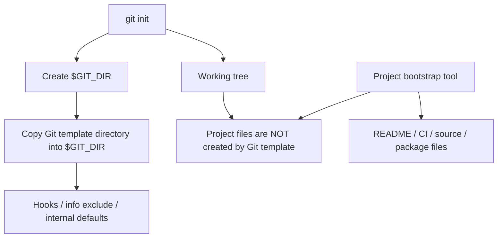
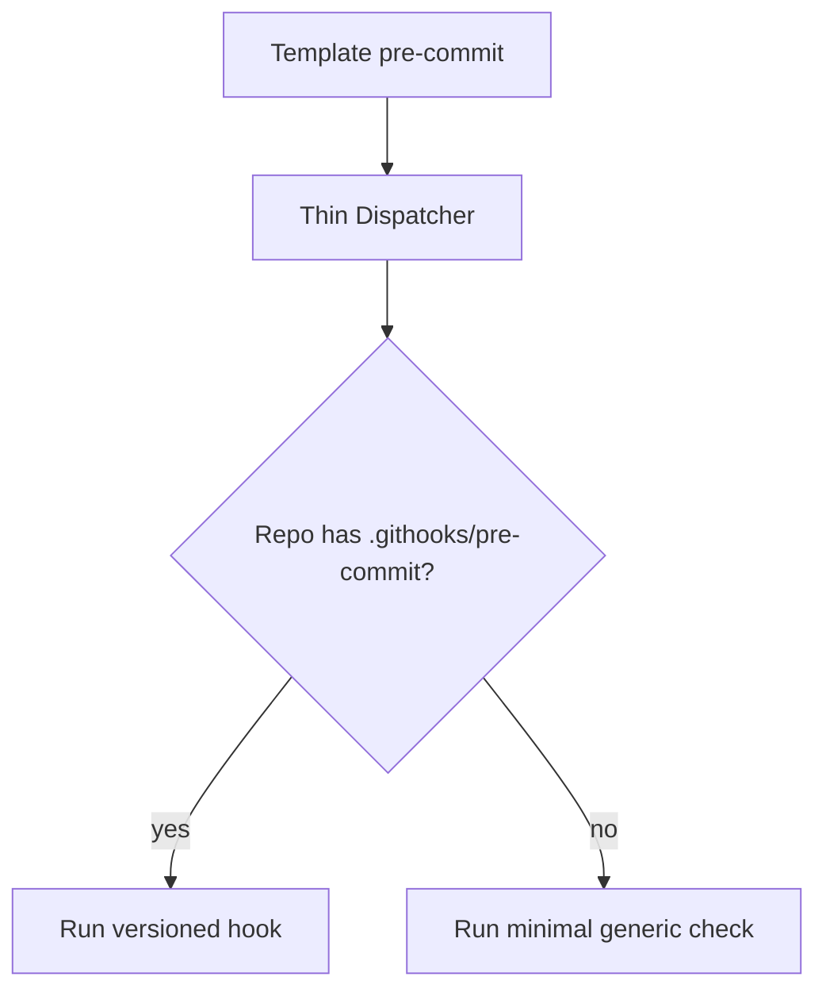
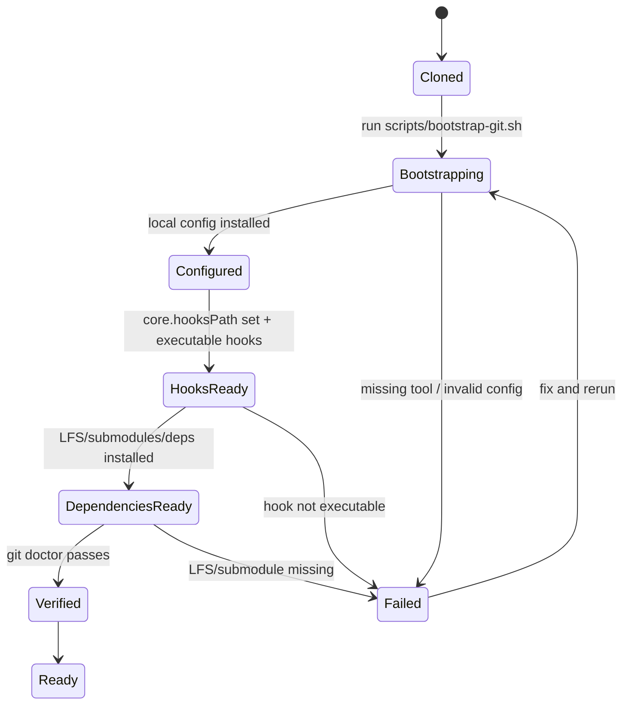
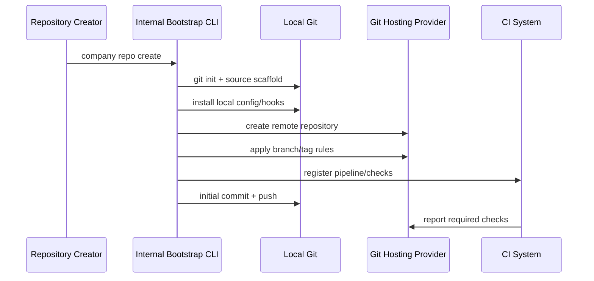

# Local Templates and Repository Bootstrap

Repository bootstrap adalah proses membuat repository baru atau clone baru langsung berada dalam state yang aman, konsisten, dan siap dipakai.

Banyak tim memperlakukan bootstrap sebagai “clone repo, lalu baca README”. Itu terlalu rapuh. Repository yang baik harus punya mekanisme eksplisit untuk mengatur:

- default branch behavior;
- local Git config;
- hooks path;
- commit message template;
- aliases/include config;
- sparse/partial clone profile jika repo besar;
- LFS/submodule setup;
- dependency bootstrap;
- local validation command;
- security guardrails.

Git menyediakan satu mekanisme awal bernama **template directory**. Tapi penting memahami batasnya:

> Git template directory mengisi struktur internal `$GIT_DIR` saat `git init` atau clone tertentu membuat repository. Ia bukan scaffolding project source tree.

Untuk bootstrap production-grade, template directory hanyalah satu bagian. Sisanya perlu script dan policy yang versioned.

---

## 1. Apa Itu Git Template Directory?

Saat `git init` membuat repository, Git membuat struktur seperti `.git/objects`, `.git/refs/heads`, `.git/refs/tags`, dan file/directory internal lain. Git juga bisa menyalin isi template directory ke `$GIT_DIR`.

Template directory biasanya berisi:

```text
hooks/
info/
  exclude
```

Default Git installation sering membawa sample hooks di template directory. Sample hooks ini biasanya disabled karena memiliki suffix `.sample`.

Contoh lokasi umum:

```bash
git --exec-path
```

Atau cek config:

```bash
git config --show-origin --get init.templateDir
```

Jika config tidak ada, Git memakai default template directory dari instalasi Git.

---

## 2. Template Directory Bukan Project Template

Ini kesalahan umum.

Git template directory disalin ke `$GIT_DIR`, bukan ke working tree.

Artinya template directory cocok untuk:

- default hooks;
- `.git/info/exclude`;
- internal metadata awal;
- hook helper files;
- custom template untuk repository internals.

Tidak cocok untuk:

- `README.md`;
- `.gitignore` project;
- source folder;
- CI workflow files;
- package manifest;
- application scaffolding.

Untuk project template, gunakan generator lain:

- repository template;
- `cookiecutter`;
- internal CLI;
- monorepo workspace generator;
- framework generator;
- scaffolding script.

Mermaid mental model:



---

## 3. Setting `init.templateDir`

Buat template directory:

```bash
mkdir -p ~/.config/company/git-template/hooks
mkdir -p ~/.config/company/git-template/info
```

Tambahkan global config:

```bash
git config --global init.templateDir ~/.config/company/git-template
```

Cek:

```bash
git config --global --get init.templateDir
```

Saat repository baru dibuat:

```bash
mkdir demo
cd demo
git init
```

Git akan menyalin isi template ke `.git/`.

---

## 4. Minimal Template Directory Layout

Baseline:

```text
~/.config/company/git-template/
  hooks/
    pre-commit
    commit-msg
  info/
    exclude
```

Contoh `info/exclude`:

```gitignore
# Local editor files
*.swp
*.swo
*~
.DS_Store

# Local scratch
.local/
.tmp/
```

Perbedaan `info/exclude` dan `.gitignore`:

| File | Scope | Versioned? | Cocok Untuk |
|---|---|---:|---|
| `.gitignore` | Project | Ya | Artifact project yang semua orang harus ignore. |
| `.git/info/exclude` | Local repo | Tidak | Preferensi lokal atau machine-specific ignore. |
| `core.excludesFile` | User global | Tidak | Ignore global seperti OS/editor files. |

Jangan taruh ignore project penting hanya di template `info/exclude`. Engineer lain atau CI bisa berbeda.

---

## 5. Hook Bootstrap via Template

Contoh `pre-commit` sederhana:

```bash
#!/usr/bin/env bash
set -euo pipefail

# Avoid committing unresolved conflict markers.
if git diff --cached --check; then
  :
else
  echo "pre-commit: whitespace/conflict-marker check failed" >&2
  exit 1
fi
```

Install:

```bash
cat > ~/.config/company/git-template/hooks/pre-commit <<'SCRIPT'
#!/usr/bin/env bash
set -euo pipefail

git diff --cached --check
SCRIPT
chmod +x ~/.config/company/git-template/hooks/pre-commit
```

Repository baru akan mendapat hook ini di `.git/hooks/pre-commit`.

Tetapi ada batas serius:

> Hooks di `.git/hooks` tidak ikut ter-clone dan tidak versioned bersama source tree.

Template membantu repo baru di mesin user, tetapi tidak menjamin semua clone di semua mesin memiliki hook yang sama.

---

## 6. Prefer `core.hooksPath` untuk Hooks yang Versioned

Untuk repository penting, lebih baik version hooks di working tree:

```text
repo/
  .githooks/
    pre-commit
    commit-msg
    pre-push
  scripts/
    git-hooks/
      check-commit-message.sh
      check-sensitive-paths.sh
```

Lalu set local config:

```bash
git config core.hooksPath .githooks
```

Kelebihan:

- hook scripts versioned;
- perubahan hook bisa direview;
- bisa dites di CI;
- semua engineer bisa install via bootstrap;
- tidak bergantung pada template machine-specific.

Kekurangan:

- user harus menjalankan bootstrap minimal sekali;
- malicious repo dapat menyediakan hook jika user mengaktifkan `core.hooksPath`, jadi trust boundary harus jelas;
- hook client-side tetap bypassable.

Template directory dan `core.hooksPath` bisa digabung:



Contoh dispatcher:

```bash
#!/usr/bin/env bash
set -euo pipefail

root=$(git rev-parse --show-toplevel 2>/dev/null || true)

if [ -n "$root" ] && [ -x "$root/.githooks/pre-commit" ]; then
  exec "$root/.githooks/pre-commit" "$@"
fi

# Generic fallback
git diff --cached --check
```

---

## 7. Bootstrap Script: The Real Control Plane

Template directory hanya berlaku saat init. Untuk clone existing repo, onboarding, atau update hook, butuh bootstrap script.

Contoh layout:

```text
repo/
  scripts/
    bootstrap-git.sh
    git-doctor.sh
  .githooks/
    pre-commit
    commit-msg
    pre-push
  .gitconfig.local.example
```

`scripts/bootstrap-git.sh`:

```bash
#!/usr/bin/env bash
set -euo pipefail

root=$(git rev-parse --show-toplevel)
cd "$root"

echo "Configuring repository-local Git settings..."

git config core.hooksPath .githooks
git config pull.ff only
git config fetch.prune true
git config rebase.autosquash true
git config rerere.enabled true

echo "Checking hook executability..."
chmod +x .githooks/*

echo "Git bootstrap complete."
```

Usage:

```bash
./scripts/bootstrap-git.sh
```

Idempotency invariant:

```text
Bootstrap script may be run repeatedly without corrupting state.
```

Jangan membuat bootstrap yang hanya aman dijalankan sekali.

---

## 8. Repository-Local Config: What to Set and What Not to Set

Repository-local config hidup di `.git/config`, tidak versioned. Bootstrap bisa mengisinya.

Contoh useful local config:

```bash
git config pull.ff only
git config fetch.prune true
git config rebase.autosquash true
git config rerere.enabled true
git config core.hooksPath .githooks
```

Tapi hati-hati dengan config yang terlalu personal.

| Config | Cocok Local Repo? | Catatan |
|---|---:|---|
| `core.hooksPath` | Ya | Untuk versioned hooks. |
| `pull.ff only` | Ya | Jika tim setuju pull harian harus ff-only. |
| `fetch.prune true` | Ya | Biasanya aman, tapi pahami remote refs. |
| `rerere.enabled true` | Tergantung | Berguna untuk rebase/backport berat. |
| `user.name` | Tidak biasanya | Personal identity. |
| `user.email` | Tergantung | Bisa repo-specific untuk work/personal separation. |
| `commit.gpgsign` | Tergantung | Jika repo wajib signed commits. |
| `core.autocrlf` | Hati-hati | Lebih baik kombinasikan dengan `.gitattributes`. |

Config yang menyangkut team invariant sebaiknya juga didokumentasikan dan dicek oleh `git doctor`.

---

## 9. Commit Message Template Bootstrap

Untuk tim yang butuh commit discipline, gunakan commit template.

File versioned:

```text
.gitmessage
```

Contoh:

```text
<type>(<scope>): <summary in imperative mood>

Why:
- 

What changed:
- 

Risk / rollback:
- 

Refs:
- 
```

Bootstrap:

```bash
git config commit.template .gitmessage
```

Ini membantu, tetapi jangan jadikan template terlalu panjang hingga engineer hanya menghapus bagian tanpa berpikir. Template harus mengarahkan context, bukan menjadi form birokratis.

Untuk regulated systems, template bisa berisi trailer guidance:

```text
Risk-Level:
Change-Request:
Reviewed-By:
```

Namun enforcement trailer harus di server/CI jika benar-benar wajib.

---

## 10. Branch Naming and Default Branch Bootstrap

Default branch untuk repo baru bisa dikonfigurasi:

```bash
git config --global init.defaultBranch main
```

Repository bootstrap juga bisa validasi branch naming.

Client-side `pre-push` example:

```bash
#!/usr/bin/env bash
set -euo pipefail

branch=$(git branch --show-current)

case "$branch" in
  main|master|develop|release/*|hotfix/*|feature/*|fix/*|chore/*)
    exit 0
    ;;
  *)
    echo "Invalid branch name: $branch" >&2
    echo "Allowed: feature/*, fix/*, chore/*, release/*, hotfix/*" >&2
    exit 1
    ;;
esac
```

Tetap ingat: client-side hook bisa bypass. Server-side branch protection/ruleset adalah enforcement boundary.

---

## 11. Large Repository Bootstrap

Large repository tidak cukup dengan `git clone` default.

Bootstrap decision matrix:

| Repo Type | Recommended Clone Profile |
|---|---|
| Small repo | Full clone. |
| Large history, normal working tree | Partial clone `--filter=blob:none`. |
| Monorepo, small workspace | Partial clone + sparse checkout. |
| CI release build | Usually full enough history/tags for release correctness. |
| Forensic/audit clone | Avoid shallow/partial unless explicitly acceptable. |

Example bootstrap for monorepo:

```bash
git clone --filter=blob:none --sparse git@example.com:company/monorepo.git
cd monorepo
git sparse-checkout set services/enforcement libs/workflow docs/architecture
./scripts/bootstrap-git.sh
```

Do not blindly use shallow clone for developer work if engineers need:

- merge-base analysis;
- release range changelog;
- bisect;
- tag verification;
- full blame archaeology.

---

## 12. LFS Bootstrap

If repository uses Git LFS:

```bash
git lfs install
git lfs pull
```

Bootstrap should detect LFS pointer files that were not hydrated.

Example check:

```bash
if command -v git-lfs >/dev/null 2>&1; then
  git lfs install --local
  git lfs pull
else
  echo "Git LFS is required for this repository." >&2
  exit 1
fi
```

LFS must be treated as dependency boundary, not invisible implementation detail.

---

## 13. Submodule Bootstrap

If repository uses submodules:

```bash
git submodule update --init --recursive
```

Bootstrap should detect missing submodule commits:

```bash
git submodule status --recursive
```

Submodule guardrail:

```bash
if git submodule status --recursive | grep -q '^-'; then
  echo "Some submodules are not initialized." >&2
  exit 1
fi
```

Production rule:

```text
A release build must record superproject commit and every submodule commit.
```

---

## 14. Bootstrap for Hooks and Policy Checks

Example `.githooks/commit-msg`:

```bash
#!/usr/bin/env bash
set -euo pipefail

msg_file=$1
subject=$(head -n 1 "$msg_file")

if [ ${#subject} -gt 72 ]; then
  echo "Commit subject too long: ${#subject} > 72" >&2
  exit 1
fi

case "$subject" in
  feat\(*|fix\(*|chore\(*|docs\(*|test\(*|refactor\(*|perf\(*)
    exit 0
    ;;
  *)
    echo "Commit subject should start with type(scope): summary" >&2
    exit 1
    ;;
esac
```

This is feedback, not absolute truth. Some commits may need exceptions. If exceptions matter, build an explicit bypass process and server-side validation.

---

## 15. Bootstrap for Security-sensitive Repositories

Security-sensitive repo bootstrap should set up local feedback for:

- secret scanning;
- sensitive path warning;
- commit signing check reminder;
- dependency lockfile check;
- forbidden file pattern;
- generated credential files;
- local config sanity.

Example `pre-commit` secret pattern check:

```bash
#!/usr/bin/env bash
set -euo pipefail

if git diff --cached --name-only | grep -E '(\.pem$|\.key$|id_rsa|secrets?\.ya?ml$)' >/dev/null; then
  echo "Potential secret-like file staged. Review before commit." >&2
  exit 1
fi
```

This is intentionally conservative. For real secret scanning, use a tested scanner in pre-commit and CI.

---

## 16. `git doctor` as Bootstrap Verification

Bootstrap should end with verification.

`scripts/git-doctor.sh`:

```bash
#!/usr/bin/env bash
set -euo pipefail

root=$(git rev-parse --show-toplevel)
cd "$root"

fail=0

check() {
  name=$1
  shift
  echo "== $name =="
  if "$@"; then
    echo "ok"
  else
    echo "failed" >&2
    fail=1
  fi
  echo
}

check "hooks path" test "$(git config --get core.hooksPath || true)" = ".githooks"
check "pull ff only" test "$(git config --get pull.ff || true)" = "only"
check "fetch prune" test "$(git config --get fetch.prune || true)" = "true"
check "working tree status" git status --short

exit "$fail"
```

Run:

```bash
./scripts/git-doctor.sh
```

Expose as alias:

```bash
git config alias.doctor '!./scripts/git-doctor.sh'
```

---

## 17. Bootstrap State Machine

A clean bootstrap lifecycle:



This state machine is more useful than prose onboarding because it defines exit criteria.

---

## 18. Bootstrap Idempotency and Safety Rules

Bootstrap scripts must follow rules:

1. Do not overwrite user identity without explicit confirmation.
2. Do not auto-delete branches.
3. Do not auto-clean untracked files.
4. Do not force-push or rewrite history.
5. Do not install opaque hooks from untrusted source.
6. Print config changes being made.
7. Support re-run.
8. Fail loudly if required tools are missing.
9. Keep destructive remediation as separate explicit command.
10. Prefer repository-local config for repository-specific policy.

Bad bootstrap:

```bash
rm -rf .git/hooks
cp -r hooks .git/hooks
git config --global user.email dev@company.com
git clean -fdx
```

Good bootstrap:

```bash
git config core.hooksPath .githooks
git config pull.ff only
git config fetch.prune true
./scripts/git-doctor.sh
```

---

## 19. Cross-platform Bootstrap

If team uses Linux, macOS, and Windows, shell scripts may not be enough.

Options:

| Approach | Pros | Cons |
|---|---|---|
| Bash | Simple for Unix-like | Windows friction unless Git Bash/WSL. |
| PowerShell | Good Windows support | Unix friction if not standardized. |
| Node.js | Common in frontend/fullstack | Requires Node version. |
| Python | Often available, readable | Version/environment issue. |
| Go binary | Portable single binary | Build/release overhead. |
| Internal CLI | Best long-term consistency | Needs ownership. |

For serious engineering orgs, bootstrap often becomes internal CLI:

```bash
company dev bootstrap git
company dev doctor git
company dev repair hooks
```

The CLI can call Git underneath, but user interface remains stable.

---

## 20. Bootstrap for New Repository Creation

When creating new repository, combine two layers:

1. Git template for `.git` internals.
2. Project generator for working tree files.

Example internal command:

```bash
company repo create service enforcement-api --language java --workflow trunk-release
```

Under the hood:

```bash
mkdir enforcement-api
cd enforcement-api
git init --initial-branch=main
company scaffold service --language java
./scripts/bootstrap-git.sh
git add .
git commit -m "chore(repo): initialize enforcement-api service"
```

Initial commit should include:

- README;
- `.gitignore`;
- `.gitattributes`;
- CI workflow;
- CODEOWNERS;
- branch policy docs;
- build files;
- bootstrap scripts;
- hooks directory if used;
- release metadata convention.

Git template alone cannot create this source tree.

---

## 21. Bootstrap and `.gitattributes`

Every serious repository should consider `.gitattributes` early.

Example:

```gitattributes
* text=auto

*.sh text eol=lf
*.ps1 text eol=crlf
*.md text
*.png binary
*.jpg binary
*.pdf binary

# Generated lockfiles can have custom diff policy if needed
package-lock.json diff=json
```

Why bootstrap matters: EOL normalization added late can create huge noisy diffs. Better to define it at repository creation.

---

## 22. Bootstrap and Branch Protection

Local bootstrap is not enough. Repository creation should also apply server-side rules:

- protect `main`;
- require PR review;
- require status checks;
- require CODEOWNERS for sensitive paths;
- disable force push to protected branch;
- protect release tags;
- require signed tags/commits if policy demands;
- configure merge queue where appropriate.

This is outside local Git, but belongs in repository bootstrap as an organizational process.

A mature bootstrap pipeline:



---

## 23. Migration: Adding Bootstrap to Existing Repo

Existing repositories require careful rollout.

Step plan:

1. inspect current Git config assumptions;
2. add `.githooks/` but do not enforce immediately;
3. add `scripts/bootstrap-git.sh`;
4. add `scripts/git-doctor.sh`;
5. document expected local config;
6. run dry-run with volunteers;
7. add CI check equivalent for critical policy;
8. enable branch protection/rulesets;
9. announce deprecation of old manual setup;
10. periodically audit adoption.

Avoid sudden local hooks that block unrelated work without clear remediation.

---

## 24. Bootstrap Failure Modes

### 24.1 Hook Exists but Not Executable

Symptom:

```text
Hook silently does not run or fails depending on environment.
```

Mitigation:

```bash
chmod +x .githooks/*
```

Doctor check:

```bash
test -x .githooks/pre-commit
```

### 24.2 User Has Conflicting Global Config

Example:

```bash
git config --global pull.rebase true
```

Repo expects:

```bash
git config pull.ff only
```

Mitigation:

- set local config explicitly;
- doctor prints origin of config;
- educate precedence.

Command:

```bash
git config --show-origin --get-regexp '^(pull\.rebase|pull\.ff)'
```

### 24.3 Template Updated but Existing Repos Do Not Change

Template directory is copied at init time. Existing repos do not auto-update.

Mitigation:

- use bootstrap script for existing repos;
- use `core.hooksPath` to version hooks;
- use doctor to detect old setup.

### 24.4 Bootstrap Becomes Hidden Policy

If policy only exists in bootstrap script, reviewers and CI may not know the rules.

Mitigation:

- document policy in handbook;
- enforce critical rules server-side;
- keep bootstrap as local convenience/feedback.

### 24.5 Overzealous Hooks Slow Developers

Pre-commit hook running full integration test causes bypass culture.

Mitigation:

- pre-commit: fast checks;
- pre-push: medium checks;
- CI: complete checks;
- provide explicit command for full validation.

---

## 25. Example Complete Bootstrap Package

Recommended repo layout:

```text
repo/
  .gitattributes
  .gitignore
  .gitmessage
  .githooks/
    pre-commit
    commit-msg
    pre-push
  scripts/
    bootstrap-git.sh
    git-doctor.sh
    check-sensitive-paths.sh
    check-commit-msg.sh
  docs/
    engineering/
      git-workflow.md
      release-process.md
  CODEOWNERS
```

`scripts/bootstrap-git.sh`:

```bash
#!/usr/bin/env bash
set -euo pipefail

root=$(git rev-parse --show-toplevel)
cd "$root"

printf 'Configuring Git for %s\n' "$root"

git config core.hooksPath .githooks
git config pull.ff only
git config fetch.prune true
git config rebase.autosquash true
git config commit.template .gitmessage

if [ -d .githooks ]; then
  chmod +x .githooks/*
fi

if [ -f .lfsconfig ] || git lfs ls-files >/dev/null 2>&1; then
  if command -v git-lfs >/dev/null 2>&1; then
    git lfs install --local
  else
    echo 'Git LFS appears required but git-lfs is not installed.' >&2
    exit 1
  fi
fi

if [ -f .gitmodules ]; then
  git submodule update --init --recursive
fi

./scripts/git-doctor.sh
```

This bootstrap is explicit, re-runnable, and avoids destructive actions.

---

## 26. Summary

Local templates and bootstrap solve different layers:

| Layer | Tool |
|---|---|
| New `.git` internal defaults | Git template directory |
| Versioned hooks | `core.hooksPath` + `.githooks/` |
| Repository-local config | Bootstrap script |
| Project source scaffold | Project generator/template repo |
| Policy enforcement | Branch protection, server hooks, CI |
| Ongoing verification | `git doctor` |

The critical mental model:

```text
Git template initializes repository internals. Bootstrap initializes operational readiness.
```

Good bootstrap makes the correct Git workflow easy, visible, and repeatable. It does not silently mutate user data, hide policy, or pretend local hooks are enforcement.

---

## References

- Git init documentation — template directory: https://git-scm.com/docs/git-init
- Git hooks documentation: https://git-scm.com/docs/githooks
- Git Book — Git Hooks: https://git-scm.com/book/en/v2/Customizing-Git-Git-Hooks
- Git Book — An Example Git-Enforced Policy: https://git-scm.com/book/en/v2/Customizing-Git-An-Example-Git-Enforced-Policy
- Git config documentation: https://git-scm.com/docs/git-config
- Git repository layout: https://git-scm.com/docs/gitrepository-layout
