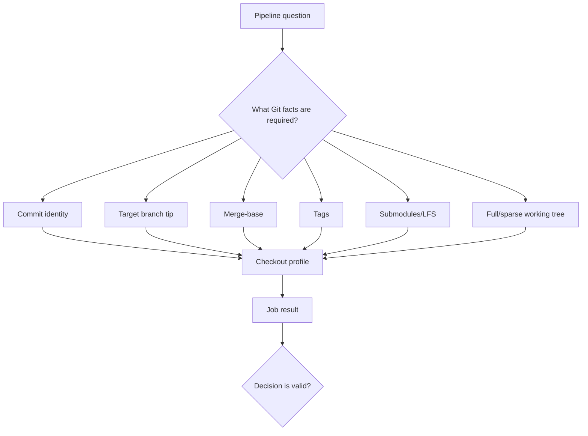

# Part 107 — CI Integration with Git State

CI does not merely "download source code". A correct CI job reconstructs enough **Git state** to answer the question the pipeline is asking.

That distinction matters. A lint job may only need a tree. A release job needs tags, ancestry, commit identity, and a clean source boundary. A pull request validation job may need the merge result, not only the feature branch tip. An affected-test job may need a trustworthy merge-base. A changelog job needs a correct previous release boundary. A provenance job needs a commit SHA that can be verified later.

The central invariant:

> A CI checkout profile is correct only if the local repository contains the refs, objects, tags, and working-tree shape required by the job's decision.

Bad CI Git state creates false confidence. The build may pass because the pipeline tested the wrong commit. A changelog may omit commits because tags were not fetched. A monorepo affected-test job may skip tests because merge-base was missing. A release artifact may be impossible to trace because it was built from a mutable branch name instead of an immutable commit.

---

## 1. Mental Model: CI Checkout Is State Reconstruction

A developer clone tends to have rich state:

- many remote-tracking branches,
- enough history,
- local reflog,
- tags,
- submodule state,
- LFS objects after fetch/checkout,
- worktree metadata,
- local config,
- maybe sparse checkout or partial clone settings.

A CI clone is usually intentionally thin:

- shallow history,
- one branch,
- detached `HEAD`,
- no reflog value for recovery,
- sometimes no tags,
- sometimes no submodules,
- sometimes no LFS content,
- sometimes a provider-specific synthetic merge ref.

This is not wrong by itself. It is wrong when the job assumes richer state than the checkout provides.



A top-level engineer treats CI checkout as a contract, not a default.

---

## 2. Detached HEAD Is Normal in CI

Most CI systems check out a commit SHA directly. That often puts the repository in detached `HEAD` state.

```bash
LC_ALL=C git status --short --branch
LC_ALL=C git rev-parse --verify HEAD^{commit}
LC_ALL=C git symbolic-ref -q --short HEAD || echo "detached HEAD"
```

Detached `HEAD` is not a failure. It is often desirable because the job should test an immutable commit, not a branch name that can move.

The failure is when scripts assume a branch exists:

```bash
# Fragile in CI
branch=$(git branch --show-current)

# Better: use provider env var when you need the branch label,
# and use Git only for immutable identity.
commit=$(git rev-parse --verify HEAD^{commit})
```

Keep two separate values:

| Value | Meaning | Mutable? | Typical Source |
|---|---|---:|---|
| commit SHA | exact source snapshot | no | `git rev-parse HEAD` |
| branch name | human workflow label | yes | CI env var or ref name |
| tag name | release label | sometimes unless protected | CI env var + `git tag --points-at` |
| merge-base | integration boundary | depends on refs/history | `git merge-base` |
| tree state | checked-out files | derived | worktree + index |

Never use branch name as release identity. Use commit SHA and signed/protected tag policy where applicable.

---

## 3. CI Ref Topologies

CI providers differ, but most PR jobs use one of these models.

### 3.1 Source Branch Tip

The job checks out the head of the contributor branch.

```text
main:    A---B---C
              \
feature:       D---E   <- tested
```

This answers: "Does the feature branch compile by itself?"

It does not fully answer: "Will the result be safe after integration into `main`?"

### 3.2 Synthetic Merge Commit

The job checks out a provider-generated merge result.

```text
main:    A---B---C
              \   \
feature:       D---E---M  <- tested synthetic merge result
```

This answers: "Does the candidate integration result compile?"

This is usually better for protected branch validation, but the merge commit may not exist in the canonical repository permanently.

### 3.3 Merge Queue Candidate

The job checks out a queue-generated merge group.

```text
main:    A---B---C
                  \
queue:             M1---M2---M3  <- tested in queue order
```

This answers: "Will this PR pass together with earlier queued PRs?"

This reduces the race where PR A and PR B both pass independently but fail together.

### 3.4 Release Tag Checkout

The job checks out an annotated or signed release tag.

```bash
git fetch --tags origin
git checkout --detach "refs/tags/v2.4.0"
git rev-parse --verify HEAD^{commit}
```

This answers: "Can we build the exact release source?"

For release jobs, this is often the cleanest source boundary.

---

## 4. Job Type Determines Checkout Depth

Not every job needs full history. But every job needs the right history.

| Job Type | Minimal Git State | Common Mistake |
|---|---|---|
| compile/unit test | commit tree, dependencies | unnecessary full clone slows pipeline |
| formatting/lint | commit tree | okay with shallow checkout if no diff boundary needed |
| PR affected tests | source branch + target branch + merge-base | `--depth=1` makes merge-base unavailable |
| PR integration test | candidate merge result | testing source branch only |
| release build | exact commit/tag, full tag info, clean tree | building from branch tip |
| changelog generation | previous tag, current tag, commit range | tags not fetched |
| SemVer/version stamping | tags + ancestry | `git describe` fails in shallow/no-tag clone |
| submodule build | pinned submodule commits | clone parent but not submodules |
| LFS build | LFS pointer + real LFS objects | build uses pointer text instead of binary content |
| monorepo affected graph | merge-base + path history + package graph | shallow clone hides changed paths |
| provenance/SBOM | immutable commit SHA + repo URL + clean state | only recording branch name |

The optimization rule:

> Start with the minimum state required by the job. Increase depth/ref scope only when a decision requires it.

---

## 5. Shallow Clone: Fast but Semantically Narrow

A shallow clone truncates history. That is useful for simple jobs and dangerous for ancestry-based jobs.

```bash
git rev-parse --is-shallow-repository
```

Common failure:

```bash
base=$(git merge-base HEAD origin/main)
# fatal: Not a valid object name origin/main
# or empty result because the required ancestor is missing
```

A safer PR affected-test bootstrap:

```bash
set -euo pipefail

TARGET_BRANCH="${TARGET_BRANCH:-main}"
REMOTE="${REMOTE:-origin}"

# Ensure target branch ref exists locally.
git fetch --no-tags "$REMOTE" \
  "+refs/heads/$TARGET_BRANCH:refs/remotes/$REMOTE/$TARGET_BRANCH"

# Deepen until merge-base exists, bounded to avoid infinite network work.
for depth in 50 200 1000 5000; do
  if git merge-base HEAD "$REMOTE/$TARGET_BRANCH" >/dev/null 2>&1; then
    break
  fi
  git fetch --deepen="$depth" "$REMOTE" "$TARGET_BRANCH"
done

base=$(git merge-base HEAD "$REMOTE/$TARGET_BRANCH")
echo "merge-base=$base"

git diff --name-only "$base"...HEAD
```

If this job is business-critical, prefer an explicit checkout profile over adaptive guessing.

---

## 6. Tags Are Not Optional for Release Jobs

Many CI checkouts do not fetch all tags. That is good for speed but bad for release semantics.

Tag-dependent operations include:

- `git describe`,
- changelog boundaries,
- SemVer derivation,
- release note generation,
- release artifact stamping,
- "commits since last release" metrics,
- comparing current release candidate to previous release.

Release jobs should make tag fetching explicit:

```bash
git fetch --force --tags origin

git tag --points-at HEAD

git describe --tags --dirty --always
```

Do not silently tolerate missing tags in release jobs. Fail loudly.

```bash
if ! git describe --tags --abbrev=0 >/dev/null 2>&1; then
  echo "ERROR: no reachable release tag. Fetch tags or build from a release tag." >&2
  exit 1
fi
```

---

## 7. Merge-Base Correctness for PR Pipelines

PR pipelines often need three different diffs.

```bash
# Commits on feature not reachable from target
git log --oneline origin/main..HEAD

# Changes from merge-base to feature tip, common PR diff semantics
git diff --name-only origin/main...HEAD

# Difference between target tip tree and feature tip tree
git diff --name-only origin/main..HEAD
```

The three-dot diff depends on merge-base.

```bash
base=$(git merge-base origin/main HEAD)
git diff --name-only "$base" HEAD
```

If the target branch is missing, stale, or too shallow, the CI decision is invalid.

```bash
git fetch origin +refs/heads/main:refs/remotes/origin/main

git merge-base --is-ancestor "$(git merge-base origin/main HEAD)" HEAD
```

A robust affected-test job should print:

```bash
echo "HEAD=$(git rev-parse HEAD)"
echo "target=$(git rev-parse origin/main)"
echo "merge_base=$(git merge-base origin/main HEAD)"
echo "shallow=$(git rev-parse --is-shallow-repository)"
```

Visibility beats silent magic.

---

## 8. Testing the Merge Result, Not Just the Branch

For protected `main`, the best CI question is usually:

> Does the proposed change pass after being integrated with the latest protected line?

Local equivalent:

```bash
git fetch origin main
base_branch="origin/main"

# Start from feature branch tip already checked out.
git merge --no-ff --no-commit "$base_branch" || {
  echo "Integration conflict against target branch" >&2
  exit 1
}

# Or create an explicit test merge from target into PR.
git reset --hard HEAD
```

In real CI, prefer provider-supported PR merge refs or merge queues when available. The important part is the invariant: test the exact candidate that will be merged, or test a queue candidate that includes earlier accepted changes.

---

## 9. Clean Tree and Dirty-State Detection

Builds that modify tracked files can hide non-reproducibility.

```bash
git status --porcelain=v1
```

After generation steps, decide whether generated files are expected outputs or checked-in artifacts.

```bash
npm run generate

if [ -n "$(git status --porcelain=v1)" ]; then
  echo "ERROR: build generated uncommitted changes" >&2
  git status --short
  git diff --stat
  exit 1
fi
```

This is especially important for:

- code generation,
- GraphQL/OpenAPI clients,
- protobuf stubs,
- lockfiles,
- formatted files,
- database migration snapshots,
- localization bundles,
- generated docs.

---

## 10. Build Metadata: What to Stamp into Artifacts

Every deployable artifact should carry source metadata.

At minimum:

```bash
GIT_COMMIT=$(git rev-parse --verify HEAD^{commit})
GIT_SHORT_COMMIT=$(git rev-parse --short=12 HEAD)
GIT_DIRTY=$(test -z "$(git status --porcelain=v1)" && echo false || echo true)
GIT_TAGS=$(git tag --points-at HEAD | paste -sd ',' -)
GIT_DESCRIBE=$(git describe --tags --dirty --always 2>/dev/null || git rev-parse --short=12 HEAD)
GIT_REMOTE=$(git config --get remote.origin.url || true)
BUILD_TIME_UTC=$(date -u +%Y-%m-%dT%H:%M:%SZ)
```

Example generated `version.json`:

```bash
cat > version.json <<EOF
{
  "gitCommit": "$GIT_COMMIT",
  "gitShortCommit": "$GIT_SHORT_COMMIT",
  "gitDirty": $GIT_DIRTY,
  "gitTags": "$GIT_TAGS",
  "gitDescribe": "$GIT_DESCRIBE",
  "gitRemote": "$GIT_REMOTE",
  "buildTimeUtc": "$BUILD_TIME_UTC"
}
EOF
```

For regulated or high-integrity systems, store this metadata both inside the artifact and outside it in release evidence.

---

## 11. CI Checkout Profiles

### 11.1 Fast Unit Test Profile

Use when the job needs only the current tree.

```bash
git clone --depth=1 --single-branch --branch "$BRANCH" "$URL" repo
cd repo
git rev-parse --verify HEAD^{commit}
```

Appropriate for:

- format check,
- unit test without affected-test logic,
- static type check,
- package build that does not need version-from-tag.

Not appropriate for:

- changelog,
- version from tags,
- merge-base based affected tests,
- release build,
- ancestry/security audit.

### 11.2 PR Affected-Test Profile

Use when the job needs changed files since target branch.

```bash
git fetch origin +refs/heads/main:refs/remotes/origin/main
base=$(git merge-base origin/main HEAD)
git diff --name-only "$base" HEAD
```

If shallow clone cannot provide merge-base, deepen or unshallow:

```bash
git fetch --unshallow origin || true
```

### 11.3 Release Build Profile

Use when producing an artifact that may be deployed.

```bash
git fetch --force --tags origin

git rev-parse --verify HEAD^{commit}

git tag --points-at HEAD

git status --porcelain=v1
```

Recommended gates:

```bash
test -z "$(git status --porcelain=v1)"
git describe --tags --exact-match HEAD >/dev/null
```

### 11.4 Monorepo Sparse Profile

Use when the working set is smaller than the repo.

```bash
git clone --filter=blob:none --no-checkout "$URL" repo
cd repo
git sparse-checkout init --cone
git sparse-checkout set services/billing libs/common build

git checkout "$COMMIT"
```

But affected-test logic may still require target refs and merge-base.

### 11.5 Full Forensic Profile

Use when correctness beats speed.

```bash
git clone "$URL" repo
cd repo
git fetch --all --tags --prune
git fsck --connectivity-only
```

Appropriate for:

- release evidence,
- audit,
- security incident,
- history analysis,
- repository migration.

---

## 12. Submodules in CI

Submodules add another layer of pinned Git state.

```bash
git submodule sync --recursive
git submodule update --init --recursive

git submodule status --recursive
```

CI must validate that submodule commits are available and expected.

Failure modes:

| Failure | Cause | Control |
|---|---|---|
| missing submodule commit | upstream submodule repo rewrote history or object unavailable | mirror submodule repos; protect submodule release refs |
| detached submodule confusion | submodule checked at commit, not branch | treat gitlink SHA as dependency lock |
| parent passes, submodule changed externally | submodule branch was followed dynamically | pin commit; avoid branch-following in release builds |
| CI forgets recursive init | parent has pointer only | enforce bootstrap script |

For release builds, submodule status should be part of evidence.

---

## 13. Git LFS in CI

Git LFS stores pointer files in Git and real content in LFS storage. A checkout that lacks LFS pull may compile against pointer text.

```bash
git lfs install --local
git lfs fetch --all
git lfs checkout

git lfs ls-files
```

In large repos, `git lfs fetch --all` may be too expensive. Prefer explicit LFS include/exclude policy where supported.

Release invariant:

> If a deployable artifact depends on LFS content, release evidence must include the Git commit and enough LFS object identity to retrieve or verify the binary inputs.

---

## 14. Cache Pitfalls

CI caches are useful and dangerous.

Common Git cache mistakes:

- reusing `.git` across jobs without pruning stale refs,
- assuming cached tags are complete,
- using a cached partial clone for a release job,
- stale submodule cache,
- stale LFS cache,
- cached generated files masking dirty-state failures,
- shared cache with credentials in remote URL.

Safer cache validation:

```bash
git remote -v
git fetch --prune --tags origin
git remote prune origin

git rev-parse --verify HEAD^{commit}
git fsck --connectivity-only
```

For high-integrity release jobs, prefer clean checkout over clever cache unless the cache is itself validated.

---

## 15. CI Scripts Should Fail on Ambiguous State

Bad script:

```bash
PREV_TAG=$(git describe --tags --abbrev=0 || true)
git log "$PREV_TAG"..HEAD
```

If `PREV_TAG` is empty because tags were not fetched, the script may generate nonsense.

Better:

```bash
PREV_TAG=$(git describe --tags --abbrev=0 HEAD^ 2>/dev/null) || {
  echo "ERROR: cannot determine previous tag. Did CI fetch tags and enough history?" >&2
  exit 1
}

git log --oneline "$PREV_TAG"..HEAD
```

Rule:

> A CI script should distinguish "empty result" from "insufficient Git state".

---

## 16. Provider Environment Variables vs Git Truth

CI providers expose environment variables for branch names, PR numbers, actor, event type, and target branch. These are useful. They are not substitutes for Git object verification.

Use provider env vars for workflow labels:

- PR number,
- target branch name,
- source branch name,
- actor,
- event type,
- run ID.

Use Git for source identity:

- commit SHA,
- tree state,
- tag pointing at commit,
- merge-base,
- parent commit,
- changed files.

Cross-check when possible:

```bash
ci_sha="${CI_COMMIT_SHA:-}"
git_sha=$(git rev-parse HEAD)

if [ -n "$ci_sha" ] && [ "$ci_sha" != "$git_sha" ]; then
  echo "ERROR: CI metadata SHA does not match checked out HEAD" >&2
  exit 1
fi
```

---

## 17. CI State Snapshot Script

Add this script to every serious repository.

```bash
#!/usr/bin/env bash
set -euo pipefail

echo "== Git identity =="
echo "HEAD:        $(git rev-parse --verify HEAD^{commit})"
echo "short:       $(git rev-parse --short=12 HEAD)"
echo "branch:      $(git symbolic-ref -q --short HEAD || echo detached)"
echo "shallow:     $(git rev-parse --is-shallow-repository)"
echo "dirty:       $(test -z "$(git status --porcelain=v1)" && echo false || echo true)"

echo

echo "== Remotes =="
git remote -v || true

echo

echo "== Recent commits =="
git --no-pager log --oneline --decorate -n 10 || true

echo

echo "== Tags pointing at HEAD =="
git tag --points-at HEAD || true

echo

echo "== Describe =="
git describe --tags --dirty --always || true

echo

echo "== Submodules =="
git submodule status --recursive || true

echo

echo "== Worktree status =="
git status --short --branch || true
```

This is cheap evidence. It makes incidents faster to diagnose.

---

## 18. Failure Modes and Fixes

| Symptom | Likely Git-State Cause | Fix |
|---|---|---|
| changelog empty | tags/history missing | fetch tags and enough history |
| affected tests skipped | merge-base unavailable | fetch target branch and deepen/unshallow |
| release version becomes `0.0.0` | `git describe` cannot see tags | release checkout profile |
| PR passed but main broke | tested source branch, not merge result | test merge ref or use merge queue |
| artifact cannot be traced | branch name recorded instead of SHA | stamp commit SHA and tag |
| submodule file missing | submodule not initialized | recursive submodule update |
| binary input unreadable | LFS object not fetched | LFS fetch/checkout policy |
| dirty release artifact | build generated untracked/tracked changes | fail on dirty tree |
| wrong changed files | stale target branch | force fetch target ref before diff |
| release tag not found | shallow/no-tag checkout | explicit `fetch --tags` |

---

## 19. CI Git Integration Checklist

Before trusting a CI result, answer:

- What exact commit did the job test?
- Was the job run on branch tip, tag, synthetic merge commit, or merge queue candidate?
- Is the checkout shallow?
- Are target branch refs present and fresh?
- Are tags needed and fetched?
- Is merge-base available and printed?
- Are submodules initialized recursively if required?
- Are LFS objects present if required?
- Is the working tree clean before and after generation/build?
- Is source metadata embedded into artifacts?
- Does the job fail when Git state is insufficient?

---

## 20. Lab: Break and Fix CI State Locally

Create a shallow clone:

```bash
git clone --depth=1 <repo-url> ci-shallow
cd ci-shallow
```

Try operations:

```bash
git describe --tags --always
git merge-base HEAD origin/main
git log --oneline --decorate --graph --all -n 20
```

Then progressively fix state:

```bash
git fetch origin +refs/heads/main:refs/remotes/origin/main
git fetch --deepen=100 origin main
git fetch --tags origin
```

Observe which operations start working and why.

The skill is not memorizing CI YAML. The skill is knowing which Git facts a job needs and proving the checkout contains them.

---

## References

- Git `clone` documentation: `--depth`, `--single-branch`, shallow clone options.
- Git `log` and `rev-list` documentation: commit traversal and revision ranges.
- Git `describe` documentation: human-readable names based on reachable tags.
- Git `shortlog` documentation: summarizing commit history for release announcements.
- Git `submodule` documentation: recursive submodule initialization and update.
- Git LFS documentation: pointer files and large-object storage model.
