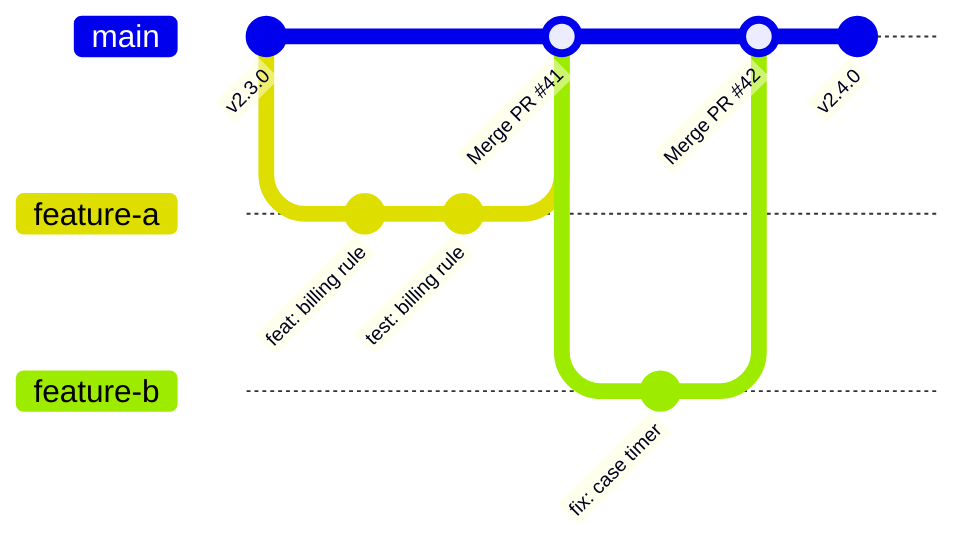
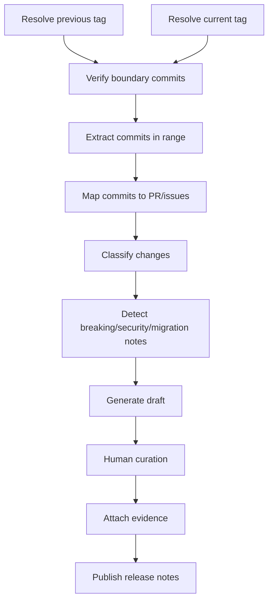

# Part 108 — Release Notes from Git History

Release notes are not a decorative document written at the end. They are a projection of a release boundary.

A release boundary is usually:

```text
previous released source identity  ->  current released source identity
```

In Git terms, that is often:

```bash
git log <previous-tag>..<current-tag>
```

But that simple command is only correct if the tags are correct, fetched, protected, and meaningful; if the branch topology matches the team's merge policy; and if commit messages/PR metadata contain enough intent to be understood.

The central invariant:

> Release notes are trustworthy only when they are derived from an explicit, immutable Git boundary and then curated against product, operational, and compatibility meaning.

Generated release notes are a draft. Human curation turns raw history into communication and evidence.

---

## 1. The Release Boundary Comes First

Do not start with "what changed recently". Start with the exact source boundary.

```bash
PREVIOUS=v2.3.0
CURRENT=v2.4.0

git rev-parse --verify "$PREVIOUS^{commit}"
git rev-parse --verify "$CURRENT^{commit}"

git log --oneline "$PREVIOUS..$CURRENT"
```

For release jobs, fail if either boundary cannot be verified.

```bash
for rev in "$PREVIOUS" "$CURRENT"; do
  git rev-parse --verify "$rev^{commit}" >/dev/null || {
    echo "ERROR: release boundary $rev does not resolve to a commit" >&2
    exit 1
  }
done
```

If your tags are annotated, remember the tag object and the peeled commit are different concepts.

```bash
git rev-parse v2.4.0       # tag object for annotated tag, or commit for lightweight tag
git rev-parse v2.4.0^{}    # peeled object
git rev-parse v2.4.0^{commit}
```

Release notes should usually use the peeled commit as source tree identity, while the tag object/signature remains part of release evidence.

---

## 2. History Topology Shapes the Notes

The same source changes can produce different Git history depending on merge method.



A merge-commit workflow can make first-parent history useful:

```bash
git log --first-parent --oneline v2.3.0..v2.4.0
```

A squash-merge workflow puts PR-level intent in the squash commit:

```bash
git log --oneline v2.3.0..v2.4.0
```

A rebase-merge workflow exposes individual commits directly on main:

```bash
git log --reverse --no-merges v2.3.0..v2.4.0
```

The release note generator must match the merge policy.

| Merge Policy | Best Input for Notes | Risk |
|---|---|---|
| merge commits | `--first-parent` merge commits + PR metadata | inner commits may contain important details missed by merge title |
| squash merge | squash commit subject/body/trailers | loses atomic commit series details |
| rebase merge | individual commits on main | too noisy if commits are not curated |
| mixed policy | must normalize from PR metadata | ambiguous source of truth |

Mixed policy is the hardest. It is not impossible, but the generator must understand more cases.

---

## 3. Raw Commit Extraction

Basic extraction:

```bash
git log --reverse --format='%h %s' "$PREVIOUS..$CURRENT"
```

Include body:

```bash
git log --reverse --format='%H%n%s%n%b%n---END---' "$PREVIOUS..$CURRENT"
```

Only first-parent integration commits:

```bash
git log --first-parent --reverse --format='%H %s' "$PREVIOUS..$CURRENT"
```

Skip merge commits:

```bash
git log --no-merges --reverse --format='%H %s' "$PREVIOUS..$CURRENT"
```

Find commits touching a subsystem:

```bash
git log --reverse --format='%h %s' "$PREVIOUS..$CURRENT" -- services/enforcement/
```

Use these commands as extraction primitives, not as finished release notes.

---

## 4. Classification Model

Release notes need categories that users and operators understand.

A practical taxonomy:

| Category | Meaning | Source Signals |
|---|---|---|
| Added | new externally visible capability | `feat:`, PR label, issue type |
| Changed | behavior changed without removal | `change:`, migration notes, design note |
| Fixed | bug/regression/security fix | `fix:`, `bug:`, incident reference |
| Deprecated | supported but scheduled for removal | explicit deprecation trailer/section |
| Removed | removed capability/API/config | breaking-change marker |
| Security | auth, permission, credential, vulnerability changes | security label/path/trailer |
| Migration | DB/schema/event/config migration | path + trailer |
| Operational | deployment, observability, performance, SRE-facing change | infra path, perf label |
| Internal | refactor/test/build-only | `refactor:`, `test:`, `build:` |

Do not publish everything. Release notes are a view, not a dump.

---

## 5. Conventional Commits Are Helpful but Not Sufficient

A conventional subject helps automation:

```text
feat(enforcement): add escalation pause reason
fix(authz): deny stale reviewer override
perf(queue): reduce lock contention in claim worker
```

But subject line alone does not carry full release meaning.

Better commit body:

```text
fix(authz): deny stale reviewer override

The reviewer override screen previously trusted cached role membership.
A user whose elevated role had expired could still complete an override
inside an already-open session.

This change revalidates role membership at submit time and records the
fresh authorization decision in the audit event.

Impact: prevents stale privileged action approval.
Migration: none.
Risk: medium; affects override submission only.
```

Useful trailers:

```text
Refs: CASE-1842
Release-Note: Fixed stale reviewer override authorization.
Risk: medium
Migration: none
Security-Impact: authorization
```

Git trailers are especially useful because they are machine-parseable while still living in commit messages.

---

## 6. Trailer-Based Release Notes

Commit trailers look like RFC 822-style key/value lines at the end of a commit message.

Example extraction:

```bash
git log --format='%H%x00%B%x00END%x00' "$PREVIOUS..$CURRENT" |
while IFS= read -r -d '' block; do
  printf '%s\n' "$block" | git interpret-trailers --parse
  printf '\n'
done
```

A simpler per-commit view:

```bash
git log --reverse --format='%H%n%B%n---' "$PREVIOUS..$CURRENT" |
awk '
  /^Release-Note:/ { print substr($0, 15) }
'
```

Possible trailer policy:

| Trailer | Required For | Example |
|---|---|---|
| `Release-Note` | user-visible change | `Added bulk case reassignment audit view.` |
| `Breaking-Change` | incompatible behavior | `true` plus explanation in body |
| `Migration` | DB/config/API migration | `requires backfill job case_state_v3` |
| `Security-Impact` | auth/security/privacy change | `authorization` |
| `Risk` | operational risk | `low`, `medium`, `high` |
| `Refs` | issue/case/story | `CASE-1842` |

The policy is useful only if commit/PR review enforces it.

---

## 7. PR Metadata vs Commit Metadata

In many teams, PR metadata is richer than commit messages:

- PR title,
- PR body,
- labels,
- milestone,
- linked issues,
- reviewers,
- approvals,
- check results,
- merge method,
- discussion context.

Git itself may not store all of this. The release note pipeline has two choices:

1. Use Git-only metadata for portability and durability.
2. Enrich Git-derived ranges with hosting-provider PR metadata.

A strong internal system often does both:

- Git defines the release boundary.
- Hosting metadata enriches classification.
- The final release note is stored as release evidence.

Do not let hosting metadata replace Git boundary verification.

---

## 8. First-Parent Release Notes

In merge-commit workflows, first-parent history gives a clean integration timeline.

```bash
git log --first-parent --reverse --format='%h %s' "$PREVIOUS..$CURRENT"
```

This is especially useful if merge commits correspond to PRs.

Example:

```text
9a12fe1 Merge pull request #431 from team/authz-stale-override
4bc912a Merge pull request #438 from team/case-escalation-pause
ab72d4c Merge pull request #441 from team/release-telemetry
```

But merge titles are often low signal. Enforce PR title quality or use squash commits if PR-level summaries are your release note input.

Bad:

```text
Merge pull request #431 from fix-thing
```

Good:

```text
fix(authz): revalidate reviewer override permission at submit time (#431)
```

---

## 9. `git shortlog` for Contributor-Oriented Notes

`git shortlog` summarizes commits grouped by author.

```bash
git shortlog -sne "$PREVIOUS..$CURRENT"
```

This is useful for:

- contributor acknowledgements,
- open-source release announcements,
- maintainer reports.

It is usually not enough for product release notes, because author grouping does not express user impact.

A hybrid release note may include:

- curated changes by category,
- breaking changes,
- migration notes,
- security notes,
- contributor summary.

---

## 10. `git describe` for Version Context

`git describe` gives a human-readable name based on reachable tags.

```bash
git describe --tags --dirty --always
```

Useful output:

```text
v2.4.0-12-gabc1234
```

Interpretation:

- nearest reachable tag: `v2.4.0`,
- commits ahead: `12`,
- abbreviated commit: `abc1234` with `g` prefix convention,
- dirty suffix if working tree modified.

Use it for build metadata, not as a replacement for explicit release boundary.

For release notes, prefer explicit:

```bash
PREVIOUS=v2.3.0
CURRENT=v2.4.0
```

---

## 11. Release Note Generation Pipeline



The generation step should produce a draft with enough raw links/evidence for review.

The curation step should remove noise, clarify impact, and add operational instructions.

---

## 12. Minimal Git-Only Generator

This is intentionally simple. It assumes commit subjects carry type prefixes.

```bash
#!/usr/bin/env bash
set -euo pipefail

prev=${1:?usage: release-notes <previous-tag> <current-tag>}
curr=${2:?usage: release-notes <previous-tag> <current-tag>}

for rev in "$prev" "$curr"; do
  git rev-parse --verify "$rev^{commit}" >/dev/null
 done

echo "# Release Notes: $curr"
echo
echo "Source range: \`$prev..$curr\`"
echo "Previous: \`$(git rev-parse --short=12 "$prev^{commit}")\`"
echo "Current:  \`$(git rev-parse --short=12 "$curr^{commit}")\`"
echo

section() {
  local title=$1
  local pattern=$2
  echo "## $title"
  git log --reverse --format='- %s (%h)' "$prev..$curr" \
    | grep -E "$pattern" || echo "- None"
  echo
}

section "Added" '^- feat(\(|:|!)'
section "Fixed" '^- fix(\(|:|!)'
section "Performance" '^- perf(\(|:|!)'
section "Security" '^- (security|sec)(\(|:|!)'
section "Breaking Changes" '!:|BREAKING CHANGE|Breaking-Change:'
section "Internal" '^- (refactor|test|build|ci|docs|chore)(\(|:|!)'
```

This is not enough for production by itself, but it establishes the right flow:

1. verify boundary,
2. extract commit range,
3. classify,
4. generate draft.

---

## 13. Better Generator: Use Explicit `Release-Note` Trailer

Subject prefixes often generate noisy notes. Explicit release note trailers produce better output.

Example commit:

```text
feat(case): support escalation pause reason

Adds a required reason when a supervisor pauses escalation.

Release-Note: Added escalation pause reasons for supervisor actions.
Risk: low
Refs: CASE-2719
```

Extraction:

```bash
git log --reverse --format='%H%x1f%s%x1f%B%x1e' "$PREVIOUS..$CURRENT" |
while IFS=$'\x1f' read -r sha subject body; do
  note=$(printf '%s\n' "$body" | git interpret-trailers --parse | awk -F': ' '$1=="Release-Note" {print $2}')
  if [ -n "$note" ]; then
    printf '- %s (`%s`)\n' "$note" "${sha:0:12}"
  fi
done
```

Policy:

- User-visible changes should have `Release-Note`.
- Internal-only changes may use `Release-Note: none`.
- Security/migration/breaking changes require explicit trailers.
- CI should fail if sensitive paths changed without required trailers.

---

## 14. Release Notes for Regulated Systems

For regulated case-management, enforcement, financial, medical, or compliance systems, release notes are not only user communication. They are evidence.

Add sections:

```mdx
## Source Identity

- Repository: <canonical repo>
- Previous tag: <previous tag + commit>
- Current tag: <current tag + commit>
- Build artifact digest: <digest>
- Build run: <CI run id>

## User-Visible Changes

## Operational Changes

## Security / Authorization Changes

## Data / Migration Changes

## Compatibility / API Contract Changes

## Known Risks

## Rollback / Revert Notes

## Verification Evidence
```

The release note should allow an auditor or incident responder to answer:

- what source was released,
- what changed,
- which controls approved it,
- what migration or operational steps were required,
- which artifact was built,
- how to rollback or compensate.

---

## 15. Breaking Change Detection

Breaking changes are too important to infer only from subject lines.

Detection signals:

- `!` in conventional commit subject,
- `BREAKING CHANGE:` footer,
- `Breaking-Change:` trailer,
- API/schema path changes,
- deleted config keys,
- migration files,
- public event contract changes,
- permission model changes,
- removed feature flags,
- dependency major upgrades.

Example gate:

```bash
changed=$(git diff --name-only "$PREVIOUS..$CURRENT")

if printf '%s\n' "$changed" | grep -E '(^api/|/openapi\.ya?ml$|/proto/|/migrations/)'; then
  if ! git log --format='%B' "$PREVIOUS..$CURRENT" | grep -E 'BREAKING CHANGE:|Breaking-Change:'; then
    echo "ERROR: contract-sensitive paths changed without breaking-change declaration" >&2
    exit 1
  fi
fi
```

This will produce false positives. That is acceptable if the team treats it as a prompt for explicit reasoning.

---

## 16. Security and Migration Notes Need Special Handling

Do not bury security or migration changes in generic "Fixed" lists.

Security note example:

```mdx
## Security

- Revalidated reviewer override permission at submit time to prevent stale privileged approval sessions.
  No user action required. Existing audit records are unaffected.
```

Migration note example:

```mdx
## Migration

- Added `case_escalation_pause_reason` column and backfilled active paused escalations.
  Deployment requires running migration `20260707_01_case_pause_reason` before enabling the supervisor UI flag.
```

Operational note example:

```mdx
## Operational

- Added queue-depth metric `case_assignment_queue_depth` and alert threshold recommendation for escalation workers.
```

The release note should be written for the people who will operate and support the release, not only for developers.

---

## 17. Anti-Patterns

### 17.1 "Everything Since Main"

```bash
git log main..HEAD
```

This is not a release boundary. `main` moves.

Use tags or immutable commit SHAs.

### 17.2 "Latest Tag" Without Verification

```bash
prev=$(git describe --tags --abbrev=0)
```

This may pick a tag that is reachable but not the previous production release.

Maintain release metadata explicitly.

### 17.3 Raw Commit Dump

```mdx
- fix stuff
- update
- changes
- WIP
```

This leaks engineering noise and hides user impact.

### 17.4 Ignoring Merge Policy

Using `--first-parent` on a squash-only repo may be unhelpful. Using all commits on a merge-heavy repo may be noisy. The extraction must match the workflow.

### 17.5 Publishing Notes Without Artifact Identity

Release notes that do not identify the artifact and source commit are weak evidence.

---

## 18. Release Notes Quality Bar

A strong release note answers:

- What changed for users?
- What changed for operators?
- What changed for integrators/API consumers?
- What changed for security, authorization, or audit behavior?
- What migration or rollout action is required?
- What risks or known issues exist?
- What exact source and artifact does this note describe?
- What is the rollback or revert guidance?

A weak release note only repeats commit subjects.

---

## 19. Checklist Before Publishing

- Previous and current release boundaries verified with `rev-parse`.
- Tags fetched and protected.
- Current tag points to the intended release commit.
- Commit range reviewed.
- Merge policy accounted for: first-parent, squash, rebase, or mixed.
- Breaking changes explicitly identified.
- Security-sensitive changes explicitly identified.
- Migration and operational steps included.
- Internal-only changes excluded or summarized separately.
- Artifact digest/build metadata attached.
- Rollback guidance included where relevant.
- Human owner signed off.

---

## 20. Lab: Build a Release Note Draft

Pick any repository with tags.

```bash
git fetch --tags

git tag --sort=-creatordate | head -n 5
```

Choose two tags:

```bash
PREVIOUS=<old-tag>
CURRENT=<new-tag>
```

Generate raw views:

```bash
git log --oneline "$PREVIOUS..$CURRENT"
git log --first-parent --oneline "$PREVIOUS..$CURRENT"
git shortlog -sne "$PREVIOUS..$CURRENT"
git diff --stat "$PREVIOUS..$CURRENT"
```

Then write a curated release note with:

- source identity,
- highlights,
- fixes,
- breaking changes,
- migration notes,
- operational notes,
- contributor summary.

Compare the curated note with the raw commit dump. The difference is release engineering.

---

## References

- Git `log` documentation: commit traversal, revision ranges, formatting.
- Git pretty formats documentation: structured formatting of commit output.
- Git `interpret-trailers` documentation: parsing and adding trailer lines in commit messages.
- Git `shortlog` documentation: summarizing commits for release announcements.
- Git `describe` documentation: deriving names from reachable tags.
- Semantic Versioning: version meaning and compatibility boundary.
