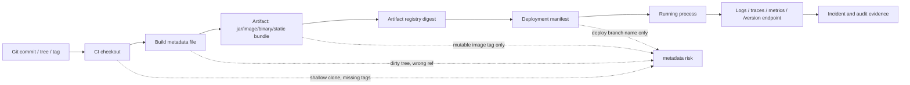

# Part 109 — Git Metadata for Observability

A production system should be able to answer one question immediately:

```text
Exactly what source code is this process running?
```

Not approximately.
Not "probably latest main".
Not "the image tag says v1.8.0".
Not "the deployment dashboard says it came from yesterday's build".

Exactly.

Git metadata is the bridge between source control, build artifacts, deployed runtime, logs, traces, incident reports, and audit evidence. Without that bridge, rollback is slower, debugging is noisier, security response is weaker, and release records become narrative instead of fact.

The central invariant:

> Every built artifact and running process must be traceable to an immutable Git source identity, plus enough build/deployment context to explain how that source became the running artifact.

A commit SHA alone is necessary, but not always sufficient. A strong production metadata record usually includes commit, tree, tag, dirty state, build pipeline, artifact digest, environment, and deployment identity.

---

## 1. Source Identity vs Build Identity vs Deployment Identity

Do not collapse these three identities.

| Identity | Meaning | Example | Mutability Risk |
|---|---|---|---|
| Source identity | Which Git content was built | commit SHA, tree SHA, release tag | Branch/tag names can move |
| Build identity | Which build produced artifact | CI run ID, builder image, build timestamp, artifact digest | Rebuild from same commit may differ |
| Deployment identity | Which artifact is running where | deployment ID, cluster, namespace, rollout revision | Same artifact can be deployed many times |

A precise runtime record looks like this:

```json
{
  "source": {
    "repository": "ssh://git.example.internal/platform/case-management.git",
    "commit": "8f4b7c0e92b4b76e2f5cc7f6f2e6a79d48b0d1c2",
    "tree": "6e9d8d7b96c2b7f8b5b5b4d62b3a1e0a4d5f8c21",
    "tag": "v2.17.3",
    "describe": "v2.17.3-0-g8f4b7c0",
    "dirty": false
  },
  "build": {
    "ci": "github-actions",
    "runId": "8842914432",
    "attempt": "1",
    "timestamp": "2026-07-07T04:21:19Z",
    "artifactDigest": "sha256:..."
  },
  "deployment": {
    "environment": "production",
    "region": "ap-southeast-3",
    "deployedAt": "2026-07-07T05:03:44Z",
    "deploymentId": "deploy-20260707-050344"
  }
}
```

The commit tells you what source snapshot was built. The artifact digest tells you what binary/container/package was produced. The deployment record tells you where it is running.

Those are different facts.

---

## 2. Git Metadata Chain



The chain fails when any step records a mutable name instead of immutable identity.

Bad:

```text
branch=main
image=case-api:latest
deployed_from=production
```

Better:

```text
commit=8f4b7c0e92b4b76e2f5cc7f6f2e6a79d48b0d1c2
source_tree=6e9d8d7b96c2b7f8b5b5b4d62b3a1e0a4d5f8c21
release_tag=v2.17.3
image_digest=sha256:...
ci_run_id=8842914432
```

---

## 3. Minimum Useful Git Metadata

A baseline production build should capture:

| Field | Source | Why It Matters |
|---|---|---|
| Full commit SHA | `git rev-parse --verify HEAD^{commit}` | Immutable source identity |
| Short commit SHA | `git rev-parse --short=12 HEAD` | Human-readable display |
| Tree SHA | `git rev-parse HEAD^{tree}` | Exact source tree identity |
| Commit timestamp | `git show -s --format=%cI HEAD` | Source timeline |
| Author/committer metadata | `git show -s --format=...` | Debugging and audit context |
| Release tag | CI input or resolved tag | Version boundary |
| `git describe` | `git describe --tags --dirty --always` | Human-friendly proximity to tags |
| Dirty flag | `git status --porcelain=v2` or `git diff-index` | Prevents uncommitted source ambiguity |
| Remote URL | `git config --get remote.origin.url` | Repository provenance, sanitized |
| Branch/ref name | CI env or `symbolic-ref` | Helpful context, not identity |
| Build timestamp | CI clock | Build identity |
| CI run ID | CI env | Reproduce build logs/evidence |
| Artifact digest | registry/build output | Deployable identity |

Do not rely on branch name as identity. Branches move.

Do not rely on Docker image tag alone. Tags can move.

Do not rely on SemVer alone. Version names can be reused accidentally unless protected.

---

## 4. Extracting Source Identity Correctly

Use full SHA for machine records.

```bash
git rev-parse --verify HEAD^{commit}
```

Use tree SHA when you need to identify the source tree independent of commit metadata.

```bash
git rev-parse HEAD^{tree}
```

Two different commits can point to the same tree when metadata or parentage differs.

Example:

```text
Commit A: same files, parent X, message M1
Commit B: same files, parent Y, message M2
```

Both may have the same tree but different commit identities. For release provenance, keep both:

```text
commit = history identity
tree   = content snapshot identity
```

Use `git describe` for human-readable versions, not as the only identity.

```bash
git describe --tags --dirty --always
```

Possible output:

```text
v2.17.3-4-g8f4b7c0
```

Meaning:

```text
nearest tag: v2.17.3
commits since tag: 4
abbreviated commit: g8f4b7c0
```

If the working tree is dirty:

```text
v2.17.3-4-g8f4b7c0-dirty
```

That suffix is not decoration. It means the source was not exactly a committed Git object.

---

## 5. Dirty Tree Policy

A production artifact should normally be built from a clean tree.

Use one of these checks.

### Option A — Porcelain Status

```bash
if [ -n "$(git status --porcelain=v2)" ]; then
  echo "ERROR: working tree is dirty" >&2
  git status --short >&2
  exit 1
fi
```

### Option B — Index + Working Tree Check

```bash
git update-index -q --refresh

if ! git diff-index --quiet HEAD --; then
  echo "ERROR: tracked files changed" >&2
  git diff --stat >&2
  exit 1
fi
```

This does not catch untracked files. That can be acceptable if generated untracked files are ignored, but dangerous if the build can consume untracked source.

### Option C — Strict Build Context Check

```bash
if [ -n "$(git status --porcelain=v2 --untracked-files=all)" ]; then
  echo "ERROR: dirty or untracked files exist" >&2
  git status --short --untracked-files=all >&2
  exit 1
fi
```

Use strict mode for regulated or reproducible builds.

---

## 6. Metadata Script: `git-build-info.sh`

A minimal metadata generator:

```bash
#!/usr/bin/env bash
set -euo pipefail

commit="$(git rev-parse --verify HEAD^{commit})"
short_commit="$(git rev-parse --short=12 HEAD)"
tree="$(git rev-parse HEAD^{tree})"
commit_time="$(git show -s --format=%cI HEAD)"
describe="$(git describe --tags --dirty --always 2>/dev/null || git rev-parse --short=12 HEAD)"
branch="$(git symbolic-ref --quiet --short HEAD 2>/dev/null || true)"
remote="$(git config --get remote.origin.url || true)"

if [ -n "$(git status --porcelain=v2 --untracked-files=no)" ]; then
  dirty=true
else
  dirty=false
fi

cat <<JSON
{
  "git": {
    "commit": "$commit",
    "shortCommit": "$short_commit",
    "tree": "$tree",
    "commitTime": "$commit_time",
    "describe": "$describe",
    "branch": "$branch",
    "remote": "$remote",
    "dirty": $dirty
  },
  "build": {
    "timestamp": "${BUILD_TIMESTAMP:-}",
    "ci": "${CI_SYSTEM:-}",
    "runId": "${CI_RUN_ID:-}",
    "runUrl": "${CI_RUN_URL:-}"
  }
}
JSON
```

Usage:

```bash
BUILD_TIMESTAMP="$(date -u +%Y-%m-%dT%H:%M:%SZ)" \
CI_SYSTEM="github-actions" \
CI_RUN_ID="${GITHUB_RUN_ID:-}" \
CI_RUN_URL="${GITHUB_SERVER_URL:-}/${GITHUB_REPOSITORY:-}/actions/runs/${GITHUB_RUN_ID:-}" \
./scripts/git-build-info.sh > build-info.json
```

This file should be packaged into the artifact.

Do not generate it after deployment. Generate it during build.

---

## 7. Embedding Metadata in Different Artifact Types

### Java / Spring Boot

Generate `src/main/resources/build-info.json` or package it under `BOOT-INF/classes`.

Example endpoint behavior:

```http
GET /version
```

Response:

```json
{
  "service": "case-api",
  "version": "2.17.3",
  "commit": "8f4b7c0e92b4b76e2f5cc7f6f2e6a79d48b0d1c2",
  "tree": "6e9d8d7b96c2b7f8b5b5b4d62b3a1e0a4d5f8c21",
  "dirty": false,
  "buildTime": "2026-07-07T04:21:19Z"
}
```

### Node.js

Package metadata into the build output:

```bash
node scripts/write-build-info.js > dist/build-info.json
```

Expose it via health/info endpoint, not only package metadata.

```js
import fs from 'node:fs';

const buildInfo = JSON.parse(fs.readFileSync(new URL('./build-info.json', import.meta.url)));

app.get('/version', (_req, res) => {
  res.json(buildInfo);
});
```

### Frontend Static Bundle

Write a file into the public build:

```bash
./scripts/git-build-info.sh > dist/version.json
```

Expose it as:

```text
https://app.example.com/version.json
```

Do not embed secrets, internal tokenized remote URLs, or private CI credentials.

### Container Image

Use OCI labels:

```dockerfile
ARG VCS_REF
ARG VCS_URL
ARG BUILD_DATE
ARG VERSION

LABEL org.opencontainers.image.revision="$VCS_REF"
LABEL org.opencontainers.image.source="$VCS_URL"
LABEL org.opencontainers.image.created="$BUILD_DATE"
LABEL org.opencontainers.image.version="$VERSION"
```

Build:

```bash
docker build \
  --build-arg VCS_REF="$(git rev-parse --verify HEAD^{commit})" \
  --build-arg VCS_URL="$(git config --get remote.origin.url)" \
  --build-arg BUILD_DATE="$(date -u +%Y-%m-%dT%H:%M:%SZ)" \
  --build-arg VERSION="${VERSION}" \
  -t registry.example.com/case-api:"${VERSION}" .
```

Then deploy by digest:

```text
registry.example.com/case-api@sha256:...
```

Not only:

```text
registry.example.com/case-api:v2.17.3
```

---

## 8. Runtime Observability Fields

Add source/build/deploy identity to:

| Surface | Recommended Fields |
|---|---|
| `/version` endpoint | commit, version, build time, artifact digest, dirty flag |
| Health endpoint | minimal version/commit only |
| Logs | service, version, commit, deployment ID |
| Traces | service.version, git.commit, deployment.environment |
| Metrics labels | version, commit short SHA, environment |
| Error reports | full commit SHA, release tag, artifact digest |
| Admin UI footer | version + short commit + environment |
| Audit evidence | full JSON metadata + CI URL + artifact digest |

Be careful with high-cardinality metrics. Full commit SHA as a metric label is usually acceptable only if release frequency is bounded and retention/label cardinality is controlled. In high-churn systems, prefer `version` as a metric label and put full commit SHA in logs/traces/error events.

---

## 9. Logs and Traces

Every log line does not need to repeat a full 40-character SHA if the log pipeline enriches service metadata automatically. But every event should be joinable to a source identity.

Example structured log enrichment:

```json
{
  "timestamp": "2026-07-07T05:11:31.882Z",
  "level": "ERROR",
  "service": "case-api",
  "version": "2.17.3",
  "git_commit": "8f4b7c0e92b4b76e2f5cc7f6f2e6a79d48b0d1c2",
  "artifact_digest": "sha256:...",
  "deployment_id": "deploy-20260707-050344",
  "message": "Failed to transition case from REVIEW to ENFORCEMENT"
}
```

For traces, add resource attributes at process startup:

```text
service.name=case-api
service.version=2.17.3
deployment.environment=production
git.commit=8f4b7c0e92b4b76e2f5cc7f6f2e6a79d48b0d1c2
artifact.digest=sha256:...
```

The invariant:

> Any error, trace, metric anomaly, audit event, or customer incident must map back to source and artifact identity without asking the deployment team manually.

---

## 10. Git Metadata Is Not Configuration

Avoid mixing source metadata with runtime configuration.

Bad:

```json
{
  "commit": "8f4b7c0",
  "databasePassword": "...",
  "featureFlags": { "newWorkflow": true }
}
```

Better:

```json
{
  "source": {
    "commit": "8f4b7c0...",
    "tree": "6e9d8d..."
  },
  "build": {
    "artifactDigest": "sha256:..."
  }
}
```

Runtime configuration belongs in config systems, deployment manifests, or environment-specific records. Git metadata tells you what code is running; it does not tell you all behavior, because runtime config and data state also affect behavior.

For incident diagnosis, correlate all three:

```text
source commit + artifact digest + runtime config version + database/schema version
```

---

## 11. Tag and Version Handling

A version name is useful for humans. A commit SHA is useful for identity. A signed tag can be useful for release trust.

Recommended release metadata:

```json
{
  "version": "2.17.3",
  "releaseTag": "v2.17.3",
  "releaseTagObject": "2f0e...",
  "releaseCommit": "8f4b...",
  "releaseTree": "6e9d...",
  "tagVerified": true
}
```

Verify a tag resolves to the expected commit:

```bash
TAG=v2.17.3
EXPECTED_COMMIT=8f4b7c0e92b4b76e2f5cc7f6f2e6a79d48b0d1c2

actual="$(git rev-parse --verify "$TAG^{commit}")"

if [ "$actual" != "$EXPECTED_COMMIT" ]; then
  echo "ERROR: $TAG resolves to $actual, expected $EXPECTED_COMMIT" >&2
  exit 1
fi
```

For signed tags:

```bash
git tag -v v2.17.3
```

Store the verification result in release evidence if your process requires it.

---

## 12. CI Pitfalls That Break Metadata

### Pitfall 1 — Shallow Clone Without Tags

`git describe --tags` may fail or return misleading results if tags or enough history are missing.

Symptoms:

```text
fatal: No names found, cannot describe anything.
```

or:

```text
v2.1.0-0-gabc123
```

when the correct nearest tag should be newer.

Fix for release jobs:

```bash
git fetch --tags --force
```

or use a checkout profile that fetches full enough history for release boundary calculation.

### Pitfall 2 — Detached HEAD Without Branch Context

CI often checks out a detached commit.

That is fine. Commit identity is stronger than branch identity.

Do not fail just because `git symbolic-ref --short HEAD` is empty.

```bash
branch="$(git symbolic-ref --quiet --short HEAD 2>/dev/null || echo detached)"
```

### Pitfall 3 — PR Merge Ref vs PR Head Ref

A CI job may build:

```text
pull request head commit
```

or:

```text
synthetic merge commit of PR head into target
```

These are different source identities.

For validation, synthetic merge commit is often useful. For artifact release, use the actual release commit/tag.

Record which one was built:

```json
{
  "ciCheckoutKind": "pull-request-merge-ref",
  "headCommit": "...",
  "baseCommit": "...",
  "mergeCommit": "..."
}
```

### Pitfall 4 — Build Consumes Generated Untracked Files

If the build reads untracked generated files, the commit SHA is not enough to reproduce artifact.

Fix:

```bash
git clean -ndx
```

Then either:

1. Fail if untracked inputs are present.
2. Generate them deterministically inside the build.
3. Commit generated source only if that is the team policy.

### Pitfall 5 — Metadata Generated After Build

If metadata is generated after artifact packaging, the running artifact may not contain the metadata record.

Correct order:

```text
checkout -> validate source -> generate metadata -> build artifact -> compute artifact digest -> publish -> deploy
```

---

## 13. Deployment Record

Build metadata says what was built. Deployment record says what was deployed.

Example deployment manifest annotation:

```yaml
apiVersion: apps/v1
kind: Deployment
metadata:
  name: case-api
  annotations:
    app.example.com/git-commit: "8f4b7c0e92b4b76e2f5cc7f6f2e6a79d48b0d1c2"
    app.example.com/git-tag: "v2.17.3"
    app.example.com/artifact-digest: "sha256:..."
    app.example.com/ci-run-id: "8842914432"
    app.example.com/deployment-id: "deploy-20260707-050344"
spec:
  template:
    metadata:
      labels:
        app.kubernetes.io/version: "2.17.3"
      annotations:
        app.example.com/git-commit: "8f4b7c0e92b4b76e2f5cc7f6f2e6a79d48b0d1c2"
```

The pod template annotation matters because it travels with the actual workload revision. Top-level deployment annotations can change without necessarily representing the running pods.

---

## 14. Incident Workflow Using Git Metadata

When an incident starts, collect identity first.

```bash
curl -s https://case-api.example.com/version | jq .
```

Then answer:

```text
1. Which commit is running?
2. Which artifact digest is running?
3. Which release tag/version does it claim?
4. Is the tag still pointing to the same commit?
5. What changed since previous known-good release?
6. Was the deployment a rollback, hotfix, or normal release?
7. Are all pods/instances on the same version?
```

Example command sequence:

```bash
CURRENT_COMMIT=8f4b7c0e92b4b76e2f5cc7f6f2e6a79d48b0d1c2
PREVIOUS_TAG=v2.17.2
CURRENT_TAG=v2.17.3

git fetch --tags --force

git rev-parse --verify "$CURRENT_COMMIT^{commit}"
git rev-parse --verify "$CURRENT_TAG^{commit}"

git log --oneline --decorate "$PREVIOUS_TAG..$CURRENT_COMMIT"
git diff --stat "$PREVIOUS_TAG..$CURRENT_COMMIT"
git log --first-parent --oneline "$PREVIOUS_TAG..$CURRENT_COMMIT"
```

For suspected regression:

```bash
git bisect start "$CURRENT_COMMIT" "$PREVIOUS_TAG"
git bisect run ./scripts/repro-regression.sh
```

The faster you bind runtime to Git, the faster you can reduce the search space.

---

## 15. Metadata for Database and Migration Safety

Code identity alone does not fully explain system behavior. For systems with schema/state transitions, include migration identity.

Recommended runtime metadata:

```json
{
  "source": {
    "commit": "8f4b..."
  },
  "database": {
    "schemaVersion": "20260707042119_add_case_escalation_index",
    "migrationTool": "flyway",
    "migrationChecksum": "..."
  },
  "configuration": {
    "configVersion": "config-20260707-040000",
    "featureFlagSnapshot": "ff-snapshot-..."
  }
}
```

Do not put secrets in `/version`.

Do expose identifiers that let authorized engineers retrieve relevant records.

For regulatory systems, this matters because enforcement behavior may depend on:

```text
source commit + schema version + rule configuration + feature flag state + data migration completion
```

Git metadata is one axis, not the whole truth.

---

## 16. Metadata Storage Policy

Keep metadata in multiple places:

| Place | Purpose |
|---|---|
| Inside artifact | Artifact self-identifies |
| Artifact registry metadata | Registry search and verification |
| Deployment manifest | What was deployed where |
| Runtime endpoint | What is running now |
| Logs/traces | Event-to-source correlation |
| Release evidence bundle | Audit and incident reconstruction |

Avoid a single source of truth that is not carried by the artifact. A dashboard can be wrong. The running binary should be able to identify itself.

---

## 17. Metadata Security

Do not expose:

- private repository tokens
- credential-bearing remote URLs
- internal personal access tokens
- secret build parameters
- full environment dumps
- dependency credentials
- private issue URLs if public endpoint is exposed

Sanitize remote URLs:

```bash
remote="$(git config --get remote.origin.url || true)"
remote="${remote#https://}"
remote="${remote#ssh://}"
```

Or map to a safe repository identifier:

```json
{
  "repository": "platform/case-management"
}
```

For public endpoints, expose minimal metadata:

```json
{
  "version": "2.17.3",
  "commit": "8f4b7c0",
  "buildTime": "2026-07-07T04:21:19Z"
}
```

For authenticated admin endpoints, expose full commit/artifact/deployment metadata.

---

## 18. Metadata and Supply Chain Provenance

A mature build pipeline should connect Git metadata to artifact provenance.

Minimum claim:

```text
artifact digest X was built from repository R at commit C by builder B in CI run Y
```

Stronger claim:

```text
artifact digest X was built from immutable source materials M using declared build recipe R by trusted builder B, with tamper-resistant provenance P
```

Git metadata is the source-material anchor. It should line up with provenance documents, SBOM records, and deployment manifests.

A mismatch is a release-blocking signal:

```text
/version commit != image label revision
image label revision != provenance source commit
provenance source commit != release tag peeled commit
```

---

## 19. Operational Checklist

Before publishing a production artifact:

- Verify `HEAD^{commit}` exists.
- Verify working tree is clean according to the required strictness.
- Verify release tag resolves to expected commit if release build.
- Fetch tags if `git describe` or release range calculation is used.
- Generate build metadata before packaging.
- Embed metadata into artifact.
- Label container/package with source revision.
- Publish artifact by immutable digest.
- Record CI run ID and artifact digest.
- Deploy by digest, not mutable tag only.
- Expose `/version` or equivalent runtime identity endpoint.
- Enrich logs/traces/errors with version and commit.
- Store metadata in release evidence bundle.

---

## 20. Failure Modes

| Failure Mode | Symptom | Root Cause | Control |
|---|---|---|---|
| Runtime says `main` | Cannot know exact source | Branch recorded instead of commit | Store full commit SHA |
| `git describe` wrong | Version points to old tag | Shallow clone/missing tags | Fetch tags/full enough history |
| Dirty build | Rebuild does not match source | Uncommitted/untracked files used | Clean-tree build gate |
| Image tag moved | Deployment not reproducible | Mutable registry tag | Deploy by digest |
| `/version` missing | Incident triage slow | Metadata not embedded | Build metadata standard |
| Commit not in repo | Cannot inspect source | Built from ephemeral/rebased commit | Protect release refs and evidence |
| Tag mismatch | Release integrity risk | Tag moved/recreated | Protected/signed tags, verification |
| Metadata leaks secrets | Security incident | Exposed full env/remote credentials | Sanitize metadata |
| All pods differ | Partial rollout or rollback confusion | Deployment not correlated | Pod-level annotations and runtime endpoint |

---

## 21. Lab: Add Git Metadata to a Service

Create a script:

```bash
mkdir -p scripts
cat > scripts/write-build-info.sh <<'EOF'
#!/usr/bin/env bash
set -euo pipefail

commit="$(git rev-parse --verify HEAD^{commit})"
tree="$(git rev-parse HEAD^{tree})"
describe="$(git describe --tags --dirty --always 2>/dev/null || git rev-parse --short=12 HEAD)"

if [ -n "$(git status --porcelain=v2 --untracked-files=no)" ]; then
  dirty=true
else
  dirty=false
fi

cat <<JSON
{
  "commit": "$commit",
  "tree": "$tree",
  "describe": "$describe",
  "dirty": $dirty,
  "buildTime": "$(date -u +%Y-%m-%dT%H:%M:%SZ)"
}
JSON
EOF
chmod +x scripts/write-build-info.sh
```

Generate metadata:

```bash
./scripts/write-build-info.sh > build-info.json
cat build-info.json
```

Make a dirty change:

```bash
echo "temporary" >> scratch.txt
./scripts/write-build-info.sh
```

Observe whether strict policy catches it. Decide whether untracked files should fail builds in your system.

---

## 22. Mental Model Summary

Git metadata for observability is not about showing a commit hash in a UI footer. It is about making source identity operationally useful.

A strong system can answer:

```text
What is running?
Where did it come from?
Who built it?
Which artifact is deployed?
Which release boundary does it represent?
Can we reproduce or inspect it?
Can we prove it was not accidentally moved?
```

The runtime should carry enough metadata to make incident triage, rollback, audit, and provenance verification fast.

The invariant to keep:

> A build without source identity is anonymous. A deployment without artifact identity is ambiguous. A production incident without Git metadata is unnecessarily slow.

---

## References

- Git documentation: `git rev-parse` — https://git-scm.com/docs/git-rev-parse
- Git documentation: `git describe` — https://git-scm.com/docs/git-describe
- Git documentation: `git status` porcelain format — https://git-scm.com/docs/git-status
- Git documentation: revisions — https://git-scm.com/docs/revisions
- SLSA build provenance — https://slsa.dev/spec/draft/build-provenance
