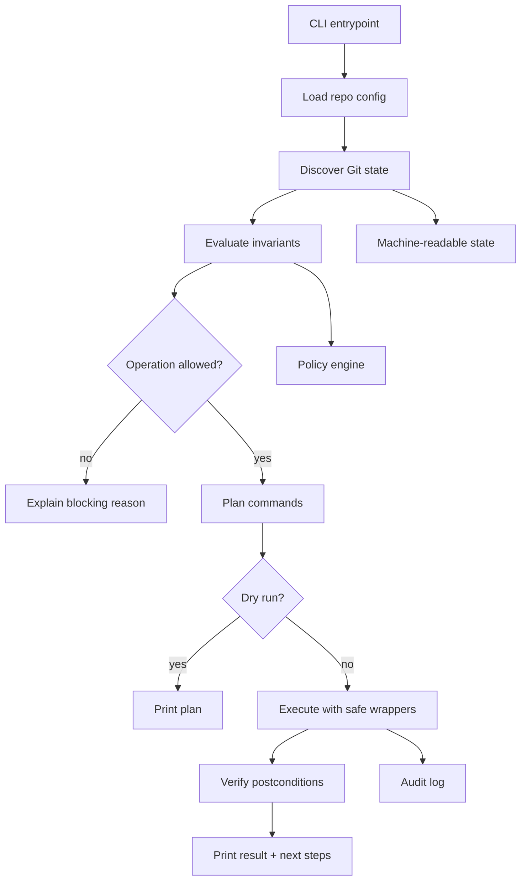
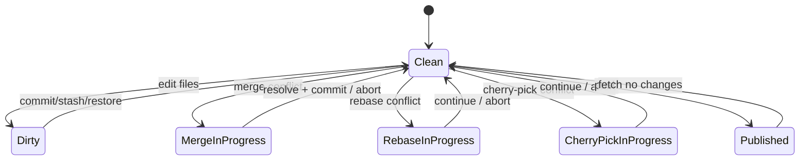
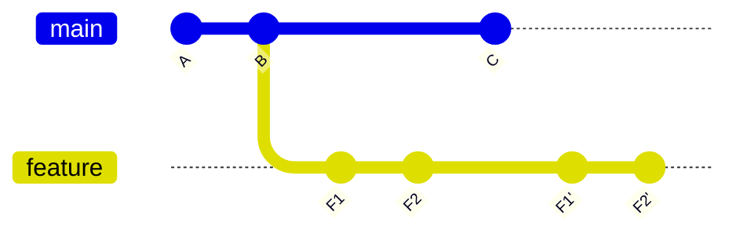

# Part 110 — Building a Git Workflow CLI

A mature engineering organization eventually learns that documentation is not enough.

You can write:

```text
Never force push main.
Use --force-with-lease for private review branches.
Fetch tags before release.
Do not release from dirty working tree.
Backports must include original commit reference.
```

Some people will remember. Some will not. Some will be tired. Some will be in incident mode. Some will copy commands from a stale wiki page.

An internal Git workflow CLI exists to encode the safe path.

Not to replace Git.
Not to hide Git.
Not to invent a magical abstraction.

The central invariant:

> A workflow CLI should make the correct operation easier than the dangerous operation, while still exposing enough Git state for engineers to understand what will happen.

This part designs and builds a practical CLI called `gflow`.

---

## 1. What a Git Workflow CLI Should and Should Not Do

A good workflow CLI should:

- inspect repository state before making changes
- use Git plumbing/porcelain safely
- fail closed on ambiguous state
- print the exact Git commands or equivalent operations it will perform
- support `--dry-run`
- create backup refs before risky rewrites
- prefer `--force-with-lease` over `--force`
- validate release/tag/backport invariants
- work inside CI and local developer machines
- produce machine-readable output for automation
- teach through output rather than hide everything

A bad workflow CLI:

- silently runs destructive commands
- swallows Git errors
- makes branch state less visible
- assumes every repo uses the same workflow
- depends on parsing human-readable Git output when porcelain formats exist
- uses shell string concatenation with untrusted input
- bypasses branch protection or server policy
- becomes the only way engineers know Git

The CLI should be a guardrail, not a blindfold.

---

## 2. Scope of `gflow`

The first version will support:

```text
gflow status      # rich repository state summary
gflow doctor      # workflow health checks
gflow start       # create a feature branch from approved base
gflow sync        # fetch + safe branch update
gflow save        # create WIP backup commit or stash-like save
gflow restack     # safe rebase of private branch with backup ref
gflow publish     # push branch safely
gflow release     # verify release tag/source metadata
gflow backport    # cherry-pick with required metadata
gflow clean       # safe cleanup with dry-run first
```

The point is not to cover every Git command. The point is to encode repeated workflow decisions.

---

## 3. Architecture



Separate the CLI into layers:

| Layer | Responsibility |
|---|---|
| Git runner | Execute Git with args array, capture stdout/stderr/exit code |
| State reader | Parse stable Git output into structs |
| Policy engine | Decide if operation is allowed |
| Planner | Convert intent into commands |
| Executor | Run commands after confirmation/dry-run |
| Reporter | Print human and JSON output |

Do not put business policy inside raw command functions.

Bad:

```text
runGit("push --force origin " + branch)
```

Better:

```text
state = readRepoState()
policy.assertPrivateBranch(state.currentBranch)
policy.assertHasUpstreamLease(state.currentBranch)
plan = pushWithLeasePlan(state)
executor.run(plan)
```

---

## 4. Repository State Model

The CLI needs a typed model of repository state.

```ts
type RepoState = {
  root: string;
  gitDir: string;
  headCommit: string;
  headShort: string;
  headState: 'branch' | 'detached';
  branch?: string;
  upstream?: string;
  upstreamCommit?: string;
  mergeBaseWithUpstream?: string;
  ahead: number;
  behind: number;
  dirtyTracked: boolean;
  dirtyUntracked: boolean;
  conflicted: boolean;
  shallow: boolean;
  sparse: boolean;
  partialClone: boolean;
  submodules: SubmoduleState[];
};
```

State should come from stable commands:

```bash
git rev-parse --show-toplevel
git rev-parse --git-dir
git rev-parse --verify HEAD^{commit}
git symbolic-ref --quiet --short HEAD
git status --porcelain=v2 --branch
git rev-parse --is-shallow-repository
git config --get core.sparseCheckout
git config --get remote.origin.promisor
```

Do not parse colorful `git status` intended for humans.

---

## 5. Configuration File

Use repository config for workflow-specific rules.

Example `.gflow.yml`:

```yaml
repository: platform/case-management
mainBranch: main
integrationBranches:
  - main
  - develop
releaseBranches:
  pattern: '^release/[0-9]+\\.[0-9]+$'
featureBranches:
  pattern: '^(feat|fix|chore|spike)/[a-z0-9._-]+$'
protectedBranches:
  - main
  - develop
  - /^release\//
forcePush:
  allowedPatterns:
    - '^feat/'
    - '^fix/'
  requireLease: true
release:
  tagPattern: '^v[0-9]+\\.[0-9]+\\.[0-9]+$'
  requireCleanTree: true
  requireAnnotatedTag: true
  requireSignedTag: true
backport:
  branchPattern: '^release/[0-9]+\\.[0-9]+$'
  requireCherryPickX: true
largeFiles:
  maxBlobBytes: 5242880
```

Keep config explicit. Different repositories may need different workflows.

---

## 6. Command Runner: Never Shell-Concatenate

Use argument arrays.

### Node.js Example

```ts
import { spawnSync } from 'node:child_process';

export type GitResult = {
  code: number;
  stdout: string;
  stderr: string;
};

export function git(args: string[], opts: { cwd?: string } = {}): GitResult {
  const result = spawnSync('git', args, {
    cwd: opts.cwd,
    encoding: 'utf8',
    stdio: ['ignore', 'pipe', 'pipe'],
  });

  return {
    code: result.status ?? 1,
    stdout: result.stdout ?? '',
    stderr: result.stderr ?? '',
  };
}

export function gitOk(args: string[], opts: { cwd?: string } = {}): string {
  const result = git(args, opts);
  if (result.code !== 0) {
    throw new Error([
      `git ${args.join(' ')} failed`,
      result.stderr.trim(),
    ].filter(Boolean).join('\n'));
  }
  return result.stdout.trimEnd();
}
```

Bad:

```ts
execSync(`git checkout -b ${branchName}`)
```

A branch name can contain characters that break shell assumptions.

Better:

```ts
gitOk(['switch', '-c', branchName, startPoint]);
```

---

## 7. `gflow status`: State Before Action

Before doing anything, engineers need situational awareness.

Example output:

```text
Repository: platform/case-management
HEAD:       main @ 8f4b7c0e92b
Upstream:   origin/main @ 8f4b7c0e92b
Divergence: ahead 0, behind 0
Tree:       clean tracked, 2 untracked
Mode:       full clone, non-sparse, not shallow
Tags:       fetched recently: unknown
Submodules: none
Warnings:
  - untracked files exist; release build would fail strict mode
```

Implementation sketch:

```ts
function readStatusPorcelainV2(): string {
  return gitOk(['status', '--porcelain=v2', '--branch', '--untracked-files=all']);
}
```

Porcelain v2 includes branch headers when `--branch` is passed.

Example lines:

```text
# branch.oid 8f4b7c0e92b4b76e2f5cc7f6f2e6a79d48b0d1c2
# branch.head main
# branch.upstream origin/main
# branch.ab +0 -0
? scratch.txt
```

Parse into `RepoState`.

---

## 8. `gflow doctor`: Repository Health Checks

`doctor` should be read-only by default.

Checks:

| Check | Reason |
|---|---|
| Inside Git worktree | Avoid running from wrong directory |
| HEAD resolves to commit | Broken/detached invalid state detection |
| Current branch known | Some operations disallow detached HEAD |
| Upstream configured | Needed for safe sync/publish |
| Working tree clean | Needed for rebase/release |
| Not in merge/rebase/cherry-pick | Avoid state machine collision |
| Not shallow for release | Release range needs history/tags |
| Tags available | Release/version calculation |
| Remote reachable | Sync/publish readiness |
| Protected branch not checked out for risky action | Prevent accidental mutation |
| Hooks installed or expected | Developer feedback |
| Large files detected | Repo health |

State machine detection:

```bash
git rev-parse --git-path MERGE_HEAD
git rev-parse --git-path rebase-merge
git rev-parse --git-path rebase-apply
git rev-parse --git-path CHERRY_PICK_HEAD
git rev-parse --git-path REVERT_HEAD
```

If these paths exist, the repository is mid-operation.

Do not start another high-level workflow.

---

## 9. Operation State Machine



A workflow CLI should refuse unsafe transitions.

Example:

```text
Cannot run gflow restack: repository is already in rebase state.
Detected: .git/rebase-merge
Next: run 'git rebase --continue' or 'git rebase --abort'
```

This is far better than running another `git rebase` and compounding damage.

---

## 10. `gflow start`: Create a Branch Safely

Intent:

```bash
gflow start feat case-escalation-audit --from main
```

Planned commands:

```bash
git fetch origin main --prune
git switch main
git merge --ff-only origin/main
git switch -c feat/case-escalation-audit
```

Preconditions:

- repository not dirty, unless `--allow-dirty`
- `main` is configured integration branch
- remote `origin/main` exists
- branch name matches policy
- target branch does not already exist
- not in rebase/merge/cherry-pick state

Postconditions:

- current branch is new branch
- branch starts at latest approved base
- upstream may be unset until publish

Why not just:

```bash
git checkout -b mybranch
```

Because that starts from wherever the user happens to be. In a large team, accidental branch start point creates hidden review and integration problems.

---

## 11. `gflow sync`: Fetch + Safe Integrate

Intent:

```bash
gflow sync
```

For `main`:

```bash
git fetch origin main --prune
git merge --ff-only origin/main
```

For a private feature branch:

```bash
git fetch origin main --prune
git rebase origin/main
```

But only if policy says private branches are rebased.

Preconditions:

- clean tree unless `--autostash` policy exists
- current branch known
- upstream/base branch known
- branch not protected if rebase is about to rewrite it

Safer output:

```text
Current branch: feat/case-escalation-audit
Base branch:    origin/main
Operation:      rebase private branch onto origin/main
Backup ref:     refs/backup/gflow/feat-case-escalation-audit/20260707-060011

Commands:
  git fetch origin main --prune
  git update-ref refs/backup/gflow/... HEAD
  git rebase origin/main
```

A workflow CLI should show the graph consequence.



---

## 12. Backup Refs Before Risky Operations

Before rebase, reset, or force-with-lease publish, create a backup ref.

```bash
branch="$(git symbolic-ref --short HEAD)"
stamp="$(date -u +%Y%m%d-%H%M%S)"
safe_branch="$(echo "$branch" | tr '/:' '--')"
backup="refs/backup/gflow/$safe_branch/$stamp"

git update-ref "$backup" HEAD
```

Recovery:

```bash
git switch -c recovered-feature refs/backup/gflow/feat-case-escalation-audit/20260707-060011
```

Backup refs are cheap. Use them generously before graph surgery.

---

## 13. `gflow restack`: Safe Rebase for Private Branches

Intent:

```bash
gflow restack --onto origin/main
```

Preconditions:

- current branch is not protected
- branch matches allowed rewrite pattern
- working tree clean
- upstream/ref state fetched recently or fetch requested
- not in operation state
- branch has not been published to protected shared branch

Plan:

```bash
git fetch origin main --prune
git update-ref refs/backup/gflow/<branch>/<stamp> HEAD
git rebase --rebase-merges origin/main
```

Postcondition:

```bash
git range-diff refs/backup/gflow/<branch>/<stamp>...HEAD
```

Print:

```text
Restack completed.
Review rewritten patch series with:
  git range-diff refs/backup/gflow/feat-case-escalation-audit/20260707-060011...HEAD

Publish with:
  gflow publish --lease
```

The CLI should normalize safe habits: backup first, then rebase, then range-diff, then push with lease.

---

## 14. `gflow publish`: Push Safely

For first publish:

```bash
git push -u origin HEAD
```

For rewritten private branch:

```bash
git push --force-with-lease origin HEAD:<branch>
```

Never default to `--force`.

Preconditions for force-with-lease:

- branch matches allowed rewrite pattern
- remote-tracking branch exists
- local record of remote branch is fresh enough, or user confirms after fetch
- target is not protected
- backup ref exists

Output:

```text
Publishing rewritten private branch with lease.
Target: origin/feat/case-escalation-audit
Expected remote value: 3f2a1d9e...
Local HEAD:            8f4b7c0e...
Backup ref:            refs/backup/gflow/feat-case-escalation-audit/20260707-060011
```

The word "lease" should be visible. Engineers should know this is not a blind force push.

---

## 15. `gflow release`: Verify Release Source

Intent:

```bash
gflow release verify v2.17.3
```

Checks:

- tag exists locally
- tags have been fetched
- tag matches configured pattern
- tag is annotated if required
- tag signature verifies if required
- peeled tag resolves to commit
- commit is reachable from release branch or main according to policy
- working tree clean if building locally
- current CI checkout commit equals tag commit for release job
- generated metadata matches Git state

Command sketch:

```bash
git fetch --tags --force

git rev-parse --verify "v2.17.3^{commit}"
git cat-file -t "v2.17.3"
git tag -v "v2.17.3"
git merge-base --is-ancestor "v2.17.3^{commit}" origin/main
```

If tag is lightweight but policy requires annotated:

```text
ERROR: v2.17.3 is not an annotated tag.
Expected: tag object
Actual:   commit
```

Do not silently continue.

---

## 16. `gflow backport`: Controlled Cherry-Pick

Intent:

```bash
gflow backport 8f4b7c0 --to release/2.17
```

Plan:

```bash
git fetch origin release/2.17 --prune
git switch release/2.17
git merge --ff-only origin/release/2.17
git switch -c backport/2.17/8f4b7c0-case-escalation-fix
git cherry-pick -x 8f4b7c0
```

Preconditions:

- source commit exists
- target release branch exists
- target branch matches release branch policy
- target branch is up to date
- working tree clean
- commit not already applied, if detectable
- source commit approved for backport

Duplicate patch detection:

```bash
git cherry -v origin/release/2.17 main
```

Or use patch-id:

```bash
git show 8f4b7c0 | git patch-id --stable
```

Postconditions:

- backport branch created
- commit message includes `(cherry picked from commit ...)`
- PR template includes source commit, target version, risk, tests

---

## 17. `gflow clean`: Make Destructive Cleanup Safer

Raw command:

```bash
git clean -fdx
```

This can delete a lot.

Safe wrapper behavior:

```bash
gflow clean
```

First run:

```text
Dry run only. Files that would be removed:
  build/
  node_modules/.cache/
  scratch.txt

Run with --apply to delete these files.
```

Implementation:

```bash
git clean -ndx
```

Apply:

```bash
git clean -fdx
```

Policy:

- default dry-run
- path-scoped cleanup encouraged
- never remove ignored files without explicit `--ignored` or `--all`
- warn if untracked files look like source files

---

## 18. Machine-Readable Output

Support JSON for CI and scripts.

```bash
gflow status --json
```

Example:

```json
{
  "branch": "feat/case-escalation-audit",
  "head": "8f4b7c0e92b4b76e2f5cc7f6f2e6a79d48b0d1c2",
  "upstream": "origin/feat/case-escalation-audit",
  "ahead": 2,
  "behind": 0,
  "dirtyTracked": false,
  "dirtyUntracked": true,
  "operation": "none",
  "shallow": false,
  "sparse": false,
  "warnings": [
    "untracked files exist"
  ]
}
```

Keep human and JSON output separate. Do not make downstream automation parse pretty text tables.

---

## 19. Policy Engine

Example policy functions:

```ts
function assertCleanForRelease(state: RepoState): void {
  if (state.dirtyTracked || state.dirtyUntracked) {
    throw new PolicyError('Release requires clean working tree, including untracked files.');
  }
}

function assertNotProtectedBranch(state: RepoState, config: Config): void {
  if (!state.branch) throw new PolicyError('Operation requires a branch, but HEAD is detached.');
  if (matchesAny(state.branch, config.protectedBranches)) {
    throw new PolicyError(`Refusing risky operation on protected branch: ${state.branch}`);
  }
}

function assertPrivateRewriteAllowed(state: RepoState, config: Config): void {
  assertNotProtectedBranch(state, config);
  if (!matchesAny(state.branch!, config.forcePush.allowedPatterns)) {
    throw new PolicyError(`Branch ${state.branch} is not allowed to be rewritten by policy.`);
  }
}
```

Policy errors should explain:

```text
what failed
why it matters
what command or action should be taken next
```

Bad:

```text
Error: invalid state
```

Better:

```text
Cannot restack release/2.17.
Reason: release branches are protected and must not be rewritten.
Use a new backport branch and open a PR instead:
  gflow backport <commit> --to release/2.17
```

---

## 20. Do Not Bypass Server-Side Controls

A local CLI is convenience and safety. It is not final enforcement.

Final enforcement belongs to:

- protected branches
- protected tags
- rulesets
- server-side hooks
- required CI checks
- merge queues
- artifact signing/provenance verification

The CLI should align with server policy, not replace it.

Example:

```text
Local CLI: warns and prevents most mistakes before push
Server: rejects violations even if CLI is bypassed
CI: validates repository state and build/release evidence
```

Defense in depth.

---

## 21. Testing the CLI with Disposable Repositories

Do not test Git workflow tooling only against mocks. Use real temporary repositories.

Test setup:

```bash
tmp="$(mktemp -d)"
cd "$tmp"

git init --initial-branch=main
git config user.name "Test User"
git config user.email "test@example.com"

echo one > file.txt
git add file.txt
git commit -m "initial"
```

Create bare remote:

```bash
git clone --bare . remote.git
git remote add origin "$tmp/remote.git"
git push -u origin main
```

Now test:

- branch start point
- dirty tree refusal
- backup ref creation
- rebase conflict refusal/handling
- force-with-lease command plan
- release tag validation
- shallow clone warning
- detached HEAD behavior
- submodule detection

Use golden output tests for `--json`, but not for colorful human output unless stable.

---

## 22. Example Test Cases

| Test | Setup | Expected |
|---|---|---|
| Start branch from dirty main | Modify tracked file | Refuse unless `--allow-dirty` |
| Start branch with invalid name | `Feature/My Work` | Refuse with naming policy explanation |
| Restack protected branch | current branch `main` | Refuse |
| Publish rewritten feature | branch has upstream | Plan `--force-with-lease` |
| Release verify lightweight tag | create lightweight tag | Refuse if annotated required |
| Release verify missing tag | no tag fetched | Refuse and suggest `git fetch --tags` |
| Backport duplicate patch | patch already present | Warn/refuse depending policy |
| Clean untracked source file | `scratch.sql` present | Dry-run and warn |

---

## 23. UX Rules

A workflow CLI succeeds or fails through UX.

Good CLI output:

```text
Goal: restack feat/case-escalation-audit onto origin/main
Current: feat/case-escalation-audit @ 31a2c90
Target:  origin/main @ 8f4b7c0
Risk:    rewrites local commits
Backup:  refs/backup/gflow/feat-case-escalation-audit/20260707-061231

Plan:
  1. git fetch origin main --prune
  2. git update-ref refs/backup/gflow/... HEAD
  3. git rebase origin/main
  4. git range-diff refs/backup/gflow/... HEAD

Run with --apply to execute.
```

This output teaches the model.

Bad CLI output:

```text
Done.
```

When dealing with Git, "done" is not enough.

---

## 24. Versioning the Workflow CLI

The CLI itself is infrastructure. Version it.

Recommended:

- release the CLI with signed tags
- publish binaries/packages with artifact digests
- embed Git metadata into the CLI itself
- log CLI version in operations that mutate repository state
- keep backward compatibility for repo config
- support `gflow doctor --cli` to check CLI version and config schema

Example:

```bash
gflow --version
```

Output:

```text
gflow 1.12.0
commit 4aa9e6c1b0c2
built 2026-07-07T03:00:00Z
```

Dogfood Part 109.

---

## 25. Rollout Strategy

Do not force a CLI onto a team overnight.

Rollout path:

1. Read-only commands: `status`, `doctor`.
2. Safe wrappers with dry-run: `clean`, `release verify`.
3. Branch helpers: `start`, `sync`.
4. Risky operations with backup refs: `restack`, `publish --lease`.
5. CI mode: `gflow ci verify`.
6. Policy enforcement alignment with server controls.

Make the CLI useful before making it mandatory.

Adoption comes from reducing pain, not from adding ceremony.

---

## 26. Anti-Patterns

### Anti-Pattern 1 — Hiding Git Completely

If engineers cannot explain what `gflow sync` did, the tool has reduced competence.

Show the plan. Show the Git commands. Link to docs/handbook.

### Anti-Pattern 2 — Magic Branch Names

Do not infer too much from branch names without config.

Bad:

```text
If branch contains prod, treat as release.
```

Better:

```yaml
releaseBranches:
  pattern: '^release/[0-9]+\\.[0-9]+$'
```

### Anti-Pattern 3 — CLI-Only Governance

Anyone can bypass a local CLI.

Use server controls.

### Anti-Pattern 4 — Parsing Human Output

Human output changes. Use porcelain formats or plumbing commands.

### Anti-Pattern 5 — No Recovery Path

Any command that rewrites or deletes should have:

```text
backup ref + dry-run + confirmation + recovery instruction
```

---

## 27. Minimal Implementation Roadmap

### Milestone 1 — Read State

- implement `git(args)` runner
- parse `rev-parse`
- parse `status --porcelain=v2 --branch`
- detect operation state
- print `gflow status`

### Milestone 2 — Policy Config

- load `.gflow.yml`
- validate schema
- match branch patterns
- add `doctor`

### Milestone 3 — Safe Branch Lifecycle

- `start`
- `sync`
- `publish`
- dry-run support

### Milestone 4 — Risky Operation Guardrails

- backup refs
- `restack`
- range-diff reminder
- force-with-lease only

### Milestone 5 — Release and Backport

- `release verify`
- `backport`
- tag policy
- clean-tree enforcement

### Milestone 6 — CI Integration

- JSON output
- exit codes
- no interactive prompts in CI
- machine-readable policy violations

---

## 28. Exit Codes

Define stable exit codes.

| Code | Meaning |
|---:|---|
| 0 | Success |
| 1 | Generic failure |
| 2 | Policy violation |
| 3 | Dirty working tree |
| 4 | Git operation state conflict |
| 5 | Remote/fetch failure |
| 6 | Release verification failure |
| 7 | Config error |

This matters for CI and automation.

Example:

```bash
gflow release verify v2.17.3 || case "$?" in
  6) echo "release verification failed" ;;
  7) echo "repository config invalid" ;;
  *) echo "unexpected failure" ;;
esac
```

---

## 29. Security Considerations

A workflow CLI can become dangerous if it handles secrets, remotes, or commands casually.

Rules:

- never execute via shell when argument arrays work
- never print credential-bearing remote URLs
- never store tokens in repo config
- never auto-install hooks from untrusted repositories without review
- sign/pin CLI releases for enterprise use
- warn on suspicious remote URLs
- avoid downloading scripts during Git operation
- do not run arbitrary commands from `.gflow.yml` by default

If config supports custom hooks/commands, treat them as code execution.

---

## 30. Final Mental Model

A Git workflow CLI is a small control plane for repository operations.

It should convert unsafe tribal knowledge into executable, reviewable, testable workflow logic.

The strongest version does four things:

```text
read state accurately
check policy explicitly
plan operations transparently
execute safely with recovery paths
```

The CLI should not make Git invisible. It should make Git state legible.

The invariant to keep:

> Do not automate Git by hiding risk. Automate Git by making the safe path explicit, repeatable, reversible, and observable.

---

## References

- Git documentation: main command reference — https://git-scm.com/docs/git
- Git documentation: `git rev-parse` — https://git-scm.com/docs/git-rev-parse
- Git documentation: `git status` porcelain v2 — https://git-scm.com/docs/git-status
- Git documentation: `git update-ref` — https://git-scm.com/docs/git-update-ref
- Git documentation: `git push` and `--force-with-lease` — https://git-scm.com/docs/git-push
- Git documentation: `git cherry-pick` — https://git-scm.com/docs/git-cherry-pick
- Git documentation: `git range-diff` — https://git-scm.com/docs/git-range-diff
