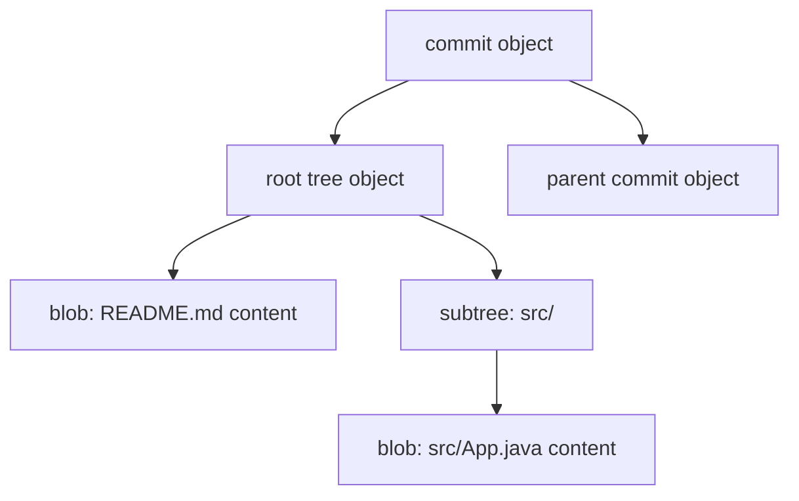
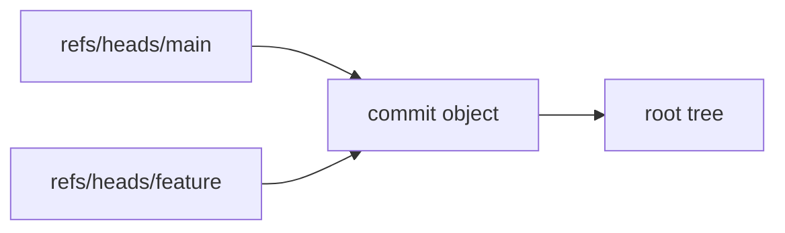

# Part 111 — Build a Mini Git Object Store

Most engineers use Git as a command-line tool.

Top engineers eventually internalize Git as a database.

In this lab, we build a small Git-compatible loose object store from scratch in Java. The goal is not to replace Git. The goal is to make the object model physically obvious:

- why a blob hash changes when one byte changes
- why filenames are not inside blob objects
- why trees store path names and modes
- why commits point to trees and parents
- why Git can verify object integrity without trusting filenames
- why history rewrite creates new object identities
- why secret leaks are hard to erase once objects are shared

The implementation in this part intentionally supports only **loose objects**:

```text
.git/objects/ab/cdef...
```

It does not implement packfiles, delta compression, MIDX, bitmaps, refs, index, ignore rules, sparse checkout, or full Git compatibility.

That is the point.

We want the smallest system that makes Git's core invariant visible:

> Git object identity is the hash of `type + space + size + NUL + payload`.

Once this invariant is clear, packfiles, commits, refs, release tags, and supply-chain controls become much easier to reason about.

---

## 1. What We Are Building

We will build a tiny Java library and CLI called `minigit-objects`.

It will support:

- writing blob objects
- reading objects by object id
- showing object type, size, and payload
- building tree objects from entries
- writing commit objects
- inspecting object storage layout
- validating our output against real Git plumbing commands

The output object format will match Git's loose object format for SHA-1 repositories:

```text
<object-id> = SHA1("<type> <size>\0<payload>")
storage path = objects/<first-2-hex>/<remaining-38-hex>
stored bytes = zlib_deflate("<type> <size>\0<payload>")
```

Example for a blob containing `hello\n`:

```text
payload:       hello\n
header:        blob 6\0
hash input:    blob 6\0hello\n
object id:     ce013625030ba8dba906f756967f9e9ca394464a
path:          objects/ce/013625030ba8dba906f756967f9e9ca394464a
```

Git's object database is not organized by filename, module, author, branch, or date. It is organized by object identity.

---

## 2. Mental Model: Object Store as a Merkle-ish Database

A Git repository is a graph of immutable objects.



Each object id is derived from the object's bytes. A commit points to a tree by tree object id. A tree points to blobs and subtrees by object id. A child commit points to parent commits by object id.

That gives Git a powerful invariant:

> If an object id is correct, its content has not changed since the id was computed.

This is why Git can detect corruption with `git fsck`.

It also explains why rewriting history is not a small metadata operation. Change a commit message, author timestamp, parent list, or tree id, and the commit id changes. Change that commit id and every descendant commit that points to it must also change.

---

## 3. Object Types We Need

Git has four core object types:

| Object | What it stores | Contains filenames? | Contains parent links? |
|---|---|---:|---:|
| blob | raw file content | no | no |
| tree | directory entries: mode, name, object id | yes | no |
| commit | root tree, parents, author/committer, message | no direct file names | yes |
| tag | annotated tag metadata and target object | no | target object only |

This lab implements blob, tree, and commit.

Annotated tags are left for later because they add signing/release identity concerns. The storage rule is the same: `tag <size>\0<payload>`.

---

## 4. Repository Layout for the Lab

We do not write into `.git` by default.

We use `.minigit`:

```text
example-repo/
  .minigit/
    objects/
      ce/
        013625030ba8dba906f756967f9e9ca394464a
```

This prevents accidental corruption of a real repository.

Later, we can validate compatibility by writing the same object into a temporary real Git repo and comparing with `git hash-object` or `git cat-file`.

---

## 5. Java Project Skeleton

Use any Java 17+ runtime. The code avoids frameworks.

```text
minigit-objects/
  src/main/java/minigit/
    ObjectType.java
    ObjectId.java
    GitObject.java
    ObjectStore.java
    TreeEntry.java
    TreeBuilder.java
    CommitBuilder.java
    MiniGitObjects.java
```

The implementation is intentionally boring. Good storage systems are often boring at their core.

---

## 6. Object Type

```java
package minigit;

public enum ObjectType {
    BLOB("blob"),
    TREE("tree"),
    COMMIT("commit"),
    TAG("tag");

    private final String wireName;

    ObjectType(String wireName) {
        this.wireName = wireName;
    }

    public String wireName() {
        return wireName;
    }

    public static ObjectType fromWireName(String value) {
        for (ObjectType type : values()) {
            if (type.wireName.equals(value)) {
                return type;
            }
        }
        throw new IllegalArgumentException("unknown object type: " + value);
    }
}
```

The wire name matters. The bytes `blob 6\0hello\n` and `file 6\0hello\n` do not hash to the same object id.

Object type is part of identity.

---

## 7. Object ID Value Object

For this lab, we use SHA-1 because most Git repositories still use SHA-1 by default. Modern Git can initialize SHA-256 repositories, but SHA-256 compatibility is deliberately not implemented here.

```java
package minigit;

import java.util.HexFormat;
import java.util.Locale;
import java.util.Objects;

public final class ObjectId {
    public static final int SHA1_BYTES = 20;
    public static final int SHA1_HEX_LENGTH = 40;

    private final byte[] bytes;

    private ObjectId(byte[] bytes) {
        if (bytes.length != SHA1_BYTES) {
            throw new IllegalArgumentException("SHA-1 object id must be 20 bytes");
        }
        this.bytes = bytes.clone();
    }

    public static ObjectId of(byte[] bytes) {
        return new ObjectId(bytes);
    }

    public static ObjectId parse(String hex) {
        String normalized = hex.toLowerCase(Locale.ROOT);
        if (normalized.length() != SHA1_HEX_LENGTH) {
            throw new IllegalArgumentException("object id must be 40 hex chars: " + hex);
        }
        return new ObjectId(HexFormat.of().parseHex(normalized));
    }

    public String hex() {
        return HexFormat.of().formatHex(bytes);
    }

    public String directoryName() {
        return hex().substring(0, 2);
    }

    public String fileName() {
        return hex().substring(2);
    }

    public byte[] bytes() {
        return bytes.clone();
    }

    @Override
    public String toString() {
        return hex();
    }

    @Override
    public boolean equals(Object other) {
        return other instanceof ObjectId that && java.util.Arrays.equals(this.bytes, that.bytes);
    }

    @Override
    public int hashCode() {
        return Objects.hash(hex());
    }
}
```

The two-character directory split is not semantic. It is a filesystem fanout strategy.

Without fanout, millions of loose objects in one directory would be painful for filesystems.

---

## 8. GitObject Record

```java
package minigit;

public record GitObject(ObjectType type, byte[] payload) {
    public GitObject {
        if (type == null) {
            throw new IllegalArgumentException("type is required");
        }
        if (payload == null) {
            throw new IllegalArgumentException("payload is required");
        }
        payload = payload.clone();
    }

    public int size() {
        return payload.length;
    }

    @Override
    public byte[] payload() {
        return payload.clone();
    }
}
```

Notice that `size` is payload size, not compressed file size and not total header+payload size.

This distinction matters when debugging object corruption.

---

## 9. Encoding Rule

Every object is encoded as:

```text
<type> SP <payload-size-as-decimal> NUL <payload>
```

Implementation:

```java
package minigit;

import java.nio.charset.StandardCharsets;

public final class ObjectCodec {
    private ObjectCodec() {}

    public static byte[] encode(ObjectType type, byte[] payload) {
        byte[] header = (type.wireName() + " " + payload.length + "\0")
            .getBytes(StandardCharsets.US_ASCII);

        byte[] result = new byte[header.length + payload.length];
        System.arraycopy(header, 0, result, 0, header.length);
        System.arraycopy(payload, 0, result, header.length, payload.length);
        return result;
    }

    public static GitObject decode(byte[] inflated) {
        int nul = -1;
        for (int i = 0; i < inflated.length; i++) {
            if (inflated[i] == 0) {
                nul = i;
                break;
            }
        }
        if (nul < 0) {
            throw new IllegalArgumentException("object header missing NUL separator");
        }

        String header = new String(inflated, 0, nul, StandardCharsets.US_ASCII);
        int space = header.indexOf(' ');
        if (space <= 0) {
            throw new IllegalArgumentException("invalid object header: " + header);
        }

        ObjectType type = ObjectType.fromWireName(header.substring(0, space));
        int declaredSize = Integer.parseInt(header.substring(space + 1));
        int actualSize = inflated.length - nul - 1;

        if (declaredSize != actualSize) {
            throw new IllegalArgumentException(
                "object size mismatch: declared=" + declaredSize + ", actual=" + actualSize
            );
        }

        byte[] payload = java.util.Arrays.copyOfRange(inflated, nul + 1, inflated.length);
        return new GitObject(type, payload);
    }
}
```

This is the core of the lab.

Everything else is storage and graph structure.

---

## 10. Hashing Rule

```java
package minigit;

import java.security.MessageDigest;
import java.security.NoSuchAlgorithmException;

public final class Hashing {
    private Hashing() {}

    public static ObjectId sha1(byte[] bytes) {
        try {
            MessageDigest digest = MessageDigest.getInstance("SHA-1");
            return ObjectId.of(digest.digest(bytes));
        } catch (NoSuchAlgorithmException e) {
            throw new IllegalStateException("SHA-1 unavailable", e);
        }
    }
}
```

Git hashes the uncompressed object bytes, not the compressed file on disk.

This is an important invariant:

```text
hash input = header + payload
storage    = zlib(hash input)
```

If two implementations choose different zlib compression levels, the compressed bytes may differ. The object id remains the same because the hash is over the uncompressed canonical bytes.

---

## 11. Zlib Compression Helpers

```java
package minigit;

import java.io.ByteArrayInputStream;
import java.io.ByteArrayOutputStream;
import java.io.IOException;
import java.util.zip.DeflaterOutputStream;
import java.util.zip.InflaterInputStream;

public final class ZlibCodec {
    private ZlibCodec() {}

    public static byte[] deflate(byte[] input) {
        try {
            ByteArrayOutputStream out = new ByteArrayOutputStream();
            try (DeflaterOutputStream deflater = new DeflaterOutputStream(out)) {
                deflater.write(input);
            }
            return out.toByteArray();
        } catch (IOException e) {
            throw new IllegalStateException("deflate failed", e);
        }
    }

    public static byte[] inflate(byte[] input) {
        try {
            ByteArrayOutputStream out = new ByteArrayOutputStream();
            try (InflaterInputStream inflater = new InflaterInputStream(new ByteArrayInputStream(input))) {
                inflater.transferTo(out);
            }
            return out.toByteArray();
        } catch (IOException e) {
            throw new IllegalArgumentException("inflate failed", e);
        }
    }
}
```

A corrupted object file can fail in two ways:

1. it cannot be inflated
2. it inflates, but the decoded object does not hash back to its path

A good object store should check both when asked to verify integrity.

---

## 12. Object Store Implementation

```java
package minigit;

import java.io.IOException;
import java.nio.file.Files;
import java.nio.file.Path;
import java.nio.file.StandardOpenOption;

public final class ObjectStore {
    private final Path objectsDir;

    public ObjectStore(Path gitLikeDirectory) {
        this.objectsDir = gitLikeDirectory.resolve("objects");
    }

    public ObjectId write(ObjectType type, byte[] payload) throws IOException {
        byte[] encoded = ObjectCodec.encode(type, payload);
        ObjectId id = Hashing.sha1(encoded);

        Path dir = objectsDir.resolve(id.directoryName());
        Path file = dir.resolve(id.fileName());
        Files.createDirectories(dir);

        if (!Files.exists(file)) {
            byte[] compressed = ZlibCodec.deflate(encoded);
            Files.write(file, compressed, StandardOpenOption.CREATE_NEW);
        }

        return id;
    }

    public GitObject read(ObjectId id) throws IOException {
        Path file = objectsDir.resolve(id.directoryName()).resolve(id.fileName());
        byte[] compressed = Files.readAllBytes(file);
        byte[] inflated = ZlibCodec.inflate(compressed);
        GitObject object = ObjectCodec.decode(inflated);

        ObjectId actual = Hashing.sha1(inflated);
        if (!actual.equals(id)) {
            throw new IllegalStateException("object id mismatch: path=" + id + ", content=" + actual);
        }

        return object;
    }

    public boolean exists(ObjectId id) {
        return Files.exists(objectsDir.resolve(id.directoryName()).resolve(id.fileName()));
    }
}
```

There is one subtle design choice: `write` does not overwrite an existing object.

That follows Git's immutable-object model. If the object already exists, writing the same content again is a no-op. If different content somehow maps to the same SHA-1, Git has a collision problem. Real Git has additional collision detection hardening; this lab keeps the model small.

---

## 13. First Test: Write a Blob

```java
package minigit;

import java.nio.charset.StandardCharsets;
import java.nio.file.Path;

public final class DemoBlob {
    public static void main(String[] args) throws Exception {
        ObjectStore store = new ObjectStore(Path.of(".minigit"));
        ObjectId id = store.write(ObjectType.BLOB, "hello\n".getBytes(StandardCharsets.UTF_8));
        System.out.println(id.hex());
    }
}
```

Expected object id:

```text
ce013625030ba8dba906f756967f9e9ca394464a
```

Validate with Git:

```bash
echo 'hello' | git hash-object --stdin
```

The output should match.

If it does not, check:

- did you include the newline?
- did you hash `blob 6\0hello\n`, not just `hello\n`?
- did you encode the header in ASCII?
- did you accidentally use platform line endings?

---

## 14. Read and Show an Object

```java
package minigit;

import java.nio.charset.StandardCharsets;
import java.nio.file.Path;

public final class DemoRead {
    public static void main(String[] args) throws Exception {
        ObjectStore store = new ObjectStore(Path.of(".minigit"));
        ObjectId id = ObjectId.parse(args[0]);
        GitObject object = store.read(id);

        System.out.println("type: " + object.type().wireName());
        System.out.println("size: " + object.size());
        System.out.println("---");
        System.out.print(new String(object.payload(), StandardCharsets.UTF_8));
    }
}
```

This is the mini version of:

```bash
git cat-file -t <object-id>
git cat-file -s <object-id>
git cat-file -p <object-id>
```

At this layer, there is no branch, no commit, no file path, and no working tree. There is only an object id and object bytes.

---

## 15. Blob Does Not Know Its Filename

Create two files with the same content:

```bash
mkdir demo
printf 'same\n' > demo/a.txt
printf 'same\n' > demo/b.txt
```

Both files have the same blob id:

```bash
git hash-object demo/a.txt
git hash-object demo/b.txt
```

This is why Git can deduplicate identical content.

It is also why a blob cannot answer:

```text
What file path did I come from?
```

That question belongs to tree objects and history traversal.

A blob is pure content.

---

## 16. Tree Object Encoding

A tree object stores directory entries.

Each entry is encoded as:

```text
<mode> SP <name> NUL <20 raw object id bytes>
```

Important details:

- object id bytes are raw binary, not 40 ASCII hex characters
- names are path segment names, not full paths
- entries are sorted by Git's tree ordering rules
- tree entries can point to blobs, subtrees, or gitlinks

Common modes:

| Mode | Meaning |
|---|---|
| `100644` | normal file |
| `100755` | executable file |
| `120000` | symbolic link |
| `040000` | tree / directory |
| `160000` | gitlink / submodule commit |

For the lab, we support normal files and directories.

---

## 17. Tree Entry Model

```java
package minigit;

import java.nio.charset.StandardCharsets;

public record TreeEntry(String mode, String name, ObjectId objectId) implements Comparable<TreeEntry> {
    public TreeEntry {
        if (mode == null || mode.isBlank()) {
            throw new IllegalArgumentException("mode is required");
        }
        if (name == null || name.isBlank()) {
            throw new IllegalArgumentException("name is required");
        }
        if (name.contains("/") || name.indexOf('\0') >= 0) {
            throw new IllegalArgumentException("tree entry name must be one path segment: " + name);
        }
        if (objectId == null) {
            throw new IllegalArgumentException("object id is required");
        }
    }

    @Override
    public int compareTo(TreeEntry other) {
        return treeSortKey(this).compareTo(treeSortKey(other));
    }

    private static String treeSortKey(TreeEntry entry) {
        // Simplified enough for this lab. Git's exact ordering treats directories specially.
        return entry.name;
    }

    public byte[] encode() {
        byte[] prefix = (mode + " " + name + "\0").getBytes(StandardCharsets.UTF_8);
        byte[] oid = objectId.bytes();
        byte[] result = new byte[prefix.length + oid.length];
        System.arraycopy(prefix, 0, result, 0, prefix.length);
        System.arraycopy(oid, 0, result, prefix.length, oid.length);
        return result;
    }
}
```

The simplified sort is good enough for simple files. A production-compatible implementation needs exact Git tree ordering, especially for names where a file and directory have related prefixes.

The important lesson here is not sorting. It is this:

> The tree stores names and object ids. The blob stores content only.

---

## 18. Build a Tree

```java
package minigit;

import java.io.ByteArrayOutputStream;
import java.io.IOException;
import java.util.ArrayList;
import java.util.Collections;
import java.util.List;

public final class TreeBuilder {
    private final List<TreeEntry> entries = new ArrayList<>();

    public TreeBuilder add(String mode, String name, ObjectId objectId) {
        entries.add(new TreeEntry(mode, name, objectId));
        return this;
    }

    public byte[] buildPayload() {
        try {
            List<TreeEntry> sorted = new ArrayList<>(entries);
            Collections.sort(sorted);

            ByteArrayOutputStream out = new ByteArrayOutputStream();
            for (TreeEntry entry : sorted) {
                out.write(entry.encode());
            }
            return out.toByteArray();
        } catch (IOException e) {
            throw new IllegalStateException("unexpected ByteArrayOutputStream failure", e);
        }
    }
}
```

Usage:

```java
ObjectStore store = new ObjectStore(Path.of(".minigit"));
ObjectId readme = store.write(ObjectType.BLOB, "# Demo\n".getBytes(StandardCharsets.UTF_8));
ObjectId app = store.write(ObjectType.BLOB, "class App {}\n".getBytes(StandardCharsets.UTF_8));

TreeBuilder srcTree = new TreeBuilder()
    .add("100644", "App.java", app);
ObjectId srcTreeId = store.write(ObjectType.TREE, srcTree.buildPayload());

TreeBuilder rootTree = new TreeBuilder()
    .add("100644", "README.md", readme)
    .add("040000", "src", srcTreeId);
ObjectId rootTreeId = store.write(ObjectType.TREE, rootTree.buildPayload());

System.out.println(rootTreeId);
```

---

## 19. Tree Pretty Printer

Raw tree payload contains NUL bytes and binary object ids. Printing it as UTF-8 produces garbage.

We need a tree parser.

```java
package minigit;

import java.nio.charset.StandardCharsets;
import java.util.ArrayList;
import java.util.HexFormat;
import java.util.List;

public final class TreeParser {
    private TreeParser() {}

    public static List<TreeEntry> parse(byte[] payload) {
        List<TreeEntry> result = new ArrayList<>();
        int i = 0;

        while (i < payload.length) {
            int modeStart = i;
            while (payload[i] != ' ') i++;
            String mode = new String(payload, modeStart, i - modeStart, StandardCharsets.US_ASCII);
            i++; // space

            int nameStart = i;
            while (payload[i] != 0) i++;
            String name = new String(payload, nameStart, i - nameStart, StandardCharsets.UTF_8);
            i++; // NUL

            byte[] rawOid = java.util.Arrays.copyOfRange(payload, i, i + ObjectId.SHA1_BYTES);
            i += ObjectId.SHA1_BYTES;

            result.add(new TreeEntry(mode, name, ObjectId.of(rawOid)));
        }

        return result;
    }

    public static void print(byte[] payload) {
        for (TreeEntry entry : parse(payload)) {
            System.out.printf("%s %s %s%n", entry.mode(), entry.objectId().hex(), entry.name());
        }
    }
}
```

Compare with:

```bash
git ls-tree <tree-id>
```

Real Git also infers object type for display. Our tree only stores mode, name, and object id.

---

## 20. Commit Object Encoding

A commit payload is text:

```text
tree <tree-id>
parent <parent-id>
author <name> <email> <timestamp> <timezone>
committer <name> <email> <timestamp> <timezone>

<message>
```

Example:

```text
tree 4b825dc642cb6eb9a060e54bf8d69288fbee4904
author Ada <ada@example.com> 1760000000 +0700
committer Ada <ada@example.com> 1760000000 +0700

initial commit
```

A commit does not store a branch name.

A branch is a ref that points to a commit.

This separation is foundational:



Two branch names can point to the same commit. The commit does not know or care.

---

## 21. Commit Builder

```java
package minigit;

import java.nio.charset.StandardCharsets;
import java.time.Instant;
import java.util.ArrayList;
import java.util.List;

public final class CommitBuilder {
    private ObjectId tree;
    private final List<ObjectId> parents = new ArrayList<>();
    private String authorName = "MiniGit";
    private String authorEmail = "minigit@example.invalid";
    private String committerName = "MiniGit";
    private String committerEmail = "minigit@example.invalid";
    private long epochSeconds = Instant.now().getEpochSecond();
    private String timezone = "+0000";
    private String message = "";

    public CommitBuilder tree(ObjectId tree) {
        this.tree = tree;
        return this;
    }

    public CommitBuilder parent(ObjectId parent) {
        this.parents.add(parent);
        return this;
    }

    public CommitBuilder author(String name, String email) {
        this.authorName = name;
        this.authorEmail = email;
        return this;
    }

    public CommitBuilder committer(String name, String email) {
        this.committerName = name;
        this.committerEmail = email;
        return this;
    }

    public CommitBuilder timestamp(long epochSeconds, String timezone) {
        this.epochSeconds = epochSeconds;
        this.timezone = timezone;
        return this;
    }

    public CommitBuilder message(String message) {
        this.message = message.endsWith("\n") ? message : message + "\n";
        return this;
    }

    public byte[] buildPayload() {
        if (tree == null) {
            throw new IllegalStateException("commit tree is required");
        }

        StringBuilder sb = new StringBuilder();
        sb.append("tree ").append(tree.hex()).append('\n');
        for (ObjectId parent : parents) {
            sb.append("parent ").append(parent.hex()).append('\n');
        }
        sb.append("author ")
            .append(authorName).append(" <").append(authorEmail).append("> ")
            .append(epochSeconds).append(' ').append(timezone).append('\n');
        sb.append("committer ")
            .append(committerName).append(" <").append(committerEmail).append("> ")
            .append(epochSeconds).append(' ').append(timezone).append('\n');
        sb.append('\n');
        sb.append(message);

        return sb.toString().getBytes(StandardCharsets.UTF_8);
    }
}
```

Usage:

```java
ObjectId commit = store.write(
    ObjectType.COMMIT,
    new CommitBuilder()
        .tree(rootTreeId)
        .author("Ada", "ada@example.com")
        .committer("Ada", "ada@example.com")
        .timestamp(1760000000L, "+0700")
        .message("initial commit")
        .buildPayload()
);

System.out.println(commit);
```

---

## 22. Why Commit Hashes Are So Sensitive

Change any of these and the commit id changes:

- root tree id
- parent list
- parent order
- author name/email
- author timestamp
- committer name/email
- committer timestamp
- timezone
- message
- trailing newline

That is why two commits with identical file content can still have different commit ids.

A commit is not just a tree snapshot. It is a snapshot plus lineage plus metadata plus message.

This is also why `git commit --amend` changes the commit id even when no file changed.

---

## 23. Minimal CLI

```java
package minigit;

import java.nio.charset.StandardCharsets;
import java.nio.file.Files;
import java.nio.file.Path;

public final class MiniGitObjects {
    public static void main(String[] args) throws Exception {
        if (args.length < 1) {
            usage();
            System.exit(2);
        }

        ObjectStore store = new ObjectStore(Path.of(".minigit"));

        switch (args[0]) {
            case "hash-blob" -> {
                if (args.length != 2) usageAndExit();
                byte[] payload = Files.readAllBytes(Path.of(args[1]));
                System.out.println(store.write(ObjectType.BLOB, payload));
            }
            case "cat" -> {
                if (args.length != 2) usageAndExit();
                GitObject object = store.read(ObjectId.parse(args[1]));
                if (object.type() == ObjectType.TREE) {
                    TreeParser.print(object.payload());
                } else {
                    System.out.print(new String(object.payload(), StandardCharsets.UTF_8));
                }
            }
            case "type" -> {
                if (args.length != 2) usageAndExit();
                System.out.println(store.read(ObjectId.parse(args[1])).type().wireName());
            }
            case "size" -> {
                if (args.length != 2) usageAndExit();
                System.out.println(store.read(ObjectId.parse(args[1])).size());
            }
            default -> usageAndExit();
        }
    }

    private static void usageAndExit() {
        usage();
        System.exit(2);
    }

    private static void usage() {
        System.err.println("usage:");
        System.err.println("  minigit hash-blob <file>");
        System.err.println("  minigit cat <object-id>");
        System.err.println("  minigit type <object-id>");
        System.err.println("  minigit size <object-id>");
    }
}
```

This gives us the tiny subset of:

```bash
git hash-object -w <file>
git cat-file -p <object>
git cat-file -t <object>
git cat-file -s <object>
```

---

## 24. Validate Against Git

Create a temporary Git repo:

```bash
mkdir /tmp/minigit-validation
cd /tmp/minigit-validation
git init
printf 'hello\n' > hello.txt
```

Git result:

```bash
git hash-object -w hello.txt
git cat-file -t ce013625030ba8dba906f756967f9e9ca394464a
git cat-file -s ce013625030ba8dba906f756967f9e9ca394464a
git cat-file -p ce013625030ba8dba906f756967f9e9ca394464a
```

MiniGit result:

```bash
java minigit.MiniGitObjects hash-blob hello.txt
java minigit.MiniGitObjects type ce013625030ba8dba906f756967f9e9ca394464a
java minigit.MiniGitObjects size ce013625030ba8dba906f756967f9e9ca394464a
java minigit.MiniGitObjects cat ce013625030ba8dba906f756967f9e9ca394464a
```

The object id, type, size, and payload should match.

---

## 25. Implementation Invariants

The object store should enforce these invariants:

| Invariant | Why it matters |
|---|---|
| object id is hash of encoded object | integrity and content addressing |
| object path is derived from object id | deterministic storage lookup |
| existing object is immutable | object database correctness |
| decoded size equals declared size | corruption detection |
| hash of inflated bytes equals requested id | path/content integrity |
| tree entries refer to existing objects when strict mode is enabled | prevents broken graph |
| commit tree must exist when strict mode is enabled | prevents unreachable invalid snapshot |
| parent commits must exist when strict mode is enabled | prevents broken history |

Strict mode is useful for local validation. Real Git can sometimes receive objects in orders where referenced objects arrive before/after depending on pack transfer and connectivity checks. Our lab can be simpler.

---

## 26. Common Failure Modes

### Failure Mode 1: Hashing Only the Payload

Wrong:

```text
SHA1(payload)
```

Correct:

```text
SHA1("blob 6\0" + payload)
```

Why Git includes the type and size:

- same payload under different object type should not collide semantically
- size mismatch can be detected during decode
- object parser has unambiguous boundaries

### Failure Mode 2: Hashing Compressed Bytes

Wrong:

```text
SHA1(zlib(encoded-object))
```

Correct:

```text
SHA1(encoded-object)
```

Compression is a storage detail. Object identity is based on canonical uncompressed bytes.

### Failure Mode 3: Treating Tree Object IDs as Hex Text

Wrong tree entry:

```text
100644 README.md\0ce013625030ba8dba906f756967f9e9ca394464a
```

Correct tree entry:

```text
100644 README.md\0<20 raw bytes>
```

This is one of the first bugs people hit when implementing Git trees.

### Failure Mode 4: Assuming Blob Knows Path

A blob is content. It has no filename.

Path history requires traversing commits and trees.

### Failure Mode 5: Writing Into `.git/objects` During Experiments

Do not write lab objects into a real repository unless you know exactly what you are doing.

A loose object alone is usually harmless, but bad automation that mutates refs, index, or hooks can damage a repo.

Use `.minigit` until validation.

---

## 27. Security and Integrity Notes

This lab uses SHA-1 because it matches default Git object ids in many repositories.

Do not overinterpret this as a recommendation to build new security systems on SHA-1.

Git's object identity historically used SHA-1, and modern Git supports SHA-256 repositories. The important architecture concept is content-addressed storage:

```text
address = hash(canonical object bytes)
```

In production, security also depends on:

- signed commits/tags
- protected refs
- trusted remote access
- CI provenance
- artifact digest
- secret scanning
- dependency pinning
- server-side policy

Object hashing alone does not prove that a change was authorized, reviewed, tested, or safe.

It only proves that the object bytes match the id.

---

## 28. How This Explains Real Git Behavior

### Why `git add` Does Not Create a Commit

`git add` writes blob objects and updates the index.

It does not create a commit object.

### Why `git commit` Is Cheap

If blob/tree objects already exist, commit creation mostly writes one small commit object and moves a ref.

### Why Amending Changes the Commit Hash

The commit payload changes. Therefore the commit object id changes.

### Why Rebase Rewrites History

Rebase creates new commits with new parent ids. Even if patches are identical, commit payloads differ.

### Why Secret Removal Needs History Rewrite

Deleting the file from the latest tree creates a new tree/commit. It does not delete older blob objects from already shared history.

### Why Tags Can Be Dangerous if Mutable

A tag or branch is a name pointing to an object id. If the name moves, consumers resolving the name later may get different source.

The object id is stable. The ref name may not be.

---

## 29. Lab Exercises

### Exercise 1: Blob Compatibility

Write a blob with your implementation and compare with:

```bash
git hash-object --stdin
```

Test cases:

```text
empty payload
hello without newline
hello with newline
UTF-8 text
binary bytes containing NUL
large file
```

### Exercise 2: Object Verification

Implement:

```bash
minigit verify <object-id>
```

It should:

- read compressed object file
- inflate it
- decode header
- recompute object id
- compare recomputed id to path id
- report type and size

### Exercise 3: Tree Builder

Build this tree:

```text
README.md
src/App.java
src/GitObject.java
```

Then compare with real Git:

```bash
git add README.md src/App.java src/GitObject.java
git write-tree
git ls-tree -r <tree-id>
```

### Exercise 4: Commit Builder

Create a commit object with:

- root tree
- no parent
- fixed author timestamp
- fixed committer timestamp
- message `initial commit`

Compare with:

```bash
git commit-tree <tree-id> -m 'initial commit'
```

The id will match only if every byte of metadata matches. That includes names, emails, timestamps, timezone, message formatting, and newline behavior.

### Exercise 5: Object Mutation Experiment

After writing an object, manually change one byte in the compressed file.

Then run your verify command.

Observe whether failure happens at:

- zlib inflation
- object decoding
- hash verification

This teaches why corruption handling has layers.

---

## 30. Production Boundary

Do not extend this lab into a production Git implementation casually.

Real Git needs to handle:

- packfiles
- pack indexes
- delta chains
- alternates
- promisor remotes
- partial clone
- SHA-256 repositories
- replace refs
- grafts
- commit-graph
- ref storage backends
- filesystem races
- concurrent writers
- object quarantine
- server-side connectivity checks
- platform-specific path behavior

The lab is valuable because it removes those distractions until the core object invariant is internalized.

---

## 31. What to Remember

A Git object store is not a folder backup system.

It is a content-addressed immutable object database.

The essential formula is:

```text
object-id = hash(type + " " + payload-size + NUL + payload)
```

From that formula, many advanced Git behaviors follow naturally:

- blobs have no filenames
- trees bind names to object ids
- commits bind snapshots to history
- refs name objects but are not objects themselves
- rewrite changes identities
- object integrity is local and deterministic
- supply-chain trust requires more than object hashing

Once you can build a blob, tree, and commit by hand, Git stops feeling magical.

It becomes a database with sharp, understandable invariants.

---

## References

- Git documentation: `git hash-object`
- Git documentation: `git cat-file`
- Git documentation: `git mktree`
- Git documentation: `git commit-tree`
- Git Book: Git Internals — Git Objects
- Git documentation: `gitrepository-layout`
