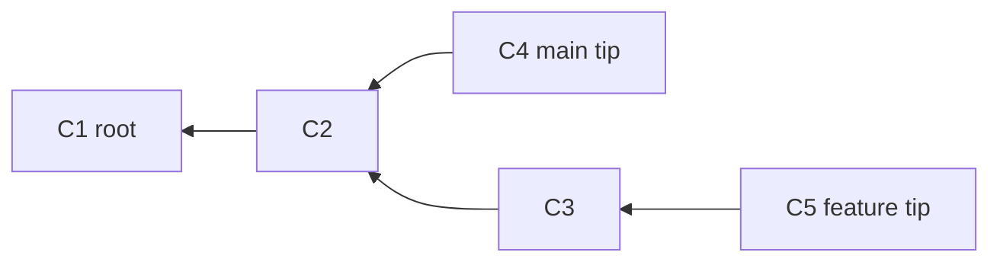
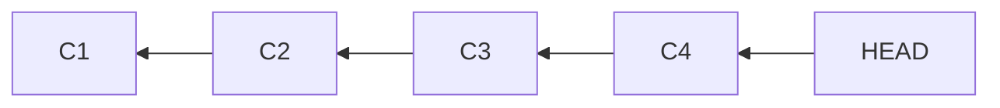
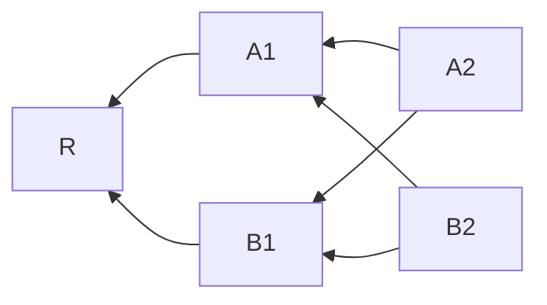
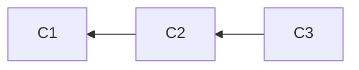
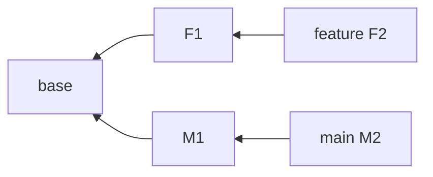
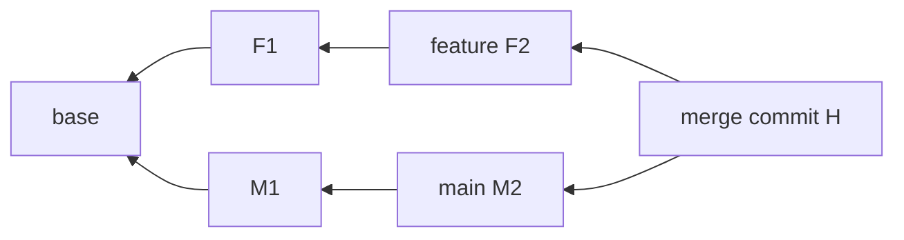

# Part 112 — Build a Mini Commit Walker

In the previous lab, we built a mini object store.

Now we build the next mental layer: a commit walker.

A commit walker answers questions like:

```text
Which commits are reachable from HEAD?
Is commit A an ancestor of commit B?
What changed since tag v1.4.0?
What commits are unique to this branch?
Where did two branches diverge?
What is the merge base?
Can this branch fast-forward?
```

Git commands such as `log`, `rev-list`, `merge-base`, `branch --contains`, `tag --contains`, `bisect`, `repack`, and many server-side connectivity checks depend on commit graph traversal.

This lab builds a small Java implementation that can:

- read commit objects from a loose object store
- parse commit payloads
- extract tree id, parent ids, author/committer lines, and message
- walk ancestry using DFS/BFS
- compute reachability
- implement simplified `A..B`
- implement simplified `A...B`
- test ancestor relationship
- compute a simple merge base
- output a topological order

We intentionally do not implement packfile reading. For this lab, commits must be loose objects in `.minigit` or a controlled test store.

The goal is to understand graph semantics, not storage optimization.

---

## 1. Mental Model: Commit Graph as a DAG

A commit object points to zero or more parent commit objects.



The arrows point from child to parent.

This direction matters.

A commit knows its parents. It does not know its children.

Therefore, walking backward through history is cheap: read a commit, read its parents, repeat.

Walking forward requires an index or scanning all commits.

---

## 2. What a Commit Object Contains

A commit payload looks like this:

```text
tree 9daeafb9864cf43055ae93beb0afd6c7d144bfa4
parent 1f30c2f88f1f2f630ac4c542f8f5ff932265e76b
author Ada <ada@example.com> 1760000000 +0700
committer Ada <ada@example.com> 1760000000 +0700

Add enforcement case transition validator
```

A merge commit has multiple `parent` lines:

```text
tree <tree-id>
parent <main-parent-id>
parent <feature-parent-id>
author ...
committer ...

Merge feature branch
```

A root commit has no parent lines.

Important invariant:

> The parent list is part of the commit identity.

Change parent order and the commit hash changes.

---

## 3. Commit Parser Data Model

```java
package minigit.walk;

import minigit.ObjectId;
import java.util.List;

public record Commit(
    ObjectId id,
    ObjectId tree,
    List<ObjectId> parents,
    String authorLine,
    String committerLine,
    String message
) {
    public Commit {
        parents = List.copyOf(parents);
    }

    public boolean isRoot() {
        return parents.isEmpty();
    }

    public boolean isMerge() {
        return parents.size() > 1;
    }
}
```

We keep `authorLine` and `committerLine` as raw strings.

A real implementation would parse names, emails, timestamps, and time zones. For graph traversal, parent ids are the important part.

---

## 4. Commit Parser

```java
package minigit.walk;

import minigit.ObjectId;

import java.nio.charset.StandardCharsets;
import java.util.ArrayList;
import java.util.List;

public final class CommitParser {
    private CommitParser() {}

    public static Commit parse(ObjectId id, byte[] payload) {
        String text = new String(payload, StandardCharsets.UTF_8);
        int split = text.indexOf("\n\n");
        if (split < 0) {
            throw new IllegalArgumentException("commit missing header/message separator: " + id);
        }

        String headers = text.substring(0, split);
        String message = text.substring(split + 2);

        ObjectId tree = null;
        List<ObjectId> parents = new ArrayList<>();
        String author = null;
        String committer = null;

        for (String line : headers.split("\n")) {
            if (line.startsWith("tree ")) {
                tree = ObjectId.parse(line.substring("tree ".length()));
            } else if (line.startsWith("parent ")) {
                parents.add(ObjectId.parse(line.substring("parent ".length())));
            } else if (line.startsWith("author ")) {
                author = line.substring("author ".length());
            } else if (line.startsWith("committer ")) {
                committer = line.substring("committer ".length());
            }
        }

        if (tree == null) {
            throw new IllegalArgumentException("commit missing tree: " + id);
        }
        if (author == null) {
            throw new IllegalArgumentException("commit missing author: " + id);
        }
        if (committer == null) {
            throw new IllegalArgumentException("commit missing committer: " + id);
        }

        return new Commit(id, tree, parents, author, committer, message);
    }
}
```

This parser is intentionally strict enough to catch broken lab objects, but not complete enough for every historical Git edge case.

For a production parser, you must handle encoding, optional headers, GPG signatures, multiline headers, and hash algorithm differences.

---

## 5. Commit Store

The walker needs a way to load commits by object id.

```java
package minigit.walk;

import minigit.GitObject;
import minigit.ObjectId;
import minigit.ObjectStore;
import minigit.ObjectType;

import java.io.IOException;
import java.util.HashMap;
import java.util.Map;

public final class CommitStore {
    private final ObjectStore objectStore;
    private final Map<ObjectId, Commit> cache = new HashMap<>();

    public CommitStore(ObjectStore objectStore) {
        this.objectStore = objectStore;
    }

    public Commit read(ObjectId id) throws IOException {
        Commit cached = cache.get(id);
        if (cached != null) {
            return cached;
        }

        GitObject object = objectStore.read(id);
        if (object.type() != ObjectType.COMMIT) {
            throw new IllegalArgumentException(id + " is not a commit: " + object.type());
        }

        Commit commit = CommitParser.parse(id, object.payload());
        cache.put(id, commit);
        return commit;
    }
}
```

The cache is not just an optimization. It also prevents repeatedly parsing the same parent when walking a graph with merges.

Real Git uses far more sophisticated data structures, including commit-graph files, generation numbers, and bitmaps.

---

## 6. Reachability Walk

A commit `X` is reachable from commit `Y` if you can start at `Y` and repeatedly follow parent links until you find `X`.



From `HEAD`, every commit above is reachable.

Implementation:

```java
package minigit.walk;

import minigit.ObjectId;

import java.io.IOException;
import java.util.ArrayDeque;
import java.util.LinkedHashSet;
import java.util.Set;

public final class CommitWalker {
    private final CommitStore store;

    public CommitWalker(CommitStore store) {
        this.store = store;
    }

    public Set<ObjectId> reachableFrom(ObjectId start) throws IOException {
        Set<ObjectId> seen = new LinkedHashSet<>();
        ArrayDeque<ObjectId> stack = new ArrayDeque<>();
        stack.push(start);

        while (!stack.isEmpty()) {
            ObjectId id = stack.pop();
            if (!seen.add(id)) {
                continue;
            }

            Commit commit = store.read(id);
            for (ObjectId parent : commit.parents()) {
                stack.push(parent);
            }
        }

        return seen;
    }
}
```

This is the core of many Git operations.

Everything else is set arithmetic over reachable commits.

---

## 7. Ancestor Test

`isAncestor(A, B)` means:

```text
Can I reach A by following parents from B?
```

```java
public boolean isAncestor(ObjectId ancestor, ObjectId descendant) throws IOException {
    return reachableFrom(descendant).contains(ancestor);
}
```

Fast-forward condition:

```text
branch can fast-forward from OLD to NEW iff OLD is ancestor of NEW
```

This explains Git's non-fast-forward rejection.

A remote branch update from `old` to `new` is safe as a fast-forward only if no existing history is discarded.

---

## 8. Two-Dot Range: `A..B`

In commit-set terms:

```text
A..B = reachable(B) - reachable(A)
```

It means:

```text
Commits reachable from B that are not reachable from A.
```

Implementation:

```java
public Set<ObjectId> twoDot(ObjectId excludedTip, ObjectId includedTip) throws IOException {
    Set<ObjectId> included = reachableFrom(includedTip);
    Set<ObjectId> excluded = reachableFrom(excludedTip);
    included.removeAll(excluded);
    return included;
}
```

Use case:

```text
What commits are on feature that main does not have?
main..feature
```

In Git:

```bash
git log main..feature
```

Do not confuse this with tree diff syntax. Commit ranges and file diffs are related but not identical mental models.

---

## 9. Three-Dot Range: `A...B`

For commit sets:

```text
A...B = symmetric difference
       = (reachable(A) union reachable(B)) - (reachable(A) intersect reachable(B))
```

In plain language:

```text
Commits reachable from either side, but not from both.
```

Implementation:

```java
public Set<ObjectId> threeDot(ObjectId a, ObjectId b) throws IOException {
    Set<ObjectId> left = reachableFrom(a);
    Set<ObjectId> right = reachableFrom(b);

    Set<ObjectId> union = new LinkedHashSet<>(left);
    union.addAll(right);

    Set<ObjectId> intersection = new LinkedHashSet<>(left);
    intersection.retainAll(right);

    union.removeAll(intersection);
    return union;
}
```

This is useful for understanding divergence.

But remember the earlier warning:

- `git log A...B` means symmetric difference of commit sets
- `git diff A...B` usually means diff from merge-base to `B`

That difference is a major source of review confusion.

---

## 10. First Simple Merge Base

A merge base is a best common ancestor.

Simplified version:

1. compute all ancestors of `A`
2. walk ancestors of `B`
3. return the first ancestor also reachable from `A`

```java
public ObjectId simpleMergeBase(ObjectId a, ObjectId b) throws IOException {
    Set<ObjectId> ancestorsOfA = reachableFrom(a);

    ArrayDeque<ObjectId> queue = new ArrayDeque<>();
    Set<ObjectId> seen = new LinkedHashSet<>();
    queue.add(b);

    while (!queue.isEmpty()) {
        ObjectId id = queue.remove();
        if (!seen.add(id)) {
            continue;
        }
        if (ancestorsOfA.contains(id)) {
            return id;
        }
        Commit commit = store.read(id);
        queue.addAll(commit.parents());
    }

    return null;
}
```

This works for simple histories.

It is not a complete implementation of Git's `merge-base` behavior.

Why?

Because there can be multiple merge bases.

---

## 11. Multiple Merge Bases

Consider criss-cross history:



Both `A1` and `B1` may be common ancestors that are not ancestors of each other.

A full merge-base implementation must find **best** common ancestors, not just any common ancestor.

A common ancestor is better than another if the other is reachable from it.

Simplified all-common-ancestors:

```java
public Set<ObjectId> commonAncestors(ObjectId a, ObjectId b) throws IOException {
    Set<ObjectId> left = reachableFrom(a);
    Set<ObjectId> right = reachableFrom(b);
    left.retainAll(right);
    return left;
}
```

Filter to best common ancestors:

```java
public Set<ObjectId> bestCommonAncestors(ObjectId a, ObjectId b) throws IOException {
    Set<ObjectId> common = commonAncestors(a, b);
    Set<ObjectId> best = new LinkedHashSet<>(common);

    for (ObjectId candidate : common) {
        for (ObjectId other : common) {
            if (!candidate.equals(other) && isAncestor(candidate, other)) {
                // candidate is older than another common ancestor, so candidate is not best.
                best.remove(candidate);
                break;
            }
        }
    }

    return best;
}
```

This is expensive but clear.

For small labs, clarity wins.

For large repositories, Git uses optimized graph traversal and commit-graph metadata.

---

## 12. Topological Order

A topological order ensures children appear before parents, or parents appear before children depending on direction.

For `git log --topo-order`, Git avoids showing a parent before all its children have been shown.

A simple child-before-parent order is easy with DFS post/pre logic.

```java
public java.util.List<ObjectId> topoChildrenBeforeParents(ObjectId start) throws IOException {
    java.util.List<ObjectId> result = new java.util.ArrayList<>();
    Set<ObjectId> seen = new LinkedHashSet<>();
    topoDfs(start, seen, result);
    return result;
}

private void topoDfs(ObjectId id, Set<ObjectId> seen, java.util.List<ObjectId> result) throws IOException {
    if (!seen.add(id)) {
        return;
    }
    result.add(id); // child before parent for Git-log-like reverse chronology skeleton
    Commit commit = store.read(id);
    for (ObjectId parent : commit.parents()) {
        topoDfs(parent, seen, result);
    }
}
```

This is not a full date-aware `git log` ordering. It is a structural traversal.

Real Git's ordering is more nuanced because humans expect useful history presentation, not just graph validity.

---

## 13. Date Order vs Topological Order

Commit timestamps are metadata.

They can be skewed, rewritten, imported, or intentionally preserved from patches.

A date-ordered log can show surprising sequences when branches merge.

A topology-aware log respects ancestry constraints.

```text
If commit A is an ancestor of commit B,
then a child-before-parent log should not show A before B.
```

This is why graph traversal cannot rely only on timestamps.

For release, audit, and incident investigation, topology often matters more than committer date.

---

## 14. Parent Order Matters

Merge commits have ordered parents.

The first parent is usually the branch into which the merge happened.

```text
parent 1 = mainline before merge
parent 2 = topic branch tip
```

This powers first-parent history:

```bash
git log --first-parent main
```

A mini first-parent walk:

```java
public java.util.List<ObjectId> firstParentLine(ObjectId start) throws IOException {
    java.util.List<ObjectId> result = new java.util.ArrayList<>();
    ObjectId current = start;

    while (current != null) {
        result.add(current);
        Commit commit = store.read(current);
        current = commit.parents().isEmpty() ? null : commit.parents().get(0);
    }

    return result;
}
```

First-parent history is extremely useful for release notes when the team uses merge commits to represent integration events.

It can be misleading if the team uses squash merge or rebase merge.

Workflow policy determines which traversal gives the right story.

---

## 15. Branch Contains Commit

A branch contains a commit if the commit is reachable from the branch tip.

```java
public boolean contains(ObjectId branchTip, ObjectId target) throws IOException {
    return reachableFrom(branchTip).contains(target);
}
```

This answers:

```text
Is this hotfix already in release/1.4?
Is this security patch included in production tag v2.3.1?
Did main receive this backport?
```

In real Git:

```bash
git branch --contains <commit>
git tag --contains <commit>
```

But note the difference:

- our function checks one known branch tip
- Git can scan many refs to find all refs that contain a commit

Scanning all refs requires a ref store.

This lab only walks commits.

---

## 16. Reachability and Release Safety

Release questions are graph questions:

```text
Does release tag v1.8.3 contain security fix S?
Is production behind main?
Did a reverted commit still ship in an earlier RC?
Can hotfix branch fast-forward to final release tag?
```

You can answer many of these with reachability:

```java
boolean shipped = isAncestor(securityFix, releaseTagCommit);
boolean canFastForward = isAncestor(oldReleaseTip, newReleaseTip);
```

This is why Git literacy matters in release engineering.

The answer is not in branch names. It is in the graph.

---

## 17. Mini CLI

```java
package minigit.walk;

import minigit.ObjectId;
import minigit.ObjectStore;

import java.nio.file.Path;

public final class MiniCommitWalkCli {
    public static void main(String[] args) throws Exception {
        if (args.length < 2) {
            usage();
            System.exit(2);
        }

        ObjectStore objectStore = new ObjectStore(Path.of(".minigit"));
        CommitStore commitStore = new CommitStore(objectStore);
        CommitWalker walker = new CommitWalker(commitStore);

        switch (args[0]) {
            case "walk" -> {
                ObjectId start = ObjectId.parse(args[1]);
                for (ObjectId id : walker.reachableFrom(start)) {
                    Commit c = commitStore.read(id);
                    System.out.printf("%s parents=%d %s%n", id.hex(), c.parents().size(), firstLine(c.message()));
                }
            }
            case "is-ancestor" -> {
                if (args.length != 3) usageAndExit();
                ObjectId ancestor = ObjectId.parse(args[1]);
                ObjectId descendant = ObjectId.parse(args[2]);
                System.out.println(walker.isAncestor(ancestor, descendant));
            }
            case "two-dot" -> {
                if (args.length != 3) usageAndExit();
                for (ObjectId id : walker.twoDot(ObjectId.parse(args[1]), ObjectId.parse(args[2]))) {
                    System.out.println(id.hex());
                }
            }
            case "three-dot" -> {
                if (args.length != 3) usageAndExit();
                for (ObjectId id : walker.threeDot(ObjectId.parse(args[1]), ObjectId.parse(args[2]))) {
                    System.out.println(id.hex());
                }
            }
            case "merge-base" -> {
                if (args.length != 3) usageAndExit();
                var bases = walker.bestCommonAncestors(ObjectId.parse(args[1]), ObjectId.parse(args[2]));
                for (ObjectId base : bases) {
                    System.out.println(base.hex());
                }
            }
            default -> usageAndExit();
        }
    }

    private static String firstLine(String message) {
        int newline = message.indexOf('\n');
        return newline >= 0 ? message.substring(0, newline) : message;
    }

    private static void usageAndExit() {
        usage();
        System.exit(2);
    }

    private static void usage() {
        System.err.println("usage:");
        System.err.println("  walk <commit>");
        System.err.println("  is-ancestor <ancestor> <descendant>");
        System.err.println("  two-dot <exclude-tip> <include-tip>");
        System.err.println("  three-dot <left> <right>");
        System.err.println("  merge-base <left> <right>");
    }
}
```

This is the mini version of several Git commands:

```bash
git rev-list <commit>
git merge-base A B
git log A..B
git log A...B
git merge-base --is-ancestor A B
```

---

## 18. Test Graph: Linear History

Create commits with the object store from Part 111:

```text
C1 <- C2 <- C3
```

Expected results:

```text
reachable(C3) = {C3, C2, C1}
isAncestor(C1, C3) = true
isAncestor(C3, C1) = false
C1..C3 = {C3, C2}
mergeBase(C2, C3) = C2
```

Diagram:



Fast-forward rule:

```text
C2 can fast-forward to C3 because C2 is ancestor of C3.
C3 cannot fast-forward to C2 because that would move backward and discard C3 from the branch tip.
```

---

## 19. Test Graph: Diverged Branches



Expected:

```text
main..feature = {F2, F1}
feature..main = {M2, M1}
main...feature = {F2, F1, M2, M1}
mergeBase(main, feature) = base
```

This is the core PR branch model.

A PR from feature to main asks:

```text
What is the diff from merge-base(main, feature) to feature?
Can the result integrate cleanly with current main?
Are feature commits still based on a stale merge base?
```

---

## 20. Test Graph: Merge Commit



Expected:

```text
reachable(H) includes main side and feature side.
firstParentLine(H) follows H -> M2 -> M1 -> B.
```

This shows why first-parent history is useful.

It follows integration events, not every side-branch commit.

---

## 21. Why Commit Walkers Need Cycle Protection

Git commit graphs should be acyclic because parent links point to already-existing commits.

But a robust walker still keeps a `seen` set.

Reasons:

- merge commits create multiple paths to the same ancestor
- malformed object stores can exist in labs/tests
- replace refs/grafts can alter apparent history in real Git
- defensive graph traversal should never infinite-loop silently

The `seen` set is a correctness guard, not just an optimization.

---

## 22. Performance Model

The naive walker reads and parses every reachable commit.

Cost:

```text
O(number of reachable commits + parent edges)
```

For small repositories, this is fine.

For very large repositories, repeated graph walks become expensive.

Git uses several accelerators:

- commit-graph files
- generation numbers
- changed-path Bloom filters
- reachability bitmaps
- pack indexes
- multi-pack-index
- negotiation algorithms

Our lab deliberately ignores them first.

You should understand the graph before optimizing the graph.

---

## 23. Commit-Graph Intuition

A commit-graph file does not change history.

It is an acceleration structure.

Instead of inflating and parsing commit objects repeatedly, Git can store selected metadata in a compact graph file:

```text
commit id
root tree id
parent positions
generation number
commit date
optional changed-path Bloom filters
```

The conceptual operation remains:

```text
walk parent links
compute reachability
filter commit sets
```

Optimization should not change semantics.

That principle is important across Git internals.

---

## 24. Failure Modes

### Failure Mode 1: Treating Branch Names as History

Wrong mental model:

```text
main contains commit X because the branch name sounds newer.
```

Correct mental model:

```text
main contains commit X if X is reachable from refs/heads/main.
```

Names are not evidence. Reachability is evidence.

### Failure Mode 2: Ignoring Merge Parent Order

A merge commit has multiple parents, but first parent often represents the integration line.

If release notes use all parents indiscriminately, they may include noisy side-branch details.

If release notes use first-parent in a squash-merge workflow, they may miss original branch structure.

Traversal must match workflow policy.

### Failure Mode 3: Using Date as Ancestry

Commit date is not topology.

A commit with an older timestamp can be a descendant of a commit with a newer timestamp because of rebases, patches, clock skew, or imported history.

Use parent links for ancestry.

### Failure Mode 4: Assuming One Merge Base Always Exists

Simple histories have one merge base.

Complex histories can have multiple best merge bases.

Any tool that assumes a single merge base should either document that limitation or handle multiple bases explicitly.

### Failure Mode 5: Walking All History in CI for Every Job

Naive graph traversal can be expensive in large repositories.

CI should choose checkout depth and history availability based on what the job actually needs:

- unit tests may not need tags/history
- changelog generation does
- affected-project detection often needs merge base
- release verification needs tags and full enough ancestry

---

## 25. Engineering Uses

A commit walker is the conceptual core behind many internal tools.

### Release Verifier

```text
Verify release tag contains approved commits.
Verify release tag does not contain blocked commits.
Verify hotfix commit is reachable from maintenance branch.
```

### Backport Planner

```text
Find commits in main not in release branch.
Filter by trailer Backport-To: release/1.8.
Check whether dependencies are already reachable.
```

### Branch Hygiene Bot

```text
Find branches whose tips are far from main.
Find branches already merged.
Find branches with no unique commits.
```

### Incident Analyzer

```text
Find first release tag containing bad commit.
Find all active branches containing vulnerable commit.
Find whether revert commit reached production line.
```

### Review Tool

```text
Compute commits unique to PR branch.
Compute merge-base drift.
Warn when PR branch was based on stale main.
```

All of these are graph queries.

---

## 26. Regulated-System Angle

In regulated systems, commit graph traversal supports evidence:

```text
Requirement -> commit -> PR -> checks -> release tag -> artifact -> deployment
```

A commit walker can help answer:

- Did this approved change ship?
- Which release first included this enforcement rule?
- Was this fix present before the incident date?
- Did emergency change bypass normal path?
- Is the production artifact traceable to an immutable tag?
- Did the rollback remove the risky commit from the release line?

The audit answer must be based on object ids and reachability, not screenshots or branch names alone.

---

## 27. Extending the Lab

### Extension 1: Read Real `.git/objects`

Point `ObjectStore` at `.git` instead of `.minigit`.

Limitations:

- only loose objects will work
- most real repos store old objects in packs
- new commits may be loose briefly before GC

### Extension 2: Fallback to `git cat-file --batch`

For real repositories, use Git itself as object reader:

```bash
git cat-file --batch
```

Your Java walker can request objects from Git while still implementing graph logic itself.

This is a powerful architecture for internal tools:

```text
Git handles storage compatibility.
Your tool handles policy and graph queries.
```

### Extension 3: Parse Refs

Add support for:

```text
refs/heads/main
refs/tags/v1.0.0
HEAD
packed-refs
```

Then the CLI can accept names instead of raw commit ids.

### Extension 4: Add Packfile Reader

This is a large step.

You would need:

- pack index lookup
- object offsets
- delta resolution
- base object resolution
- zlib streams
- thin pack caveats

Do not start here unless the graph model is already solid.

### Extension 5: Add Generation Numbers

Store a simple generation number:

```text
generation(root) = 1
generation(commit) = 1 + max(generation(parent))
```

Then use it to prune ancestor checks.

This gives intuition for Git's commit-graph acceleration.

---

## 28. Small Test Harness

A good graph lab needs deterministic commits.

Use fixed timestamps and messages so object ids are stable.

Pseudo-test:

```java
@Test
void linearHistoryReachability() throws Exception {
    ObjectId c1 = fixture.commit("C1");
    ObjectId c2 = fixture.commit("C2", c1);
    ObjectId c3 = fixture.commit("C3", c2);

    assertTrue(walker.isAncestor(c1, c3));
    assertTrue(walker.isAncestor(c2, c3));
    assertFalse(walker.isAncestor(c3, c1));
    assertEquals(Set.of(c3, c2), walker.twoDot(c1, c3));
}
```

Do not use wall-clock timestamps in tests if you want stable object ids.

Git object identity includes commit timestamps.

---

## 29. Debugging Checklist

When your walker gives a surprising answer, inspect:

```bash
git cat-file -p <commit>
git rev-list --parents <commit>
git log --graph --oneline --decorate --all
git merge-base --all A B
git merge-base --is-ancestor A B; echo $?
git log A..B --oneline
git log A...B --oneline
```

For MiniGit:

```text
1. Can the object be read?
2. Is it a commit?
3. Does parser extract all parent lines?
4. Are object ids raw/hash-correct?
5. Is traversal using a seen set?
6. Are you asking commit-set range or tree diff question?
7. Are multiple merge bases possible?
```

---

## 30. What to Remember

A commit walker is not complicated because commits are complicated.

It is complicated because real histories are complicated.

The core is simple:

```text
read commit
extract parents
walk parents
perform set arithmetic
```

From that, Git gets:

- log traversal
- branch containment
- tag containment
- fast-forward checks
- merge-base calculation
- PR commit ranges
- release boundary checks
- backport verification
- incident forensics

The big lesson:

> Git truth lives in object ids and reachability, not branch names, timestamps, screenshots, or assumptions.

Once you can write a commit walker, Git history becomes inspectable infrastructure.

---

## References

- Git documentation: `git rev-list`
- Git documentation: `git merge-base`
- Git documentation: `git cat-file`
- Git documentation: `git log`
- Git documentation: `gitrevisions`
- Git documentation: commit-graph format
