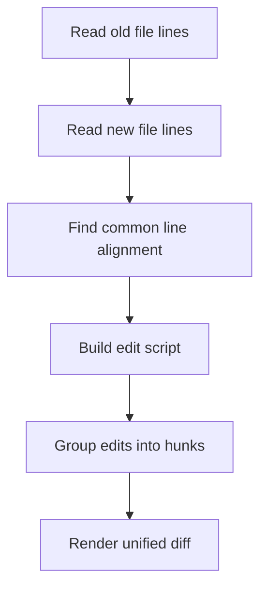

# Part 113 — Build a Mini Diff Engine

A senior engineer should not treat `git diff` as a magic text printer.

A diff is an approximation of intent. It takes two snapshots and tries to produce a useful explanation of how one snapshot can be transformed into another.

That explanation affects:

- code review quality
- bug-introducing-change analysis
- blame interpretation
- merge behavior
- patch application
- release audit
- security review
- ownership routing
- conflict resolution

In this lab, we build a small diff engine from scratch in Java.

We will not reproduce Git's full implementation. Git has multiple diff algorithms, rename detection, diffcore transformations, binary detection, word diff, custom drivers, textconv, pathspec filtering, and many performance optimizations.

Instead, we build the smallest useful engine that teaches the core model:

```text
old lines + new lines
  -> alignment
  -> edit script
  -> hunks
  -> unified diff
```

By the end, you should understand why two diff tools can show different patches for the same file pair, why a review diff is not a proof of semantic safety, and why merge behavior often depends on how changes are aligned.

---

## 1. What a Diff Engine Actually Does

Given two versions of a file:

```text
old.txt
new.txt
```

A diff engine tries to answer:

```text
Which lines are preserved?
Which lines were removed?
Which lines were added?
How should those edits be grouped for human review?
```

This is not the same as answering:

```text
What did the developer intend?
Was the change safe?
Was this a rename?
Was this refactor behavior-preserving?
Did two files move together?
```

A diff engine sees text. It does not see domain intent.

That is the first invariant.

> Diff is evidence, not truth.

---

## 2. Mental Model: Alignment Before Edits

Imagine two versions:

```text
old:
  A
  B
  C
  D

new:
  A
  C
  E
  D
```

A reasonable alignment is:

```text
  A  == A
  B  removed
  C  == C
  E  added
  D  == D
```

From that alignment, we derive edits:

```diff
 A
-B
 C
+E
 D
```

The key step is deciding which lines match.



Different algorithms may choose different alignments.

That is why Git exposes `--diff-algorithm=myers|minimal|patience|histogram`.

---

## 3. Scope of Our Mini Diff

This lab implements:

- line-based diff
- exact line equality
- LCS-based alignment
- edit script generation
- hunk grouping with context lines
- unified diff rendering
- simple CLI
- tests against controlled cases

This lab does not implement:

- Myers shortest edit script
- patience/histogram heuristics
- rename detection
- copy detection
- binary diff
- textconv
- word diff
- pathspec
- `.gitattributes`
- patch apply
- directory-level diff
- Git object reading

Why use LCS instead of Myers?

Because LCS is easier to implement correctly in one sitting. It gives a clean mental model: preserve the longest common subsequence, then classify the rest as insertions/deletions.

Git's default algorithm is not this naive dynamic-programming LCS implementation. But the conceptual layer is close enough to explain alignment, hunks, and review signal.

---

## 4. Project Layout

Create this small project:

```text
mini-diff/
  src/main/java/minidiff/
    DiffEngine.java
    Edit.java
    EditType.java
    Hunk.java
    UnifiedDiff.java
    MiniDiffCli.java
  src/test/java/minidiff/
    DiffEngineTest.java
```

Use Java 21+ if available, but this code avoids advanced dependencies.

No external library is required.

---

## 5. Data Model

A diff engine should avoid mixing three concepts:

| Concept | Meaning |
|---|---|
| line | raw content unit being compared |
| edit | atomic classification: equal/delete/insert |
| hunk | grouped edits with context for display/review |

Start with edit type:

```java
package minidiff;

public enum EditType {
    EQUAL,
    DELETE,
    INSERT
}
```

Then edit record:

```java
package minidiff;

public record Edit(EditType type, String line, int oldLine, int newLine) {
    public boolean isChange() {
        return type == EditType.DELETE || type == EditType.INSERT;
    }
}
```

Line numbers are one-based. A deletion has an old line number and no new line number. An insertion has a new line number and no old line number.

Use `0` for the side where the line does not exist.

Example:

```text
DELETE oldLine=12 newLine=0
INSERT oldLine=0  newLine=9
EQUAL  oldLine=7  newLine=7
```

---

## 6. LCS Table

The longest common subsequence table stores the length of the best alignment suffix from `(i, j)`.

For arrays `oldLines` and `newLines`:

```text
dp[i][j] = LCS length of oldLines[i:] and newLines[j:]
```

Transition:

```text
if old[i] == new[j]:
  dp[i][j] = 1 + dp[i+1][j+1]
else:
  dp[i][j] = max(dp[i+1][j], dp[i][j+1])
```

Implementation:

```java
package minidiff;

import java.util.ArrayList;
import java.util.List;
import java.util.Objects;

public final class DiffEngine {

    public List<Edit> diff(List<String> oldLines, List<String> newLines) {
        Objects.requireNonNull(oldLines, "oldLines");
        Objects.requireNonNull(newLines, "newLines");

        int[][] lcs = buildLcsTable(oldLines, newLines);
        return buildEditScript(oldLines, newLines, lcs);
    }

    private int[][] buildLcsTable(List<String> oldLines, List<String> newLines) {
        int n = oldLines.size();
        int m = newLines.size();
        int[][] dp = new int[n + 1][m + 1];

        for (int i = n - 1; i >= 0; i--) {
            for (int j = m - 1; j >= 0; j--) {
                if (oldLines.get(i).equals(newLines.get(j))) {
                    dp[i][j] = 1 + dp[i + 1][j + 1];
                } else {
                    dp[i][j] = Math.max(dp[i + 1][j], dp[i][j + 1]);
                }
            }
        }

        return dp;
    }

    private List<Edit> buildEditScript(
            List<String> oldLines,
            List<String> newLines,
            int[][] lcs
    ) {
        List<Edit> edits = new ArrayList<>();
        int i = 0;
        int j = 0;

        while (i < oldLines.size() && j < newLines.size()) {
            String oldLine = oldLines.get(i);
            String newLine = newLines.get(j);

            if (oldLine.equals(newLine)) {
                edits.add(new Edit(EditType.EQUAL, oldLine, i + 1, j + 1));
                i++;
                j++;
            } else if (lcs[i + 1][j] >= lcs[i][j + 1]) {
                edits.add(new Edit(EditType.DELETE, oldLine, i + 1, 0));
                i++;
            } else {
                edits.add(new Edit(EditType.INSERT, newLine, 0, j + 1));
                j++;
            }
        }

        while (i < oldLines.size()) {
            edits.add(new Edit(EditType.DELETE, oldLines.get(i), i + 1, 0));
            i++;
        }

        while (j < newLines.size()) {
            edits.add(new Edit(EditType.INSERT, newLines.get(j), 0, j + 1));
            j++;
        }

        return edits;
    }
}
```

This is a complete diff engine, but the output is not yet human-friendly.

---

## 7. Edit Script Example

Input:

```java
List<String> oldLines = List.of("A", "B", "C", "D");
List<String> newLines = List.of("A", "C", "E", "D");
```

Output:

```text
EQUAL  A old=1 new=1
DELETE B old=2 new=0
EQUAL  C old=3 new=2
INSERT E old=0 new=3
EQUAL  D old=4 new=4
```

That is already enough for a machine.

Humans usually need hunks.

---

## 8. Hunk Model

A hunk is a group of nearby edits with some context lines.

Unified diff uses this form:

```diff
@@ -oldStart,oldCount +newStart,newCount @@
 context
-deleted
+inserted
 context
```

Represent a hunk:

```java
package minidiff;

import java.util.List;

public record Hunk(
        int oldStart,
        int oldCount,
        int newStart,
        int newCount,
        List<Edit> edits
) {}
```

The hunk header is not just decoration. It is how patch application knows where to apply changes.

---

## 9. Group Edits into Hunks

A hunk should include:

- changed lines
- up to `context` unchanged lines before the first change
- up to `context` unchanged lines after the last change
- nearby change groups merged together if their context overlaps

Simple implementation:

```java
package minidiff;

import java.util.ArrayList;
import java.util.List;

public final class UnifiedDiff {

    public List<Hunk> toHunks(List<Edit> edits, int context) {
        List<Hunk> hunks = new ArrayList<>();
        int i = 0;

        while (i < edits.size()) {
            while (i < edits.size() && !edits.get(i).isChange()) {
                i++;
            }
            if (i >= edits.size()) {
                break;
            }

            int start = Math.max(0, i - context);
            int end = i;
            int trailingContext = 0;

            while (end < edits.size()) {
                Edit e = edits.get(end);
                if (e.isChange()) {
                    trailingContext = 0;
                } else {
                    trailingContext++;
                    if (trailingContext > context) {
                        break;
                    }
                }
                end++;
            }

            int exclusiveEnd = end;
            if (trailingContext > context) {
                exclusiveEnd = end - 1;
            }

            List<Edit> hunkEdits = List.copyOf(edits.subList(start, exclusiveEnd));
            hunks.add(buildHunk(hunkEdits));
            i = exclusiveEnd;
        }

        return hunks;
    }

    private Hunk buildHunk(List<Edit> edits) {
        int oldStart = 0;
        int newStart = 0;
        int oldCount = 0;
        int newCount = 0;

        for (Edit edit : edits) {
            if (oldStart == 0 && edit.oldLine() > 0) {
                oldStart = edit.oldLine();
            }
            if (newStart == 0 && edit.newLine() > 0) {
                newStart = edit.newLine();
            }
            if (edit.type() != EditType.INSERT) {
                oldCount++;
            }
            if (edit.type() != EditType.DELETE) {
                newCount++;
            }
        }

        if (oldStart == 0) oldStart = 1;
        if (newStart == 0) newStart = 1;

        return new Hunk(oldStart, oldCount, newStart, newCount, edits);
    }

    public String render(String oldName, String newName, List<Hunk> hunks) {
        StringBuilder out = new StringBuilder();
        out.append("--- ").append(oldName).append('\n');
        out.append("+++ ").append(newName).append('\n');

        for (Hunk hunk : hunks) {
            out.append("@@ -")
               .append(hunk.oldStart())
               .append(',')
               .append(hunk.oldCount())
               .append(" +")
               .append(hunk.newStart())
               .append(',')
               .append(hunk.newCount())
               .append(" @@")
               .append('\n');

            for (Edit edit : hunk.edits()) {
                switch (edit.type()) {
                    case EQUAL -> out.append(' ').append(edit.line()).append('\n');
                    case DELETE -> out.append('-').append(edit.line()).append('\n');
                    case INSERT -> out.append('+').append(edit.line()).append('\n');
                }
            }
        }

        return out.toString();
    }
}
```

This hunk builder is intentionally simple. Production diff output has many edge cases:

- no newline at end of file
- empty file
- binary file
- mode changes
- rename/copy headers
- combined diff for merge commits
- custom hunk headers from attributes
- path quoting
- file permission metadata

But the core idea is here.

---

## 10. CLI

Create a CLI that compares two files:

```java
package minidiff;

import java.nio.file.Files;
import java.nio.file.Path;
import java.util.List;

public final class MiniDiffCli {
    public static void main(String[] args) throws Exception {
        if (args.length != 2) {
            System.err.println("usage: mini-diff <old-file> <new-file>");
            System.exit(2);
        }

        Path oldPath = Path.of(args[0]);
        Path newPath = Path.of(args[1]);

        List<String> oldLines = Files.readAllLines(oldPath);
        List<String> newLines = Files.readAllLines(newPath);

        DiffEngine engine = new DiffEngine();
        UnifiedDiff unified = new UnifiedDiff();

        List<Edit> edits = engine.diff(oldLines, newLines);
        List<Hunk> hunks = unified.toHunks(edits, 3);

        System.out.print(unified.render(oldPath.toString(), newPath.toString(), hunks));
    }
}
```

Example:

```bash
cat > old.txt <<'EOF'
class Account {
  boolean active;
  int balance;
}
EOF

cat > new.txt <<'EOF'
class Account {
  boolean active;
  long balance;
  String status;
}
EOF

java minidiff.MiniDiffCli old.txt new.txt
```

Expected output:

```diff
--- old.txt
+++ new.txt
@@ -1,4 +1,5 @@
 class Account {
   boolean active;
-  int balance;
+  long balance;
+  String status;
 }
```

---

## 11. Why Alignment Can Mislead Review

Consider repetitive code:

```text
if (valid) {
  handle();
}
if (valid) {
  audit();
}
```

Changed to:

```text
if (valid) {
  audit();
}
if (valid) {
  handle();
}
```

A naive diff might align repeated braces and repeated conditions poorly.

The patch could look larger or smaller than the human-intended operation.

This is why Git offers algorithms such as patience and histogram. They aim to improve human review signal in cases with repeated lines and low-information anchors.

But no textual diff algorithm understands your domain model.

In a regulatory case-management system, these are not equivalent merely because lines moved cleanly:

```text
validatePermission()
transitionState()
writeAuditEvent()
notifySupervisor()
```

Changing order may change correctness.

A diff engine can show movement. It cannot prove lifecycle safety.

---

## 12. Diff Algorithm Trade-off Table

| Algorithm idea | Strength | Weakness |
|---|---|---|
| naive line-by-line | trivial | terrible for insert/delete shifts |
| LCS dynamic programming | easy to reason about | expensive memory/time for large files |
| Myers | efficient shortest edit script | can produce noisy hunks for some code layouts |
| minimal | tries harder for smaller diff | can cost more CPU |
| patience | better human signal in some reordered/repetitive code | heuristic, not always smallest |
| histogram | extension of patience using low-occurrence lines | can still have pathological cases |

For production Git usage, the question is usually not:

```text
Which algorithm is mathematically pure?
```

The better question is:

```text
Which algorithm produces the best review signal for this change shape?
```

---

## 13. Rename Detection Is Not Object Identity

Git stores snapshots.

A file rename is not a first-class object event stored in the commit object.

Rename detection is inferred by comparing deleted and added paths and estimating similarity.

A tiny model:

```text
old path deleted + new path added + high content similarity => likely rename
```

This has consequences:

- pure rename is usually easy to detect
- rename plus large rewrite may look like delete/add
- split file may look like deletion plus multiple additions
- generated files distort similarity
- binary files are hard to reason about
- review UIs may hide real semantic changes under a rename

Do not confuse "Git detected a rename" with "the change was safe".

---

## 14. Add a Simple Similarity Score

We can add a toy similarity score using LCS length:

```java
package minidiff;

import java.util.List;

public final class Similarity {
    public double lineSimilarity(List<String> a, List<String> b) {
        if (a.isEmpty() && b.isEmpty()) return 1.0;
        int lcs = lcsLength(a, b);
        int max = Math.max(a.size(), b.size());
        return (double) lcs / max;
    }

    private int lcsLength(List<String> a, List<String> b) {
        int[][] dp = new int[a.size() + 1][b.size() + 1];
        for (int i = a.size() - 1; i >= 0; i--) {
            for (int j = b.size() - 1; j >= 0; j--) {
                if (a.get(i).equals(b.get(j))) {
                    dp[i][j] = 1 + dp[i + 1][j + 1];
                } else {
                    dp[i][j] = Math.max(dp[i + 1][j], dp[i][j + 1]);
                }
            }
        }
        return dp[0][0];
    }
}
```

This is not Git rename detection. It is only a teaching model.

But it reveals the core idea: rename/copy detection needs a similarity heuristic because the commit object itself does not say "rename".

---

## 15. Testing the Engine

Write tests around invariants, not only snapshots.

```java
package minidiff;

import org.junit.jupiter.api.Test;

import java.util.List;

import static org.junit.jupiter.api.Assertions.*;

class DiffEngineTest {

    @Test
    void detectsDeletionAndInsertion() {
        DiffEngine engine = new DiffEngine();

        List<Edit> edits = engine.diff(
                List.of("A", "B", "C", "D"),
                List.of("A", "C", "E", "D")
        );

        assertEquals(List.of(
                EditType.EQUAL,
                EditType.DELETE,
                EditType.EQUAL,
                EditType.INSERT,
                EditType.EQUAL
        ), edits.stream().map(Edit::type).toList());
    }

    @Test
    void identicalFilesProduceOnlyEqualEdits() {
        DiffEngine engine = new DiffEngine();
        List<Edit> edits = engine.diff(List.of("A", "B"), List.of("A", "B"));
        assertTrue(edits.stream().allMatch(e -> e.type() == EditType.EQUAL));
    }

    @Test
    void allNewLinesAreInsertionsWhenOldIsEmpty() {
        DiffEngine engine = new DiffEngine();
        List<Edit> edits = engine.diff(List.of(), List.of("A", "B"));
        assertEquals(List.of(EditType.INSERT, EditType.INSERT), edits.stream().map(Edit::type).toList());
    }
}
```

Useful invariants:

```text
EQUAL + DELETE lines reconstruct old file.
EQUAL + INSERT lines reconstruct new file.
Every old line appears exactly once as EQUAL or DELETE.
Every new line appears exactly once as EQUAL or INSERT.
```

Add reconstruction tests:

```java
static List<String> reconstructOld(List<Edit> edits) {
    return edits.stream()
            .filter(e -> e.type() != EditType.INSERT)
            .map(Edit::line)
            .toList();
}

static List<String> reconstructNew(List<Edit> edits) {
    return edits.stream()
            .filter(e -> e.type() != EditType.DELETE)
            .map(Edit::line)
            .toList();
}
```

This is the kind of invariant that makes implementation trustworthy.

---

## 16. Compare with Git

Git can compare two arbitrary files without a repository:

```bash
git diff --no-index old.txt new.txt || true
```

Try:

```bash
git diff --no-index --diff-algorithm=myers old.txt new.txt || true
git diff --no-index --diff-algorithm=patience old.txt new.txt || true
git diff --no-index --diff-algorithm=histogram old.txt new.txt || true
```

Then compare with your mini diff output.

Do not expect byte-for-byte identical output.

The target is conceptual alignment:

- preserved lines should be stable
- inserted/deleted lines should make sense
- hunks should be reviewable
- output should reconstruct old/new sides

---

## 17. Complexity

Our DP table costs:

```text
time:   O(n * m)
memory: O(n * m)
```

That is unacceptable for very large files.

This is why production tools use more sophisticated algorithms and memory optimizations.

A 20,000-line file compared to another 20,000-line file would require 400 million table cells. With 4-byte integers, that is about 1.6 GB just for the DP table.

The mental model is useful. The implementation is not production-grade.

---

## 18. Diff and Review Signal

A good diff for code review should optimize for:

| Property | Meaning |
|---|---|
| locality | related changes appear together |
| stable anchors | unchanged context helps orientation |
| low noise | whitespace/generated churn minimized |
| semantic boundaries | refactor and behavior changes separated |
| auditability | reviewer can reconstruct intent |

A bad diff can pass all syntax checks and still hide risk.

Examples:

- rename + behavior change in same commit
- formatting + logic change in same hunk
- generated file noise burying hand-written code change
- lockfile churn hiding dependency upgrade
- test snapshot update hiding behavior change
- migration file added without rollback/compatibility note

A strong team designs commit and PR policy to improve diff signal before review even starts.

---

## 19. Mini Diff Engine as a Platform Primitive

Once you have edit scripts, you can build more tooling:

```text
edit script
  -> review risk classifier
  -> generated file detector
  -> sensitive-path audit
  -> semantic patch grouping
  -> release note candidate extractor
  -> migration detector
  -> conflict predictor
```

Example risk rule:

```text
if file path matches authz/* and diff contains "allow" or "bypass":
  require security owner review
```

Or:

```text
if changed lines include migration and application code in same PR:
  require expand/contract migration checklist
```

The diff engine is not the whole policy. It is the sensor.

---

## 20. Failure Modes

### Failure Mode 1: Treating Smaller Diff as Safer

A smaller diff is not always safer.

A one-line permission change can be higher risk than a thousand-line generated snapshot.

### Failure Mode 2: Ignoring Algorithm Choice

Different algorithms can produce different hunks. If your review or mining tool depends on hunk boundaries, algorithm choice matters.

### Failure Mode 3: Reviewing Rename + Logic Together

If a file is moved and behavior changed in the same commit, reviewer attention splits between "where did it go?" and "what changed?".

Prefer:

```text
commit 1: pure rename/move
commit 2: behavior change
```

### Failure Mode 4: Trusting Textual Diff for Semantic Merge Safety

Textual diff cannot prove semantic safety.

Two changes can merge without textual conflict but still violate business invariants.

### Failure Mode 5: Building Policy on Pretty Output

Do not parse human diff output if a structured API is available.

For Git automation, prefer stable porcelain/plumbing formats when possible.

---

## 21. Exercises

1. Add `--context=<n>` to the CLI.
2. Add an option to ignore whitespace-only differences.
3. Add reconstruction tests for random small inputs.
4. Implement a memory-optimized LCS length function using two rows.
5. Add a similarity report for deleted/added files.
6. Compare your output against `git diff --no-index` for 20 examples.
7. Build a risk classifier that flags diffs touching `auth`, `migration`, `config`, or `ci` paths.
8. Extend hunk headers with function names using a naive regex for Java methods.

---

## 22. Engineering Takeaways

A diff engine converts two snapshots into a reviewable explanation.

The explanation is useful, but lossy.

Strong engineers understand this boundary:

```text
snapshot comparison != developer intent
small diff != low risk
clean diff != semantic safety
rename detection != proof of movement-only change
review UI != full repository truth
```

When building Git tooling, treat diff as an input signal, not the final authority.

---

## References

- Git documentation: `git diff`
- Git documentation: diff options and diff algorithms
- Git documentation: `gitdiffcore`
- Pro Git: Git Internals and advanced diff/review concepts
- Myers, Eugene W. "An O(ND) Difference Algorithm and Its Variations"
